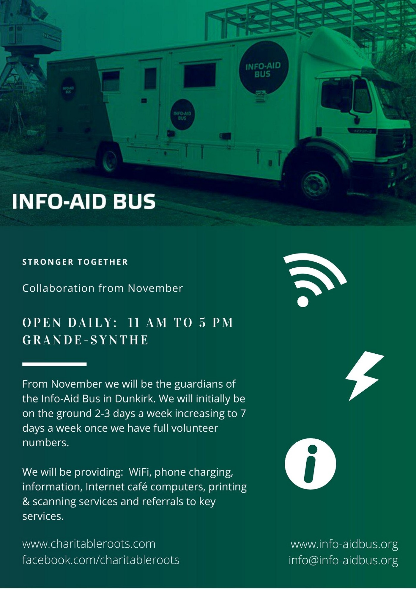
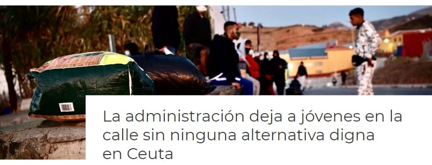
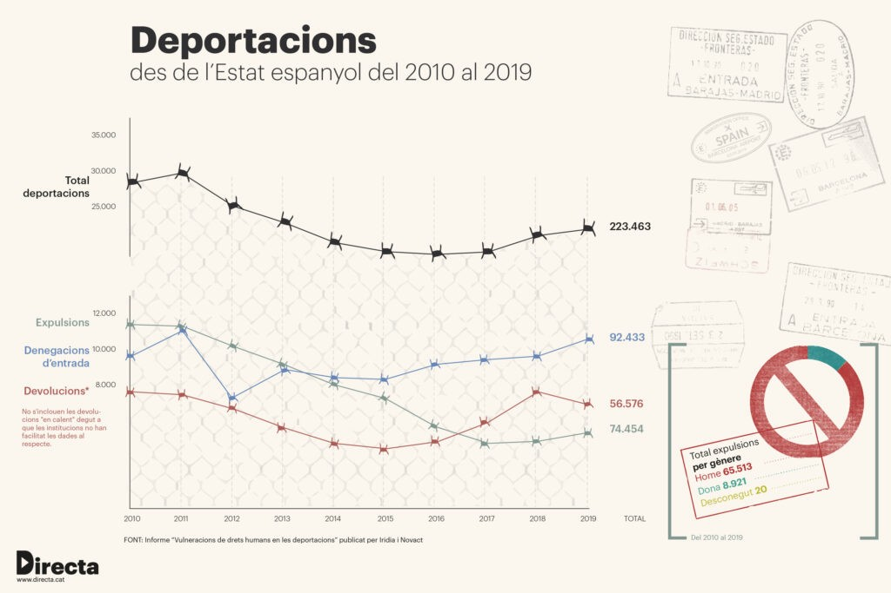

### AYS Daily Digest 8/10/20: People starving under the UN’s care
#### Libya: 500 children detained in Libyan internment camps in the past 6 months / Spain: report on the lucrative business of border control / UK: using islands, ships, and oil rigs to hold off the people crossing the English Channel / recommended essential reads and more info

](assets/5ed5e7fe42e6/1*FHAt55UrkvgJrSfgiWaiUA.jpeg)

Photo: [Giulia Tranchina](https://www.facebook.com/rastajuly?__cft__[0]=AZWAgMZdlVayGmA0RL5GIQBoJJRtoifcsCguXzjlUEp_uVJeg9x7LX3VEC-j2-HXXiVkz_uytcqeMXJNcQCLd7EFMpD-JSXEFVci7zyFvZL-biVq38XQqD7bw2_V-UOzJjGNSEzTfUvzuIh9Y1LUKLVthKVNg18X6Y2MJ-aVsRHpHLLi9LxSlT4f3L3QYIpgFf2dXpNoSi8H5W_DHq0-5syetW5r1JhBQ9IrArYdLMCfqw&__tn__=-UC*F)
#### FEATURED

At the same time as the UN’s WHP was given the prize for its efforts to combat hunger and improve conditions for peace, tens of thousands of people across at least two continents continue to feel abandoned by UN organisations, namely IOM and UNHCR\. This is due to a lack of vocal concern being put into action, a lack of concrete solutions, and propulsive spending of the lucrative sums directed at migration management across the so\-called routes through Europe, but also at the sources of people’s misery they are trying to escape from\. It is reported that in Niger’s transit refugee camp of Hamdllaye, managed by UNHCR, people have not been given any food for 3 full days and are starving\. According to the reporter Giulia Tranchina, the UNHCR says they are having issues with the food contractor in Niamey due to payment problems, but so far no solution has been found\. Children, sick people, pregnant women — left with no food at all for 3 days\. So\-called vulnerable categories of people on the move, many Eritreans, Sudanese and Somali, who have been evacuated from Libya, are now left starving\. Some of these people have been abandoned in Niger for more than two years\.

> Many are now weak and malnourished, some are receiving drips at the hospital\. The situation is very serious\. They need an immediate solution to this tragic denial of food and urgent resettlement to safety\. 

Inhumane conditions, lack of food, and criminally hypocritical policies by EU countries are subjecting these people, women and children to further suffering and ill\-treatment\. They need immediate relief, food and resettlement, [Tranchina](https://www.facebook.com/rastajuly?__cft__[0]=AZWAgMZdlVayGmA0RL5GIQBoJJRtoifcsCguXzjlUEp_uVJeg9x7LX3VEC-j2-HXXiVkz_uytcqeMXJNcQCLd7EFMpD-JSXEFVci7zyFvZL-biVq38XQqD7bw2_V-UOzJjGNSEzTfUvzuIh9Y1LUKLVthKVNg18X6Y2MJ-aVsRHpHLLi9LxSlT4f3L3QYIpgFf2dXpNoSi8H5W_DHq0-5syetW5r1JhBQ9IrArYdLMCfqw&__tn__=-UC%2CP-y-R) reminds us\.
#### SEA

A group of European NGOs was joined by many international scholars in publishing a [joint statement](https://www.opendemocracy.net/en/can-europe-make-it/joint-statement-sea-rescue/?fbclid=IwAR2yfTt1oFIkZlhorM_AVlJbaM-j_D0w6jTFTlFGuHSDbSYMA_Uzs8Aiicg) on the value of sea rescue missions in the Mediterranean\.
#### LIBYA
### Protests against the UN’s inertia after the tragic attack

An alarming increase in the number of people detained in Libya has been reported\. In an internment camp in Tripoli, the number of prisoners rose from 23 to over 1,000 in the last two weeks of September, although the camp was designed to supply 150 a mere people per day\.

> For children, this is a deeply harrowing experience\. When they are brought back, they don’t just need medical care so their wounds can be treated\. They also need psychological support so that they can better cope with what they have seen and experienced\. — IRC Libya 

COVID testing capacities must be increased nationwide and access to health and protection services for people on the move, and the IRC is calling for an immediate end to this arbitrary detention\.

 people protesting by the UNHCR office in Guruji, Libya, against the lack of access to asylum and protection, and the lack of action of IOM and UNHCR in this regard\. \(Photo: [Watch The Med — Alarmphone](https://www.facebook.com/watchthemed.alarmphone/?__cft__[0]=AZWzVRmMWOAPIvN_Ik7W55LJVMVP2mi4Pyd5ZEzJG1H0f7rNPpPsC2nfb_KAQu6EJrO5gwIeUawlNiEigMSs_T3HZUE66HC_WEkO4M7dSxsifdG71aEigxmvDJ17kfDDG-eukLLbsdsvZrP6psdMhHnaoOE--5DBt-byiYaFYjaTgpA_iz2NvUCb764YWc0lS7CGnpN12tLl2BaSJjiMEgW2dj1gMiRuljecH8zcWBLs7W6pJ1Kia5E503LVnLNX7Ho&__tn__=-UC*F) \)](assets/5ed5e7fe42e6/0*S-HjsccjMyGVsxEA)

A [group of Sudanese](https://www.facebook.com/watchthemed.alarmphone/) people protesting by the UNHCR office in Guruji, Libya, against the lack of access to asylum and protection, and the lack of action of IOM and UNHCR in this regard\. \(Photo: [Watch The Med — Alarmphone](https://www.facebook.com/watchthemed.alarmphone/?__cft__[0]=AZWzVRmMWOAPIvN_Ik7W55LJVMVP2mi4Pyd5ZEzJG1H0f7rNPpPsC2nfb_KAQu6EJrO5gwIeUawlNiEigMSs_T3HZUE66HC_WEkO4M7dSxsifdG71aEigxmvDJ17kfDDG-eukLLbsdsvZrP6psdMhHnaoOE--5DBt-byiYaFYjaTgpA_iz2NvUCb764YWc0lS7CGnpN12tLl2BaSJjiMEgW2dj1gMiRuljecH8zcWBLs7W6pJ1Kia5E503LVnLNX7Ho&__tn__=-UC*F) \)

Libya is notorious for being highly unsafe for people on the move, with repeated, widespread, and severe human rights abuses against mostly Sub\-Saharan Africans trying to escape the misery in their countries of origin and slave\-like conditions in Libya\. Yet another violent aggression occurred on 7 October, where [three Libyans on Tuesday](https://apnews.com/article/libya-migrant-workers-tripoli-crime-africa-b6ebe895526d00d707bf9ea6edf94131?fbclid=IwAR2leM7BaYkdOOpVZoEQuh7iOsta4E9ghEB4GFAyeME9_KqhflsLrY--6tA) stormed a factory in the Tripoli neighborhood of Tajoura, where Sub\-Saharan African migrant workers were working\. **The** **Libyans detained one of the workers, a Nigerian, poured gasoline on him, and set him on fire**

So far in 2020, the IOM has reported around 200 deaths of migrants in Libya and at least 275 missing in the Mediterranean Sea\. Around 9,500 were returned to Libya this year, compared to 9,225 in 2019\.

> Europe still acts as if Libya were a safe space for migrants, with countries like Italy still collaborating with Libyan authorities on patrolling the Mediterranean and conducting rescue missions\. 

#### TURKEY

Turkish aid group Development Workshop has [published a report](https://www.thenational.ae/world/europe/syrian-refugees-in-south-east-turkey-need-food-water-and-schools-1.1090461?fbclid=IwAR37tGZ8-s8IiS9KDUp17k6oSuXemkQVKNd8L0qmhuqrOR00socpsyR70V8) on vulnerable communities of displaced Syrian refugees in south\-eastern Turkey, in the makeshift camps and neighbourhoods in Adana, Gaziantep and Sanlifurna\. The report highlights the struggles of these groups to see their basic needs \(access to clean water, toilets and education\) met at the makeshift camps\.

Among the 20 communities surveyed, no children were enrolled in preschool, with very few attending primary and secondary school\. Poor accommodation was also identified as a major concern, with a majority of those surveyed found to be living in single rooms or tents and sleeping on bare concrete or earth\. The report calls for increased humanitarian support for these communities\.
#### GREECE
### Kara Tepe, Lesvos

Today the camp was hit with heavy rain, and as predicted, many areas of the camp were flooded\. What little possessions people had got soaking wet, and there is now standing water in the tents, most of which are pitched directly on the ground, some even without flooring\. What you see is the result of a few hours of rain — one can only imagine what it will be like when winter really sets in, ABR reported\.

■■■■■■■■■■■■■■ 
> **[Stavros Malichudis](https://twitter.com/Malichudis) @ Twitter Says:** 

> > Today it rained in Lesbos and this is how people inside "Moria 2.0", the new camp, have to live.

Photos sent from asylum seeker living in the camp.

He has been in Greece for 10 months already, and still doesn't know when his asylum interview will take place. https://t.co/NrTG2ofi1L 

> **Tweeted at [2020-10-08 16:33:51](https://twitter.com/malichudis/status/1314242613675995137).** 

■■■■■■■■■■■■■■ 

Here is another v [ideo](https://www.facebook.com/MoriaCoronaAwarenessTeam/?ref=page_internal) from volunteers in Greece that shows the conditions faced by people in the Moria 2…

A ministry spokeswoman ha [s announced](https://l.facebook.com/l.php?u=https%3A%2F%2Fwww.rnd.de%2Fpolitik%2Fneues-fluchtlingslager-auf-lesbos-kapazitaten-noch-nicht-ausgereizt-insgesamt-fur-10000-menschen-ausgelegt-62NIGGXB7KFTURGQRJAJFY64V4.html%3Ffbclid%3DIwAR3_0mV-WvgJK1cSKcuxJB6F7BC2Pw-BS1GvhvYm0gFs4w5BtgBDlBxY_48&h=AT1QIpaO_nz6u-VWP_Rovc_25kbGwW5ZbgVH0GBRqg8GZK5NGHSZLJEcWOtlqajNFFgca62ua0qKOPmJWkAvrFh9xaa61-3qu_NX1ODscU8qb3gb4Ave73GvePo3aS8KG-cx4qsqIGvQww&__tn__=R]-R&c[0]=AT3FHD-Yi9c8KGApAOJgbGeDpRj_VTBFbK2ihFToeezh-V749_4KDK8zKM3kOT2TaZV-m9NpXRa35THwmzF9k1p2dMMX895jUc1JARag9k04JWY-9z5hZvOzb8KY9a6uw_jiJch3pFCTUTMpw2DAgrDUzHBX6AsrIyEDneb_W3PDkjYutUdndsKL5fFKgTUG2MVnAI2aI9j6nsPKxIzLpsDDN0y7tW673gr8mZgLS4czyqvbezI) that the reception capacity has not yet been exceeded, so they obviously intend to squeeze in more people to suffer, only in a new location\.

#### SERBIA

There are currently 1,000 people from Syria, Afghanistan, Palestine, and Libya in the open air in Subotica and Horgos\. Many sleep in the campyard, without access to food\. During the visit to our office, we gave them humanitarian aid, warm clothes and means of protection from COVID\.

■■■■■■■■■■■■■■ 
> **[Azil u Srbiji Asylum Protection in Serbia](https://twitter.com/APC_CZA) @ Twitter Says:** 

> > U Subotici i Horgošu sa okolinom trenutno boravi 1000 ljudi iz Sirije, Avganistana, Palestine, Libije na otvorenom. Mnogi spavaju u dvorištu kampa, bez pristupa hrani. Pri poseti našoj kancelariji, dali smo im humanitarnu pomoć, toplu odeću i sredstva za zaštitu od COVID-a. https://t.co/zhUWILvDrd 

> **Tweeted at [2020-10-08 07:38:09](https://twitter.com/apc_cza/status/1314107803544498177).** 

■■■■■■■■■■■■■■ 

#### FRANCE

> Roots is currently not onsite due to volunteers visiting family and learning new skills for the upcoming winter\. Geoff, one of our long\-term volunteers, is currently upskilling so we can start our exciting collaboration with the Info\-Aid Bus in November while Tom is busy gathering new equipment for the operation\. 

> Info\-Aid bus is a small team of dedicated volunteers who have created mobile information busses to support and host organisations on the ground by offering services and space for a range of different projects\. Roots will be the guardians of the bus: deploying it in Grande\-Synthe, setting up spaces to be used by organisations and streamlining the usage of onboard equipment such as a continual power supply to charge phones, an internet cafe\-style computer service, wifi as well as referral services\. 

> The current pandemic has made it extremely difficult for all organisations to meet people’s needs, and constant hostility exerted by the authorities means that services are in incredible demand\. Roots has been reduced to an onsite team of two\. In order to get started with our projects, we need you\! Check out the poster below to see what you would be working on in the Info\-Aid bus\. 

> If you are able to volunteer for a minimum of 2 weeks, please email us at enquiries\.roots@gmail\.com or send us a direct message on Facebook\. 

> Alternatively if you are an organisation wishing to use the space, please get in touch with the Info\-Aid Bus team at info@info\-aidbus\.org\. 

■■■■■■■■■■■■■■ 
> **[Shoaib M Khan](https://twitter.com/ShoaibMKhan) @ Twitter Says:** 

> > ECtHR: The dissolution of extreme right-wing organisations in France did not breach the ECHR. The organisations had abused their right to freedom of association, and their dissolution was justified and necessary for public safety and to protect the rights of others. https://t.co/3WT9tUjUhb 

> **Tweeted at [2020-10-08 11:12:56](https://twitter.com/shoaibmkhan/status/1314161853245816833).** 

■■■■■■■■■■■■■■ 

ECtHR: The dissolution of extreme right\-wing organisations in France did not breach the ECHR\. The organisations had abused their right to freedom of association, and their dissolution was justified and necessary for public safety and to protect the rights of others\.
#### SPAIN
### Overcrowded CETI threatens the people’s wellbeing

The local CETI in Melilla is currently at double its capacity: there are about 1,400 people,150 of them children, although it was constructed for only 700\. The centre presents a growing concern, especially in the context of the pandemic\.

> At the beginning of the month, the center had exceeded 130 infections and 400 isolated close contacts among its residents almost a month and a half later since the first positive case of coronavirus was detected\. 

The Government reportedly explained that it was working to provide alternative spaces to alleviate the situation of these people\. However, Oxfam and other organisations have already demanded that measures be taken as soon as possible to prevent a tragedy similar to the one in Moria, especially since everyone can see it coming…
### People left abandoned and homeless across Ceuta

COVID\-19 has revealed that the Child Protection System is fragile and the structures are weak, activists from [Maakum Ceuta](https://www.facebook.com/Maakum-Ceuta-459655701230217/?__cft__[0]=AZVGlhp8_qNzkUAIndOvbMJ_IoKxawh5OBUB7SWsC0U1UcARd3J-tlvt4K5HM2FnffdXlKZuG9VhPhcvd1SbyDHJkwHgFXrR3W1idNm72F61sK3v3ctBVh30J7TQlaMLr9XOTYqTxFMyMMZXrgdLflHsVcmeTiHEeWmlMcIfFU5Eny0t6n1-H2yehnU-8h4eNn4&__tn__=-UC*F) reported\. They claim that the city of Ceuta did not provide resources for helping young people, nor adults\. Homelessness is a huge issue, and many people who were in the streets ended up in provisional accommodation like pavilions and similar places, all in conditions that present serious danger and are nowhere near humane\.

> With the new normality, instead of seeing an opportunity to improve the care infrastructures of the homeless in our city, the facilities where people were in transit have been closed\. This has prompted many young people to find themselves without even a roof, absolutely unprotected before an Administration that has a duty to protect them\. However, we consider Piñers not at all a suitable place for anyone to spend the winter\. 

Maakum Association demands:
- **The relocation of all the boys to a center in decent health conditions, i\.e\. not the Piñers\.**
- **Policies that watch over human rights**
- **Resources for people in transit and street situation**
- **Documentation of minors leaving the Temporary Real Center**
- **Legal and legal guide and accompanying persons in transit**

> **In the last decade, forced deportations have become an increasingly commonplace practice in many European countries, leading to a high number of human rights violations\.** 

A total of 223,463 people were deported by Spain between 2010 and 2019, according to data from the Spanish Interior Ministry, which includes [the report _Human rights violations in deportations_](https://iridia.cat/wp-content/uploads/2020/10/Deportaciones2.pdf) , made public this morning by the organizations [Novact](https://novact.org/?lang=es) , International Institute for Nonviolent Action, and [Iridia](https://iridia.cat/es/) , center for the defense of human rights\. The report offers an interesting take on the lucrative business of border control as well\. Find more [here](https://directa.cat/sobreviure-sota-lamenaca-de-la-deportacio/?fbclid=IwAR2Cbz2PlzIkZRZ0OIvO7zfuT3PZq-3-SIMnHwEsLJ539j75vK6V0sWEtnc) \.

#### UK
### Moving forward with testing the Australian deterrence system

In spite of criticism and common sense, the UK plans to move forward with the Australia\-style system of deterrence\. They intend to put people on disused ferries before they reach the UK, ‘moving forward’ with the previously proposed plan, despite previous government denials, [it has been reported](https://metro.co.uk/2020/10/08/plan-to-put-asylum-seekers-on-disused-ferries-off-uk-coast-moving-forward-13389600/?ito=newsnow-feed&fbclid=IwAR1R9XdFokNDMxZCZMo1telZBDtkC0cdTB6fV0iAWYgKA-VvNH5ZGfUCxWA) \. The plan is to buy two boats and turn them into processing centres off the coast of Portsmouth\. This news follows reports last week that the Home Office is considering using islands, ships, or even oil rigs to hold off the people crossing the English Channel\. While the number of people crossing has increased, this appears to be a disproportionate reaction to what are still relatively small numbers, especially if compared with those of other European coastal countries\.

Although this plan is still unconfirmed, it seems to be very much in line with a harsher set of anti\-immigration policies brought forward by the British conservative government and its Home Secretary, Priti Patel\. For more on deportations and voluntary returns in the UK, see [here\.](https://migrationobservatory.ox.ac.uk/resources/briefings/deportation-and-voluntary-departure-from-the-uk/)
#### EUROPE

Two interesting reflections on the [EU’s migration policy](https://www.theguardian.com/world/2020/oct/08/europe-migration-crisis-prejudice-eu-refugee-orban-christian?fbclid=IwAR0HE1N5yjLihB4esnPDt2CMWreRbQYCeCNVaVEsr965rzCVKlT65onHBD4) , and the European internal contradictions with regards to [endemic racism](https://www.socialeurope.eu/why-europe-has-a-racism-problem?fbclid=IwAR1z8VrP8NKuGqwB7C0jSaTQPbrZ-Qkla-8--fuxvlhrH2uJ1pJIGjuVLo4) , anti\-migration sentiments and unwillingness to host refugees and migrants within European borders — particularly from the side of the Visegrad Four countries \(Poland, Hungary, Czechia, Slovakia\) \.
#### GLOBAL

International standards of refugee protection have been severely tested in 2020 as a result of the [COVID\-19](https://www.devdiscourse.com/news?tag=COVID-19) pandemic, [UNHCR](https://www.devdiscourse.com/news?tag=UNHCR) , the UN Refugee Agency’s, [international protection chief Gillian Triggs said today\.](https://www.devdiscourse.com/article/headlines/1243126-global-standards-of-refugee-protection-tested-as-a-result-of-covid-19)

“Particularly shocking has been the denial of disembarkation of boats carrying asylum seekers adrift in the Mediterranean and the Andaman Sea — the contrary of course to that maritime tradition of rescues of those at peril,” said Triggs\.

On the other hand, Triggs noted some positive developments, with some European cities willing to establish mechanisms to host and aid refugees during the pandemic\.
#### WORTH READING

This text goes to the core of the deeply flawed claims of European values at the same time as we, as Europe, leave fellow humans to the misery of modern\-day concentration camps like Moria in Greece — an important read for anyone involved in human rights and politics in Europe today\.

On the 17th of October, hundreds of thousands of migrants and _sans\-papiers_ will storm Paris from all over France\. The Transnational Migrant Coordination calls all migrants, refugees, asylum seekers, collectives, groups and supporters, to demonstrate throughout Europe and beyond\.

[](https://l.facebook.com/l.php?u=https%3A%2F%2Fwww.coordinamentomigranti.org%2F2020%2F09%2F24%2Four-freedom-within-and-beyond-the-borders-of-europe-17-october-transnational-day-of-struggle-of-migrant-men-and-women%3Ffbclid%3DIwAR0KPo_J5wXZxgYVLxo1tZAI08SBQzgOBifZ-R85a3Hodf7nAlJJekRsCsY&h=AT2CVz1mCGKBvI_62qAyRM9yTQTPANRQDaoRMqlUx1xlec_ISGxf1nMMStOmZC9HfGDYX2CcNwUDUlGfMRCuJj0VO8V1K6saFMyKxg9zc1a8NZnqaZc5PXxzg0J0TPZPfl1lI6K8tuIXrQ&__tn__=R]-R&c[0]=AT26_6wFt2cg6bNmFEl4MCZIypa3wxztOH6eDIFp_0P960iBZZvNj8sgV2DR3oY-jOTXcbwEg8BLLZncAGI00TTX7p3LiIys4BbxsHO4xip7HmZWX-7K6nZ89ETz0K-k5VHXAdbMq5S7JdeV4MU3v8-j-ePQVWujc2aoaqtI3hVQJemqjkeGdcDHacKG9BhV_jYNZeraYsRi5FzA)

[](https://l.facebook.com/l.php?u=https%3A%2F%2Fwww.socialeurope.eu%2Fwhy-europe-has-a-racism-problem%3Ffbclid%3DIwAR3iHpmiQA_l0baqowWIJXSNZBm0iPs72aBwYXplfJkc-M16RyMuC3qDApM&h=AT2fWhb22yXQCwNszouiGyArqQk1sbsihhrHgwgB2hVvYFYhBfT86C52ijagb7uAMGZaBh-rZuTj2hy1HnSMIk7MiV8OYSRkeDAho7QL5mjUtLdkLAM_CyQsWdCxnW13DQ&__tn__=%2CmH-R&c[0]=AT26_6wFt2cg6bNmFEl4MCZIypa3wxztOH6eDIFp_0P960iBZZvNj8sgV2DR3oY-jOTXcbwEg8BLLZncAGI00TTX7p3LiIys4BbxsHO4xip7HmZWX-7K6nZ89ETz0K-k5VHXAdbMq5S7JdeV4MU3v8-j-ePQVWujc2aoaqtI3hVQJemqjkeGdcDHacKG9BhV_jYNZeraYsRi5FzA)

**Find daily updates and special reports on our [Medium page](https://medium.com/are-you-syrious) \.**

**If you wish to contribute, either by writing a report or a story, or by joining the info gathering team, please let us know\.**

**We strive to echo correct news from the ground through collaboration and fairness\. Every effort has been made to credit organisations and individuals with regard to the supply of information, video, and photo material \(in cases where the source wanted to be accredited\) \. Please notify us regarding corrections\.**

**If there’s anything you want to share or comment, contact us through Facebook, Twitter or write to: areyousyrious@gmail\.com**

_Converted [Medium Post](https://medium.com/are-you-syrious/ays-daily-digest-8-10-20-people-starving-under-the-uns-care-5ed5e7fe42e6) by [ZMediumToMarkdown](https://github.com/ZhgChgLi/ZMediumToMarkdown)._
