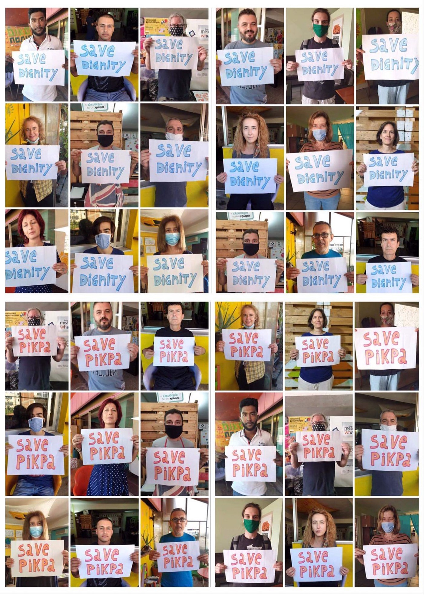

### AYS Weekend Digest 10–11/10/2020: Save Pikpa
### Four people die in a minefield on the Syrian\-Turkish border / Libya: 50 people on the move kidnapped from their homes / Shipwreck off Tunisia: 11 die and 11 are missing …

[Are You Syrious?](@AreYouSyrious?source=post_page-----b781be2ba943--------------------------------)

[Oct 12](ays-weekend-digest-10-11-10-2020-save-pikpa-b781be2ba943?source=post_page-----b781be2ba943--------------------------------) · 13 min read

### Pikpa to be evicted Monday 12th October

Members of Lesvos Solidarity received an oral communication by the police that the eviction of the self\-managed camp should start on Monday 12th October and finish on Thursday 15th\. At the time of writing the eviction has not started yet\.

Families and vulnerable people are to be transferred to the mud\-pile that is Moria 2\.0\.

As a [local journalist](https://stonisi.gr/post/12041/kleiste-ta-rhmadia-mas-ekthetoyn) put it:

> _And someone who does not know, will wonder: Why do they move people out of their houses to take them to tents into the mudflat, they should do the opposite\._ 

> _But exactly for this, PIKPA and Kara Tepe camp expose them\._ 

Since before the ‘migration crisis’ and throughout it, Pikpa especially has been proof that dignified accommodation is possible\. It has “ [stood in contrast to the ‘Moria model’](https://www.amnesty.org.uk/urgent-actions/pikpa-refugee-shelter-faces-imminent-closure) , symbolising an alternative approach to the reception of asylum\-seekers and refugees, based on a sense of community and solidarity, offering safe and humane conditions to their residents”\.

Acts of solidarity are spreading throughout Lesvos, Greece and the rest of Europe\.

Below is a letter written by a neighbour of the camp, directed to the Mayor of Mytilene:

Join the campaign \# [Savedignity](https://www.facebook.com/groups/633160610380429/) \.

SYRIAN / TURKISH BORDER
### Four people died after Turkish border guards forced them into a minefield

Non\-government Turkish media [sources](https://anfenglishmobile.com/news/turkish-border-guards-drive-people-into-minefield-four-dead-47174) \( [2](https://yeniyasamgazetesi2.com/darp-edip-mayinli-araziye-yolladilar-4-olu) \) report on the killing of four Kurdish people who were trying to cross the border from the Hesekê area in Syria to the Kızıltepe district in Turkey\.

One of the survivors reported that a group of 10 people was noticed by the Turkish guards on October 5 as they tried to cross the border, and six of them were caught\. One person managed to escape into Turkish territory, and three people got stuck in the border area between the wall and the barbed wire\.

> _The Turkish forces then shoved a flashlight into the hand of one of the detainees and forced him to search for the three people in the mined area by force\. The gendarmerie first beat him with rifle shafts and shot in front of his feet to force him to run\. The victim crawled on his knees into the mined area\. When the four fugitives ran away from the shots between the border wall and the area delimited by barbed wire, a mine exploded and all four were killed in the detonation\._ 

The incident only became known when the victims were brought before the public prosecutor’s office for deportation\. Apparently no official arrest has been made and the victims claim to have been mistreated and threatened in order to keep the incident quiet\.

LIBYA
### Returns

IOM and UNHCR [report](https://twitter.com/IOM_Libya/status/1315370239291465733) that over the weekend 390 people were intercepted by the Libyan Coast Guard and disembarked in Tripoli \( [227 on Saturday](https://twitter.com/IOM_Libya/status/1315248873527533568?fbclid=IwAR1W8SncFZceuB2Id2yXUoa_rrSKA2I2mLnZaIPzxY-4cDMyQE-7Tr1xbwQ) and [163 on Sunday](https://twitter.com/UNHCRLibya/status/1315369250702462976) \) \.
### 350 people on the move kidnapped from their homes

MSF [report](https://www.doctorswithoutborders.org/what-we-do/news-stories/news/libya-350-migrants-abducted-their-homes-armed-men) that on September 28th, 350 people were abducted from their homes in Ajaylat by masked men who robbed them and took them to a warehouse in Sabratah\. Since then, some have escaped, and others were released, but 60 people remain held in captivity\.

**We join MSF in calling for the immediate release of the 60 people being held\. Among them, there are 24 children\.**

Read more on this story [HERE](https://www.washingtonpost.com/world/africa/aid-group-says-libyan-militia-is-holding-hostage-60-migrants/2020/10/10/e66f57f8-0aee-11eb-8719-0df159d14794_story.html?fbclid=IwAR0SDWGaW2JfzD3bkNRrdGU3kR-PTQvGoTZD2emFR0I_Olm5aSDEMeRFV8o) \.
### SEA
### Six years of Alarm Phone
### 130 people in distress closely watched by Frontex, but no action taken

Sea\-Watch has released information that the aircraft Seabird sighted a rubber boat with ~130 people on board, so overloaded it was bent in the middle\. Frontex & EUNAVFOR MED airplanes were on scene, and the merchant vessel Almisan was in the vicinity but did not initiate a rescue\. Attempts by our crew to contact the EU assets were unsuccessful\. Sadly, we have to assume that the boat was eventually pulled back by the so\-called Libyan Coast Guard — once again with the participation of European actors\.
### Shipwreck off Tunisian coast: 11 people died and 11 are missing

A boat [sank](https://twitter.com/TapNewsAgency/status/1315378291977658368) off Louta, in the Sfax area, Tunisia, on Sunday Morning\. Eleven bodies have been recovered \(eight women and three children\), 11 more people are still missing and seven were rescued\.

In the night between Saturday and Sunday, Tunisian authorities stopped and arrested 262 people who were about to attempt crossing the Mediterranean\. According to [local media](https://www.tap.info.tn/en/Portal-Politics/13184145-32-attempts-to) , they will all be prosecuted, and 73 have been ordered to remain in detention\.

GREECE
### Arrivals

From [Aegean Boat Report](https://www.facebook.com/AegeanBoatReport/posts/942021146320990) :

A boat carrying 23 people landed in Agiasmata, Chios north west around noon today, two children, 10 women and 11 men\. The group had been drifting outside Agiasmata area for approximately four hours due to engine problems\. The fibreglass boat that they arrived on was found burning\. How this happened is so far unknown\.

The new arrivals will be quarantined for 14 days in the quarantine area on Chios\.
### Government led campaign against NGOs carries on…

Lena K\. [summarised](https://twitter.com/lk2015r/status/1315040658672017410) on twitter recent Greek media articles that amplify the government narrative on NGOs, which frame such organisations as “almost like a branch of the Erdogan government, reproducing his propaganda, or even like agents provocateurs … they might serve other interests and use the refugee issue as a pretext\. Read it all [HERE](https://twitter.com/lk2015r/status/1315040658672017410) \.

Little real information comes out from such articles, but they show the great length authorities are willing to go to in order to stop solidarity with people on the move, and to hinder all unfavourable reporting\. As happened in Italy, authorities have moved special police squads, secret service and prosecutors against humanitarian rescue ships, in a political smear campaign to stop them from witnessing and recording EU policies in the central Mediterranean\.
### …While the court case against the perpetrators of the of the pogrom of April 22, 2018 in Sappho Square of Mytilene, Lesvos is still being ignored after two and a half years\.

Greek media [report](https://www.stonisi.gr/post/12034/sto-syrtari-oi-xrysaygites-toy-pogkrom-sthn-plateia-sapfoys) that although 26 people were identified as moral or factual perpetrators of the attack on more than 150 people on the move who were holding a sit\-in in Mytilene, this is still being ignored by local prosecutors\. Among the identified people are ND members, army officers and ex\-members of Golden Dawn, now part of the so\-called Patriotic Movement of Mytilene\.
### Authorities keeps playing down pushbacks…

Margaritis Schinas, European Commission vice president for “Protecting our European Way of Life”, \(now renamed Promoting our European Way of Life\) and responsible for upholding the rule of law, migration and internal security, [kept refusing to acknowledge](https://twitter.com/lk2015r/status/1315329772529029120) the body of testimonies and proof regarding illegal pushbacks and border violence\. In his meeting with the GUE/NGL group, he stated that his position is no different from that of Greek Ministers questioned about it by LIBE in July: “these allegations that many of you seem to take for granted, of course they should be investigated but they should be investigated on the basis of reliable information\. I do not get informed on these issues from the social media market and I don’t get informed at the moment when the tensions between Greece and Turkey are heightened and everything goes in terms of value\.”
### …Nonetheless, pushbacks keep happening

From [Aegean Boat Report](https://www.facebook.com/AegeanBoatReport/posts/942021146320990) :

A boat carrying approximately 24 people was pushed back by the Greek coast guard east of Chios on Saturday morning\.

People onboard contacted ABR, in a desperate attempt to get help, but it was too late\. A Greek coast guard vessel from Chios arrived and picked up the people from the rubber dingy\. They were later pushed into two life rafts, and left drifting, helpless at sea\.

Photos and videos they sent to ABR prove that this is without any doubt another illegal pushback, carried out by the Greek coast guard and ordered by the Greek government\.

Another boat that landed on Pasas at midnight on Saturday contacted [ABR](https://www.facebook.com/AegeanBoatReport/posts/942021146320990) \. “Port police on Chios was informed of their location, but there is no information that they actually arrived on Chios\. Contact with this group was lost, and we fear that they have been pushed back by the Greek coast guard\.”
### 100 new border guards to be stationed in Kavala

This is what Citizens’ Protection Minister Michalis Chrysochoidis [announced](https://www.ekathimerini.com/257936/article/ekathimerini/news/greece-to-recruit-100-new-border-guards) on Saturday\. The region is in north\-eastern Greece, where in the past month 400 additional guards have been stationed on the Evros, together with electronic surveillance equipment\. “We are building the fence in Evros, a one\-of\-a\-kind project that will further shield our country,” he added\.
### Changes in citizenship law

Last Thursday a new law regarding citizenship was approved by Parliament\. [Reportedly](https://www.keeptalkinggreece.com/2020/10/11/greek-citizenship-exams-bill/) , this will accelerate the waiting times for obtaining citizenship\. Now, authorities ares still processing applications filed in 2015 and 2016\. The new laws introduced a mandatory test on Greek history, geography, culture, politics and language \(B1 level\) \. The first test should be held in May 2021\.
### Changes in welfare access for asylum seekers annouced

Migration minister Mitarakis [announced](http://www.topontiki.gr/article/410260/mitarakis-trapezikos-logariasmos-afm-kai-paaypa-stoys-aitoyntes-asylo-amesos-meta-tin) that authorities will be implementing structural changes in the modality of accessing welfare for asylum seekers\. Structural changes are being made in the way asylum seekers access the welfare state\. If and when this is implemented, a bank account, AFM and PAAYPA will be given to all applicants at the moment of registration\.
### Updates from Lesvos

Team Humanity is [raising funds](https://www.facebook.com/teamhumanitydk/posts/1801810779987924) to support people in the new Moria 2\.0 with necessary food, clothing, and hygiene supplies\. “We continue our efforts to supply refugee families with essentials needed to survive during the winter months ahead\. And we still need your help\!”

You can support them by donating to the Running Refugees [HERE](https://4agc.com/fundraiser_pages/c8a0e9c4-dd5f-4914-a18b-bd9c358ec540) \.
### Updates from Chios

Offene Arme e\.V\. / CESRT [report](https://www.facebook.com/chiosesrt/posts/3299638773438617) that “the Greek Minister for Migration said this week that the Government and its partners were working hard to decongest the island\. There are currently 3,200 people in Vial and they hope to get this to 2,000 people by Christmas\. Compared to this time last year there are already many fewer people in Vial\. The Minister also said that if there are no more arrivals, then Vial could be empty by Easter\. We are proud to have played a part in helping the people who have been on Chios and we hope to continue to help with much\-needed aid until the last person leaves\.”

ITALY
### Arrivals

On Sunday, 20 boats with a total of 353 Tunisians arrived in Lampedusa\. Local authorities reported that 15 boats with 433 migrants on board had already reached the island between Tunisia and Sicily on Saturday, media [report](https://www.stol.it/artikel/chronik/fast-800-migranten-auf-lampedusa-eingetroffen) \.
### New details on the politically\-loaded inspections of NGO ships

In an [interview](https://ilmanifesto.it/sono-fermi-politici-litalia-chiede-requisiti-inesistenti) , Valentin Schatz, consultant for Sea\-Eye, explained how authorities in Italy are using their power to stop SAR operation in the central Mediterranean\.

Months apart and docked in distant ports, Sea\-Eye has been inspected two times in May and now in October by the same team of inspectors\. The Italian port authority has created a dedicated team to inspect NGO ships\.

Normally, ships can be inspected only once a year, but Italy considers SAR activity as a “prevalent factor”, which allows authorities to inspect the ship more often\. Authorities claim that such ships are not certified for SAR activities and consider such activities as a service and not as en emergency or an exception\. Shatz notes that European countries do not allow for private ships to be certified as SAR vessels\. Also, considering SAR activities a service, Italian authorities can hold the ship for not having an adequate system of water depuration for the number of people rescued\.

As Shatz stresses:

> _There is an easy solution for NGO rescue activity to be an exception\. Italy has to use its coast guard for SAR activity\. The only reason for NGOs to carry out so many rescue operations is because governments are not doing it anymore, even though the law says they should\._ 

### Updates on the use of quarantine ships

In the past few days, several messages have been sent from inside the quarantine ship Rhapsody, docked in Bari\.

Majdi Karbai, a member of the Tunisian parliament, was [contacted](https://twitter.com/karbai/status/1314596723759734793) by the relatives of a young man who attempted suicide on the vessel\. He also reported that a group of Tunisian people were taken to a nearby airport and [deported](https://twitter.com/karbai/status/1314478511764242433) to Tunisia\. In response, people on board started a [hunger strike](https://twitter.com/karbai/status/1314631226804887552) on Friday\.

On Saturday, [405 people](https://bari.repubblica.it/cronaca/2020/10/10/news/bari_due_migranti_tentano_la_fuga_dalla_nave_rhapsody_bloccati_finora_sbarcate_400_persone_su_805-270132696/) were still on board, while 130 were [transferred](https://twitter.com/JigginoRuss/status/1315244354877960193) to detention centres throughout the country\. Two people [attempted to escape](https://twitter.com/JigginoRuss/status/1314962147106009088) , jumping into the sea but were intercepted by the authorities\. At the moment, the boat is surrounded by riot police on the dock\.

ASGI [revealed](https://www.asgi.it/asilo-e-protezione-internazionale/stranieri-navi-quarantena-illegali-trasferimenti/) on Friday that asylum seekers have been transferred from reception centres to quarantine ships if they tested positive for Covid\-19\. Transferrals ordered by the Italian central authorities and operatively supported \(in some cases\) by the Italian Red Cross\.

ASGI considers these transferrals illegal, as quarantine should not entail the restriction to personal rights and freedoms\.

Read more on the quarantine ships [HERE](http://www.vita.it/it/article/2020/10/07/i-migranti-invisibili-sulle-navi-quarantena-tenuti-lontani-da-noi/156901/) \(in Italian\) \.

SPAIN
### Arrivals

A total of 1,015 people [arrived](https://www.reuters.com/article/uk-europe-migrants-spain-canary-islands/canary-islands-sees-biggest-migrant-surge-since-2006-idUKKBN26V0UL) on the Canary islands’ shores, mainly between Thursday and Saturday\. This is the biggest number of arrivals in the area since 2006\.
### Report on human rights violations and deportations

[Iridia](https://iridia.cat/) and [Novact](https://novact.org/?lang=en) [published a report on deportations and human rights violations](https://iridia.cat/es/publicaciones/vulneraciones-de-derechos-humanos-en-las-deportaciones/?fbclid=IwAR0SOGOX_C2WALR80n9FgMcR-peT_LcFYICyPaIt4LFuUI_ZEtbzx4M6nGY) \(click on the link to read the executive summary and the full report, in Spanish\) \.

> _The deportation system constitutes a key pillar of immigration control policies and **implies consequences that seriously violate the fundamental rights of people in a situation of administrative irregularity,** as well as, and indirectly, of those who have a regularized administrative situation but they could find themselves in a situation of unexpected irregularity\. However, deportation is a practice that remains invisible both in the public and institutional spheres\._ 

> _Deportations break vital projects\. \[…\] They not only affect people who are effectively deported, but also damage those who are deportable\._ 

> _This shows that deportation acquires different scopes and is re\-signified: it is no longer only synonymous with the abrupt act of forced displacement, but also implies fear, exploitation and precariousness in the daily lives of many people\._ 

> _Deportation not only manifests itself on flights, borders, fences and CIEs, **but is experienced, day after day, in our neighbourhoods and cities,** through ethnic\-racial profiling identifications by the police forces, through surveillance and citizen control and through the administrative difficulties that exist for regularization\._ 

Projecto Frontera Sur’s “Beach days” in Melilla
### [Log into Facebook \| Facebook](https://www.facebook.com/NoNameKitchenBelgrade/posts/1092394781158805)
### [Log into Facebook to start sharing and connecting with your friends, family, and people you know\.](https://www.facebook.com/NoNameKitchenBelgrade/posts/1092394781158805)
#### [www\.facebook\.com](https://www.facebook.com/NoNameKitchenBelgrade/posts/1092394781158805)

SWITZERLAND
### Around 2,000 people take to the streets in Bern

Media [report](https://www.bernerzeitung.ch/politisches-treiben-in-der-innenstadt-296982563815) on a demonstration in solidarity with the people stuck on Lesvos\. Participants asked the government to act immediately and agree to take people from the Greek island\.

SWEDEN
### Visitors allowed again in migrant detention facilities

Due to the coronavirus pandemic visitors have not been allowed to enter the Migration Agency’s detention facilities, pre\-deportation centres, but from Sunday it is [possible](https://www.facebook.com/christina.gyllenger/posts/360362468712038) again\.

UK
### More hostile than ever

While the new Immigration Bill is finally encountering some difficulties in the House of Lords, the Home Office keeps hardening its stance against people on the move\. Last week Dan O’Mahoney, a former marine, was appointed Clandestine Channel Threat Commander\. Over the last few days we heard several bizarre and dangerous proposals to curb the flow of people on the move across the Channel: asylum facilities on the other side of the planet, disembarkation platforms on oil rigs, wave machines and nets to stop small boats\. According to media [outlets](https://www.dailymail.co.uk/news/article-8827449/Migrants-entering-British-waters-Channel-dinghies-disabled-nets.html) , O’Mahoney confirmed that “personnel would render migrant boats inoperable before using British vessels to ferry the occupants back to France”\. A plan that has already one major problem, France is refusing to take people in from the Channel…

Inland, the situation is no better\. Media [reveal](https://www.theguardian.com/uk-news/2020/oct/11/revealed-the-squalor-inside-ex-mod-camps-being-used-to-house-refugees) that the first two sites hastily converted into refugee camps are squalid, “unsanitary and unsuitable” for living purposes\. The sites are in Penally, west Wales and in Folkestone, south\-eastern England, and have been recently converted to host up to 600 asylum seekers while their applications are processed\.

> _“For a start, there’s a lack of privacy for showers and sleeping, and for survivors of rape and abuse that is unacceptable\. The Welsh site in particular looks really rundown, with bunk beds and concerns over social distancing\._ 

Human rights groups have described them as “a prison without the safeguards of a prison”, where people are subject to night curfew, despite not having committed any crime or being officially detained\. Conflating reception and unofficial detention is sadly a common practice in many European states\. It is reported also that there is no access to legal aid\.

This is no surprise, given the contempt shown for migration lawyers by both the Secretary of State Priti Patel and Prime Minister Boris Johnson\.

Charities have raised concerns about the access to such structures, especially due to the far\-right protests outside these bases\. In Penally, which has a capacity of 230, there are reportedly around 82 people\. The far\-right group Britain First have been meeting in front of its gates since its opening at the end of September, insulting and threatening those living inside\. It seems that people have been taken there from other facilities in the country and some of them have already been living in the country for months\.

Read more about life in Penally [HERE](https://www.walesonline.co.uk/news/wales-news/penally-asylum-seeker-camp-tenby-19036617?fbclid=IwAR3xkOphFkpjZ0sJURWzNXy2LLeWfewhK8FEw1KPWa13kvw22GdzQiwqWLk) \.

Care4Calais is also looking for volunteers in Kent\. Read more [HERE](https://www.facebook.com/care4calais/posts/3717862024913394) \.

GENERAL
### Psychological toll on refugees

UNHCR is [urging](https://www.unhcr.org/news/press/2020/10/5f80502c4/covid-19-inducing-widespread-despair-among-refugees-unhcr-appeals-urgent.html?fbclid=IwAR1mQdsOgHK-mw1f6xJM1c4RwdQPj4mZpsow-PKlDaT0cZB_AiOj7GWbmf4) the international community to prioritise and boost essential mental health programmes for refugees and those internally displaced, in particular as COVID\-19 is inducing ‘widespread despair’ among people on the move\. Also, IRC psychologist Dukas Protogiros [wrote](https://news.trust.org/item/20201009174238-g5x4u) an article on the same issue for people stuck in the new Moria 2\.0\.
### Europe Must Act is looking for volunteers \(online\)

[Europe Must Act](https://www.facebook.com/europemustact) is now looking for three activists to join our Diversity and Inclusion team\! Read more [HERE](https://www.facebook.com/europemustact/posts/179662410313128) \.
### Guide on how to establish a refugee law clinic

The new edition of the “ [Immigration Law reader: Guide on how to establish a refugee law clinic](https://www.helsinki.hu/en/the-refugee-law-reader-2) ” by the Hungarian Helsinki Committee is now ready\! The guide has been updated with the collaboration of experts from Eastern Europe and Latin America\. It aims to provide support and practical ideas to universities, professors, lawyers, NGOs, students, and volunteers who are interested in establishing a “refugee law clinic”, anywhere in the world\. [The guide is now available in English, French, Spanish, Portuguese and Russian\.](https://www.helsinki.hu/en/the-refugee-law-reader-2)
### More analyses of EU’s Migration and Asylum Pact
### Worth Reading
- “ [The war of the red gambero rosso](https://www.theguardian.com/world/2020/oct/11/footballers-and-fishermen-italy-and-libya-at-a-standstill-over-prisoner-exchange?fbclid=IwAR1YV0RV2IrHz6Gi_9wEyFQeY1tsU4kPQztxdj_q94RlMEhS37fBgY3SBXc) ”, A standstill between Italy and Libya\. At two docks on opposite shores of the Mediterranean, two sets of families have been drawn into a small international crisis as the fate of 12 Italian fishermen held in Libya appears to hinge on that of four Libyan footballers jailed in Italy for people smuggling\.
- [Frontex, a recruiting ad, and the criminalisation of people on the move](https://discoversociety.org/2020/10/07/border-agency-recruitment-circulating-narratives-that-criminalize-asylum-and-erase-border-violence/) , an analysis\.
- Video: [Dreams in the ashes](https://www.aljazeera.com/program/fly-on-the-wall/2020/10/8/dreams-in-the-ashes/) \. An uncertain future for migrants and refugees from Moria Camp in Greece\.
- Explaining the migration crisis and citizenship rights to children\. [An article from Vogue](https://www.vogue.co.uk/mini-vogue/article/explaining-refugee-crisis-to-children) , and [a short comic from PRCBC](https://prcbc.files.wordpress.com/2019/05/belonging-british-citizenship-rights-of-children-on-eaa-and-swiss-nationals.pdf) \.

**Find daily updates and special reports on our [Medium page](https://medium.com/are-you-syrious) \.**

**If you wish to contribute, either by writing a report or a story, or by joining the info gathering team, please let us know\.**

**We strive to echo correct news from the ground through collaboration and fairness\. Every effort has been made to credit organisations and individuals with regard to the supply of information, video, and photo material \(in cases where the source wanted to be accredited\) \. Please notify us regarding corrections\.**

**If there’s anything you want to share or comment, contact us through Facebook, Twitter or write to: areyousyrious@gmail\.com**
### Sign up for AYS Daily Newsletter
### By Are You Syrious?

Daily news digests from the field, for volunteers, people on the move, journalists, and the general public [Take a look](/are-you-syrious/newsletters/ays-daily-newsletter?source=newsletter_v3_promo--------------------------newsletter_v3_promo-----------)

_Converted [Medium Post](https://medium.com/are-you-syrious/ays-weekend-digest-10-11-10-2020-save-pikpa-19af8662cfdd) by [ZMediumToMarkdown](https://github.com/ZhgChgLi/ZMediumToMarkdown)._
