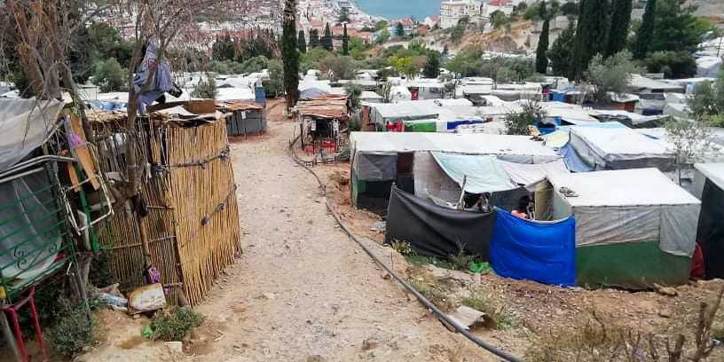

### AYS Daily Digest 13/10/2020: Winter and Covid approach the Greek islands
### Samos camp under lockdown // Heavy rains on Lesvos // Rescues at sea // People with resident permits quarantined on ships in Italy // New pushback at Croatian border // Testimony of new camp in Kent

[Are You Syrious?](@AreYouSyrious?source=post_page-----de6de8f2835b--------------------------------)

[Oct 14](ays-daily-digest-13-10-2020-winter-and-covid-approach-the-greek-islands-de6de8f2835b?source=post_page-----de6de8f2835b--------------------------------) · 4 min read

### Greece

Samos volunteers report that the number of positive Covid\-19 cases has reached at least 90, after the first case was announced on September 15th: “The island is placed under Increased Monitoring \(level 3 out of 4\), and new restrictive measures came into force yesterday\.” The lockdown measures of the Vathy camp were extended, freedom of movement was restricted\. Only 150 of the 4500 residents are allowed to leave at the same time\.

> _People have to queue for hours just to get away from the abominable conditions they are forced to live in\._ 

Further, they warn that displaced people are more vulnerable to shocks such as those we are experiencing under the pandemic\. Many of the Vathy residents already suffer from traumatic experiences combined with health conditions\. As most NGOs halt their activities and community centres remain closed, the atmosphere get even more desperate\. And now winter is approaching, making the conditions even more rough, as the rainfalls on Lesvos have recently showed\.
### [Log into Facebook \| Facebook](https://www.facebook.com/samosvolunteers/posts/1726811150830371)
### [Log into Facebook to start sharing and connecting with your friends, family, and people you know\.](https://www.facebook.com/samosvolunteers/posts/1726811150830371)
#### [www\.facebook\.com](https://www.facebook.com/samosvolunteers/posts/1726811150830371)

There is, however, some good news: The laundry station of Samos Volunteers will be able to wash laundry from MSF’s medical patients: “We continue to support displaced people living on Samos during the lockdown\.”

Following the arrests and intimidations of media representatives, [Solomon](https://wearesolomon.com/mag/society/one-month-after-the-moria-fire-press-coverage-on-refugees-remains-restricted/?fbclid=IwAR2N0a6AcJ_EDdcmy7HXI1ffL37jlI84I98y7ETM1z0jWxvzMEo84uuBsNU) highlights the still restricted press freedom around the new Moria camp\. Middle East Monitor reports that the Greek government wants to replace the site by a new permanent facility by summer 2021\. According to Migration Minister Notis Mitarachi, it should get “NATO\-style double enclosure” and tightly controlled entry, as well as fire protection systems\. Similar camps are planned on Samos, Kos and Leros\.

The Polish government [sent](https://greekcitytimes.com/2020/10/08/poland-sends-156-mobile-housing-units-to-accomodate-refugees-in-greece/) 156 mobile housing units to Greece after the fire in Moria\. They were delivered to the Avlona army camp North of Athens\.
### Sea

A boat with 43 people on board has been found by Merchant Vessel ALK, [according](https://twitter.com/alarm_phone/status/1316119781272059906) to Alarmphone\. The boat and its passengers had been missing for several hours\. However, due to bad weather conditions, they still cannot be rescued\. The ALK has promised to provide them shelter tonight\.

Meanwhile, Salvamento Maritimo [rescued](https://elforodeceuta.es/salvamento-maritimo-rescata-a-dos-migrantes-que-viajaban-en-un-neumatico-de-camion-en-medio-del-estrecho-de-gibraltar/?fbclid=IwAR1nf6F2geZHYVf8wS-3ORGcAdy9mQZc_E9KT_SP88DFEW6EMWAPMMvCWBc) five people in two actions\.
### Italy

The [Italian Coalition for Civil Lieberties and Rights](https://cild.eu/en/2020/10/13/ship-based-quarantine-a-covid-prevention-measure-for-migrants-only/?fbclid=IwAR1_GKGXmGRAhvzpMrQcZcYokJ_JWjL8M3RXFxM3G0uU_MgT8yxYwSCArS4) reports about several cases of people with regular residence permits who were moved from their reception centre to ships for medical isolation:

> _Quarantine ships have gone from being an exceptional reception measure to floating immigration holding facilities\._ 

CILD condemns this measure as discriminatory, arbitrary, and not proportionate\. Especially after this solution was rejected when it was suggested as being a potential measure for isolating elderly people in the beginning of the pandemic\. The group announced that they will continue to monitor the situation\.

The Sisters “Serve della Divina Provvidenza di Catania” [offered](https://www.santegidio.org/pageID/30284/langID/en/itemID/38548/Pope-Francis-entrusts-the-Community-of-Sant-Egidio-with-a-house-to-welcome-refugees-arriving-through-the-Humanitarian-Corridors-We-are-deeply-grateful-for-the-gesture-of-generosity-towards-migrants.html) Pope Francis their building in Via della Pisana, which he decided to turn into a welcome center for migrants\.
### Bosnia

Istraga [reports](https://www.istraga.ba/uznemirujuci-sadrzaj-hrvatski-policajci-brutalno-pretukli-migrante-i-ilegalno-ih-prebacili-u-bih/?fbclid=IwAR1S_Bn9TK47YGdgXCufsNJzeR7b3EOWp8_0ZPAsWRkV0sBGE6r7HL2xd58) about another pushback by Croatian police\. In two groups, more than 30 people — including women and children — were forced to leave Croatian soil and return back to Bosnia\. Some of the people were beaten, before they had to go back to Velika Kladusa\.
### Denmark

The Danish immigration service has sent letters to several Syrians from the Damascus province, informing them they may revoke their residence permits\. [Refugees\.dk](http://refugees.dk/en/news/2020/october/to-syrian-refugees-in-denmark/?fbclid=IwAR0VLyK0jEqtwWVFhjX3fez50TciUJF7-IHBVQDZw5jJ8SBia2soxXtG16A) hightlights, that “it’s very important to immediately find good counsellors who can explain how to prepare for the interview in the best way”\. Free services for this purpose can be found here:

**• Refugees Welcome** 
Trampolinhuset, Thoravej 7, 2400 Kbh NV\. Every Tuesday 16–19\. Arabic translator can be ordered in advance\.
Phone 50558011 \(open every day, leave a message if it’s not picked up\) 
E\-mail: kontakt@refugeeswelcome\.dk
[Facebook chat](https://www.facebook.com/refugeeswelcomedenmark)
- **DRC Danish Refugee Council** 
Phone 33735000 every day 9–16, Wednesdays Arabic translator 12–15\. Ask for the asylum department\.

### UK

Speaking to [Kent Online](https://www.kentonline.co.uk/folkestone/news/i-came-to-find-a-safe-place-not-to-be-detained-as-a-criminal-235398/?fbclid=IwAR02WRvPfM9qZUJn6Q6Ml-DxC1hKhtSlI27yKhhsSP3o3poGJ_NwmwqJeNQ) , an asylum seeker described living conditions in the military baracks, which were opened for around 400 people last month\. According to him, 25 people share one toilet and bedroom and have to use open showers\. 13 people gather around one table at meal times\. This makes physical distance difficult and creates a lack of privavy\.

Altough he says it’s a reasonable temporary place, people started to self\-harm due to the tough conditions: “I know they are trying to cut the costs, which I understand\. But they’re getting more asylum seekers, which is making it so difficult to adhere to safety of the coronavirus\.” Additionally, the residents feel threatened by encounters with some right\-wing locals\.

> _For my own safety I prefer not to leave\. If we go to the shop to buy something people will try and video me by force, invading my personal space\. When I refuse by raising my hand, they yell that I’m going to attack them\._ 

Meanwhile, volunteers in Kent have set\-up a [rescue mission](https://thecivilfleet.wordpress.com/2020/10/13/activists-launch-mission-to-support-refugees-crossing-the-english-channel/?fbclid=IwAR2o554gR0Y0e_L_lcNUIbgLiRWvjQ6aGANYRWa-B8Y5K-ffyhlZZyytrq8) in the channel off the coast after collecting £10,000\.

Volunteers in Greenwich received several donations for people hit by the fires in Moria\. More than 200 boxes and sacks were delivered, [writes](https://www.thisislocallondon.co.uk/news/18787986.amazing-generosity-response-greenwich-refugee-appeal/?fbclid=IwAR1QY0eiDWcmtZk94Vez_3nfnmNiRJb7YFJFIgsS2KYNqbNeeB4VcZDWiG4) This is Local London\.
### General

**Find daily updates and special reports on our [Medium page](https://medium.com/are-you-syrious) \.**

**If you wish to contribute, either by writing a report or a story, or by joining the info gathering team, please let us know\.**

**We strive to echo correct news from the ground through collaboration and fairness\. Every effort has been made to credit organisations and individuals with regard to the supply of information, video, and photo material \(in cases where the source wanted to be accredited\) \. Please notify us regarding corrections\.**

**If there’s anything you want to share or comment, contact us through Facebook, Twitter or write to: areyousyrious@gmail\.com**

_Converted [Medium Post](https://medium.com/are-you-syrious/ays-daily-digest-13-10-2020-winter-and-covid-approach-the-greek-islands-fdce2c10849b) by [ZMediumToMarkdown](https://github.com/ZhgChgLi/ZMediumToMarkdown)._
