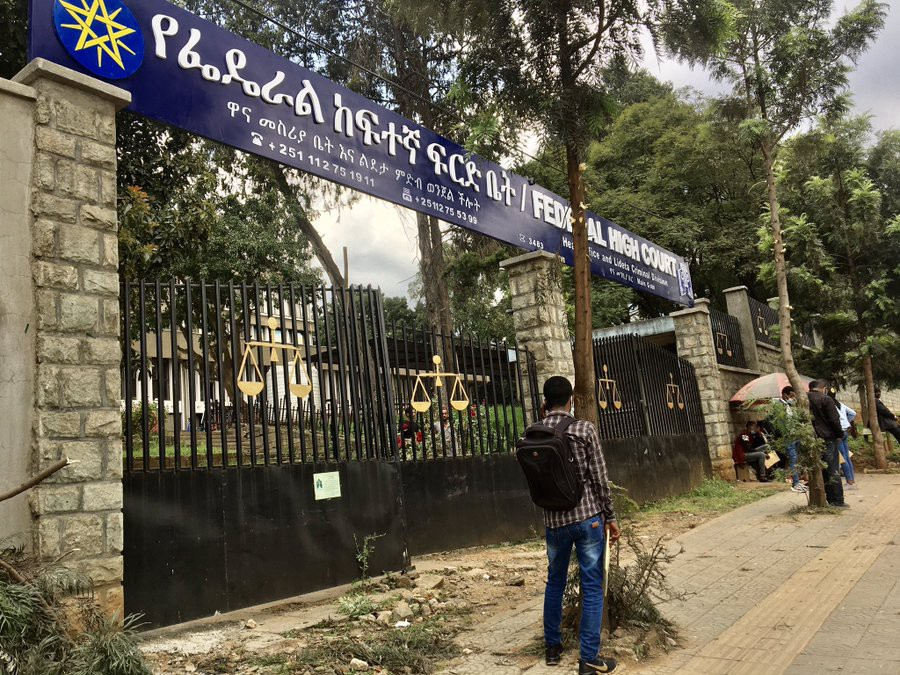
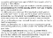
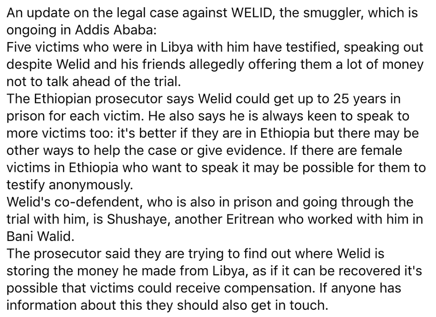

### AYS Daily Digest 16/10/20: Brave witnessing against smugglers responsible for torture of thousands
### Stored like cargo in compounds, starved, sometimes tortured to death — new testimonies in a trial to smuggler / Calls for an independent investigation on a case of a minor / Denmark wants to take in people from Moria / Recommended reads & more news

[Are You Syrious?](@AreYouSyrious?source=post_page-----2cffacfeed78--------------------------------)

[Oct 17](ays-daily-digest-16-10-20-brave-witnessing-against-smugglers-responsible-for-torture-of-thousands-2cffacfeed78?source=post_page-----2cffacfeed78--------------------------------) · 7 min read

Back in court this afternoon to hear from the next five witnesses against Welid & his co\-defendant\. \(Photo and reporting on the case by: [Sally Hayden](https://twitter.com/sallyhayd) \)
### FEATURED

More information on the legal case against the Eritrean smuggler Welid are coming out\.
Escaping one of the world’s most isolated dictatorships, making their way to Khartoum, many young people were convinced to leave the country on a “go now, pay later” [scheme](https://www.irishtimes.com/news/world/africa/inside-the-smuggler-s-warehouse-africa-s-21st-century-slave-trade-1.4224073) \. In Sudan, older people who were on the move as refugees reportedly whispered about their children being kidnapped or stolen\.

As reported from different sources, many smugglers have taken advantage of insecurity in Libya, and the EU’s turning a blind eye to the fact they are ‘doing business’ with criminals, to move hundreds of thousands of people\. Many people are still trapped in detention centres and beaten by traffickers\. The financial gains are reportedly controlled through an international web of informal financial agents operating in Asmara, Khartoum, Israel, and Libya\. Bani Walid is a Libyan town that people on the move call the “ghost city” because of the number of people who disappear without trace: **stored like cargo in compounds, starved, sometimes tortured to death\.** 
Professor Mirjam van Reisen and Munyaradzi Mawere [published](https://www.amazon.com/Human-Trafficking-Trauma-Digital-Era/dp/9956764876) the names of several human traffickers involved in criminal networking\.

> _“Crimes against Humanity are ongoing in Eritrea\. Human trafficking is organised from within Eritrea and the lines between human trafficking and smuggling are blurred\. Refugees believe that traffickers from within Eritrea are connected to the broader network operating outside Eritrea, which involves perpetrators all along the routes\. Many who flee stay within the region, but feel that they are in constant danger\.”_ 

_“In Khartoum, I went to an Eritrean called Zeki\. I paid 1,600 USD from Khartoum to Libya\. I went to Asmara Market in Khartoum\. I paid to an Eritrean man, Welid, USD 2,200 USD for the crossing on the boat\. They split it, they pay the Sudan people and Libya people and they keep the rest\.” —_ from a testimony

The journalist Sally Hayden is following the case of one of the most notorious smuggler/traffickers and she has been reporting from Addis Ababa Federal Court, as she watched brave victims testify against [infamous smugglers](https://www.irishtimes.com/news/world/africa/inside-the-smuggler-s-warehouse-africa-s-21st-century-slave-trade-1.4224073) Welid & Kidane, “who terrorised refugees/migrants in Libya\. Both were present, dressed in orange prison uniforms and later led away in handcuffs\.”

We will continue reporting on this case and the issue of [the UK’s](http://www.harnnet.org/index.php/articles-corner/english-articles?fontstyle=f-larger&start=620) and EU’s part in the suffering of people in Eritrea, as well as the “green light” they have been giving to Libya in the midst of human rights violations accusations and reports\.
### EU
### Our wave of solidarity will grow

The so\-called “New Pact on Migration and Asylum” presented by the EU Commission in September comes as a slap in the face of asylum seekers and refugees still suffering violence and injustice along our borders\. It furthermore comes as a slap in the face of those tens of thousands who took to the streets in the past weeks to call for the evacuation of the Greek islands’ camps and for radical change to European migration and asylum policies, Europe Must Act [published](https://de.europemustact.org/post/our-wave-of-solidarity-will-grow?fbclid=IwAR20wrk-Zec7Z6ZCtEEGDIPCBJWBHcpHcRXzgNcgrzh21r9_bN2K7el528A) \.

> _There is no plan for a robust solidarity mechanism for the fair relocation of refugees and asylum seekers between European states, while this would be an essential prerequisite for achieving a sustainable decongestion of the Greek islands\. The newly proposed “border procedures” will continue to put the responsibility for people seeking protection on countries of first arrival\. The pact promotes the creation of new camps in the style of Moria along the borders, which we firmly oppose\._ 

### GREECE
### Bulgaria continues with pushbacks

Pushbacks to Greece from Bulgaria continue in the area of Evros, it is reported\. Allegedly, people are being stripped of their clothes and violently pushed back, with the Greek border officers moving on, reporting that people did all those things to themselves, dismissing reports of police abuse and the illegality of border management\.
### SERBIA

Approximately 1,000 people are staying in Subotica, Horgos and places along the border with Hungary\. They are mostly Syrians, Afghans, Palestinians and Libyans\. Most of them are staying outside the reception centres, which are overcapacitated or don’t allow more people inside\. Many people, including unaccompanied minors, remain disoriented and lack information, and there is a constant need for humanitarian aid, health protection, and accommodation in the region\. Even when they manage to enter one of the camps, people lack many basic amenities\. They sleep in the backyards of camps, in tents, with no access to food, hygiene and safe lodging\. Others are facing fear, depression, uncertainty and violence\. In order to alleviate these problems, mobile teams of the Serbian Asylum Protection Centre, including legal professionals and psychosocial support professionals, are visiting places along the border, providing legal and other relevant information, encouraging the social centres to react, go out into the field and do their job\.
### ITALY
### Using ships for Covid\-19 quarantine

[Italian Coalition for Civil Liberties and Rights](https://cild.eu/) \(Coalizione Italiana per le Libertà e i Diritti Civili\), learned that a Covid\-positive Gambian man with an Italian residence permit had been transferred to a quarantine ship, with no prior notice\. 
**Dozens of similar cases of migrants being quarantined in this way soon emerged\.** Read the entire story [here](https://www.liberties.eu/en/news/ship-based-quarantine-covid-prevention-measure-migrants/19640?fbclid=IwAR07ck-Pbz8oopR_sh9uJjefrYxeYA5JfkhwsiO6IDrb5ef6gGPF2u_D2UQ) \.
### FRANCE
### Calais

Updates from GrandeSynthe:
On October 16, 2020, violations of fundamental rights are constant in Grande\-Synthe\.

• 10 evictions from informal living spaces in September

• around 40 arbitrary arrests
### THE NETHERLANDS
### Nijmegen wants to admit many more than 100 people from Moria

Although the Netherlands has refused possibilities to open the country to unaccompanied minors, this week, the city of Nijmegen’s mayor and aldermen have decided to send a letter to State Secretary Ankie Broekers\-Knol of Justice and Security with a request to allow more people from Moria to come to the Netherlands\.

> _‘We hereby emphasize once again our willingness to receive extra refugees in our city, both adults and children\.’_ 

[Read more\.](https://www.gelderlander.nl/nijmegen/nijmegen-wil-veel-meer-dan-100-vluchtelingen-uit-moria-toelaten-de-situatie-is-rampzalig~ac72a500/?fbclid=IwAR39p7Lz0sr4IpPpww-3Iytz4icNjNmjkURPLeW8nZpEC3RsqmuSXz4rkKo&referrer=https://l.facebook.com/)
### Calls for an independent investigation of the case of a minor

There should be an independent investigation into the state of affairs surrounding the [death of a minor](https://l.facebook.com/l.php?u=https%3A%2F%2Fwww.ad.nl%2Fbinnenland%2Fasielaanvraag-afgewezen-ali-14-maakt-eind-aan-zijn-leven-zoveel-signalen-dat-dit-kon-gebeuren~a50b0752%2F%3Freferrer%3Dhttps%253A%252F%252Ft.co%252F%26fbclid%3DIwAR269fGKIDDtGL2rn77moHigQ9u2dGUiMFZ7nPPtOP1SIvXFpQC13ENkeuc&h=AT3pmJvbDaDmuwspDiruAnIdGmaITjPgomKwW6VtroAlyDeJ6GlOLVBFZqqaJAcbYYx_-_xDVbqdrE6dJKM7UOfK5bvU_cqC8JulJZJ_5TIh6tlzDD_vul3Z3RBS-HxppA&__tn__=R]-R&c[0]=AT21Q8VXNRr8vij6I139rfVwIQ8k2fs7OfWS-_--7Rb9XDSAJtLTBucK8t2BCq3Z7rj2LfizbR0Y8Ds5nieo3fnNdw8EFMJK61qGgYNTOGTtoh6r1VHUYjl9GFUkdsEW4SZIY2zz2Kt1UicWd9KYuVMiFRZqEr-hMnhlGemY_DtE5vJLLTlmvmVsO1-G-abwlxksnMvzFTptTp0HTslvu7YH9zX_wvCxIYVwmCpF) whose asylum application was rejected earlier this year\. This is what the Dutch Council for Refugees states, following reports\.
A 14\-year\-old Syrian refugee, Ali, committed suicide at the asylum center in Gilze\-Rijen in July after it became clear that his and his family’s application for asylum had been rejected\.
### GERMANY

The Karl Küpper Prize, newly founded by the carnivalists, goes to captain and human rights activist Carola Rackete\. She is recognized for her special commitment and moral courage\.
Read more [here](https://l.facebook.com/l.php?u=https%3A%2F%2Fwww.rnd.de%2Fpanorama%2Fkapitanin-carola-rackete-wird-von-kolner-karnevalisten-geehrt-V7HTKHZM5KUOAG3HUPTR534TMA.html%3Ffbclid%3DIwAR3pDYb6-S_WDmRlfTkzT860A6aqyKvl16sasIleodwjnwMI9oN19QMu-E0&h=AT2lFDgT25CWFSGZTtLEnioy-4dzKt9SxFF8jypjzw24XYU9-AkeTyCgGaoy2IajjIX2HIog0_TcnJv1miVDmwCSBFt-mYs6ZZK1PpDPs411ymrsyzUnl7_HEawsYfoIuv6mv1V9vAbFWg&__tn__=R]-R&c[0]=AT1zba1f3d4sxVwkaPSXaC2uGjRhvo6qCIOkPA8TVVapq98fqH91lRy7qJwmazE2XKFoqcN9q0sJt_N-5xlD7nPChISt0ucsTrZfCM9zjuvs1eUzD35m8js4_GaA-uiicwdBIlZAT3hf3_0GAfi5YVfJsg8RFgJVdU6wuqObOyuhoG9JWZE7x82etXFsZFe3vBPayhdM0ismCu6qnJr54OJlL97txxvLlGlVS-uG) \.
### DENMARK

73local politicians from 18 Danish municipalities join forces in a call to the government \.

> _“We have room for children from the Moria camp”_ 

Specifically, they are asking the government to take in 300 of the nearly 3,000 children in the camp, which burned down in mid\-September, leaving 12,000 migrants homeless\.

The minister of Immigration and Integration Mattias Tesfaye \(SocDem\) claims that it is not a sustainable solution to bring children to Denmark from the Moria camp\.
### UK

If you are a refugee or asylum seeker living in Scotland and need some advice, then please speak to us\. Call our helpline free of charge on 0808 196 7274:
### FOR FURTHER READING
### [Self\-help tool reduces refugees’ psychological distress and mental health stigma](https://l.facebook.com/l.php?u=https%3A%2F%2Fwww.prnewswire.com%2Fnews-releases%2Fself-help-tool-reduces-refugees-psychological-distress-and-mental-health-stigma-301148042.html%3Ffbclid%3DIwAR2CSvQoF_duaJT0oiweJ0P42Z3hh-9MpxraAdglOaFB4xuNhHgAkxnsfbM&h=AT3BKjpDujgMmkUCMwQhLI5ZTHaTEJ55HqplbpcPMu5q5T4xPqk-el2vLYJuzrzmGozwZkZWBZV9QhzoQu9ReXu8UqvyFwD03g2HugAjjU-HNf7simTfF3E212jkKPmRvFBh4PaRHfV3DQ&__tn__=R]-R&c[0]=AT0zlXk8YvV9qluGUO48F5E6vLy_Uk06FIolY9LmR_TNpQT-Nnx-BkbdIXklkG90rbEWsNAzUnec7seg9iMssaoAsD-PvBE3MA0SrmSKt-bZ3w_9LVJ2tu8Btsrloxae4lqIkyHcaTocBogFXTvJwL_hnHxEwSRCEwqvK6tiFiGlZ_aDE5eN2g255g2W41leGwdwJvb0psCQ6uuGKTgV-tDR5wqUFUfmLfkIuHt-)
### [A new mental health intervention leads to meaningful improvements in the psychological wellbeing of Syrian refugees…](https://l.facebook.com/l.php?u=https%3A%2F%2Fwww.prnewswire.com%2Fnews-releases%2Fself-help-tool-reduces-refugees-psychological-distress-and-mental-health-stigma-301148042.html%3Ffbclid%3DIwAR2CSvQoF_duaJT0oiweJ0P42Z3hh-9MpxraAdglOaFB4xuNhHgAkxnsfbM&h=AT3BKjpDujgMmkUCMwQhLI5ZTHaTEJ55HqplbpcPMu5q5T4xPqk-el2vLYJuzrzmGozwZkZWBZV9QhzoQu9ReXu8UqvyFwD03g2HugAjjU-HNf7simTfF3E212jkKPmRvFBh4PaRHfV3DQ&__tn__=R]-R&c[0]=AT0zlXk8YvV9qluGUO48F5E6vLy_Uk06FIolY9LmR_TNpQT-Nnx-BkbdIXklkG90rbEWsNAzUnec7seg9iMssaoAsD-PvBE3MA0SrmSKt-bZ3w_9LVJ2tu8Btsrloxae4lqIkyHcaTocBogFXTvJwL_hnHxEwSRCEwqvK6tiFiGlZ_aDE5eN2g255g2W41leGwdwJvb0psCQ6uuGKTgV-tDR5wqUFUfmLfkIuHt-)
#### [l\.facebook\.com](https://l.facebook.com/l.php?u=https%3A%2F%2Fwww.prnewswire.com%2Fnews-releases%2Fself-help-tool-reduces-refugees-psychological-distress-and-mental-health-stigma-301148042.html%3Ffbclid%3DIwAR2CSvQoF_duaJT0oiweJ0P42Z3hh-9MpxraAdglOaFB4xuNhHgAkxnsfbM&h=AT3BKjpDujgMmkUCMwQhLI5ZTHaTEJ55HqplbpcPMu5q5T4xPqk-el2vLYJuzrzmGozwZkZWBZV9QhzoQu9ReXu8UqvyFwD03g2HugAjjU-HNf7simTfF3E212jkKPmRvFBh4PaRHfV3DQ&__tn__=R]-R&c[0]=AT0zlXk8YvV9qluGUO48F5E6vLy_Uk06FIolY9LmR_TNpQT-Nnx-BkbdIXklkG90rbEWsNAzUnec7seg9iMssaoAsD-PvBE3MA0SrmSKt-bZ3w_9LVJ2tu8Btsrloxae4lqIkyHcaTocBogFXTvJwL_hnHxEwSRCEwqvK6tiFiGlZ_aDE5eN2g255g2W41leGwdwJvb0psCQ6uuGKTgV-tDR5wqUFUfmLfkIuHt-)

Some thoughts on the possible solution for an even share of responsibility among the EU Member states:
### [What’s the best way to distribute asylum seekers in Europe?](https://l.facebook.com/l.php?u=https%3A%2F%2Fwww.swissinfo.ch%2Feng%2Fwhat-s-the-best-way-to-distribute-asylum-seekers-in-europe-%2F46099166%3Ffbclid%3DIwAR3iA9n-Q9Z24FAcohDdFlyObpezhom64JiWGBr8jcm-0Pi17ux3NwPZWe8&h=AT2MahqC3HT3DHzbiq1V_Er_dfVguYOItsLvgtJoj9hr04VMzhs8CiDZIhBEk_CyQ4oGe9tl386dPW1SrVg_9X-7-Tg_1VEt7C1kbCUaZJJ64SilyPxVJ5pagoMogPoILXN43LWOOLu-6A&__tn__=R]-R&c[0]=AT0zlXk8YvV9qluGUO48F5E6vLy_Uk06FIolY9LmR_TNpQT-Nnx-BkbdIXklkG90rbEWsNAzUnec7seg9iMssaoAsD-PvBE3MA0SrmSKt-bZ3w_9LVJ2tu8Btsrloxae4lqIkyHcaTocBogFXTvJwL_hnHxEwSRCEwqvK6tiFiGlZ_aDE5eN2g255g2W41leGwdwJvb0psCQ6uuGKTgV-tDR5wqUFUfmLfkIuHt-)
### [Migration expert Etienne Piguet and his team at the University of Neuchâtel in western Switzerland have mapped out what…](https://l.facebook.com/l.php?u=https%3A%2F%2Fwww.swissinfo.ch%2Feng%2Fwhat-s-the-best-way-to-distribute-asylum-seekers-in-europe-%2F46099166%3Ffbclid%3DIwAR3iA9n-Q9Z24FAcohDdFlyObpezhom64JiWGBr8jcm-0Pi17ux3NwPZWe8&h=AT2MahqC3HT3DHzbiq1V_Er_dfVguYOItsLvgtJoj9hr04VMzhs8CiDZIhBEk_CyQ4oGe9tl386dPW1SrVg_9X-7-Tg_1VEt7C1kbCUaZJJ64SilyPxVJ5pagoMogPoILXN43LWOOLu-6A&__tn__=R]-R&c[0]=AT0zlXk8YvV9qluGUO48F5E6vLy_Uk06FIolY9LmR_TNpQT-Nnx-BkbdIXklkG90rbEWsNAzUnec7seg9iMssaoAsD-PvBE3MA0SrmSKt-bZ3w_9LVJ2tu8Btsrloxae4lqIkyHcaTocBogFXTvJwL_hnHxEwSRCEwqvK6tiFiGlZ_aDE5eN2g255g2W41leGwdwJvb0psCQ6uuGKTgV-tDR5wqUFUfmLfkIuHt-)
#### [l\.facebook\.com](https://l.facebook.com/l.php?u=https%3A%2F%2Fwww.swissinfo.ch%2Feng%2Fwhat-s-the-best-way-to-distribute-asylum-seekers-in-europe-%2F46099166%3Ffbclid%3DIwAR3iA9n-Q9Z24FAcohDdFlyObpezhom64JiWGBr8jcm-0Pi17ux3NwPZWe8&h=AT2MahqC3HT3DHzbiq1V_Er_dfVguYOItsLvgtJoj9hr04VMzhs8CiDZIhBEk_CyQ4oGe9tl386dPW1SrVg_9X-7-Tg_1VEt7C1kbCUaZJJ64SilyPxVJ5pagoMogPoILXN43LWOOLu-6A&__tn__=R]-R&c[0]=AT0zlXk8YvV9qluGUO48F5E6vLy_Uk06FIolY9LmR_TNpQT-Nnx-BkbdIXklkG90rbEWsNAzUnec7seg9iMssaoAsD-PvBE3MA0SrmSKt-bZ3w_9LVJ2tu8Btsrloxae4lqIkyHcaTocBogFXTvJwL_hnHxEwSRCEwqvK6tiFiGlZ_aDE5eN2g255g2W41leGwdwJvb0psCQ6uuGKTgV-tDR5wqUFUfmLfkIuHt-)

When civil disobedience is in fact setting the standard for humane action:
### [The Appeal of Civil Disobedience in the Central Mediterranean](https://l.facebook.com/l.php?u=https%3A%2F%2Fwww.manchesteropenhive.com%2Fview%2Fjournals%2Fjha%2F2%2F1%2Farticle-p53.xml%3Ffbclid%3DIwAR1AzwFzcrnwrDm_xcFuwpVikRBwTR8WpD28UpZeG6fDOOfUeYgQUtB6KnY&h=AT17DHVgSwe9LEuWA5rY7joTgruw9wXMXHCCvIKFkIQfAG7njdNaWGOoHJSH_30KkVG2taJsL8L0zdDKUcaiOkzRkE0tAR6e01Yxg2XUzwGNTGqecqUn3e0yyIwsiI3XyGMaSnfkcEalow&__tn__=R]-R&c[0]=AT0zlXk8YvV9qluGUO48F5E6vLy_Uk06FIolY9LmR_TNpQT-Nnx-BkbdIXklkG90rbEWsNAzUnec7seg9iMssaoAsD-PvBE3MA0SrmSKt-bZ3w_9LVJ2tu8Btsrloxae4lqIkyHcaTocBogFXTvJwL_hnHxEwSRCEwqvK6tiFiGlZ_aDE5eN2g255g2W41leGwdwJvb0psCQ6uuGKTgV-tDR5wqUFUfmLfkIuHt-)
### [The European responses to irregularised migrants in the second decade of the twenty\-first century have been…](https://l.facebook.com/l.php?u=https%3A%2F%2Fwww.manchesteropenhive.com%2Fview%2Fjournals%2Fjha%2F2%2F1%2Farticle-p53.xml%3Ffbclid%3DIwAR1AzwFzcrnwrDm_xcFuwpVikRBwTR8WpD28UpZeG6fDOOfUeYgQUtB6KnY&h=AT17DHVgSwe9LEuWA5rY7joTgruw9wXMXHCCvIKFkIQfAG7njdNaWGOoHJSH_30KkVG2taJsL8L0zdDKUcaiOkzRkE0tAR6e01Yxg2XUzwGNTGqecqUn3e0yyIwsiI3XyGMaSnfkcEalow&__tn__=R]-R&c[0]=AT0zlXk8YvV9qluGUO48F5E6vLy_Uk06FIolY9LmR_TNpQT-Nnx-BkbdIXklkG90rbEWsNAzUnec7seg9iMssaoAsD-PvBE3MA0SrmSKt-bZ3w_9LVJ2tu8Btsrloxae4lqIkyHcaTocBogFXTvJwL_hnHxEwSRCEwqvK6tiFiGlZ_aDE5eN2g255g2W41leGwdwJvb0psCQ6uuGKTgV-tDR5wqUFUfmLfkIuHt-)
#### [l\.facebook\.com](https://l.facebook.com/l.php?u=https%3A%2F%2Fwww.manchesteropenhive.com%2Fview%2Fjournals%2Fjha%2F2%2F1%2Farticle-p53.xml%3Ffbclid%3DIwAR1AzwFzcrnwrDm_xcFuwpVikRBwTR8WpD28UpZeG6fDOOfUeYgQUtB6KnY&h=AT17DHVgSwe9LEuWA5rY7joTgruw9wXMXHCCvIKFkIQfAG7njdNaWGOoHJSH_30KkVG2taJsL8L0zdDKUcaiOkzRkE0tAR6e01Yxg2XUzwGNTGqecqUn3e0yyIwsiI3XyGMaSnfkcEalow&__tn__=R]-R&c[0]=AT0zlXk8YvV9qluGUO48F5E6vLy_Uk06FIolY9LmR_TNpQT-Nnx-BkbdIXklkG90rbEWsNAzUnec7seg9iMssaoAsD-PvBE3MA0SrmSKt-bZ3w_9LVJ2tu8Btsrloxae4lqIkyHcaTocBogFXTvJwL_hnHxEwSRCEwqvK6tiFiGlZ_aDE5eN2g255g2W41leGwdwJvb0psCQ6uuGKTgV-tDR5wqUFUfmLfkIuHt-)

Analysis of the Migration pact from another perspective:
### [DOCUMENTO \| “Una política de migración y asilo digna para Europa”, propuesta alternativa al…](https://l.facebook.com/l.php?u=https%3A%2F%2Fizquierdaunida.org%2F2020%2F10%2F15%2Fdocumento-una-politica-de-migracion-y-asilo-digna-para-europa-propuesta-alternativa-al-nuevo-pacto-sobre-migracion-y-asilo-de-la-comision-europea%2F%3Ffbclid%3DIwAR08HQTdFdrCTDluoQROumSX7luleo7DqiG2BEYv_7Vp9HhI9UWx1XDjhIU&h=AT3cSKhROCmLixXdUUDE5vRp-tAA7887cr09nZsij6JMY0Fe-xbj_TJhca6FvBiLV41gJFMTUKaRPkB3EC7IHJ5oAaoHrwjBjIAgsmtVX4HUMRIQE8x5r8XZrxDltvNuUgfQdB3advnreA&__tn__=R]-R&c[0]=AT02F7hhrNaH-ZEIVR8eZOZgk3GZf3UchkxYIEH2KDLPKpPJfO4Ih6ETlyLT9HKIz-gIcKW0jsL7sKZl4DSB7lVQmXtcx3I5XYfbSFB3bAFSr5GNm39OHhEIR630zl20NxbZhlmqFoGsCixke59ME3hcYiJZW6JBxhVs8nG55uE4eiKpxJKKdYT7OUXe6bHiuZOIZl-xDjOWkFDtH1NRJSVqAUfOaUCzNToP9Hz5)
### [Elaborado en colaboración con CEAR, PRODEIN, APDHA y No Name Kitchen, este documento nace como una propuesta…](https://l.facebook.com/l.php?u=https%3A%2F%2Fizquierdaunida.org%2F2020%2F10%2F15%2Fdocumento-una-politica-de-migracion-y-asilo-digna-para-europa-propuesta-alternativa-al-nuevo-pacto-sobre-migracion-y-asilo-de-la-comision-europea%2F%3Ffbclid%3DIwAR08HQTdFdrCTDluoQROumSX7luleo7DqiG2BEYv_7Vp9HhI9UWx1XDjhIU&h=AT3cSKhROCmLixXdUUDE5vRp-tAA7887cr09nZsij6JMY0Fe-xbj_TJhca6FvBiLV41gJFMTUKaRPkB3EC7IHJ5oAaoHrwjBjIAgsmtVX4HUMRIQE8x5r8XZrxDltvNuUgfQdB3advnreA&__tn__=R]-R&c[0]=AT02F7hhrNaH-ZEIVR8eZOZgk3GZf3UchkxYIEH2KDLPKpPJfO4Ih6ETlyLT9HKIz-gIcKW0jsL7sKZl4DSB7lVQmXtcx3I5XYfbSFB3bAFSr5GNm39OHhEIR630zl20NxbZhlmqFoGsCixke59ME3hcYiJZW6JBxhVs8nG55uE4eiKpxJKKdYT7OUXe6bHiuZOIZl-xDjOWkFDtH1NRJSVqAUfOaUCzNToP9Hz5)
#### [l\.facebook\.com](https://l.facebook.com/l.php?u=https%3A%2F%2Fizquierdaunida.org%2F2020%2F10%2F15%2Fdocumento-una-politica-de-migracion-y-asilo-digna-para-europa-propuesta-alternativa-al-nuevo-pacto-sobre-migracion-y-asilo-de-la-comision-europea%2F%3Ffbclid%3DIwAR08HQTdFdrCTDluoQROumSX7luleo7DqiG2BEYv_7Vp9HhI9UWx1XDjhIU&h=AT3cSKhROCmLixXdUUDE5vRp-tAA7887cr09nZsij6JMY0Fe-xbj_TJhca6FvBiLV41gJFMTUKaRPkB3EC7IHJ5oAaoHrwjBjIAgsmtVX4HUMRIQE8x5r8XZrxDltvNuUgfQdB3advnreA&__tn__=R]-R&c[0]=AT02F7hhrNaH-ZEIVR8eZOZgk3GZf3UchkxYIEH2KDLPKpPJfO4Ih6ETlyLT9HKIz-gIcKW0jsL7sKZl4DSB7lVQmXtcx3I5XYfbSFB3bAFSr5GNm39OHhEIR630zl20NxbZhlmqFoGsCixke59ME3hcYiJZW6JBxhVs8nG55uE4eiKpxJKKdYT7OUXe6bHiuZOIZl-xDjOWkFDtH1NRJSVqAUfOaUCzNToP9Hz5)

**Find daily updates and special reports on our [Medium page](https://medium.com/are-you-syrious) \.**

**If you wish to contribute, either by writing a report or a story, or by joining the info gathering team, please let us know\.**

**We strive to echo correct news from the ground through collaboration and fairness\. Every effort has been made to credit organisations and individuals with regard to the supply of information, video, and photo material \(in cases where the source wanted to be accredited\) \. Please notify us regarding corrections\.**

**If there’s anything you want to share or comment, contact us through Facebook, Twitter or write to: areyousyrious@gmail\.com**

_Converted [Medium Post](https://medium.com/are-you-syrious/ays-daily-digest-16-10-20-brave-witnessing-against-smugglers-responsible-for-torture-of-thousands-304638c0b996) by [ZMediumToMarkdown](https://github.com/ZhgChgLi/ZMediumToMarkdown)._
