### AYS Weekend Digest 17–18/10/2020: Further militarisation at the Evros border
#### 6 people die in the Central Med while the whole of the civil fleet is blocked / Sans papiers march in Paris / Medicines du Monde support people on the move and homeless in Bordeaux

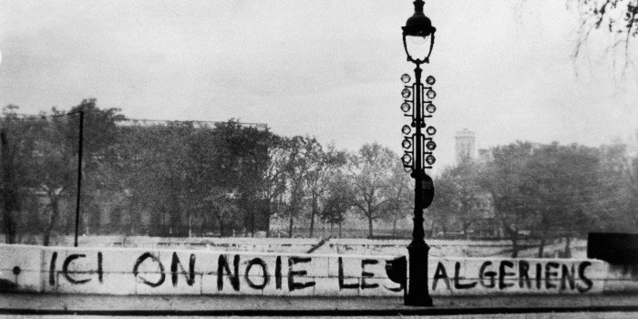

‘Here we drown Algerians’ — 59 years ago, on the 17th of October 1961, the French police killed more than 200 Algerians in Paris\. “The 200 deaths occurred after a peaceful march by some 30,000 Algerians was attacked by a 20,000 strong force of French police, and scores of bodies were later found in the river Seine, after it is believed, the French police killed them, and dumped their bodies in the river\.” \(Read more about it [HERE](https://libcom.org/history/papon-killing-200-algerians-paris-during-1961) and [HERE](https://medium.com/@riadkaced/17-october-1961-the-algerian-civil-rights-movement-in-paris-1defeb023e58) \)
### Featured: Further militarisation at the Evros border

Over the weekend, Greek PM Mitsotakis [visited](https://www.ekathimerini.com/258187/article/ekathimerini/news/new-evros-fence-to-be-completed-by-april-next-year-pm-says-during-on-site-inspection) the border region with Turkey by the Evros/Meriç river, to announce the installation of the new fence at the border\.

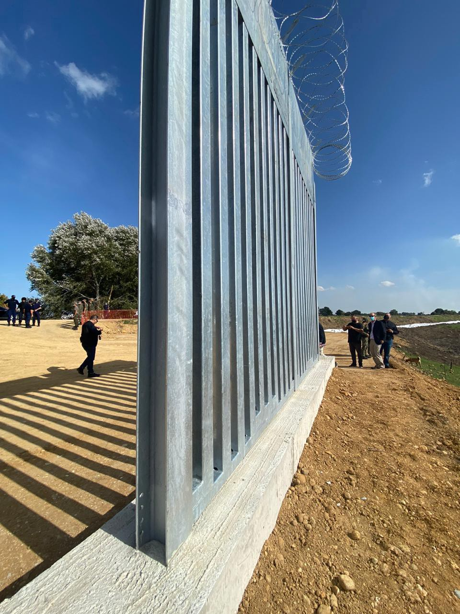

Section of the new fence installed on the Evros border and presentation of the completed fence \(photos by [mr\.w0bb1t](https://twitter.com/_w0bb1t_) \)

The new fence is expected to be completed by April 2021, it will cost €62\.9m, and will be composed of a 27km long steel fence with barbed wire\.

As Stefanos Levidis [explain](https://twitter.com/LevidisStefanos/status/1317428939921461248) s, since 2012 most border crossings have taken place over the Evros/Meriç river \(and across the Aegean\) because Greece installed a fence in the Karaağaç triangle \(the only part of the Greek/Turkish land border not delimited by the river\) \. This fence is defined by border guards and Frontex as a technical obstacle, “ [an obstacle does not stop crossings, it only makes them more difficult \(deadly\)](https://twitter.com/LevidisStefanos/status/1317430913731624960) ”\.

> _‘How can we begin to understand the structure of a wall of deterrence that is equal parts human, animal, plant, object, geography, temperature, and unknown?’_ 

Levidis reframes this [question](https://twitter.com/LevidisStefanos/status/1317432324229877760) , originally posed by anthropologist Jason De León about the US/Mexican border, for the Greek/Turkish border\.

Greek media [report](https://twitter.com/lk2015r/status/1317840820771475458) that the upgrade of border security is not limited to the new fence\. The old fence will be extended, 8 new observation posts on the walls will be installed and the 57 existing ones will be renovated with the deployment \(this has already happened\) of sound cannons/LRADs\.

Long Range Acoustic Devices \(LRADs or Sound Cannons\) are designed to “generate extremely loud high\-frequency sounds specifically intended for the dispersal of crowds, which can also cause pain, disorientation, and injury to those exposed to them\.” \(Info on how to protect yourself [HERE](https://pitchfork.com/thepitch/understanding-the-lrad-the-sound-cannon-police-are-using-at-protests-and-how-to-protect-yourself-from-it/#:~:text=These%20audio%20devices%2C%20colloquially%20known,to%20those%20exposed%20to%20them.) \)

Existing border surveillance technologies — drones and cameras — will be [upgraded and increased in number](https://twitter.com/lk2015r/status/1317840822302375938) \. 80 armoured security vehicles \(M1117\) have been acquired from the US and most of them will be deployed at the border\. 400 border guards will be deployed soon with 800 more to be hired in the near future\.

As Lena K\. notes, Evros has long been a [militarised area](https://twitter.com/lk2015r/status/1317414890404040704) , well beyond the fence\. The border is comprised by civilian and military assemblages used to control cross border movement\.

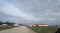

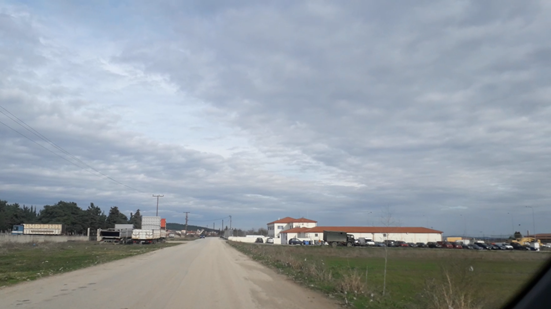

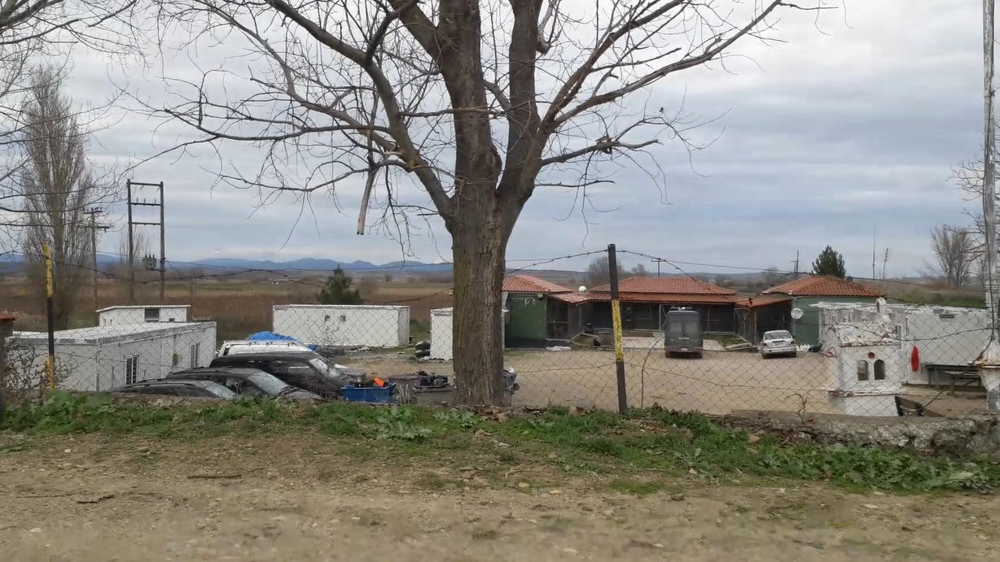

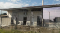

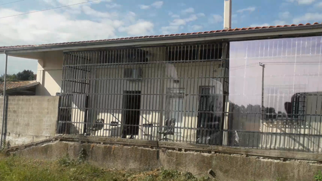

Left to Right: \(1\) Feres Border Guard station\. Surrounded by fields and farms, outside the town\. One of the main detention places in the area\. \(2\) The Poros ‘informal’ detention site revealed in March\. It’s near the location of the new fence\. Mostly forgotten now, at least until that CoE report is finally published\. Testimonies often point to more secret/informal detention sites in Evros\. \(3\) This is the ‘cage’ at the back of the Tychero Border Guard station\. Believed to be the outside space for detainees\. \(Photos and text by [Lena K\.](https://twitter.com/lk2015r/status/1317414890404040704) \)

This is nonetheless a new step towards a full\-on militarisation of the border\. It is unclear if this will be paid for with national or EU money\. For now, not a single objection was raised by [Greek political parties](https://twitter.com/lk2015r/status/1317840823845871617) or by the [EU Commission and Council](https://twitter.com/lk2015r/status/1317840825330655233) \.

SEA
### 6 people die while the whole of the civil fleet is blocked

As we reported before, Sea\-Watch 4, Sea\-Watch 3, Ocean Viking, Mare Jonio, Aita Mari, Moonbird and Alan Kurdi are effectively [blocked](https://twitter.com/MSF_Sea/status/1316295131331469314) by EU & Italian authorities\.

While no humanitarian vessel was able to take to the sea, on Sunday, Alarm Phone was [contacted again](https://twitter.com/alarm_phone/status/1317591662160433153) by relatives of people on board a dinghy that had left from Algeria on the 9th of October and was still at sea more than a week later\. The boat left the coast of Annaba with 12 people on board\. Since Tuesday 13th, Alarm Phone has alerted EU authorities, but nothing has been done\. Finally, on Sunday night, when the dinghy was not far from Sicily, the Italian coast guard launched a rescue operation\. Only six people survived, while the other six died of thirst and hunger\.

Six more people killed by EU policies\.

GREECE

**Lesvos: Racist Attack in Mytilene**

The struggle continues on the island as [Lesvos Solidarity report](https://www.facebook.com/pikpalesvos) :

> _To date, we didn’t receive any written confirmation of the postponement of the closure of PIKPA camp, neither of a new deadline\. Are we faced with a threat of closure within a few days, weeks or months? We do not know\._ 

> _At the same time, after the historical judgement in the Golden Dawn trial, we see the local far right in full action across Mytilene\. A young woman was violently attacked at 8pm last night in the middle of the town centre by a known far\-right local, who sits in the Municipality Council\. Luckily there were witnesses and somebody intervened to prevent worse from happening\. The case is with the police\._ 

> _It is not a coincidence that the first song we played to celebrate the postponement of closure of PIKPA was [“Siga min klapso”, the anthem by Pavlos Fyssas](https://www.youtube.com/watch?v=mn_MicxHLmQ&fbclid=IwAR2NWWXVgut33K4M93btzpAQkEKmMPxZc8iR4wgwHeHw9nHpgN_zi7OmzFQ) who was brutally murdered by Golden Dawn on 18 September 2013\. Because despite the condemnation of Golden Dawn, we see the far right spreading all around us\. And what is being done to stop them? The notorious far\-right aggressor walked free last night\._ 

> _The struggle continues\. For solidarity and equality\. Against hate, racism and fascism\. SIGA MIN FOVITHO — I WON’T BE AFRAID\._ 

The man charged with the attack is a [member of the far\-right group Free Citizens](https://www.stonisi.gr/post/12217/akrodeksios-en-drasei?fbclid=IwAR1nX5crRQxIUWISXjBxikNrsJHWFA2zx-l_VRe62P7NDXKq1A5MmPh2ISo) and was also involved in the attacks on refugees in Sapphos Square in April 2018\. The deputy mayor of culture of the municipality of Mytilene “ [rushed to the police department](https://www.stonisi.gr/post/12217/akrodeksios-en-drasei) ” to act as a lawyer of the man charged\. Local antifascists “ [intervened](https://twitter.com/Refugees_Gr/status/1317775125937328128) ” in the streets of Mytilene with slogans and graffiti\.
### Lesvos: One month later, Moria 2 is worse than ever

We have reported several times about the conditions in the new camp Moria 2 in Kara Tepe, Lesvos, which have dramatically worsened after the recent rain\. [RSA](https://rsaegean.org/en) provided a breakdown of the situation for people on the move inside the camp\. Read it [HERE](https://rsaegean.org/en/moria2-serious-gaps-in-conditions-amidst-the-pandemic-and-winter-arrival/) \.

ITALY
### Evictions and propaganda in Roma

On Thursday, local authorities [cleared \(again\)](https://amp.romatoday.it/attualita/largo-spadolini-raggi-baobab-sgombero.html) the area outside the Tiburtina train station, where for years Baobab Experience volunteers have set up an outpost to provide support for people on the move and homeless people\. Over the past years, the outpost has been evicted so many times that the volunteers have lost count\. This time, the mayor of the Italian capital [boasted on social media](https://twitter.com/BaobabExp/status/1317077889712533504) about the “successful cleaning and disinfection operation”, thanks to which “homeless people and migrants present in the area were taken care of in order to verify the situation on a case\-by\-case basis and send them towards suitable inclusion paths”\.

Baobab Experience [recall the events](https://twitter.com/BaobabExp/status/1317077889712533504) which they describe as an eviction:
- The cleaning and disinfection operation meant throwing away blankets used by people sleeping rough, the last “shelter for those excluded from the institutional circuit of reception”\.
- People who were supposedly “taken care of”, have been identified and less than a third obtained a place to sleep, while 14 of them have been “abandoned on the streets” again\.
- In the following days Baobab Experience was in the area again, providing food and blankets to those in need\.

SPAIN
### Caminando Fronteras to support families of people lost at sea

More than 700 families on the African continent are still hoping to hear from relatives who went missing on the Canarian route months or even years ago\. In a meeting held this past week in Gran Canaria, [Helena Maleno](https://twitter.com/HelenaMaleno) , of [Caminando Fronteras \(Walking Borders\)](https://twitter.com/walkingborders) explains how Spanish authorities consistently delay the identification of bodies that wash up on the country’s coasts or are rescued at sea, while also criminalising families who demand information about their loved ones\. [Caminando Frontera announced that they are working on a simple guide to help family members to know what happened to those missing at sea](https://www.eldiario.es/canariasahora/365-dias-de-migraciones/sidy-magassa-700-busquedas-respuesta-ruta-migratoria-canaria_132_6297514.html?fbclid=IwAR3En840VJMEnvqkKnaR-xxG1NLY5-vZcYTsOxrTJFUJNb1fKqcSij3Bp_E) \. For most of them, it means knowing if and how they can mourn them, if they have received a burial according to their beliefs or who accompanied them in their final moments\.

> _“There is a will not to see the dead and missing people\. Because when you hide the victims, you hide the perpetrators\. What is behind all these victims is hidden and how are the policies that cause death”\. \( [Helena Maleno](https://www.eldiario.es/canariasahora/365-dias-de-migraciones/sidy-magassa-700-busquedas-respuesta-ruta-migratoria-canaria_132_6297514.html?fbclid=IwAR3En840VJMEnvqkKnaR-xxG1NLY5-vZcYTsOxrTJFUJNb1fKqcSij3Bp_E) \)_ 

### Campaigning against racism while implementing racist policies

[Regularizacion Ya](https://twitter.com/RegularizacionY) , the campaign for the regularisation of all people on the move in Spain, denounce the latest hypocritical announcement of the Spanish interior ministry, which has recently launched a campaign against discrimination and racism\. The problem is that this is the very ministry responsible for a number of racist policies:
- Locking migrants up in CIEs is racist\.
- Knocking down shacks without settlement solutions is racist\.
- Deporting 700 Tunisians who have been in the CETIs in Ceuta and Melilla for more than a year while awaiting asylum is racist\.
- Attacking migrant children is racist\.

BALKANS
### BVMN — Balkan regional report on pushbacks and border violence, September 2020

The [Border Violence Monitoring Network \(BVMN\)](https://www.borderviolence.eu/balkan-region-report-september-2020) published their monthly report on the Balkan region\. \( [FULL REPORT](https://www.borderviolence.eu/wp-content/uploads/September-2020-BVMN-Monthly-Report.pdf) \)

In September, BVMN documented 40 cases of pushbacks along the Balkan Route and in Greece, analysing how these illegal and violent acts function, and how they impact people on the move\.

> _In a month where the European Union released its controversial Pact on Migration and Asylum, the stories of 1548 people recorded by BVMN show how the existing border system is already underpinned by abuse\._ 

The report provides information on a chain pushback from Austria to Bosnia\-Herzegovina, alongside analysis of trends in pushbacks from Croatia and from North Macedonia to Greece\. It also looks into improvised weapons used by the Romanian police, Italian military deployment at the border, upheaval in Bosnia\-Herzegovina’s Una\-Sana Canton and state\-led disruption to transit communities in Northern Serbia\. Over 1,000 people were pushed back from Greece to Turkey: “pushbacks have created an impasse on the Aegean Sea and Greek authorities \[are outsourcing\] pushback processes on the Evros river\.”

> _Seen within the context of the devastating fire in Moria, and internal violence in cities like Patras, these pushbacks are situated in a wider climate of intensified bordering practices in Greece\._ 

BOSNIA AND HERZOGOVINA

**Spike in violent pushbacks at Bosnia/Croatia border**

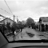

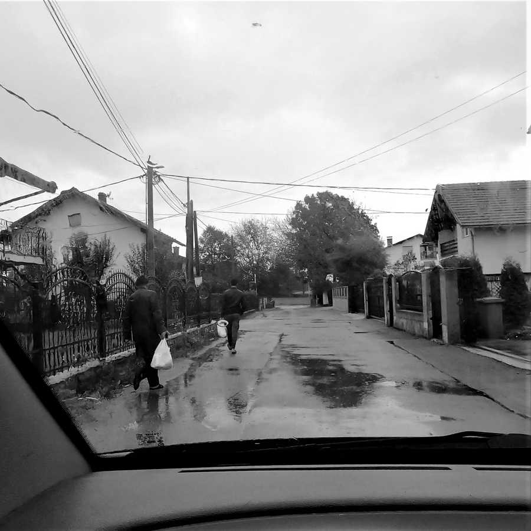

\(Photo Credit: [Mario and Katie, No Name Kitchen](https://twitter.com/NoNameKitchen1/status/1317766947891777536) \)

No Name Kitchen continue to report on pushbacks at the Croatian border:

> _Last Tuesday, after our daily deliveries, we were approached by some people on the move who had just been pushed back by the Croatian police\. One of them had an open head wound\. They had no mobile phones with them, light clothes and came to ask for food, clothing, and bandages\. Minimum temperatures dropped to 10°C last week and it has been raining since the weekend\. — [Information and pics By Mario and Katie\.](https://twitter.com/NoNameKitchen1/status/1317766947891777536)_ 

The Cetingrad area from the Croatian/EU side has seen the heaviest rise in violence\. The most recent documented testimony collected by No Name Kitchen dates from Oct 15th \( [there is also another from the 11th](https://www.borderviolence.eu/violence-reports/october-11-2020-0022-videkic-selo-croatia/?fbclid=IwAR00DJVLileWgISCp69qSzzNIKP9EsO_LrzR2zTH4f-TKvrys43A-IgiKJM) \) and is published by [Border violence Monitoring](https://www.borderviolence.eu/violence-reports/october-15-2020-0000-buhaca-croatia/?fbclid=IwAR0h5SMuhUfzLw3mgjY6eIReW6SmbPA4V6lGNDsLbk-BeIf4wwY2C8vwH6s) Network\.

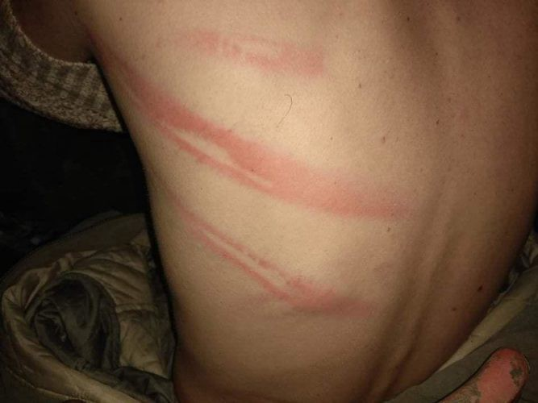

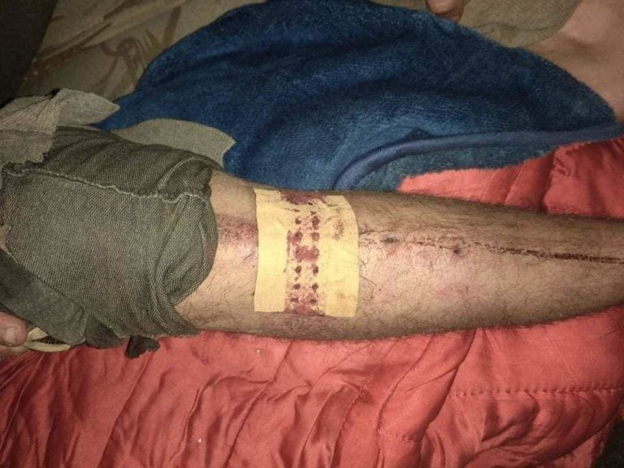

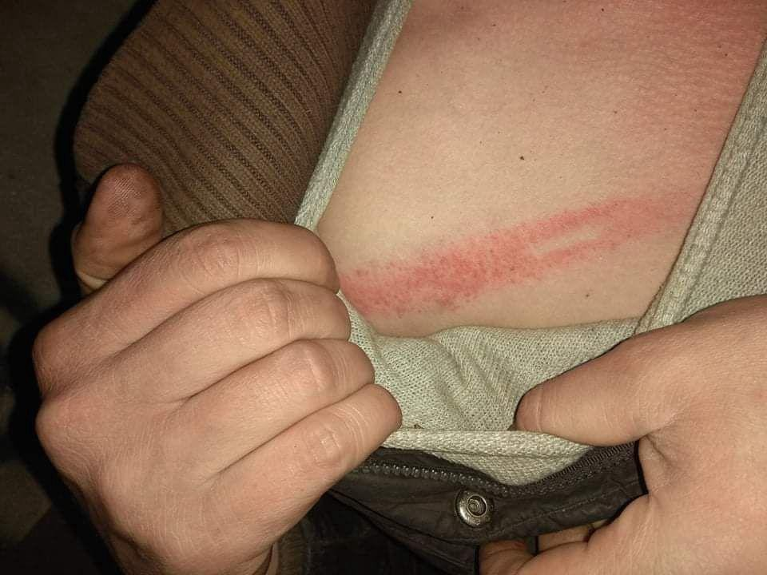

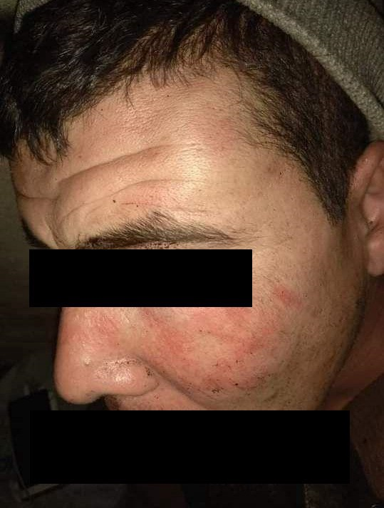

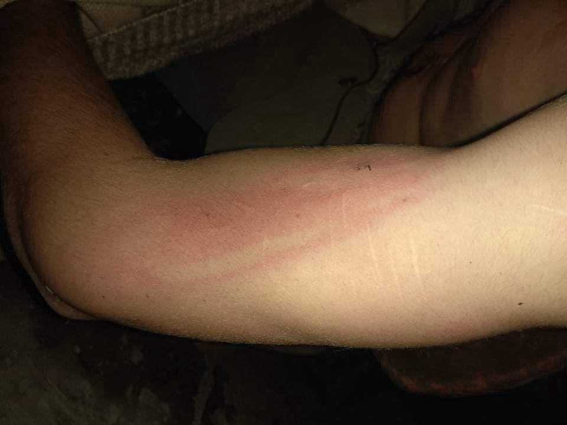

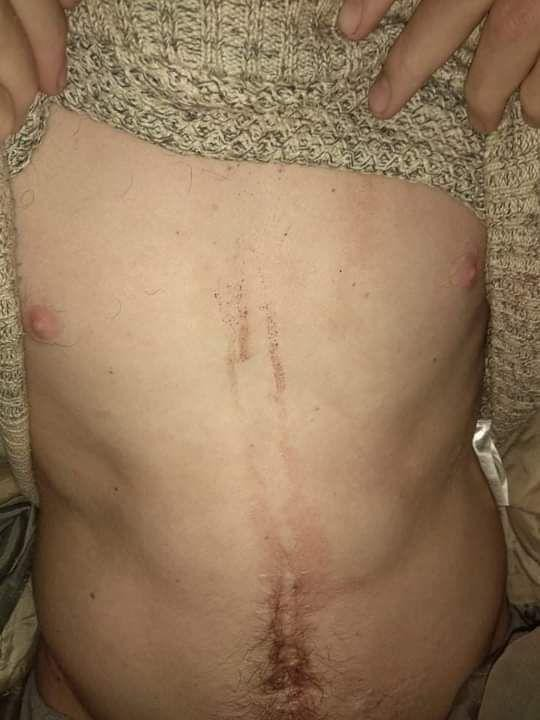

\(Photo Credit: [No Name Kitchen](https://www.borderviolence.eu/violence-reports/october-15-2020-0000-buhaca-croatia/?fbclid=IwAR0h5SMuhUfzLw3mgjY6eIReW6SmbPA4V6lGNDsLbk-BeIf4wwY2C8vwH6s) \)

> _“They were beating me from every side with everything,” the respondent said\. “With the baton, they hit me with their fists, they kick me\. On my back, on my head, on my legs, everywhere\.”_ 

> _The respondent estimated the men were beaten for about an hour\. Afterwards they were forced to get up and undress to their boxer shorts and remove their shoes\. Their clothes and belongings were put in a pile and set on fire\. The respondent is an asthmatic, so he asked one of the policemen if he could keep and use his asthma spray; instead the officer took the spray out of his hand and threw it into the woods\._ 

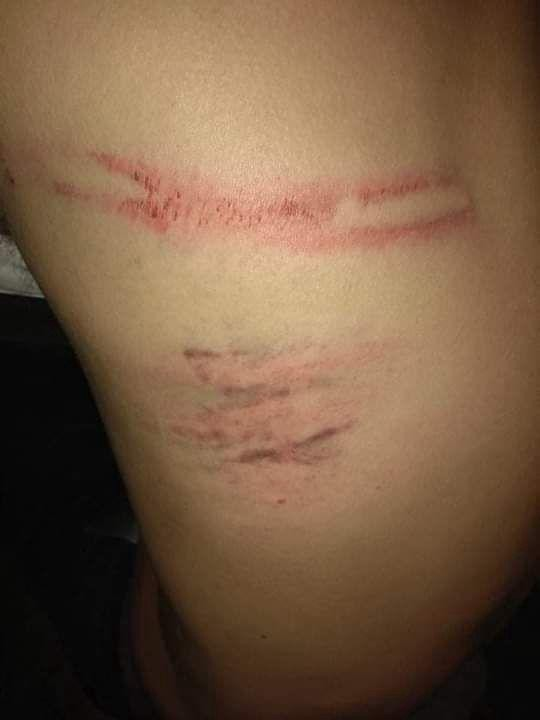

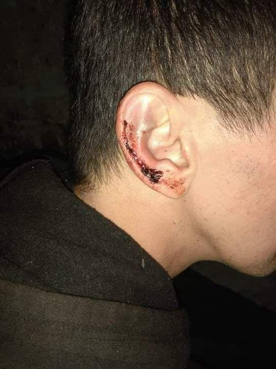

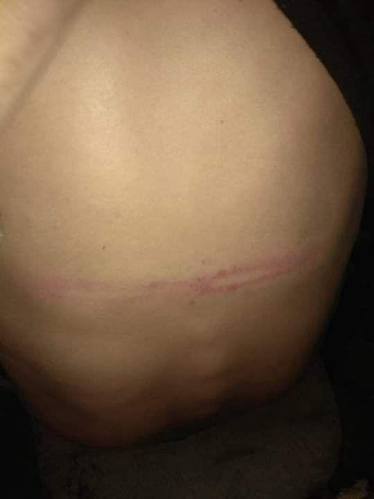

\(Photo Credit: [No Name Kitchen](https://www.borderviolence.eu/violence-reports/october-15-2020-0000-buhaca-croatia/?fbclid=IwAR0h5SMuhUfzLw3mgjY6eIReW6SmbPA4V6lGNDsLbk-BeIf4wwY2C8vwH6s) \)

> _All the group members then had to line up in single file, holding their hands behind their heads\. When the respondent did not immediately put his hands behind his head, one of the police officers threatened him with his gun, whispering to him, “Next time I will kill you\.” The group was then forced to walk over the border into Bosnia accompanied by the six police officers\. The people on the move were walking in single file with the officers flanking them on both sides\. As all of the group members were seriously injured, they advanced very slowly, and the officers kept striking them to keep the group walking until they arrived\. They walked for approximately ten minutes, and the police released the men at approximately 4:00 am in one of the forests surrounding Velika Kladusa\._ 

> _The push\-back resulted in serious injuries for all nine men: open wounds on their heads and legs, black eyes, welts and marks from the strokes, mainly on the upper body and extremities, and at least one sprained foot\._ 

FRANCE
### Solidarity march in Paris

On Saturday 17th of October the third act of the [Marches of Solidarity](https://solidaires.org/Acte-3-marche-nationale-des-Sans-Papiers) took place in Paris\. Thousands of _sans papiers_ and people in solidarity took to the streets of the capital, demanding regularisation, the closure of CRAs and housing for all\.
### Access to rights and healthcare in France

[Medicins du Monde](https://www.medecinsdumonde.org/) published their report on access to rights and care for 2019\. \( [Full Report](https://www.medecinsdumonde.org/fr/actualites/publications/2020/10/14/observatoire-de-lacces-aux-droits-et-aux-soins-2019) and [Summary](https://www.medecinsdumonde.org/fr/actualites/publications/2020/10/14/synthese-de-lobservatoire-de-lacces-aux-droits-et-aux-soins-2019) — in French\)

> _In 2019, our programs and actions took place in a difficult political, economic and social context which deteriorated and hardened\. These findings illustrate the political refusal to act on genuinely effective levers and to implement the means up to the central challenges of public health and living together\. In this degraded context, Médecins du Monde, like many other associations, wonders about the role that certain public actors seem to want to give it\. **We are not intended to become, by substitution, a “public service for the poor”\. It is for the State and for it alone to guarantee the equality of all in terms of health\.**_ 

### Not only Paris: a focus on Bordeaux

In 2019, nearly 2,500 people were followed by the [Bordeaux MDM centre](https://www.sudouest.fr/2020/10/15/bordeaux-les-statistiques-alarmantes-de-medecins-du-monde-7965918-2780.php?fbclid=IwAR0obCux5LHj67uSMTsafHL-oXJQSVW8N5VGTZ0aVnX13UKn6ScamCo4Co8) , in south\-western France\. In terms of attendance, it is the third largest in France, after those in Paris and Seine\-Saint\-Denis\.

> _98 to 99% of the people we follow are migrants … They are sick because they migrate, not the other way around\. \( [Bernard Broustet, MDM regional secretary](https://www.sudouest.fr/2020/10/15/bordeaux-les-statistiques-alarmantes-de-medecins-du-monde-7965918-2780.php?fbclid=IwAR0obCux5LHj67uSMTsafHL-oXJQSVW8N5VGTZ0aVnX13UKn6ScamCo4Co8) \)_ 

The organisation’s centre is open 5 days a week, most of the people visiting have chronic illnesses, and half of them are homeless\. “Anxiety and irregular living conditions have a lot to do with it\.” Volunteers also support people on the move in accessing their health care rights, which are often ignored due to the many administrative barriers in place\.

Around 3,000 people live in squats or sleep rough in the city, with scarce access to drinking water\. The numbers have doubled in the last five years\. MDM are supporting these informal housing solutions, providing water and, through their outreach services, opposing the authority’s policies of evictions while campaigning for universal access to shelter and housing\.

UK

**Another human has lost their life trying to reach the UK**

The body of a man wearing a life jacket has washed up on Sangatte Beach close to where a [dead Sudanese boy](https://www.theguardian.com/world/2020/aug/19/sudanese-teenager-found-dead-on-beach-near-calais-sangatte) was found in August\.

We echo the words of Care4Calais and call for an end to the rhetoric of hate coming from the highest levels of the British Government which is preventing any serious move towards safe and legal pathways to the UK\.

**A Letter to the UK Government on Anti\-Slavery Day**

The letter has been [signed by over 50 experts](https://afterexploitation.com/2020/10/17/anti-slavery-day-50-experts-call-for-end-to-harms-facing-survivors/?fbclid=IwAR2-vzP3bXw6XLgebymgWv_Mf_Pid26p4nItimNEyMEntCfezGbGPn13R4o) on modern slavery as it is revealed the [thousands of children who have been trafficked have been put at risk of deport](https://twitter.com/ECPATUK/status/1317448163863789569) ation from the UK\.

> _Dear Prime Minister,_ 

> _We, the undersigned, are advocates, researchers, and experts by experience challenging the impact of modern slavery through our work\._ 

> _This Anti Slavery Day, we write with urgency\._ 

> **_The UK’s emphasis on immigration control, at the expense of human dignity and safety, is threatening efforts to identify and support survivors of trafficking\._** 

> _Modern slavery deprives people of their liberty, and often leaves victims with the life\-long legacy of physical, mental or sexual abuse\. Yet, too many victims who seek help from the authorities are subject to harmful immigration control measures rather than support\._ 

> _1,256 potential trafficking victims were held in prison\-like detention centres, last year alone, due to their immigration status\. Many will go on to become ‘confirmed’ victims, with 42 already recognised as having been trafficked [\[i\]](https://afterexploitation.com/2020/10/17/anti-slavery-day-50-experts-call-for-end-to-harms-facing-survivors/?fbclid=IwAR2-vzP3bXw6XLgebymgWv_Mf_Pid26p4nItimNEyMEntCfezGbGPn13R4o#_edn1) \. Conversely, the State only convicted 35 traffickers in the same period\._ 

> _In practice, we hold more survivors, than perpetrators, behind bars\._ 

> _Modern slavery is routinely referred to as a ‘hidden crime’ but, with no immigration protection in place for survivors, it is little wonder that victims of exploitation are so rarely counted\. It is well documented by Non\-Governmental Organisations that traffickers use the threat of detention and forced removal to ensure compliance from those they abuse\. An exclusive focus on immigration control is playing into traffickers’ hands, making it harder for victims to come forward\._ 

> _To ensure that victims report this crime, receive support, and pursue justice where it is right for them, the Government must provide at least 12 months’ support and immigration protection for survivors, as outlined in the Modern Slavery \(Victim Support\) Bill\. The Government must also introduce an absolute bar on the detention of confirmed and potential victims of slavery, and address the high numbers of vulnerable people deemed suitable for detention\._ 

> _We are concerned that traffickers will also be emboldened by proposed policies to prejudge asylum claims on the basis of the time at which they are made, or the route by which the claimant arrived\. Victims of trafficking often have no choice but to claim asylum months or years after first entering the country\. This will impact many survivors, for whom the factors that made them vulnerable to traffickers in the first place will pose further threats upon removal\. Worryingly, even under the current asylum process, many trafficked people already struggle to secure the international protection they need from a system notorious for disbelief\._ 

> _Lastly, we must challenge the narrative that tougher borders stop human trafficking\. On the contrary, trafficking is made profitable through a lack of safe and legal routes, and made sustainable through policies which deter victims from seeking help\._ 

> _We ask for the UK Government to turn the tide\._ 

> _This Anti Slavery Day, we call for a commitment to ensure that victims of trafficking do not face punitive immigration control measures if they come forward for support\. Asylum applications must be considered on merit, in a framework that acknowledges that many who make asylum claims, including survivors of modern slavery, have no choice but to arrive spontaneously or claim asylum after having been in the UK for some time\. First and foremost, any reform to our immigration system must seek to remedy, rather than entrench, the wrongs committed against survivors of modern slavery\._ 

> _The UK has played a crucial role in sounding the alarm on this heinous crime, at home and on a global stage, with the passage of the Modern Slavery Act 2015\. However, without action, traffickers will continue to benefit from hostile immigration policies\._ 

**Refugees Welcome Protest outside Napier Barracks in Folkstone**

300 people gathered outside the controversial refugee camp on Saturday to support the people being forced to live there\. [Kent Refugee Action Network](https://twitter.com/_KRAN_/status/1317410709764976640) \(KRAN\) organised the demo and residents of the camp also took part from the inside\.

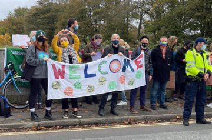

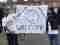

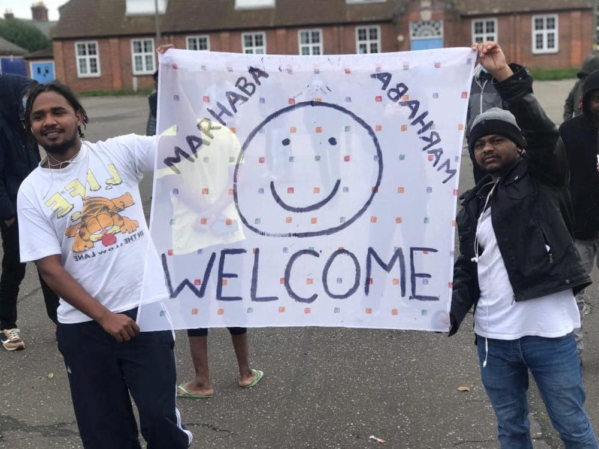

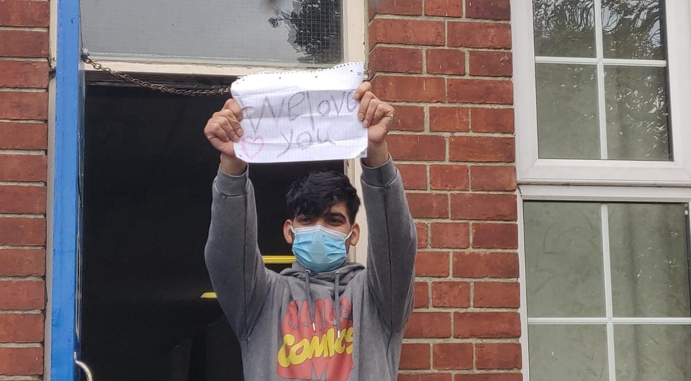

\(Photo Credit: [Care4Calais](https://twitter.com/Care4Calais/status/1317440610903744512?fbclid=IwAR3qpv8-N3BjkoxtGehloGe1QlqNEAzGQuKStq8mj82cklzXtHPhZXxORII) \)

A resident of the barracks [responded to the demonstration](https://twitter.com/i_7_8/status/1317486646577815552) :

> _I am a resident of Napier Barracks, and I felt very satisfied with everyone who came to welcome us\. You broke the barrier of fear and anxiety that we had\. You made us feel welcome in your beautiful town\. Thank you all from the bottom of the heart_ 

The [British Red Cross have also the challenged the government](https://www.kentlive.news/news/kent-news/british-red-cross-says-napier-4615770?fbclid=IwAR00DJVLileWgISCp69qSzzNIKP9EsO_LrzR2zTH4f-TKvrys43A-IgiKJM) stance on this and stated that the space is not appropriate for housing asylum seekers\.

**Dungavel Detention Centre COVID\-19 Outbreak**

Human Rights Lawyers are [calling for the Immigration Removal Centre to be closed](https://www.dailyrecord.co.uk/news/scottish-news/calls-close-dungavel-detention-centre-22833455) as the Home Office has confirmed the outbreak while refusing to state the numbers of those infected\. Many detainees are known to have pre\-existing physical and mental health conditions for which this privately run centre is already not equipped\.

WORTH READING
- [The questionable safety in ‘safe zones’](https://wearesolomon.com/mag/on-the-move/the-questionable-safety-in-safe-zones/) — _Theoretically, “24\-hour care and emergency protection” is provided to the unaccompanied minors in the safe zones of the refugee camps\. But the cases that Solomon brings to light show that reality is often far from what is expected in theory\._
- [El libro de Abou / The book of Abou](https://alfayomega.es/el-libro-de-abou/) — Alpha y Omega tells the story of Abou Dakite, a 15 year old from Côte d’Ivoire, who was rescued on September 18th by Proactiva Open Arms and transferred on a quarantine ship off the Sicilian coast, where he was held until the 30th of September, despite having tested negative for Covid\-19 and being very ill\. He was transferred to Palermo’s hospital too late\. He died there on the 5th of October\. An investigation has been opened\. “ _The story of Abou Dakite carries the same refrain as so many similar ones before which we keep silent, because it is always more comfortable to be silent than to stop to ask\._ ” \(In Spanish\)
- [From Sudan to the Park Inn: the tragic story of a migrant’s killing](https://www.theguardian.com/uk-news/2020/oct/18/from-sudan-to-the-park-inn-the-tragic-story-of-a-migrants-killing) \. On June 26th, Badreddin Abadlla Adam left his room at the Park Inn hotel in Glasgow, walked down to reception, and stabbed six people, before being shot dead by police\. “ _The Park Inn incident has highlighted the increasingly precarious situation of people who seek a safe haven in the UK, even as the government proposes more severe measures to deter them\. Adam is one of three asylum seekers who have died in Glasgow since the start of the pandemic, a series of events that has shocked the city, and left campaigners and politicians calling for a public inquiry\.”_

**Find daily updates and special reports on our [Medium page](https://medium.com/are-you-syrious) \.**

**If you wish to contribute, either by writing a report or a story, or by joining the info gathering team, please let us know\.**

**We strive to echo correct news from the ground through collaboration and fairness\. Every effort has been made to credit organisations and individuals with regard to the supply of information, video, and photo material \(in cases where the source wanted to be accredited\) \. Please notify us regarding corrections\.**

**If there’s anything you want to share or comment, contact us through Facebook, Twitter or write to: areyousyrious@gmail\.com**

_Converted [Medium Post](https://medium.com/are-you-syrious/ays-weekend-digest-17-18-10-2020-further-militarisation-at-the-evros-border-ec8f364832e7) by [ZMediumToMarkdown](https://github.com/ZhgChgLi/ZMediumToMarkdown)._
