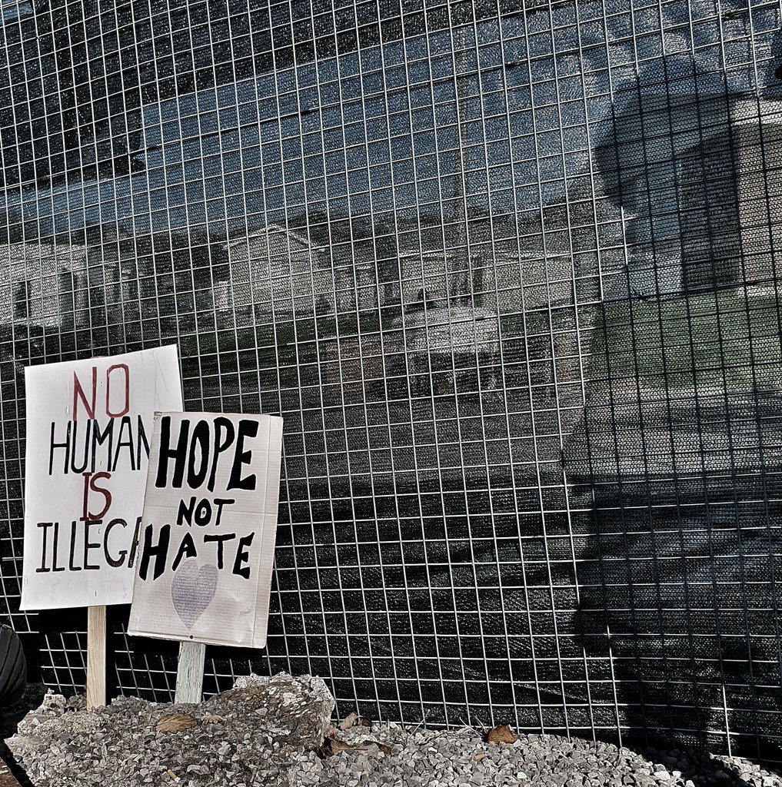
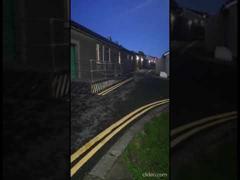
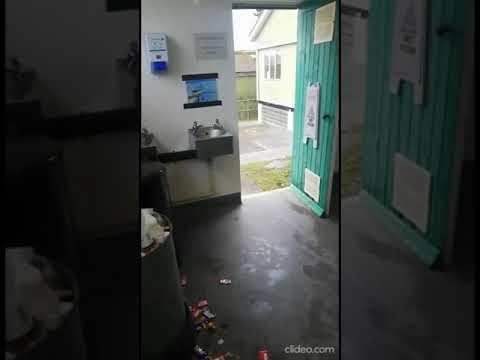

### **AYS Special: A Voice from inside Penally Refugee Camp**

\(Photo Credit: @PembsR\)

The Pembrokeshire Coast in Wales is famous for many things, the long sandy beaches, the clear water, and the new refugee camp opened without warning at the end of September\. The first asylum seekers arrived on September 28th, there are now over 100 people trapped there\.

John\* had already been there for nearly two weeks and prior to this had survived over a year on Lesvos, 3 months of which was spent in the hell that was Moria Camp\. Before he had to flee his country he was an admin and finance officer for an oil and gas company and an English teacher\. He now volunteers as a cultural mediator helping other asylum seekers with their cases\.

In the UK, John was being housed along with many others in a hotel in Victoria, central London\. In order to ‘transfer’ him to Penally, the Home Office rang his hotel 20 minutes before his supposed departure to tell him to gather his possessions\. This happened 3 times, the 1st time at 2am, the 2nd at midday and 3rd at 5pm\. On this last attempt they did come to pick him up, 3 hours later, in a minivan which took him to a bus station were nearly 30 other people were also waiting\. Nobody knew where they were being taken\.

When John arrived to Penally, he was given a box with a clean sheet, a plate, a spoon, a fork and a knife, a small locker with no lock and a room with no lock either\. The beds are screwed to the floors and the walls\. The showers are communal\. The toilets are constantly flooded\. He says it feels like systematic abuse:

“putting us in a camp to make us feel like there was nowhere else for us to stay, that this was a last resort, it’s racist, it’s systematic, it’s anti migration, it’s everything…”

Penally is a former army training camp and still looks like one, a militarised and unwelcoming space\. Each room houses 6 people, making it impossible to maintain social distancing\. The kitchen is only accessible during meal times and residents have no cash allowance to supplement their food or buy other necessities\. Yet, they are not allowed to work and earn an income\. Due to the poor quality, some people have stopped taking meals altogether\.

Complaints are permitted but interpreters are not always provided leaving the residents to translate for each other, if they are lucky enough to find another person who speaks their language and English\. Residents are not provided with clothes and they have no money to buy them\. Charities are not permitted to distribute directly but some friends of those inside did manage to campaign for clothes and shoes more appropriate to the winter weather\.

There is no private space, even for meetings with lawyers in which people must discuss the personal details of their asylum claims, and legal support is limited even though they are entitled to free legal aid under Section 95 of the Immigration and Asylum Act 1999\.

“Theoretically, there is access to free legal aid if you have the language skills and the patience to go through the hurdles\. You are to contact Migrant Help who will provide you with a list of lawyers that you are to contact by yourself\.”

Though when you do this you will discover they all have waiting lists\. John had to find his own lawyer independently\.

Wi\-Fi access and network coverage are extremely limited adding to the sense of isolation\. Penally is located off a highway, no one has money for public transport, and they are on a curfew from 10pm to 10am so cannot visit friends from their former lives in London\. As a result they are indirectly detained adding to people’s pre\-existing health problems and creating more, many people suffer from insomnia and PTSD:

“Putting us in this camp re\-traumatises people\. It looks like a prison\.”

It takes 40 minutes to walk to the nearest town, but on the day we spoke, October 17th, John was told he could not go outside because the people on the other side of the gate might be aggressive\. Later that day local media reported that [two people were arrested](https://www.westerntelegraph.co.uk/news/18802261.protestors-arrested-police-obstruction-outside-penally-asylum-seeker-camp/?fbclid=IwAR20Y9kmHltFYF_tJdVP-euHojYNtb-jUWiLRODH4lVyuwQH8VJ7rBBXWRg) outside the camp for obstructing a police officer and racially aggravated offences\. There were approximately 15 people present from anti\-refugee groups\. The day before this incident the Welsh Government had called on the Home Office to close the camp as [it did not meet basic human needs](https://www.westerntelegraph.co.uk/news/18799491.welsh-government-deputy-minister-jane-hutt-calls-speedy-end-penally-camp-use/?fbclid=IwAR2LCR5CKpqqXhvg71JsvgswtNwexg4lR6q0LaReBzR5xxtUnAC4bZ7QVic) \. Wales, which is working towards being a Nation of Sanctuary, was unfortunately unable to prevent the plans of the Home Office and condemn their lack of planning regarding COVID\-19\.

On the same day, other people instead came to show their support providing a little comfort for those inside while condemning the conditions they are forced to live in:

■■■■■■■■■■■■■■ 
> **[Stand Up To Racism](https://twitter.com/AntiRacismDay) @ Twitter Says:** 

> > Well done local anti racists in Penally, Wales, who again showed solidarity with refugees &amp; opposed the far right. Join them, @[Care4Calais](https://twitter.com/Care4Calais) &amp; many more @[AntiRacismDay](https://twitter.com/AntiRacismDay) International Conference this weekend! @[sutr_wales](https://twitter.com/sutr_wales) @[WalesOnline](https://twitter.com/WalesOnline) @NoToHateInWales https://t.co/gzFGWikV1D 

> **Tweeted at [2020-10-17 12:36:02](https://twitter.com/antiracismday/status/1317444256970178561).** 

■■■■■■■■■■■■■■ 

Penally Camp is run by the infamous company Clearsprings\. In 2017 the accommodation they provided in Cardiff was [described as disgraceful](https://www.walesonline.co.uk/news/politics/asylum-accommodation-branded-shameful-disgrace-12528229) by Plaid Cymru Home Affairs spokeswoman Liz Saville Roberts when a [government report](https://publications.parliament.uk/pa/cm201617/cmselect/cmhaff/637/637.pdf) detailed the conditions at the Lynx Hotel and other facilities\. These included rat infestations, a serious leak in the ceiling of a child’s bedroom and overcrowding as well as the psychological impact of such conditions on the people forced to survive them\.

This is not the first time that the British Government has placed refugees in a military base in Wales; in the 1970s, they placed [Ugandan Asians at Tonfanau](https://theconversation.com/how-refugees-in-britain-went-from-living-in-old-bunkers-and-stately-homes-to-being-detained-in-cells-98917) , a remote camp in North Wales\. It was six hours travel to the nearest big town by train\. At the time a reporter noted that the barracks they were housed resembled a concentration camp\. Sound familiar?

Since this time, people have instead been held in Immigration Detention Centres run by companies such as G4S and Serco about which there have been repeated and serious concerns raised by human rights groups and even [the government](https://publications.parliament.uk/pa/cm201617/cmselect/cmhaff/637/637.pdf) themselves\. The extent of their malpractice can be seen in just one of many cases against them as in 2014 three G4S employees were charged with the manslaughter of [Jimmy Mubenga](https://www.amnesty.org.uk/press-releases/prosecution-jimmy-mubenga-case-welcome-g4s-must-not-be-let-hook) \. Yet, just this month, they have been awarded [their latest government contract](https://www.independent.co.uk/news/uk/home-news/g4s-contract-hmp-five-wells-wellingborough-northamptonshire-b837495.html) , £300 million to run a new prison\. The point being, the UK government’s standards are supremely low\.

For now, the people forced to live in Penally still await news of their future and fear for their present circumstances\. As John says:

“Behind the fences that are destined to keep us in or keep people out, we are not certain which one it is, we are waiting to be informed about our future\. We are told that we are to stay here for four weeks, but then we wonder why at all\. We learn that because of the Covid restrictions, most services are stopped or delayed, including asylum related services\. We are free to leave the camp but we are concerned that we might be taking a risk and exposing ourselves to hate speech, if not something more dangerous\.”

\*Name changed to protect the identity of the interviewee\.

**Article by Emma Musty, AYS**

**Find daily updates and special reports on our [Medium page](https://medium.com/are-you-syrious) \.**

**If you wish to contribute, either by writing a report or a story, or by joining the info team, please let us know\.**

**We strive to echo correct news from the ground through collaboration and fairness, though volunteer work\. Every effort has been made to credit organisations and individuals with regard to the supply of information, video, and photo material \(in cases where the source wanted to be accredited\) \. Please notify us regarding corrections\.**

**If there’s anything you want to share or comment, contact us through Facebook, Twitter or write to: areyousyrious@gmail\.com**

_Converted [Medium Post](https://medium.com/are-you-syrious/ays-special-a-voice-from-inside-penally-refugee-camp-57f8ea247ab7) by [ZMediumToMarkdown](https://github.com/ZhgChgLi/ZMediumToMarkdown)._
