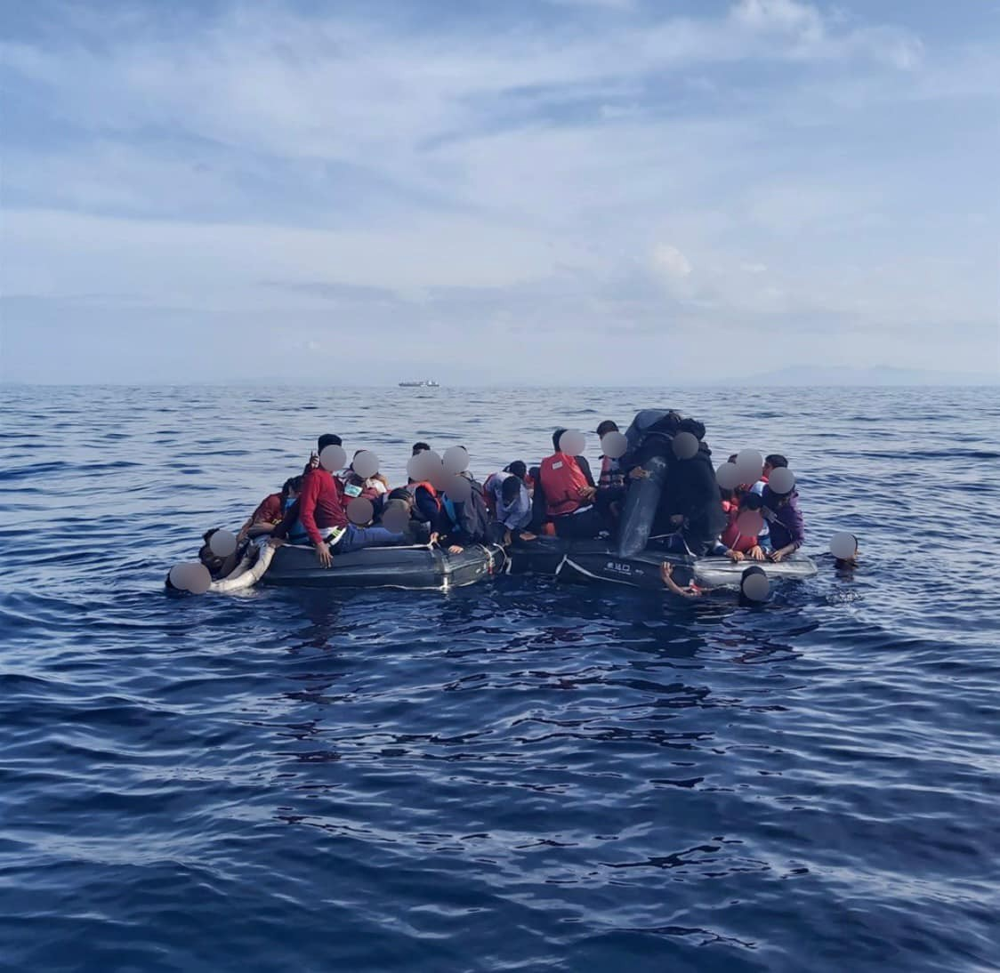

### AYS Daily Digest 21/10/2020: Updates from Canary Islands: Children are being seperated from their Mothers
#### Spike in arrivals on the Canary Islands, children being separated from their mothers // New Pushback on the Aegean // Winter approaching while thousands are sleeping in the forests of Bosnia // German Government does not allow cities to take in refugees // No new regulation for family reunification after UK leaves EU

Pushback in the Aegean Sea on life rafts, to full to carry everybody\. Copyright: Aegean Boat Report
### FEATURE: The Canary Islands

In today’s feature we take a closer look at the Canary Islands\. Over the last weeks, the number of arrivals on the islands has increased dramatically\. On Tuesday 20 October, 375 people were rescued and brought ashore\. This number reflects an overall trend of the last weeks, where a daily number of arrivals of about 300 people has been the norm\. Between October 8 and 10, a total of 1,015 people landed within 48 hours\. This is the highest number of arrivals since 2006 \( [see here](https://www.infomigrants.net/en/post/27862/over-a-thousand-migrants-land-in-spain-s-canary-islands) \) \.

Yesterday, one man did not survive the crossing\. His body was brought ashore for autopsy\. At the beginning of August three young men died of thirst and dehydration\. The same cause of death is suspected for the newest victim\. According to IOM’s missing migrants’ project, at least 271 people have died so far in 2020 when trying to reach the Canary Islands\. It is however very likely that the number of deaths is much higher\. The journey via the Atlantic Ocean is probably the most dangerous\. People start from Morocco, Western Sahara or even Mauritania and Senegal\. From Morocco, the journey is about 100 km, from Mauritania about 10\.000 km\.

While the number of arrivals from Morocco to Spain via the Mediterranean fell sharply this year, it remains obvious that border control does not stop migration, but only leads to more dangerous routes being used\. Morocco received extensive EU funding for controlling its Mediterranean coast and stopping people from embarking in 2019\. The shift to the much longer and more dangerous Atlantic route is the direct result of this use of European funding\.

For the people who are rescued or make it to the islands themselves, the situation is not easy\. We see a situation similar to the one on the Greek islands evolving: the Spanish government is reluctant or unable to provide fast and humane accommodation for the people\. Hundreds are sleeping on the ground on the dock of Arguineguín, Gran Canaria, as the local authorities are struggling to provide enough housing\. The Spanish human rights activist Txema Santana tweeted yesterday that 1\.088 people are currently on the dock, most of them will have to sleep there\. To put this in perspective, the Canary Islands generally host a total of 13 Million tourists each season\.

The photojournalist Javier Bauluz is present in Gran Canaria but was prevented from accessing the dock by the national police\.

■■■■■■■■■■■■■■ 
> **[Javier Bauluz](https://twitter.com/javierbauluz) @ Twitter Says:** 

> > Día 11. Seguimos sin poder ver personas, solo bultos deshumanizados en lejanía. Cada vez + #periodistas cabreados y ciegos. Exigimos a Gobierno España poder ejercer #Periodismo #SinCensuraPrevia en #FronteraSur #Canarias @[hrw_espanol](https://twitter.com/hrw_espanol) @[EmmaDaly](https://twitter.com/EmmaDaly)  @[jordievole](https://twitter.com/jordievole) @[RSF_ES](https://twitter.com/RSF_ES) @[centre_IRIDIA](https://twitter.com/centre_IRIDIA) 

> **Tweeted at [2020-10-19 21:42:20](https://twitter.com/javierbauluz/status/1318306513316970497).** 

■■■■■■■■■■■■■■ 

Last weekend the Spanish migration minister José Luis Escrivá visited the Canary Islands\. He plans to renovate and reopen a former camp for refugees on Fuerteventura\.

For mothers and children, the situation is even worse\. Under the argument of wanting to prevent child trafficking, mothers and children are being separated until a DNA test proves the motherhood\. According to a newspaper article, since August this happened to 6 children who arrived on Gran Canaria and to six who arrived on Fuerteventura\. In some cases, the children were separated from their parents for more than two months\. The vice\-minister of Social Rights of the Canary Islands Government told the newspaper that she repeatedly asked the Prosecutors Office of the Province of Las Palmas, who is ordering these measures, to stop the practice\.

The European Court of Human Rights has repeatedly condemned Spain for the practices of separating children from their parents in Melilla\.

For the full article in Spanish, see:

Here you can find a very informative piece on the practice of externalization of Spanish borders, collected by a Spanish NGO \(in Spanish\) \.

### GREECE

According to Reporters Sans Frontières, a German media team was held in detention by the police for 7 hours on the island of Samos\. The group was producing a documentary on migration on Samos\. Since they were accused of spying, they were “denied access to lawyer, subjected to humiliating body search & other forms of harassment with the aim to discourage them from reporting”\.

■■■■■■■■■■■■■■ 
> **[RSF in English](https://twitter.com/RSF_en) @ Twitter Says:** 

> > #Greece: A German media team including journalists Larissa Rausch &amp; Manolo Ty suffered a 7-hour detention &amp; mistreatment by the police just because they were producing a documentary on #migration on #Samos. @[RSF_inter](https://twitter.com/RSF_inter) calls on the authorities to stop the intimidation immediately! https://t.co/hx0GfkThVt 

> **Tweeted at [2020-10-20 15:16:45](https://twitter.com/rsf_en/status/1318571868480245761).** 

■■■■■■■■■■■■■■ 

In an interview published on his website, Minister of Immigration and Asylum Notis Mitarakis gave some insight into his plans for the situation on the islands\. Regarding the access of NGOs to the planned closed centers he said:

> “Our goal is to have no one unregistered, and therefore not controlled inside or outside structures\. We work so that by the end of the year the control and certification process is completed and the NGO Register exists\. Immediately after we will proceed to the completion of the register of NGO members\. At the same time, the entry and exit of the new structures will be possible only with the possession of an individual identity card that includes a biometric fingerprint and this will apply to the members of the NGOs and all without exception\. In cooperation with the National Transparency Authority, the Ministry of Immigration and Asylum now exercises financial control over NGOs operating in Greece in the Immigration Department, while in cooperation with law enforcement authorities, we participate in the systematic control of NGO activities in Greece\.” \(Google translate\) 

For the full interview, that also reveals how he is framing refugees as a problem while ignoring the fact that these people have rights, see \(in Greek\):

Meanwhile, the journalist Franziska Grillmeier lets a man who is living in the new camp on Lesvos speak for himself on her twitter account:

■■■■■■■■■■■■■■ 
> **[Franziska Grillmeier](https://twitter.com/f_grillmeier) @ Twitter Says:** 

> > “Another rain, no one can take,” says man in #Moria2.0, “also I hear the police + military complain in this situation. They can’t move cars in mud anymore”, he says, “soon it will rain every day. I was here last winter. And the winter before.”

#KaraTepe #winterization https://t.co/KiONmpHEZs 

> **Tweeted at [2020-10-20 11:26:05](https://twitter.com/f_grillmeier/status/1318513818444701696).** 

■■■■■■■■■■■■■■ 

Aegean Boat Report reported on a group of 59 people who were placed on life rafts outside Lesvos south by the Greek coastguard\. The group drifted for hours before they were found and picked up by the Turkish coastguard\.

> “The two life rafts was packed with people, in such an extent that people had to take turns staying outside the raft in the sea, so that the raft wouldn’t sink\. When people started moving to try to get into the coast guard ship the rafts went under, leaving many people in the sea\.” 

### BALKAN ROUTE

No Name Kitchen reports on the situation in northern Bosnia, were they met a group of 50 families with children in rural outskirts, far from major cities\. Thousands of people are sleeping in the forests close to the European borders\. Many of the children that the team members of NNK met spoke very good Greek\. Apparently many of the families stayed on the Greek islands for years and then left for the Balkan route, ever after being granted asylum but having no financial support or after being rejected and fearing deportation\.

The Member of the European Parliament, Clare Daly, who belongs to the GUE/NGL, delivered a strong speech denouncing the police brutality along the Eastern European borders\.

■■■■■■■■■■■■■■ 
> **[Clare Daly](https://twitter.com/ClareDalyMEP) @ Twitter Says:** 

> > European values? What European values?? The blood of these people, so horrifically mistreated on the Croatian border, is on the hands of @[EU_Commission](https://twitter.com/EU_Commission). When are people going to be held to account for the sickening crimes against migrants happening daily in Croatia? @[DRC_ngo](https://twitter.com/DRC_ngo) https://t.co/mrrxWFohaD 

> **Tweeted at [2020-10-21 09:22:39](https://twitter.com/claredalymep/status/1318845143135494144).** 

■■■■■■■■■■■■■■ 

Info Migrants also published a video, showing how people on the move in Bosnia are struggling to survive amidst the first snow\.

■■■■■■■■■■■■■■ 
> **[InfoMigrants](https://twitter.com/InfoMigrants) @ Twitter Says:** 

> > Early snowfall and low temperatures have left #migrants stuck in #Bosnia struggling for shelter and facilities. About one in four of the some 10,000 transient migrants in the country is estimated to be sleeping rough. https://t.co/YwAY9x1pCa 

> **Tweeted at [2020-10-20 16:55:00](https://twitter.com/infomigrants/status/1318596590882480128).** 

■■■■■■■■■■■■■■ 

### GERMANY

More than 200 German cities are willing to take in more refugees from the European border countries\. However, the German chancellor Merkel and the Minister of Interior Seehofer are blocking all attempts to do so\. In a video conference between the initiative Safe Harbours and Merkel on Tuesday, no arrangement was found\.
### UK

In the House of Commons on Monday night, the Conservative members of Parliament decided not to protect the rights of unaccompanied child asylum seekers to join their families in the UK\. The former child refugee Lord Dubs put forward the amendment, that would have enshrined the legal right to family reunion for child refugees after Brexit\. Under the Dublin regulation, unaccompanied children with family members in EU member states have a right to join them and not have the asylum claim decided in the country of first entry\. However often it takes months if not years until children are in fact transferred to their families\. After the UK leaves the EU at the end of this year, this regulation will no longer be in place, meaning that unaccompanied children with family member in the UK could stay alone in camps in Greece or Italy\.

For more information, see:

People who made it to the UK are faced with right\-wing activists\. In various incidences over the past months, people have intruded into refugee accommodations, filming and threatening the residents\. According to a video published by Channel4, right wing activists are patrolling the shores of Kent to spot people who arrive by boat — part of a worrying turn of events\.
### WORTH READING

An interesting article in the New Humanitarin takes a closer look at Lake Van in Turkey, where 61 Afghans died in a shipwreck in June\. By crossing the lake, people avoid the many checkpoints along the land route were they would be apprehended and deported\. In 2019, 23,000 Afghans were deported from Turkey\.

**Find daily updates and special reports on our [Medium page](https://medium.com/are-you-syrious) \.**

**If you wish to contribute, either by writing a report or a story, or by joining the info gathering team, please let us know\.**

**We strive to echo correct news from the ground through collaboration and fairness\. Every effort has been made to credit organisations and individuals with regard to the supply of information, video, and photo material \(in cases where the source wanted to be accredited\) \. Please notify us regarding corrections\.**

**If there’s anything you want to share or comment, contact us through Facebook, Twitter or write to: areyousyrious@gmail\.com**

_Converted [Medium Post](https://medium.com/are-you-syrious/ays-daily-digest-21-10-2020-updates-from-canary-islands-children-are-being-seperated-from-their-2b7042c8e990) by [ZMediumToMarkdown](https://github.com/ZhgChgLi/ZMediumToMarkdown)._
