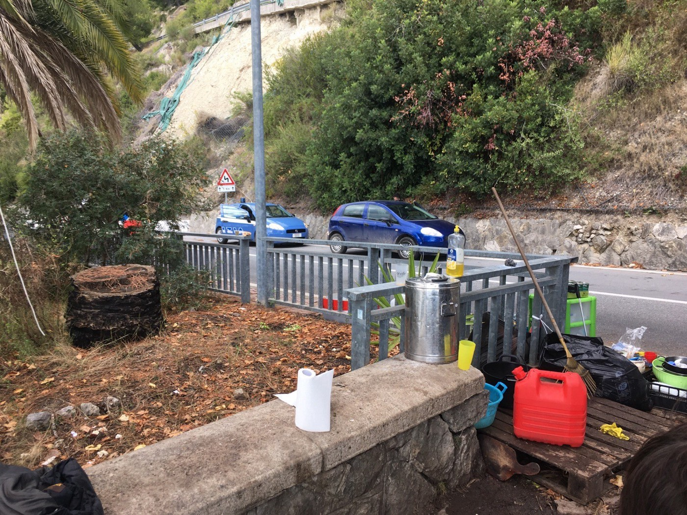
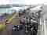

### AYS Daily Digest 22/10/2020 — UK: Asbestos in Penally camp

[Oct 23](ays-daily-digest-22-10-2020-uk-asbestos-in-penally-camp-9b9fe4d222e2?source=post_page-----9b9fe4d222e2--------------------------------) · 18 min read

‘We won\!’ Golden Dawn trial ends in Greece / Updates from Kesha Niya on Ventimiglia / More lives lost at sea / Media blocked from reporting on the new temporary camp in Arguineguín, Canary Islands / A lot more from Libya, Greece, Italy, Spain, the Balkans, Germany, France, the UK, Iceland…

‘Illegal is to let them die’ — Javier de Isusi was awarded the 2020 National Comic Award\. He [collaborated](https://twitter.com/CEARefugio/status/1319279802327519234/photo/2) with refugees and CEAR through his comic Asylum and the illustration he made for CEAR campaign [\#IlegalEsDejarlesMorir](https://twitter.com/hashtag/IlegalEsDejarlesMorir?src=hashtag_click) \.
### Featured — UK: Asbestos in Penally Camp

AYS has received proof that there is asbestos present in Penally camp, which is now the responsibility of the Home Office\.

[According to the Government’s own website](https://www.gov.uk/government/publications/asbestos-properties-incident-management-and-toxicology/asbestos-general-information#if-you-find-asbestos-in-your-home) :

> _The presence of asbestos in the environment does not always lead to exposure as you must come into contact with the fibres\. \[However…\]_ 

> _The International Agency for Research on Cancer has classified all forms of asbestos as being carcinogenic to humans\. Asbestos causes mesothelioma \(type of cancer that forms on the protective tissue that covers the lungs or the abdomen\) and cancer of the lung, larynx \(voice box\) and ovary\._ 

We recently published a Special on the camp: [**A Voice from inside Penally Refugee Camp**](ays-special-a-voice-from-inside-penally-refugee-camp-57f8ea247ab7) , read it\.

Close Penally now\! People seeking asylum are entitled to real homes\.

LIBYA
### Turkey started training Libyan coast guard on military vessels provided by Italy

Turkish national defence ministry posted photos of Turkish advisors training Libyan coast guard on board of the “Ubari 660” patrol boat that Italy gave to the GNA in November 2018\.

Italian media ran with the news, underlining the risk of Turkey increasing its control over the actions of the Libyan coast guard\. The Italian defence ministry has stated that Italy will continue supporting the LCG as previously established\. Read more [HERE](https://www.repubblica.it/esteri/2020/10/21/news/la_turchia_prende_il_controllo_della_guardia_costiera_libica-271349626/) \(in Italian\) \.

SEA
### Shipwreck: 5 presumed dead off Lampedusa

The boat [seems to have left Zawia](https://twitter.com/scandura/status/1319268859287920641) , in Libya, on Tuesday night with 19 people on board\. The conditions at sea worsened in the night and the boat landed, towed by an Italian vessel, in Lampedusa at 11\.50 AM on Wednesday\.

Only 14 people \(13 Libyan nationals; 10 men, 2 women, 2 children\) made it to the Italian island, while 5 are missing, presumed dead\.

Italian and Maltese aircrafts, as well as a commercial ship, are [searching](https://twitter.com/scandura/status/1319185345280417792) for the 5 missing people\.

This shipwreck is not only a human tragedy, but a ‘catastrophe’ for [Italian and EU narratives presenting Libya as a safe country](https://www.mediterraneocronaca.it/2020/10/22/migrazioni-altri-5-morti-un-solo-evento-sgretola-tutta-la-politica-italo-libica-foto/?fbclid=IwAR12csDaiPib6PiJMwGQhnzWla-Zu1d3v5LNX_mdhC9Ac9FtCiE4wR3fctE) , as most of the people fleeing the country were themselves Libyan nationals\.
### Updates

During yesterday’s digest, we reported on a missing boat that left from Algeria and seemed to be directed towards Sardinia\. On Wednesday, Alarm Phone reported that, according to relatives, [the ~10 people were rescued by the Algerian Coastguard in the early morning and are being brought back to \#Algeria\. Authorities won’t confirm the interception, but choose to keep silent\. We hope that all of the people aboard are well\!](https://twitter.com/alarm_phone/status/1319242786365997057)
### Louise Michel unable to leave port

The [Louise Michel independent rescue vessel](https://mvlouisemichel.org/) is currently unable to leave port\. Their registration is being challenged as part of growing restrictions imposed on civil rescue ships by European governments\.

“ [We are working on a solution to get back to saving lives as soon as possible\.](https://twitter.com/MVLouiseMichel/status/1319215047361650689) ”

GREECE
### One more pushback across the Aegean?

Following from the above tweet from [Alarm Phone](https://twitter.com/alarm_phone/status/1319252469503897601) :

> _Around that time, masked men boarded the boat\. On the video we received from the people, these men are heard speaking Greek\. We have not been able to re\-establish contact with the people since then & the Greek Coast Guard refuses to give any information\. The last position we received was 2 nm from Crete\._ 

As V\. Tsarnas from Helsinki Monitor [states](https://twitter.com/VassilisTsarnas/status/1319292863113433089) , “everything indicates one more violent push\-back against \[people on the move\] in Greece, this time possibly perpetrated by masked men cooperating with the coast guard if not by them directly\. 180 people on board in rough weather south of Crete are now mysteriously missing\!”
### “ [We won](https://twitter.com/dgatopoulos/status/1319238963425644545) \!” First degree of the trial against Golden Dawn ends

After 466 sessions, started in April 2015, the first judgment of the trial against Golden Dawn ended on Thursday\.

Throughout October, the last phase of the trial was coming to a closure\. On the 7th, the verdict was welcomed by a gathering of tens of thousands of antifascists\. In later hearings, the court decided on the sentences for each of the 68 defendants \(one died during trial\) \. 57 were convicted, 7 with minor charges\. Yesterday — in the last hearing — the judge ruled that 38 of the 50 remaining defendants be sent to jail, including the murderer of Pavlos Fyssas and the entire party leadership\. Suspension awaiting appeal applied to 12 defendants\.

[Read more on the Women who brought down Golden Dawn on The Guardian\.](https://www.theguardian.com/world/2020/oct/22/the-women-who-brought-down-greeces-golden-dawn)
### Lesvos: Moria 2\.0 to be closed in Summer 2021

Migration minister Mitarakis [stated](https://www.naftemporiki.gr/story/1649702/mitarakis-gia-metanasteutiko-europaiki-lusi-sto-europaiko-problima) that the temporary structure in Kara Tepe will be closed in summer 2021\. Initially, it should have been operating only up until November 2020\. After meeting with the EU commissioner for Home Affair Ilva Johanson, Mitarakis stated that a EU task force will be created, which “will determine the basis of cooperation, the design of new structures, the cooperation of all Greek ministries and all European organizations involved in the issue of asylum, such as the EASO, FRONTEX and will determine the responsibilities of each, the mode of operation”\.
### Greek authorities asked to provide documentation on the attempted eviction of PIKPA camp to the ECHR

J\.T\. was recently transferred to PIKPA from the new temporary structure of Kara Tepe after being categorized as particularly vulnerable\. She recently gave birth and has a young daughter with her\.
Now, thanks to the support of the Greek Council for Refugees, J\.T\. has [submitted](https://www.gcr.gr/en/news/press-releases-announcements/item/1545-the-european-court-of-human-rights-requested-from-the-greek-government-to-provide-information-regarding-the-evacuation-of-pikpa-in-lesvos?fbclid=IwAR27Dx-HenAs63azNp18UQ8iKmdjOTnwsAbTMaTtbGGvWSTLusJqNaukGVk) an application to the ECHR for interim measures alleging violation of Article 3 of the European Convention on Human Rights, in the event of the evacuation of PIKPA and her family’s removal from it\.

Greek authorities have been requested to provide information to the European court before October 22nd:
- Whether there has been a formal decision to remove the applicants and close the accommodation facility PIKPA at Lesvos\.
- Whether the applicants can contest this decision before domestic courts\.
- When will the alleged removal take place\.
- Whether an alternative solution has been provided for the applicants\.

### Covid outbreak in Vathy, Samo — but no adequate response
### Quarantine extended for Vial residents, Chios

Ministries of migration, health and citizens’ protection decided to extend the quarantine for the Vial hotspot to November 4th\. The camp has been in quarantine since October 14th, when authorities confirmed “numerous” coronavirus infections\. Since then, authorities have never specified how many camp residents tested positive for Covid\-19\.

NORTH MACEDONIA
### New agreement with Frontex halted by Bulgarian authorities

Frontex and North Macedonian authorities are to start conducting joint operations and deploying teams in border regions to tackle illegal migration, especially in cases of sudden changes in migration flows and cross\-border crime\. If necessary, they will provide “technical and operational assistance” to national border forces\. At the moment, this agreement cannot be implemented: Bulgarian authorities are blocking its signing because they recognise the official language of North Macedonia not as a language but as a Bulgarian dialect, media [report](https://www.euractiv.com/section/politics/short_news/bulgaria-blocks-north-macedonia-frontex-agreement/) \.

ITALY
### A drone to surveil external borders

The interior ministry [decided](https://altreconomia.it/un-drone-per-sorvegliare-il-mediterraneo-e-fermare-i-migranti-il-nuovo-appalto-del-ministero-dellinterno) to spend €7,2m to rent a drone for 12 months in order to “extend the surveillance of external maritime borders up to 560km off the Sicilian coast”\. It will cost €5,000 to fly the drone for an hour, and it will be provided by Leonardo Spa \(ex Finmeccanica\) \. It is, according to Ministry’s spoke\-person, an “important upgrade” to the operations of the Italian coordination centre of the European Border Surveillance System \(Ncc/Eurosur\) \. The drone will be able to fly for 1200 hours over one year, with an autonomy of 12 hours; it won’t be traceable or identifiable; and it will be able to identify objects small as 2 metres from as far as 4 kilometres away\.

It would definitely be of great use in saving lives in the Central Med, but no mention of SAR activities was made, obviously\. It will instead be used to “surveil set area”, “identify objects of interest”, “tracing and correlation”, and to monitor without being seen\. The stress on this last characteristic makes it all more worrying\.
### Right of care refused to migrant children in Veneto

ASGI [report](https://www.asgi.it/media/comunicati-stampa/bambini-pediatra-veneto-discriminazione/) that Venice tribunal ruled on October 19th that regional authorities and health service have to provide free and public paediatric services to all children\. According to current provisions, foreign minors who are not legally residents in the region were excluded from such services\.

> _The court ruled the the current provision is discriminatory and called for a quick change in the rules, for registering with the national health service all foreign minors not legally residents, in order to allow them to access care at the same conditions of Italian citizens\._ 

### Updates from Ventimiglia

Kesha Niya published an update on their work in the Ventimiglia area, mid\-September — mid\-October 2020\.

At the end of September, activists had to move their base camp and their kitchen near Ventimiglia following an announcement by Italian media that the government would close the French\-Italian border\.

The storm and flood of the beginning of October partly destroyed border access between the two countries, and most of KN’s activists and resources are still stuck in France, unable to cross\.

> _When the storm began, the streets of Ventimiglia were crowded by people trying to find a safe space\. Most of them moved to and inside of the train station, as it was the only dry public space which was open\. \[…\] Usually, the waiting hall is closed at 10pm, and until late that evening nobody knew if it would be any different in the night\. \[…\] The doors of the station stayed open, but due to a completely full hall, people had to stay very close to each other and some had to sleep outside under the roof of the train station hall\. When we left at 11:30pm, there were at least two families with six children, of which the youngest was one year old, we could not offer any housing\. The red cross provided blankets for the two families\._ 

> _On Saturday and Sunday, we saw the same people including families again\. If it wasn’t for local organisations and volunteers, nobody would have taken care of them during this night\. In the French\-Italian region, people went missing or died, streets and houses were flooded, blocked or destroyed\._ 

After the storm, KN went back to the border, together with other groups\.

> _We have seen an immense rise in the amount of people being pushed back to Italy at the border to Menton\(FR\) \. In the week of the 7th to the 13th of october, we constantly had no less than 100 people per day stopping at our place, with an average of 130 per day\. Our highest count was 170 on the 7th of october, which is the highest number we had since working at the border\. Police controls are reinforced, and most of whom we encountered were trying to cross the border many times, for a span of one to two weeks\._ 

[Photo by Kesha Niya](https://www.facebook.com/KeshaNiyaProject/photos/pcb.1358905907787606/1358924937785703/)

People pushed back report of increasing police violence and harsher treatment towards people in the police station, especially during the night, when women and children are imprisoned together with men\. People are kept at the border station for many hours \(up to 29\) and in seriously overcrowded conditions\. Several people reported of stolen belongings when stopped at the borders \(money, documents, clothes, etc\) \.

This is a particularly disturbing testimony:

> _On the 11th of October, one guy reported about being in the train to Menton the day before, accompanied by a group\. According to him and other witnesses, the police blocked the train door when they wanted to leave the train in Menton\. As people in the train continued trying to get out, police blocked the door with a metal crowbar and sprayed tear gas in the closed train, where there were at the time as well women with children at the age of two\. Being quite unable to see and while crying due to the gas, people pushed more to get out which led to the police beating with the crowbar on their hands, while commenting in french “We don’t need you here, what do you want here, go back to your country”\. Everybody was eventually pushed back to Italy\._ 

KN activists learned that people with injuries are often brought by border police to “La Palmosa” hospital in Menton, where they are not treated properly and where doctors neglect their duties — with police legitimation\.

On October 13th, several people attempting to reach France were stopped by police on the train from Ventimiglia:

> _Police entered, while one person was hiding on the toilet\. The police opened the toilet door with a metal crowbar\. Two of them hit the hiding person really strong on the back part and the upper part of his head with the crowbar\. Another person was hit in the neck from a police man’s hand\. Another person was grabbed and thrown out of the train, but luckily didn’t fall down\.The man who was hit on the head was taken to the hospital, where basic cleaning to prepare the stitching took place, but no further cleaning of the wound\. After the stitching he was eventually pushed back to Italy, as everybody else\. When he arrived at our spot 1,6 km after the border, he still had dry blood all over his head\. According to him, the police stated that they can do what the want, because he anyway could not prove anything against them\._ 

KN activists helped the man to prepare a legal complaint against the French border police\.

[Photo by Kesha Niya](https://www.facebook.com/KeshaNiyaProject/photos/pcb.1358905907787606/1358924937785703/)

> _On October 14th, while Progetto20k was at the border camp, six Italian carabinieri entered the camp and asked for the documents of everyone who was there and walked across the whole camp\. We did not get answers on why the control took place and were not able to communicate with them in english\._ 

Attempt to fence off the border camp \( [Photo by Kesha Niya](https://www.facebook.com/KeshaNiyaProject/photos/pcb.1358905907787606/1358924937785703/) \)

This illegal act, together with the attempt to fence off the area at the border used by the group, is one more reason for Kesha Niya to stress their need for a place where they can carry out their solidarity activities without being exposed to the arbitrary actions of police forces\.

Since October 21st, any gathering in a public place is illegal in Liguria again, due to new anti\-Covid\-19 measures\. The food distribution is re\-implementing the Covid\-19 related precautions they had been taking over the past months, with activists being careful to avoid having many people at the places they are active\. “Police however still gather huge amounts of people in small places without hygienic precautions”\.

Read more and find how to join or support Kesha Niya [HERE](https://www.facebook.com/KeshaNiyaProject/posts/1358905907787606) \.
### Neo\-fascist demonstration planned in Trieste on Saturday

[Linea D’Ombra OdV published a statement](https://www.facebook.com/lineadombraODV/posts/728003097790824) about a planned demonstration organised for Saturday October 24th by local neo\-fascist group Son Giusto Trieste:

> _It is disconcerting that a tiny neofascist group is going to be allowed to demonstrate in Piazza della Libertà next Saturday\._ 

The group is known for their violent and threatening language on social media, and the demonstration is against people on the move and those who stand in solidarity with them\.

> _Moreover, Piazza della Libertà is where “Linea d’Ombra, together with [Strada Si\.Cura](https://www.facebook.com/stradasicura/?__cft__[0]=AZXLbORhzfreVo6rAJHPaSjmEJoRUeQLtafraGv3KQC3JkpOYnWxW0PeX0njPDiimchi_fJFdnDn-BLG_5qb5OVxqbUpLL1PR1B3D2tFR-iKenj_ccO2NTOveKCr5vcxGDHKB1HMO48UCkaAjgNqOywrsItNQNwOCEWp9IXKBadBhjFUciC-NqLdgCyjeCvDK28&__tn__=kK-R) and many more volunteers and activists, has been providing first care to people arriving in town from the Slovenian border for more than a year\. Thanks to this daily presence, this square has become an important symbol: it is here where the part of Trieste’s citizenship who still believe in equality and human rights meet with the most vulnerable people of our city: not just those coming from the Balkan route, but also families in hardship, homeless, people with mental health problems\. A place of resistance to the ‘politics of indifference’ carried out by Municipal and Regional authorities\._ 

The association asks for all democratic individuals, collectives, and associations in the city to take positions on the matter\.

> _The Trieste we want is a border city, which rejects fascism and welcomes those looking for a life worth of being lived_ 

SPAIN
### Family separated on arrival in the Canaries

Spanish media report that families are systematically separated on arrival in the Canary islands, even when they have family books and documents detailing family connections\. Read more [HERE](https://cadenaser.com/ser/2020/10/22/sociedad/1603369356_300019.html) \(in Spanish\) \.
### Media prevented from reporting on situation in the Canaries

At the Arguineguín dock, in Gran Canaria, due to the saturation of the immigrant centers on the islands, a temporary camp had to be set up to accommodate the hundreds of migrants who arrive daily on board precarious boats\.

That’s how the pier of Arguineguin was on Tuesday in Gran Canaria\. More than 1\.300 people have been waiting for a solution that guarantees their rights\. Some people have had to sleep in the air as there are no tents for everyone\. \(Photo and text by [CEAR](https://www.facebook.com/CEARefugiado/posts/3522167181176893) \)

It is a dramatic reality that is not being shown — for the simple reason that photographers cannot document it\.

This is the complaint made this afternoon by photojournalist Javier Bauluz, media [report](https://cadenaser.com/programa/2020/10/21/la_ventana/1603291879_434651.amp.html) \.

> _“It is surreal, in 25 years covering immigration it is the first time that I come across something like this, with orders from the Interior to the police to keep the photographers away without being able to work\.”_ 

BOSNIA AND HERZEGOVINA
### Reports of IOM threatening people in camps for speaking out

[Transbalkanska Solidarnost](https://www.facebook.com/transbalkanskasolidarnost/) received very [disturbing information](https://www.facebook.com/groups/144469886266984/permalink/662512094462758) about what it seems is an established practice by IOM in the area\. Employees of the organisation, it is reported, follow grassroots facebook groups “and if they see that one of the people who live in camps has set up something, they are threatened”\.

This seems to have happened to a resident of camp Blazuj, near Sarajevo, who was threatened with being thrown thrown out of the camp after having posted photos of the EU\-funded camp’s horrible conditions in a facebook group\. The trans\-balkanic collective received similar information from other camps in Bosnia and Herzegovina, with at least one person reportedly sent to prison after providing information about to camp to a volunteer group\.

These are more testimonies on top of the many we’ve already reported about the role IOM has increasingly taken on all over the continent in the past years\. The very agency whose mission is to “promote an orderly and humane management of migration” seems to have forgotten about the humane part, focusing instead on order: discreetly managing migration flows at the very expenses of the people on the move\.
### Updates from Bihac and Lipa

No Name Kitchen and Unfold the World published an eerie description of what Lipa camp looks like from the outside, with temperature quickly dropping and the winter season approaching\.
### [Log into Facebook \| Facebook](https://www.facebook.com/NoNameKitchenBelgrade/posts/1102586940139589)
### [Log into Facebook to start sharing and connecting with your friends, family, and people you know\.](https://www.facebook.com/NoNameKitchenBelgrade/posts/1102586940139589)
#### [www\.facebook\.com](https://www.facebook.com/NoNameKitchenBelgrade/posts/1102586940139589)
### Bihac, 30th of September 2020\. Media bias and fact checking

[Raskrinkavanje\.ba](https://raskrinkavanje.ba/) published an interesting article on the coverage of the conflict within the settlement of Žegar, near Bihac, which cost two people their lives and was reported with a framing of “migrants took over Bihac” and “replaced the domicile population in Krajina”\. Read more [HERE](https://raskrinkavanje.ba/analiza/u-sukobu-u-bihacu-nisu-poginula-cetiri-migranta-niti-su-oni-preuzeli-ovaj-grad?fbclid=IwAR2J62m_CZ23ZAhWTKebMjqNn8_8HDEbr0lzPvuqGHrwsRRNY1_WPzniRMU) \.

SERBIA
### Police violence in Belgrade

[Info Park report](https://www.facebook.com/infoparkserbia/posts/3332316476822593) that police officers have been witnessed using physical force, threats, and fear to move people out of the centre of Belgrade:

> _At 14\.30 pm info park worker was witness a scene on a pass from the walk near the park near the park of Belgrade on the water where there were 12 refugees, including boys\. “ after the police van stopped out of it, seven cops came out and began to beat migrants with hands, feet and batons\.” according to the testimony, the police were screaming in English — “ go to camp, if i see you in Serbia I will break your legs “ \(“ go to camp, if we see you in Serbia we will break your legs “\) and similar threats\. None of the migrants resist nor tried to run\._ 

> _“ the younger man raised both hands up to stop the violence, but the officer took his hands away and continued to hit him on the head and his body\. After that, the refugees moved into the side street and the police went into the van and moved to Bristol park where they continued approach to refugees and threatening them with physically and physically\.”_ 

> _Info Park shows that this police behavior is not only illegal but also anti\-productive at the moment when the number of refugees and migrants in Serbia is rising\. Info Park invites the prosecutor’s office to explore whether during yesterday’s action, as well as the criminal act of abuse of the official position and to inform the public about it\. As early as 3 members of Serbia were arrested for the theft of migrants, we want to believe that the guilty of yesterday’s incident will also be equally effective\._ 

> _Info Park has a special concern that the members of the the Serbia have taken over the ideas of the “ National Patrol “ which has been announced by the “ National Patrol “ that has been announcing “ cleaning “ of the same part of Belgrade for days\. It remains to be seen if this is a worrying incident or a radical turn that, although illegal, follows the current changes and the strengthening of state migration policy\._ 

CROATIA

**EU speaks out about violent push backs**

The EU Commissioner for Home Affairs, Ylva Johansson, has [spoken out on twitter](https://twitter.com/YlvaJohansson/status/1319218014500360193) against the abuses reported at the Croatian Border which were detailed in [yesterday’s digest](https://medium.com/are-you-syrious/ays-daily-digest-21-10-2020-home-office-removal-notice-window-unlawful-court-says-492dc9035520) \. Speaking to Croatian ministers, she “reminded \[them\] that effective border management must be conducted in full respect of fundamental rights\.” However, given that violent pushbacks in the Balkans have been well documented by the [Border Violence Monitoring Network](https://www.borderviolence.eu/) and other groups including [MSF](https://www.msf.org/push-backs-violence-and-inadequate-conditions-balkan-route%E2%80%99s-new-frontier) and [Human Rights Watch](https://www.hrw.org/news/2019/11/08/eu-address-croatia-border-pushbacks) since 2016 we find it incredible that it is only now that she is going to take such reports “seriously\.”

HUNGARY

**More violence from Hungarian police**

\(Torture of Hungarian police before pushback to Serbia\. According to the migrants, several groups of them from Syria and Palestine have so far experienced kneeling for several hours or standing in a place with their hands in front of them, without moving\. If someone moved, he was hit on the back with a truncheon\. One person from Iran stated that they first kept him in a larger cage for half an hour, and that they filmed him and laughed\. After that, he was forced to kneel for 3 hours\. According to the allegations, the Hungarian police are allegedly working in a large tent on the border between Serbia and Hungary, near Sombor\. \)

GERMANY
### 29 children arrive in Hannover

[29 unaccompanied children left](https://twitter.com/GermanyinGreece/status/1319178044427337728) on the 22nd by plane from Athens to Hannover\. On the same flight, they flew children who needed hospital treatment together with their family members for a total of 104 people\.

FRANCE
### Age verification department copy\-pasted decisions among cases

Utopia 56 Rennes [found](https://www.facebook.com/utopia56Rennes/posts/1769670219850918) that the ‘mission Mineurs Non accompagnés’ of the interior ministry in the Ille\-et\-Vilaine department in Brittany, Northern France, have copied and pasted decisions when evaluating the age of minors\.

Such evaluations have been shown inconclusive in the past, but several countries keep using them to reduce the number of minors they have to take care of\. In this case, authorities in the Ille\-et\-Vilaine department have shown extreme negligence, managing to copy\-paste typos in at least three separate cases, while making a decision that is likely to impact for years on the life of the person on the other side of the bureaucracy\.

UK
### A family reunited in London

While the [British Government continues to argue](https://www.huffingtonpost.co.uk/entry/brexit-refugees-child-dubs-lords_uk_5f905b0dc5b6b005f5f1ce9f?guccounter=1&guce_referrer=aHR0cHM6Ly93d3cuZ29vZ2xlLmNvbS8&guce_referrer_sig=AQAAABDsl6SZytImv5RuxrMDlDJQvOmM4rS7qEXTdbKlst1eg5hg59_Lcj40uFBhkl4BhFJNqbwjyPOeYYPa1gRRLLaBZLnWEoUGCrRITiRE1-8p0KCprFzLGFwrEniZETOboR9_ynj8sO3m-6irgN6kn9JU9dq8Fy8N-vrQRGtzOcFT) over the rights of child refugees after Brexit, we can share one piece of good news\.
### Petition signed by 180,000 handed to Home Office over right to work

People awaiting their asylum decision are not allowed to work in the UK and are forced to live on just £5\.66 per day\. In Glasgow, [local media report](https://www.glasgowtimes.co.uk/news/18812394.lit-ban-glasgow-refugees-call-overturn-home-office-ban-working/?fbclid=IwAR23-upjjDotv6AA_dmJrc8neTklkv63l9j4ON-rol5Ccr6erPHcV4X-Sic) that asylum seekers have taken to the streets to back the petition\. It is estimated that allowing people to work could add £97\.8 million to the UK economy, but then again, the UK government have never been known to be particularly good at maths\.

ICELAND
### Isolation and new limitation for asylum seekers in Iceland

[No Borders Iceland](https://www.facebook.com/nobordersiceland/posts/3477266979006404) report on the isolation faced by people forced to live in remote camps:

> _According to the racist separation policy of Icelandic government, the Immigration Institute runs insulation camp for refugees in the left and gray army at Ásbrú in Miðnesheiði\. Long lasting isolation is in its nature a very important controller in the hands of the foreign Authorities, as so it can be broken the refugees mentally i\.a\. no question can provide against the decisions that the government would please make to prevent it here\. All available advice applied to prevent access to refugees to community, where it could form friendship and relationships that could possibly support its position and gossip for government goals\. It simply serves pretty well the interests of the government power that the refugees are invisible\. Then it simply doesn’t exist as living people with feelings and soul\. Although dismissed in terrible conditions, or exactly into open death, it doesn’t matter, because no one knew them, no one remembers them and the only thing left is numbers on paper that rise like the numbers on the road signs that show a number Those who have died in traffic accidents\._ 

The Institute of Immigration has also restricted the cash allowance this year and the card can now only be spent in certain grocery stores, depriving people of the ability to pay for public transport and travel to town — and recent announcements suggest that this too will soon be removed\.

\(Photo Credit: [No Borders Iceland](https://www.facebook.com/nobordersiceland/posts/3477266979006404) \)

\(Photo Credit: [No Borders Iceland](https://www.facebook.com/nobordersiceland/posts/3477266979006404) \)

WORTH READING

[**Who Should Care for the Border Dead? Struggles of Responsibility Over a Tunisian Cemetery of Unknown Persons**](https://www.law.ox.ac.uk/research-subject-groups/centre-criminology/centreborder-criminologies/blog/2020/10/who-should-care?fbclid=IwAR1b9W0bm27dnHGd7mq0usu2VTkKertj94nYLqI1O72vZDut7oOtMmut4u4) — published on the Border Criminologies Blog by Valentina Zagaria, this piece explores how dignity, responsibility and belonging are shaped and curtailed by different migratory projects\.
- [**Focus on migrant returns threatens AU–EU negotiations**](https://issafrica.org/iss-today/focus-on-migrant-returns-threatens-aueu-negotiations?utm_source=BenchmarkEmail&utm_campaign=ISS_Today&utm_medium=email&fbclid=IwAR1iUZ4tNedFis6scGkzEhr3lhmZ6baS3GL9LKnKDWm6rSUEEUut2lrDSPM) — published by the Institute for Security Studies and written by [TSION TADESSE ABEBE](https://issafrica.org/author/tsion-tadesse-abebe) AND [AIMÉE\-NOËL MBIYOZO](https://issafrica.org/author/aimee-noel-mbiyozo) : “ _The increased emphasis in the New Pact on migrant returns is contrary to Africa’s position and could affect negotiations around the Post\-Cotonou Partnership Agreement \(ACP\) and the Joint Africa–EU Strategy\.”_

**Find daily updates and special reports on our [Medium page](https://medium.com/are-you-syrious) \.**

**If you wish to contribute, either by writing a report or a story, or by joining the info team, please let us know\.**

**We strive to echo correct news from the ground through collaboration and fairness, though volunteer work\. Every effort has been made to credit organisations and individuals with regard to the supply of information, video, and photo material \(in cases where the source wanted to be accredited\) \. Please notify us regarding corrections\.**

**If there’s anything you want to share or comment, contact us through Facebook, Twitter or write to: areyousyrious@gmail\.com**

_Converted [Medium Post](https://medium.com/are-you-syrious/ays-daily-digest-22-10-2020-uk-asbestos-in-penally-camp-6ef6cb26f7b6) by [ZMediumToMarkdown](https://github.com/ZhgChgLi/ZMediumToMarkdown)._
