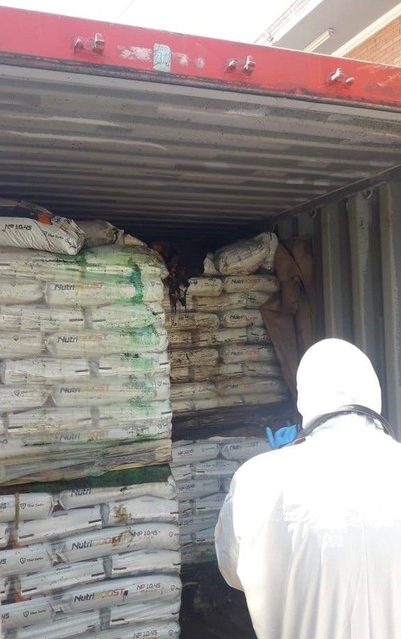
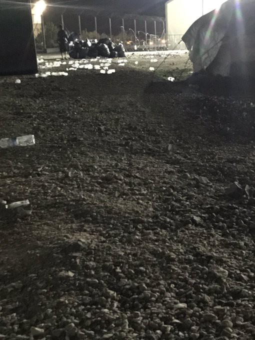
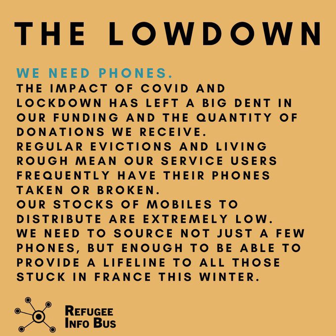
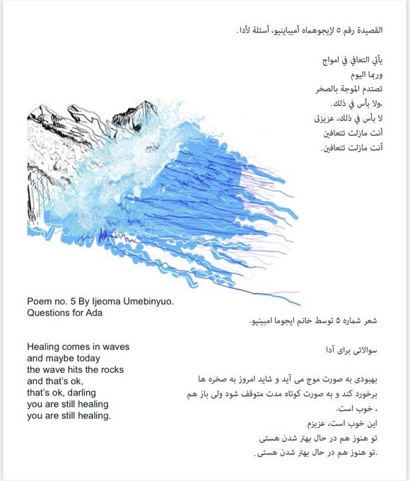

### AYS Weekend Digest 24–25/10/20: Tragic end of 7 young lives trying to reach the EU
#### The remains of seven people found in a container of fertilizer that arrived to Paraguay from Serbia / State\-sponsored separation of mothers and children in Denmark / News, recommended reads & more updates

 — See contribution under “Worth reading” for another story from Moria2…](assets/c0597fe93d2c/0*Hx4-p7qbmb3o60t_)

“Moria 2” — Photo: [moria 2 refugees](https://twitter.com/moria_camp_2) — See contribution under “Worth reading” for another story from Moria2…
#### FEATURED

Just as one far right group is being finally labeled illegal in Greece, another one is becoming more powerful, in their immediate Balkan neighborhood, Serbia\. The country that has seen a slight spike in arrivals in the recent weeks, but has been unable to approach the situation in an organized and humane way, is now seeing radical groups gather around Serbia’s capital\. With a mission to “clean the city” of people on the move, who are uncared for, homeless and left on their own or rely on the scarce capacities of the organisations and individuals still putting an effort into providing assistance\.

“We have seen the peaceful and completely non\-violent people on the move across the city of Belgrade being frisked and asked to raise their hands, brutally beaten, verbally molested, and yelled at\. They were commanded to leave the place, threatened their legs will be broken if they are seen around…”, Info Park witnessed\.

The camps are full and poorly run\. Reportedly, more than 6,000 people are staying in very difficult circumstances in camps across the country, while almost the same number is struggling sleeping rough outside the official accommodation capacities\.

At the same time, pushbacks to Serbia from Romania, Hungary and Croatia continue, and so does people’s desperate struggle to reach the EU by all means\. Seven more people lost their lives in a tragic way\.

Paraguayan police found the remains of seven people, reportedly in an advanced stage of decomposition, in a container of fertilizer that arrived from Serbia\. Asphyxiation was the likely cause of death\. The container had left Serbia in July, passing through Croatia, the first country in the EU — their likely destination — before it continued through Egypt, Spain and Argentina on its way to Paraguay\.

Many similar tragedies take place along the highway leading from Serbia to Croatia, that was in the past, ironically, known as “the highway of brotherhood and unity”\. People are found under buses, inside trucks and squeezed in vans, with their fate in the hands of the criminals, their last resort\. \.
#### ALGERIA

■■■■■■■■■■■■■■ 
> **[vincent cochetel](https://twitter.com/cochetel) @ Twitter Says:** 

> > Algerian authorities crack down on migrants, deporting many to Niger. Some asylum seekers with no link with #Niger are also expelled from #Algerie Basic safeguards are not observed.  [observers.france24.com/en/20201023-al…](https://observers.france24.com/en/20201023-algerian-authorities-crack-down-migrants-deportation-niger) 

> **Tweeted at [2020-10-25 10:18:14](https://twitter.com/cochetel/status/1320308680659767297).** 

■■■■■■■■■■■■■■ 

#### SEARCH AND RESCUE AT SEA

From the Alarm Phone team:

> Today we grieve about at least 11 people who died of Europe’s ruthless border regime, incompetent SAR authorities & EU member states who build up the Libyan Coastguard to prevent people from fleeing and who do nothing to prevent them from drowning\. Yet another shameful day in the Med\. 

#### GREECE
### Collective pushback by the Greek coast guard

](assets/c0597fe93d2c/1*PCdmOn0n_r9e3Onh4vj8WA.jpeg)

Photo: [Aegean Boat Report](https://www.facebook.com/AegeanBoatReport/?__cft__[0]=AZUYuQ2h3-Qc4Dh1tOSoSzGDwMaoj2IZX6XJdA93wZ7zCDe-PFFBFy0T4V_2KA8tnaLhk1r4Fy8qs9b4xSdLNUAtUtnRVgAjimm-MCC2z9m5MUKOhWlnkJwa4INDs0tPaoOD-Z3er5pasBjC53ngxpkgmYfWZQa1iec-1any1Q7Z2D7FaGDjKXa0kD9BKNKWOLQ&__tn__=-UC%2CP-R)

In the past week, the Greek coast guard performed an extensive pushback involving 197 people and 7 life rafts\. The coast guard divided the people on two coast guard vessels, 121 men and boys on one vessel and 76 people, families on the other\. “Reports from the refugees clearly states that some of them were abused while onboard the HCG vessel, footage and video testimony has been provided\. Most of their phones was confiscated by the Greek coast guard, but a few managed to hide their phones, and was able to send out distress messages”, ABR reported\. Another boat carrying approximately 22 people managed to land on Lesvos\. The people have reportedly been hiding in the woods, scared that the police will send them back to Turkey\. For more updates on the arrrivals, see [Aegean Boat Report](https://www.facebook.com/AegeanBoatReport/?__cft__[0]=AZUYuQ2h3-Qc4Dh1tOSoSzGDwMaoj2IZX6XJdA93wZ7zCDe-PFFBFy0T4V_2KA8tnaLhk1r4Fy8qs9b4xSdLNUAtUtnRVgAjimm-MCC2z9m5MUKOhWlnkJwa4INDs0tPaoOD-Z3er5pasBjC53ngxpkgmYfWZQa1iec-1any1Q7Z2D7FaGDjKXa0kD9BKNKWOLQ&__tn__=-UC%2CP-R) page\.

The recently published Migration pact is getting increasingly criticised from different sides, for the same reasons\. However, states seem to believe it and reinforce it\.

> The accelerated border procedures [aim to expedite application processes](https://www.chathamhouse.org/2020/10/why-eus-migration-and-asylum-plan-flawed) that currently can take months, if not years, to complete\. But they also raise significant questions of fairness and effectiveness, as it will be difficult to maintain such exacting, rather unrealistic timelines while respecting procedural safeguards and applicants’ rights\. 

> It is also easy to see how any delays in such a tight turnaround process would then ultimately result in a continuation of Moria\-like overcrowded camps and closed reception centres within EU borders\. 

This is what the future might look like for even more people… :

#### FRANCE

Activists report that 4 expulsions were documented in the Calais area, they included minors, as usual\. In total, reportedly, 19 tents and 6 laptops were seized\.
### Phones wanted\!

Mobile teams urgently need phones to distribute to people in Calais and Dunkirk\. As they point out, “a phone is a real lifeline for the people we support but our stocks are currently very low so we are launching our campaign, asking you to organise collections in your local areas\.”

> We urgently need phones to distribute to refugees in Calais and Dunkirk\. A phone is a real lifeline for the people we support but our stocks are currently very low\. [@chooselove](https://twitter.com/chooselove) are kindly allowing us to direct people to drop off the phones they collect at their donation points, which will then be transported out to us in Northern France\. 

> We know that lockdown has been difficult for many of us financially and so lots of people aren’t in a position to donate money right now but we also know that loads of us have an old mobile tucked away in a drawer and forgotten about and we would love to get our hands on them\! 

> If you would like to take part, you can send an email to eli@refugeeinfobus\.com to request an information pack and social media kit or to ask any questions you may have\. 

#### SPAIN
### Cutting reporting in the end point of the currently most frequent route from Africa

More than a hundred people have disappeared after a series of explosions in a cayuco that was sailing this Friday about 80 kilometers from the Senegalese city of Mbour towards the Canary Islands\. Another 59 persons, including six minors, were rescued and transferred to the Amirale Faye Gassama naval base in Dakar by the Anambé speedboat and the Senegalese Navy patrol boat Ferlo, according to information published in this Saturday’s edition of the local newspaper L’Observateur\.

This year more than two times the number of people who had arrived in 2019 came to the Spanish islands\. The islands continue to lack accommodation capacity and transfers to the mainland don’t keep pace with the arrivals\. [Reportedly](https://www.zdf.de/nachrichten/politik/fluechtlinge-kanaren-afrika-100.html#xtor=CS5-48) , most of the people arriving come from Mali, Ivory Coast and Senegal\. Some are fleeing the terror attacks on civilians and hunger in the Sahel\. Others set out to escape the lack of prospects and unemployment in order to be able to support their families at home\. More and more people are daring the risky journey\. In mid\-October, more than a thousand people arrived within two days on the islands of Lanzarote, Fuerteventura, Gran Canaria and Tenerife\. Reporting has become difficult due to the lack of access to the areas, as reported by journalists:

■■■■■■■■■■■■■■ 
> **[Javier Bauluz](https://twitter.com/javierbauluz) @ Twitter Says:** 

> > Prohibido 🚫 el paso a #periodistas también en puerto de #Tenerife . Esto es lo único que les dejan ver a los compañeros cuando llega un cayuco con decenas de personas #migrantes y #refugiados. Exigimos #Periodismo #SinCensuraPrevia del Ministerio Interior #Canarias #FronteraSur https://t.co/KlMiJ22w9W 

> **Tweeted at [2020-10-24 14:29:44](https://twitter.com/javierbauluz/status/1320009587026808832).** 

■■■■■■■■■■■■■■ 

It was [reported](https://www.canarias7.es/canarias/delegacion-llevara-inmigrantes-20201020233647-nt.html) that the Government Delegation in the Canary Islands plans to charter a ship at the port of Las Palmas in order to provide emergency accommodation for the duration of health and security checks\. Caminando Fronteras reports of cases of separation that lasted up to six months\. Often, very young children are involved, in one case the mother was still breastfeeding\. Senior prosecutor of the Canary Islands, Luis del Río, confirmed that the procedure is currently reviewed\. See more info on Spain [here](https://www.ecre.org/atlantic-route-arrivals-in-canary-islands-continue-to-rise-more-than-1000-people-cramped-at-arguineguin-pier-children-separated-from-their-parents-for-months-in-order-to-prove-kinship/) \.
#### DENMARK

> There is an insatiable appetite in Denmark to demonise and disparage refugees for their political mileage\. And it is derision solely founded on racism and Islamophobia\. _— Danish [media](https://l.facebook.com/l.php?u=http%3A%2F%2Fcphpost.dk%2F%3Fp%3D119580%26fbclid%3DIwAR2Gq9-1cVL2KWqyqIfN5n4hVuk_TIPdgTSMrG4P2cyPPatTQziqEZTktxM&h=AT0FbJbcsfEExvAxeGnqx7Ywc88_m3hmL7axkfzoV9QFu5ofplPp2SHCuFZ3BF-DfNOgCwvYimBHWNwKO84upH1Jp32P8U76fr1lGpY4ePIUlahqUSA5EVfDqCYQ4y0VCg&__tn__=H-R&c[0]=AT1HrxUhL1SmQebAPMg2QHB7Rcc5jGVt9ofgAxE2bKekwfQrQg6Fr1hgjRq5rWtPE4zJklKprYgFk4MURLH-JYPv6Cqq1QFMtql--q4z-ApK_UoBM6NfYWIMSTQtlv2LowcksWdSyPmb1pNCWGUtJGfRxJFKO7wSKY36arJjZL8RBnKTzhNK72kheww5mn_3k-RDD4SmGMoRL4FcOA) write_ 

The current immigration and integration minister has so far shaped a combative and extreme rhetoric on the questions of migration and asylum\. As we reported earlier, his was the latest idea in a row, to propose legislation that will allow the government to monitor and tap the phones of rejected asylum\-seekers due for deportation\. An estimate of about 1,100 rejected asylum\-seekers in Denmark are due for deportation\. Over 200 of them have been in a permanent state of fear of being deported for the past 5 years\. There is no change in sight\.
### State\-sponsored separation of mothers and children in Denmark

29\-year\-old Sina Ahmadi’s two children are missing a mother in their lives\. Sina [has been deported and detained](https://l.facebook.com/l.php?u=https%3A%2F%2Fpolitiken.dk%2Fdebat%2Fdebatindlaeg%2Fart7968528%2FUmenneskelig-behandling-af-m%25C3%25B8dre-som-Sina%3Ffbclid%3DIwAR31iyQ3jhmVRB1mJmV665hib54jZ-UpaumqXL51oBOq5vV1Y-l7pdJocBM&h=AT10aIoFMn4ReGaukchggxeLcHrTRSoHaoGjNS5FudXlvK5lbG1Z7qxsFA5GRadHuB_xy5PWuach9YEzQVE1Sg35y8153RrKFpxPxWnbmNKQe_aGe8Qn1w57BbHKrSq6A2PToWFEmRM66g&__tn__=R]-R&c[0]=AT2KMBUyHfeq8Ttg3xwsfWVF4qO9iCs3DIpFFZCtNFePxjdv5LJfztXt6xtRJcdBu1gdcnkSk47lEYuMBJEfZveBPZenwT9D5VhHPKOj6sfxmp5OMCNXm_lGfS0MKYuCoaMtHcyyHByIhWEnyGZFaqEjJuUoU0gwmvmiVChP4JOrEIPiM0ZHCeT4xp7Uqhzyq7Io9dn4lm59WfbEKg) at the exit center Kærshovedgård in Ikast in mid\-Jutland\. At an exit center, there is a duty to stay and report\. This means that Sina has to sleep at the centre every night and report to the police three times a week\. She is not the only woman at the center who is separated from her children and her family\. This is despite the fact that the UN Convention on the Rights of the Child back in 2017 called on Denmark to ensure that the best interests of the child are the primary consideration in all decisions in foreign affairs\.
### Denmark declared Syria a safe country and has begun withdrawing residence permits

Bevar de syriske flygtninges ret til asyl \(Protecting the right to asylum for the Syrian refugees\) is a new initiative that aims to inform Syrians about their rights in Denmark, as well as to create a critical political debate\.

> We would like to draw attention to the fact that the Danish state has declared Syria a safe country and has begun withdrawing residence permits\. Denmark is the only EU country that now includes retraction of residence permits for Syrians from Damascus\. Mainly women and older people are exposed to these retractions, and we are facing a situation where families are split and where the frustrations are running high among the Syrian refugees in Denmark\. We will try to call on politicians, the press, opinion leaders and activists so that focus can be created on and debate about the criticisability of the involvement cases and the Danish asylum policy\. 

#### UK

It’s the 3rd anniversary of the expansion of NHS charging\.

> This barbaric policy prevents migrants and those racialised as migrants from accessing care: 

■■■■■■■■■■■■■■ 
> **[DocsNotCops](https://twitter.com/DocsNotCops) @ Twitter Says:** 

> > Today marks the 3rd anniversary of the expansion of NHS charging. This barbaric policy prevents migrants and those racialised as migrants from accessing care. ✨Check out our new video ⬇️ ✨ 1/4 #PatientsNotPassports https://t.co/1lIWwzJWYf 

> **Tweeted at [2020-10-23 17:59:55](https://twitter.com/docsnotcops/status/1319700092954267651).** 

■■■■■■■■■■■■■■ 

#### WORTH READING

A photo story from the ‘new Moria’ :

In collaboration with [Jeunes Journalistes Sans Frontières](https://www.facebook.com/groups/329486277236522) , this site was created to offer refugees important information and news from refugee journalists located in Uganda:

**Find daily updates and special reports on our [Medium page](https://medium.com/are-you-syrious) \.**

**If you wish to contribute, either by writing a report or a story, or by joining the info gathering team, please let us know\.**

**We strive to echo correct news from the ground through collaboration and fairness\. Every effort has been made to credit organisations and individuals with regard to the supply of information, video, and photo material \(in cases where the source wanted to be accredited\) \. Please notify us regarding corrections\.**

**If there’s anything you want to share or comment, contact us through Facebook, Twitter or write to: areyousyrious@gmail\.com**

_Converted [Medium Post](https://medium.com/are-you-syrious/ays-weekend-digest-24-25-10-20-tragic-end-of-7-young-lives-trying-to-reach-the-eu-c0597fe93d2c) by [ZMediumToMarkdown](https://github.com/ZhgChgLi/ZMediumToMarkdown)._
