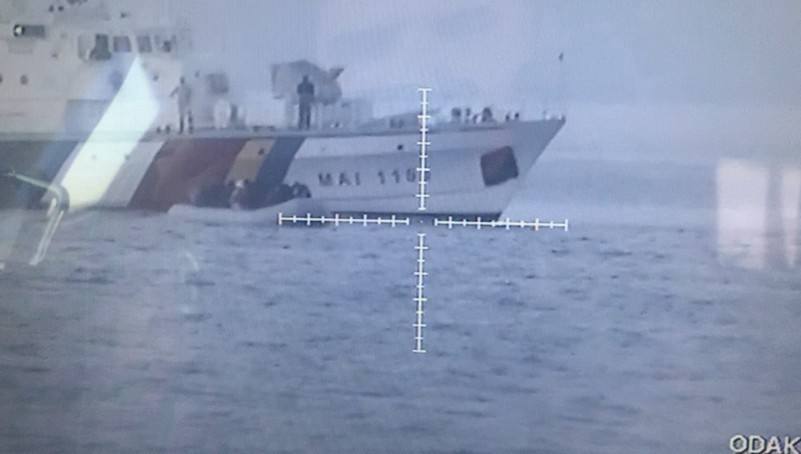
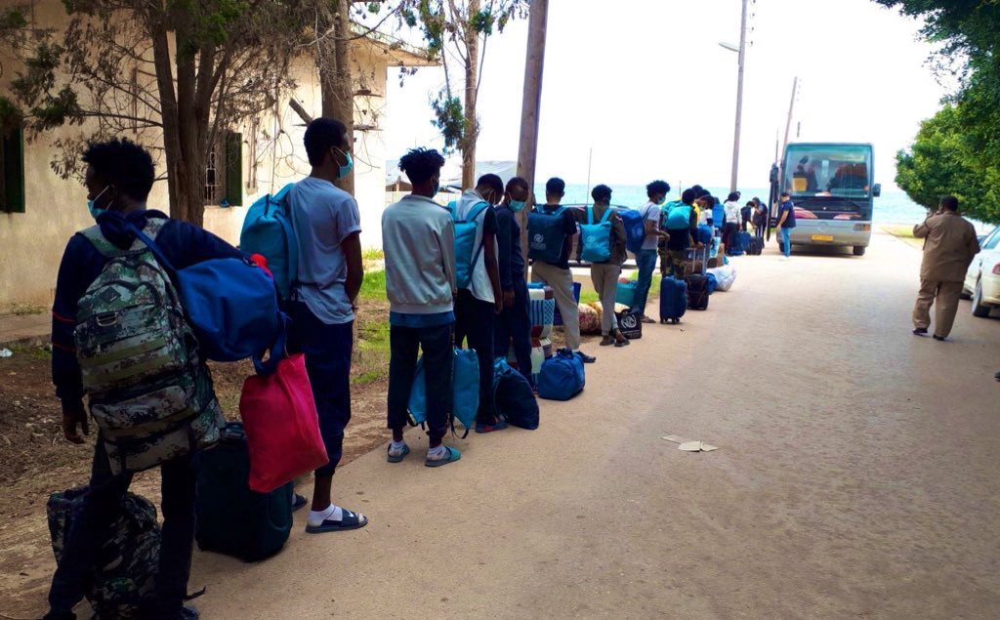
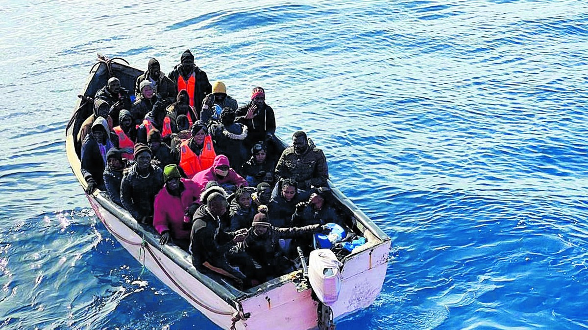
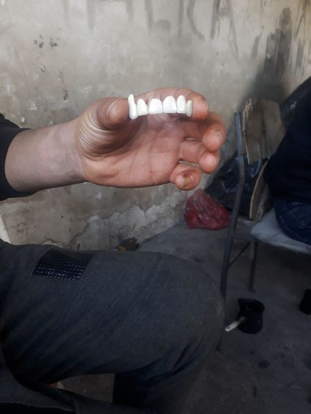
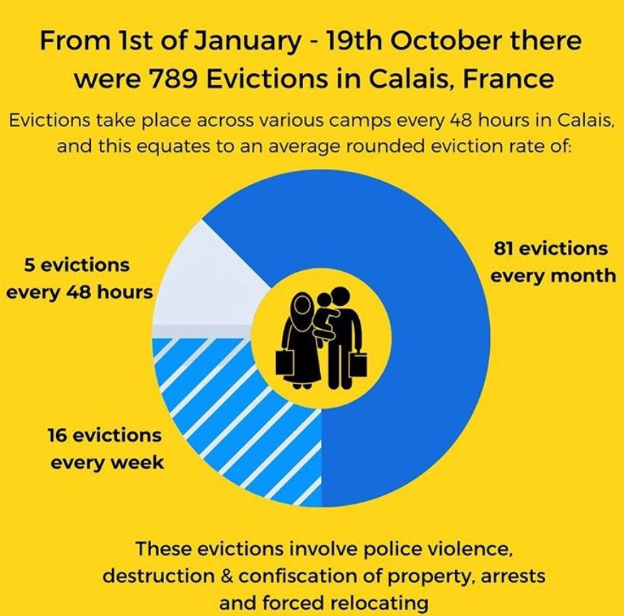
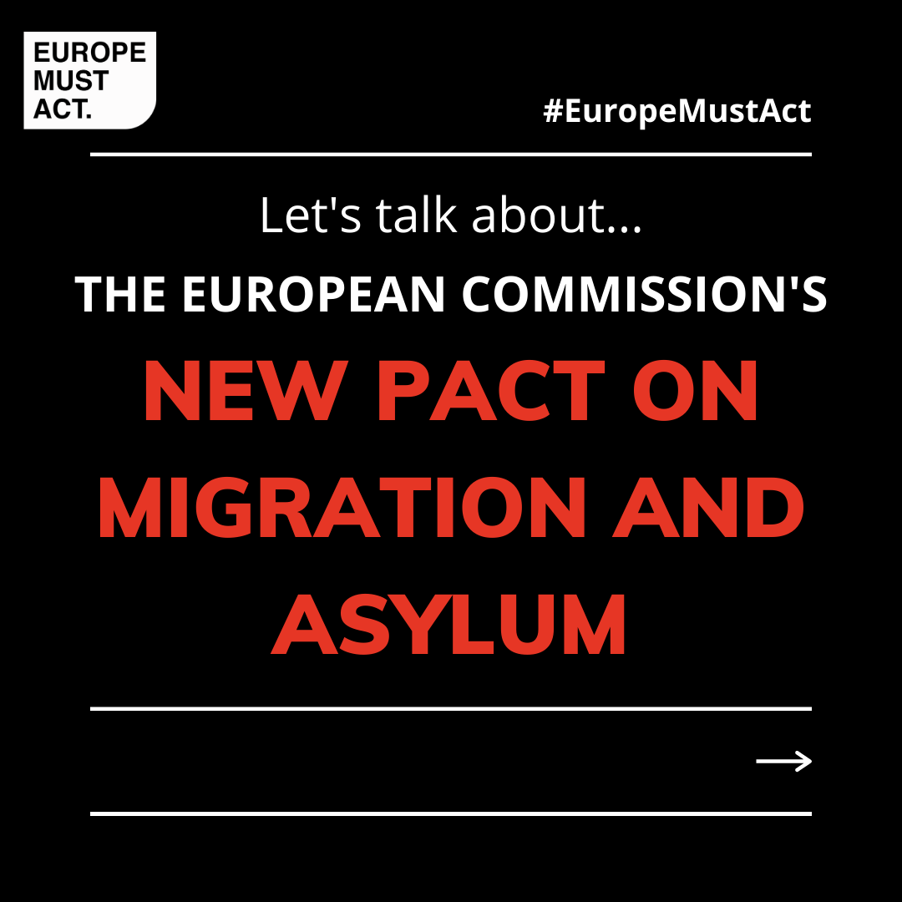

### AYS Daily Digest 27/10/20 Frontex says “no evidence” of pushbacks, videos and eye witnesses say otherwise

_4 people die in English Channel // Canary Islands rescuers overwhelmed, union reports // more reports of Croatian Police brutality // evictions crises in Calais // and more…_

### FEATURE: Frontex says they investigated themselves, found no evidence to “substantiate any accusations of violations of the law or Frontex Code of Conduct”

The investigative portal [Bellingcat](https://www.bellingcat.com/news/2020/10/23/frontex-at-fault-european-border-force-complicit-in-illegal-pushbacks/) recently exposed how Frontex have been involved, either directly or indirectly, in at least six pushbacks between Turkey and the Greek islands since March this year\. Their evidence includes videos of Frontex ships blocking a boat of people off the Greek coast and several eye witness accounts from Greek islanders\. In a series of tweets on Tuesday, Frontex stated:

> _“Frontex has launched an internal inquiry into suspicious incidents recently reported by the media\. So far, no documents or other materials have been found to substantiate any accusations of violations of the law or Frontex Code of Conduct\._ 

> _‘We aim to uphold the highest border guarding standards in all of our operations and do not tolerate any violations of the fundamental rights in any of our activities,’ said Frontex Executive Director Fabrice Leggeri\._ 

> _Frontex Executive Director: ‘We remain committed to providing support to Greece at its external borders in line with our mandate and in the spirit of EU solidarity, in full respect of fundamental rights and international law\.’”_ 

Watch the Midday press briefing from 26/10 [here](https://audiovisual.ec.europa.eu/en/video/I-198160?fbclid=IwAR1lMOR0uh2YikiWUu1bxFKl-llNZpkrwHCzGRGMn3BXgf_AASczD_fcYg0) \.

Many people are pointing out the ridiculous notion that Frontex could be trusted to investigate themselves fully and honestly, but especially in just a few days:

AYS will continue to report on any pushbacks along the Greek/Turkish land and sea borders\. There is clear evidence Frontex has been involved in these pushbacks, despite the results of their internal investigation, and we stand in solidarity with those calling for an independent investigation\.
### LIBYA

### SEA

EFE reported that “ _A total of 39 migrants were rescued in Senegalese waters after overturning a canoe that was traveling to the Canary Islands while maneuvering to avoid the Senegalese Navy boarding, reported the Armed Forces of the African country_ \.” More [here](https://www.efe.com/efe/canarias/sociedad/rescatados-en-senegal-39-inmigrantes-tras-volcar-el-cayuco-que-venian-a-canarias/50001312-4378930?fbclid=IwAR1fzK9wM8hbw8t91sgtILP9hQmpEKU0_NTCjodpJIhKR4LhARz3W59wUHI) \.
### GREECE

The Greek Migration Ministry just announced “ _The Asylum Service will provide services to the public only via electronic appointments\. The Ministry of Migration & Asylum expands its digital services platform_ \.” To find the information in several different languages, look [here](https://migration.gov.gr/en/apokleistika-me-ilektroniko-rantevoy-i-exypiretisi-toy-koinoy?fbclid=IwAR0M9lgURF5wh0KMnvoX2nWJ3KjViW9yfMwRMVHbY63yR8FoSGkxc4D1SWA) \.
### MALTA

Amnesty International is calling to demand justice for the El Hiblu 3\. 
_“In Malta, three youths risk life in prison for their roles in helping fellow asylum\-seekers escape torture\. Call on the Maltese Attorney General to: Drop all charges against The El Hiblu 3 and close the case before trial\.”_ More [here](https://www.amnesty.org/en/get-involved/take-action/w4r-2020-malta-el-hiblu-3/?fbclid=IwAR3gcTbR3MOnhVTxZiL-0W6z898YPU6qZOvWiRWG6E7IYGkJyfM3iKxWgHk) \.
### ITALY

### SPAIN

### “The migration crisis in the Canary Islands is being faced by 25 rescuers”

And they are exhausted\. Many boats operate with only 3 crew members: two have to man the boat so only one can grab onto people and pull them up on board\. They generally work 20 hour days for months\. Their union had to do something about these inhumane working conditions for the people who are trying their best just to save lives:

> _“For this reason, CGT \(the majority union in the sector\) decided last Friday to file a complaint with the Labor Inspectorate for the unsustainable situation that rescue workers are experiencing in the Canary Islands\. They demand the incorporation of a fourth crew member at least in the most active units of the archipelago, since the current workers are ‘at the physical and mental limit’ reads the union statement\.”_ 

Nicaraguan refugees and migrants in Spain are working in slavery conditions\. Racism and lack of employment protection laws are mostly to blame\. The sectors that they primarily work in, domestic and field work, are particularly undervalued in Spain\. [Glenda García](https://confidencial.com.ni/nicaraguan-migrants-in-spain-work-in-precarious-conditions-to-support-their-families/?fbclid=IwAR0eR9wselxKqCJNRAQL9C5EoyVxOyYwW5AuyqY3CgHg5949HRvZ8Wk2oGM) , a member of the Nicaraguan Association and a Nicaraguan migrant said:

> _“There is no legislation in favor of immigrants\. The politicians know perfectly well that there are a lot of irregular immigrants, they know that they are reaping the harvest, they know that they are taking care of the elderly\. They are doing a job that would otherwise be a state charge\.”_ 

### CROATIA
### More Police Brutality: Croatian Border Police beat 28 people, breaking bones

Solaiman told DW on October 19th, just an hour after the attack and as he was bleeding at the head with severe bruises on his body, _“Croatian police split us into groups of five people after we crossed the border\. They forced us to lie down and beat us mercilessly before forcing us back to Bosnia\. They beat all \(28\) of us, and some had their hands and legs broken by the torture\.”_ Croatian authorities said they are investigating the incident\. More [here](https://www.infomigrants.net/en/post/28135/south-asian-migrants-accuse-croatian-police-of-brutal-beatings-at-border?fbclid=IwAR3Oq3IPRtJjKfSyQGczt4rmLWfeKtwWxdt_6XJoPoTF4Z6QA9DC9DFqkEo) \.

In another attack of police brutality on October 9th at Petrinja Police Station, [No Name Kitchen](https://twitter.com/NoNameKitchen1/status/1321066757822533632) collected testimony of a assault before the group was pushed back to Bosnia\.

> _“At the border, the three men had to leave the van one after another and undress completely\. They had to hand over their valuables and their money to one of the officers\. One by one they were then forced to get down on their knees and were then struck by the police_ 

> _They were struck ‘with everything that is possible, batons, hands, feet\.’ The respondent also claimed that the police officers were making fun of him, while they were beating him\._ 

> **_‘They beat you like animals\. That’s it\. It’s not human anymore\.’”_** 

### GERMANY

On Monday, a coalition of 43 aid organizations released a statement condemning human rights violations, particularly in regards to providing inadequate healthcare\. Half a million people are not receiving basic healthcare in Germany\. A spokesperson for the coalition said _“Many refugees are ill and need special protection\. Instead, they are being treated like second\-class humans, without privacy, without access to adequate healthcare\.”_ More [here](https://www.infomigrants.net/en/post/28151/43-aid-organizations-slam-inadequate-migrant-healthcare-in-germany-eu?fbclid=IwAR0oCD_CUtYc1ogMrppgpa9FD27Ggq6MFL3jffCqbNzh5zgxzigmQ1-TftQ) \.

**Mission Lifeline and Pegida dispute ends after 4 years\.** Tag 24 reported that _“The Pegida\-Förderverein has to pay 1,600 euros to the state treasury or its representative Siegfried Däbritz for 80 days in replacement custody because he regularly forwards Bachmann’s posts\. Both denied having continued to refer to Mission Lifeline on Facebook as a ‘tugboat’ or ‘tug organization\.’”_ More [here](https://www.tag24.de/dresden/mission-lifeline-als-schlepper-bezeichnet-lutz-bachmann-und-pegida-verurteilt-1700760) \.
### FRANCE

### An update from Care4Calias on the death of 4 people in the English Channel:

> _“Everyone here in Calais is utterly devastated by today’s news that three refugees, including one very young child, died when their boat overturned off Dunkirk\. We are grieving for the victims, we stand in sympathy and solidarity with their families and friends\. It is cruel and horrifying that this time, young children are among the victims…_ 

> _…Refugees feel pushed to take these risks because of the policies of the French and British governments\. Living in miserable conditions on the streets of Calais, hounded by the police, and left with no clear, legal process to have their UK asylum cases heard, refugees feel they have no other option but to take huge risks to make it to Britain, and some pay with their lives…This loss of life should be a wake\-up call for those in power in France and the UK\._ 

> _2nd Update: French news sources are reporting that a fourth victim, an eight\-year\-old child, is in hospital in a critical condition\. Reports also say that rescue workers are still searching for the missing, including an infant whose mother is thought to have died\. Sadly, the death toll from this terrible event could yet rise\.”_ 

In a new report from the New Humanitarian: “ _France received nearly 120,000 asylum requests in 2019 — more than any EU country bar Germany\. The numbers applying for protection have increased every year since 2015, but successive French governments have failed to match this rising demand with sufficient funding\. One of the most glaring gaps is the lack of quality language interpreters, who play a critical role in the legal process\._ ” More on this translation problem [here](https://www.thenewhumanitarian.org/news-feature/2020/10/27/france-migration-asylum-translation?fbclid=IwAR0sFzgkDGYulFaqB1ZbExS30G-prMVLqMZrRH0bRFkzXpM3ThFrIX5Ye8Q) \.
### BELGIUM
### The European Court of Human Rights ruled that Belgium violated human rights by deporting Sudanese refugees

The EU Observer reported that _“According to the court, the refugee was ‘prevented from pursuing the asylum application that he had lodged in Belgium, and the Belgian authorities had not sufficiently assessed the real risks that he faced in Sudan\.’ Former asylum and migration minister Theo Francken cooperated with the Sudanese regime to deport Sudanese refugees\.”_ More [here](https://euobserver.com/tickers/149885?fbclid=IwAR199k4kH5H1HvcyO2F48L2y__WYI3rwu6FaSGIFQpdiEW1Q018723A72xE) \.
### SWEDEN

Dagens Juridik reported that The Swedish Migration Agency has not prioritized three cases after the court ordered them to do so, and now they are facing severe criticism\. Prolonged asylum cases has become a major issue for the agency\. More [here](https://www.dagensjuridik.se/nyheter/migrationsverket-prioriterade-inte-arenden-trots-domstolsbeslut/?fbclid=IwAR1KPIL5KFv7rHA_gQn8iCY9Nj5xtoghzmtx_u1ap-eoTyhN5rVcvOq2TWk) \.
### ICELAND

Reykjavik Grapeline is reporting that “negligence and deprivation of liberty” are happening at the Ásbrú refugee camp according to a recent Facebook status:

> _“The Facebook status on the Refugees in Iceland Facebook page says “Things are not ok\! For a week, the immigration office has severely limited our rights and freedom, which were both already very limited\.” The status goes on to say that, although residents at the camp are not permitted to leave their rooms without a mask, the immigration office has only supplied them with one disposable mask each\. As soon as these single use masks are used until they cannot be used again, lost, or thrown away, the office is not giving residents new ones and therefore are not allowing them to leave their rooms\.”_ 

Authorities are denying these claims\. More [here](https://grapevine.is/news/2020/10/27/allegations-of-negligence-at-asbru-refugee-camp/?fbclid=IwAR1qcUkHwxjn4x0xwf5wKJXJ4n05njr-nXYqrKvZ8a0dv66RTF7nu40WU9Y) \.
### EU
### The number of people entering the EU from Turkey has drastically declined to reach its lowest point in 5 years

The number of people entering the EU from Turkey dropped by 70% in the first 9 months of 2020, reported German daily Welt\. In the first 9 months of this year, 14,579 people entered the EU from Turkey; for the same period in 2019, 48,554 people entered from Turkey\. DW further states “ _321,685 asylum applications were made in the EU \(plus Norway and Switzerland\) from January to September of this year\. Spain lead all countries with 72,500\. Germany was second with 60,694, followed by France \(60,621\), Greece \(36,127\) and Italy \(16,051\)_ \.” More [here](https://www.dw.com/en/eu-migration-turkey/a-55406468?fbclid=IwAR1qcUkHwxjn4x0xwf5wKJXJ4n05njr-nXYqrKvZ8a0dv66RTF7nu40WU9Y) \.

[Europe Must Act](https://www.facebook.com/europemustact/posts/184051229874246) provided an excellent summary of the European Commission’s New Pact on Migration and Asylum as a refresher:

**~ “What is it?** 
At the end of September, the European Commission proposed a new Pact of Migration and Asylum which covers everything required for a comprehensive European approach to migration\.
**~ What does this mean?** 
EU leaders say that the new policies will focus on speeding up processing at the bloc’s external borders and will allow member states to contribute in other ways to migration policy, instead of imposing quotas\. It aims to tackle the imbalance of burdens faced by member states relating to the arrival of migrants as well as streamlining the asylum process\.
**~ Is it a good thing?** 
Critics say that the pact does not address the issue of values nor broader migration trends, choosing instead to focus on predominantly technical aspects\. Human rights groups also raised concerns that faster procedures leave migrants with fewer procedural guarantees and raises concerns from a rule of law perspective\. Further, the legally binding nature would only apply under ‘pressure’ situations and would revert to a voluntary nature otherwise\.
**~ What next?** 
The package includes a roadmap that sets out a series of initiatives that will be presented in the coming months to complete the overall architecture\.
Member states that are important arrival and relocation countries \(e\.g\. France, Greece\) have struck a note of cautious optimism\. However, the Pact needs unanimity for approval and must go through negotiations with both the European Parliament and Council\.
**~ What can I do?** 
\- Spread the message\!
\- Write to your MEP\.
\- Follow us for future updates\!”
### UK

The Cambridge Independent reported that “ _Cambridge City Council has said it will help resettle a further 200 refugees once a government scheme paused for the pandemic reopens\. The council’s executive councillor for transport and community safety, Labour councillor Nicky Massey, said that of the 200, the city and South Cambridgeshire aims to receive at least 125 refugees, while helping to support different areas to take in others\._ ” More [here](https://www.cambridgeindependent.co.uk/news/cambridge-aiming-to-provide-homes-for-another-200-refugees-9127779/?fbclid=IwAR3Oq3IPRtJjKfSyQGczt4rmLWfeKtwWxdt_6XJoPoTF4Z6QA9DC9DFqkEo) \.
### WORTH READING
- [Statewatch](https://www.statewatch.org/analyses/2020/eu-military-mission-aids-pull-backs-to-libya-with-no-avenues-for-legal-accountability/) released an analysis on Tuesday entitled **“EU military mission aids pull\-backs to Libya, with no avenues for legal accountability\.”** Basically Legal analysts say the EU is breaking International Law, but how to hold them accountable is still clouded by difficulty\.
- [Syria Direct](https://syriadirect.org/news/the-agony-of-refugees-at-risk-of-being-returned-to-syria-%e2%80%9cbetween-death-and-going-back-to-syria-i-choose-death%e2%80%9d/?fbclid=IwAR3YlXlrMPXTrpB6Rifvgdze47J4WDzw2SKPOgxGIjWhjJzV0smVDeYLvcQ) published an article entitled **“The agony of refugees at risk of being returned to Syria: ‘Between death and going back to Syria, I choose death\.’”** They address the Danish and Swedish authorities and their use of the “safe return” narrative\.
- [Open Democracy](https://www.opendemocracy.net/en/can-europe-make-it/morias-living-hell-and-the-legacy-of-european-colonialism/?fbclid=IwAR3sHueyLw1nU_dhPiQFKrkkDvbPusPjInqLPnfAoS2_GNx2mhzXRjgAu1I) published an article entitled “ **Moria’s living hell and the legacy of European colonialism: It begins to look like a self\-perpetuating European system when the burning down of the Moria camp just leads to Moria 2\.0\.** ” Definitely check this out\.

**Find daily updates and special reports on our [Medium page](https://medium.com/are-you-syrious) \.**

**If you wish to contribute, either by writing a report or a story, or by joining the info gathering team, please let us know\.**

**We strive to echo correct news from the ground through collaboration and fairness\. Every effort has been made to credit organisations and individuals with regard to the supply of information, video, and photo material \(in cases where the source wanted to be accredited\) \. Please notify us regarding corrections\.**

**If there’s anything you want to share or comment, contact us through Facebook, Twitter or write to: areyousyrious@gmail\.com**

_Converted [Medium Post](https://medium.com/are-you-syrious/ays-daily-digest-27-10-20-frontex-says-no-evidence-of-pushbacks-videos-and-eye-witnesses-say-d7b08dc102c6) by [ZMediumToMarkdown](https://github.com/ZhgChgLi/ZMediumToMarkdown)._
