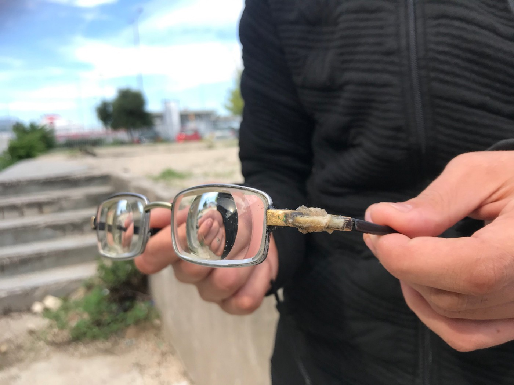

### AYS Daily Digest 28/10/20: A traumatic wake\-up for hundreds forcibly moved to a camp in the south of Serbia
#### Worrying developments in Serbia / In spite of criticism and inhumane treatment by the police, Croatia and Greece receive big support for the border regime / More on the tragedy of the Iranian family who drowned / Court decides Belgium breached international law when it deported a Sudanese person to Khartoum / Locked up on Samos / & more news

“A group was returned from Hungary to Serbia\. Among them is the 19\-year old who has received multiple blows with a bat to his head and legs\. With the assistance of the APC team, he was later admitted to the ER, where his head wound was stitched”, reported Asylum Protection Centre\.
#### FEATURE

The situation in Serbia as reported by field teams across the country, the people themselves who are on the move , and by the Asylum Protection Centre, is on the verge of becoming alarmingly similar to that of the winter of 2016/17, due to a lack of a systemic approach in providing assistance and lodging to the people across the country, lack of information for the people in question and constant insecurity due to the oppressive approach and aggressive treatment by the police\.

■■■■■■■■■■■■■■ 
> **[Are You Syrious?](https://twitter.com/areyousyrious) @ Twitter Says:** 

> > [BREAKING] 300 people on the move rounded up into buses for "decongestion" of the Northern border zone in Serbia. Individuals report excessive use of force, violence, and are currently being held in Presevo camp without the possibility to leave. More updates in AYS Digest today https://t.co/z7hAGRYaxn 

> **Tweeted at [2020-10-28 23:36:50](https://twitter.com/areyousyrious/status/1321596817616896000).** 

■■■■■■■■■■■■■■ 

In the early hours of Wednesday morning, members of the Border Violence Monitoring Network in Serbia were contacted by people on the move whose squats in Subotica had been raided by police\. Over the course of the day others reached out from the Subotica Reception and Transit Centre \(RTC\) and from the capital, Belgrade, to confirm the same story\. Police entered these areas and rounded up large groups of people\. Some of the contacts reported use of excessive force to coerce them into large buses\. Those in the group estimated that 300 people were taken altogether, in six to eight buses\. They were then driven for around six hours to the Preševo camp in the south of Serbia, and during this time they had no access to food or water\.

■■■■■■■■■■■■■■ 
> **[Azil u Srbiji Asylum Protection in Serbia](https://twitter.com/APC_CZA) @ Twitter Says:** 

> > Danas je 300 ljudi prebačeno iz Subotice u Preševo sa 6 autobusa. U kamp u Subotici ostalo je 160 ljudi. https://t.co/cQAjnS2FjD 

> **Tweeted at [2020-10-28 16:46:22](https://twitter.com/apc_cza/status/1321493520113455104).** 

■■■■■■■■■■■■■■ 

On one of the buses, a member of the group asked officers where they were being taken, andthey were told “to Turkey”\. One individual from the group, a Moroccan male, reports that he has been the **victim of a chain pushback from Austria to Hungary to Serbia** , and sent us images of severe injuries perpetrated by officers\.

Eventually the buses reached Preševo camp where they were met by large groups of paramilitarised officers who moved them from the buses into large rooms; they were told that they should not leave these rooms, essentially **placing them in de facto detention** \. Whilst some of our contacts on the inside report optimistically that they hope to get papers regularising their stay and be released in the coming days or weeks, others are under extreme stress and fearful of a pushback to Macedonia, which could result in a chain that eventually takes them back into Turkey\.

**Officially, there is about 6,000 people in the camps across the country\.** 
It is estimated that in the camps around Subotica, Sombor and Kikinda there are about1500 people\. In permanent transit, in the open, sleeping rough in the woods from Vršac, Kikinda through Kanjiža, Horgoš and Sombor, there are constantly from 850 to 1000 people\. In Šid there are at least 100 people sleeping rough\. Camps in the south, as estimated are, on 27 October, as follows: Preševo has around 700 people, Vranje 200, Bujanovac 140, Pirot 160, Divljana 70\. So, in the south about 1,300 people are in the camps\. In Belgrade \(the Krnjaca and Obrenovac camps\) there are around 1,000 people, several hundreds in the open or outside, squatting in some buildings, in Bogovadja the estimated number is about 150, Banja Koviljača around 40, Tutin around 200, Sjenica cca 50\.

At least 100 people enter the country daily from Macedonia and Kosovo, most of them were returned at least once, but most of them have tried several times to enter from Macedonia\.

> At least a hundred people are being pushed back illegally to Serbia from Croatia, Hungary and Romania\. 

There is not enough accommodation for everyone in Serbia at the moment\. The asylum system doesn’t work, experiences of many field and legal teams show\. The largest number of **people on the move has no regulated legal status nor regulated stay in the country** \. There has been a rise in the number of complaints officially filed against the people, the institutions react quickly to them, and the media are reporting on the whole topic of migration, mostly in a sensationalistic way, with no real interest or work put into it\.

As reported earlier, there are radical groups who have an agenda regarding the people on the move, organising protests and “people’s patrols”\.

Photo and info from No Name Kitchen

NNK is still running the _Health on the Move_ project, identifying cases of people in need of medical treatment, who cannot access support for free\.

> We look for donors to cover the cost, in whole or in part, of the treatment\. If we have donations for health, we use that money, but there are many medical needs and donations run out soon\. 

#### GREECE

**Breaking news** that arrived on the morning when this News Digest was published:

First Reception and police officers are now in PIKPA to start eviction of the camps and a move of the residents to the “old” Kara Tepe\. Two buses and one military truck \(to take the residents’ luggage\) are at PIKPA for this reason\. Lawyers and press are informed\.

— AYS will report more about this, and will be publishing a Special on the topic\.
### Sea arrivals and pushbacks

So far this month Aegean Boat Report has registered 32 illegal pushbacks by the Aegean Sea, performed by the Greek Coast Guard, 881 people, children, women and men, have been denied their right to seek asylum, their human rights have been violated by the Greek government\.

Fifteen of these pushback cases were performed by using rescue equipment, where 527 people, children, women and men were placed on a total of 30 life rafts, and left helplessly drifting at sea\.

Many of these people were picked up on the Greek Aegean islands, after they had already arrived, transported by vessels from the Hellenic Coast Guard back to sea and forced onto the tent shaped rafts\. In a normal world, people are rescued from life rafts, and not forced onto one and left adrift\.

■■■■■■■■■■■■■■ 
> **[DunyaCollective](https://twitter.com/DunyaCollective) @ Twitter Says:** 

> > A NGO spread these leaflets inside the new camp #Moria2 showing how the tents might be protected from water. 

These improvised solutions remind us how #Moria became what it was until September 8th 2020. 

Evacuation now!

#LeaveNoOneBehind
#savepikpa 
#RefugeesGR 
#Antireport https://t.co/juHAgO8CX6 

> **Tweeted at [2020-10-28 14:22:19](https://twitter.com/dunyacollective/status/1321457270241320967).** 

■■■■■■■■■■■■■■ 

### Moria 2\.0

> How violent does the humanitarian space become to the refugee population it is working to support, if every action has to align with the governing security apparatus? 

■■■■■■■■■■■■■■ 
> **[Franziska Grillmeier](https://twitter.com/f_grillmeier) @ Twitter Says:** 

> > Since March 2020 ~350 Million EUR were spent by @[EU_Commission](https://twitter.com/EU_Commission) for better housing for refugee population on #AegeanIslands &amp; mainland. 

At this point 7.700 women, men &amp; children are staying in tents in #Moria2.0 while rain is approaching again &amp; with winter coming up. 

Why? 

> **Tweeted at [2020-10-28 11:45:30](https://twitter.com/f_grillmeier/status/1321417806563475456).** 

■■■■■■■■■■■■■■ 

Today was a national holiday in Greece, “Oxi\-day”\. On this occasion, the people at Moria2 have been completely locked up\. Meanwhile there was a nationalist car parade organized by known local fascists\. [Many were shaking hands with police officers\.](https://l.facebook.com/l.php?u=https%3A%2F%2Ftwitter.com%2FDunyaCollective%2Fstatus%2F1321567278970867719%3Ffbclid%3DIwAR0ONmTX_fU6xaB5jpcyY1pt-unU1iEhd55BBMLeozxoMm9h58J_A4KAgA8&h=AT1F-1UjMkctk4BzztC451chCPSgJDm7OsNmYXgbUm1cfpaEPQXXc2-jfSykq5agLo7IL_zhpJxsKF1Wmp8w6lAcUHsxTM9epLLJUnasd0nUAWV5jjM3qb6seCyyxZNmj2enaRaTUdSONw&__tn__=R]-R&c[0]=AT3Y6pDgi7fYyUJCt_0HL3W1y9MvPRhIwnKlNOeFgTUew9K6axYGxElJwdTm0oGVwOau-CQKxzynjwx3_4OKNlxQl8bxivOHgG1DTFXaJstDpn6-imL0uNYGEPo2pBPZLfPFffKUeW6tMlA3xqm6iUTSoYY_EUmRQkBd8rw_rguhOr9jAns4V5uECqRBX6gimAls4jStsuAhRG4gTvkRDYQUV2XuiQ)

■■■■■■■■■■■■■■ 
> **[NoBorderKitchen](https://twitter.com/noborderkitchen) @ Twitter Says:** 

> > Today the camp is closed. Why? Because it is a holiday and the "shops are not open". Same as with the sunday's, it seems the Authorities do not want non-white people interfering with the holiday of Greek citizens. 

How much more does it take to end this?

#LeaveNoOneBehind 

> **Tweeted at [2020-10-28 08:24:43](https://twitter.com/noborderkitchen/status/1321367278122917888).** 

■■■■■■■■■■■■■■ 

#### SEA/ITALY
### Too many life vests aboard these ships

](assets/87ddfc5aad08/0*b1Z7OBXE7M_oZvDV)

Photo: [Mediterranea Saving Humans](https://www.facebook.com/Mediterranearescue/?__cft__[0]=AZW06bt7gMlfmMVQovXt3-w3jmvJQeHwgvDEpNzsQ69fSzwO55lrANL2XyCtBmdtnjYkFDXYIkXv2xWYUHMOllVbKqkg6R-dDH6xHtXrnTKf_Ycx_Q3N62pskBuxgh3ZFfiC99j_5UTbpAKPs2NfhJxA_kFIqPk8Q34Y-Tq35RxlyvS_xpaK3c3MtxGj94dI22POyCMiR4yMJA2BWOQ7qZ7w&__tn__=-UC%2CP-y-R)

The cynical strategy by the Italian authorities to make sure that no ship can save lives and no one can reach the European shores alive is that they stop the ships that have the capacity to actually save lives\. 
[Mediterranea](https://www.facebook.com/Mediterranearescue/?__cft__[0]=AZW06bt7gMlfmMVQovXt3-w3jmvJQeHwgvDEpNzsQ69fSzwO55lrANL2XyCtBmdtnjYkFDXYIkXv2xWYUHMOllVbKqkg6R-dDH6xHtXrnTKf_Ycx_Q3N62pskBuxgh3ZFfiC99j_5UTbpAKPs2NfhJxA_kFIqPk8Q34Y-Tq35RxlyvS_xpaK3c3MtxGj94dI22POyCMiR4yMJA2BWOQ7qZ7w&__tn__=-UC%2CP-y-R) reports that preposterous, unfounded and arbitrary are the motives based on political indications coming directly from Rome, which are propelling the reasons for the recent refusal to board Rescue activists and the activists and Medical Team activists of Mediterranea Saving Humans, aboard the ship as shipowner technicians\.

> We have sent our legal team to the right places to protest these unlawful measures, but oppositions and appeals involve expensive procedures that will last months before obtaining justice\. 

> Meanwhile, while Mare Jonio will face a series of regular, important maintenance work to the hull and motor systems, as scheduled by the Italian Naval Register, MEDITERRANEA’s operating facilities will continue to monitor the situation at sea, as we have done in the face of cases of vessels in distress and shipwrecked over the last few days and relaunching, along with other European civil organizations, a mobilization so that all ships are freed and can return to saving lives in the Mediterranean\. 

> We will not stop\. 

_Ships have been blocked because they were carrying too many life vests_ , the Sea Watch team says\.

■■■■■■■■■■■■■■ 
> **[Sea-Watch International](https://twitter.com/seawatch_intl) @ Twitter Says:** 

> > Ships are blocked because they carry too many life vests – This is the cynical strategy by the Italian authorities to make sure that no ship can save lives and no one reaches the European shores alive. #SeaWatch4 officer Philipp explains why these arguments are beyond absurd. https://t.co/RnyHpplLkd 

> **Tweeted at [2020-10-28 16:08:28](https://twitter.com/seawatch_intl/status/1321483984921075712).** 

■■■■■■■■■■■■■■ 

#### BELGIUM
### Belgium breached international law in 2017 when it deported a Sudanese man to Khartoum

A distressing catalogue of failures by Belgian authorities has been on display in the most recent case regarding the Belgian deportation practice, as Amnesty International has reported:

The European Court of Human Rights today found that Belgium breached international law in 2017 when it deported a Sudanese man to Khartoum without determining the risks he might face upon return and with the cooperation of Sudanese security officials, a ruling which highlights the Belgian authorities’ failure to protect people fleeing human rights violations\.

Read more on the case [here\.](https://www.amnesty.org/en/latest/news/2020/10/belgium-european-court-rules-deportation-to-sudan-was-unlawful/?fbclid=IwAR2YEJgM9sr4mwcrrSqjDY475HJCXD4pJCZoR-y2r-Esi5XgU2RqvfWUOtA)
#### SPAIN
### Call for school supplies for Melilla

#### EU
### Saying one thing, paying for the other

As officials in Brussels have hesitated to point out violations by the Croatian authorities of the requirements for the use of EU funds for border protection — out of a concern that this might trigger a “scandal” — the violations continue\. It was only the DRC’s most recent report that spiked outrage and direct communication from European Commissioner for Internal Affairs Ylva Johansson\. After she announced that a letter to the Croatian Minister of the Interior will be sent asking to investigate the latest reports of forced returns of migrants by the Croatian police, Croatia received €12,800,000 from the EU Internal Security Fund for “border protection and surveillance”\. Also, the news of the deployment of Hellenic Police officers in Evros under Operation Aspida \(meaning “shield “— the name predates VDL’s statement in March\) [will receive €6,657,545\.29](https://l.facebook.com/l.php?u=https%3A%2F%2Fdiavgeia.gov.gr%2Fdecision%2Fview%2F6%25CE%25A7%25CE%25A6846%25CE%259C%25CE%25A4%25CE%259B%25CE%2592-23%25CE%259C%3Ffbclid%3DIwAR3Camw4SijH0MLKZGAJh1RsHwJQpozJTjTF2x_oISZi_i4grb6Dm5rwP_8&h=AT3xT_3OGztK5Z0OUdWo1F_kO7if9nJDdKMoSIceVF7RaDp10YlV6yh6JCiIEXDX82zOcOfI6tlmu9WVwnA8qd4sGdBc9bYTSEEhEy5zvyQdqRPLdJMI_e8mBLVSuF9ihINfVp3MQ4MvTw&__tn__=R]-R&c[0]=AT3Y6pDgi7fYyUJCt_0HL3W1y9MvPRhIwnKlNOeFgTUew9K6axYGxElJwdTm0oGVwOau-CQKxzynjwx3_4OKNlxQl8bxivOHgG1DTFXaJstDpn6-imL0uNYGEPo2pBPZLfPFffKUeW6tMlA3xqm6iUTSoYY_EUmRQkBd8rw_rguhOr9jAns4V5uECqRBX6gimAls4jStsuAhRG4gTvkRDYQUV2XuiQ) from the mentioned EU Internal Security Fund\.
#### UK
### The English Channel becoming a cemetery for children, families and futures

French officials said on Tuesday that a man drowned when the overloaded boat sank in poor weather, and three others died after being pulled from the water, media [report](http://French officials said on Tuesday that a man had drowned when the overloaded boat sank in poor weather, and three others died after being pulled from the water.) \.

> Iranian Kurds, who make up about 10% of Iran’s population, report facing significant discrimination in housing and employment as well as political repression, according to human rights monitors, with a UN special rapporteur estimating in 2017 that almost half of the country’s political prisoners belonged to the ethnic minority\. 

By now it has become clear that physically obstructing the crossings in the way that the UK has been doing and planning to do will not deter people from attempting the dangerous journey to a better and safer life\.

Important to keep in mind:

■■■■■■■■■■■■■■ 
> **[Jeff Crisp](https://twitter.com/JFCrisp) @ Twitter Says:** 

> > As far as I can tell, there's nothing on UNHCR's UK website on the asylum seeker drownings that took place in the Channel yesterday. Disappointing, as EVERYONE is now talking about this issue!
[unhcr.org/uk/](https://www.unhcr.org/uk/) 

> **Tweeted at [2020-10-28 16:16:42](https://twitter.com/jfcrisp/status/1321486055372169217).** 

■■■■■■■■■■■■■■ 

> “Instead last week the government rejected an amendment to its immigration bill that tried to ensure one of the few remaining safe and legal routes for children to travel to Britain to seek asylum remains open\.” 

Put forward by the former child refugee Lord Dubs, the clause aimed to ensure that rights to family reunion will continue after the Brexit transition period, as [reported](https://socialistworker.co.uk/art/50841/Refugees+drown+in+Channel+as+a+result+of+killer+border+regime?fbclid=IwAR2xQN1ALlDcDvQ-bkOqI_fBNG8vP9Wz0BYmsYWRXm4MIV-mF_pvywVRYb0) \.
#### NAGORNO\-KARABAKH
### We are alive but we are not safe

Syrian\-Armenian refugees whose homes were [destroyed in a brutal civil war](https://www.itv.com/news/2020-03-04/idlib-s-destruction) face destruction once again, as reported in the recent media coverage from the region\. [See more](https://www.itv.com/news/2020-10-27/they-want-to-end-us-syrian-armenian-refugees-in-karabakh-facing-destruction-again?fbclid=IwAR3lY6VFRSAzToVxFy6t3gUs2blP4pDkzstSj6VSYrQhoeZ1Mt7vbeRZPFk)
#### JORDAN
### COVID measures in Zaatari

After strict preventive measures were introduced to stem the spread of the virus, including complete shutdown of land borders, ports and airports, as well as a weeks\-long lockdown and extended curfews, the measures weakened during the summer\. The largest refugee camp, Zaatari, now has seven confirmed patients at the [COVID\-19](https://www.msf.org/covid-19) treatment centre in the camp ran by the [MSF team](https://www.msf.org/msf-responds-coronavirus-jordan%E2%80%99s-largest-refugee-camp?fbclid=IwAR01wNOilMi5WGC79gMEcrtcnYU7iBFyNEN91_XThgtvqMXSzTB1wDssECk) \. It is a month after the first infected person was confirmed, hopefully the capacities will be sufficient to assist all infected, and that the virus will not continue to spread exponentially\.
#### FOR FURTHER READING

Closed in a container in Vathy on Samos, Greece:

In a press release dated 11 October \(Six Years Alarm Phone\. The Struggle at Sea Continues\), Alarm Phone — a hotline run entirely by volunteers and activists that receives emergency calls from refugees and refugees in difficulty on the Mediterranean — asks rhetorically: “what would the sea be today without Alarm Phone, which has become part of the underground railway?”\.

The reference to the assistance network for the escape of slaves in the United States before the Civil War \(at the center of a beautiful novel by Colson Whitehead, precisely entitled _The Underground Railway_ \) has actually been widespread for several years within the movements that fight alongside migrants and against external and internal European borders\.

[](https://l.facebook.com/l.php?u=https%3A%2F%2Filmanifesto.it%2Fle-contro-mappe-dei-migranti%3Ffbclid%3DIwAR10GRJhQGxODvebvYYTlWxfNwN9rz_0bnrSLZxwpaImfY1NZGJS0ZRu8tU&h=AT092y2x9VV7yfS2AOCslBJeQELgRYVgiMC8aXl0PE5Nl0mySXSm15Yi_YbM1bvMYi4mnpKB31Qh7dCjPzbKpgZZzPs4QwlcEicKRB2uINyQ0W6UUmbBkvWO8jOxF7pqhg&__tn__=%2CmH-R&c[0]=AT0BmPbNxXbLsuSmI_c_KsUywemy5ySEEfZ_UVUfx8Ty2l2VeUmnlvqe_cmspyWkKM5lIT9fjTwBfFHB7reG39DbfM017WKjIChMmE8Dq5lbhh7MooZxSOY89Y--6zAE9XaQLzbx74-6LAo9K_NHqm366xCzRHrfvZCXjoChSLAi9CnReV5-pbMqx6CTZdA0XDt7VrvIhLt4yBageg)

Nearly a year since the height of a devastating government offensive that forced a million people from their homes in Syria’s rebel\-held northwest, doctors and aid workers are warning that the region’s civilians, especially young children, are facing a new threat: rising hunger\.

[](https://l.facebook.com/l.php?u=https%3A%2F%2Fwww.thenewhumanitarian.org%2Fnews-feature%2F2020%2F10%2F28%2Fsyria-hunger-childhood-emergency%3Ffbclid%3DIwAR1loGL0d_RjZ8k5HezeSxrzvJUFcUi3wHaVCTxOtHqFNaFTaOMgbZ0Am0Y&h=AT3SQyVN27hfMJM-F60zI3MUlYAWUhywqxCUZAlrLtwJPEN2bnsYA1llYxCjTts1kH-7DhWjsXEHlB8zaD5xpnnLQjSIdZBeHZsmBhc2R6QpkMB7YiVaJgeyK035JoSWgw&__tn__=%2CmH-R&c[0]=AT2HUs3GSGRWKYR5pnWwcMKCrcI0DtnEP4Yb0DM2xXHXHa5sFWT_g-TT7M40DGB22m05ZawlNpIideM5Sv63jqaxbFW3xAmBJy45tHnKdTDktKQdqo7qugsq_C8y2GUgiTi229lWL6lRbLXLRcSCKE3mEYPiErQ6OVhGjx3tPDCm84Y5zqTeO3zpZTOoz8vLfgioRWrvv3wDU4WH8Q)

**Find daily updates and special reports on our [Medium page](https://medium.com/are-you-syrious) \.**

**If you wish to contribute, either by writing a report or a story, or by joining the info gathering team, please let us know\.**

**We strive to echo correct news from the ground through collaboration and fairness\. Every effort has been made to credit organisations and individuals with regard to the supply of information, video, and photo material \(in cases where the source wanted to be accredited\) \. Please notify us regarding corrections\.**

**If there’s anything you want to share or comment, contact us through Facebook, Twitter or write to: areyousyrious@gmail\.com**

_Converted [Medium Post](https://medium.com/are-you-syrious/ays-daily-digest-28-10-20-a-traumatic-wake-up-for-hundreds-forcibly-moved-to-a-camp-in-the-south-87ddfc5aad08) by [ZMediumToMarkdown](https://github.com/ZhgChgLi/ZMediumToMarkdown)._
