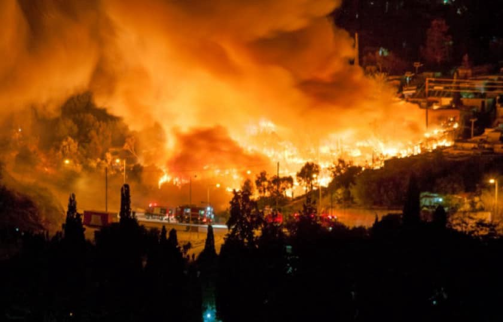
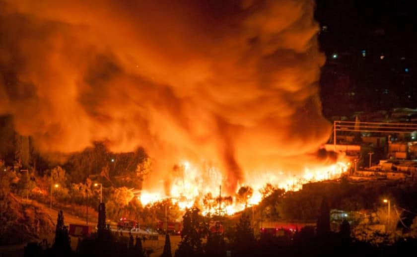

### AYS Daily Digest 02/11/20 — Another fire hits Vathy camp on Samos
### Horrid scenes from the Aegean exacerbate the already unbearable situation for the people / The European Commission intends to take legal action against Hungary for its breach of EU asylum legislation / Sweden: proposals to employ the ex\-UASCs / recommended reads & calls for action

[Are You Syrious?](?source=post_page-----7ec577ad374--------------------------------)

[Nov 3](ays-daily-digest-02-11-2020-7ec577ad374?source=post_page-----7ec577ad374--------------------------------) · 8 min read

According to Samos Volunteers and [Aegean Boat Report](https://www.facebook.com/AegeanBoatReport/posts/959782687878169) , a fire broke out last night in the Vathy camp on the island of Samos, destroying around 150 tents and other accommodation structures, and threatening the lives and already precarious conditions of migrant families living there\. Currently, around 250 people have been displaced\. The causes of the fire remain undetermined\. The camp has been in a continuous lockdown due to COVID\-19\.

[R4R \(Refugee for Refugees\)](https://www.facebook.com/Refugee4Refugees/posts/1360285050981833) also reports from the camp, and asks for support for its ongoing operations\.

[Lesvos Solidarity\-Pikpa](https://www.facebook.com/pikpalesvos/posts/2798648690410544) expresses its solidarity with those affected by the fire, and reports further on the situation for those evicted from Pikpa last Friday, now moved to the old Kara Tepe camp\.

“It was a very harsh experience for all, and re\-traumatising for some of the residents\. Especially the children got very affected being surrounded by so many police\. We are now trying our best to be close to them, and to see how we can best support the 74 men, women and children of our Pikpa community, who had to abandon their homes so suddenly\.”

No more Morias\! More Pikpas\!

LIBYA

And where exactly are they now?

As in many other places, the wording, PR and stance of the representatives of most of the UN agencies and organisations leaves many in bewilderment due to the lack of any critical or propulsive actions _for_ the people who are the focal point of the very existence of these organisations, and against the governments and their western allies who support abuse and inhumane treatment, directly or indirectly, or at least critically examining their actions and proposing solutions\. As Jeff Crisp notes, in the case of Libya, “IOM Libya’s tweets are consistently worded in a way to spare the authorities in Tripoli and the EU from any embarassment and accountability\.”

Nothing much different is happening across the Balkans\. Just as reports were coming in of beatings, shortages of basic amenities or other failures to protect humans, the IOM published how they played football with the people stuck in an overcrowded camp they were “lucky” to be stuck in at all, or how they distributed some children’s books and toys that those children will barely have any place to put, as they are sharing very poor accommodation and life circumstances with hundreds of others in the same position, etc\. This brings no good to anyone, least of all to the people they should be putting first \(rather than the leverage over the local powerful individuals or the advances in their PR comms\) \. We welcome any constructive critiques, comments or reflections on this in case there is still anyone who thinks this is the way to go\. These are the United Nations agencies, we belong to the nations united in that club, we have a say\. So do you\.

As Crisp further explained, the questions to the UN agency are rather:

how do people find accommodation once released from detention?

what kind of assistance \(immediate & ongoing\) do they get?

once released, is there a risk that they will be apprehended & sent back to detention?

EU

Two important developments in challenging EU countries’ treatment of refugees

**A joint plea to the European Court of Human Rights has been submitted** by PRO ASYL, the European Centre for Constitutional and Human Rights, and Refugee Support Aegean\. They deem the Greek\-German rejection agreement to be in breach of the European Convention on Human Rights\. [Deportations from Germany](https://www.proasyl.de/pressemitteilung/seehofer-deal-mit-griechenland-pro-asyl-refugee-support-aegean-und-ecchr-intervenieren-vor-dem-egmr/?fbclid=IwAR1lCU3TbIINFo9WiQ9KUhY76jkzHgkNxcMrQGoRS13U4BOm_Lp9nYd2WH8) to Greece, without the first country’s examination of the risk of serious human rights violations, deliberately circumvents the Human Rights Convention and the Dublin III Regulations\. We hope the ruling will also take into account the police brutality and inhumane conditions of refugees held in Greece, as documented by activists and volunteers and reported on multiple media and platforms\.

**Meanwhile, [the European Commission](https://www.infomigrants.net/en/post/28254/eu-launches-renewed-infringement-proceedings-against-hungary?fbclid=IwAR0CiuXjzLM2DehirsHwCSc4DPuZZ_l4hBL2pSrnc8FYtToKrW6LrxdHrrI) intends to take legal action** against Hungary for its breach of EU asylum legislation\. The government of ultra\-right\-wing leader Viktor Orbàn is sadly renowned internationally for its hostility towards migrants\. See more under ‘Hungary’\.

**The UN special rapporteur on trafficking, Siobhán Mullally,** has warned the UN General Assembly that the “second wave of Covid\-19 has increased exploitation risks for women, children, migrants, and other vulnerable people, and has called for profound changes in migration policies\. See more [here](https://www.infomigrants.net/en/post/28251/un-women-kids-and-migrants-at-greater-risk-in-second-covid-wave?fbclid=IwAR1DbS5j06BxTx3DgMzWulXZY3e3ePZLEweKkc5sLyA2_q3dXJx65ec9j9c) \.

GREECE

Arrivals by sea

In the meantime, [two boats carrying a total of 40–50 people landed on Lesvos](https://www.facebook.com/AegeanBoatReport/posts/959717681218003) , and reportedly the people have been hiding in the woods, fearing that the police would deport them back to Turkey\. Here, the situation for many is becoming unsustainable, as [violent attacks](https://theconversation.com/in-turkey-life-for-syrian-refugees-and-kurds-is-becoming-increasingly-violent-147704?fbclid=IwAR1kI5PTlGokPQQK6yQPdwEFlVXbAdbL6Oehj3EZDZB2aV7u62YCBL-bN2U) against Syrian and Kurdish people are rendering their life in the country increasingly dangerous\.

“recent attacks against both Syrian refugees and Kurds reveal how the nationalist policies of Turkey’s authoritarian and aggressive regime are influencing perceptions and attitudes towards non\-Turkish minorities — with devastating consequences\.”

A personnel member’s diary found in the ashes of Moria

Journalists at [Investigate Europe have retrieved a diary in the ashes of the Moria camp](https://www.investigate-europe.eu/en/2020/moria-logbook-unaccompanied-minors/?fbclid=IwAR199OU2bR7uLFJByG_JSytvapJaDLsyeyqQrmGLgr-yLfh8VT1GauJaAnc) on Lesvos, which burned down in early September this year\. The diary of an unidentified social worker describes the appalling and desperate situation of unaccompanied minors in the camp, and offers an insight not only into the horrors they endured, but also into the sense of helplessness experienced by those employed in the camp\. It reveals how social workers, in many instances, did not have the capacity to manage the overcrowded camp, or to attend to many of the serious issues encountered by unaccompanied minors, often victims of psychological or sexual abuse\.

“It’s a first\-hand document of Europe’s failure to protect the most vulnerable group of asylum seekers\. Since the fires in Moria in September, the situation for minor migrants in Lesbos has only become worse\.”

HUNGARY

The EU will initiate infringement proceedings over Hungary’s “incorrect application of EU asylum legislation”

On account of its imposition of illegal restrictions on access to the asylum procedure, the European Commission will once again take legal action against Hungary\. The current rules imposed by the country preclude persons who are on Hungary’s territory, including at the border, from applying for international protection there, as the EC stated\. In their attempt to seek asylum in Hungary, non\-EU nationals had to go to Belgrade or Kyiv to declare their intention to seek asylum in Hungary there\. “If their case is deemed to be solid, would\-be asylum seekers could then be given an entry permit to Hungary to present their case to authorities there”, it is explained\.

BOSNIA AND HERZEGOVINA/EU BORDER

It was reported in 2018 that the Security Fund, out of over 10 million euros allocated to Croatia’s border protection, secured 600,000 euros for maintenance and service of the two AW 139 border helicopters, aiming to “fully equip the helicopters for state border surveillance on land and on sea”\.

Pushbacks from Italy

Volunteers at NoName Kitchen in Patras report that, despite the harsher weather, many people on the move are still trying to get into Italy from Patras, by hiding in trucks that are then stacked on boats\. There are now around 200 people in the abandoned factories near the port of Patras, trying to get onto these trucks, while others are trying to reach Athens or try the Balkan route\.

On October 24th, [as they report,](https://www.facebook.com/NoNameKitchenBelgrade/posts/1111905595874390) a 20\-year\-old Afghan boy was pushed back from Italy to Greece\. “According to his testimony, between six and eight Italian policemen handcuffed him, and he was left without food and water\. He told the translator that he was feeling bad and that his throat was very sore, but they ignored his request to see a doctor, denying him his right to healthcare\.”

SPAIN

[Melilla Acoge](https://www.facebook.com/AcogeMelilla/?__cft__[0]=AZWkI0GJbSeK5YvG1ldfsCrm7wy_d22JAom4Pct_aQ9COh6lFKXblVkpVtLimQ1y0rzSlNPze8fFmZrAsNzZ0pPLosnybHzNbRyzWjRteBmzF2DWP87mA6EnjO5SHSPQIZtFaMnkFo8vnioQxusoGiDG8TLqyJZxqzB6MAH3brts10mIQjPA8Z42_Y7MC-GrjfwEDSqAhIlCVJ36S0eTyUcL&__tn__=-UC%2CP-y-R) needs shelves\!

### SWEDEN

When unaccompanied minors become young unemployed people

A suggestion came from three political parties to hire those who arrived in the country as unaccompanied minors, as today most of them are about 18\. They risk losing their residency due to the issue of unemployment, and as everywhere else, it is much more difficult to find a job at the moment because of the effects of the pandemic on everyday work and the economy\.

Approximately 7,500 people have been granted temporary residency under the so called high\-school act\. However, when their studies are over, the person has six months to find a job with a contract of at least two years\. The rules will change but will not be implemented until the summer of 2021\. Then, [reportedly,](https://l.facebook.com/l.php?u=https%3A%2F%2Fwww.gp.se%2Fnyheter%2Fg%25C3%25B6teborg%2Ff%25C3%25B6rslaget-anst%25C3%25A4ll-ensamkommande-som-riskerar-utvisning-1.36461623%3Ffbclid%3DIwAR28WZvxpuWiQfd2m8ACxHYJYVVSzNgSNMF6l2ge9qV7yLl6-o8MEYLMHns&h=AT0jFTFtaFPY4BqiwXDpqCNCbPc6KMovlho1dgwSO7caBX_dbBHTrApFCSeTFeW8LDXSLpTQzquOb-S8X6jynMwvRhMZPvW0bTIT-p50AnCxmx5fcOfoH_JUobOITmmqOA&__tn__=%2CmH-R&c[0]=AT186Qx-sb-zVPek42fOKbhJWIcBGfXnyejn5HFRie08mFmw_XDipXdh9KNDcqRdVkh1yKYsHOBNb4vOcGERvTDvywCoxfI7elJg38a8G14iOO_nvfqBPAIn95-T6piyrf50453lGnascP3uoF4gghdGAf7jbvp74fleL4nohVpsRt2YucObermwPCe3ie-GDFINrSQ2XM6miNfGOw) the time frame will be one year, both for finding a job and for the duration of the contract\. A lot of people affected have graduated before the summer — which means that easing the rules next summer will not affect them\.

WORTH READING

“A spate of attacks in Turkey on Syrian refugees and Kurdish internal migrants and displaced people in recent months have put both communities on edge”:
### [In Turkey, life for Syrian refugees and Kurds is becoming increasingly violent](https://theconversation.com/in-turkey-life-for-syrian-refugees-and-kurds-is-becoming-increasingly-violent-147704?fbclid=IwAR1em-IX-FyyBz4AM-3wrKAFZjEV_96EhhYKW8--3Mdkk9Rl8-qTBf8tcF4)
### [A spate of attacks in Turkey on Syrian refugees and Kurdish internal migrants and displaced people in recent months…](https://theconversation.com/in-turkey-life-for-syrian-refugees-and-kurds-is-becoming-increasingly-violent-147704?fbclid=IwAR1em-IX-FyyBz4AM-3wrKAFZjEV_96EhhYKW8--3Mdkk9Rl8-qTBf8tcF4)
#### [theconversation\.com](https://theconversation.com/in-turkey-life-for-syrian-refugees-and-kurds-is-becoming-increasingly-violent-147704?fbclid=IwAR1em-IX-FyyBz4AM-3wrKAFZjEV_96EhhYKW8--3Mdkk9Rl8-qTBf8tcF4)

Take a look inside the above mentioned logbook found in Moria:
### [Moria: Logbook of horrors — Investigate Europe](https://l.facebook.com/l.php?u=https%3A%2F%2Fwww.investigate-europe.eu%2Fen%2F2020%2Fmoria-logbook-unaccompanied-minors%3Ffbclid%3DIwAR3Dcseujl_iCQgQaWEpQIWjAyrH6A8oZMX1Kag_qFG14dNQ3tf9JMS5x30&h=AT00zkF5wPGi-b1BG93WQCypk5xRypYCm3TnLnZQQmyTsgbgLiJdLzFXHi2ESyL4D4F39WrekpfW7_zMOUHP1IH1bffF8hxy7UYiG7VYFt9Mjps9de6ybWPvo1IN4Y2-Rg2Ajsm54Bw4dg&__tn__=R]-R&c[0]=AT2dP4cZeQZjCeoMUus7CZ7BjJwFBWANp9DB4IDksjIZbckdjKJ-l18uPzJ2RvkCp24BNa48V284OD9BpJxHZU7Su0LyQvuvJ_DDNwZ6ESOX9NWWHwRRsoZMByev1blqFkScj--wXKKmpjnnraiT8SB4NahpoWGJxODyrnClzp2pVn8337E4-WDCqoDFOoc79LAerL1DxDIjnfSAct5AuhWFuKvaiPT69yrd1V4adg)
### [We found a personnel logbook in the ashes of Europe’s most notorious refugee camp, Moria, located on the Greek island…](https://l.facebook.com/l.php?u=https%3A%2F%2Fwww.investigate-europe.eu%2Fen%2F2020%2Fmoria-logbook-unaccompanied-minors%3Ffbclid%3DIwAR3Dcseujl_iCQgQaWEpQIWjAyrH6A8oZMX1Kag_qFG14dNQ3tf9JMS5x30&h=AT00zkF5wPGi-b1BG93WQCypk5xRypYCm3TnLnZQQmyTsgbgLiJdLzFXHi2ESyL4D4F39WrekpfW7_zMOUHP1IH1bffF8hxy7UYiG7VYFt9Mjps9de6ybWPvo1IN4Y2-Rg2Ajsm54Bw4dg&__tn__=R]-R&c[0]=AT2dP4cZeQZjCeoMUus7CZ7BjJwFBWANp9DB4IDksjIZbckdjKJ-l18uPzJ2RvkCp24BNa48V284OD9BpJxHZU7Su0LyQvuvJ_DDNwZ6ESOX9NWWHwRRsoZMByev1blqFkScj--wXKKmpjnnraiT8SB4NahpoWGJxODyrnClzp2pVn8337E4-WDCqoDFOoc79LAerL1DxDIjnfSAct5AuhWFuKvaiPT69yrd1V4adg)
#### [l\.facebook\.com](https://l.facebook.com/l.php?u=https%3A%2F%2Fwww.investigate-europe.eu%2Fen%2F2020%2Fmoria-logbook-unaccompanied-minors%3Ffbclid%3DIwAR3Dcseujl_iCQgQaWEpQIWjAyrH6A8oZMX1Kag_qFG14dNQ3tf9JMS5x30&h=AT00zkF5wPGi-b1BG93WQCypk5xRypYCm3TnLnZQQmyTsgbgLiJdLzFXHi2ESyL4D4F39WrekpfW7_zMOUHP1IH1bffF8hxy7UYiG7VYFt9Mjps9de6ybWPvo1IN4Y2-Rg2Ajsm54Bw4dg&__tn__=R]-R&c[0]=AT2dP4cZeQZjCeoMUus7CZ7BjJwFBWANp9DB4IDksjIZbckdjKJ-l18uPzJ2RvkCp24BNa48V284OD9BpJxHZU7Su0LyQvuvJ_DDNwZ6ESOX9NWWHwRRsoZMByev1blqFkScj--wXKKmpjnnraiT8SB4NahpoWGJxODyrnClzp2pVn8337E4-WDCqoDFOoc79LAerL1DxDIjnfSAct5AuhWFuKvaiPT69yrd1V4adg)

**Find daily updates and special reports on our [Medium page](https://medium.com/are-you-syrious) \.**

**If you wish to contribute, either by writing a report or a story, or by joining the info gathering team, please let us know\.**

**We strive to echo correct news from the ground through collaboration and fairness\. Every effort has been made to credit organisations and individuals with regard to the supply of information, video, and photo material \(in cases where the source wanted to be accredited\) \. Please notify us regarding corrections\.**

**If there’s anything you want to share or comment, contact us through Facebook, Twitter or write to: areyousyrious@gmail\.com**

_Converted [Medium Post](https://medium.com/are-you-syrious/ays-daily-digest-02-11-20-another-fire-hits-vathy-camp-on-samos-1d4739f9e2e) by [ZMediumToMarkdown](https://github.com/ZhgChgLi/ZMediumToMarkdown)._
