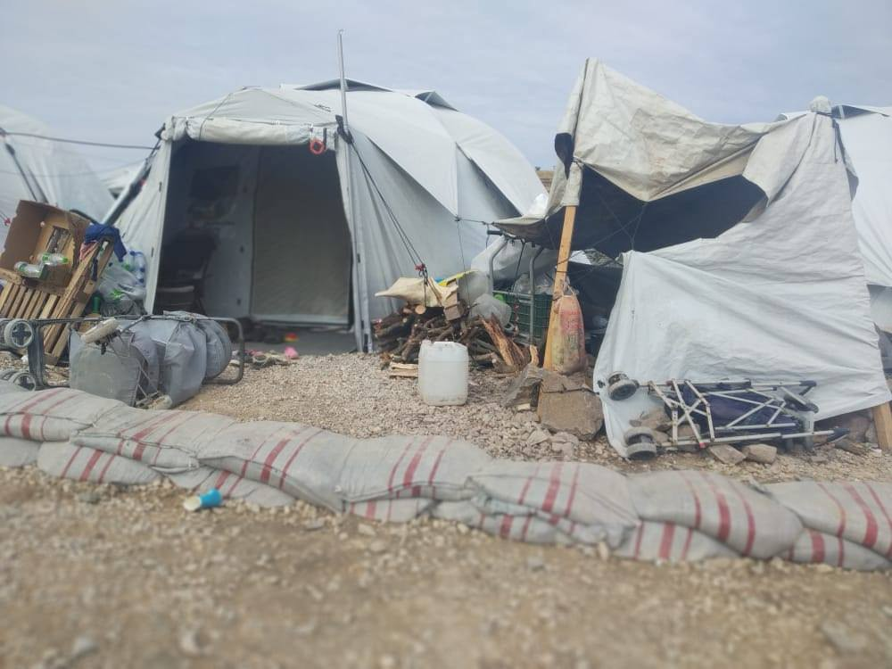

### AYS Daily Digest 03/11/2020: Greece enforced new pandemic restrictions
#### Update on the conditions in Moria 2\.0 // MSF reminds on conditions in closed Libyan detention center // Canary Islands with massive increase in new arrivals // Hungary in EU’s focus

A picture from Moria 2\.0, where people still have no showers and heating\. Copyright: Raid al Obeed, Moria White Helmets,
### GREECE
#### Coronavirus measures are toughened throughout Greece

As of Tuesday morning, 3 November, the coronavirus measures will be intensified all over Greece, as the Prime Minister announced on the weekend\.

From now on, it will be mandatory to wear a face mask both inside and outdoors\. A curfew will also be implemented, lasting from midnight to 5 a\.m\. During this time, people are only allowed to be in the streets if on the way to their work place or in case of medical emergency\. Fines of 150 Euro can be applied by the police\.

Stricter measures apply for Athens and most of Northern Greece\. There, gyms, restaurants, cultural events etc\. are suspended\. Schools will remain open\.

Thessaloniki and Serres will go into lockdown altogether\. In these cities, the night curfew will start 9 p\.m\. and last until 5 a\.m\. During the day one will only be allowed outside for one of the following reasons:
- To go to and come from your workplace\.
- To go to the pharmacy, doctor or hospital\.
- To buy necessary essentials from a shop\.
- To get money from the bank\.
- To go to a public service, in case this is necessary and there is no way to do it remotely\.
- To go to help somebody in need\.
- To bring or pick up a minor from school\.
- To go to a funeral\.
- To walk your dog or do physical exercise \(max\. 2 persons\) \.

Schools of Primary Education and the Gymnasiums will remain open\. All other educational institutions like Universities, tuition centres, and foreign language institutes will be closed\.

If you leave the house, you have to carry an ID document, like a white card, residence permit or passport with you\. In addition you will have to get an allowance to leave the house, which is easiest via SMS\.

Groups working on the ground like Wave\-Thessaloniki call for the police and the government to protect the rights and health of the most vulnerable people in this time:

> “We hope for more tolerance and acceptance from police this time, people living in the streets can’t stay in their house during a lockdown” 

Find more on how to get the allowance via SMS [here](https://www.mobileinfoteam.org/corona-sms-th?fbclid=IwAR1hSuv9UoPp4Hdp_4TUgBoR93pAaIlT-2QkOjBWiSREeELcQ3CEORw4G_o) \.

Please follow Mobile Info Team on Facebook for updates\.

More information in Greek [here](https://covid19.gov.gr/covid-map/?fbclid=IwAR2mkRBPzWXsWNR5U10LCU0uHSSqtK_uhBDdrESr_y99xivS3MxyEzgBQz8) \.
#### Conditions in Moria 2\.0

DunyaCollective tweeted about the conditions in the new camp:

■■■■■■■■■■■■■■ 
> **[DunyaCollective](https://twitter.com/DunyaCollective) @ Twitter Says:** 

> > According to the latest publication of the Ministry of Citizen Protection from 2nd of November the current camp population at #Moria2 is 7.302

The new camp has a maximum capacity of 10.000 refugees.

It has 0 heatings and 0 showers.

#LeaveNoOneBehind 
#Antireport https://t.co/5pzlZYUKbq 

> **Tweeted at [2020-11-03 17:53:24](https://twitter.com/dunyacollective/status/1323684718764806145).** 

■■■■■■■■■■■■■■ 

#### First Mosque to open in Athens

After years of bureaucratic struggles, the first mosque finally opened in Athens on Monday, Al Jazeera reports\. In order to adhere to COVID\-19 restrictions, the inauguration was held only for a very small group of attendees\.

Athens was the last capital of a member state of the European Union to be without a mosque\. This is a shame, regarding the long tradition of Islamic faith in Greece\. According to another news article, the plans to build a mosque for Athens and the surrounding areas are 130 years old\. Attempts to do so have repeatedly been blocked and delayed, especially by some Christian orthodox representatives and far\-right forces\. In 1833, Greece became independent of the Ottoman Empire\. Various idle mosques in Athens and the rest of Greece are a reminder of the times before, when Islam was well established in Greece\.
### Libya
#### MSF informs about conditions in detention center

In a Twitter thread, MSF responded to a tweet of UNHCR Libya saying they released 140 people from detetion in Suq Alkhamees at the end of October\. One witness testified:

> “This is not a detention centre but a store for smugglers\. Here I saw dead people, criminal activities, bodies on the beach” 

MSF adds, that since 2017 they had worked in the now empty detention center and reported several incidents of violence, sexual assault and human trafficking\. The site was known for “risk of abuse and forced disappearance — it must remain closed\.”

■■■■■■■■■■■■■■ 
> **[MSF Sea](https://twitter.com/MSF_Sea) @ Twitter Says:** 

> > Here is what Ahmed, a young Somali refugee, experienced when being arbitrarily detained in Khoms Souk Al Khamis DC following his interception at sea by #EU-supported Libyan coast guards: https://t.co/1SkeIEqMlw 

> **Tweeted at [2020-11-03 16:32:12](https://twitter.com/msf_sea/status/1323664282601594882).** 

■■■■■■■■■■■■■■ 

### Sea
#### More crossing to Spanish shores

There have been several reports on an increasing number of people trying to make it to Spanish shores by boat, especially to the Canary Islands\. [Europapress](https://www.europapress.es/islas-canarias/noticia-llega-tenerife-patera-17-personas-20201103142213.html?fbclid=IwAR0CAuNA5_G7uNciQE3F6ABWku94LQ-DrIqqxZc6brvcv1Q7ZIbsI8DDGEs) speaks about one boat with 17 people, which arrived on Tuesday\. In October alone, almost 5400 new arrivals were recoded on the Canary Islands, according to [elDiario](https://www.eldiario.es/canariasahora/migraciones/canarias-registra-5-382-llegadas-migrantes-octubre-mitad-llevamos-ano_1_6384933.html?fbclid=IwAR0q4-TmA35cVQTJqFjSVM6h_QnDFKWioGS3mtu4oDQwLAvTgYMXM60EAlc) — what makes an average of 171 people per day\. It is the highest number since 2007\. After he was missing for nine days, a minor was [found](https://www.eldiario.es/canariasahora/migraciones/nino-pasa-nueve-dias-perdido-arguineguin-ver-16-personas-morir-mar-rumbo-canarias_1_6380636.html?fbclid=IwAR0NHYtqyjnk6dqRJgaYat5tNlcSN9JqRPYoMQxiKweGN8AsBe-W4Scns9U) by health workers\.

On the beach of Las Torres and in Teulada, the Civil Guard [intercepted](https://www.europapress.es/comunitat-valenciana/noticia-dos-nuevas-pateras-llegan-vila-teulada-alicante-20201103103702.html?fbclid=IwAR0kjVO7q2bWiyje-nxjXgx5u1atY6G8HCCthQqExYy5Sugzpr3lrOeNRcw) one boat each with a total of 20 people\. Off Mallorca, 14 people on one vessel were [rescued](https://www.europapress.es/illes-balears/noticia-interceptada-patera-14-inmigrantes-cala-figuera-mallorca-20201103093434.html?fbclid=IwAR2BiWVFBXS6ODSLXu5cpxZ-Qdb0lhJHz12iWQOOPDhZ8_mgqqnjUxT8JmA) , 53 off [Arguineguí](https://twitter.com/112canarias/status/1323737582757421057) and off Gran Canaria [23 people](https://twitter.com/112canarias/status/1323666461156642816?fbclid=IwAR3Fw495WWrqYT0-v9Ze8F2aa3VWgR0FEELDGcwmoG54EzP95Q_FMrdhh6Y) \.
### HUNGARY
#### EU Commission opens infringement procedure against Hungary

In May we acclaimed the ruling of the European Court of Justice against the Hungarian transit zones\. In its decision, the Court described the transit zones as unlawful detention\. Following the ruling, the transit zones were closed\. Almost 300 people were transferred to reception centres within the country\. 
However, the Hungarian migration policy did not change for the better\. Shortly after the closure of the transit zones, the government passed a new law that basically banned asylum seekers from entering the country\. From now on, ‘declarations of intent’ need to be lodged in Hungarian embassies in Belgrade in Serbia or Kiev in Ukraine\. Only after being admitted, can people enter Hungary in order to apply for asylum\.

In a letter of formal notice as opening of the infringement procedure, the EU Commission has now called on Hungary to allow access to the asylum procedure in line with EU law\.

From the [letter of formal notice](https://ec.europa.eu/commission/presscorner/detail/en/inf_20_1687) :

> “According to the new procedures, before being able to apply for international protection in Hungary, non\-EU nationals must first make a declaration of intent stating their wish to apply for asylum at a Hungarian Embassy outside the European Union and be issued with a special entry permit for that purpose\. The Commission considers that this rule is an unlawful restriction to access to the asylum procedure that is contrary to the Asylum Procedures Directive, read in light of the Charter of Fundamental Rights, as it precludes persons who are on Hungary’s territory, including at the border, from applying for international protection there\.” 

The UNHCR spokesman in Hungary expressed towards the Balkan Investigative Reporting Network that “the law undermines both the access to territory and the access to fair procedure — the two pillars of the post\-World War II international legal system”\.

The case raises serious questions on the effectiveness of legal procedures in today’s Europe, where human rights are not adhered to\. When these rights are defended in court, governments either ignore these rulings — or they stop the practice and replace it with an even worse one\. The rule of law is being undermined step by step\.

For more information, see:

### SEA
#### Many boats in distress in the Central Mediterranean

■■■■■■■■■■■■■■ 
> **[Alarm Phone](https://twitter.com/alarm_phone) @ Twitter Says:** 

> > 🆘️ ~21 people in distress!

We're worried about a group in distress in international waters. They say their engine stopped working and they are adrift. The people are dehydrated &amp; spent 2 days at sea already. All authorities refuse to take responsibility - Rescue is needed now! https://t.co/BCg3QPsVEy 

> **Tweeted at [2020-11-03 13:25:26](https://twitter.com/alarm_phone/status/1323617284011794433).** 

■■■■■■■■■■■■■■ 

Alarm Phone lost contact with a boat on Tuesday afternoon\. At that point, the engine had stopped working\. The last location of the boat was in international waters between Libya and Tunisia\.

Earlier the same day, Alarm Phone was in contact with five boats that were already close to Lampedusa\. Alarm Phone was not informed that these people were rescued, however they hope they managed to arrive independently and safely\.
### FRANCE

After a nearly four year long legal trial, a French national was acquitted of all charges against him by the Lyon Court of Appeal\. Pierre\-Alain Mannoni was prosecuted for transporting three migrants in 2016\.

For more information in French, see:

In Nantes, a new squat has been opened with the support of the association l’Autre cantine\. The squat hosts around 100 people, among them families, who were homeless prior to moving into the building\.
### WORTH READING

Info Migrants published a piece about people from Syria trying to reach the French oversee\-department French\-Guyana via Brazil\. Brazil issues humanitarian visas for Syrians\. In 2020, the number of people who try to take this detour of several thousand kilometres rose to about 150–300 each month\.

On November 6th, the documentary “Love Child” will be released\. It was shot for more than six years in Turkey, accompanying the life of an Iranian family\. In a review, The Guardian [concludes](https://www.theguardian.com/film/2020/nov/03/love-child-review-refugee-documentary-iran-turkey?fbclid=IwAR37a3ZaLT0KRUpdf9XLuLUqwb2iszK8pP07FknhxfBvHPDPv0FPgrpV_tA) , it is a “documentary that gives off warmth like a radiator, generating huge amounts of empathy”\.

La Croix [tells](https://www.la-croix.com/JournalV2/Le-loup-blanc-Lesbos-2020-11-03-1101122580?fbclid=IwAR3WF0pKR2G6te1Dmm2lVf_ce2XB-ocRyhA3ljBi2xFKrlcRORJ3XGs9S9o) the story of a former Afghan refugee who has become a journalist and French citizen, travels the world and always returns to his home port, the camp on the Greek island of Lesvos, to make the voice of asylum seekers heard\.

In a [journal](https://www.cambridge.org/core/journals/african-studies-review/article/refugees-evacuees-and-repatriates-biafran-children-unhcr-and-the-politics-of-international-humanitarianism-in-the-nigerian-civil-war/24B75B7BBF6D3970C19DACEF5E9E7E8E/core-reader?fbclid=IwAR0x_-VixHv7lKv8lfNcgXDUGfYCImQ4OkusvE-N69_JgrZTwxPOW2_oYew) , the Cambridge university analyses the sitaution of the Biafran Children as well as the roles of UNHCR and the Politics of International Humanitarianism during the Nigerian Civil War: “Ibhawoh examines how state interests and the politics of international humanitarian interventionism manifested in debates about classifying and protecting displaced children, the most vulnerable victims of the conflict\.”

**Find daily updates and special reports on our [Medium page](https://medium.com/are-you-syrious) \.**

**If you wish to contribute, either by writing a report or a story, or by joining the info gathering team, please let us know\.**

**We strive to echo correct news from the ground through collaboration and fairness\. Every effort has been made to credit organisations and individuals with regard to the supply of information, video, and photo material \(in cases where the source wanted to be accredited\) \. Please notify us regarding corrections\.**

**If there’s anything you want to share or comment, contact us through Facebook, Twitter or write to: areyousyrious@gmail\.com**

_Converted [Medium Post](https://medium.com/are-you-syrious/ays-daily-digest-03-11-2020-greece-enforced-new-pandemic-restrictions-71d398d72f67) by [ZMediumToMarkdown](https://github.com/ZhgChgLi/ZMediumToMarkdown)._
