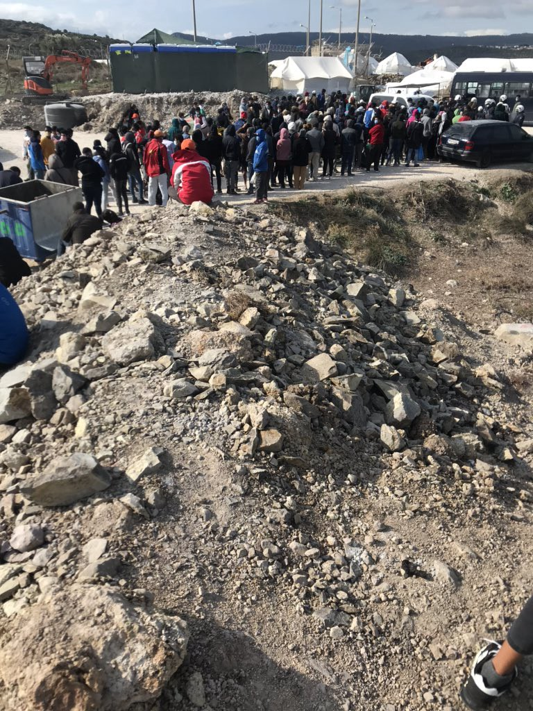

### AYS Daily Digest 06/11/2020 — Bosnia & Herzegovina Signs Repatriation Agreement With Pakistan
### Winter On Its Way to Moria 2\.0//Bulgarian Company Helps People on the Move Find Work in AI//More Arrivals in Lampedusa///& More

[Are You Syrious?](?source=post_page-----915e0f2865c--------------------------------)

[Nov 7](ays-daily-digest-06-11-2020-bosnia-herzegovina-signs-repatriation-agreement-with-pakistan-915e0f2865c?source=post_page-----915e0f2865c--------------------------------) · 10 min read

### FEATURE
### Bosnia & Herzegovina Signs Repatriation Agreement With Pakistan

On Wednesday, the [Bosnian and Pakistani governments](https://www.facebook.com/balkaninsight/posts/10164475033335506) signed a mutual repatriation agreement\. From now on, Pakistan [will accept its citizens](https://balkaninsight.com/2020/11/04/bosnia-signs-deal-with-pakistan-to-send-back-migrants/) deported from Bosnia & Herzegovina for not having valid paperwork\.

Earlier this year, the former Bosnian security minister Fahrudin Radoncic declared the Pakistani ambassador to the country persona non grata after he claimed that the South Asian country was not cooperating in identifying its citizens that were in Bosnia\. Such a drastic measure was not supported by other members of his government and Radoncic eventually resigned\.

There are no exact numbers about how many Pakistani people are in Bosnia & Herzegovina, but there are estimated to be [about 3,000](https://www.occrp.org/en/daily/13364-pakistan-signs-illegal-migrants-repatriation-deal-with-bosnia) \. Most people are trying to reach the European Union, but wind up stranded in Bosnia & Herzegovina due to repressive border policies by the Croatian police\.

While this new agreement may signal a better diplomatic relationship for the governments of Bosnia & Herzegovina and Pakistan after a testy spring, it will probably bring nothing good to the thousands of Pakistanis stranded in Bosnia & Herzegovina\.
### LIBYA
### Updates on the Situation in Libya

There are thousands of displaced people in Libya, including people from other countries trying to reach Europe and Libyans displaced by the ongoing civil war\. An estimated [200,000 people](https://www.unhcr.org/news/stories/2020/11/5fa3a93d4/cash-aid-brings-relief-libyan-families-uprooted-clashes.html?fbclid=IwAR1qcezinFv7GLHIaeXNxpb5rehyJ4Esjck-Y0xTlUMInhEkN6SaKAY5lkY) have had to flee their homes in Tripoli since last year due to ongoing fighting\.

Some of the people on the move were able to receive cash grant assistance from UNHCR or the partner NGO Cesvi\.

The best form of aid to those seeking to reach Europe would be to allow them to do so\. Yet, interceptions by the so\-called Libyan coast guard are allowed to continue\. Between [November 3rd and 5th alone](https://reliefweb.int/report/libya/unhcr-update-libya-6-november-2020?fbclid=IwAR2pNcF0c31dL8TyugYrqz1tH8MCN7SoJjcmDAyQIjNU7D03l1CO_kziA94) , 421 people were forced back to Tripoli\.
### SEA
### German Evangelical Bishop Repeats Support for Sea Rescue

Bishop of the Evangelical Church Heinrich Bedford\-Strohm continues to defend his church’s support of sea rescue, including by helping send a rescue ship to the Mediterranean, despite criticism\. “The fact that 353 people were saved from drowning on the first mission speaks for itself,” he said [in an intervie](https://www.welt.de/politik/deutschland/article219453486/Heinrich-Bedford-Strohm-353-Menschen-gerettet-das-spricht-fuer-sich.html?fbclid=IwAR1qcezinFv7GLHIaeXNxpb5rehyJ4Esjck-Y0xTlUMInhEkN6SaKAY5lkY) w\.

The ship that the Evangelical Church, among many others, helped fund is now unfortunately blockaded in Palermo\.
### GREECE
### Winter is on its Way to Moria 2\.0

Strong winds, rain and cold temperatures have hit the tent city that is Moria 2\.0, causing horrible conditions for the people inside\. People [cannot have heaters or fires inside](https://www.facebook.com/chooselove/posts/1284350001925670) or near tents out of fear of another fire breaking out or carbon monoxide poisoning, and there are no electric solutions as the wiring inside the camp [cannot supply electricity](https://twitter.com/f_grillmeier/status/1324658194099118081?fbclid=IwAR2AmvauxeYGG9iaabGNogNL2XQZ0tC-HMF56dya9uHRy4VidqiXlhXu0uM) to 7,000 people\. This gives people no way to stay warm on an island where winters can be cold and snowy\.

Despite extensive evidence of poor conditions in the camp, Notis Mitarakis claimed in an [interview with InfoMigrants](https://www.infomigrants.net/en/post/28372/mitarakis-we-are-protecting-our-borders-in-line-with-international-law?fbclid=IwAR1sRhCyovMKrB90QM13K5ZPP-i48Ev6HhJEbjnSyi-vJfYZQD5fI8_ZuaE) that there are enough toilets and showers, barely addressed the lack of weatherproof living conditions, and blamed the people who allegedly burnt down the first Moria for the bad conditions, not the negligence of his government\.

The conditions in Moria 2\.0 have led to an outcry from residents and allies across Europe\. German activists including our [friends at Seebrucke](https://www.facebook.com/SeebrueckeSchafftsichereHaefen/posts/1259958807709633) are calling on their government to evacuate people from Moria, following the wishes of many German people and local leaders\. It is the national politicians, including Horst Seehofer, that are ignoring the most basic slogan of solidarity: “Leave No One Behind\.”

Of course, a camp where people could have safe, dignified housing already existed on Lesvos — Pikpa — but it was shut down in a decision that is still baffling in its cruelty and poor public health effects\. [As Efi Latsoudi says](https://www.facebook.com/pikpalesvos/videos/1120652571726353) , “we cannot talk about health if we are talking about places that create all the time health problems, mental health problems \[…\] violence, huge violence, and then death\.” Pikpa’s importance to the people it housed is shown by this [excerpt from a statement](https://www.facebook.com/pikpalesvos/posts/2802385286703551) written before the eviction by Mina, a Pikpa resident:

> _I now live in a camp that is a paradise compared to other camps, with a small population\. Where human dignity, security, rights for women are preserved but the government has decided to close this camp\._ 

> _I hope for the release of all refugees, especially oppressed women, from this prison\._ 

A total of [750 people](https://www.keeptalkinggreece.com/2020/11/06/750-refugees-have-tested-positive-to-coronavirus-one-died/) on the move have tested positive and one person died of coronavirus\. For more information about the new restrictions in multiple languages, [go here](https://www.facebook.com/mobileinfoteam/posts/2914494058779304) \.

[This article](https://www.tandfonline.com/doi/full/10.1080/1369183X.2020.1840969?scroll=top&needAccess=true) by [Tihomir Sabchev](https://twitter.com/TihomirSabchev/status/1324667252797526016?fbclid=IwAR0-Jqkuyo_shtZWNGbvtQDlQXISMiVTQQyq-QmiU78FaMo58hf7vTGv4xc) studies the role of local governments in Greece on developing migration policy, including direct cooperation with the UN\. It is well worth a read as it discusses aspects that are often overlooked when talking about Greek migration policy\.

Finally, some good news: [Fenix Humanitarian Legal Aid](https://www.facebook.com/FenixAid/posts/658648671477005) was able to help their client Halimi and his three daughters reunite with his wife in Switzerland\. The family was happily reunited this week\.
### BULGARIA
### People on the Move Find Work in AI

“Humans in the Loop” or HITL is a Bulgarian startup that connects people on the move across the Balkans and the Middle East with jobs in the artificial intelligence industry\. It currently [works with over three hundred people](https://balkaninsight.com/2020/11/04/from-bulgaria-connecting-refugees-to-remote-ai-jobs-around-the-world/?fbclid=IwAR09gefAOjZqUWPiGcnQr2YY8BdIo0mGdbAskUp2G6mv7U1pMwl4kxlX_lo) and provides training in IT and English language skills\.

The programme gives people a job when they often cannot find one, and a job that recognizes their skills and gives them the flexibility to work from home during the Covid\-19 pandemic\. “It’s tough to live in the camp, but my job keeps me going,” Ali, a Syrian living in Iraq who works for HITL said\.
### HUNGARY
### European Commission Brings Infringement Procedures Against Hungary

For the fifth time since 2015, Hungary is [facing infringement procedures f](https://www.ecre.org/hungary-facing-fifth-infringement-procedure-related-to-asylum-since-2015/?fbclid=IwAR3n8i0duBGaSfiLw-HMkp_CvNkKAI6THq32glHA-E92_FIq8gCqUwR8Lt4) rom the EU for asylum\-related matters\. This time, the Commission said that Hungary’s new procedures for applying for asylum post pandemic, where people have to apply at an embassy in a neighboring country, provides unnecessary barriers to applying for asylum\.
### ITALY
### More Arrivals on Lampedusa

Arrivals in the hotspot of Lampedusa continue, bringing the total number of people [there to 1,361](https://www.tgcom24.mediaset.it/cronaca/sicilia/migranti-altri-sbarchi-a-lampedusa-1-361-persone-allhotspot_25153629-202002a.shtml?fbclid=IwAR2pNcF0c31dL8TyugYrqz1tH8MCN7SoJjcmDAyQIjNU7D03l1CO_kziA94) \. On Friday, [ninety people](https://www.grandangoloagrigento.it/primo-piano/lampedusa-proseguono-gli-sbarchi-90-migranti-sullisola?fbclid=IwAR2pNcF0c31dL8TyugYrqz1tH8MCN7SoJjcmDAyQIjNU7D03l1CO_kziA94) in two different boats arrived\. On Thursday, a boat [carrying 81 people](https://twitter.com/alarm_phone/status/1324745009195876354) that contacted AlarmPhone while in distress in the Maltese SAR arrived in Lampedusa as well\. Some are being transferred to a quarantine ship, but that is not a permanent solution\.

The Sicilian president also announced that [12,000 people on the move](https://www.grandangoloagrigento.it/ultime-notizie/covid-musumeci-oltre-12-mila-tamponi-effettuati-su-migranti-sbarcati-in-sicilia?fbclid=IwAR3qX3dbmNcPznpX9ITwuVsyP00kjY8qP5m6uoxgOSpWIFehKiCy2NizrpM) have been tested for Covid and those who tested positive were isolated\.
### SPAIN
### Migration Secretary: “The Irregular Borders are the Safest” but for Whom?

Spanish secretary of migration Hana Jalloul stated that “the irregular border” \(referring to the Spanish coast\) is the “ [safest border](https://www.europapress.es/epsocial/migracion/noticia-secretaria-estado-migraciones-frontera-irregular-mas-segura-no-entra-inmigrante-pcr-20201106132338.html?fbclid=IwAR1TRjhmuh5ivw4gTB4IEsl_AfoBN4_bjqKFC7XOiT7vA3Pb3MOO0r7NDUI) ,” due in part to the extensive coronavirus testing regime her government is carrying out\.

She made this statement in response to a deputy from the far\-right Vox party who spoke of an “invasion” threatening Spanish people in the streets\. Jalloul pointed out that most people on the move get funneled into reception centers, are extensively tested for COVID, and also highlighted efforts made by people on the move to help Spain’s health sector during the worst of the pandemic\.

Jalloul’s intention, to shut down a xenophobe, may have been good, but it is strange to call the Spanish external border “the safest border” when so many people have died trying to reach it this year alone\. Just yesterday, [four people died](https://www.infomigrants.net/en/post/28349/four-migrants-die-trying-to-reach-spanish-enclave-in-africa?fbclid=IwAR08b-wRucpqiCj99wdJQBSHzZn6Sl7SiwXovUQEfZB_xo3XY4j6Qhi87lg) trying to reach the heavily fortified enclave of Melilla by going through a sewer tunnel\. The fortification of the Spanish\-Moroccan border has caused more and more people to take the dangerous Atlantic route, including the [over 100 people](ays-daily-digest-29-10-2020-360-people-released-from-detention-in-libya-55fe0a160425) that perished off the coast of Senegal last week\.

The heavily policed Spanish “irregular border” may be safe for Spaniards but we cannot forget how deadly it is for countless others\.

The Association Maakum Ceuta is looking for clothing donations to give to youth living on the street\. Learn more on their Facebook page, [here\.](https://www.facebook.com/permalink.php?story_fbid=923675291494920&id=459655701230217)
### FRANCE
### Asylum Services Will Remain Open During Lockdown

The Office for the Protection of Refugees and Stateless Persons and the National Court of Asylum will remain open in France during lockdown\. For more information on their operations during the lockdown, [go here](https://www.infomigrants.net/en/post/28333/how-will-france-s-asylum-services-work-during-lockdown?fbclid=IwAR2h6OBTGpWm7mGajMmCN5epAgi9BxYN9dgZbcscOaSYJkMWD6dhi6CQGIA) \.
### AUSTRIA
### Pushbacks to Bosnia from Austria

Austrian radio station Ö1 reported on a group of people that were pushed back from southern [Austria all the way to Bosnia](https://www.facebook.com/RefugeesSpielfeld/posts/2676091382651334) , despite requesting asylum in Austria\.
### UK
### Home Office Will Not Restart Resettlement Programme

The Home Office [will not restart the program](https://www.independent.co.uk/news/uk/home-news/refugee-resettlement-home-office-vprs-b1050485.html?fbclid=IwAR2yVY3Sd61uBuqvEw_NUarmEwr0jzfJL_89PbDDgqV2z1Sp3ZSLpjLcZt8) me that resettles vulnerable people to the UK, forcing many agencies and NGOs that work with refugees to scale down their work, fire workers, and stop providing services to those already in the country who need them\.

A number of people were set to be resettled when the program was paused back in March, and are now stuck in other countries with no savings, jobs, or future chance of entering the UK\.

Sixteen London council leaders sent a leader to Home Office Secretary Priti Patel expressing their willingness to provide people with homes in their communities\. Ordinary British people are also stepping up by hosting people in their spare rooms through the charity [Refugees At Home](https://www.refugeesathome.org/?fbclid=IwAR1BgfPcqZ4o5m9fyD1QDb710QNHBPwdAVJ1Z7wKtAuHD2cmXVEs8ZXf0k4) \. One of the hosts was none other than football star [Gary Lineker,](https://www.bbc.com/sport/av/football/54826944?fbclid=IwAR3PvHOS8yfnwlcHaZQJ6zRiFt7ZP2Ingb9WskJ__ZuWC0-kE-VjrvY-okc) who also said he is willing to host others in the future\.

In other news from the Home Office, they [violated a court order](https://www.msn.com/en-gb/news/uknews/home-office-accused-of-breaching-high-court-order-over-asylum-seeker-evictions/ar-BB1aKVpj?fbclid=IwAR32nSJBWfbZ5a-8LF8DzAH4sVf04JglrMyy7X0XYnnoaxUyMghizvE_KWI) to stop evicting asylum seekers and are not providing people with anywhere to go or any way to support themselves\. The courts have struck down [many other Home Office policies](https://www.ecre.org/uk-legal-interventions-challenge-home-offices-hard-line-on-asylum-seekers/?fbclid=IwAR139S6fK-Xp71qYaJRpuocxgfZ0Waoy0bSuK4hPFNMZ093XopCRWQYkw2g) recently, including one that allowed unaccompanied minors to be housed in hotels with unrelated adults\.
### EU
### Analysis of the New Pact

As discussions in the European Council on the New Pact on Migration and Asylum continue, so do the analyses and critiques\. Statewatch [published and analyzed](https://www.statewatch.org/news/2020/november/eu-tracking-the-pact-presidency-placing-heavy-emphasis-on-externalisation-deportations-border-controls/?fbclid=IwAR1b_tkPQ0pmK6dH64gbuHMviycKNw4SvwriCsojbgXliEAg4XVcGEyj2ME) the German Presidency’s proposals, that show that the priority of the pact is externalization of the EU’s borders and increasing deportations and border control\. Little attention is given to saving the lives of those put at risk by Europe’s dangerous borders\.

The Pact is a broken agreement in and of itself, but it builds on previous problems with European migration policy, as Jeff Crisp brilliantly exposes in [this a](https://www.refugeesinternational.org/reports/2020/11/5/european-refugee-policy-whats-gone-wrong-and-how-to-make-it-better?fbclid=IwAR1b_tkPQ0pmK6dH64gbuHMviycKNw4SvwriCsojbgXliEAg4XVcGEyj2ME) rticle\. The EU has long had problems with a lack of preparedness and solidarity, along with criminalization of people on the move and externalization of borders\. Crisp suggests ways in which the pact could have been better and more humane:

> _It would in the first instance focus on the restoration of both EU and NGO search\-and\-rescue efforts in the Mediterranean and establish more predictable disembarkation and refugee distribution mechanisms\. It would also mean the withdrawal of EU support for the Libyan Coastguard, the closure of that country’s detention centers, and a substantial improvement of the living conditions experienced by refugees in Europe’s frontline states — changes that should take place with or without a Pact\._ 

> _Indeed, the EU should redeploy the massive amount of resources that it currently devotes to the externalization process, so as to strengthen the protection capacity of asylum and transit countries on the periphery of Europe\. A progressive approach on the part of the EU would involve the establishment of not only faster but also fair asylum procedures, with appropriate long\-term solutions being found for new arrivals, whether or not they qualify for refugee status\._ 

> _These changes would help to ensure that those searching for safety have timely and adequate opportunities to access their most basic rights\._ 

The EU Agency for Fundamental Rights stated in its [latest quarterly bulletin](https://fra.europa.eu/en/news/2020/migration-worsening-conditions-migrants-and-refugees-across-europe?fbclid=IwAR0moC14IOqaHY79Wo6IBXyaOK1E2HlAK2HTYIzLrgc6qZpIrXajU8Y6IrE) that conditions are getting worse for people on the move in Europe, partially due to the coronavirus\. The bulletin identifies increasingly violent pushbacks \(often justified using the threat of the pandemic\), fewer pathways to enter the EU and worse conditions in reception centers as several areas of concern\. As most of Europe enters a second lockdown, these problems will probably get worse before they get better\.
### GENERAL
### Poor Conditions in Camps Send Deliberate Message

In an interview for Jacobin, Professor Nikos Xypolytas argued that the terrible conditions in camps such as Moria are not just a result of government negligence but a deliberate message that asylum seekers do not matter as much as Europeans\. Professor Xypolytas talked about the mental health effects that conditions in the camp had on people, the denial of the right to work, and more\.

> _This unwanted population has to internalize the fact that they are unwanted — and that they are not second\- or third\-class citizens, but a category that does not relate to the concept of European citizen, or even to the concept of a human being that we can respect on European soil\._ 

The article deserves to be read in full\. You can find it [here](https://www.jacobinmag.com/2020/11/overcrowded-refugee-camps-eu-migration-policy-lesbos-moria?fbclid=IwAR11hOTbpgMXALvrkq_GGRmgc6Fv3fMNmqhoBZTRpUkw7JeBlNaCxyXlRyw) \.
### WORTH READING

We often hear the term “vulnerable people” thrown around when talking about migration policy, but what does that really mean? Mixed Migration Centre launched two studies tracking vulnerability to incidents of harm across the Central Mediterranean route, and you can read their findings [here](http://www.mixedmigration.org/articles/a-sharper-lens-on-vulnerability-key-insights-from-two-new-mmc-studies-on-vulnerability-along-the-central-mediterranean-route/?fbclid=IwAR13uSEqikT9LCVE_hMyPYSOn6qSmavj1_jRLeYoXl-S0NBhm8zMzMW-In8) \.

[This article](https://www.odi.org/blogs/17527-data-gap-public-attitudes-towards-migrants-low-and-middle-income-countries-needs-closing-here-s-how?fbclid=IwAR0PZvmMFhcMLoGJ6nLcfWQmpb6aVGAsORaWrpl7TTsnRxGB9wW2GCov59o) addresses the lack of research on public attitudes towards people on the move in low\-income and middle\-income countries, where most of the world’s migration happens\.

ELENA’s [weekly legal update](https://mailchi.mp/ecre/elena-weekly-legal-update-6-november-2020?fbclid=IwAR0j6uDsmkgVbkda0kqAziukcQlUHLv_IRPksEQOmRzlcK_sjrU73a2kAig) on cases across Europe includes information about the European Court of Human Right’s ruling against Belgium in the case of the unlawful deportation of a Sudanese man, a Palestinian family’s case protesting the Dutch decision to deport them back to Greece, and more\.

**Worth Attending** : [this webinar](https://twitter.com/CMRS_AUC/status/1324727283916120066?fbclid=IwAR19oXIuoQmod0w_2rz3iQCvyB7JZygXtfQd6Wi58saFUpL7BANUWoD6xqw) hosted by the Center for Migration & Refugee Studies at American University Cairo on refugee entitlements in Egypt\.

**Find daily updates and special reports on our [Medium page](https://medium.com/are-you-syrious) \.**

**If you wish to contribute, either by writing a report or a story, or by joining the info gathering team, please let us know\.**

**We strive to echo correct news from the ground through collaboration and fairness\. Every effort has been made to credit organisations and individuals with regard to the supply of information, video, and photo material \(in cases where the source wanted to be accredited\) \. Please notify us regarding corrections\.**

**If there’s anything you want to share or comment, contact us through Facebook, Twitter or write to: areyousyrious@gmail\.com**

_Converted [Medium Post](https://medium.com/are-you-syrious/ays-daily-digest-06-11-2020-bosnia-herzegovina-signs-repatriation-agreement-with-pakistan-26918725d5cd) by [ZMediumToMarkdown](https://github.com/ZhgChgLi/ZMediumToMarkdown)._
