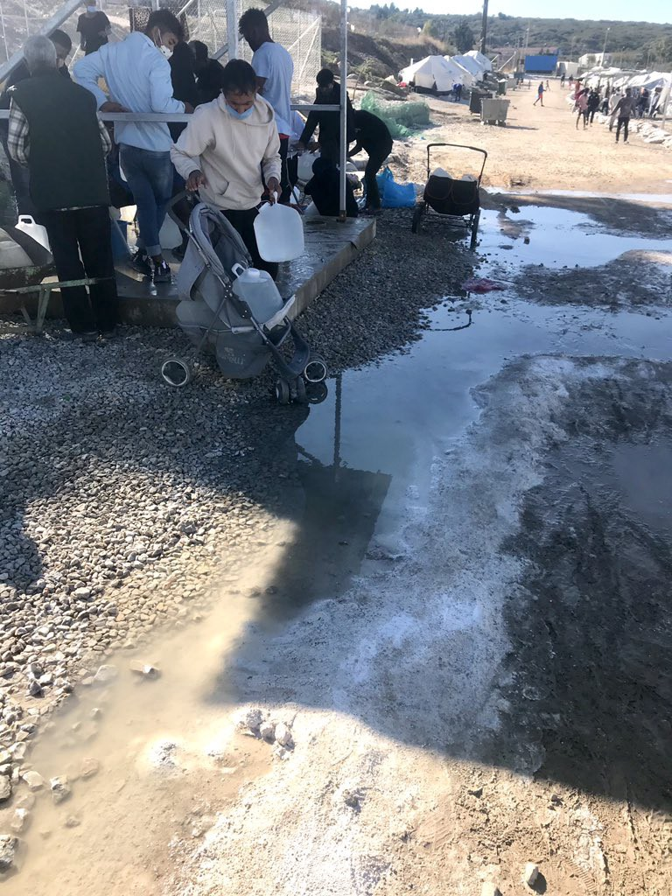
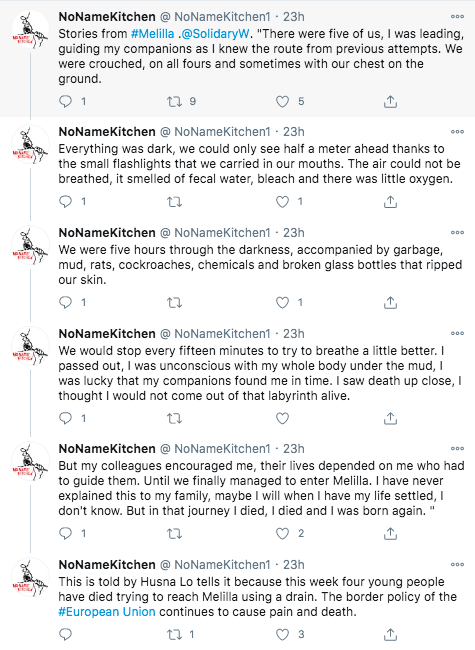
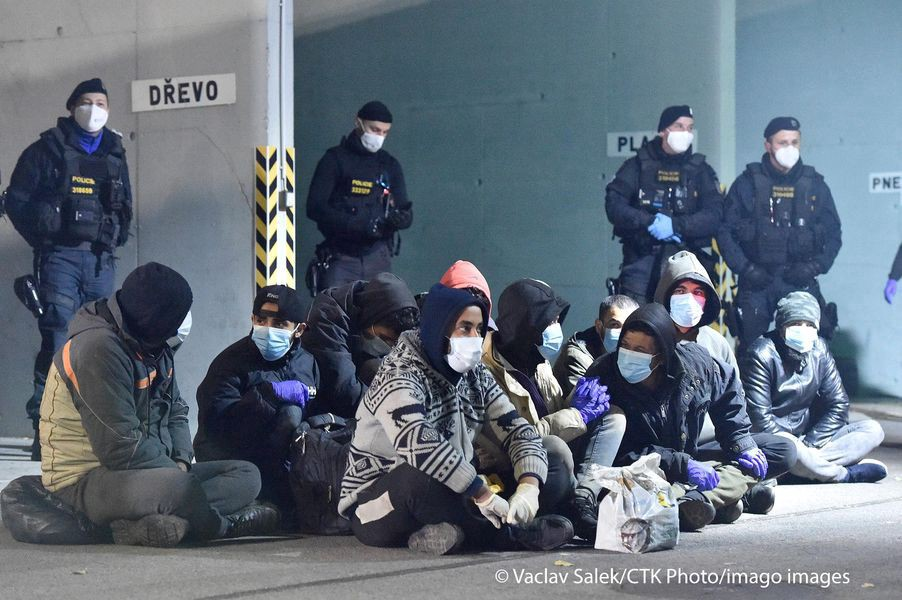

### AYS Weekend Digest 7–8/11/2020: No rights and no criteria for Tunisian people in Italy

AYS comments on US Presidential election // Shipwreck off Samos: 1 boy dies // Deportations from Cape Town, South Africa // Updates from Greece, Spain, Serbia, Sweden, UK…

Moria 2\.0, November 2020 \(Photo by [moria2refugees](https://twitter.com/moria2_gr/status/1325536903291150338/photo/4) \)
### Featured — Italy: No rights and no criteria for Tunisian people in Italy

Throughout the summer, Italian media and authorities pointed to Tunisian people arriving on Italian shores as public enemy number one\. Over 11,000 people have arrived in Italy from the North African country since the beginning of 2020, and Italy is set to consider each of them a danger and an ‘economic migrant’, refusing to consider any asylum claim coming from Tunisian citizens\.

“In Lampedusa hotspot, a pre\-identification is carried out through the so\-called ‘foglio notizie’ \[…\] They sign it without knowing what it is, without receiving information about their right to claim asylum, and they end up being automatically considered economic migrants” \( [Sami Aidoudi, cultural mediator, to Il Manifesto](https://ilmanifesto.it/navi-quarantena-per-i-tunisini-sono-lanticamera-dei-rimpatri/) \) \.

Over the last months, we have [reported](ays-weekend-digest-10-11-10-2020-save-pikpa-b781be2ba943) on the conditions on the quarantine ships, the lack of rules and criteria over who is sent to such ships and for how long\. At the same time, Italian authorities have been pressuring their Tunisian counterparts to update the bilateral deal on deportations, which was done in August\. The contents of the deal are secret, but the number of deportations were doubled from 40 to 80 people per week\.

Following recent attacks in France and Austria, Tunisian people have become the centre of attention for European officials, and are now all considered possible terrorists\. France has demanded that Tunisian authorities improve control over their borders and Italy has pledged to deploy “ships and aeroplanes to alert Tunisia to the departure of clandestine boats ferrying migrants north to Italian shores”, media [report](https://www.aljazeera.com/news/2020/11/6/italy-ships-planes-migrant-boat-alert) \. The same ships and planes that refuse to respond to distress calls in the central Med on a daily basis\. As usual, everything that European countries should, but are not willing, to do to save lives at sea is done to stop people from reaching Europe\.

As of now, this is only a proposal, part of an “operational plan” that Italian authorities will submit to Tunisia on “strengthening cooperation against human trafficking and undocumented migration”\.

Activist group [LasciateCIEntrare](https://www.lasciatecientrare.it/migranti-senza-diritti-manganellati-e-rimpatriati-a-forza) published the odyssey of twenty Tunisian people, who after arriving in Lampedusa were left at the mercy of a system which has no clear rules, is built exclusively to expedite their deportation and is designed to stop them from claiming any of their rights\.

> _On Tuesday 3 November, twenty Tunisian citizens were on the GNV ship in the port of Palermo\. At the end of the quarantine period, which lasted 8 days \(it should be understood because in other cases the quarantines lasted up to 50 days\), they were given a rejection paper, stating “they did not apply for asylum”, yet no one of them received any information relating to their right to asylum and therefore no one was able to apply\. After the quarantine they were immediately transferred to CPR Corelli in Milan\. We point out that with the same paper, as a “practice”, some are freed, others repatriated without passing through the CPR, and we repeat once again: without any criteria\._ 

> _The twenty Tunisian people, should have had a right to meet with a lawyer and a translator, to be informed on what was written on the paper they received, also to be informed that they could have appealed the rejection\._ 

> _But this is not how it went\. Once in the CPR, they met a judge but could not claim any of their rights\. In the 3 days they spent in the CPR, they were not able to communicate with anyone, because their personal phones had been taken away\._ 

> _As a form of protest, some of them ingested pieces of metal and got very sick: no one received any medical care for two days\. On the third day, they have been beaten up by the CPR guards and deported to Tunisia\. A mass refoulement, illegal according to national and international laws, which are evidently pointless in the face of the agreements between Italy and Tunisia\._ 

> _They were looking for a better life, they received a tour of horrors\. Because this is Europe: a big golden concentration camp\._ 

SOUTH AFRICA
### Deportations from Cape Town

20 people who took part in the sit in protest outside the UNHCR office in Cape Town, which began in October 2019, [are to be deported](https://www.thesouthafrican.com/news/south-africa-begins-deporting-mostly-african-migrants/?fbclid=IwAR09axAOyy2JwX8mMKsDoDmaVAe8B9BqHg9t8Ph8iNovG-7_p_LHazWN_Xs) and have been transferred to Lindela Repatriation Centre\. The protests were against the [xenophobic violence](https://www.thesouthafrican.com/news/immigrant-shop-owners-durban-attacks/) and attacks experienced by many foreign nationals from different African countries and of various legal statuses\.

SEA
### Returned to Libya after 3 days at sea

Alarm Phone was alerted on Saturday to a boat in distress carrying 100 people off Al Khums\. They had already been at sea for more than 30 hours\. Only on Sunday night was it confirmed that Libyan authorities had returned the overcrowded boat to Tripoli\.

GREECE
### Shipwreck off Samos: 1 boy dead, 6 missing

On Saturday night one boat capsized in unclear circumstances off the north eastern coast of Samos island, by Cape Praso, Aegean Boat Report [states](https://web.facebook.com/AegeanBoatReport/posts/964755564047548) \.

Island authorities have confirmed on Sunday that the body of one child was recovered, one woman was rescued but was unconscious and other 16 people had made it to shore autonomously\. 6 people are still missing, as the boat was carrying 24 people\.

[According to ABR](https://web.facebook.com/AegeanBoatReport/posts/964755564047548) :

> _In the official statement from the Port Police it states that they where alerted in the early hours of Sunday, and in some Greek newspapers they even say in the early morning\. This is not correct, port police on Samos was alerted at midnight, they received the call 00\.05, and their call log can verify that this is in fact correct\. Why they don’t put an exact time in their report is some how strange, why write in “the early hours”, when they where alerted at midnight? This might be explained when we know they didn’t respond to the emergency call when they received it, they didn’t send out a boat when they received information that refugees was drowning\._ 

> _\[…\] **The distance from Vathy to the location on Cape Praso is 8,6 nautical miles, it would take the Lambro\-57 patrol boat, who can do 45 knots, approximately 12 minutes in perfect waters conditions\. So why, after two hours, had no rescue boat arrived on location?** This should be investigated, these questions should have been asked by the Greek press, but nobody seems to care, they only repeat the official statements from the Hellenic Coast Guard, have they lost the ability to think for themselves, investigative journalism is a rare experience in the Greek press these days\. \._ 

> _If this had been a boat filled with tourists, Europeans, would it take hours before rescue had arrived, I really don’t think so\. \._ 

### Greece in Lockdown

As of Saturday, Greek authorities have imposed a new nation\-wide lockdown until the end of November\.

Only students of kindergartens, primary and special schools will continue going to the schools\. As reported by [Refugee\.Info](https://web.facebook.com/refugee.info?_rdc=1&_rdr) , students under 18 years old:
- must be accompanied to and from school by ONE parent \(or guardian\)
- send an SMS — Option 4
- hold a certificate from the school with the name of the student, the home address and the time of arrival and departure\.

High schools will be closed, and they will operate via E\-Learning platforms\.

According to [official sources](https://web.facebook.com/migrationgovgr.info?_rdc=1&_rdr) from the migration ministry, the programmed interviews and Skype registrations will take place according to schedule\.

For any other business, Asylum offices will be open but only for appointments\. To book an appointment \-> [applications\.migration\.gov\.gr](http://applications.migration.gov.gr/) \.
Cases of vulnerable applicants and family reunification cases will be prioritised\. Applicants who wish to file an appeal will be served without the need to book an appointment\. Everybody must wear a mask when visiting the Service and keep the safe distance of 1\.5 meters from other persons\.

**Check Refugee\.Info [facebook page](https://web.facebook.com/refugee.info?_rdc=1&_rdr) and [website](https://www.refugee.info/selectors) for updates in English, French, Arabic, Farsi, Urdu, Somali and Lingala\.**
### Updates from Lesvos

As we reported previously, on Thursday ‘residents’ in Moria 2\.0, Lesvos, were given new stricter rules:
- Exit & entrance to camp allowed only from main gate\. 8am\-8pm \(Mon\-Fri\), 8am\-3pm \(Sat\) \.
- Use of mask indoors & outdoors, inside camp & outside
- No use of heaters or fire inside/outside tents

People have [reportedly](https://twitter.com/moria2_gr/status/1325539290122694656) already been fined within the camp for not wearing a mask\. In a place where social distancing is impossible, and where people are given a bucket for a shower, it is a bad joke to fine people 150€ when they receive 90€ per month as financial support\.
### [Log into Facebook \| Facebook](https://web.facebook.com/watch/?v=385934389426913)
### [Log into Facebook to start sharing and connecting with your friends, family, and people you know\.](https://web.facebook.com/watch/?v=385934389426913)
#### [web\.facebook\.com](https://web.facebook.com/watch/?v=385934389426913)

No Border Kitchen Lesvos published the first of a series of articles on the situation on the island\.

> _As we not only want to keep the memory alive but also criticize the actions of the police, military and other actors, we don’t want to depict the fire in Moria as a singular, spontaneous event but as a predictable incident on which unaltered actions followed\. For us, the situation on Lesvos in September is part of a continuous history of migration policies and oppression that we need to think of when trying to develop possibilities of change\._ 

> [Lesvos in September 2020 — A retrospect](https://web.facebook.com/NBKLesvos/posts/1897230467083400) \. Read it\!
### Updates from Athens

[Khora](https://web.facebook.com/KhoraAthens/posts/1614013795437889) Social Kitchen will continue to operate their food take\-away service\. Food will be available from Monday to Friday from 1PM at [Kastalias 13, 11363, Kipseli](https://goo.gl/maps/iVdZcQLyqHYBfzGF8) , Athens\.

[KAST — Khora Asylum Support Team](https://web.facebook.com/KASTathens/?__cft__[0]=AZWL7doqgIQ5c-6mFzZFSxKdlCvt-x5NaJCEnuPi7sC0svbCtjWrNi7E10SVWN5srnfWOEeJIsvuCEYSC5UIrKbKYX0ypU9PyiaO_k0278YI24XfypyCLYCFP3o_vpReHo2opbNS6YYcPTi8_fp_Xxtk&__tn__=kK-R) will be working remotely with phone assessments only: send your inquiry including your name, last name, date of birth, and a photo of your white card \(if you have one\) on WhatsApp if you need support with information about different services in Athens, your white card, your asylum claim, or the online services of the Asylum Offices, medical appointments\. These are the numbers:
Arabic: \+30 6944318965
Farsi: \+30 6944318576
French: \+30 6944983861
Bangla/ Urdu/ English: \+30 6953025095

The [Khora Free Shop](https://web.facebook.com/khorafreeshop/?__cft__[0]=AZWL7doqgIQ5c-6mFzZFSxKdlCvt-x5NaJCEnuPi7sC0svbCtjWrNi7E10SVWN5srnfWOEeJIsvuCEYSC5UIrKbKYX0ypU9PyiaO_k0278YI24XfypyCLYCFP3o_vpReHo2opbNS6YYcPTi8_fp_Xxtk&__tn__=kK-R) and [The Beehive Athens](https://web.facebook.com/thebeehive.athens/?__cft__[0]=AZWL7doqgIQ5c-6mFzZFSxKdlCvt-x5NaJCEnuPi7sC0svbCtjWrNi7E10SVWN5srnfWOEeJIsvuCEYSC5UIrKbKYX0ypU9PyiaO_k0278YI24XfypyCLYCFP3o_vpReHo2opbNS6YYcPTi8_fp_Xxtk&__tn__=kK-R) will both be closed for the whole period of the lockdown\.

Khora Social Kitchen has also started a fundraising campaign and is publishing a series of videos on the situation in Athens\. Check them out [HERE](https://web.facebook.com/KhoraAthens/posts/1614330952072840) and support them [HERE](https://khorakitchen.org/) \.

[Ο Αλλος Ανθρωπος — The Other Person Social Kitchen](https://web.facebook.com/%CE%9F-%CE%91%CE%BB%CE%BB%CE%BF%CF%82-%CE%91%CE%BD%CE%B8%CF%81%CF%89%CF%80%CE%BF%CF%82-%CE%9A%CE%BF%CE%B9%CE%BD%CF%89%CE%BD%CE%B9%CE%BA%CE%B7-%CE%9A%CE%BF%CF%85%CE%B6%CE%B9%CE%BD%CE%B1-%CE%94%CF%89%CF%81%CE%B5%CE%B1%CE%BD-%CE%A6%CE%B1%CE%B3%CE%B7%CF%84%CE%BF-%CE%93%CE%B9%CE%B1-%CE%9F%CE%BB%CE%BF%CF%85%CF%82-628150187199571?_rdc=1&_rdr) is cooking and distributing warm meals every day, 7 days a week at [Megalou Alexandrou 122, 10435, Keramikos](https://goo.gl/maps/Tgkuywuw5wjhgCsV9) , Athens\.

They are also looking for donations, check it out [HERE](https://web.facebook.com/permalink.php?story_fbid=3958315657516324&id=628150187199571) \.

Until December 2nd, [Goodwill Caravan](https://web.facebook.com/goodwillcaravan) Legal service will remain open, but will not accept walk\-ins\. All appointments must be booked online\. To book an appointment with a lawyer, please email reception@goodwillcaravan\.com Address : [GWC Sallam Centre, Knidou 10, 10440, Attiki, Athens](https://goo.gl/maps/eFmrv7qqLRQEH6NW8)

Baby essentials and clothes distribution will remain open two times a week Tuesdays & Wednesday 8am \-12 noon with strict measures in place\. There will be a set number of tickets\. Address: [Psaron 68, 10439, Athens \(behind Hotel Balasca\)](https://goo.gl/maps/RSMoPUUyrfyGRLy1A) \.

Shelter referrals & registrations to waiting lists remain open with limited availability\. E\-mail: reception@goodwillcaravan\.com and please CC admin@goodwillcaravan\.com

English & Greek onsite classes will close for 3 weeks during the lockdown period\.

Check their [Facebook page](https://web.facebook.com/goodwillcaravan) for info in different languages\.
### Letter from Ritsona

Parwana Amiri, author of the series of Letters to the world from Moria and Ritsona, where she is living now, published the story of a woman who got separated from her disabled husband because one Greek asylum officer decided not to consider her marriage certificate valid\. Read it [HERE](http://birdsofimmigrants.jogspace.net/2020/11/07/letters-to-the-wrold-from-ritsona-no-14/?fbclid=IwAR2l6rM4D96JStrni2ERLqk2TjOwRHSC4dmvIjWXnNyAv5I-qi2AF2XncNk) \.

ITALY
### Covid\-19 in Italy: Information in 50 languages

Il Grande Colibrì is keeping up to date its resource page on covid\-19 in Italy\. Check it out [HERE](https://www.ilgrandecolibri.com/en/coronavirus-in-italy-videos-and-information-for-migrants/) \.

SPAIN
### Arrivals and updates from Canary islands route

Media sources [report](https://www.bbc.com/news/world-europe-54864968?fbclid=IwAR0C6hlCYDKBuVipQJnnW_jT8QB1GIPyDQ53iSMShcVaiE5LUJprblPjU5Y) that over the weekend 1,600 people arrived on the Canary Islands shores, on around 38 boats\. 1,000 people arrived on Saturday\.

Some 1,477 people who have arrived by boat in recent weeks remain in the migrant camp at Arguineguín Pier in Gran Canaria, according to Red Cross sources [cited](https://www.europapress.es/islas-canarias/noticia-alrededor-1500-migrantes-llegados-patera-permanecen-campamento-muelle-arguineguin-gran-canaria-20201108115445.html) by Spanish media\. Spanish interior minister Grande\-Marlaska and EU Commissioner for the Interior Johansson visited the camp on Friday and “announced that the government would proceed to close the camp in the coming weeks”\. Around 1,500 migrants arrived by boat remain in the Muelle de Arguineguín camp \(Gran Canaria\)

The Spanish minister added that “work is currently being carried out to enable the necessary infrastructures so that migrants can spend the first 72 hours of police review on the military grounds of the old Barranco Seco powder magazine” on the island\.

While arrivals are so high, the government has cut funding for search and rescue, which caused a reduction in resources and rescuers\. Read [this thread](https://twitter.com/amores_g/status/1325526492646879234) about the situation \(in Spanish\) \. Also, as we reported previously this week, negotiations are in place with Frontex to define details and limits of further cooperation with Spanish, Senegalese and Mauritanian authorities in order to reduce the number of arrivals\. Read more [HERE](https://elpais.com/espana/2020-11-06/espana-y-frontex-negocian-una-operacion-para-cerrar-la-ruta-migratoria-canaria.html) \(in Spanish\) \.
### Updates from Melilla

As we reported on Friday, 4 people died in a sewage pipe trying to access the Spanish enclave of Melilla from Morocco\. [No Name Kitchen and Solidary Wheels](https://twitter.com/NoNameKitchen1/status/1325387542338867200) published a story from Husna, who survived the same route\.

SERBIA
### Continued criminalisation of solidarity in Šid

[No Name Kitchen held a solidarity event](https://web.facebook.com/events/1636765149834254/) this weekend in Šid to bring volunteers, people on the move and members of the local community together\. Unfortunately, [the police tried to shut it down](https://web.facebook.com/No-Name-Kitchen-%C5%A0id-128001229108411) \.

Some citizens of the area also [organised a demonstration against](http://rs.n1info.com/Vesti/a669148/Najavljen-protest-protiv-migranata-u-Sidu-i-NVO-koja-im-pomaze.html?fbclid=IwAR01-Z8dZlcKPPbL0mwm7_bUlrDH21RxET9CWzOfuW4tlXM0hmCCR4n_L70) people on the move and No Name Kitchen, which the local mayor has accused of being “a foreign element aimed at destabilising Serbia’s legal order\.” A statement so ridiculous that we will not comment on it further\.

We stand in solidarity with No Name Kitchen\.

The continued attacks on solidarity initiatives and the criminalisation of their activities must stop\.

CZECH REPUBLIC
### 48 people found travelling hidden in a truck

\(Photo Credit: Imago Images\)

[Infomigrants report](https://web.facebook.com/InfoMigrants/posts/3271040279684401) that the 48 people say they are from Syria\. It is not known if they will seek asylum in the Czech Republic or be pushed back to the country they entered from\.

It is their legal right to claim asylum in the Czech Republic\.

SWEDEN
### MPs call for deportation to be halted

[Shamiram](https://www.svt.se/nyheter/lokalt/orebro/16-ariga-shamiram-ska-utvisas-efter-fem-ar-i-sverige) , a high school student in her first year, is due to be deported to Egypt on the 10th of November\. Her class mates have gathered [over 30,000 signatures](https://www.svt.se/nyheter/lokalt/orebro/gymnasieklassen-startade-namninsamling-mot-utvisningsbeslut) in support of both her and her family staying in Sweden\.

> _She has about 5 Days \( 2020–10–11 \) before she needs to exit the country and go back to Egypt, a foreign country that she’s only lived in for a short period \(her mom is born in Egypt and that is the reason as to why she is being sent there\) \. She was born in Syria and she emigrated from Syria to Egypt and then to Sweden\. She was 10–11 years old when she arrived in Sweden\._ 

> _Her dad is dead and is buried here in Sweden and she is only 15 soon to be 16 she has just started gymnasiet \(Swedish version of US 10th grade \(sophomore\) \)_ 

[Local MPs](https://www.svt.se/nyheter/lokalt/orebro/politiker-vill-stoppa-orebrofamiljens-utvisning-for-javligt) have also appealed against the decision\.

Sign the petition [HERE\!](https://www.change.org/p/the-swedish-government-help-our-friend-and-her-family-to-stay-in-sweden)

UNITED STATES

While the US is usually outside of our focus, AYS would like to make a special comment on the result of the recent US Presidential Election\. We are relieved that Trump was removed from office\. As a fear mongering, right wing extremist, Trump was a threat not just to human rights in the US but across the globe\. Not only did he do little to protect refugees, his administration is responsible for higher levels of displacement\. An example being his foreign policy with Turkey, which directly led to more Kurdish displacement on the Syrian border\. The world will undoubtedly be a bit safer without him at the helm of US foreign and domestic policy\.

That said, we understand a Biden Presidency will be far from perfect\. Yet there will be some major advantages to a Biden Presidency compared to Trump\. The most useful being that the organisational space for refugee advocacy in the US will expand and there will be more avenues for advancing human rights policies\. This space was severely berated under Trump and the constant attacks on immigrant families and Dreamers, made getting anything done a hundred times harder\. The next advantage is that refugee admissions will increase\. Trump decreased the annual admissions to only 18,000 for the fiscal year of 2020, whereas the last year of Obama’s presidency saw 110,000 admissions\. Biden has said he’s committed to reaching a 125,000 admissions target for his first year in office\. Hopefully that number will only grow\. Another advantage is that Biden is planning on making a task force to help the 545 children who were displaced from their parents by the Trump administration\. This cannot happen soon enough\.

Unfortunately, Biden will have to do a lot just to mitigate and fix the atrocities the Trump administration committed against asylum seekers\. Refugee advocates are going to have to pressure the Biden administration to go even further in fixing the broken American asylum system\. But there is hope now and for that we are thankful\.

AYS will always stand in solidarity with our American counterparts\.

GENERAL
### InfoMigrants Survey

> _We need your help\! The University of Maastricht, which is in charge of evaluating InfoMigrants, would like to know what you think about our platform\! The survey only takes a few minutes and is anonymous\. It’s available in English, Arabic, French, Dari and Pashto\._ 

You can take part in the survey [HERE](https://maastrichtuniversity.eu.qualtrics.com/jfe/form/SV_2t4QjEXzmIH6q6p?fbclid=IwAR01g5myAiky4GqN7oz8Yauw-kFwjx05lZI3xTs4vZCOsCVWZoPM6Kj9uGM) \.

WORTH READING

[News from Syrian refugees in an isolated Kurdistan Region camp](https://www.rudaw.net/english/kurdistan/061120201?fbclid=IwAR3L1de8pIUx6G8lc34ybUyxMkObutFCbwkC5jpxCAAQhrq-qSSeR0efUkE) who are struggling to find work and support their families as services are reduced due to COVID\-19\.

An update on the COVID\-19 situation in Ethiopia and UNHCR’s response can be found [HERE](https://reliefweb.int/sites/reliefweb.int/files/resources/UNHCR%20ETHIOPIA%20COVID%20and%20Operational%20Update%2006%20November%202020.pdf) \.

A new book, [_Can You Run Away from Sorrow?_](https://iupress.org/9780253050069/can-you-run-away-from-sorrow/?fbclid=IwAR3lhRILww6nVJMts-hCtcu0AK0YBqwvXdOJqdpWQht9kUyK0DhPF1K4VfI) _,_ by [Ivana Bajic\-Hajdukovic](https://iupress.org/author/ivana-bajic-hajdukovic) asks how emigration affects those left behind? “The fall of Yugoslavia in the 1990s led citizens to look for a better, more stable life elsewhere\. For the older generations, however, this wasn’t an option\.”

[Coming of age in Exile](https://cage.ku.dk/research/) is a Nordic research group who have published a variety of reports on socio\-economic and health inequities that develop during the formative years in young refugees lives, and how they relate to each other and to key areas of welfare policy like health services, education, employment and housing\.

Right\-wing populism and anti\-migration politics in Europe were discussed in the third episode of “ [On the Move](https://www.youtube.com/watch?v=VwEkUzYOtZc&feature=youtu.be) ”, Begüm Başdaş’s guest was British journalist Daniel Trilling\.

Some more [excellent local coverage from KentLive](https://www.kentlive.news/news/kent-news/what-safe-legal-routes-refugees-4673242?fbclid=IwAR3CGZCZV_kpa-WzEELG1ANIwrk8_vGr_LCH3qVpOiO5ZkQjyU_eNO03dO0) regarding what ‘safe and legal routes’ are and why it is not illegal to travel to the UK to claim asylum\.

A list of films and documentaries about migration can be seen [HERE](https://www.theguardian.com/film/2020/nov/07/streaming-films-about-refugee-crisis-love-child?fbclid=IwAR3CGZCZV_kpa-WzEELG1ANIwrk8_vGr_LCH3qVpOiO5ZkQjyU_eNO03dO0) \.

EVENTS

On [Thursday November 12th](https://web.facebook.com/events/389549098837259/?acontext=%7B%22ref%22%3A%2252%22%2C%22action_history%22%3A%22[%7B%5C%22surface%5C%22%3A%5C%22share_link%5C%22%2C%5C%22mechanism%5C%22%3A%5C%22share_link%5C%22%2C%5C%22extra_data%5C%22%3A%7B%5C%22invite_link_id%5C%22%3A362400081508040%7D%7D]%22%7D) there is a manifestation in Copenhagen, Denmark in support of the children stuck in terrible conditions on Lesvos\.

**Find daily updates and special reports on our [Medium page](https://medium.com/are-you-syrious) \.**

**If you wish to contribute, either by writing a report or a story, or by joining the info gathering team, please let us know\.**

**We strive to echo correct news from the ground through collaboration and fairness\. Every effort has been made to credit organisations and individuals with regard to the supply of information, video, and photo material \(in cases where the source wanted to be accredited\) \. Please notify us regarding corrections\.**

**If there’s anything you want to share or comment, contact us through Facebook, Twitter or write to: areyousyrious@gmail\.com**

_Converted [Medium Post](https://medium.com/are-you-syrious/ays-weekend-digest-7-8-11-2020-no-rights-and-no-criteria-for-tunisian-people-in-italy-e6c605974eeb) by [ZMediumToMarkdown](https://github.com/ZhgChgLi/ZMediumToMarkdown)._
