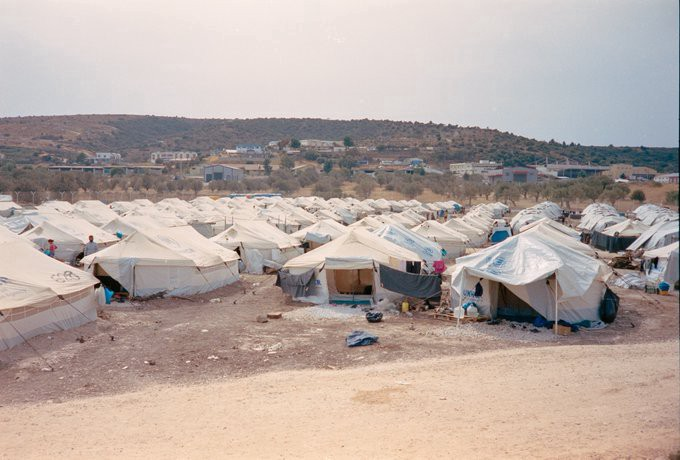

### AYS Daily Digest 09/11/20 Greek authorities arrest father of 6\-year\-old who drowned

[Are You Syrious?](?source=post_page-----35a089d01604--------------------------------)

[Nov 10](ays-daily-digest-09-11-20-greek-authorities-arrest-father-of-6-year-old-who-drowned-35a089d01604?source=post_page-----35a089d01604--------------------------------) · 9 min read

_Over 2000 people in Canary Islands // Greece wants to change asylum law // updates on fascism in Serbia // lawsuit from Calais // and more…_

### FEATURE: Greek authorities arrest father of 6\-year\-old who drowned off the coast of Samos

On Sunday night, a boat carrying 27 people was in distress off the coast of Samos\. [Choose Love](https://helprefugees.org/news/samos-tragedy/?fbclid=IwAR1aGEOsTICwp9lyjkppRYXRFdc5vUZiLdovmNhGERF_2bGjWb7XikjlMsk) says that we do not have the details of what exactly happened, but tragically a six\-year\-old ended up losing his life and six [people](https://www.facebook.com/samosvolunteers/posts/1756832707828215) \(including two pregnant women\) are still missing\. While the survivors were taken to the camp on Samos to quarantine, the father of the boy was arrested along with the driver of the boat\. The father was taken in for “suspicion of endangering a life” and if convicted, he could face up to 10 years in prison\. CEO of Help Refugees/Choose Love, Josie Naughton said:

> _“These charges are a direct attack on the right to seek asylum\. It is outrageous that a grieving father is being punished for seeking safety for him and his child\. Criminalising people who are seeking safety and protection shows the failure of the European Union to find a solution to unsafe migration routes that forced thousands to risk their lives to seek protection\.”_ 

Arresting traumatized parents who have just lost their children is not the answer and cannot be accepted\. This is a vey cruel decision for the Greek authorities to make\. This cannot be a new norm\.
### IRAQ

Press release from the Norwegian Refugee Council \(read in full [here](https://www.nrc.no/news/2020/november/iraqs-camp-closures-leave-100000-people-in-limbo/?fbclid=IwAR2dHEUUkpzds20olMxYzLn7bjftzIIKf4qq0DBphN9laLZHnODAPfnYvbw) \):

> _“ **The ongoing rapid closure of displacement camps in Iraq is rendering homeless more than 100,000 people in the middle of the COVID\-19 pandemic and at the onset of winter** \. The Norwegian Refugee Council is extremely concerned about the fate of thousands of displaced families living in camps across the country that are being closed down rapidly, including NRC\-managed Hammam Al Alil Camp\._ 

> _People in camps in Baghdad, Kerbala, Divala, Suleimaniya, Anbar, Kirkuk and Ninewa are being forced out with little notice, and are expected to return to their areas of origin\. Many come from neighbourhoods that are still totally destroyed and they also risk being blocked at checkpoints, or even arrested, because of lack of security clearance and perceived affiliation with armed groups\.”_ 

### SEA

[IOM](https://twitter.com/IOM_Libya/status/1325836602405425156) also reports that from November 3rd to 9th, 958 people were returned to Libya from the sea\. Libya is not safe\. Period\.

[Sea\-Watch Italy](https://twitter.com/SeaWatchItaly/status/1325747964036472832) released a comment on the statements of Minister Lamorgese on Sunday:

> _“The statements of Minister Lamorgese yesterday, compared to the stops of NGO ships, are unacceptable\. The government criminalizes the operation of our ships after for years the Coat Guard encouraged them to work by whatever means to save lives\. They hypocritically criticize us for not being able to transport all the people we rescue\. But we are forced to do so by the omissions of the authorities and their complicity in illegal push\-backs\. The government stopped six NGO ships without providing alternatives to their presence\._ 

> _This abuse of the resources available to the administration has resulted in deaths and tragedies\. In one of the latest cases, five people drowned while Sea Watch 4 received a report which it could not respond to due to the arrest\. The authorities didn’t do it either\. For these deaths and for the lives we can save, we have filed an appeal against the spurious provision that hit us\. We are not going to give up\. The criminalization of sea rescue that this government continues to promote will not prevail\.”_ 

### Missing Persons in the Comoros Archipelago

Not our usual focus, but this reporting from La Cimade is important to share:

> _“La Cimade and its partners are publishing an information guide to support people looking for a loved one who died or disappeared at sea in the Comoros archipelago\. This guide is presented today jointly to Mamoudzou and Moroni\. In the Mediterranean, shipwrecks and drownings of people in exile are regularly covered in the media, but these tragedies also occur in other migratory regions, in particular in the Sahara \(Niger\) and in the Indian Ocean\._ 

> _The Comoros archipelago has long been considered the largest “marine cemetery” before tragedies follow one another in the Mediterranean, with an estimate by the French Senate \(2012\) of 7 to 10,000 people dead or missing since 1995\. If since then 2015, the incidents of kwassa\-kwassa seem to have been less numerous than in the past, 2020 shows a worrying increase in the number of deaths and disappearances at sea\. The last shipwreck on September 24 killed ten people, including a seven\-year\-old child\. This umpteenth drama is added to the others, which occurred in an intolerable indifference\.”_ 

### GREECE

It should also be noted that Moria Corona Awareness Team is continuing to do the hard work\. They pass out masks every day and are teaching children how to wear them\. Please continue to keep up with them [here](https://www.facebook.com/MoriaCoronaAwarenessTeam/posts/191610599134785) \.

Member of the EU Parliament [Tineke Strik](https://twitter.com/Tineke_Strik/status/1325817986951819264) said on Monday that they:

> _“finally received a response from the Greek government to our letter on the shootings at the Greek\-Turkish border in March\. Again: blunt denials without offering any counter evidence\. We need an independent and transparent investigation and the EU Commission has to start acting on systematic violations of EU law\. This impunity can no longer persist\.”_ 

### Greece wants to change asylum law…

…so more people can can be returned to Turkey under the “safe country” rule\. If this passed, the decision would be the third amendment to asylum law in the past 12 months\. Greek Migration Minister Notis Mitaraki told Info Migrants “ _Many people have come through safe countries of transit where they were very safe before coming to Greece\. We’re actually reviewing our legislation whether we should be providing asylum to people who come through countries where they’re very safe\. If somebody comes from the East and he comes to Turkey and he’s not at risk in Turkey, then he should not be applying to Greece for asylum_ \.” This would include Syrians, which it didn’t previously\. More [here](https://www.infomigrants.net/en/post/28386/greece-plans-to-increase-safe-country-returns-reduce-benefits-for-refugees?fbclid=IwAR1eyUGRnPUGzW4z0i6MjiNhW9WTGsQkm9HbtOG6KKucqZwvHpIjbUz2Enk) \.

### ITALY

The New Humanitarian just released journalist Sara Creta’s new report entitled **“Italy’s use of ferries to quarantine migrants comes under fire\.”** Creta explains:

> _“Outrage is growing among human rights advocates at the use of commercial ferries by Italian authorities to quarantine asylum seekers and migrants due to COVID\-19 — not just new arrivals, but also people from reception centres inland who have been in Italy for years\._ 

> _The initial policy began in April, but civil society organisations and lawyers argue that legitimate public health concerns are now being used as an excuse to detain people in poor conditions on the ferries and to restrict access to asylum, setting a dangerous precedent\. A slew of troubling incidents, including several recent deaths and reports of attempted self\-harm, have added to the sense of alarm\._ 

> _‘The use of quarantine ships for those migrants who arrived by sea raises a number of human rights concerns,’ Dunja Mijatović, human rights commissioner at the Council of Europe, told The New Humanitarian\. ‘Vulnerable people, including children and those with underlying medical conditions, must be promptly identified and evacuated on land; everyone must have prompt access to adequate healthcare and to information on their rights and be able to apply for asylum\.’”_ 

Read in full [here](https://www.thenewhumanitarian.org/news-feature/2020/11/9/italy-migration-ferries-coronavirus-quarantine-health-asylum?utm_campaign=social&utm_medium=social&utm_source=LinkedIn&fbclid=IwAR1iHcwLnB8V-6oxybBC0h9hU1c0ud4vT_5Y4PGDqggsz_hQ7oJhfAbL7zI) \.
### SPAIN

Europa Press adds that “ _Some 1,800 migrants spent the night in Arguineguín after a record weekend with more than 2,000 throughout the Canary Islands\. In 2018 the figure was 1,266 people, growing in 2019 to approximately 2,200 to reach the 11,500 who have arrived so far in 2020, to which should be added the more than 2,029 who have arrived only for this purpose of week\. For their part, the data provided by Salvamento Marítimo, Cruz Roja and 112 Canarias, also show that to these more than two thousand migrants arrived in two days should be added another 177 people who were rescued from 00:00 today and during the early hours and early in the morning aboard seven boats\._ ” More [here](https://www.europapress.es/islas-canarias/noticia-1800-migrantes-pernoctan-arguineguin-fin-semana-record-mas-2000-toda-canarias-20201109100838.html?fbclid=IwAR2SfDjsiZybxZsSAkFOmb7WZzb9UwBKIh9cx9ABiJla1CitH7MLNoTTzNY) \.

On Monday, other rescues in Spain included:
- [22 people](https://www.europapress.es/islas-canarias/noticia-rescatan-patera-22-inmigrantes-44-millas-sureste-fuerteventura-20201109181044.html?fbclid=IwAR2lXjQhPrB9tinnIyS34WZgkbqyZvsbWbFppdvG-DaTkPUbergvy-ulBd8) were rescued 44 miles off Fuerteventura
- [28 people](https://www.europapress.es/islas-canarias/noticia-rescatan-patera-28-migrantes-cuando-encontraba-cerca-gran-canaria-20201109170632.html?fbclid=IwAR32_uAB7SLiM0coudrmMv5GihQh_JS7f5ARtNx35rVcnC_bHSqrOlx75j4) were rescued off a boat near Gran Canaria

### BOSNIA AND HEREZEGOVINA

### SERBIA

[An update](http://www.hannahparry.co.uk/hannahthetraveller/fascists-in-sid-tensions-in-serbia?fbclid=IwAR39t8CgzToKuY08THBAqnCcNf_REydi7xXKDpATiC47sIAOvWXmlHuBdCk) on the fascists in Šid:

> _“A fascist youth group called “Omladina Shida” \(Youth of Šid\), has recently called for the removal of NNK volunteers from Šid as well the removal of migrants from the municipality\. As reported in the Serbian publication Danas, the youth group organised a protest which took place on Sunday 1st November 2020 where they called for the military to be returned to the area\. When I was there in June and July, the military were stationed outside each of the camps supposedly to help with coronavirus measures, although in reality it had more do with the imminent election\. The youth group referred to this, saying:_ 

> _‘The President of the Republic sent the army only as a pre\-election marketing trick to collect our votes and to guard those reception centers because the police do not have the capacity to do that\.’_ 

> _They also demand that people not be allowed to return after being deported from Croatia or Hungary — citing fears over the increased coronavirus numbers in both of those countries as the reason for this\.”_ 

### FRANCE

### 11 migrants and 8 associations from Calais proceed against the Pas\-de\-Calais prefecture in court

They claim the eviction of 800 people on September 29th was illegal\. They argue “The prefect of Pas de Calais invokes ‘flagrance’ as a legal basis for this expulsion\. However, this procedure \(…\) in no way authorizes the expulsion of people deemed ‘undesirable\.’” The hearing is scheduled for November 18th\. More [here](https://www.infomigrants.net/fr/post/28342/calais-11-migrants-et-8-associations-assignent-le-prefet-du-pas-de-calais-devant-la-justice?preview=1604913297988&fbclid=IwAR1e8073dEh9GVrfZxq-Dyto_2KXIE-gNxpncfYi7HihiZxiJs-YhiskJBA) \.

### EU

A lot of information has come out recently concerning Frontex\. One main aspect involves Israeli drones used as border patrol as well as Frontex’s involvement in pushbacks\. Given the complexity of these issues, we will release an AYS Special on Frontex in the coming days\. Please be on the lookout\! For now, [Human Rights Watch](https://www.hrw.org/news/2020/11/09/eu-probe-frontex-complicity-border-abuses?fbclid=IwAR2lXjQhPrB9tinnIyS34WZgkbqyZvsbWbFppdvG-DaTkPUbergvy-ulBd8#) released a comment on Monday that mirrors the concerns of many:

> _“The top governing body of the European Union Border and Coast Guard Agency \(Frontex\) should urgently establish an independent inquiry into allegations of its involvement in unlawful operations to stop migrants from reaching the European Union \(EU\) \. The agency’s board will hold an extraordinary meeting on November 10, 2020\. Frontex should also address serious and persistent violations by border and law enforcement officers of the countries where it operates\.”_ 

### UK

Around 80 people made it to the UK on Monday, says Border Force\. There were “6 incidents” in total\. The French authorities were about to prevent 50 people from crossing\. More [here](https://www.kentonline.co.uk/deal/news/asylum-seekers-paddle-away-from-border-force-patrol-boat-237048/?fbclid=IwAR1X-GYgwXJVhaFOUvAfydVD2sWl7TJ3E3RTyG8UYpDTY6uWJoMto-xWnFo) \.
### GENERAL

**Find daily updates and special reports on our [Medium page](https://medium.com/are-you-syrious) \.**

**If you wish to contribute, either by writing a report or a story, or by joining the info gathering team, please let us know\.**

**We strive to echo correct news from the ground through collaboration and fairness\. Every effort has been made to credit organisations and individuals with regard to the supply of information, video, and photo material \(in cases where the source wanted to be accredited\) \. Please notify us regarding corrections\.**

**If there’s anything you want to share or comment, contact us through Facebook, Twitter or write to: areyousyrious@gmail\.com**

_Converted [Medium Post](https://medium.com/are-you-syrious/ays-daily-digest-09-11-20-greek-authorities-arrest-father-of-6-year-old-who-drowned-991749d6ed5f) by [ZMediumToMarkdown](https://github.com/ZhgChgLi/ZMediumToMarkdown)._
