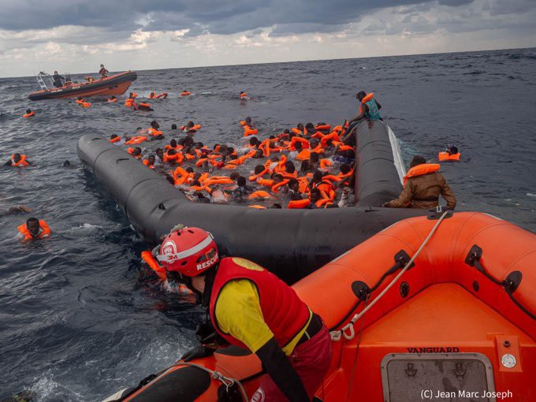
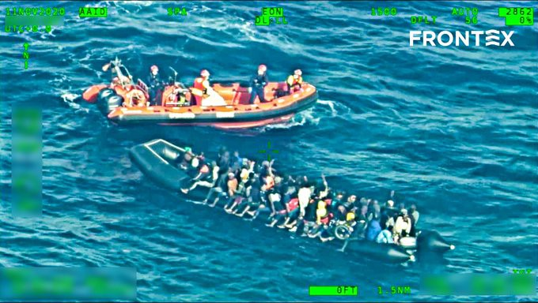

### AYS Daily Digest 12/11/2020: More than 100 lives lost in the Mediterranean Sea
#### 4 shipwrecks in the last two days // Syrians say: No Return With Assad // Updates from group stranded on Evros river island // Situation on the Canary Islands // Updates from Melilla // Policy analysis from BVMN about New Pact on Migration

Latest Open Arms rescue mission, in which six people died\. Copyright: Jean Marc Joseph
### FEATURE: Again, Europe has decided not to save lives

It’s hard to find words to describe the same horrible things happening over and over again: things we all knew would happen, and things we all know will happen again\.

> Today we mourn the death of about 100 people who died in the past two days in the Mediterranean Sea\. 

These people lost their lives in separate shipwrecks\. [IOM reported about one shipwreck](https://www.iom.int/news/devastating-shipwreck-libya-claims-more-70-lives-iom) that claimed the lives of at least 74 people off the coast of Khums, Libya\. Coast Guard and local fishermen brought the survivors to shore\. The second shipwreck was [reported by MSF Sea](https://twitter.com/MSF_Sea/status/1326942277542010882) \. Three women were the sole survivors, again rescued by local fishermen\. About 20 people drowned\.

> “They \[the survivors\] saw loved ones disappear beneath the waves, dying in front of their eyes\.” MSF stated on Twitter\. 

The boat sank off the coast of Sorman, Libya, east of Tripoli\. The NGO Alarm Phone later confirmed that it had been contacted by the boat earlier but lost contact at one point\. According to a tweet by Alarm Phone from Thursday morning, the NGO had informed the authorities 48h earlier and asked them to conduct a rescue, but nothing happened\. They even designed a drift model for aerial search for Frontex — in vain\. European authorities decided to let these people die\.

On Wednesday, six more people died after a ship basically imploded\. About 100 people found themselves in the water\. The civilian NGO vessel Open Arms, alarmed by Frontex, came to their rescue\. Horrible scenes unfolded, with a hundred people thrashing in the waves, fighting for their lives\. See below the shocking video of a mother searching for her baby\.

■■■■■■■■■■■■■■ 
> **[Open Arms](https://twitter.com/openarms_fund) @ Twitter Says:** 

> > Escuchad el sonido del naufragio que vivimos ayer. 
El grito desesperado de una madre en busca de su bebé de 6 meses de vida, en medio del caos.
Le recuperamos del mar en parada respiratoria,remontó, pero horas más tarde su pequeño cuerpo no resistió.
Ella es la madre de Joseph💔 https://t.co/mYzXLq1jxi 

> **Tweeted at [2020-11-12 11:27:47](https://twitter.com/openarms_fund/status/1326849164173582336).** 

■■■■■■■■■■■■■■ 

We do not know if it is the same child, but we know that one 6\-month\-old baby died aboard Open Arms after the rescue\. His name was Joseph\.

On Twitter, Frotenx tried to get credit for “playing a key role in the rescue”\. The picture they posted with the statement speaks volumes: Through the camera lens of a European agency we see a rubber dingy overloaded with people and a speed boat of a civilian rescue group trying to help\. **At the risk of repeating ourselves endlessly: Frontex is complicit in pushbacks from Greece while EU authorities try their best to prevent civilian rescue missions\. There is really nothing to give Frontex credit for\.**

Copyright: Frontex

Actually, [the European Ombudswoman O’Reilly announced](https://www.ombudsman.europa.eu/en/news-document/en/134739?utm_source=some_eo&utm_medium=tw_organic&utm_campaign=frontex) on Wednesday that an inquiry to assess Frontex’s ‘Complaint Mechanisms’ will be opened\.

> “This inquiry focuses on whether the Complaints Mechanism and the Fundamental Rights Officer are truly empowered to deal with the issues faced by migrants and asylum seekers who feel their rights have been violated under Frontex operations\.” 

But let’s get back to the main topic of this feature: the lives lost in the Mediterranean Sea in the last days\. Because there is more:

On 10th of November, 13 people died off the coast of Libya\.

■■■■■■■■■■■■■■ 
> **[Safa Msehli](https://twitter.com/msehlisafa) @ Twitter Says:** 

> > ‼️ At least 13 migrants drowned after a boat capsized off the coast of #Libya today. 

Among them were three women and one child. 

According to IOM staff, 11 others were rescued and returned to shore by the coast guard. https://t.co/E75NdIaLDz 

> **Tweeted at [2020-11-10 17:32:08](https://twitter.com/msehlisafa/status/1326216080415711238).** 

■■■■■■■■■■■■■■ 

**This adds up to over 100 lives lost in the last 48h in the sea at Europe’s doorstep\.**

Meanwhile, Alarm Phone is in contact with a boat with about 89 people on board that is in distress near Lampedusa\. We hope we won’t have to report about their deaths in tomorrow’s digest\.

While keeping in mind that IOM is not a humanitarian organization and there is a lot to criticize about its work, it is still remarkable that its spokesperson Safa Msehli is finding clear words to describe the untenable situation at sea\. Msehli constantly repeats with every single return of people to Libya that Libya is NOT a safe port\. She emphasises the incredibly important work done by civilian rescue operations and calls for an end to the interference of European authorities with their work\.

In a tweet from Thursday morning, Msehli called for the redefinition of the Libyan Search and Rescue Zone in order to allow international live saving missions\.

■■■■■■■■■■■■■■ 
> **[Safa Msehli](https://twitter.com/msehlisafa) @ Twitter Says:** 

> > We call for a change in the evidently unworkable approach to #Libya and the Mediterranean.

In the absence of safeguards for migrants returned to the country, the Libyan SaR zone must be redefined to allow for international life-saving operations. https://t.co/C8Y8t7M93F 

> **Tweeted at [2020-11-12 18:04:55](https://twitter.com/msehlisafa/status/1326949109933203461).** 

■■■■■■■■■■■■■■ 

### SYRIA
#### No Return with Assad

On Wednesday, Bashar al\-Assad and Russia co\-hosted a conference in Damascus to promote the return of refugees\. More than six million people fled Syria in order to escape the civil war\. EU member states declined the invitation, calling the conference “premature” since conditions for safe, voluntary, dignified and sustainable return of refugees are not yet met\. [This statement seems rather reluctant](https://www.consilium.europa.eu/en/press/press-releases/2020/11/10/syria-declaration-by-the-high-representative-on-behalf-of-the-eu-on-the-refugee-conference-in-damascus/) , given that not only are conditions for return not met — but conditions of suppression and persecution persist\. While Assad accused western countries of preventing the return of Syrian people, the reality looks quite different\. More and more western countries are at work _ending_ international protection for Syrians\.

Meanwhile many Syrians themselves sharply protest against a potential return to their country under Assad’s rule\. One of them is Wafa Ali Mustafa, a young journalist, activist and member of the organization Families for Freedom, a movement that campaigns for freedom and justice for Syria’s detainees\. Her father disappeared in Assad’s prisons 2691 days ago\. Since his disappearance, the family has never heard of him again\. [In a briefing in the UN Security Council in July 2020](https://diary.thesyriacampaign.org/briefing-un-security-council-wafa-mustafa/) , she explained that about 130,000 people are believed to be detained and forcibly disappeared\.

> “To have a loved one who’s detained or disappeared and not know their fate is like waking up one day and realizing you have lost a limb\. I can tell you it is a growing pain, a pain unlike any other\. Even though there is barely anything to hold on to, what keeps me going is to live by what my father has taught me and the hope that one day he will be free and reunited with us” 

Under the hashtag \#no\_return\_with\_assad, people express their protest against the conference on twitter\.

■■■■■■■■■■■■■■ 
> **[Wafa Ali Mustafa #FreeAlaa](https://twitter.com/WafaMustafa9) @ Twitter Says:** 

> > #Assad regime disappeared 130,000 ppl in #Syria bt 2011-2020 in #Syria @[snhr](https://twitter.com/snhr)
No talks about #refugees return, peace-building, #justice4Syria before releasing detainees, and providing answers to families of the victims of #torture.

#no_return_with_assad 
#العودة_تبدأ_برحيل_الأسد https://t.co/NJ5AuSyOBY 

> **Tweeted at [2020-11-12 12:00:10](https://twitter.com/wafamustafa9/status/1326857314331189248).** 

■■■■■■■■■■■■■■ 

If you are interested in learning more about Assad’s prisons, we recommend listening to **Branch 251,** a podcast about the world’s first criminal trial dealing with Syrian state torture, currently taking place in Koblenz, Germany\.
### GREECE
#### Update from Evros

In yesterday’s digest we featured the story of a group of 70 refugees stranded on an island in Evros River, between Greece and Turkey, after Greek authorities illegally deported them to the island and Turkish authorities denied their re\-entry to the country, presumably even by firing warning shots\. Josoor and Alarm Phone now both reported that the group was eventually able to return to Turkey\. They are recovering before Josoor asks them to give testimonies about yet another illegal pushback\. The group was on the wild island for days\. Both Greek and Turkish authorities were aware of the situation, as was Frontex, given that the body has a liaison office in Turkey, and and the Evros region is a Frontex operation area\.
#### Coronavirus update

According to MSF’s Medical Operational Support Unit Director, 950 refugees have tested positive for the novel coronavirus in Greece\.
#### Occupancy of reception and identification centres on the islands

According to the [latest data from the Greek government](https://infocrisis.gov.gr/11085/national-situational-picture-regarding-the-islands-at-eastern-aegean-sea-11-11-2020/?lang=en) , the situation on the islands is slightly relaxed regarding the occupancy of refugee accommodation\. Lesbos, Leros and Kos are below their capacity, while Chios and Samos are above\. Samos currently has 3838 people, about 6 times above its capacity of 648\. This is especially tragic as the island was hit by an earthquake at the end of October and saw a big fire in the camp shortly later\.

Many people have been affected by the earthquake; many houses were destroyed\. Samos Chronicle draws readers’ attention to a restaurant called “Ancient Jerusalem”, run by two brothers from Gaza who were granted asylum and decided to stay on the island\. The restaurant opened only three months ago but was frequented by refugees and locals alike\. It was destroyed by the earthquake\. 
If you want to financially support the reopening of a new restaurant, [see here](https://samoschronicles.wordpress.com/2020/11/12/we-need-help/?fbclid=IwAR03EP7wXvNLhdYniryLpkQfw8IcYdUBHmryIrjULIHJnXOKXiB6kOPDr-Y) \.
#### Concerns about Press Freedom

Reporters Without Borders and the [Media Freedom Rapid Response](https://www.mfrr.eu/greek-police-urged-to-explain-detention-of-germany-documentary-crew/?fbclid=IwAR0xOpPCSqdPaEuiz0085dYaRcFqzGBWQr7UwchbO2Gr6iZe5k7f9qf6XmQ) sent a letter to Greek authorities, calling for an explanation for the detention of a German documentary team on Samos on 19 October\.
#### Health on the Move \- Patras

The No Name Kitchen’s medical team works with young people mostly from Afghanistan living in the abandoned factories near the port\. From there, they try to hide on trucks in order to make it on the ferry to be shipped to Italy\. They have to jump fences, run from patrols and hide in dangerous places\. Health on the Move tries to provide them with some basic medical care\. Find more on No Name Kitchen’s Facebook page\.
### SPAIN
#### Canary Islands: The conditions on the pier in Arguineguín are unbearable

[Human Rights Watch published a repor](https://www.hrw.org/news/2020/11/11/spain-respect-rights-people-arriving-sea-canary-islands) t calling on Spanish authorities to respect the rights of the people who arrive to the Canary Islands by sea\. The conditions at the Arguineguìn pier on Gran Canaria, where the newly arriving people are accommodated, are overcrowded and unsanitary\. There are currently about 2000 people on the pier, which has a formal capacity of 400\. The emergency camp was set up in August for medial screening and police identification and registration procedures\. According to HRW, the conditions on the pier are absolutely inadequate even when under capacity\. At the moment, only one out of four persons sleeps under a tent; the rest spend the night outdoors with little more than a blanket to protect them\. Many people appear to be detained on the pier for more than 72 hours, which is the maximum allowed under Spanish law\. Apparently people are not being informed about their right to claim asylum\. 
[According to newspaper articles](https://www.eldiario.es/desalambre/solucion-interior-hacinamiento-migrantes-puerto-arguineguin-campamento-militar-levantado-tierra_1_6407455.html?fbclid=IwAR1CFPno-KOkOzASkEZAfMSjtTIrrKfOLbmDfqy9aVt7kYYOmA_P9V8kAzc) , a military camp is being built at the moment in order to host the newly arriving people\. Europe does not seem to learn from its experiences with this sort of camp in Greece\. Just to give some perspective here: The Canary Islands usually host more than 10 million tourists each year\. One would think there should be some empty rooms on the islands during a world wide pandemic that basically halted touristic travels\. 
The route from the western coast of Africa to the Canary Islands is often classified as being the most deadly route to Europe, with a mortality rate of between 5 and 8 percent\. It is estimated by the Spanish Red Cross that the potential death toll of this year ranges between 640 and 1,020\. Many of the people who die on the route are from Senegal\. At the end of October, the deadliest shipwreck of the year to date happened: 140 people perished in the sea off the Senegalese coast\. 
Senegalese authorities are starting to conduct interceptions of people who try to leave the country for Europe\. According to newspaper articles, 1,500 people were intercepted and six boats confiscated \(it is not clear on which date this operation took place\) \. 
The situation on the Canary Islands is slowly getting attention from European Officials\. EU Commissioner for home affairs Ylva Johansson expressed her concern about the growing number of arrivals\. About 15,000 people have arrived to the Islands so far this year\.
#### Updates from Melilla

Solidary Wheels, a group currently in Melilla, gave an update on the situation in the Spanish enclave\. The group works with kids living on the streets of the city\. The kids are negatively affected by the pandemic and the following restrictions in various ways\. Places where they can usually get food in exchange for running errands are closed, police frequently control them and are often violent, and shelters are being destroyed\. In addition, expulsion orders continue to be issued:

■■■■■■■■■■■■■■ 
> **[Solidary Wheels](https://twitter.com/SolidaryW) @ Twitter Says:** 

> > With the increase in police controls and the lack of documentation of many of the children living on the streets, expulsion orders increase despite the impossibility of executing them because the border is closed. They therefore remain in a very complex legal limbo.👇🏿 

> **Tweeted at [2020-11-12 11:33:49](https://twitter.com/solidaryw/status/1326850682268377088).** 

■■■■■■■■■■■■■■ 

### FRANCE
#### More than 1,000 evictions during a pandemic

[InfoMigrants published an article](https://www.infomigrants.net/en/post/28467/more-than-1-000-evicted-from-makeshift-homes-in-france?fbclid=IwAR0jyAAyo_kdJvqY9SZcTWJglxCfxbAU7OmOAkSzJmLDs88_gDfmReOcTAg) about evictions of makeshift homes of refugees in France\. In the past 12 months, more than 1,000 evictions were carried out, in a time when everybody was asked to stay at home\. Of course makeshift homes are not a solution, but destroying makeshift homes without offering an alternative is even worse\.
### UK
#### Family reunion continues to be under threat in UK

This video gives a good overview of the changes in the family reunification process once the UK leaves the EU\. UK’s law is much stricter when it comes to family reunification than it was under Dublin III regulations\. In case there won’t be a new law by the end of the year, many children will not be able to re\-join family members of theirs in the UK\. This means that even more children will try to cross the British Channel by dangerous means\.

■■■■■■■■■■■■■■ 
> **[Safe Passage 🧡](https://twitter.com/safepassageuk) @ Twitter Says:** 

> > Fantastic interview by Ridwan, one of our Young Leaders on @skynews. Ridwan came to the UK via refugee family reunion laws that end on December 31st. As the door closes on this vital safe and legal route, more young refugees will risk their lives to reach the UK.
Please retweet. https://t.co/msw85MXzsI 

> **Tweeted at [2020-11-12 16:13:48](https://twitter.com/safepassageuk/status/1326921146479030273).** 

■■■■■■■■■■■■■■ 

The British Red Cross further published a report criticising the procedure for family reunification from the country of origin\. When one person gets his or her asylum claim granted, they are legally entitled to be reunited with their immediate family members through a family reunion visa\. However, the procedure to receive this visa is complicated; people have to travel to British embassies to apply\.

> “The British Red Cross warns that in many cases, children and adults are forced to navigate war zones, flee sexual violence, hide for fear of imprisonment or abuse, and are even forced to pay smugglers, in order to reach the place where their paperwork can be processed by officials acting for the Home Office\.” [says the Independent](https://www.independent.co.uk/news/uk/home-news/refugees-family-reunion-safe-legal-route-home-office-red-cross-b1721205.html?fbclid=IwAR0x-IKdiCGyE2WpB_9arDQvnlFXKf_0yAFMLIS5uuKzIG9xBrlcRZrek-w) \. 

### EU

Our friends from The Border Violence Monitoring Network published a policy analysis on the EU’s New Pact on Migration\. See here:

### WORTH READING

This long read from September gives useful background on the criminalization of rescue missions in the Mediterranean:

**Find daily updates and special reports on our [Medium page](https://medium.com/are-you-syrious) \.**

**If you wish to contribute, either by writing a report or a story, or by joining the info gathering team, please let us know\.**

**We strive to echo correct news from the ground through collaboration and fairness\. Every effort has been made to credit organisations and individuals with regard to the supply of information, video, and photo material \(in cases where the source wanted to be accredited\) \. Please notify us regarding corrections\.**

**If there’s anything you want to share or comment, contact us through Facebook, Twitter or write to: areyousyrious@gmail\.com**

_Converted [Medium Post](https://medium.com/are-you-syrious/ays-daily-digest-12-11-2020-more-than-100-lives-lost-in-the-mediterranean-sea-66fb7f2de604) by [ZMediumToMarkdown](https://github.com/ZhgChgLi/ZMediumToMarkdown)._
