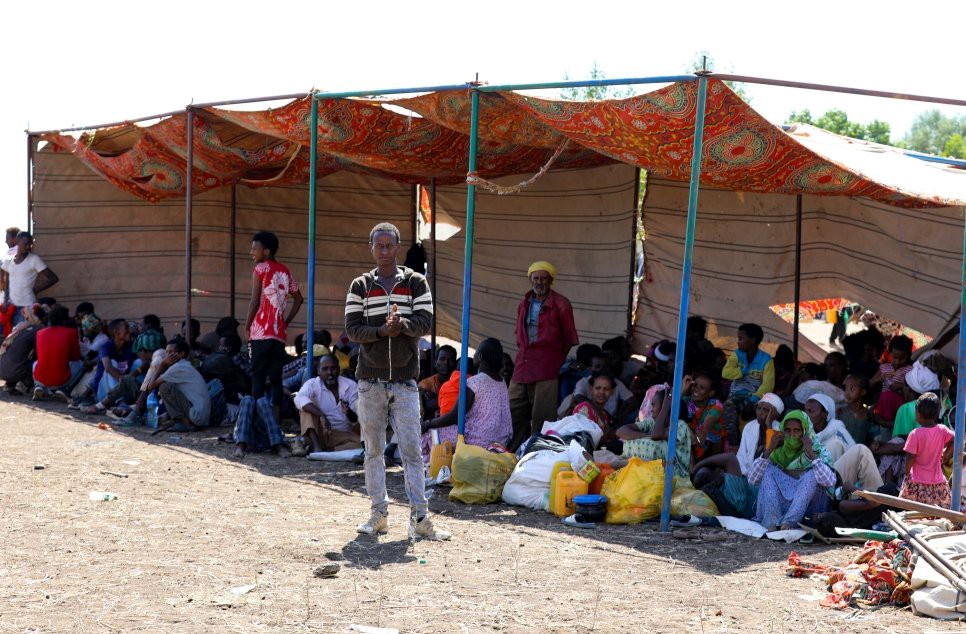

### AYS Daily Digest 13/11/2020 — Over 480 People Died Trying to Reach the Canary Islands in the Last Few Weeks
#### Humanitarian crisis in Ethiopia // Mediterranean sea rescue operations//Constitutional Case Field Against Malta

Ethiopian refugees in Hamdait border area, credits UNHCR/AFP
### FEATURE
#### New policy package on migration in Canary Islands amid continued inhumane conditions

The Canary Islands are seeing a significant increase in arrival numbers, with around 2000 people landing in the archipelago only last weekend\. Although this rising trend has been ongoing for the last few weeks, the infrastructure on the islands is still inadequate for the proper hosting and assistance of asylum seekers, most of whom are coming from the African continent, opting for the Canary Islands route to the often more dangerous routes through Libya and Morocco\. However, as IOM data reveals, more than 480 people have died trying to reach the Canary Islands’ coast from Senegal in the last weeks\. These numbers amount to around 1 death for every 20 people attempting to cross this route\. [Youth activists in the country](https://www.eldiario.es/desalambre/jornada-luto-senegal-muerte-480-personas-intentaban-llegar-canarias_1_6412879.html?fbclid=IwAR2Ly-IMOJJI2S7C8xDyc3ts0zEixlnYALtBvhvHclQRkG5uu5s8L0YnkZQ) have proclaimed a day of mourning, to commemorate the victims of this tragedy\. Safe and legal migration routes, which could significantly prevent this inhumane loss of human lives, remain so far a policy plan\.

The [Spanish government has announced a policy package](https://www.eldiario.es/desalambre/gobierno-activa-plan-evitar-salida-pateras-canarias-incluye-envio-aviones-patrulleras-paises-transito_1_6417540.html?fbclid=IwAR0A4GGCDNA3jjGNM13PJW26gjx7-SceBNkbeowmjWZyL4Qfb-yCpGoaUwE) to deter migration through this route to the Canary Islands, by reinforcing diplomatic cooperation with transit countries such as Senegal , Morocco and Mauritania\. Beyond the usual measures to encourage bilateral development cooperation and deploy funds to increase the assistance capacity of the Canary Islands, the policies entail a much darker, but unfortunately common set of measures aimed at “combating human trafficking”\. This will translate to an [increase in police capacity in the transit states, the collaboration of Frontex with police in Gran Canaria](https://www.eldiario.es/desalambre/gobierno-activa-plan-evitar-salida-pateras-canarias-incluye-envio-aviones-patrulleras-paises-transito_1_6417540.html?fbclid=IwAR0A4GGCDNA3jjGNM13PJW26gjx7-SceBNkbeowmjWZyL4Qfb-yCpGoaUwE) , and the deployment of “two ocean vessels, a high\-altitude patrol boat, an airplane, a helicopter and a submerged vessel”\. This shows once again the militarized approach of European asylum management policies in response to another humanitarian crisis\.

The [Spanish Army has announced](https://www.infomigrants.net/en/post/28519/canary-islands-army-builds-camp-for-migrants-stranded-on-dock?fbclid=IwAR0A4GGCDNA3jjGNM13PJW26gjx7-SceBNkbeowmjWZyL4Qfb-yCpGoaUwE) it will set up a refugee camp with the capacity of 200\. [Human Rights Watch has denounced](https://www.infomigrants.net/fr/post/28510/l-armee-espagnole-installe-un-camp-pour-migrants-aux-canaries?preview=1605263526392&fbclid=IwAR03oUQlTOZvoo_2TWySnntRPQq5hS9BfNescVxknj0vkvqal3TrHGkNLJc) that more than 1800 people are still crammed and sleeping rough on a pier in Arguineguìn, Gran Canaria, with no access to information or proper asylum procedures\. Further, in the already very crammed area it is extremely difficult, if not impossible, to [follow Covid\-19 protocols:](https://www.ecre.org/atlantic-route-arrivals-continue-miserable-conditions-at-arguineguin-pier-ombudsman-investigating-lack-of-legal-assistance/?fbclid=IwAR0_23Olp9v33naCTXDsfN4IIKC4tuwcipxtTt5ewrlwiiht9NhJL0751Ig)

“People who have traveled separately are sometimes placed together in tents, and social distancing is virtually impossible\. At the time of the visit, a Red Cross official said there were 55 people who had tested positive for Covid\-19 awaiting transfer to a dedicated facility for isolation, monitoring, and treatment\. However, the bus company was refusing to take them, citing health concerns”\.

In relation to this situation, the European Ombudsman is investigating complaints about the lack of proper legal assistance for asylum seekers, which should be guaranteed within 72 hours of their arrival\. Indeed, the [Spanish Commission for Refugee Aid \(CEAR\) has denounced](https://www.cear.es/indefension-juridica-migrantes-canarias/?fbclid=IwAR1qTYHVt9hVneu4hPEq0PCsZN6F3lrM21dVZw-w8h2qBiDwcV1wo4zt9CY) the situation of “clear legal defenslessness” faced by asylum seekers who arrive on the island, as they are not guaranteed clear and immediate legal assistance and access to information, which may jeopardise their ability to claim \(or be guaranteed\) asylum\. It is particularly shocking that, as it appears, return agreements are processed without adequate legal assistance, which violates asylum seekers’ rights to a fair examination of their case, on an individual basis\.
### ETHIOPIA

[The UNHCR has raised concerns](https://www.unhcr.org/news/briefing/2020/11/5fae4aec4/humanitarian-crisis-deepens-amid-ongoing-clashes-ethiopias-tigray-region.html?fbclid=IwAR3PqV1C9rVwloNzagOxQU_lFWMMQ2WL3ZfLAGagZ1AJ8gYNTLACewq4T1A) about what appears to be a new and extremely serious humanitarian crisis in Ethiopia\. Ongoing clashes between the federal government and Tigray forces are forcing thousands of people to flee, more than half of them children\.

Since the violence began in early November, more than 14,500 children, women and men have fled to Sudan in search of safety, overwhelming the current capacity to provide aid\. Meanwhile, services for 96,000 Eritrean refugees inside Tigray have been seriously disrupted, with reports of a growing number of Ethiopians becoming displaced internally\.
### GREECE
#### **More landings on the Island of Samos**

[According to Aegean Boat Report](https://www.facebook.com/AegeanBoatReport/posts/968579806998457) , a boat carrying approximately 35 people landed southwest of Ireo, Samos south this morning\. They are reportedly scattered in small groups in the area, hiding because they are afraid that Greek coast guard will push them back to the sea\.
#### Rough conditions for refugees in Greece

Conditions are dire in Greece, with [many still sleeping rough](https://www.infomigrants.net/en/post/28490/video-afghan-refugees-in-athens-make-their-home-under-a-tree?fbclid=IwAR2sPBJ5kSoZwfiAKJxDl6rhv3ngPrAkxjF07ptdcEogyDUmygAS8FHBxqY) \. According to [sources close to officials directly involved in the matter](https://twitter.com/g_christides/status/1327171309739053057?fbclid=IwAR3YQ34DfPVtO9QQ-03obKJMD1-ziBcDtpIBVFS9ssaMI0o9b5rED7NvLVY) , overcrowded camps on Samos and Leros will be shut down by December 2021, to be replaced by some with a much larger capacity under EU funding\. However, newly built camps are still awaiting basic facilities like water and electricity to be set up properly\. The eviction of the Pikpa camp in Lesvos has put further stress on an already critical situation\. Together with Media Pikpa, we’d like to remember the positive experience of this camp through [this video](https://www.youtube.com/watch?v=O1NNqS62tjw&feature=youtu.be&fbclid=IwAR3qpCQLXiqnmBYD8CDJCm_N0ToY7UIqvfjCwYENPJqjhRhzyeK2gBiPQ_E&ab_channel=mediapikpa) \.

The life of asylum seekers in Greece is rendered even more difficult by the lengthy and interminable experience of seeking asylum in Greece, which, [as this article shows](http://www.digitaljournal.com/news/world/seeking-asylum-in-greece-an-interminable-waiting-game/article/581025?fbclid=IwAR0_23Olp9v33naCTXDsfN4IIKC4tuwcipxtTt5ewrlwiiht9NhJL0751Ig) , is a complex and tortuous procedure\.

This notwithstanding the numerous illegal pushbacks, in which Frontext is allegedly involved, [as ECRE’s Greece report documents](https://www.ecre.org/greece-father-of-drowned-child-arrested-thousands-of-pushbacks-documented-frontex-involvement-in-pushbacks-under-scrutiny/?fbclid=IwAR0lRuojGLU2RmLKBHS3Hxb6l_fg3bjcuxBszHGQCa939NHqfd0QMsV_cCQ) \. The shocking charges pressed against an Afghan father for allegedly endangering the life of his son whilst trying to reach the Greek coast from Turkey, [are an attack on the very](https://euobserver.com/opinion/150033?fbclid=IwAR1dIC23p9KHCbWeIIZfYL-Lwb4DZK8zZQ69M6nAJ5V-LJQMFWXBOl1hTG4) notion and values of asylum law\.
#### Covid\-19 lockdowns as a weapon against migrants?

As new Covid\-19 lockdowns are re\-instated in most of European countries, Vice\.com asks whether these lockdowns are a way to further governments’ strict anti\-immigration discourses:

> “These lockdowns were extended, expired, and reinstated multiple times in different forms, despite [low infection rates](https://www.kathimerini.gr/politics/1070897/n-mitarakis-kanena-kroysma-koronoioy-stis-domes-metanaston-prosfygon/) \. Even as many lockdown restrictions have shifted, instead of protecting refugees, the Greek government has weaponized COVID\-19 regulations against migrants in the country and has linked them with the spread of the virus\.” 

Read the article in full [here](https://www.vice.com/en/article/v7mdey/greece-is-weaponizing-the-coronavirus-against-refugees?fbclid=IwAR3pqi_NQqZMceNIqPVkRYlpQvMgVnKGgMfgbfFQudA-PMCsXZzE3kVhAK4) \.
### **SEA**

[A constitutional case has been filed against Maltese authorities](https://www.ecre.org/med-constitutional-case-filed-over-pushback-from-malta-death-toll-climbing-and-returns-to-libya-continue/?fbclid=IwAR0F5aCuGJ7WBTOgSq0DI60ElmUcGUaZTKOb3kB4UdyXXG40wcvfvQasLQ0) , who allegedly carried out illegal pushbacks to Libya last April, resulting in the further detention and human rights abuses suffered by those illicitly detained in Libya\. According to IOM, almost 1000 people were intercepted and returned to Libya in the period between 3–9 November 2020, as European authorities and national governments still deem the country safe, despite solid and unquestionable evidence of severe human rights abuses perpetrated against migrants and asylum seekers in Libya\.

A harsh condemnation of EU rescue policies at sea comes from [MSF, who have issued a press release](https://www.msf.org/eu-policies-blame-refugee-shipwrecks-central-mediterranean?fbclid=IwAR3nwoPeFT9whrMqliBvqtwM26vrGEe84pNqzlmEHnMq6vC_CG0kGZoG8qo) strongly accusing EU governments of willingly acting as obstacles to rescue operations in the Mediterranean, and thus being complicit in the humanitarian disaster occuring at sea\.

> “Enough with the empty lamentations in response to the carnage unfolding,” said Hassiba Hadj Sahraoui, MSF Humanitarian Affairs Advisor\. “The responsibility for these deaths lies squarely with EU member states, as the concrete and inevitable outcome of their murderous policies of non\-assistance and the active blocking of NGO rescue ships\.” 

We cannot but join MSF in its indignation towards Frontex and European states blaming this loss of life solely on smugglers and traffickers\.

> “They must instead accept that the mass loss of life in these incidents are the human collateral of their own calculated and political decision\-making\.” 

### SERBIA

[Asylum Protection in Serbia reports](https://twitter.com/APC_CZA/status/1327207740528336896?fbclid=IwAR3qpCQLXiqnmBYD8CDJCm_N0ToY7UIqvfjCwYENPJqjhRhzyeK2gBiPQ_E) that police is relentlessly and forcefully relocating groups of people, particularly migrants sleeping rough in Subotica\. They send them to overcrowded camps, which cannot host them, only to then see them return to sleeping rough in some other location\. Amongst them there are many minors\.
### FRANCE

According to [Human Rights Observers](https://twitter.com/HumanRightsObs/status/1327209997395251201?fbclid=IwAR3lNTgbmClp7ZF1ZOgSvIccIddNASuxfZjHiItESf6mZyvYnrf6BNfJFGY) , makeshift tent camps in the Calais region \(Coquelle and Grande Synthe\) have been evicted this morning, leaving people with nothing to cover themselves for the night\.
### SLOVENIA

[The Peace Institut \(Mirovni Institut\)](https://www.facebook.com/mirovni.institut.si/posts/3499790980134625) has prepared an infographic about how the Covid\-19 pandemic and preventive measures affected the lives of refugees in Slovenia\. Infographics are in English and you can find the report at: [https://bit\.ly/36rUYog](https://bit.ly/36rUYog?fbclid=IwAR15HM9Qi6vbAbIW_ljpgBQ31jhXC7btrq-CRjajnqswibJz6CvHbnUap3Y) \.
### UK
#### Observers say that people crossing the Channel face inhumane treatment

Around 8000 have crossed the English channel so far in 2020\. Four separate independent monitoring commissions have raised serious concerns over the ways in which asylum seekers are treated once they arrive in the UK after crossing the Channel\. Evidence found inhumane treatment of asylum seekers upon their arrival, as well as serious mishandling of their cases and documentation\. Find out more [here](https://www.theguardian.com/uk-news/2020/nov/13/asylum-seekers-crossing-channel-face-inhumane-treatment-observers-say?fbclid=IwAR0T1ZYP_NHP-B-U1zlCDBLgPcxEjzntFOfEeR6iFd8btF8tcLiAG9_JhGs) \.
### GENERAL

The UN’s special rapporteur on racism, racial discrimination, xenophobia and related intolerance, Tendayi Achiume, [has issued a report that raises a number of concerns about the ways humanitarian organisations are collecting and using personal data](https://www.computerweekly.com/news/252492003/Humanitarian-data-collection-practices-put-migrants-at-risk?fbclid=IwAR0_23Olp9v33naCTXDsfN4IIKC4tuwcipxtTt5ewrlwiiht9NhJL0751Ig) , particularly biometric data, to deliver aid and provision services\. Indeed, it is unclear how forceful or ethical the very process of collecting data is, as well as how the data is stored and used\. Another concern raised briefly by the report is the use of international aid by countries in Europe and North America to advance their border agendas in less economically developed countries\.

Recent political developments in Europe have again sparked the discussion about violent extremism and its alleged connection with the lack of integration of migrants and minorities\. [A joint statement of European governments after the Vienna attacks](https://www.theguardian.com/world/2020/nov/13/violent-extremism-migrants-failure-to-integrate-eu?fbclid=IwAR3PqV1C9rVwloNzagOxQU_lFWMMQ2WL3ZfLAGagZ1AJ8gYNTLACewq4T1A) , and in commemoration of the fifth anniversary of the Paris attacks appears to be making the unfounded causal connection between violent extremism and failure of migrants to integrate\. This statement is quite revealing of the stance of many European governments, moderates and populists alike, about the state of European cultural integration\. Guardian journalist Shada Islam has an interesting take on the situation of Europe’s 25 million muslims, back in the spotlight after recent events and these declarations\. See more [here](https://www.theguardian.com/world/commentisfree/2020/nov/13/europes-muslims-are-european-stop-outsourcing-their-plight-to-foreign-leaders?fbclid=IwAR0F5aCuGJ7WBTOgSq0DI60ElmUcGUaZTKOb3kB4UdyXXG40wcvfvQasLQ0) \.

We finally conclude on a positive note:

The [German Foundation for International Cooperation \(GIZ\) has implemented a project](https://www.giz.de/en/mediacenter/91117.html?fbclid=IwAR0F5aCuGJ7WBTOgSq0DI60ElmUcGUaZTKOb3kB4UdyXXG40wcvfvQasLQ0) which seeks to help young refugees to learn about the world of work in Germany\. The programme seeks to help young people to find traineeships and apprenticeships which aid them for further employment in Germany\.

**Find daily updates and special reports on our [Medium page](https://medium.com/are-you-syrious) \.**

**If you wish to contribute, either by writing a report or a story, or by joining the info gathering team, please let us know\.**

**We strive to echo correct news from the ground through collaboration and fairness\. Every effort has been made to credit organisations and individuals with regard to the supply of information, video, and photo material \(in cases where the source wanted to be accredited\) \. Please notify us regarding corrections\.**

**If there’s anything you want to share or comment, contact us through Facebook, Twitter or write to: areyousyrious@gmail\.com**

_Converted [Medium Post](https://medium.com/are-you-syrious/ays-daily-digest-13-11-2020-8d9c8a65bdcf) by [ZMediumToMarkdown](https://github.com/ZhgChgLi/ZMediumToMarkdown)._
