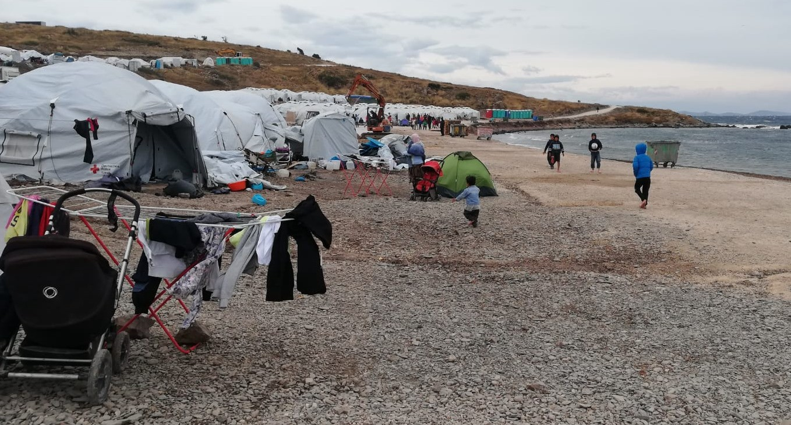
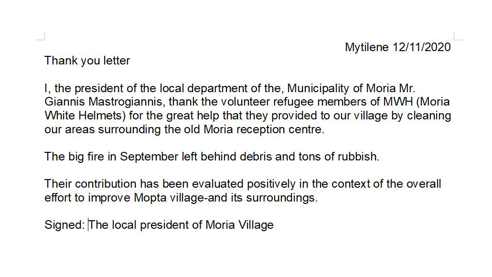

### AYS Daily Digest 19/11/2020: Human Rights observers under attack in Greece
#### 33 human rights observers under preliminary investigations // Anti\-Torture Committee sharply critizises Greece, Greece denies alligations // Sea\-Eye is launching a new ship // New rulings of high Spanish Court on hot returns // Updates from the Canary Islands // German’s Office for Migration’s practice deemed illegal by European Court of Justice // Updates from Napier Barracks, UK

Moria 2\.0\., with winter approaching\. Copyright: Moria White Helmets
### FEATURE: Human Rights activists are criminalized once again

Greek authorities investigate against several human right activists from NGO’s who do indispensably important work, not only in directly supporting refugees but especially also in monitoring human rights violations by Greek authorities\. 
Preliminary proceedings have been opened against 33 people, all of them members of NGOs such as Mare Liberum, Sea Watch, FFM e\.V\., Josoor and Alarm Phone/Watch the Med\. The investigations already started in June\. Phones were wiretapped and people were observed, but it was never really clear who was actually being accused\. The German newspaper Der Spiegel now got hold of the police files with more details about the case\.

In September, Greek police triumphantly announced they had busted a “criminal ring” of NGOs, accusing helpers as “spies” and “migrant smugglers” in Lesbos\. The official accusations are the formation of a criminal organization, involvement in espionage, violation of state secrets and facilitating the illegal entry of migrants into the country\. However, no charges have been pressed yet, probably due to the lack of evidence\. The damage is done anyways\. 
It is the same pattern that we have seen before when young men were accused of setting fire to Moria\. Official charges have never been pressed and no evidence has been presented, but the image remains\. The result: The accused are stained and assumed guilty in the media and public discourse without any chance of defending themselves or facing any evidence\.

> We stand in solidarity with the accused people and the NGOs\. We value the important work they do\. Their accussation is a political act, an attempt to silence those voices that consistantly stand in solidarity with refugees and denounce the illegal practices of the Greek authorities\. 

In former cases were charges were pressed against human rights activist in Greece, the activists were often hold in custody in a disproportionate manner and the trials would take endlessly without actual results\. We ask the Greek authorities to close the investigations and not to press charges\. Human Rights are not to be criminalized\.

Here you can find the [original article in German](https://www.spiegel.de/politik/ausland/verfahren-gegen-ngos-in-griechenland-man-will-uns-ruhig-stellen-a-6dcab115-2f50-45ef-ac8c-4d036d8bfe5c?fbclid=IwAR1-0SlIlBe76-2PRKNO9qYEiQ7XANBsiL4cDjnIV7yvR_bztZpChFT2nAo) \. This Thread presents the core information in English:

■■■■■■■■■■■■■■ 
> **[Giorgos Christides](https://twitter.com/g_christides) @ Twitter Says:** 

> > ! Two months ago Greek police triumphantly announced they had busted a "criminal ring" of NGOs, accusing helpers as “spies” and “migrant smugglers” in #Lesbos. Is it so or just a convenient crackdown to silence voices defending human rights? Thread: 1/
[spiegel.de/politik/auslan…](https://www.spiegel.de/politik/ausland/verfahren-gegen-ngos-in-griechenland-man-will-uns-ruhig-stellen-a-6dcab115-2f50-45ef-ac8c-4d036d8bfe5c) 

> **Tweeted at [2020-11-19 18:36:31](https://twitter.com/g_christides/status/1329493776088371202).** 

■■■■■■■■■■■■■■ 

### GREECE
#### Anti\-torture Committee sharply critizised Greece for its behaviour toward migrants

Council of Europe’s anti\-torture Committee urges the Greek authorities to change their approach towards immigration detention and to ensure that migrants deprived of their liberty are treated both with dignity and humanity\. In its report about a visit to Greece in March, the anti\-torture Committee holds that the conditions of detention in which people are held in the Evros region and on Samos could amount to inhuman and degrading treatment\. Article 3 of the European Convention on Human Rights prohibits this treatment by stating:

> “No one shall be subjected to torture or to inhuman or degrading treatment or punishment\.” 

In a press release, the Committee stated:

> “Migrants continue to be held in detention centres composed of large barred cells crammed with beds, with poor lighting and ventilation, dilapidated and broken toilets and washrooms, insufficient personal hygiene products and cleaning materials, inadequate food and no access to outdoor daily exercise\. The situation was further aggravated by extreme overcrowding in several of the facilities\. In addition, migrants were not provided with clear information about their situation\.” 

Even families with children, unaccompanied minors and separated children are detained in these conditions\. The report also calls out the practice of push\-backs in the Evros region and in the Aegean Sea\. In this context, the report also questions the role of FRONTEX\. 
In the Greek response paper, the Greek government once again denies all the allegations:

> “The alleged practice of military and police officers operating outside the official administrative facilities and secretly assisting in carrying out supposed push backs to the border is unsubstantiated and completely wrong\. No complaint or evidence has come to our knowledge about this\.” 

It is hard to imagine what could count as evidence to a government that systematically ignores all reports, testimonies, and even video material\.

Find the press release as well as the full report and the Greek answer to it here:

More on this [from InfoMigrants here](https://www.infomigrants.net/en/post/28635/greece-no-more-unaccompanied-minors-in-police-custody-as-report-slams-detention-pushbacks?fbclid=IwAR3kieLziSfIjwDtVFufZ0hZZDUabbbsQ7VuWEYgONhDsq-BT8BSG5Ka6qQ) \.
#### Winter is coming to Moria 2\.0

Like every year around this time, we can witness a surprising spectacle of nature: It is getting cold on the Greek Islands and all across Europe\. And like every year, the camps for refugees are completely unprepared for winter months\. In the camp Moria 2\.0/New Kara Tepe, there are no showers yet, neither warm nor cold ones\. People still wash themselves with water bottles or in the sea\. The tents are unfitting for winter, heaters are not allowed because of security reasons\. About 8\.000 people currently live in the camp\. The camp is right next to the sea, unprotected from sea wind\. As soon as it rains, the camp is completely under water\.
#### Moria White Helmets receive thank you letter from the Municipality of Moria

#### Aegean Boat Report criticizes New York Times article

Tommy, the man behind the Aegean Boat Report that is for years now constantly providing important information about arrivals of boats to the Greek islands, sharply criticises an article published yesterday in the New York Times about the father pressed with charges for endangering his child’s live directly after losing his son in the sea crossing\. Aegean Boat Report has been involved in the incident and tells a rather different story of the events as port police chief on Samos, Dimitris Tsinias who presented his interpretation in the New York Times\. It would have been Tsinias responsibility to initiate a search and rescue operation, but he never did\. In the article, Tsinias also accuses ABR of having provided false information\. 
Tommy highlights that whoever criticised the Greek Coast Guard is called “either a spy, a human trafficker, enemy of the state or, as in this case “aligned with the Turkish coast guard”, publishing Turkish propaganda\.” He calls on the NYT to double\-check their information and not to unchallengedly repeat statements of Greek officials in such a delicate question\. 
For the full post, please visit Aegean Boat Report in Facebook\.
#### New letter to the world from Greek refugee camp

Parwana Amiri, a young Afghani writer who currently lives in Ritsona refugee camp in Greece published a new letter to the world\. Under the title ”Here is the world of moving statues\. Here is the world of ghosts” she once again manages to find words for what it is like to be a refugee in Greece in this time\.

### SEA
#### Sea\-Eye is launching a new ship\!

The Sea\-Eye NGO is currently raising money in order to buy and prepare a new ship, the Sea\-Eye 4\. The ship will host a crew of 22 people and is very suitable for rescue missions\. The UNO\-Flüchtlingshilfe and United4Rescue, a civilian association that already supported the financing of the Sea\-Watch 4, will support the mission\. The ship will hopefully start operating in early 2021\.

More funds are needed, you can support Sea\-Eye here:

#### Testimony of Yusuf’s mother

Last week six months old Yusuf lost his live in a terrible shipwreck in the Mediterranean together with 5 other people\. He died on board of the Open Arms\. Now UNHCR Italy published a video of his mother speaking about losing her child\.

■■■■■■■■■■■■■■ 
> **[UNHCR Italia](https://twitter.com/UNHCRItalia) @ Twitter Says:** 

> > Aja ha perso suo figlio Yusuf in un tragico naufragio nel Mediterraneo. Era in mare con altre 118 persone quando la loro barca si è rovesciata. Yusuf è morto poco dopo il soccorso a bordo della nave @[openarms_it](https://twitter.com/openarms_it)
Abbiamo incontrato Aja a Lampedusa e ci ha raccontato la sua storia. https://t.co/0TCmt94UNC 

> **Tweeted at [2020-11-19 17:00:01](https://twitter.com/unhcritalia/status/1329469489138712578).** 

■■■■■■■■■■■■■■ 

### ITALY
#### Situation in CPR’s

The Italian organization no frontiere rose attention to the situation in the CPRs \(Centro di Permanenza per il Rimpatrio\) in the country, the centres for the detention of irregular migrants\. 
According to the group, the CPR\-machinery is working at full capacity and with close to no health measures in order to protect the detainees from infections with COVID\-19, although Italy is currently undergoing a soft lockdown\. Apparently positive cases are separated from not\-yet positive ones\. The little space in the centres provides perfect conditions for the virus to spread\. 
The first municipal guarantor for the rights of prisoners of Gradisca expressed that the conditions in the CPRs are worse than in prison\. It appears to be the case that detainees are prevented from holding contact to people outside of the centre\. When entering the premises, sim cards are usually destroyed\.

For updates about the situation in the CPRs, see:

#### Lampedusa

A new hotspot will open on Lampedusa, with space to host an additional 136 people\. While some of the people who arrive to Lampedusa have been saved by NGOs, many also manage to reach the island independently\.

### SPAIN
#### New Rulings of high Spanish Courts

The Spanish Supreme Court issued an extraordinary decision\. The Court recognized the right of potential asylum seekers to request their legal transfer to Spain in Spanish embassies to formalize a request for international protection\. This possibility is included in the Migration Law from 2009, but has so far not been put into practice by any government\. [More information in Spanish](https://www.eldiario.es/desalambre/constitucional-avala-devoluciones-caliente-ceuta-melilla_1_6444818.html?fbclid=IwAR3zXSnlVTacrHnD95LFXQ3GWaDqu12OvSQpYrnM4GaEtyGzFTNcjmMgJKg) here\.

At the same time, **the Spanish Constitutional Court endorsed the Citizen Security Law that also provides a legal framework for so called hot returns** \. Hot returns describe the practice of deporting people who managed to jump the Melilla or Ceuta border fences\. Only minors and vulnerable people are excluded from being subjects to this practice\. Under the Citizen Security Law, “foreigners who are detected in the border line of the territorial demarcation of Ceuta or Melilla while trying to overcome the border containment elements to cross the border irregularly may be rejected in order to prevent their illegal entry into Spain”\. Many human rights activists denounce this practice as being in sharp contrast to international law and the European Convention on Human Rights\. People have a right to claim asylum and to be protected from collective expulsions \(Article 4 Protocol №4 of the European Convention on Human Rights\) \. However, the European Court of Human Rights agreed in a ruling in February 2020 \(ND and NT vs\. Spain\) with the Spanish authorities, claiming the hot return of two people in 2014 was lawful since they chose not to take legal ways to enter the country but instead tried to surmount the border fence in a bigger group of people\. This ruling has been denounced as being far from reality\.
If there really were legal ways to come to Spanish territory in order to apply for asylum, why would there also be one of the strongest militarized and surveilled border fences? [More in Spanish here](https://www.eldiario.es/desalambre/constitucional-avala-devoluciones-caliente-ceuta-melilla_1_6444818.html?fbclid=IwAR3zXSnlVTacrHnD95LFXQ3GWaDqu12OvSQpYrnM4GaEtyGzFTNcjmMgJKg) \.

In reality it is not even possible for children whose parents are on the Spanish peninsula to access the two enclaves\. 
The NGO Solidary Wheels collected the testimonies of minors who swam to the enclaves in the recent months\. One of them is Ahmed, whose mother lives in Barcelona\. In August he swam to Melilla, at night, for 4:30 hours\. Often the swimmers are detected by the Spanish Police\. They are than forced to return to Morocco\. Some kids say the police would force them to swim back, accompanied by the boat and insulted by the officers\. [More here](https://en.solidarywheels.org/post/swimming-for-lack-of-other-options) \.
#### Canary Islands

This video gives a good overview over the situation on the Canary Islands, were thousands arrived in the last weeks\.

■■■■■■■■■■■■■■ 
> **[DW News](https://twitter.com/dwnews) @ Twitter Says:** 

> > Spain's Canary Islands are facing a surge in migrant arrivals with thousands arriving in the past month. 

Human rights activists say the conditions in the camps are squalid and authorities are not giving people a fair chance at seeking asylum. https://t.co/dRm2dLjSWj 

> **Tweeted at [2020-11-19 12:06:00](https://twitter.com/dwnews/status/1329395497581367298).** 

■■■■■■■■■■■■■■ 

A new camp has just been opened at Barranco Seco on Gran Canaria, located on a former military ammunition site and with a capacity to host 800 people\. Currently there are more than two thousand people at Arguineguin pier, with camp structures for only 400 people\. Journalist repeatedly report that they do not have access to the camp on the pier\. 
The human rights activist Txema Santana denounced the bad management of the situation on twitter\. Many people are hold in closed facilities for more than the 72 h that are allowed under Spanish law\.

■■■■■■■■■■■■■■ 
> **[Txema Santana ✳️](https://twitter.com/txemita) @ Twitter Says:** 

> > No ayuda a generar certidumbre a la población local ni a las personas migrantes el enorme desorden en recursos, situaciones, tiempos o la arbirtrariedad en las decisiones con las personas en la gestión la crisis migratoria que vivimos en Canarias. 

Así está el patio (II) ⬇️ 

> **Tweeted at [2020-11-19 17:09:12](https://twitter.com/txemita/status/1329471799315337218).** 

■■■■■■■■■■■■■■ 

### GERMANY
#### European Court of Justice strenghens right to refugee protection

The European Court of Justice ruled on Thursday in a preliminary ruling procedure that Syrian conscientious objectors are entitled to international protection\. In the last years, the German Office for Migration and Refugees \(BAMF\) constantly only granted subsidiary protection instead of giving them the full refugee status\. As a consequence, the people were not entitled for family reunification processes\. In practice, thousands of Syrian men were unlawfully deprived of their right to live together with their families in Germany\. German courts are now obliged to follow the ruling of the European Court of Justice in similar cases\. It is however unclear what will happen to all those cases that are already closed\. [For more information in German see here\.](https://www.proasyl.de/news/erfolg-vor-dem-europaeischen-gerichtshof-entscheidung-zu-syrischen-kriegsdienstverweigerern/?fbclid=IwAR3V2oC-8PPegOpTaffdS2cbZ9sSFP-cyATXwjqyNdZFgMXh-5edL0sifLI)
### UK
#### Protest in the Napier Barracks

The journalist Jack Shenker is in close contact with residents of the Napier Barracks in Kent, one of two newly built centers for refugees who arrived via the channel\. The two camps are installed in former military barracks\. On Monday tension rose in Napier when officials visited the center but did not answer the questions of the residents as to how long their asylum procedure will take\. Usually the premises is open, people can leave during the day unless security finds a reason not to let them out\. On Monday, the gates were closed in order to lock in the protest\. Journalists are not allowed in the center\. According to the residents and video footage they send to Shenker, they live in cold and overcrowded conditions, with no possibilities to practice social distancing\. 
During the week, the situation in the camp apparently got worse\. There have been police visits, growing frustration, assaults against residents by the security forces and a suicide attempt\.

According to Shenker:

> “Residents report that a man chosen by themselves as an informal ‘representative’ to explain their grievances — as requested by the police when they attended Monday’s protest — has since been visited and interrogated by police\. They believe it’s retaliation for having spoken out\.“ 

At least one other man has been summoned by the security guard, who then showed him screenshots of social media posts about the protest and asked him if he was the originator\. It is important to know that security forces do not have the same rights as police officers\. They are not allowed to interrogate and examine resident’s phones\.

Nigel Farage later used Shenker’s video footage from Monday and claimed people wanted a four\-star hotel and a trip to Anfield \(soccer stadium in Liverpool\) instead of being housed in the barracks\. The journalist Shenker sharply criticised Farage for the misuse of his video:

■■■■■■■■■■■■■■ 
> **[Jack Shenker](https://twitter.com/hackneylad) @ Twitter Says:** 

> > It's just another tiny, insignificant assault on the truth to add to the giant pile of bullshit this man trades in, but the falsehood on this occasion is so blatant and unapologetic that it provides a useful reminder of how hard-right figures like @[Nigel_Farage](https://twitter.com/Nigel_Farage) tend to operate 

> **Tweeted at [2020-11-19 16:22:24](https://twitter.com/hackneylad/status/1329460021818691585).** 

■■■■■■■■■■■■■■ 

[Another media report gives](https://www.vice.com/en/article/y3gvjk/these-asylum-seekers-started-their-own-union?fbclid=IwAR04h5O2WB8R0dePY1LE5YgKJ9nJjY2xg6C--FKrdWQpcOGGMMk2h9C7mN0) a good insight into the live in the Penally camps, the second of the two new camps\. Here, residents founded a union\-like organization in order to address their needs\. 

Both Penally and Napier are [frequently visited by racist activists who threaten and insult the residents](https://www.vice.com/en/article/m7ajpn/napier-barracks-far-right-refugees) and later spread videos and false information on social media\.
#### Heathrow airport expansion plans include massive detention facility

It is not yet clear whether or not plans of the expansion of London’s Heathrow airport will actually be implemented, as legal struggles are still being processed\. The expansion plans however inlcude the building of a mega detention facility\. The new facility is meant to replace existing Immigration Removal Centres\. The UK has a huge deportation system, that is rich of scandals in which people were subject to deportations who only lived in the country of their birth as young children and should be deported decades later\. 
For more information about the expansion plans and the British deportation system, [see here](https://brusselsmorning.com/2020/11/18/hidden-in-heathrow-expansion-plans-a-mega-detention-facility/) \.
### USA

The Judge Emmet Sullivan of the US DC District Court ruled that COVID\-19 could not be legally used as an excuse to expel migrant children without giving them the right to claim asylum\. Since March, the Trump administration used a law from the 18th century to override the protection of migrants children from deportation\. According to BBC, since March “border officials have carried out expulsions for most migrants who do not have travel documents before they are able to meet with an immigration judge or speak with an asylum officer\.“

For more information, [see here](https://www.bbc.com/news/world-us-canada-54995415) \.
### GENERAL
#### UNHCR warns about the low resettlement rate of 2020

From January to September 2020, only slightly over 15\.000 people were resettled, according to a press release by UNHCR\. Amid the pandemic, many countries stopped resettlement procedures\. It was originally planned to resettle about 50\.000 people this year\. The UNHCR’s resettlement program is one of the few possibilities for legally entering Europe in order to ask for international protection\. This wasn’t a good year for anybody, but it was a tragic one for people on the move\.

### WORTH READING

On the situation in Ethiopia:

**_Let’s end today’s digest with the words of Angelica Udueni, an anti racist researcher & campaigner:_**

Copyright: SOAS Detainee Support

**Find daily updates and special reports on our [Medium page](https://medium.com/are-you-syrious) \.**

**If you wish to contribute, either by writing a report or a story, or by joining the info gathering team, please let us know\.**

**We strive to echo correct news from the ground through collaboration and fairness\. Every effort has been made to credit organisations and individuals with regard to the supply of information, video, and photo material \(in cases where the source wanted to be accredited\) \. Please notify us regarding corrections\.**

**If there’s anything you want to share or comment, contact us through Facebook, Twitter or write to: areyousyrious@gmail\.com**

_Converted [Medium Post](https://medium.com/are-you-syrious/ays-daily-digest-19-11-2020-human-rights-observers-under-attack-in-greece-f7fda6f49b4c) by [ZMediumToMarkdown](https://github.com/ZhgChgLi/ZMediumToMarkdown)._
