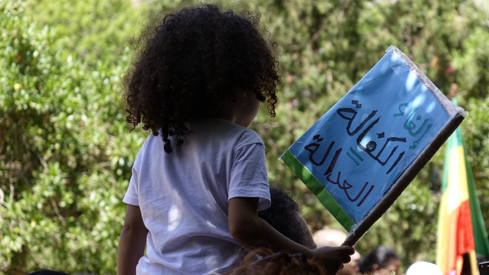
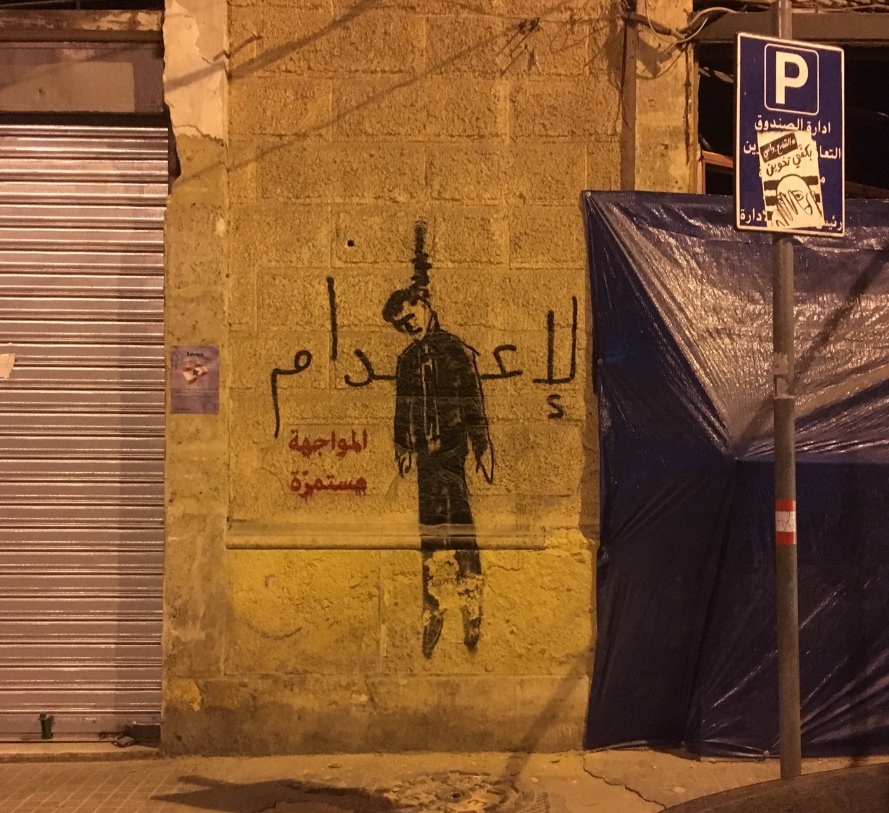
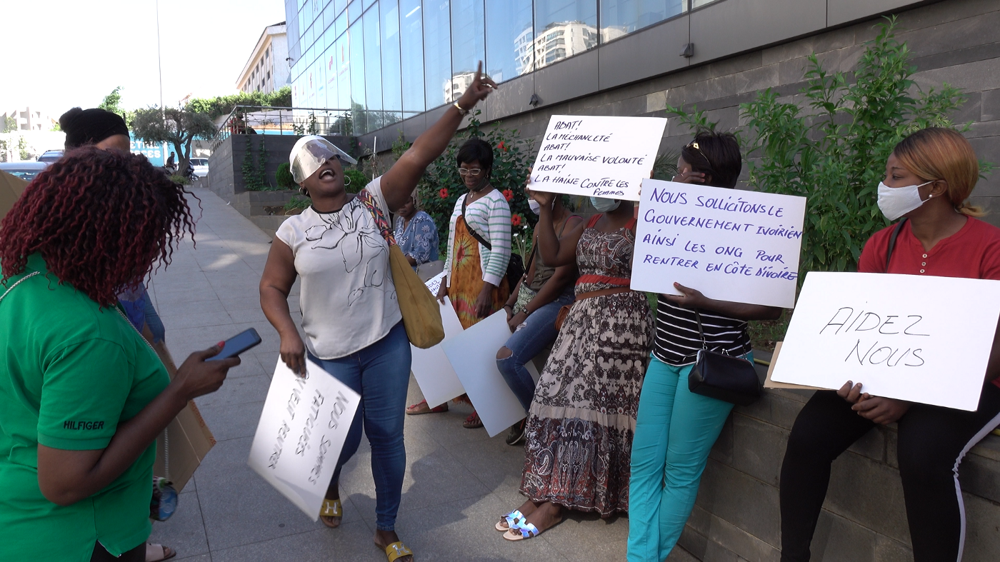
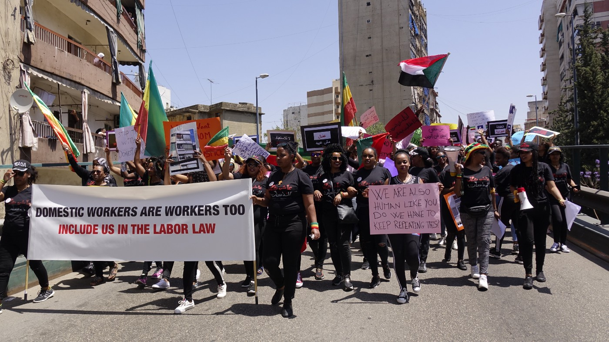

### AYS Special from Lebanon: **Escalating Vulnerability in Current Crisis**

_The explosion at the port of Beirut on August 4th has worsened a widespread economic, social and political crisis\. Migrant and refugee women are particularly vulnerable to the combined effects of the pandemic and the dire economic situation, in a country where their rights are not recognised\._

Photo by Nina Bazin

A 4 year old girl runs up to me while walking in Hamra, Beirut\. Her tiny hands are wide open asking for money\. I tell her softly to return to her mother, and she runs back to her with her pigtails swaying side to side\. I can tell it is the first time she has begged; because children who have been begging longer, continue to insist on money\. I later spoke to her mother, Zahra\. She tells me she is a single mother with 4 children, she also has to take care of her mother who lives with her and is sick\. They are from Homs, Syria\. Her husband left them a few years ago, went back to Syria and she hasn’t heard from him since\. She doesn’t stay on the street long, just enough to collect the month’s rent of 300,000 Lebanese Pounds \(LBP\) — with today’s economy it is equivalent to $40 US Dollars\. She tells me “no one will sit on these streets unless they have to”\. She said she works in the morning cleaning homes but it is impossible to make enough for rent\.

Lebanon is currently undergoing a devastating economic crisis that began last year around January with a fluctuating Lebanese Lira, often rising to 9,000 LBP per US dollar \($\) compared to the original exchange rate of 1,500 LBP per US dollar\. This is in addition to the general turmoil and struggles caused by the demand for political change, COVID\-19, and the chemical explosion in the port of Beirut on August 4th\. The income that used to provide basic necessities for a family like Zahra’s, is no longer providing the minimum\. As a result, Syrian refugees who are in Lebanon experience more difficulties and oppressions with the current crisis\. There are Syrian citizens who cannot travel — to Europe or the United States — nor return to Syria because they lack legal documents or have been exiled by the Syrian government\.

Lebanon is home to more than 120,000 migrant workers hailing from African, Asian, and Eastern European countries including Sierra Leone, Kenya, Sri Lanka, Nepal, the Philippines and Russia, and home to around 1,700,000 refugees from neighbouring countries like Syria, Palestine, Eritrea, Sudan and Ethiopia\. For refugees, Lebanon is the nearest safe country\. For migrant workers, Lebanon has a high demand for low wage migrant workers and is unfortunately a part of the modern slavery system\. On the other hand, migrant workers are deceived by the image of prosperity in Arab countries\. The country’s current situation is felt by all, however the burdens of the crisis fall mostly on the lives of the most vulnerable and underprivileged communities such as the poorer Lebanese families, migrants and refugees\. Many are undocumented\. They feel paralysed since they cannot move forward\. For example, Genet, from Ethiopia, who is undocumented, is a single mother in Lebanon\. Her baby is 2 years old\. She cannot return home because her father threatened to kill her for having a baby out of marriage\.

Sophia is a domestic worker in Beirut\. She is from Côte d’Ivoire\. She says her employer stopped paying her salary of $200 a month for a 24/7 work schedule 7 months ago\. Every time she requested her salary, the employers beat her, and would threaten to take her to jail and accuse her of stealing\. When she finally gave an ultimatum demanding her salary or leaving, the employer told her to pack her belongings and threw her on the street a few neighbourhoods away\. Now she is waiting for repatriation but in the meantime sleeps at multiple friends’ houses, and works 4 hours a week, where she gets paid 10,000 LBP an hour — equivalent to $1\.5 US dollars\. This occasional, exploitative part\-time job, that does not even provide her a day’s food supply, puts her in danger of being arrested since freelance work is categorised as an illegal work status as she is no longer sponsored by a Lebanese resident under the Kafala \(Sponsorship\) system \[1\] \. The Lebanese sponsors treat the rights of migrant workers nonchalantly in a State that does not enforce the rights of non\-citizens\. The Lebanese government has not adopted a strong and coherent stance on racist and exploitative actions against migrant workers\.

Sinay is from Sierra Leone\. She left her sponsor’s home in 2017 because, in addition to inconsistent payment of her wages, she was beaten and yelled at often\. She regularly sends money to her 3 children who remain in Sierra Leone under the care of her neighbour\. She borrowed $500 from a cousin to pay her smuggler, she also has to pay off that debt\. Sinay tried to find freelance jobs, but with the COVID\-19 lockdown she was forced to stay home\. In addition, when the explosion occurred, she was left homeless\. One night she was raped by two men\.

Photo by Nina Bazin

As migrant workers turn towards their embassies and consulates, there is no sufficient support nor safety net ready for them\. We saw this with the Kenyan embassy and the number of women who protested outside the embassy headquarters demanding they be sent home\. Foreign initiative aid has now helped the women return to Kenya\. Other embassies, like the Ethiopian embassy, are requesting that migrant workers pay for their return flights home in US dollars\. It is an impossible task considering the extremely low wages and the high conversion rates\. On another note, embassies are often involved in the trafficking and exploitation of their citizens\. For example, the “artist visa” is an agreement between the Lebanese government and the embassies of European countries like Ukraine and Russia to recruit European women as dancers for clubs in Lebanon\. They are frequently beaten and forced to work through sex trafficking, their passports confiscated\. This artist visa legalises the criminal activities of pimps and governments, trapping the women in sex work\.

Photo by Nina Bazin

The near future looks grim for people caught in this power\-politics chaos\. People migrate mostly out of necessity rather than by choice\. Migration should follow different laws to make it safer and more flexible\. Migrant workers need to be included in the Lebanese Labour Law, and refugees need to be supported in rebuilding their lives rather than becoming dependent on the funding of organisations\. Organisations themselves need to shift their power dynamics and work to offer these communities jobs and autonomy\. We need to address the issues these communities are facing in more diverse ways\. There are many grassroots initiatives and organisations who work on supporting the rights of these communities\. At the moment, their efforts are directed towards providing shelter, food, repatriation, psychosocial support, cash or legal assistance such as [Egna Legna](https://egnalegna.org/) , [KAFA \(enough\) Violence & Exploitation](https://www.kafa.org.lb/ar) , [SAWA for Development and Aid, Border Free](http://www.sdaid.org/) , [Syrian Eyes](http://www.syrianeyes.org/) , and [Bird of LYF](http://birdoflyf.com/) \. For more information on the work they do and to make donations, please visit their websites\.

**_\(Mona Ayoub is a visual artist, human rights & feminist activist and social worker, currently working in Beirut, Lebanon\)_**

\[1\] For more information on the Kafala \(Sponsorship\) system in Lebanon visit: [https://slavefreetoday\.org/lebanon\-domestic\-workers\-in\-the\-shadow\-of\-kafala\-system\-and\-covid\-19/](https://slavefreetoday.org/lebanon-domestic-workers-in-the-shadow-of-kafala-system-and-covid-19/)

**Find daily updates and special reports on our [Medium page](https://medium.com/are-you-syrious) \.**

**If you wish to contribute, either by writing a report or a story, or by joining the info gathering team, please let us know\.**

**We strive to echo correct news from the ground through collaboration and fairness\. Every effort has been made to credit organisations and individuals with regard to the supply of information, video, and photo material \(in cases where the source wanted to be accredited\) \. Please notify us regarding corrections\.**

**If there’s anything you want to share or comment, contact us through Facebook, Twitter or write to: areyousyrious@gmail\.com**

_Converted [Medium Post](https://medium.com/are-you-syrious/ays-special-from-lebanon-escalating-vulnerability-in-current-crisis-3a60947698c8) by [ZMediumToMarkdown](https://github.com/ZhgChgLi/ZMediumToMarkdown)._
