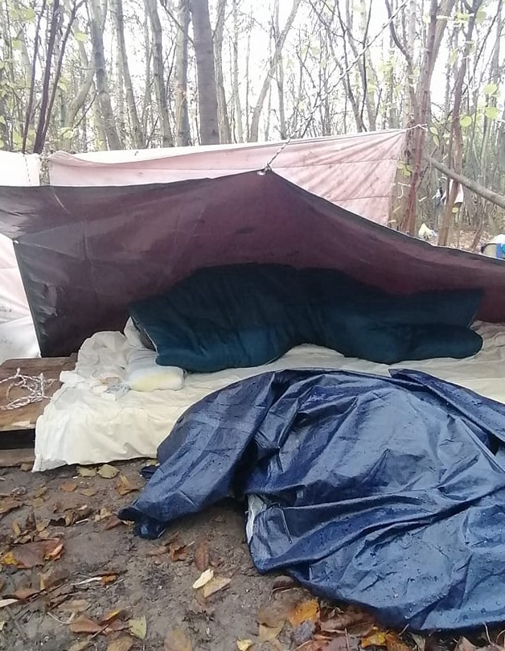

### AYS Daily Digest 20/11/20: “No choice but to work with despotic regimes”
### lowest resettlement levels in recent history / France: violent evictions and a big change in relation to Afghan asylum seekers / new pre\-deportation centres in the Canary islands / the lowest number of asylum applications in Finland since the 90s / recommended reads & more

[Are You Syrious?](?source=post_page-----1d37f5db6e1c--------------------------------)

[Nov 21](ays-daily-digest-20-11-20-no-choice-but-to-work-with-despotic-regimes-1d37f5db6e1c?source=post_page-----1d37f5db6e1c--------------------------------) · 9 min read

### FEATURED

The president of Germany’s parliament has said that on migration the EU has no choice but to work with despotic regimes — and suggested the possibility of offshoring detention\. Speaking at a conference on Thursday co\-organised by the German EU presidency and the European Parliament, W\. Schauble said that the EU deal with Turkey “really didn’t work out” \(We will skip commenting this\) \.

> _“We need to recognise that we are reliant on cooperation with dubious powers and regimes in the areas of transit and origin,” he was quoted saying, without citing specific countries\._ 

Demonstrating that it is often easier to agree on what others should do than on what we should do, it appears that the political agreement that will be the culmination of the German EU Presidency will focus strongly on external “cooperation”\. 
Proposals under discussion involve familiar and novel elements, says [ECRE Director Catherine Woollard](https://www.ecre.org/editorial-an-offer-you-cant-refuse.../) \.

2020risks lowest resettlement levels in recent history\. Unfortunately needs are not matched by pledges, which means that refugees in urgent need of this solution may have to wait much longer, the UN Agency admitted\.
### GREECE

“Last week, we received footage from inside Tychero Borderguard Station\. Although officially no longer in service since 2013, as stated in the report released yesterday by Europe’s anti\-torture committee CPT, it is very much involved in pushbacks\!” — AlarmPhone team writes\.
### Abolishing the practice of protective custody for unaccompanied minors

The Ministry of Migration & Asylum in cooperation with the Ministry of Citizen Protection will soon present a legislative initiative to the Greek parliament, in order to abolish the practice of protective custody for unaccompanied minors\. Α mechanism for the early identification, referral and accommodation of UAMs that cross into Greek territory has been developed in collaboration with UNHCR and will allegedly be fully operational by the end of the year\. They reported that “this will allow the SSPUAM to trace the UAMs very quickly, accommodate them in emergency accommodation shelters and then place them in long\-term shelters\.”

### BOSNIA AND HERZEGOVINA
### Velika Kladuša

The [No Name Kitchen](https://www.facebook.com/NoNameKitchenBelgrade/?__tn__=-UC*F) team in Velika Kladuša reports they have been documenting new cases of police violence against people on the move\.

> _Many testimonies tell us how Croatian security forces burn all their belongings before their eyes, making their forced return to Bosnia even more difficult\. Without shoes, jackets, socks or a mobile phone, many people on the move find themselves without anything to survive on when back in B&H again\._ 

That’s why they have been distributing clothes and shoes for people on the move in the area\. “Thanks to the many donations received from all the people who are constantly supporting us, we have been able to buy more than 100 pairs of shoes in local shops\. Thanks to the help of our local teammate here, we were able to get a discount,” they write\.

> _“…all these shoes will most likely end up as ashes, like the countless clothes of thousands of people who have tried to cross the border in search of a decent life\. Although ephemeral, without shoes like these it would be impossible for them to continue their journey\.”_ 

### EU
### An important ruling of the European Court of Justice

In a recent case of a young man from Syria, the asylum authorities in Germany decided that he did not qualify for asylum as he “did not face persecution on political grounds because of his race, nationality, political opinion, fundamental religious conviction or membership of a particular social group,” given that he fled from serving in the military of the country’s violent regime\. This was not seen as sufficient grounds for asylum\.

However…\! In its [preliminary ruling](http://curia.europa.eu/juris/document/document.jsf?text=&docid=233922&pageIndex=0&doclang=EN&mode=lst&dir=&occ=first&part=1&cid=13884616) , the ECJ disagreed with this assessment\.

> _In its ruling, the court [wrot](https://www.infomigrants.net/en/post/28655/fleeing-military-draft-can-be-grounds-for-asylum-finds-eu-s-highest-court?fbclid=IwAR1m3XW0THbOk9nTbxINuzjBJtaz3rEQ3sT3sVkZ9jSCSVk2mBG1XzCbTRo) e that “refusal to perform military service, particularly where it is punishable by heavy sanctions, suggests that there is a high degree of conflict in political or religious values and opinions between the person concerned and the authorities of the country of origin\.”_ 

The Court noted that, with regard to the well\-documented fact that the Syrian army repeatedly and systematically committed war crimes, it is highly plausible that a conscript would be led, regardless of his or her field of operation, to participate directly or indirectly in the commission of such crimes, ECRE reports\.
### Flight deportations ongoing

More and more organisations and individuals are standing up against the practice of deportations put in practice through collaborative work with the airline companies:
### BULGARIA
### Petition for the rights of undocumented people

According to information from the Ministry of the Interior, as of June 2019, about 900 foreigners residing in the country were registered as undocumented\. Their actual number is probably higher\.

> _What does it mean to be an undocumented person in Bulgaria? You can’t work legally, you can’t rent accommodation, you can’t go to the doctor, you can’t drive or study\. You cannot even marry or enroll as a parent in the birth certificate of your own child\. You rely on the good will of friends to help you experience and live on the edge, outside the system and in constant fear and tension\._ 

> _What can be done? In most countries in Europe and beyond, there are legislative mechanisms to address this issue\. They provide an opportunity for people who have resided in the country without documents for a period of at least several years, have not violated the law, have established lasting personal and social ties, have worked and integrated into society, to apply for the right of residence\. There are no such legislative paths in Bulgaria\._ 

> _We therefore call on the legislature to discuss and adopt legal provisions that will enable these people to truly become full members of society and to contribute to it, which is the dream of each of them\. In a coalition with other non\-governmental organizations and lawyers, we have developed specific texts to amend the Law on Foreigners in the Republic of Bulgaria, which you can read [here](https://centerforlegalaid.com/file/files/fname/20201026-211218/LFRB%20Changes%20and%20Justification.pdf) , together with a detailed description of the problem and justification\._ 

### [Sign the Petition](https://www.change.org/p/%D0%B7%D0%B0%D0%BA%D0%BE%D0%BD%D0%BE%D0%B4%D0%B0%D1%82%D0%B5%D0%BB%D0%BD%D0%B0%D1%82%D0%B0-%D0%B2%D0%BB%D0%B0%D1%81%D1%82-%D0%BF%D1%8A%D1%82%D0%B5%D0%BA%D0%B0-%D0%B7%D0%B0-%D1%85%D0%BE%D1%80%D0%B0%D1%82%D0%B0-%D0%B1%D0%B5%D0%B7-%D0%B4%D0%BE%D0%BA%D1%83%D0%BC%D0%B5%D0%BD%D1%82%D0%B8-%D0%B2-%D0%B1%D1%8A%D0%BB%D0%B3%D0%B0%D1%80%D0%B8%D1%8F?utm_source=share_petition&utm_medium=custom_url&recruited_by_id=1b83a250-3d5b-11e8-bc6c-1df753192b00&fbclid=IwAR03k17kU9FYXK5XQj7bXdWsM8Fj6gL87mUI5NZCo-PLw6UmHQj3ZlLdMkk)
### [Хората без документи в България са навсякъде сред нас\. Те са в нашите квартали, училища, семейства, в автобуса или в…](https://www.change.org/p/%D0%B7%D0%B0%D0%BA%D0%BE%D0%BD%D0%BE%D0%B4%D0%B0%D1%82%D0%B5%D0%BB%D0%BD%D0%B0%D1%82%D0%B0-%D0%B2%D0%BB%D0%B0%D1%81%D1%82-%D0%BF%D1%8A%D1%82%D0%B5%D0%BA%D0%B0-%D0%B7%D0%B0-%D1%85%D0%BE%D1%80%D0%B0%D1%82%D0%B0-%D0%B1%D0%B5%D0%B7-%D0%B4%D0%BE%D0%BA%D1%83%D0%BC%D0%B5%D0%BD%D1%82%D0%B8-%D0%B2-%D0%B1%D1%8A%D0%BB%D0%B3%D0%B0%D1%80%D0%B8%D1%8F?utm_source=share_petition&utm_medium=custom_url&recruited_by_id=1b83a250-3d5b-11e8-bc6c-1df753192b00&fbclid=IwAR03k17kU9FYXK5XQj7bXdWsM8Fj6gL87mUI5NZCo-PLw6UmHQj3ZlLdMkk)
#### [www\.change\.org](https://www.change.org/p/%D0%B7%D0%B0%D0%BA%D0%BE%D0%BD%D0%BE%D0%B4%D0%B0%D1%82%D0%B5%D0%BB%D0%BD%D0%B0%D1%82%D0%B0-%D0%B2%D0%BB%D0%B0%D1%81%D1%82-%D0%BF%D1%8A%D1%82%D0%B5%D0%BA%D0%B0-%D0%B7%D0%B0-%D1%85%D0%BE%D1%80%D0%B0%D1%82%D0%B0-%D0%B1%D0%B5%D0%B7-%D0%B4%D0%BE%D0%BA%D1%83%D0%BC%D0%B5%D0%BD%D1%82%D0%B8-%D0%B2-%D0%B1%D1%8A%D0%BB%D0%B3%D0%B0%D1%80%D0%B8%D1%8F?utm_source=share_petition&utm_medium=custom_url&recruited_by_id=1b83a250-3d5b-11e8-bc6c-1df753192b00&fbclid=IwAR03k17kU9FYXK5XQj7bXdWsM8Fj6gL87mUI5NZCo-PLw6UmHQj3ZlLdMkk)
### FRANCE

In the north of the country, evacuations of entire areas and evictions of makeshift camps continue, activists report:

More than 400 people living rough in this area are affected by the police actions\. Of course, along with that, CRS \(the French riot police\) has been monitoring, questioning, and disrupting volunteers during food distributions in the new, permitted locations\.
### Violent eviction results in severe injuries

On November 11, a CRS intervention in a migrant camp escalated\. The CRS used “several tear gas grenades and five rounds of defence bullets \(LBD\)”, the Pas\-de\-Calais prefecture stated officially\. An Eritrean was hit in the face by LBD 40 fire\. He is still hospitalized in an apparently worrying condition\. According to several testimonies gathered from the people in the area, a projectile of LBD hit the man in the face\. A week later, he is still hospitalized, according to information gathered by Utopia 56 Calais\. See [here](https://www.streetpress.com/sujet/1605710189-calais-erythreen-gravement-blesse-visage-par-tir-lbd40-immigration-jungle-repression-france) for more information\.
### France reviews its position on Afghanistan

_In two decisions, the National Asylum Court considers that the violence reigning in Kabul does not justify granting international protection\._

The National Court of Asylum \(CNDA\) made public two decisions dated 19 November that **put an end to the so\-called “Kabul” jurisprudence** , in force since 2018\. Until then, it allowed the CNDA to grant almost systematic protection to Afghan asylum seekers\. Although they would not be personally persecuted in their country, it was considered that a serious threat was hanging over them because of the indiscriminate violence prevailing in Kabul, the city through which a rejected asylum seeker must pass when sent back to their country\.
According to the official numbers, about 61,000 people from Afghanistan have demanded international protection in Europe in the past year, but — contrary to the common belief — most of those who fled the country are in fact in neighbouring Pakistan, not in Europe\.

On the other hand, after the North African tour by the French Interior Minister, the country has now **threatened to reduce the number of visas granted to citizens of countries that are reluctant to take back their undocumented nationals** , particularly those on radicalization watch\-lists, as [reported](https://www.infomigrants.net/en/post/28593/forced-return-france-warns-of-visa-reductions-for-countries-refusing-to-take-back-their-nationals?fbclid=IwAR1NxtwT_W_iwo3L5rpx68YwwoQis9TqYJDdrgl1Zmie10vErqbgTJVjvlA) \.
### SPAIN
### As the surge continues, Spain forms a hotspot

The Spanish Ministry of Migration has announced a plan to create camps on Gran Canaria, Tenerife, and Fuerteventura with 6,000 places for the people currently spread over 17 tourist complexes, and the media have been reporting about it in different ways\. Gran Canaria is thus becoming a potential Lesbos or Lampedusa\.

> _The newly arrived people won’t be transferred to the mainland but await deportation in a center set up for this purpose\._ 

“The plan also involves reinforcing Salvamento Maritimo’s coastguard rescue teams in the area, alongside a diplomatic offensive as part of a concerted push to address the crisis on the islands, where more than 12,000 people have landed since September”, the media [reported\.](https://timesofmalta.com/articles/view/spain-to-set-up-camps-for-7000-migrants-in-canaries.833338?fbclid=IwAR1pK_vT2pQZWyPEKUgVO6tMfIkasFKuDjMOcvulMPmw5jau65x2jecgZWA)

So far, the conditions in such temporary accommodation have never been designed for a humane stay and, in spite of that, the public seems to be turning a blind eye to official policies that defy our own laws, to say the least\. We should, however, be aware of the growing number of ideas that go against basic human rights and lead to policies and practices resulting in really abysmal scenarios such as [this one](https://l.facebook.com/l.php?u=https%3A%2F%2Fwww.malaymail.com%2Fnews%2Fmalaysia%2F2020%2F11%2F20%2Fismail-sabri-wristband-for-migrants-just-a-proposal-will-be-presented-to-se%2F1924384%3Ffbclid%3DIwAR2s60fRFttkOu6hsvLAEgyyeMlQ-bMcjO0Y5nWytcWIi8C6LvViFveuYQk&h=AT2fUzLq8LrbVZmx8kNYCsVbtQw0oLvogWO1hj10188yLsWEZDmtalKvEaHIfBlmaXjzYf4gdYgXptflQgQNJB076JirNGFB2ohK6K8D-DVQwHc1OGpHyR0VVxAz3P4BsQQsLImedrThcA&__tn__=R]-R&c[0]=AT1lnWKd-hKDsD2fo64N9-Jj54Zf3LOOeShsDfK3D0XyhAsT-gjeGiwB6i-WP49WmM1CZmLrKjmLGTYnr7pgwx1wFL-J0VRYKV5M8WzSZORO0rLbnBvlVUDEI7fjmovvEDIdOYkGtjowpwT88L2CsTPLwHmoT68CAiVYKqXwQAQLwx9VmByJTp-FtBtJy18XeNeLCtaXg-QooAX03A) \. Warning about these ideas and insisting on decency at all times is something we must never get tired of\.
### GERMANY
### COVID\-19 info for people in Germany

> **_What is true or good advice now can rapidly become out of date, so it’s important to check sites that are updated regularly\. Here’s a general guide for migrants and refugees in Germany:_** 

### [COVID\-19 information for migrants and refugees in Germany](https://www.infomigrants.net/en/post/28605/covid-19-information-for-migrants-and-refugees-in-germany?fbclid=IwAR2ZZ1wNmR1F3gucbyPiL9knSuGDGj8c6QUeLYmMIw9v0k27X9R7V-zDU60)
### [The COVID\-19 pandemic is changing every day\. What is true or good advice now can rapidly become out\-of\-date, so it’s…](https://www.infomigrants.net/en/post/28605/covid-19-information-for-migrants-and-refugees-in-germany?fbclid=IwAR2ZZ1wNmR1F3gucbyPiL9knSuGDGj8c6QUeLYmMIw9v0k27X9R7V-zDU60)
#### [www\.infomigrants\.net](https://www.infomigrants.net/en/post/28605/covid-19-information-for-migrants-and-refugees-in-germany?fbclid=IwAR2ZZ1wNmR1F3gucbyPiL9knSuGDGj8c6QUeLYmMIw9v0k27X9R7V-zDU60)
### FINLAND
### Reception centre occupancy at historically low level

The unadjusted asylum systems of Europe during the pandemic continue to affect the number of people seeking asylum in the EU Member States\. An example of this is Finland\. The Finnish government has made a commitment to take in a total of [175 people from Mediterranean refugee camps](https://yle.fi/uutiset/osasto/news/finland_agrees_to_house_175_asylum_seekers_from_mediterranean_camps/11223016) \. Even so, only 25 people arrived recently from one of the camps in Malta, where they had been waiting for a long time, and 175 is good news, but a drop in the ocean of the reality at hand\. With many empty reception centres across the country, Finland is one of the EU countries who agreed to receive people from the camps in Greece, Cyprus, Malta and Italy, but in spite of the needs on the one hand, and possibilities, space and ways to successfully accept more people on the other, thousands are still stuck in limbo\. Many of them will go through yet another hard, traumatic winter sleeping rough next to “the land of plenty\.”

> _Fewer than 1,100 new asylum applications have been registered in Finland this year, which is the lowest number since the 1990s_ 

### FOR FURTHER READING
- On World Children’s Day, take some time to study the exclusion and exploitation of unaccompanied minors in Greece, Italy and Spain in our [one](https://rosalux.gr/.../public.../children-cast-adrift-greece) or the [other](https://rosalux.gr/.../children-cast-adrift-comparative...) edition by Rosa Luxembourg Foundation
- on the crisis of reporting in the Western Balkans:

### [How Do the Croatian and Serbian Media Report Migration? — Media Diversity Institute](https://www.media-diversity.org/how-do-the-croatian-and-serbian-media-report-migration/?fbclid=IwAR1xnZ55j8DGdaJH-a3vqfoH2aj3W-yHm1mOuVONGfFJwb8F0c5wQ1aeEf0)
### [“I would rather meet a bear in the woods then a group of migrants”, wrote Tomislav Majnaric, a mountain climber and…](https://www.media-diversity.org/how-do-the-croatian-and-serbian-media-report-migration/?fbclid=IwAR1xnZ55j8DGdaJH-a3vqfoH2aj3W-yHm1mOuVONGfFJwb8F0c5wQ1aeEf0)
#### [www\.media\-diversity\.org](https://www.media-diversity.org/how-do-the-croatian-and-serbian-media-report-migration/?fbclid=IwAR1xnZ55j8DGdaJH-a3vqfoH2aj3W-yHm1mOuVONGfFJwb8F0c5wQ1aeEf0)
- **El Hiblu 3 need your help to live their lives free of the threat of imprisonment:**

“Faced with the imminent danger of drowning, and following assurances from the crew that they would not be returned to Libya, most — including three young boys, aged 15, 16 and 19 — climbed aboard\. Six men, too scared of the risk of being taken back to Libya, decided to remain on the dinghy\. Their fate remains unknown\.”
### [Free\-ElHiblu3](https://l.facebook.com/l.php?u=https%3A%2F%2Felhiblu3.info%2F%3Ffbclid%3DIwAR1GAqt7nCQoyu5IRQC4u3OmB7qrn2aBbnubtojJIBajMqQZzd3hE2Z7eAI&h=AT1miJXHg5RsYDSWeCEO1_yjREDgkDL4tjZnyG-8Upw4LmJahvfgGZb76C5_iTLXKVtjHD_ire9KugCGT9QeG0jzGJVCl2FEhuSyf-Yu4XbfzKNfiiDwQoNTlGN0PgSZ6DMfpKwow30ORQ&__tn__=R]-R&c[0]=AT3cNWry4GOjcvPY-XkakHx8MEGZ2jjs6_oVUrGgELo-PE8F9DFDqIjliPZgAu-AjXMEEg1p-ItVsJJURE6EZBJPXi1jzbnsiS25JPmj2o_daDPGn7Cdp3eItvIEKi0YiqWEVLmV94LN9gLdDHLOQwX09TivYAaJ2wASbYkLIK5zoOtxlOCZE41Ajw7naqTfbSZmTDCWfpHrOelZVw)
### [Free the El Hiblu 3 — dismiss the trial immediately\! Resisting illegal push\-backs to Libya is not a crime\. Appeal to…](https://l.facebook.com/l.php?u=https%3A%2F%2Felhiblu3.info%2F%3Ffbclid%3DIwAR1GAqt7nCQoyu5IRQC4u3OmB7qrn2aBbnubtojJIBajMqQZzd3hE2Z7eAI&h=AT1miJXHg5RsYDSWeCEO1_yjREDgkDL4tjZnyG-8Upw4LmJahvfgGZb76C5_iTLXKVtjHD_ire9KugCGT9QeG0jzGJVCl2FEhuSyf-Yu4XbfzKNfiiDwQoNTlGN0PgSZ6DMfpKwow30ORQ&__tn__=R]-R&c[0]=AT3cNWry4GOjcvPY-XkakHx8MEGZ2jjs6_oVUrGgELo-PE8F9DFDqIjliPZgAu-AjXMEEg1p-ItVsJJURE6EZBJPXi1jzbnsiS25JPmj2o_daDPGn7Cdp3eItvIEKi0YiqWEVLmV94LN9gLdDHLOQwX09TivYAaJ2wASbYkLIK5zoOtxlOCZE41Ajw7naqTfbSZmTDCWfpHrOelZVw)
#### [l\.facebook\.com](https://l.facebook.com/l.php?u=https%3A%2F%2Felhiblu3.info%2F%3Ffbclid%3DIwAR1GAqt7nCQoyu5IRQC4u3OmB7qrn2aBbnubtojJIBajMqQZzd3hE2Z7eAI&h=AT1miJXHg5RsYDSWeCEO1_yjREDgkDL4tjZnyG-8Upw4LmJahvfgGZb76C5_iTLXKVtjHD_ire9KugCGT9QeG0jzGJVCl2FEhuSyf-Yu4XbfzKNfiiDwQoNTlGN0PgSZ6DMfpKwow30ORQ&__tn__=R]-R&c[0]=AT3cNWry4GOjcvPY-XkakHx8MEGZ2jjs6_oVUrGgELo-PE8F9DFDqIjliPZgAu-AjXMEEg1p-ItVsJJURE6EZBJPXi1jzbnsiS25JPmj2o_daDPGn7Cdp3eItvIEKi0YiqWEVLmV94LN9gLdDHLOQwX09TivYAaJ2wASbYkLIK5zoOtxlOCZE41Ajw7naqTfbSZmTDCWfpHrOelZVw)
- “Made into a migrant” — Migrantification brings together the various techniques used to class people into subcategories such as economic migrant, refugee, asylum seeker or illegal migrant:

### [Nobody is born a migrant — but it’s a label people on the move struggle to escape](https://theconversation.com/nobody-is-born-a-migrant-but-its-a-label-people-on-the-move-struggle-to-escape-148574?fbclid=IwAR0adJ3qyQniwWWmIn1I4vkIOwjjQPTu2YLv8TBUXk4CXLoC6yis839uXR0)
### [The tragic death of four members of a Kurdish\-Iranian family attempting to cross the English Channel in late October…](https://theconversation.com/nobody-is-born-a-migrant-but-its-a-label-people-on-the-move-struggle-to-escape-148574?fbclid=IwAR0adJ3qyQniwWWmIn1I4vkIOwjjQPTu2YLv8TBUXk4CXLoC6yis839uXR0)
#### [theconversation\.com](https://theconversation.com/nobody-is-born-a-migrant-but-its-a-label-people-on-the-move-struggle-to-escape-148574?fbclid=IwAR0adJ3qyQniwWWmIn1I4vkIOwjjQPTu2YLv8TBUXk4CXLoC6yis839uXR0)

**Find daily updates and special reports on our [Medium page](https://medium.com/are-you-syrious) \.**

**If you wish to contribute, either by writing a report or a story, or by joining the info gathering team, please let us know\.**

**We strive to echo correct news from the ground through collaboration and fairness\. Every effort has been made to credit organisations and individuals with regard to the supply of information, video, and photo material \(in cases where the source wanted to be accredited\) \. Please notify us regarding corrections\.**

**If there’s anything you want to share or comment, contact us through Facebook, Twitter or write to: areyousyrious@gmail\.com**

_Converted [Medium Post](https://medium.com/are-you-syrious/ays-daily-digest-20-11-20-no-choice-but-to-work-with-despotic-regimes-f7e4c09f82e1) by [ZMediumToMarkdown](https://github.com/ZhgChgLi/ZMediumToMarkdown)._
