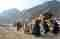
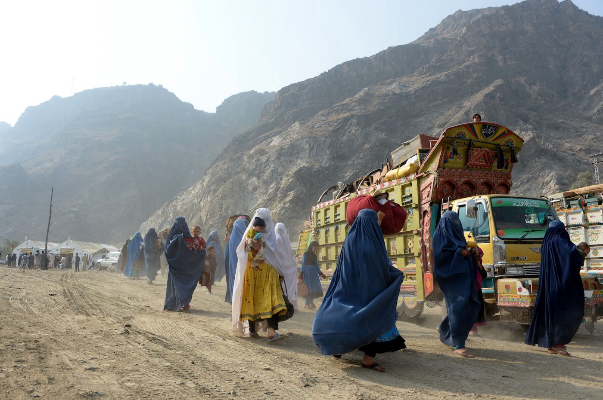
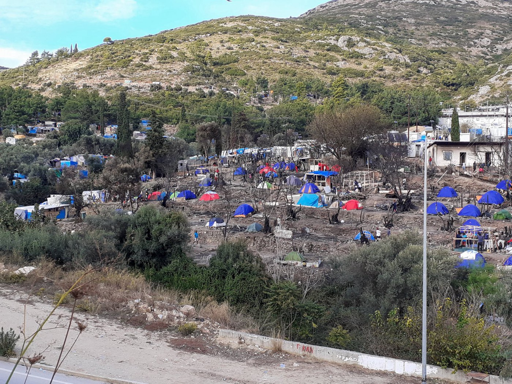
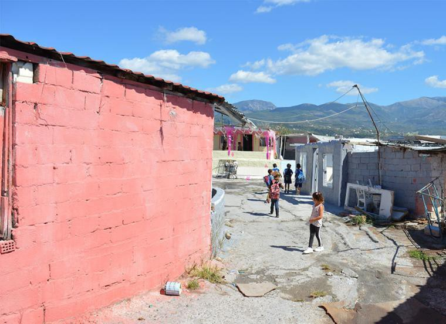
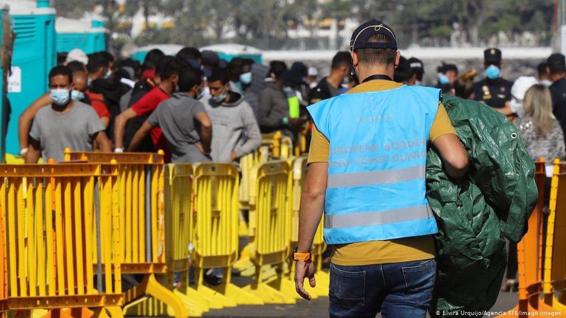
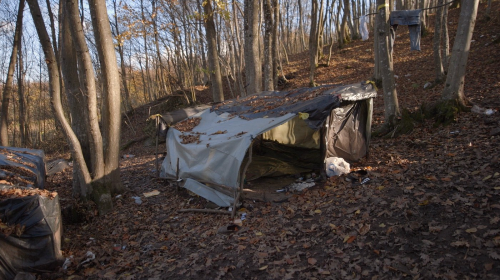
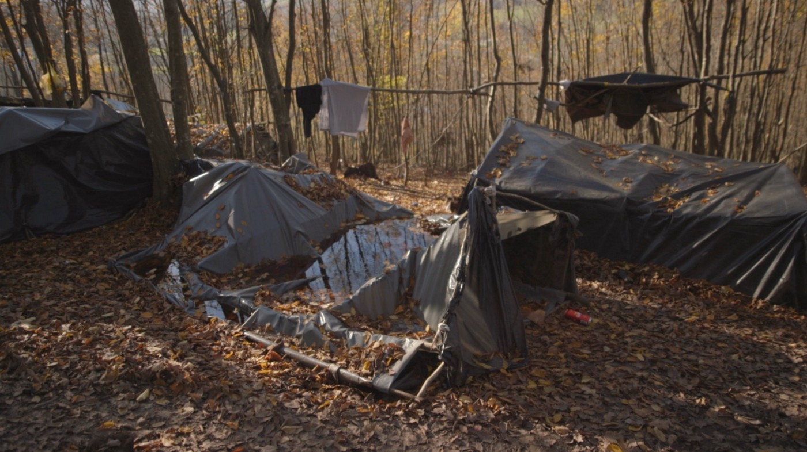

### AYS Daily Digest 23/11/20 Utopia 56 occupation of the Place de la République

[Are You Syrious?](?source=post_page-----d98295066562--------------------------------)

[Nov 24](ays-daily-digest-23-11-20-utopia-56-occupation-of-the-place-de-la-république-d98295066562?source=post_page-----d98295066562--------------------------------) · 9 min read

_Drownings off Rhodes // critical situation in Afghanistan // judge says “no criminal offense” at Arguinguin dock // Italy and Spain negotiate with African countries // and more…_

### FEATURE: OCCUPATION OF THE PLACE DE LA RÉPUBLIQUE FOLLOWING PARIS EVICTIONS

Utopia 56 covered the occupation that took place on Monday evening in Paris in response to the violent evacuation of the camp in Saint Denis on 17/11/20\. The police took [100s of euros](https://twitter.com/Utopia_56/status/1330962803755278339) of donated tents which left 700–1000 people homeless without any solutions\.

Utopia 56 [tweeted](https://twitter.com/Utopia_56/status/1330988248714317827) “ _Expelled from Place de la République, more than 300 of us are walking towards the Town Hall to ask for human dignity through shelters, accommodation and a permanent reception system for exiled people\._ ” There were moments where the protestors were [surrounded by the police](https://twitter.com/Utopia_56/status/1330995799455657985?fbclid=IwAR2Yztmcrs_phVkbLc0Qgyxa8T-vKFEki_tn3t8xZtJmoAJgtE2o16-icms) and chased\. The police also continued to remove tents, sometimes with people still in them \(watch video below\):

Here are some of their demands from a [statement](http://www.utopia56.com/en/actualite/paris-occupation-place-republique-a-partir-ce-soir) Utopia 56 released on Monday:

> _“It is now vital to make their situation visible with the support of our associations and volunteers\. Faced with the lack of concrete responses from the public authorities, we are therefore united alongside the exiled people who are pitching their tents from this evening, Place de la République in Paris\. We will not leave before the public announcement and guarantees of a solution in place\._ 

> **_We ask the prefecture as well as the town hall of Paris and the government to create 1,000 immediate unconditional accommodation places in order to be able to shelter these people\. Added to this is respect for their fundamental rights as well as the immediate and continuous cessation of police violence against these populations\._** 

> _At the same time, we are continuing to take legal action against the action taken by the police services during the evacuation last Tuesday\. About thirty IGPN reports have been made\. The filing of complaints against the prefecture and the Ministry of the Interior is in progress\._ 

> _Once again, and this after a 66ᵉ large\-scale evacuation, **we are asking for the establishment of a decent first reception system for exiled people allowing immediate access to accommodation solutions on their arrival on the** territory\. A mechanism present in the vast majority of European countries and which allows the protection of these people as well as avoiding the creation of informal camps in the public space\.”_ 

Please continue to follow [Utopia 56](https://twitter.com/Utopia_56) for updates\. They are planning on having a [follow up demonstration](https://twitter.com/Utopia_56/status/1331231084047175680) tonight, 24/11/20\.
### AFGHANISTAN

### UNHCR: Displacement in Afghanistan needs solutions now

United Nations High Commissioner for Refugees [Filippo Grandi](https://www.unhcr.org/news/press/2020/11/5fba88884/un-high-commissioner-refugees-warns-grave-consequences-world-looks-afghanistan.html?fbclid=IwAR1Q6hzefF0_IB_5W552FF7hZYiBbpSY8sFOPeZb7iwa1eCSho_GFtGUrg8) has just finished a five\-day visit to Afghanistan\. Grandi is stressing in a new press release that the country is at a critical juncture\. International support is needed to bring about a peace agreement and humanitarian aid for those displaced:

> _“He recalled that nearly 300,000 Afghans have been internally displaced due to conflict in 2020 alone\. They remain in acute need of humanitarian support, as do the nearly three million previously displaced and the nine million people who have lost their livelihoods due to the ongoing COVID\-19 crisis\.”_ 

Further elaborating on this, the Afghanistan Migrants Advice & Support Org released a statement on the Geneva convention that is currently underway:

> _“100 donor countries are gathering today and tomorrow to continue their support for the Afghan government\. Amidst all the support, we demand from the European and Afghan governments not to prolong the Joint Way Forward agreement or make any other agreement that would put the lives of thousands of Afghan refugees in limbo and danger\.”_ 

Find the full statement [here](https://www.facebook.com/AmasoAfg/posts/3850203468343242) \. This is the country many European states are forcibly deporting people to\. What happens in Afghanistan affects Europe and Westerners cannot forget our role in destabilizing this country\.
### LIBYA
### GREECE

### COVID response on Samos

[Open Democracy](https://www.opendemocracy.net/en/oureconomy/the-worst-mistake-of-my-life-how-covid-19-trapped-europes-asylum-seekers-in-lockdown-limbo/?fbclid=IwAR0GQhgdpOOiaeg0fu_bE9W8ikqKIGQM5W9Rqcthu6C4UtA2In0hDIID4L4) has just released a report entitled “‘The worst mistake of my life’: how COVID\-19 trapped Europe’s asylum seekers in lockdown limbo\.” They interview Mirjam Molenaar, Medical Activity Manager at MSF, who described the conditions people have to live in during quarantine\. Molenaar says the response has been “completely inadequate” given that the pandemic broke out in March, but Samos didn’t get their first case until September:

> _“In the isolation boxes, they did not respect any of the rules and regulations for proper isolation\. I have proof of holes in the floor \[…\] and cockroaches\. Some of the boxes were actually locked so people had to bang on the walls to be let out to go to the toilet\._ 

> _At the beginning of the year, MSF offered to help the Greek health authorities to come up with a response for COVID\. They said no\. Then we offered help to set up Infection Prevention and Control measures\. They said no\. Then we offered again, with this outbreak\. They do not want help\.”_ 

Molenaar is sceptical of the idea that COVID cases have dramatically reduded since September:

> _“Many people refuse to go and be tested, because they are afraid\. They do not want to be put in the boxes so they are basically hiding out in the camp\. I think the number is higher\.”_ 

### Expert Council on NGO Law calls for the revocation of the Greek Ministerial Decision on NGOs

[The Council of Europe](https://www.coe.int/en/web/ingo/newsroom/-/asset_publisher/BR9aikJBXnwX/content/expert-council-on-ngo-law-calls-for-the-revocation-of-the-greek-ministerial-decision-10616-2020-on-ngos?fbclid=IwAR3e22FEc7mUFBccZsSGN_3QxiKGXbb9hATXgaw7q1h23rY1vZ4uWboYZ3A) ’s statement:

> _“The Expert Council on NGO Law has issued an Addendum to its 2 July 2020 Opinion on Greek Legislation on the registration and certification of Greek and foreign NGOs engaged in activities related to asylum, migration, and social inclusion\. The Addendum focuses on Greek Ministerial Decision 10616/2020 of 9 September 2020, which is inconsistent with Greece’s obligations to respect freedom of association, and further impedes civil society space\. According to the Expert Council, it should be repealed without delay\. “The Greek Government should carry out a full review of its laws and related decisions pertaining to the registration, certification and operation of NGOs in order to guarantee civil society space, in line with European standards\. This should be done with the input from local NGOs working on asylum, migration and social inclusion, as from other domains\. The Expert Council on NGO Law offers its continued assistance and support to Greece in the review of any proposed new ministerial decisions or legislation, or amendments to existing provisions\.”_ 

Crossing Strings has written a scathing analysis of the recent UNHCR press release on Chios\. They state that UNHCR “divert\(ed\) from the reality of what’s going on in this camp” by using one small story of giving as a PR stunt\. Read it in full [here](https://www.crossingstrings.co.uk/post/chios-mask-scandal?fbclid=IwAR0CJxwxsrU8-vH2BsMfHlk1dZ6qdPZSsSKBZ1FXkwtGk2hBenfwRLHHWyc) \.
### ITALY
### A total of 112 migrants test positive for COVID at Cara di Gradisca

Il Piccolo is reporting that the number jumped to 112 on Sunday because of 85 new positive tests\. Structures are now in place to isolate them but the community remains in “shock\.” More [here](https://ilpiccolo.gelocal.it/trieste/cronaca/2020/11/23/news/contagiati-112-migranti-al-cara-di-gradisca-struttura-in-quarantena-e-con-unita-covid-1.39573183?fbclid=IwAR2liRi2rZAkvROGMmaRCuW1kodwp_cBl8ryiYxg0vVIsmKHKHrhXpoBQF0) \.

Italian deputy foreign minister Emanuela Del Re held a conference last week where she further elaborated how the **Sahel region in Africa is Europe’s “true border\.”** She went on to discuss how “In no \(other\) area of the world as much as in the Sahel, has Italy’s contribution risen in such a significant manner over the past three years\.” AYS has and will continue to report on European countries doubling down on efforts to deter migration in Africa from reaching European shores\. While this conference wasn’t terribly illuminating, we need to continue to understand how labels such as “true border” are colonial and imperial in nature\. While state governments have made it very clear that protecting human rights is not their number one priority, for those of us concerned with protecting human rights first, we need to make sure we never adopt this language ourselves\.
### SPAIN

### Judge: no crime in the conditions of the migrants in Arguineguín

The mayor of Mogán \(Gran Canaria\) released a complaint about the conditions that people are facing at the Arguinguin dock, but did not specify any one person as violating human rights\. The judged ruled on this that “ _The examination of the proceedings carried out, as well as of the present complaint, must necessarily lead to its filing \(to archive\), since it is understood that the facts denounced are not presumably constituting a criminal offense_ \.”

So basically the judge recognizes that the conditions are “deplorable” but not a crime\. This judge also inspected the camp on Friday, so has seen the conditions first hand\. Learn more [here](https://www.publico.es/sociedad/crisis-migratoria-jueza-no-ve-delito-condiciones-migrantes-arguineguin-reconoce-deplorables.html) \.
### Foreign Minister traveled to Senegal to discuss efforts to deter migration

Spanish Foreign Minister Arancha Gonzalez Laya went to [Senegal](https://www.infomigrants.net/en/post/28690/spain-steps-up-measures-in-senegal-to-deter-illegal-migration?fbclid=IwAR0f_RkuEWUhLLy1TnGvXFFY-sLjTkUgb6AahZLKB9IDxVpOX7G5ki0zF2A) over the weekend to talk with the President on how to jointly deter migration across the Atlantic crossing to the Canary Islands\. “ _According to the Reuters news agency, Spain promised to increase its police presence in Senegal to crack down on migrant smuggling networks and to send additional patrol vessels and a maritime observation plane to support the existing Spanish forces_ \.” Just as we reported above with Italy’s Foreign Minister, we must continue to understand how these developments constitute modern\-day European imperialism\.
### BOSNIA HERZEGOVINA

### SERBIA

Update from Asylum Protection in Serbia “ _Currently, in the Subotica camp for up to 200 people, KIRS is not issuing camping cards\. There are daily police actions of taking migrants who are out in the open to the camp in Subotica, from where they are then thrown out after the police leave, and so on every time\._ ” Follow them for updates [here](https://twitter.com/APC_CZA/status/1330822509776801793) \.
### UK

The Guardian is reporting that “ _Volunteers have been asked to sign confidentiality agreements underpinned by the Official Secrets Act before entering an army barracks used to house asylum seekers, as details emerge of the “disturbing” conditions on the site\. The Home Office has been accused of attempting to cover up what is happening at Napier barracks near Folkestone, Kent, where there have been hunger strikes, suicide attempts, unrest and regular medical emergencies among residents\. Volunteers providing warm clothing, amenities, company and counselling to the 400 men housed on the site have been confronted with the confidentiality form by the private firm running the repurposed site on behalf of the Home Office_ \.” Learn more [here](https://www.theguardian.com/uk-news/2020/nov/23/home-office-accused-of-cover-up-at-camp-for-asylum-seekers?fbclid=IwAR0CJxwxsrU8-vH2BsMfHlk1dZ6qdPZSsSKBZ1FXkwtGk2hBenfwRLHHWyc) \.
### FURTHER READING
- [NOVA Migra Blog](https://blog.novamigra.eu/2020/11/23/are-human-rights-european-values/?fbclid=IwAR1EvuM5Gz8AzZvYpPKc4Psfz88y2cArn4X7AnuvkTRYbf9sVio8_9kcSWk) has just released an article entitled **Are Human Rights European Values?** “Europe’s commitments in the context of its migration policy are often framed in terms of promoting or protecting ‘European values’\. Marie Göbel dissects the grammar of ‘European values’ — and argues that we should drop the value language if we are really committed to protecting migrants’ human rights\.”
- [Aljazeera](https://www.aljazeera.com/opinions/2020/11/23/technology-is-the-new-border-enforcer-and-it-discriminates/?fbclid=IwAR02nAA0fKOQ8AvskQnMqXcgljdHgcfM48uHXSm9FueTPaWnT10FA3nclhA) published an opinion piece entitled **Technology is the new border enforcer, and it discriminates\.** “Tech solutions have not made border control more objective or humane, but rather more dangerous\.”

**Find daily updates and special reports on our [Medium page](https://medium.com/are-you-syrious) \.**

**If you wish to contribute, either by writing a report or a story, or by joining the info gathering team, please let us know\.**

**We strive to echo correct news from the ground through collaboration and fairness\. Every effort has been made to credit organisations and individuals with regard to the supply of information, video, and photo material \(in cases where the source wanted to be accredited\) \. Please notify us regarding corrections\.**

**If there’s anything you want to share or comment, contact us through Facebook, Twitter or write to: areyousyrious@gmail\.com**

_Converted [Medium Post](https://medium.com/are-you-syrious/ays-daily-digest-23-11-20-utopia-56-occupation-of-the-place-de-la-r%C3%A9publique-b923b0c9e27f) by [ZMediumToMarkdown](https://github.com/ZhgChgLi/ZMediumToMarkdown)._
