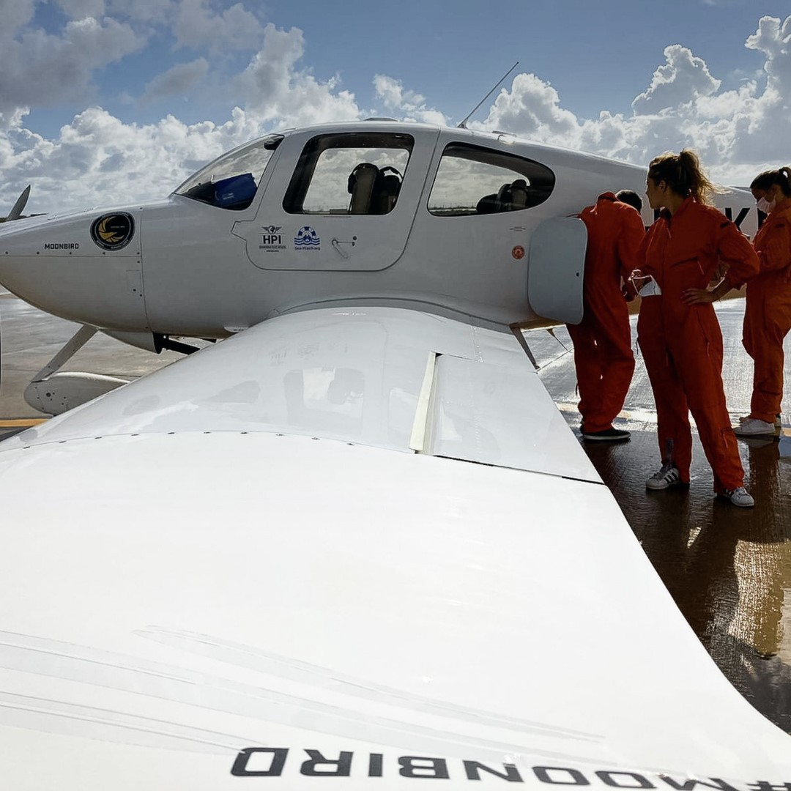

### AYS Daily Digest 24/11/202: New developments on deportations and repatriations
#### New rescue missions at sea // Follow\-ups on situation in Canary Islands and France // New pushbacks in Greece

Stansted15 group
### GENERAL
#### New developments on deportations and repatriations — UK, Greece, Malta, Syria, Afghanistan

The UK Home Office is planning a [pre\-Christmas mass deportation](https://twitter.com/minnierahman/status/1331233425957806080?fbclid=IwAR0X39MHRAV7lbtriG_AJUCYm8x-pMVwFIi4j-Fiv95YXGl5s36fYNL7gs8) of black British residents to Jamaica on 2nd December\. Despite risks related to COVID\-19, they will attempt to put full 50 people with escorts \(3 per person\) — meaning that there will be a plane crammed with [200 people](https://twitter.com/followMFJ/status/1331343766905643009?fbclid=IwAR0O5Pp6HmCG9wZopwYH7gyx4k-5Q1WbKvL90eRN0pUWWZiQWJ7ts0xXYw4) at the height the pandemic\.

The Stansted15 group are in court today appealing their counter\-terrorism convictions, as they were charged for blocking a plane and halting the forced deportation of 60 people to Africa\. Of the people whose deportations they prevented, 1 [1 now legally live in the UK](https://twitter.com/_Brendan01_/status/1331232642021330951?fbclid=IwAR3UaAQX6VzY7SuQ1lJWv3eFOG86UrhWcZQNIaZu7KLgH3iIS77NnuSg3rM) \.

The IOM has also published a [factsheet](https://greece.iom.int/en/voluntary-relocation-scheme-greece-other-european-countries#.X7yu29caNZk.twitter) on voluntary relocation schemes from **Greece to other European countries** \. [To date](https://twitter.com/TihomirSabchev/status/1331130636174815235?fbclid=IwAR2SRLj3LvayEJk-Z5-EJT1LhzfISszdZ2VyCbaWc2AWQxV7pn3KjasdvEU) , 477 unaccompanied minors have been relocated\. Bulgaria has also [recently joined](https://twitter.com/UNHCRGreece/status/1331135396923793408?fbclid=IwAR2-eQzjxCxXSkGevsJCMpGdAF6sSK0Blk1MLZpM6iWgMx_wi8OA_5N_P2E) the scheme\.

The [**Maltese authorities**](https://www.maltatoday.com.mt/news/national/106103/voluntary_return_programme_for_failed_asylum_claimants?fbclid=IwAR2SRLj3LvayEJk-Z5-EJT1LhzfISszdZ2VyCbaWc2AWQxV7pn3KjasdvEU#.X750RKpKiIZ) plan to establish voluntary repatriation options for failed asylum seekers who do not qualify for specific residence authorisation\. Unsuccessful applicants will be offered the option return to their country of origin through a voluntary return programme, but this does not exclude forced return where applicable\.

> Applicants [must provide an integration certificate](https://timesofmalta.com/articles/view/identity-malta-streamlines-policy-on-humanitarian-protection-for.834010?fbclid=IwAR1gXhPbfzuCt1ZfQaNH2N7SRdTGOlHVf6pzpBoGcel1ba1j21c4fwc6TcI) issued by the Human Rights Directorate \(HRD\) \. Applicants who are waiting to start or finish the integration courses may still renew their status\. Others who do not have the ability to take the relative courses may provide an assessment report by the HRD\. 

**Syrian President** Bashar al\-Assad’s [call on Syrian refugees](https://www.al-monitor.com/pulse/originals/2020/11/syria-assad-call-return-refugees-refuse-iran-control.html?fbclid=IwAR1jPaezsKYQl8fGyP5q-ypL-NYvbEpCphcyzdij9jL08XYvNKDn6J9IIHY) to return to the homeland has sparked many reactions, as some still fear returning to cities and towns occupied by Iranian forces accused of violations and abuses against the locals\.

> “My cousin was shot dead by the Iranian Revolutionary Guard Corps \[IRGC\], which are tightening the noose around civilians, spreading Shiism among the people and encouraging ‘mutah,’ or temporary marriage, knowing that this marriage is rejected by our Sunni doctrine, which views it as a form of prostitution\. Add to this the deteriorating economic situation and the state of insecurity in the cities dominated by Iran, such as al\-Mayadin, al\-Bukamal and parts of Deir ez\-Zor and its countryside,” Awad told [Al\-Monitor\.](https://www.al-monitor.com/pulse/originals/2020/11/syria-assad-call-return-refugees-refuse-iran-control.html?fbclid=IwAR1jPaezsKYQl8fGyP5q-ypL-NYvbEpCphcyzdij9jL08XYvNKDn6J9IIHY) 

The deportation agreement between the **EU and Afghanistan** has been prolonged, and deportation will resume from January next year\. The next charter plane from Europe to Afghanistan is planned on 15th of December\. This will be a joint deportation between Sweden and Austria\. Sweden and Austria have had cooperation of this sort in the past too\. The plane will arrive in Kabul early morning on 16th\. We do not have the exact number of returnees on the flight yet\. For more on this, see [here](https://www.facebook.com/AmasoAfg/posts/3853507881346134) \.

IOM has published [a video](https://twitter.com/JFCrisp/status/1331152599916163072?fbclid=IwAR3eNAex4GmcUvYEdHFPneayU_op9XNqcdpWVmBd0bbaE9RCtOr6Q2C8i0s) report on the difficulties encountered by returnees\. Better late than never?
### SEA

](assets/4de5109794c3/1*LnZ7m0Yrt0YCBm21W664wQ.jpeg)

ProActiva Open Arms lifeguard rescues a three\-month old baby\. Courtesy of [Proctiva Open Arms](https://www.facebook.com/proactivaservice/posts/3724970690867088)
#### Return of rescue missions sparks hopes for safer journeys

New boats and airplanes join in the effort of rescue missions in the Mediterranean\. Search And Rescue for All Humans \(SARAH\) [has announced](https://twitter.com/teammareliberum/status/1331258589579763715?fbclid=IwAR2WJP2X4QcCjRxSucBNyaCyfOfMyKME3-WZ6m1fUJ56csRl3S52YHjgsXU) a new mission in the Mediterranean\.

Before the operating in the Canary Islands, the [rescue team of Maritimo Salvamento](https://twitter.com/SEENOTRETTUNG/status/1331215078717317123?fbclid=IwAR0X39MHRAV7lbtriG_AJUCYm8x-pMVwFIi4j-Fiv95YXGl5s36fYNL7gs8) rescued around 180 people who risked the dangerous escape across the Atlantic\.

SeaWatch’s Moonbird — courtesy of SeaWatch

Rescue missions are important not only for their role in saving lives at sea, but also as monitors of illegal pushbacks happening not far away from Europe’s coasts\.

SeaWatch International’s aircraft Moonbird, — which was blocked for over 2 months — is currently on its way back to the area of operation\. This is great news for monitoring of human rights violations that happen at sea\.

[SeaWatch International’s Moonbird crew](https://twitter.com/seawatch_intl/status/1331281428374384640?fbclid=IwAR2Dj2YYeIabYQITtHF09hSaLSfyBWOf29uan4S1--lq8vdo3p79YUIgpC8) witnessed a plane of the EU\-led naval mission EUNAVORMED IRINI which refused to intervene in a rescue\. Instead, it watched 130 people illegally being returned to Libya, a country at war\. Find more [here](https://www.facebook.com/seawatchprojekt/posts/2701659590052105) \.

Here’s [a factsheet](https://sea-watch.org/airborne-monthly-factsheet-october-2020-2/?fbclid=IwAR16e22_ev2bugnPeg_Wb-Qr4QBSrT54DS9IBA3ysqXjOY-P2JdP6NiMtEU) on the distress cases witnessed in October 2020 by _Sea\-Watch_ ’s _Airborne_ crew from the aircraft _Moonbird_ and _Seabird_ \.

They state in the factsheet:

> In October 2020, due to criminalization measures against _Moonbird_ , we were only able to fly **7 missions** , with a total flight time of **61 hours and 05 minutes\.** We spotted **around 217 persons in distress** \. 

### SPAIN

More and more people are seeking to reach the Canary Islands and attempting risky crossings at sea\. We have [notifications](https://twitter.com/EFE_Canarias/status/1331335629326725120?fbclid=IwAR3UaAQX6VzY7SuQ1lJWv3eFOG86UrhWcZQNIaZu7KLgH3iIS77NnuSg3rM) of a shipwreck in the north of Lanzarote\. It is estimated that [27 people](https://www.publico.es/sociedad/migracion-canarias-naufraga-patera-costa-lanzarote-ocho-fallecidos.html) have so far survived the wreck, all men, and 8 unfortunately died\.

A court has **rejected the _habeas corpus_ petition for** one of the 800 migrants crammed into the pier camp in Arguineguín, Gran Canaria\. In the controversial ruling, a judge has clarified that migrants can leave the camp if they ask a member of the police force, and that migrants remain crammed on the pier our of their own will\. This decision seems to disregard the fact that there are no adequate accommodation solutions for most of the people in the camp\. Read the full story [here\.](https://www.lamarea.com/2020/11/24/un-juez-aclara-que-los-migrantes-del-muelle-de-arguineguin-pueden-salir-si-lo-piden-a-un-policia/?fbclid=IwAR1A-mWFUMpn8s6-Plzsse27f4Vj00LITpzCe-14eT76miT-GPOHiCEZFmU)

In view of the international day for the elimination of violence against women, watch this [compelling story](https://www.youtube.com/watch?v=o3Q70oGlXHQ&feature=youtu.be&fbclid=IwAR3QoojvdNNsbfraWsc_G4RlWlYFBamxm7KQT0bC_hS2m6VLoU62qFhs3-w&ab_channel=SolidaryWheels) on young women on the move in Melilla\.
### FRANCE

](assets/4de5109794c3/1*7PTb0JS9B_zpoeWJT0L-9w.jpeg)

Protesters in Paris against evictions, credits: [Mortaza Behboudi](https://twitter.com/MortazaBehboudi/status/1331291646076579840?fbclid=IwAR1uqlfxzCvAZbQ2v5k0cLSqOgbew1fYMXynmnxlUsa_U2F0c-cXsZ0kUeo)

There are [more videos](https://www.facebook.com/Redfishstream/posts/1119001088543721) and reports on the clashes with police of demonstrators protesting the evictions of the Saint\-Denis camp in Paris\. More videos of the protests [here](https://twitter.com/ClementLanot/status/1330948927324098566?fbclid=IwAR065ucKJSQsYKIHii4TNDy_WXzJBI40Knk5tNAPjCBWMoVYTpbaL8LaJiI) , and of forceful evictions [here\.](https://twitter.com/JKSteinberger/status/1331017119153205248?fbclid=IwAR3ccmlYnG92qgTceCrKZfDP-Q4noOgsp2EtNhXXoqpdCZ0QPFFlx8KdgWE)

French [police have been filmed](https://www.aljazeera.com/news/2020/11/24/france-to-probe-clashes-after-police-evacuate-new-migrant-camp?fbclid=IwAR2oS5BpxMN4nISb1dChG2KeelSWj6kr0p25g_v21rVUax8fW2r8o5i8log) hitting demonstrators and forcefully removing refugees and peaceful protesters from tents\. The interior ministry has launched an investigation into these clashes, results of which should be published in the next 48 hours\.

> The latest evacuation came as French politicians consider a draft law meant to expand some police powers and provide greater protection to police\. The draft law makes it a crime to publish images of police officers with the intent to cause them harm, a measure that has been protested by civil liberties campaigners and media freedom groups who argue that the ability to capture and share images and video of the police at work is essential for efforts to curb brutality and hold accountable those who inflict violence on civilians\. 

Care4Calais have swiftly mobilised and organised a distribution of blankets amongst those evicted, and [here](https://www.facebook.com/care4calais/posts/3850929788273283) report on that\.
### GREECE
#### New pushbacks and rescues

We have news of a pushback outside Chios\. A boat carrying approximately 30 people are being blocked by the Hellenic coast guard to the east of Chios\.

[Aegean Boat Report writes](https://www.facebook.com/AegeanBoatReport/posts/976917786164659) :

> The people on the boat have contacted Aegean Boat Report to try to get help, they say they are afraid Greek coast guard will return them to Turkey, and if nothing is done, they will most likely be pushed back to Turkish waters\. Aegean Boat Report have spoken to port police on Chios, and informed them on the situation, but since they have a vessel on location, they already knew\. 

> Aegean Boat Report have received pictures, video and location data, and there is no doubt, they are deep inside Greek territorial waters\. 

We have news of a new boat carrying 28 people landing on the Greek island of Samos\. They are hiding in the woods for fear that the police will deport them back to Turkey\. [Aegean Boat report](https://www.facebook.com/AegeanBoatReport/posts/977414962781608) has more\. UNHCR Greece and Samos authorities have been informed but it is [still unclear](https://www.facebook.com/watchthemed.alarmphone/posts/2826477694293122) which camp the people will be hosted in\. Meanwhile, [temperatures in Greece](https://www.keeptalkinggreece.com/2020/11/24/greece-temperature-drop/) are expected to drop several degrees in the next few days\.

[New updates](https://twitter.com/f_grillmeier/status/1331206806752866305?fbclid=IwAR2XAnbn5auGsJk4c_vclhiSTeLUbeLhYPcSacvyjWWK1UsoMnsN7ygWUwY) from the KaraTepe \(Moria2\) camp report of dire conditions and daily struggles of people living there, who are allowed outside the camp for a very limited amount of time\.
#### New report on Greece’s policy of exclusion of refugees

Refugees International has [published a compelling report](https://www.refugeesinternational.org/reports/2020/11/20/blocked-at-every-pass-how-greeces-policy-of-exclusion-harms-asylum-seekers-and-refugees?fbclid=IwAR1PROJ48kapv2BJcpULYO0IChXpfX0--SUmDMfkY-6sr0shRmf7egcn4o0) on the Greek government’s approach to asylum, and its continuous policy of hindering migration in the most problematic and inhumane way\.

> Examining Greece’s response to the coronavirus pandemic and tragedy in Moria is essential to understanding the government’s approach to asylum and migration\. A deeper look reveals the full extent of its concerted efforts to deny or undercut access to asylum\. Greece must act immediately to reverse its callous asylum and migration policies and fulfill its international commitments to asylum seekers and refugees\. 

#### Agricultural workers in Greece: new exploitation?

We often hear stories of rescues and the plight of refugees and asylum seekers in camps in Greece\. Oftentimes, stories of the harsh condition for illegal or semi\-legal agricultural workers in the country becomes overshadowed by the urgency of other news and issues at stake\.

WeareSolomon Magazine has an important report on [Bangladeshi strawberry pickers in Manolada](https://wearesolomon.com/mag/on-the-move/thousands-of-agricultural-workers-in-manolada-are-staying-home-in-shacks/?fbclid=IwAR3eNAex4GmcUvYEdHFPneayU_op9XNqcdpWVmBd0bbaE9RCtOr6Q2C8i0s) , whose working and living conditions have worsened even more after the global pandemic hit this already precarious sector\.
### ITALY
#### Attempted suicide at CPR in Gradisca d’Isonzo

As we reported in the weekend digest, the conditions of Italian CPR \(Pre Deportation centres\) have hit a new low since the start of the pandemic\. Communication with those trapped inside is difficult, protocols for isolation and quarantine of the detainees who tested positive are mainly left on paper and the increase in deportations to Tunisia have sparked a new wave of protests\.

[LasciateCIEntrare](https://www.facebook.com/LasciateCIEntrare/) was contacted by detainees in the CPR in Gradisca d’Isonzo \(northeastern Italy\) \. One detainee [attempted suicide](https://www.facebook.com/LasciateCIEntrare/posts/5001242313234269) , and was unresponsive\.

> “He had asked many times for blankets\. He was cold, in a place with no doors and with broken windows\. He asked to be allowed to have a shower and wear clean clothes, as the police had ripped his clothes\. He was asking to be treated with dignity\. 

> He was beaten on arrival\. Vulnerable\. No answers, only humiliations\. 

> Now, around him, the army and the police\. 

#### Everyday solidarity in Trieste

### SLOVENIA
#### Slovenian and Italian authorities claim they dismantled a smuggling organisation in Ljubljana

InfoMigrants report that Italian and Slovenian police foiled a criminal organisation that was helping migrants to travel from a centre for asylum seekers in Ljubljana to other European countries\. Alleged members of the association included people in charge of security at the hosting facility\. Read more [HERE](https://www.infomigrants.net/en/post/28705/migrant-trafficking-ring-uncovered-by-italy-slovenia-probe?fbclid=IwAR2Qk35yxrZRmEEK3nUNUmHJh3EFAvJu-bhO9kKeJWz9Qoy86mxa8NDmm2I) \.
### SWEDEN
#### Updates on High School Act

As we reported earlier in the year, the new High school Act includes rules for unaccompanied minors with temporary residency\. The act gives them 6 months to find employment, otherwise their residency cannot be renewed\. This provision has now been [reviewed](https://www.svd.se/ensamkommande-far-mer-tid-for-att-hitta-jobb?fbclid=IwAR1r_ABlv6mjQJNu9UNZ1LhcEyDXwdAzuk172OGCNps_UuB9gIOk) and the time to find employment will be extended to one year\. The amendment is expected to be approved in the coming week and should be in force from the 3rd of December\.

More changes for those with temporary residency due to the High School Act\. Instead of next summer, the new and shorter time frame for finding a job will apply from the 3rd of December \(we have reported on this before, when it was explained that the new rules would apply from the summer of 2021\. For many young people, this would have been too late since they finished high school before the summer of 2020\) \.
### BALKANS

Reports of p [ushbacks from Austria to Bosnia and Herzegovina](https://twitter.com/pushbackmap/status/1331261868548165635?fbclid=IwAR1jPaezsKYQl8fGyP5q-ypL-NYvbEpCphcyzdij9jL08XYvNKDn6J9IIHY) have been increasing\. This shows that pushbacks are not only a problem for the Balkans or new EU members, but a calculated and well\-oiled EU practice, costing people lives and putting them in incredible danger\.

ComPass 071 is opening a new community center for people on the move\. Follow more [here\.](https://www.facebook.com/ComPass071/photos/a.118478989565720/401110951302521/)
### WORTH READING

Nidzara Ahmetasevic on the Media Diversity Institute has a [compelling article](https://www.media-diversity.org/bosnian-media-killing-migrant-solidarity-with-hate-speech/?fbclid=IwAR1hxidEGr9X677PDnSBcGTYDYEjoKokZZ25dvwnhvqYq3qhgHxP8QsgB5c#) on the role of media in Bosnia and Herzegovina in stirring up de\-humanizing discourses and hate speech directed towards migrants and refugees\.

> Following a decision by the EU, refugee camps in Bosnia are run by international organizations with the International Organization for Migration \(IOM\) at top of the hierarchy\. These camps, which are surrounded by barbwire fences, are usually set in former factories or abandoned buildings such as old hotels\. Local NGOs and independent organisations are prevented from having access and holding activities for refugees and migrants who live there\. The media and representatives of the civil society is limited\. This adds to the difficulties of reporting the realities inside those fenced camps\. In addition to that, the high barbwire fence, the presence of security guards creates the impression that there is something dangerous and out of limits in there\. 

Balkanbrucke’s [statement](https://balkanbruecke.org/statement-zur-externalisierungpolitik-der-eu-in-den-balkanstaaten/?fbclid=IwAR2Ck7QUsC66m3tuJP7yu1AwOLWAX6tI4Ho78QaxPIO_8M0qyHvlGKTn820) on the EU’s externalisation policies in the Western Balkans:

> In the course of the EU Council Presidency, Germany must campaign for access to protection in the EU instead of outsourcing migration policy to third countries such as Serbia\. The new migration pact presented by the EU Commission is not a solution\! 

[**An insight into the life of migrant greenhouse workers in Portugal:**](https://www.aljazeera.com/features/2020/11/23/south-asian-workers-portugal?fbclid=IwAR341Dh51hh9TOsFvdOXvSIJi7VwOKrtb9KGZbCrtRbK6QBH9P-UxzkUCps) _“Agriculture is an entry point for people coming to Portugal,” explains Matos “no one sticks at it for very long\. But when they arrive, people are very vulnerable to exploitation, because of the recruitment processes\. There are lots of middlemen, who exploit them when it comes to salaries, to transport costs and to housing\. From a minimum wage salary which should be 600 euros, they might only take home 300 euros\.”_

**Find daily updates and special reports on our [Medium page](https://medium.com/are-you-syrious) \.**

**If you wish to contribute, either by writing a report or a story, or by joining the info gathering team, please let us know\.**

**We strive to echo correct news from the ground through collaboration and fairness\. Every effort has been made to credit organisations and individuals with regard to the supply of information, video, and photo material \(in cases where the source wanted to be accredited\) \. Please notify us regarding corrections\.**

**If there’s anything you want to share or comment, contact us through Facebook, Twitter or write to: areyousyrious@gmail\.com**

_Converted [Medium Post](https://medium.com/are-you-syrious/ays-daily-digest-24-11-202-new-developments-on-deportations-and-repatriations-4de5109794c3) by [ZMediumToMarkdown](https://github.com/ZhgChgLi/ZMediumToMarkdown)._
