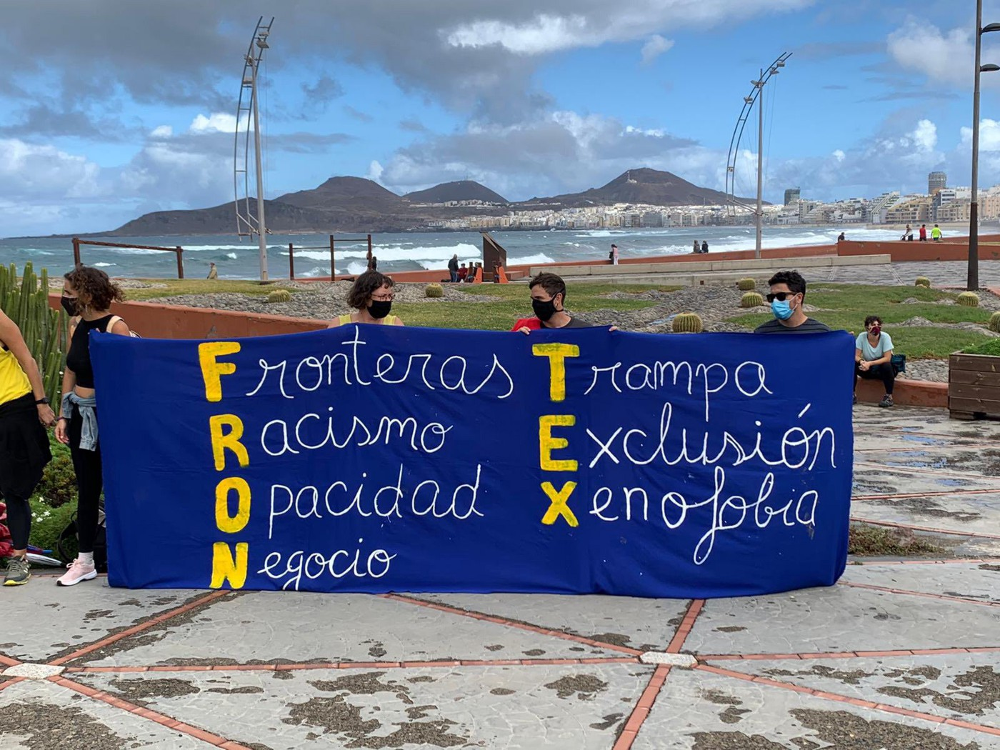
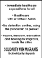
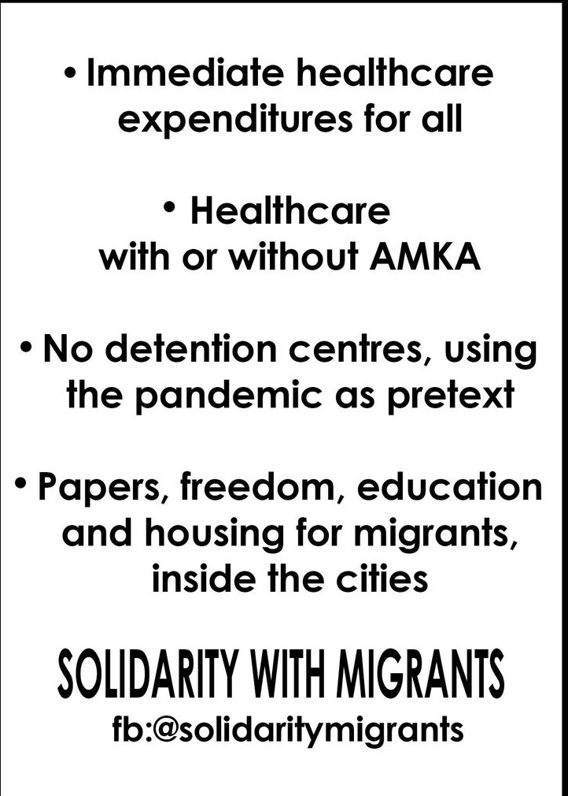

### AYS Weekend Digest 28–29/11/2020 — Italian institutional racism kills again
#### Greek minister Mitarakis visits Lesvos // New commission to investigate Frontex // Updates on the \#Jamaica50 deportation flight from the UK // Updates from the Tigray region, Ethiopia

### Featured — Italian institutional racism kills again

[A group of grassroots associations, collectives and NGOs released a statement](https://www.meltingpot.org/Ex-Caserma-Serena-Treviso-Per-Chaka-perche-la-sua-morte-non.html?var_mode=calcul&fbclid=IwAR0zcigtcYl6dPwsXA3klMzRfKE8ipQbKSpqBbyPcPVvkfh2OqR3ksfjvmo#.X8N11cJ7nQU) on the story of Caserma Serena, reception centre in Treviso \(north\-eastern Italy\) and on the death of Chaka Outtara, who killed himself after being arrested and put in isolation for claiming his rights\.

Caserma Serena is a reception centre managed by Nova Facility, which hosted — until the summer — 300 people\. At the end of the first lockdown in May, a number of positive cases among workers and residents, forced the structure to impose a new quarantine\. As usual, for non\-citizens, health provisions apply only in restrictive terms\. No isolation of COVID\-positive residents, no continuous testing\. In two months, the number of positive cases rose from 2 to 250\.

> _While the whole of the country freed itself from fear and restrictions, residents were thrown into a new nightmare\._ 

The protests on which Italian media have feasted took place in the centre, the only way for the residents: “to rebel against an overwhelming detention\-like situation and against the disregard of minimal humane standards”\.

> _At the end of July a new quarantine is imposed and the Caserma Serena is pointed at as the largest covid\-19 hotbed in Italy\. Residents are accused of being super\-spreaders, not only by the right\-wing \[…\] but also by a ‘left\-wing’ which reveals itself weak and hostile when migrants rebel\._ 

Turmoil inside the centre, blockades, several days of protests, demands to talk to the management all went ignored\. No one had bothered communicating with the residents about the reasons behind the new quarantine, behind the new impositions that had caused many residents to lose their jobs\.

After the quarantine, the management tried to relocate those who tested negative, but the local right\-wing administration halted the move\. However, the Italian justice system didn’t stop, and 4 residents were arrested in August for the protests\. They were given serious charges, for kidnapping and for “devastazione e saccheggio” \(plundering and looting\), a fascist\-era charge that has been used again in the last few years against protestors, which carries a decades\-long prison sentence\.

The four people were arrested and put in isolation, with no contact with the outside world, for demanding to be heard, to be answered, to be treated as humans\.

After months in prison, Chaka Outtaka, at just 23 years old, the youngest of the four men arrested, hung himself in his prison cell\.

> _Prison killed him, but before the prison, the Caserma Serena, the large reception centre that was supposed to welcome him, killed him too\. A reception system with no logic or mercy killed him\._ 

Since the Salvini decrees, the Italian reception system has closed all small secondary reception centres, leaving only large centres \(CAS\) with hundreds of residents acting as emergency structures\. This measure revealed all its brutal consequences with the arrival of the COVID\-19 pandemic\. Nova Facility, similarly to other companies and co\-operatives that run Italian CAS, is profit\-driven and has knowingly ignored its responsibilities towards the health of the residents and the workers of the Caserma Serena\.

After Chaka’s death, thanks to the involvement of lawyers, associations and individuals, one of the other arrested men was released awaiting trial\. A ‘normal’ procedure, for people with a home and rights\. A very difficult process for people on the move\.

ETHIOPIA
### Reports of Eritrean army abducting Eritrean refugees in Ethiopia

Reliable information on the situation in the Tigray region in Ethiopia is difficult to gather\. Since the beginning of the conflict, [over 43,000 people](https://data2.unhcr.org/en/documents/details/83329) have left the country and sought refuge in eastern Sudan\. Furthermore, media sources [report](https://eritreahub.org/ethiopia-thousands-of-eritrean-refugees-abducted-from-tigray-camps-by-eritrean-armed-forces?fbclid=IwAR1IJvzPc2Fpxa5OWXn1Pz9-J_D8FG3h5ifM8VFwtifes5Z5xjUXS_OvVNU) that “6,000 Eritrean refugees, who were living in two of the four refugee camps and in the town of Shire in the Tigray regional state of Ethiopia, have been abducted by Eritrean armed forces working in Tigray with the permission of the Ethiopian army **”\.**

As of 29 October, [UNHCR had registered 96,223 Eritrean refugees](https://data2.unhcr.org/en/documents/details/83317) in the Tigray Region, sheltered mainly in four refugee camps in the western part of the region\. Shimelba \(population 8,702\), Mai\-Aini \(21,682\), Adi\-Harush \(32,167\) and Hitsats \(25,248\) camps were established between 2004 and 2013\. There are also 8,424 refugees residing in the Tigray region living in communities outside of the camps\. “UNHCR has been unable to reach the Main\-Ani, Adi Harush and Hitsats camps for over a week — longer for the Shimelba camp\.”

EU
### Frontex update

New information has been [gathered](https://twitter.com/g_christides/status/1332656454105436160) on the role that Frontex has played in pushbacks in the Aegean sea\. On August 10, a German vessel located a dinghy carrying people on the move in Greek territorial waters on its way to the island of Samos\. It was instructed not to approach the boat but to leave the matter to the Greek coast guard \(HCG\) \. It was later revealed that the HCG performed a pushback, forcing the dinghy to turn around and go back in Turkish waters\.

In Frontex’s internal communication, a HCG representative describes the actions as “border control activities which not do provide any ground to initiate a SIR procedure”\. SIR, Serious Incident Report, is the internal mechanism Frontex has established for reporting violations of laws or human rights\. It has been criticised for a lack of transparency and accessibility since its inception by the EU Ombudsmen, several NGOs and human rights observers, and Frontex’s Consultative Forum\.

Read the whole story \(in German\) [HERE](https://www.spiegel.de/politik/ausland/frontex-skandal-deutsche-bundespolizisten-in-illegalen-pushback-in-der-aegaeis-verwickelt-a-d4e45196-a5b2-43a5-9050-72885b349996?fbclid=IwAR2VPBeqzwNaJUuNN_t3tQzrSrA2N1lV-8HwnsxYrlDY_7iTTQmeG4AkJXI) \.

Meanwhile, Frontex’s management board is establishing the members of the commission that will investigate the allegations against the agency, after the pressure of Commissioner Ilva Johannson\. According to [Greek media](https://www.kathimerini.gr/society/561176605/to-diplomatiko-poker-gia-tis-epanaproothiseis/) , representatives of 8 EU member states and non\-EU Schengen signatories expressed their desire to participate in the inquiry committee\. Greek officials described three of them as “hostile” to Greece: Sweden, Norway and Switzerland “which have made or adopted complaints about illegal practices of the Coast Guard in the Aegean\.” Romania and Hungary are instead described as supporting Greece’s positions, while Germany and France will supposedly play a balancing role\. Denmark and The Netherlands, who have also filed complaints against the Greek coast guard reportedly did not want to be part of the inquiring commission\. According to the same article, the total number of cases under investigation is 20\. Greek authorities will propose an extensive interpretation of Article 6 of European Regulation 656, which concerns the possibility for a member state to proceed “to halt the course of a vessel when it is smuggling migrants”\.

SEA
### Mission Lifeline is off West African coast

Dresden\-based humanitarian rescue [Mission Lifeline](https://www.saechsische.de/politik/deutschland/innenpolitik/einwanderungspolitik/mission-lifeline-kreuzen-vor-westafrika-5327661.html?fbclid=IwAR2VqOZihWCkpUzdpqe2Vwx3b4jHpud8yOxtezFD_dWzNyRvfKff25Zzwl4) has just finished a 14\-day SAR in the 30 nautical miles off the Canary Islands, searching for boats in distress\. The rescue boat did not need to intervene\.

GREECE
### Arrivals

Aegean Boat Report state that 4 boats [arrived](https://web.facebook.com/AegeanBoatReport/posts/980921405764297) on Lesvos over the weekend\.

The first landed south of Agrielia Kratigou, Lesvos south before midnight on Saturday, carrying approximately 19 people\. They hid in the woods all night, scared of being arrested by Greek police and sent back to Turkey\. In the morning they walked to Katia, police were informed and arrived shortly after, “we believe that it would be impossible to deport them, so many locals have seen them walking and there is a lot of documentation from pictures and videos, of the people and also police\.”

The second boat landed south of Skala Neon Kidonion after midnight on Saturday\. The unconfirmed number of people is 17, they have also been hiding in the woods\.

A third boat was picked up by HCG outside Lesvos south and taken in to port in Mytilíni, the boat was carrying approximately 15–20 people\.

A fourth boat carrying approximately 27 people [landed](https://web.facebook.com/AegeanBoatReport/posts/981511512371953) south of Agrielia Kratigou, Lesvos south 22\.00 Sunday night\. “They are scattered in small groups in the area, hiding in the woods\.”
### Pushbacks

News from the Med [report](https://web.facebook.com/NewsfromtheMed/posts/1098458770607718) of a sailboat with 36 people, including at least 10 children, that was stopped by a Greek coast guard \(HCG\) boat north of Andros on the Cyclades Saturday at noon\. A coast guard officer boarded the sailboat and piloted it towards the Turkish border, accompanied by the HCG vessel LS 346\. As News from the Med states:

> _these pushbacks are getting out of hand, this boat is obviously deep in the waters of Greek territory, \[Andros is\] 10 miles from mainland Greece and should be escorted to mainland Greece if Greece followed international law\. What they will do when they approach the Turkish border will only turn out over time; dismantle the engine or put it in life rafts, either way they put these people in a potentially life\-threatening situation\._ 

> _\[…\] At some point, those responsible for this madness must be held accountable for their actions\. This needs to stop\! ‘_ 

### Updates From Lesvos

On Saturday, migration minister Notis Mitarakis visited the Moria 2\.0 camp, and released a [statement](https://www.pagenews.gr/2020/11/29/politiki/notis-mitarakis-i-prosorini-domi-sto-maurobouni-den-thymizei-se-tipote-to-xaos-tis-morias/) in which he describes the new camp as nothing like the first Moria camp\.

**It is a statement that clashes with reality\.**

Mitarakis speaks of showers inside people’s tents, while MCAT reminded us on Sunday that people in the camp [wait](https://web.facebook.com/MoriaCoronaAwarenessTeam/posts/201476424814869) weeks to be able to have a shower\.

Mitarakis speaks of a winterisation program completed, but still no form of heating is implemented in the camp\.

Mitarakis described the structure as “clean … with order and security\. We have completed the studies with IGME on soil quality, flood protection works are being completed”… these pictures are from this past month, luckily it did not rain too much:

Also, Franziska Grillmaier [reported](https://twitter.com/f_grillmeier/status/1332611153890058243) that self\-managed schools within the camp had to close down this week\. “The plan of the camp management & UNHCR is to build one bigger educational facility in the camp\. But that might take months to be completed\. So in meantime?”

[MCAT](https://web.facebook.com/MoriaCoronaAwarenessTeam/) and [Moria White Helmets](https://web.facebook.com/MoriaWhiteHelmets/) continue with their operations within the camps\. [Garbage collection](https://web.facebook.com/MoriaWhiteHelmets/posts/214814550161612) , [distributions](https://web.facebook.com/MoriaCoronaAwarenessTeam/posts/202112598084585) , repairs\. They are also trying to [fix](https://web.facebook.com/MoriaWhiteHelmets/posts/214829573493443) the electricity problems within the camp\. Both groups ask [NGOs](https://web.facebook.com/MoriaCoronaAwarenessTeam/posts/201476424814869) and associations to rely on camp residents to support their work as much as possible\. This is to [avoid](https://web.facebook.com/MoriaWhiteHelmets/posts/213514460291621) sending new volunteers to the island, where the healthcare system is already struggling, to [respect residents’ attempts](https://web.facebook.com/MoriaWhiteHelmets/posts/213990246910709) to keep their own communities — and the whole of the island — safe from COVID\-19 and to [focus their spending](https://web.facebook.com/MoriaCoronaAwarenessTeam/posts/201476424814869) on the needs of people there rather than on the running costs of the aid organisations\.
### Athens — Call for the creation of a healthcare support network for people on the move

The [Solidarity with Migrants collective](https://web.facebook.com/solidaritymigrants) called for the “establishment of a health support network for immigrants\. This call is addressed to the healthcare movement as a whole, whether it is for associations of doctors, health groups, social clinics / pharmacies, collectives active in the field of health, or for individual colleagues \(regardless of speciality or employment relationship\) and others that can assist\.”

> _This can take the form of immediate provision of health services \(medical teams to visit the camps or direct treatment and follow\-up of cases in hospitals or private clinics\), facilitation of access to the National Health System for what they need, psychological support, and any another way that anyone can contribute\. Until the health barriers are torn down, let us show our practical solidarity with the migrants who need it, especially in the midst of a pandemic that threatens twice the most impoverished part of our class\._ 

If you can help, contact them on [facebook](https://web.facebook.com/solidaritymigrants) or via email: 
solidaritymigrants@gmail\.com / solidaritymigrants@riseup\.net

SPAIN
### Arrivals

11 people reached Lanzarote after 8 days at sea\. 2 people have been taken to hospital, but they all survived, Mission Lifeline [report](https://twitter.com/SEENOTRETTUNG/status/1333012697965793287) \. On Sunday, Helena Maleno Garzon [reported](https://twitter.com/HelenaMaleno/status/1333067734326915075) 54 people in distress in the Alboran Sea\.

ALBANIA
### 112 Albanians were repatriated on Friday, from France and England

Exit\.al [report](https://exit.al/en/2020/11/28/rejected-asylum-seekers-returned-to-albania/?fbclid=IwAR144qeGu237_FMd4fMfg1fk2-zq5Q8LUdg-p49EXGt6HrYVvKEK9NNeRPg) on the joint return operation, providing background to the situation in the country and for Albanians in Europe\. In a July [report](https://exit.al/raporti-i-be-se-per-heqjen-e-vizave-me-shqiperine-te-vazhdoje-lufta-kunder-emigracionit-te-paligjshem-krimit-dhe-korrupsionit/) on the fulfilment of the conditions for visa\-free movement within Schengen, the European Commission asked Albanian authorities to “address the problems with illegal immigration and unfounded asylum seekers”\. Albanian State Police have repeatedly stated that “the chance of asylum being granted is zero, but this is not true\.” In France and UK around 10% of the applicants were granted protection, while in the rest of the EU the approval rate is 4%\.

GERMANY
### 5 people found by police in Rosenheim

German media [report](https://www.dw.com/en/germany-migrants-smuggled-between-tree-trunks-on-truck/a-55755829?fbclid=IwAR35gtGCfSwcchYF8dnxI1y-2KaKaQLK4Wd9FAsjCuM9P4nU4rrT-Zk37gU) of 5 people found by police in southern Germany after they successfully managed to cross the border from Romania on Thursday in the back of a truck transporting tree trunks\. They reportedly paid smugglers between €5,500 and €6,600 for the entire route from Afghanistan to Germany\. Police, after questioning, took them to a refugee assistance group in Rosenheim, Bavaria\. German authorities stated that they will increase checks on trucks at this border\.

UK
### Updates on \#Jamaica50 deportation flight

Public pressure on airlines is working\. After more than 90 public figures [signed an open letter](https://twitter.com/SharLovegrove/status/1332392766358360064) urging airlines not to carry out this deportation, TUI and TITAN released statements confirming they won’t be participating in the Home Office operation\.

In the [aftermath](https://www.theguardian.com/commentisfree/2020/feb/10/windrush-deporting-people) of the Windrush scandal, “the Home Office admitted that it wrongly deported or detained at least 164 black British citizens and probably many more\. At least 11 of them died on the streets of foreign countries where they were deported\.”

[Sign the petition](https://www.change.org/p/stop-all-charter-flight-mass-deportations-to-jamaica-other-commonwealth-countries-jamaica50/u/28118860?recruiter=false&utm_source=share_update&utm_medium=twitter&utm_campaign=share_twitter_responsive&recruited_by_id=dd670f80-2efb-11eb-bbd8-91c3080b85d8) promoted by BARAC UK and BAME Lawyers for Justice to stop the deportation\.
### Enhanced Channel’s migration agreement signed by UK and France

With the new deal, media report, the number of officers [patrolling](https://uk.reuters.com/article/uk-europe-migrants-britain/uk-france-sign-new-deal-to-stop-illegal-migration-across-channel-idUKKBN2880PT) French beaches will double, and new equipment including drones and radar will be employed\.

This week, [The Institute of Race Relations](https://irr.org.uk/) , the [Permanent People’s Tribunal](https://www.migranttribunal.org/) and [Gist](https://www.gisti.org/spip.php?page=sommaire) i published an English version of the Maël Galisson database counting and accounting for deaths at the British borders with France and Belgium\. It documents over 290 deaths at these borders from 1999 on\. Read it [HERE](https://irr.org.uk/article/deadly-crossings/?fbclid=IwAR0zcigtcYl6dPwsXA3klMzRfKE8ipQbKSpqBbyPcPVvkfh2OqR3ksfjvmo) \.

WORTH READING
- [**Border surveillance, drones and the militarisation of the Mediterranean**](https://www.nomuos.info/sorveglianza-alle-frontiere-droni-e-militarizzazione-del-mediterraneo/?fbclid=IwAR144qeGu237_FMd4fMfg1fk2-zq5Q8LUdg-p49EXGt6HrYVvKEK9NNeRPg) \(in Italian\) \. The Sicilian\-based No Muos Network published a detailed analysis of the state of the art of the weaponisation and militarisation of borders in the Med: “ _The use of drones to surveil the tragedies of people on the move at sea highlights the video\-necrophilia that drives the actions of the strategists of the white identity’s defence\._ ”
- [**Five Years of Waiting\. On the brink of change in Greece**](/@LighthouseRR/five-years-of-waiting-326decc93321) , by Lighthouse Relief: “ _After five years working in Greece we’ve witnessed time and time again how an unsustainable migration system somehow continues, often buried under its own weight\. Alongside other actors, we have raised our voices to decry woefully inadequate reception conditions on the Aegean Islands, painfully long waiting times, and dangerous deprivations of rights for the most vulnerable\. With every year, little improves — and asylum seekers suffer more of the same — more insecurity, heightened uncertainty, more stress and more isolation\. **In five years, a lot has changed\. But also painfully little\.**_ **”**
- [**Lilliput, Magic Land \(?\): Sketching the far right in Lesvos \(part 1\)**](https://thepressproject.gr/lilipoupoli-chora-magiki-skiagrafontas-tin-akrodexia-sti-lesvo-meros-1o/?mag=true&fbclid=IwAR0BkwYhbXCP0pE8LASzupZCHMX4YnhRjDU584Ok_nGeSKEmzgz5CfD0l1E) by Disinfaux Collective \(in Greek\): “ _If the Golden Dawn chapter supposedly came to an end, in the book of the far right there is still room to spill a lot of ink for groups and networks that appear at specific times and in different parts of the map with similar characteristics, throughout Greece\. In Lesvos, although Golden Dawn has never been able to strengthen itself, various far\-right voices from groups of “outraged citizens” often tolerated by the elected, star in a series of violent and racist incidents: Attacks on refugees, volunteers and NGOs, journalists and hoteliers, instrumentalization of religious symbols, and even pogroms\.”_

**Find daily updates and special reports on our [Medium page](https://medium.com/are-you-syrious) \.**

**If you wish to contribute, either by writing a report or a story, or by joining the info gathering team, please let us know\.**

**We strive to echo correct news from the ground through collaboration and fairness\. Every effort has been made to credit organisations and individuals with regard to the supply of information, video, and photo material \(in cases where the source wanted to be accredited\) \. Please notify us regarding corrections\.**

**If there’s anything you want to share or comment, contact us through Facebook, Twitter or write to: areyousyrious@gmail\.com**

_Converted [Medium Post](https://medium.com/are-you-syrious/ays-weekend-digest-28-29-11-2020-italian-institutional-racism-kills-again-705fd3b95369) by [ZMediumToMarkdown](https://github.com/ZhgChgLi/ZMediumToMarkdown)._
