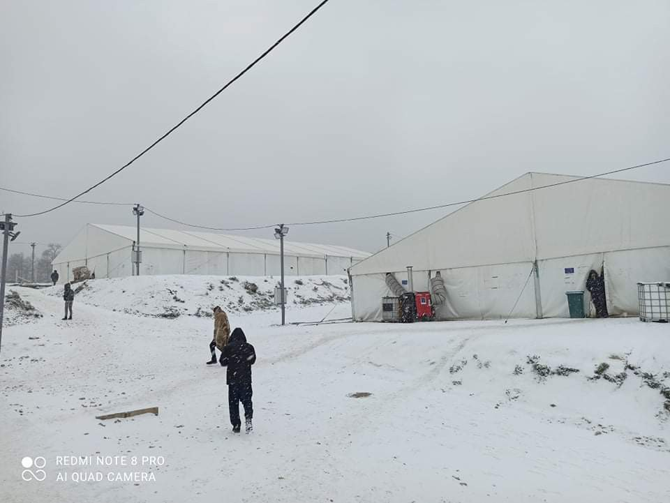

### AYS Daily Digest 02/12/2020: David vs\. Goliath / Transparency activists vs\. Frontex
#### Frontex is taken transparency activists to court to enforce payment of legal bill // Shipwreck off Lesvos: one woman drowned, one missing // New testimony of pushback in Aegean // Tactics to prevent illegal pushbacks // Happening now: families with children with no place to go in BiH // British immigration minister refuses to rule out to use of inhumane tactics against refugees // Senegal: Father of dead boy taken to court //

Winter is here in Bosnia, where camps have no hot water and at least 3,000 people do not even have a place in the camp but sleep rough; among them there are families\. Copyright: Transbalkanska Solidarnost
### FEATURE: Frontex is using bully\-boy tactics to intimidate transparency activists

No day without news from Frontex\. This time, they are taking two freedom\-of\-information activists to court in order to force them to pay a legal bill for almost €24,000\. Luisa Izuzquiza and Arne Semsrott lost their case against Frontex in November 2019, when they sued for the disclosure of the name, flag and type of each vessel deployed by Frontex in the central Mediterranean under Joint Operation Triton\. Frontex refused, citing public security, although they had already shared a lot of the information in question publicly on their twitter account prior to the activist’s request\. The General Court of the European Union however agreed with Frontex\. Following the decision, Frontex sent the activists a bill for over €23,700 to to cover the expenses for top lawyers\. Izuzquiza and Semsrott decided not to pay, but instead started a petition that reached 87,000 signatures in which they asked Frontex to withdraw the demand for reimbursement\. [In the text of the petition](https://fragdenstaat.de/aktionen/frontex/) , the transparency activists stated:

> “It is unusual for European authorities to respond to a request for information with an invoice at all, and certainly not in this amount\. As an expression of democracy, it is much more common that citizens do not have to pay legal fees even if they fail in court\.” 

FragDenStaat, the NGO behind the activists, has published up to 1000 texts about Frontex — some of them proving the agency’s involvement in human rights violations\. In light of Frontex’s billions of euros budget, it is quite obvious what they are aiming for when insisting on the payment: They want to prevent activists from suing them for disclosure of information in the future\. In Tuesday’s [hearing of Frontex director Fabrice Leggeri before the EU’s LIBE Committee](https://multimedia.europarl.europa.eu/en/committee-on-civil-liberties-justice-and-home-affairs_20201201-1345-COMMITTEE-LIBE_vd?fbclid=IwAR35H2vRRiL2_0f7ACfe3hmybAthZjjMwVRxMxg9ldyZkEIGALmsQro_xsg) , chair Lopez Aguilar reminded Leggeri of his obligations concerning transparency regarding potential human rights violations:

> “Transparency means that we need to be updated and informed on your initiative on a regular basis\. We shouldn’t get to know about alleged pushbacks of Frontex agency in the service of the European Union by our own means or by the media or by journalists reporting those operations but regularly by Frontex updating the LIBE committee” 

Researcher Lena K\. published a very informative thread on Frontex’s stand on transparency\. She explains among other things how Frontex started to inform people who received access to information under the Freedom of Information principle that they needed prior authorization from Frontex when sharing this information\. Frontex further introduced its own portal for launching Freedom of Information requests, and thereby restricting the use of transparency portals like asktheeu\.org\.

■■■■■■■■■■■■■■ 
> **[Lena K.](https://twitter.com/lk2015r) @ Twitter Says:** 

> > 1/On @[Frontex](https://twitter.com/Frontex) and transparency - thread. The case against @[luisaizuz](https://twitter.com/luisaizuz) &amp; @[arnesemsrott](https://twitter.com/arnesemsrott) is an extreme example of what [Frontex](https://twitter.com/Frontex) can do to hinder transparency. There are many others- I'll focus on some related to FOI applications. 

> **Tweeted at [2020-12-02 21:06:29](https://twitter.com/lk2015r/status/1334242555962269701).** 

■■■■■■■■■■■■■■ 

> We fully support Luisa Izuzquiza and Arne Semsrott and ask the European Union to finally take a stand against this agency that is getting out of control\. 

### GREECE
#### One woman dead, one missing after shipwreck off Lesvos

Aegean Boat Report reported about a shipwreck off the northern coast of Lesvos in the early morning of Wednesday, 2 December\. In a rescue operation that involved two Coast Guard vessels, Frontex and a military helicopter, 32 people were saved, among them three children\. Two women were missing, one was later found drowned\. Once again, somebody lost a mother, a partner, a daughter\. 
The Greek Migration Minister Mitarachi used the “opportunity” to praise the Coast Guard and blame Turkey and, of course, NGOs for endangering lives\. 
He called on the international community to

> “through crucial and rigorous interventions, protect human lives, effectively contributing to the complete cessation of the illicit trafficking routes\.” 

**This statement is a paradox in itself\.** We have seen for many years now that without legal pathways into Europe with the option of applying for asylum, human lives will be lost\.

**There is no solution of “rigorous intervention” that allows for the protection of lives and the closure of migration routes\. It is either\-or: either closed borders or protection of human lives\. Europe has to choose a side\. If human lives are to be protected, we need search and rescue missions\.**
#### Testimony of pushback published

Meanwhile, Mare Liberum published another detailed account of a pushback at sea that took place on 30 October 2020 in the Greek territorial waters off of Rhodos\. It was one of the incidents when orange live rafts were used in order to keep people at sea and send them back into Turkish waters, after their dinghy was destroyed by the Greek Coast Guard\. From the testimony:

> “Once they put us on the Coast Guard ship, they shot our boat approximately 20 times till destroying it completely\. It was \[an\] automatic machine gun\. Like M16 or something\. More than 20 times\. Or more, we were not focused and shaking, we lost track\. **The babies and kids were so scared of the shooting\.** Crying and screaming, even one of the girls almost passed \[out\] \. We used Hand sanitizer to \[wake\] her\. It was scary moments really\. I hope this ends\.
 

> **They shouted, yelled \[at\] us again, and searched all our bags and searched us one by one, they took all our phones, and some people’s wallets** \. They drove around one hour or one and a half hours, we were in the back of the ship\.
 

> They prepared orange small boats with flashing light on the top, It was blown with air, then they divided us into 2 groups and **pushed us inside these orange boats into the sea, that was around 12 midnight** \(I am not sure about the time as no phones with us and they didn’t allow us to ask or speak or even look to the ship, they told us to look to the sea as we were in the back of the ship\) \.“ 

For the full testimony, see:

#### People hide in forests in fear of being pushed back from the islands

As fears of pushbacks from the island grow, groups of people that arrive at night tend to immediately inform Alarm Phone of their arrival\. Aegean Boat Report now published a statement on Facebook on what the NGOs are doing next and why:

> “Under normal circumstances we would ask for their location and alert the police so that they could be taken to a quarantine camp, but nothing on the Greek Aegean islands is normal\. To alert the police after dark on new arrivals will automatically get them deported, and they will be floating in a life raft outside Lesvos before first light\.” 

So ABR waits until daylight, while the people hide in the forests\. They then inform the authorities and UNHCR Greece\. The hope is that by taking this detour, enough proof and publicity is created to prevent a pushback at night without traces\. In the statement, ABR expresses its mistrust and frustration with UNHCR:

> “unfortunately UNHCR in Greece are all about cooperating with the government, no matter the consequences for people they should protect\. Aegean Boat Report have over the last two weeks tried to get people protected by UNHCR on Lesvos, but they haven’t done anything to help, people have been illegally deported on their watch\.” 

In yesterday’s digest we reported about a group of 24 people who hid in the forests and contacted Alarm Phone about their whereabouts, afraid of a pushback\. They were later brought to the island’s quarantine camp\. Alarm Phone was in contact with another group of nine people who also arrived on Lesvos\. They lost contact with them on Wednesday evening and now fear a pushback\.
#### €600 fine for leaving the camp to buy food

■■■■■■■■■■■■■■ 
> **[Choose Love](https://twitter.com/chooselove) @ Twitter Says:** 

> > SOUND ON 🔊This refugee on the Greek island of #Lesvos just got fined €600 for leaving the camp to buy food, despite having permission and following COVID guidelines. Receiving just €75 p/month in cash assistance, this fine is unpayable. This is horrendous intimidation. https://t.co/uvnEjibCql 

> **Tweeted at [2020-12-02 15:18:05](https://twitter.com/chooselove/status/1334154878390820865).** 

■■■■■■■■■■■■■■ 

### Bosnia and Herzegovina
#### Happening now: Families with children pushed back in snowy conditions

A group of people with least 14 children and pregnant women among them is stranded in Bosnia and Herzegovina after having been pushed back from Croatia\. According to No Name Kitchen they were denied the right to ask for international protection in the EU\-country of Croatia\. In an attempt to raise attention they sent heart\-rending videos as cries for help to No Name Kitchen who published them on Facebook\. In the videos, the people look desperate\. One woman is hardly able to stand on her own\. While they don’t know what to do or where to go, heavy snow is falling\. This is what advent season looks like in Europe in the year 2020: pregnant women and families with children in the snow, with nowhere to go, sent away violently by EU\-authorities\.

■■■■■■■■■■■■■■ 
> **[NoNameKitchen](https://twitter.com/NoNameKitchen1) @ Twitter Says:** 

> > This afternoon, several families stranded in Bosnia and Herzegovina are making a protest in front of the #EuropeanUnion border

They claim that they have been pushed back in different times from Croatia, against the law. Their right, when in Croatia is to ask for asylum. https://t.co/7MgyLqOteB 

> **Tweeted at [2020-12-02 16:21:36](https://twitter.com/nonamekitchen1/status/1334170863067951104).** 

■■■■■■■■■■■■■■ 

Here you find a long\-read about the **current situation in BiH** , where approximately 10,000 asylum seekers are stranded and 3,000 of them are sleeping rough:

**Transbalkanska Solidarnost** published a statement on Facebook about the conditions at Lipa camp, a camp run by the International Organization for Migration and the German Red Cross\. According to the statement, there is no hot water in the camp and at the moment no water at all, because the pipes are frozen\. There is hardly any heat and little electricity\.
### SEA
#### Good news for the Mediterranean

■■■■■■■■■■■■■■ 
> **[Sea-Watch International](https://twitter.com/seawatch_intl) @ Twitter Says:** 

> > Ready for take-off! After months of being blocked on the ground, our #Moonbird starts another mission today.

In full solidarity with people on the move, we are making sure that the deadly politics in the Mediterranean are put to an end! https://t.co/dbtWTbxL8y 

> **Tweeted at [2020-12-02 13:47:09](https://twitter.com/seawatch_intl/status/1334131995773956096).** 

■■■■■■■■■■■■■■ 

Also **Salvamento Maritimo Humanitario’s ship AitaMari** is on its way back to the Search and Rescue Zone in the Mediterranean\.
### SPAIN

■■■■■■■■■■■■■■ 
> **[InfoMigrants](https://twitter.com/InfoMigrants) @ Twitter Says:** 

> > 📷 This tent camp is one of seven new facilities on Spain's Canary Islands set up to house #migrants. It's located on the grounds of a closed school in Las Palmas on Gran Canaria. 

According to media reports, this camp will host ~400 migrants in 12 tents.

Photo: @[BenjaminBathke](https://twitter.com/BenjaminBathke) https://t.co/9nGo4TvXoC 

> **Tweeted at [2020-12-02 15:13:00](https://twitter.com/infomigrants/status/1334153599979380736).** 

■■■■■■■■■■■■■■ 

### FRANCE
#### Newest method: Deforestation

Expulsions in France continue\. New methods for making the life of people on the move harder are invented each and every day\. After constant evictions and the ban to distribute food in specific areas, the newest method is deforestation\. According to newspaper articles, the city hall of Calais started to cut down trees in areas where people on the move tend to camp\. This is another cruel step in making it impossible for people to find a place to rest, even in the cold\. 
See here for more information:

Read about **Reza Jafari** , a French citizen with Afghan origin who speaks out for the Afghan community in France, that is currently most effected by the evictions in Paris\.

### GERMANY
#### Deportation flight to Kabul scheduled

A deportation flight from Germany to Afghanistan has apparently been scheduled for 16 December after a planned deportation on 16 November was cancelled\.
### UK
#### British immigration minister refuses to rule out use of inhumane tactics against refugees

When questioned by the Parliament’s Home Affairs Committee on Wednesday, Chris Philp was not able to explicitly rule out sending refugees to decommissioned oil platforms in the North Sea, installing giant wave machines in order to prevent arrivals over the Channel or sending refugees to Ascension Island, a remote UK territory in the Atlantic Ocean\. Instead he only replied that there are no current plans to do so, when he was repeatedly asked if he could rule these options out\. 
For more, see here:

#### Volunteers needed in Manchester

Care 4 Calais is looking for volunteers in Manchester\. Please check out their Facebook account or write to [annie@care4calais\.org](mailto:annie@care4calais.org)
### SENEGAL
#### Father of dead teenager taken to court

The criminalization of refugees is being taken to a new level\. In Senegal, three parents are being charged with endangering the lives of others and complicity in the smuggling of migrants\. They are financially supporting their children to embark on a boat bound for the Canary Islands\. One of the children lost his life in the sea, apparently after falling sick while on the boat\. 
His father was arrested at the beginning of November\. The prosecutor called for a two\-year prison term\. The judgement will be announced on 8 December, according to newspaper articles\.

The Senegalese newspaper Dakaractu published an article about what appears to be the presence of French and Spanish officials at Senegalese airports\. Various travelers testified to seeing foreign\-national officers checking their travel documents\. An informant stated that they were training Senegalese officers in certain methods of concealment, but according to the accounts of passengers, the situation did not appear to be a training situation but rather a situation in which another country \(in the case of France, the former colonial power\) is taking over tasks which are the purview of national sovereignty\. 
See here for more info:

### EU

EU Commissioner for Home Affairs Ylva Johansson is currently on a visit to Morocco, in order to discuss migration management\. Among others, she visited border management facilities in Tangier\. When checking her twitter posts on the trip, we encounter a discomforting mixture of securitization jargon and Orientalism\.

■■■■■■■■■■■■■■ 
> **[Ylva Johansson](https://twitter.com/YlvaJohansson) @ Twitter Says:** 

> > Starting the second day of my visit to #Morocco 🇲🇦 
A busy day awaits in and around #Tangier visiting border management facilities.

Yesterday ended with a wonderful welcome to the #UNHCR Fondation Orient Occidental facility in Rabat.

#MigrationEU https://t.co/s2IcyRNwsL 

> **Tweeted at [2020-12-02 07:48:44](https://twitter.com/ylvajohansson/status/1334041799262949376).** 

■■■■■■■■■■■■■■ 

### WORTH HAVING A LOOK AT

This 10 minutes movie tells the story of people trapped on Lesvos and is definitely worth watching:

[")](https://www.youtube.com/watch?v=NDIBgoWQWNc)

This photo essay collects pictures of objects people left behind when the fire broke out in Moria camp on 8 September\. They tell stories of enduring pain, of resilience, of attachment and belief\.

### EVENTS
#### Sea\-Watch: We continue \(in German\)

Tonight, 3 December, at 8 pm \(UTC\+1\), Sea\-Watch is hosting an event about their activities on the Mediterranean\. Check out their Facebook account for more info\!
#### When does the right to refugee status end?

Webinar discussion with UNHCR and researchers on development and dynamics of cessation practice in Northern Europe:

**If you wish to contribute, either by writing a report or a story, or by joining the info gathering team, please let us know\.**

**We strive to echo correct news from the ground through collaboration and fairness\. Every effort has been made to credit organisations and individuals with regard to the supply of information, video, and photo material \(in cases where the source wanted to be accredited\) \. Please notify us regarding corrections\.**

**If there’s anything you want to share or comment, contact us through Facebook, Twitter or write to: areyousyrious@gmail\.com**

_Converted [Medium Post](https://medium.com/are-you-syrious/ays-daily-digest-02-12-2020-david-vs-goliat-transparency-activists-vs-frontex-945bc62eab1f) by [ZMediumToMarkdown](https://github.com/ZhgChgLi/ZMediumToMarkdown)._
