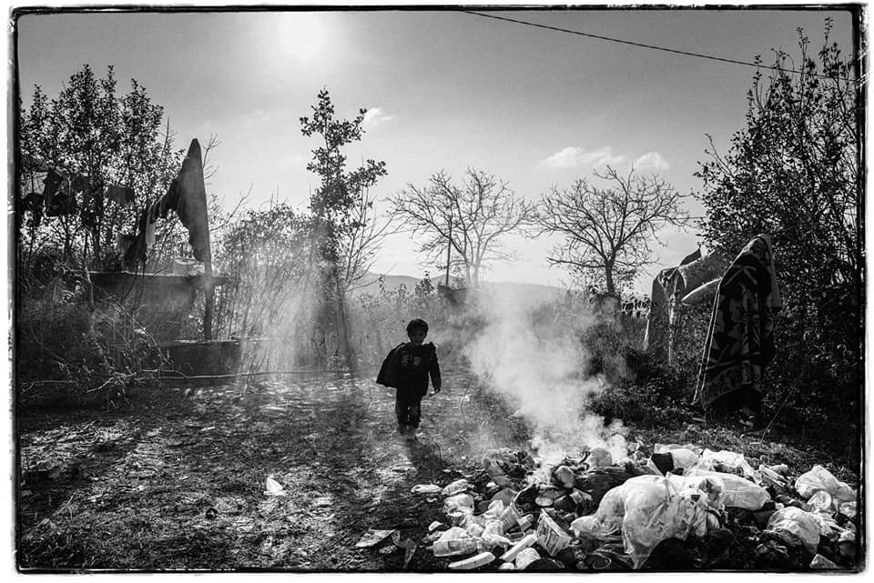
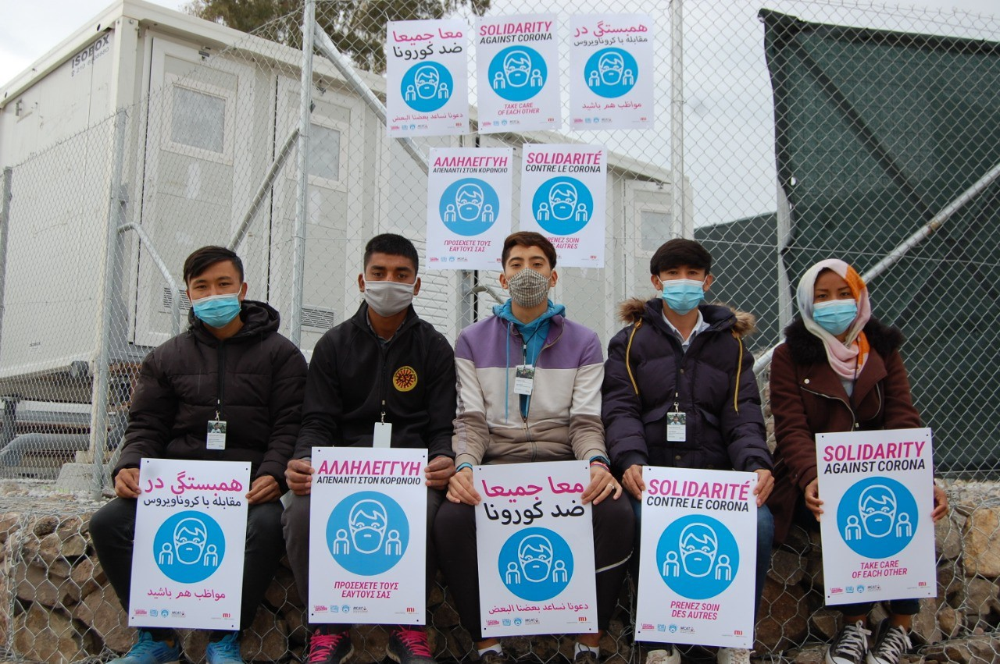

### AYS Daily Digest 7/12/2020: Iraqi Asylum Seekers in Denmark fear deportation

Partnership between UNHCR and Tunisia signed // Greece: New rules in camps further restrict transparency and freedom of information // Statement by Moria Corona Awareness Team // Rainy footage from Moria 2\.0 // Deportations scheduled from Germany to Afghanistan // UK: New disturbing information about Napier Barracks

A child’s life in Europe\. Copyright: Jan Grarup
#### FEAUTRE: Mass arrests of Iraqi asylum seekers in Denmark

According to [refugee rights activist Lene Kjær](https://www.facebook.com/lenekjj/posts/3453257981456132) , a large number of Iraqi citizens who have had their application for asylum in Denmark rejected, have been arrested by the police on Monday and have been transferred to the Ellebæk ‘exit centre’ for the purpose of deportation\. This is what Danish authorities call “motivational imprisonment”: detaining people in order to pressure them to sign voluntary return papers\. Denmark recently signed an agreement on deportation of people on the move who committed crimes in Denmark, and proceeded with the first deportation\. Authorities, despite pressure on Iraqi officials, cannot deport rejected asylum seekers to the country\. “Denmark has flown Iraqi people to Baghdad several times; every time they had to fly them back to Denmark because Iraqi authorities refused to receive people who are deported by force\!” However, over the last week, Denmark have [opened](https://www.mofa.gov.iq/2020/12/?p=19270) an embassy in Baghdad, which could pave the way to new negotiations\. **Activists engaged in refugee rights told AYS that they requested information about this from the Iraqi embassy in Denmark, which replied that no new agreement has been signed\.**

The police action has initiated a wave of anxiety among other refugees and asylum seekers in Denmark\. People at risk of arrest or return should immediately contact a lawyer in the area of immigration law to ensure that legal procedures are followed and respected\.

**Denmark has a return agreement with Afghanistan\.** People from Afghanistan are at risk of being detained in Ellebaek as soon as they receive a rejection of asylum, and to be detained until their deportation\.

**There is no return agreement with Iran\.** People from Iran cannot be deported by force\. Despite this, it has happened that people have been taken to Ellebaek\. As with people from Iraq, this is a method authorities use to pressure them to sign voluntary return papers\.

**There is no agreement with Syria on forced returns\.** “Syrian people are NOT at risk of experiencing this\.”

TUNISIA
#### Partnership signed between social affairs ministry and UNHCR

InfoMigrants [report](https://www.infomigrants.net/en/post/28945/unhcr-and-tunisia-sign-accord-to-improve-refugee-assistance?fbclid=IwAR2gqYnjZM2Q7pZnJtv2Z3LcwinbgPWG8P4dL5TDoB6LbhI1b2iP7m_RyUU) that UNHCR and the Tunisian government signed a Memorandum of Understanding on December 2\.

> _\[It\]_ will be implemented through a partnership between UNHCR and the Tunisian Union for Social Solidarity \(UTSS\) and will enable better access to reception services and temporary lodgings run by the ministry in Tunis, Sfax, and Sidi Bouzid, as well as the distribution of clothes for vulnerable refugees, asylum seekers, and Tunisian host communities\. 

The ministry and UNHCR had already partnered in the past years, and especially since the start of the COVID\-19 emergency: “since May 2019 refugees registered with the Tunisian office of UNHCR that have contracts authorised by the Tunisian labor ministry or that are self\-employed can access Tunisian social services \(CNSS\) \.”

GREECE
#### New rules apply for camps

Anyone working for an NGO inside the island camps will be bound by a confidentiality clause preventing them from discussing anything they see or hear while working, according to new rules published by the Greek government\. This means the work of journalists will be made even harder, transparency will be non\-existent and what happens inside the camp will stay inside the camp\. 
From the new ruling:

> “All information, data and personal data, which concerns or is related to a resident of the Structure, is considered confidential, regardless of how it is characterized\. In case of doubt about the classification of information, it should be considered confidential\.” 

The tactic is not a new one\. A [similar agreement was issued in the UK in November](https://www.theguardian.com/uk-news/2020/nov/23/home-office-accused-of-cover-up-at-camp-for-asylum-seekers) , restricting the disclosure of information from inside the Napier and Penally barracks\.

The [original text in Greek can be found here \(Art\. 8\)](http://www.pedkm.gr/pdf/%CE%925272-20.pdf?fbclid=IwAR2VHzrWGwHa0vDde_tynKbkIHWGRy-hsEemS6I7H13ErCSOZORRR8UJZ2s) \. A [translation of the relevant parts of the document from Google Translate can be found here](https://pastebin.com/e9ZEnuqp) \.

This is yet another restriction of press freedom, as it is becoming a common feature in Greek politics in these days \(also see our latest weekend digest\! \) \. 
Here you can find a thread by the journalist Franziska Grillmeier on how Greece has been challenging press freedom in the recent years:

■■■■■■■■■■■■■■ 
> **[Franziska Grillmeier](https://twitter.com/f_grillmeier) @ Twitter Says:** 

> > Yo, Media freedom and pluralism are pillars of a democracy (just saying). However, #pressfreedom is being severely challenged right now in #EU.

Just a few examples from #Greece. 20 Minutes ago in #Athens and a few days back on e.g. #Lesvos (short thread): 

> **Tweeted at [2020-12-06 15:16:18](https://twitter.com/f_grillmeier/status/1335603982878855170).** 

■■■■■■■■■■■■■■ 

Not only press freedom, but freedom of expression and the right to peaceful assembly are also under fire in Greece these days\. Amnesty International posted a thread about the latest events:

■■■■■■■■■■■■■■ 
> **[Amnesty EU](https://twitter.com/AmnestyEU) @ Twitter Says:** 

> > Two human rights lawyers, and many others including health workers and students were arrested yesterday in #Greece.

They were charged for breaching public health rules simply for protesting against #policeviolence on the anniversary of the murder of student #AlexisGrigoropoulos 

> **Tweeted at [2020-12-07 11:36:56](https://twitter.com/amnestyeu/status/1335911166464446466).** 

■■■■■■■■■■■■■■ 

#### Important statement by Moria Corona Awareness Team

Moria Corona Awareness Team published a statement on their Facebook page that we think is definitely worth sharing and thinking about\. MCAT is an organization run by residents of the former Moria camp\. The team is trying to implement measures to protect the camp residents from the spread of Corona virus\. 
In their statement, they remind the reader of what they come from:

> “You know if most of us close our eyes in the evening to sleep the camp fills with nightmares and we often hear people scream in their dreams, because they remember all the horror they have seen\.
 

> We lost loved ones, saw how bombs and guns killed others, we lived in fear and terror\. This is why we came and asked for protection and asylum\. And all of us live in daily fear of rejection and deportation back to countries where killing is the most normal thing\.
 

> This is our reality and it will stay\. All these terrible memories will always be there and only we hope one day our children will grow up differently\.” 

MCAT struggles with the fact that many young volunteers publish photos of them smiling and laughing and thereby spreading the image of Lesvos as a nice place\. They therefore want to remind volunteers:

> “If you come here, please when you go to bed in your hotel or apartment think what happens to us in the camp and all the nightmares haunting us\. That’s all\.” 

Moria Corona Awarness Team’s latest activity was to put up new waterproof posters in the camp in order to inform people about the coronavirus and what to do against it\.

Copyright: Moria Corona Awareness Team
#### Rainy updates from Moria 2\.0

With winter, rain comes to Lesvos and Moria 2\.0\. According to ReFocus, people in the camp needed three hours of building after it rained for one hour, in order to keep the tents as dry as possible\.

■■■■■■■■■■■■■■ 
> **[refocusmedialabs](https://twitter.com/refocusmedialab) @ Twitter Says:** 

> > Seeing rain in forecast shouldn't immediately bring forth dread, and an hour of rain shouldn't require three to clean up. Rain is in the forecast six more times this week. What will this camp will look like by next week if this was just an hour? #EuropeMustAct #LeaveNoOneBehind https://t.co/O9dizpf3u4 

> **Tweeted at [2020-12-07 22:12:25](https://twitter.com/refocusmedialab/status/1336071089911439362).** 

■■■■■■■■■■■■■■ 

Also, the journalist Mortaza Behboudi has published several videos \(in French\) about the situation\.

■■■■■■■■■■■■■■ 
> **[Mortaza](https://twitter.com/mortazabehboudi) @ Twitter Says:** 

> > Obrigadou nous dit plus sur le nouveau camp militaire à #Lesbos : https://t.co/tnxxy8k60D 

> **Tweeted at [2020-12-07 14:09:58](https://twitter.com/mortazabehboudi/status/1335949678219845632).** 

■■■■■■■■■■■■■■ 

A short insight into the situation can be found on ARTE, in German and French, produced by Mortaza with the help of Franziska Grillmeier\.

#### Support needed

**European Lawyers in Lesvos** are in need of financial support in order to continue providing free legal assistance to asylum seekers on Lesvos\.

**Together for better days** tries to help unaccompanied minors to be reunited with family members in Europe\. They recount the story of Mohamed, a minor who arrived on Lesvos in August 2019\. His application for reunification with his brother in Sweden was approved ten months ago, but the Greek authorities still have not provided him with a plane ticket and the necessary documents to join his brother in Sweden\. 
Between the 14th and 18th of December, Together for better days will have a fundraising campaign\. If you can, please consider supporting them\. 
Check their FB for updates\.
#### Moria’s missing people

Apparently the numbers of residents in Moria camp were never accurate\. Solomon has published an article which indicates that out of the 12,000 residents of Moria according to official data, about 3,000 were missing\. They made it to the mainland and lived there in very precarious conditions\. 
Read the full piece here:

BOSNIA AND HERZEGOVINA
#### What’s left after a pushback?

From the following [thread](https://twitter.com/namiksep/status/1335134150932705281) by [**Namik Šepić**](https://twitter.com/namiksep) **: “** Town of Glinica, Velika Kladuša\. Pushbacks are everyday here\. Migrants are brought in vans, then taken out by one person, beaten with sticks, stripped and robbed of personal belongings — they keep the money for themselves, they usually break their phones … So far, the Border Police has recorded over 200 cases of illegal activities of the Croatian Police in the territory of Velika Kladuša alone\. In the town of Glinica, with a shot from a firearm aimed at intimidating migrants, Croatian police almost killed a boy in front of the family home\.”

ITALY
#### Kesha Nyia is looking for volunteers

The NGO Kesha Nyia is providing indispensable support to people on the move who are being pushed back from France to Italy in Ventimiglia\. For their latest updates, please see our [Weekend Digest](ays-weekend-digest-5-6-12-2020-greek-new-democracy-eeeea849fc9e) \.

Now they are looking for volunteers to support their work\.

Please visit their facebook page or contact: kesha\-niya@riseup\.net

FRANCE
#### More evictions in Calais

On Monday, Human Rights Observers [reported](https://twitter.com/HumanRightsObs/status/1335982837242220546) about three small settlements evicted by police\. Nine tents, five tarpaulins, eight blankets and four bags were seized because the inhabitants had left for a breakfast distribution\. A man was chased by a gendarme\. Evictions are carried out on a daily basis\. According to a [recent report published](https://www.project-play.org/advocacy-reports) by Project Play and Refugee Rights Europe, from the beginning of the year until November 3rd, the police carried out 822 evictions in Calais and 71 in the Grande\-Synthe area:

> Evictions result in real obstructions with regards to accessing food, sanitation, shelter and the bare minimum standards of child protection; all of which constitutes a blatant disregard for children’s rights in any context and is exacerbated by the current global health pandemic\. 

Below is the video of another eviction, carried out on Saturday:

■■■■■■■■■■■■■■ 
> **[Calais Food Collective](https://twitter.com/CalaisFoodCol) @ Twitter Says:** 

> > This video was filmed by one of our volunteers yesterday, 8:49am in Calais. This is happening every morning : refugees are chased, harassed, their living spaces and personal belongings are destroyed. This is an organised manhunt so they cannot settle anywhere. https://t.co/DqpRQegsO5 

> **Tweeted at [2020-12-06 21:43:25](https://twitter.com/calaisfood/status/1335701403071881216).** 

■■■■■■■■■■■■■■ 

GERMANY
#### Deportation scheduled to Afghanistan

It seems that a deportation from Germany to Afghanistan is scheduled for 16 December\. A planned flight for 16 November was cancelled at short notice\. Information in English, German and Farsi about who is in danger of being deported and about what to do in this case can be found here:

It is recommended that people who fear deportation ensure that the immigration authorities are informed about existing illnesses, upcoming apprenticeships and other integration activities\.

Meanwhile, following an information request by the leftist party, it turned out that many Afghans wrongfully get their refugee statues denied\. Since the beginning of this year, almost 10,000 Afghans filed legal complaints against a negative decision of the BAMF, the ministry for migration and refugees, which is in charge of deciding about asylum applications\. In almost 60% of the cases, the court ruled that the BAMF was wrong when rejecting the asylum claim\.

This is especially disturbing as in the past there have been wild discussions about an alleged “false positive” asylum decision which, as later turned out, was not even true\. Instead, presumably thousands of asylum decisions are false negative ones\. This is yet further proof of how indispensable access to legal advice is\. Without this, even people who definitely have a right to asylum, even under the restrictive European law, are sent back to danger\.

EU
#### EU adopts a global human rights sanctions regime

[The Council of the European Union](https://www.consilium.europa.eu/en/press/press-releases/2020/12/07/eu-adopts-a-global-human-rights-sanctions-regime/?fbclid=IwAR3-LiTgwHTgjp11VZqxCKwtic6EC4NPj9GORkhQnHqrFcPWDRzugDRLgR0#) have adopted a new global human rights sanctions regime\. It will now be able to “target individuals, entities and bodies — including state and non\-state actors — responsible for, involved in or associated with serious human rights violations and abuses worldwide, no matter where they occurred\.”

Restrictive measures will include a travel ban for individuals, freezing of funds for both individuals and entities, and the EU will be forbidden from making funds available to those listed, either directly or indirectly\.

> The framework for targeted restrictive measures applies to acts such as **genocide, crimes against humanity and other serious human rights violations or abuses** \(e\.g\. torture, slavery, extrajudicial killings, arbitrary arrests or detentions\) \. Other human rights violations or abuses can also fall under the scope of the sanctions regime where those violations or abuses are **widespread, systematic or are otherwise of serious concern** as regards the objectives of the common foreign and security policy set out in the Treaty \(Article 21 TEU\) \. 

■■■■■■■■■■■■■■ 
> **[Carola Rackete](https://twitter.com/CaroRackete) @ Twitter Says:** 

> > Great! So since the @[EU_Commission](https://twitter.com/EU_Commission) knows EU military and @frontex pass aerial info to the sc Libyan coastguard, enabling the illegal pushbacks of reguees to a country at civil war where they face arbitrary detention, torture, rape.. - Will hold yourself accountable @[vonderleyen](https://twitter.com/vonderleyen)? 

> **Tweeted at [2020-12-07 20:09:48](https://twitter.com/carorackete/status/1336040232995745793).** 

■■■■■■■■■■■■■■ 

[Similarities have been drawn with the Magnitsky Act](https://www.axios.com/eu-global-magnitsky-act-sanctions-1853435e-17f4-4bdd-9517-dc30462a7a7a.html?fbclid=IwAR0WUeb9PZM9r1kFuj1U29IRU6xQbwHFGspE2gSdoW6MbdtKk5quFnG9aeE) , “a U\.S\. law named for investor and activist Bill Browder’s late attorney Sergei Magnitsky, who died in a Russian jail after uncovering a massive fraud scheme allegedly involving government officials\.”

We can already think of a few countries carryIng out widespread and systematic abuses, and they’re all in the EU…
#### EU foreign ministers discuss the future of Libya

Media report that at the core of Monday’s EU foreign ministers’ meeting was Libya\. Read more [HERE](https://www.welt.de/politik/ausland/article221917902/Libyen-Europas-neuer-Fluechtlingsdeal.html?fbclid=IwAR1uFZYiJlhzJ2oGmcMjX9FkelfK8MrvHqcnBe9KO0Vqa0UzU8o_4o39Ga4) \(in German\) on what role the EU is discussing in order to curb the migration flow from the north African country\.

UK
#### Access to legal advice denied

[The Guardian published a piece](https://www.theguardian.com/uk-news/2020/dec/07/lawyers-denied-access-to-asylum-seekers-in-kent-barracks?fbclid=IwAR3c_el-m6pe3RX4ZanMqDWeMftKu-1FIbM3CCMPh8cZtintV51sMIYa2CY) on the situation in the Napier and Penally Barracks\. Both camps were installed hastily and started operations in September\. They house about 600 people who managed to cross the Channel and are now applying for asylum\. According to the Guardian, lawyers were not allowed to start operating in the camp as is usually the case\. Since many asylum seekers lack sufficient information about their cases and what they can do, access to legal advice is required\. As lawyers report in the article, usually they are allowed to provide legal advice even in detention centres, but were not allowed to access the Napier and Penally Barracks\. This is especially worrying since at the same time, some people seem to have been brought directly to detention facilities from Napier and Penally Barracks\. Actually they should go to supported accommodation after leaving the camps\. However, [media reported](https://morningstaronline.co.uk/article/b/refugees-swap-grim-barracks-for-detention-centres?fbclid=IwAR0Co52-qARAp8ElrfA98yD5wdEJXl_WoRUNO9EneVCywTENfsZYAjAunmc) that some find themselves in the Brook House detention Centre near Gatwick airport\.

Meanwhile the Home Office is [trying everything to accelerate deportations to EU countries under the Dublin scheme](https://www.theguardian.com/uk-news/2020/dec/06/uk-races-to-deport-asylum-seekers-ahead-of-brexit?fbclid=IwAR2zdaKlHpnNjTDtZuLwcmnjLFaGt20KUfyhBXzDAv-0J3GvEpTtLkgUTeM) \. At the end of the year Dublin deportations will end as no followup agreement could be reached in the Brexit negotiations\. This week alone, three flights are scheduled, two to Germany and one to France with possible transfers to Austria, Poland, Spain and Lithuania\.

Care4Calais is in contact with 80 people who are being held in detention pending deportation\.

> “Their terror cannot be overstated\. They have been through hell, suffered conflict, torture and persecution, but the only thing our government cares about is making them someone else’s responsibility\.” Care4Calais 

#### Event on UK’s Government “Channel Crossing Solutions”

[Border Criminologies](https://www.law.ox.ac.uk/research-subject-groups/centre-criminology/centreborder-criminologies) and [Refugee Rights Europe](https://refugee-rights.eu/) will co\-host a round table on the Home Office proposals in response to the Channel crossings\.

GENERAL
#### PACE Standing Committee condemns attacks on NGOs

The PACE \(Parliamentary Assembly of Council of Europe\) Standing Committee met on Friday and “strongly [condemned](https://reliefweb.int/report/world/ending-attacks-and-discrimination-against-ngos-assisting-refugees-and-migrants?fbclid=IwAR0wLmigKrDaNLDwQ-yHA_9BJeKGXQXm5XQ_7vW6UMC7iY1AVJp_XmCz2VY) attacks on NGOs and their donors assisting refugees and migrants”\. It stressed its condemnation of all forms of attacks: “physical violence, legal obstacles, judicial, administrative or fiscal harassment, smear campaigns, political accusations or even racist acts”\.

Such attacks hit us at Are You Syrious, as well as dozens of other grassroots groups and NGOs in many parts of Europe, the most recent being the accusations against organisations such as Josoor, Mare Liberum, Sea Watch and others on the Greek Eastern Aegean islands\.

WORTH READING
- Alex Randall on twitter analyses how apocalyptic narratives about climate\-linked mobility can end up fuelling anti\-migrant / refugee sentiment\. [Check out the Thread](https://twitter.com/alex_randall/status/1335938623204700160) \.
- The Dutch newspaper NRL published a long, detailed **investigation on suspected Syrian war criminals who are now living in The Netherlands** \. You can find the full article in Dutch [HERE](https://www.nrc.nl/nieuws/2020/12/04/gevlucht-uit-syrie-maar-nog-steeds-bedreigd-a4022478) , or a shorter version in English [HERE](https://www.dutchnews.nl/news/2020/12/syrian-war-criminals-living-in-netherlands-as-refugees-nrc) \.
- [**Frontex and humanitarian rescue ships\. What’s the status?**](https://thecivilfleet.wordpress.com/2020/12/07/why-did-frontex-help-an-ngo-ship-rescue-refugees-in-the-mediterranean/?fbclid=IwAR1t1XbIoUhOmJHbRKChHQXPrZk4AWHRpyiyB0F-CslsMcGOQV1o872KrbA) Frontex claims it is not its policy to ignore rescue ships in the Mediterranea, but “Almost all of the activists involved in the NGO refugee rescue missions that I have spoken to this year and last have told me that Frontex’s planes do not alert them to refugee distress cases in the central Mediterranean\.” An article by The Civil Fleet

WORTH LISTENING
- Coming December 10th, the Cities of Refuge research project based at Utrecht University will launch a podcast of the same name\. 
[**In this introductory episode**](https://blubrry.com/cities_of_refuge/71109652/coming-soon-the-cities-of-refuge-podcast/) , Barbara Oomen and Moritz Baumgärtel tell us more about the project and the team, and offer a glimpse into what we can expect from the first few episodes\.

EVENTS
- [**Organising for migrant rights in Barnet and beyond\.**](https://www.barnettransformed.com/events/organising-for-migrant-rights-in-barnet-beyond-from-grunwick-to-the-hostile-environment) **Wednesday 9/12, 7pm \(GMT\) \.** Join us for the final session in our three part series on organising and campaigning\. Hear from those organising in migrant communities; as we explore the historical context, current policy environment and how you can support existing campaigns\.

**If you wish to contribute, either by writing a report or a story, or by joining the info gathering team, please let us know\.**

**We strive to echo correct news from the ground through collaboration and fairness\. Every effort has been made to credit organisations and individuals with regard to the supply of information, video, and photo material \(in cases where the source wanted to be accredited\) \. Please notify us regarding corrections\.**

**If there’s anything you want to share or comment, contact us through Facebook, Twitter or write to: areyousyrious@gmail\.com**

_Converted [Medium Post](https://medium.com/are-you-syrious/ays-daily-digest-7-12-2020-iraqi-asylum-seekers-in-denmark-fear-deportation-ed6c3791e360) by [ZMediumToMarkdown](https://github.com/ZhgChgLi/ZMediumToMarkdown)._
