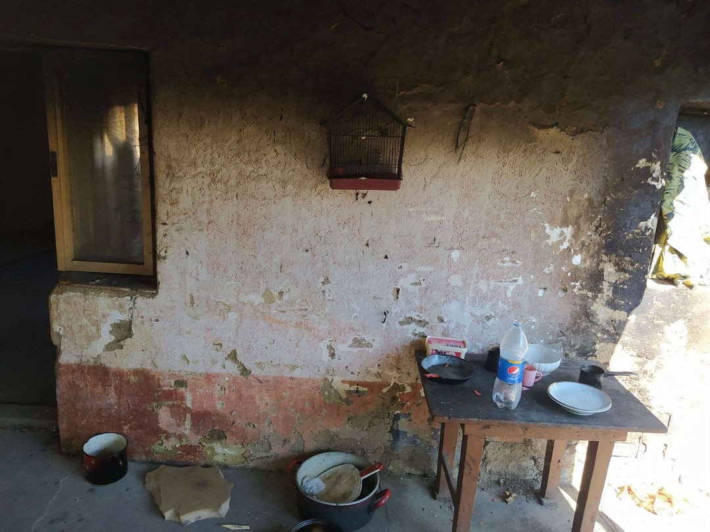
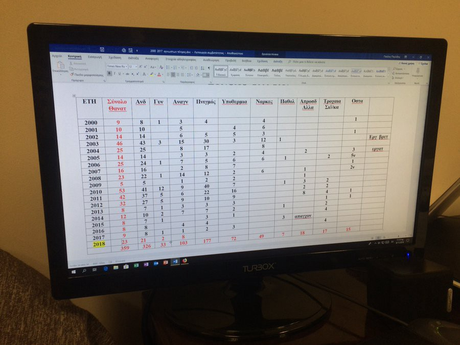
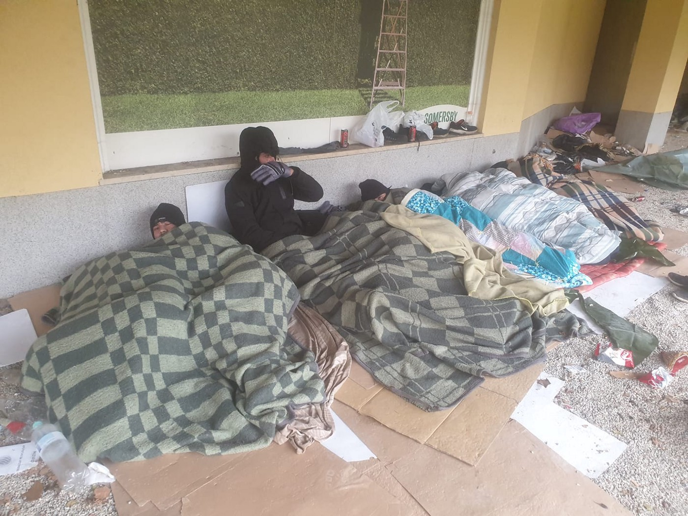
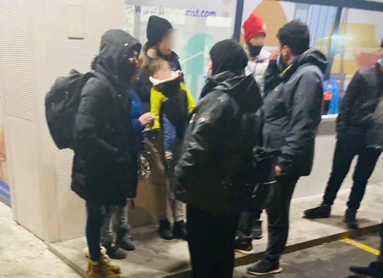
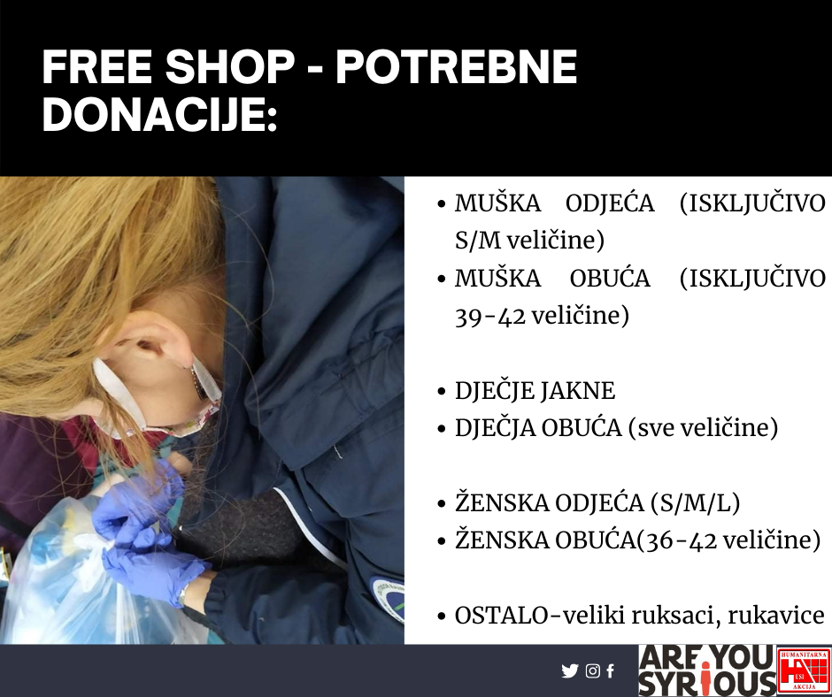
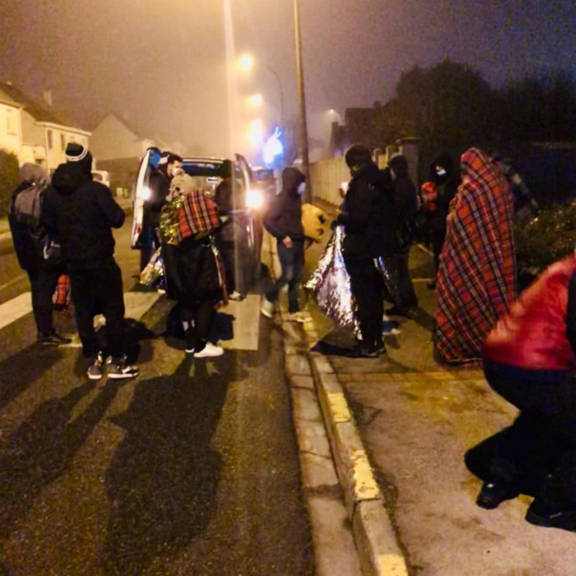

### AYS Daily Digest 9/12/20: Officials intimidated NGOs, preventing legal assistance to people brought into a deserted factory by the police
#### Serbia in crisis of accommodation and reception, most of all — of political will / Bosnia and Herzegovina in the midst of humanitarian crisis, brought by both the local politics and international actors / AYS Free Shop needs donations / Across France people in need of emergency accommodation / Serious development of the situation on the Canary Islands / & more news

#### FEATURED

Serbia — In a country where all centres intended to lodge people on the move are over capacity and conditions are nowhere near what might be fit to house people, where a dire need for more accommodation has brought the organisations working with people on the move to status quo, and where everything is in such state that it begs for a change in order to move things forward, officials are often not the address to turn to in order to solve the problem, but rather they are its root cause\. In one of the most recent events, members of [Klikaktiv — Centar za razvoj socijalnih politika](https://www.facebook.com/klikaktiv/?__cft__[0]=AZVqx_Q4gXSMUJm_7Ao7gze5zhUoug9evh--yZ1ztO8-Avc2uSHPrORlNGheHvHNZ4BELjVbQ2N7jP4emeQnYDqs_1JOtjz999fC9A0FGaJK5GPp9nmhfDZpfib3_e9SeJ-D0nhBeGWfAdNQNBeZH110XRBa46TKXQb4skIbPVwvGHAYC4P2j8D4sQz66cuFNJBKX-RajurKNHojwVPmDlrf&__tn__=-UC%2CP-y-R) documented one of many mistreatments by the police and very avid proof of the lack of basic knowledge of the law, obligations and rights, particularly human rights, that all headlines will be full of on 10 December\. They write:

“During yesterday’s visit to Majdan, a place on the border triangle of Serbia, Romania and Hungary, our team was hindered in carrying out activities providing legal support\. People are mostly found in abandoned houses at Majdan, but recently they have also been placed in a former milk factory where the police take them so that they do not stay in abandoned houses in the village\.”

> There are around 50 people in the village, while there are 90 in the factory, with no electricity, drinking water, they receive no blankets, sleeping bags or tents, or any other humanitarian aid\. Also, they do not have access to medical and legal assistance, which they urgently need\. 

The police patrol, which is now constantly in the village, told us, after they checked our identities and ID cards, that they have an order from their police station to tell us that we are not allowed to carry out our activities independently, but that we should first contact the Commissariat for Refugees and Migration of Serbia \(CRMS\) and to carry out activities together with them only in camps that are run by CRMS\. We emphasize that **the Law on Asylum** stipulates that legal aid is provided exclusively by non\-governmental organizations, while CRMS is given the authority only to provide material conditions for reception, they state, continuing to state that this was not the first such event in Majdan:

A month ago, the police also checked our ID cards in Majdan, but then the police officer, after consultations with the Kikinda PS, said “he recommends that we first contact CRMS and carry out our activity in refugee camps together with them later on\.” A police officer was much more careful in giving a statement at that time, telling us that he “recommended” this to us, which is the only thing he can do, considering that neither then, just like yesterday, we did not break any law\. Of course, we continued our work back then, but yesterday, regardless of the fact that the police officers behaved correctly while interacting with us, after our lawyer explained that, according to the Law on Asylum and the Law on Providing Free Legal Support, we have the right to continue with our activities, the policeman who received the order from his superiors only said that he knows nothing about the laws, but he was just told to pass this warning to us\. After this incident with the police, it was impossible for us to establish normal contact with the refugees because they were scared of the police presence the whole time, since the police officers followed every step we made\. When we went to the “Factory” a little later, which is located outside the village, an employee of the **Commissariat for Refugees arrived again, ten minutes after we did, and soon after him came an intervention unit of the police\.** After that, we left because we were worried that if we insist on continuing our work it might create further problems for the refugees with the police\.”

> Police officers on the ground, regardless of their correctness in conversation with us, showed that they have no knowledge of the law and with their rhetoric created almost impossible working conditions for us\. This is a clear example of criminalization \(even if it was involuntary and caused by ignorance\) of humanitarian work, but we as an organization will not give up and will continue to provide legal and psychosocial support to all refugees who are on the territory of Serbia\. 

As a reminder of the situation in Serbia, we recommend reading what our friends at the Asylum Protection Centre in Belgrade had to say about the asylum system in Serbia:

■■■■■■■■■■■■■■ 
> **[Azil u Srbiji Asylum Protection in Serbia](https://twitter.com/APC_CZA) @ Twitter Says:** 

> > Kako da ih smestimo kada nema dovoljno mesta, kako da ih zaštitimo kada im ne utvrdjuemo status? Kako da se bavimo migracijom i azilom kada nemamo plan pa niko ne zna i misli da zna šta je plan... 

> **Tweeted at [2020-12-03 21:57:34](https://twitter.com/apc_cza/status/1334617801043156994).** 

■■■■■■■■■■■■■■ 

#### GREECE
### State accusations against the NGOs continue

**Greek government says recent arrivals of Somali migrants may have been coordinated by Turkish authorities**

According to the Greek Ministry of Migration, a Turkish liaison office in Mogadishu has been helping applicants to obtain visas with documents provided by Turkish\-funded institutions in Somalia, including a hospital and a university\.

“Turkey must prevent illegal crossings”, said the Greek Migration minister in his most recent [press announcemen](https://www.mitarakis.gr/press/80-press-releases/6311-20201208-dilosi-tourkia) t, mentioning the Somalis and adding a number of untrue information that are easily fact\-checked, something that has unfortunately not been a trend when reporting\. He said that “of the 214 arrivals since 1 November on Lesvos, 142 are from Somalia\. According to testimonies and cross\-referenced information, NGOs pay the costs of transporting & issuing the visa to Turkey, with flights to Istanbul\. They are then transported to the Turkish coast, where smugglers, again with the support of NGOs, help them to enter the European Union illegally\.”
These lies have been supported from the Ministry’s side only by video testimonies of Africans where they say that they were instructed by the smugglers “to use the Aegean Boat Report, once they landed on Greek shores, to contact the UN refugee agency”\. Would they then accuse everyone the smugglers refer people to? Here is a reaction of one of the organisation’s accused\.

[](https://l.facebook.com/l.php?u=https%3A%2F%2Faegeanboatreport.com%2F2020%2F12%2F08%2F1998%2F%3Ffbclid%3DIwAR1zHiJYsPjjwmlfKIoKWP_tDmrZ-dRCkVTFBG7PHGNPVmngKaHXmX1M_rc&h=AT2yJqHIT6xM0Ln1neeKqlS1KU7cuPvRDtCRDvP3cuBpjRn9h3u3hBhJT1mi-khek2Qh4bNyhJ0jP4s_xH8Bcgqm07EM8EaeO_h-BCAo6mxCC_cEc2NQSK-_QDVc1BJJVOrJyOMjIxA1MQ&__tn__=R]-R&c[0]=AT3UY2A1tsOEZe_TC5CwV4az0aA0ko6_oCkWSepp3DfqDNQF_MfDEQtRyp8zbb5LZJt00GkVSdkmJjRNQCO9TJelmgYtgpImR2q6X-1p9vusqGn7qZGl609nqin_slevI7wYHtQnVcb-eJ5Ulw0S3XY2lZMS45sNNZHKghCI-UTeAlf82lmzkDXO-PynPjM7ydFIbr5aTk8jPipOdA)

Accusations such as these have been present across the continent, where the governments unfortunately instead of celebrating a strong civil society, criminalize those citizens who dare to think of someone other than themselves and demand rights to be respected for everyone, no just those around them\.

■■■■■■■■■■■■■■ 
> **[yorgos K.](https://twitter.com/yorgovich) @ Twitter Says:** 

> > Mr. Mitarakis would maybe prefer that independent voices didn't exist, as they make it really harder for authorities to break the law. But that doesn't mean that NGOs are breaking the law.
Support and defend @[ABoatReport](https://twitter.com/ABoatReport)
(drawing by @[yorgovich](https://twitter.com/yorgovich) , thanks to a tw by @[maledictus](https://twitter.com/maledictus)) https://t.co/OtsYp1oM77 

> **Tweeted at [2020-12-09 20:50:52](https://twitter.com/yorgovich/status/1336775343894622212).** 

■■■■■■■■■■■■■■ 

As we reported earlier, [over 30 organisations and aid workers](https://www.spiegel.de/politik/ausland/verfahren-gegen-ngos-in-griechenland-man-will-uns-ruhig-stellen-a-6dcab115-2f50-45ef-ac8c-4d036d8bfe5c?utm_source=dlvr.it&utm_medium=[facebook]&utm_campaign=[spontop]#ref=rss) were being investigated by the Greek police\. In the meantime, people have not stopped arriving:

■■■■■■■■■■■■■■ 
> **[Aegean Boat Report](https://twitter.com/ABoatReport) @ Twitter Says:** 

> > On 28 November, 10pm, a boat carrying 18 people landed in Ag. Kratigou, #Lesvos. They fled to the woods, hiding from the police in fear of being deported in the cover of darkness. Pictures, video &amp; geo location data was collected as documentation of their arrival on Lesvos. https://t.co/wbfq0PYlDB 

> **Tweeted at [2020-12-09 11:28:37](https://twitter.com/aboatreport/status/1336633847736389632).** 

■■■■■■■■■■■■■■ 

> A recent [Greek ministerial](https://www.e-nomothesia.gr/kat-allodapoi/upourgike-apophase-23-13532-phek-5272b-30-11-2020.html) decision includes a confidentiality clause preventing aid workers, including volunteers, from speaking about their work at Greek migrant camps to the wider public\. 

■■■■■■■■■■■■■■ 
> **[Manos Moschopoulos](https://twitter.com/maledictus) @ Twitter Says:** 

> > In the Greek government's own propaganda video, a Somali refugee shares an inconvenient truth.

That Afghan and Syrian refugees are indiscriminately thrown in prison in Turkey.

So why does Greece find their asylum applications inadmissible, if Turkey is not a safe third country? https://t.co/ugt6BHiWFb 

> **Tweeted at [2020-12-09 09:00:01](https://twitter.com/maledictus/status/1336596449631547393).** 

■■■■■■■■■■■■■■ 

> While Greek authorities blame NGOs — the Greek government and EU stay blind to the fact that Greek authorities and EASO have completely scrapped procedural safeguards to asylum interviews on Lesvos, making it even worse than in Moria\. 

### A complaint was submitted by legal NGOs on Lesvos

■■■■■■■■■■■■■■ 
> **[تارا/Tara](https://twitter.com/se_tareh) @ Twitter Says:** 

> > “On several occasions it has been observed that applicants are pressured into conducting interviews at extremely short notice and in a language other than their native language“

Complaint submitted by legal NGOs on Lesvos. https://t.co/9ho8UJ0vlH 

> **Tweeted at [2020-12-09 08:07:22](https://twitter.com/se_tareh/status/1336583202530582528).** 

■■■■■■■■■■■■■■ 

In the meantime, the conditions in which people are left staying at, because that’s not living, in Kara Tepe, Moria 2 are day in day out proving to be unbearable\.

■■■■■■■■■■■■■■ 
> **[thαnasis Voulgarakis](https://twitter.com/th_voulgarakis) @ Twitter Says:** 

> > Difficult night without electricity and heating, 13 degrees tonight and in #Moria2 are housed in summer tents. 
Photo by M.O . #Refugeesgr #LeaveNoOneBehind https://t.co/zC4afutGOU 

> **Tweeted at [2020-12-08 20:03:48](https://twitter.com/th_voulgarakis/status/1336401110400118784).** 

■■■■■■■■■■■■■■ 

The Greek Helsinki Monitor filed a criminal complaint “based on the new Human Rights Watch report concerning Greek authorities’ indifference towards the fact that the location they chose to build Moria 2” as it endangers people’s health, as well as that of the personnel, “exposing them to potential lead poisoning”, it is [reported](https://l.facebook.com/l.php?u=https%3A%2F%2Ftwitter.com%2FVassilisTsarnas%2Fstatus%2F1336774051289833473%3Ffbclid%3DIwAR39QJkWtnG0zBfESLIbiVO6kGsYh2RvZ59H4BIWn8GOq9LiZsX_Cb-T7bo&h=AT2YVwx0WUBa5S_nIcn0ULV2XJkYK3EK63EczftoDhMXV3pMYSURjb246-dlN-0Wz6j8BBVrb5zyLKw-7nmcCFOQcwIMijcIz_TbLvlzCk9tJ8y802hwM7ZosOCZTsRn6cHHvHSbtrh0zw&__tn__=R]-R&c[0]=AT3UY2A1tsOEZe_TC5CwV4az0aA0ko6_oCkWSepp3DfqDNQF_MfDEQtRyp8zbb5LZJt00GkVSdkmJjRNQCO9TJelmgYtgpImR2q6X-1p9vusqGn7qZGl609nqin_slevI7wYHtQnVcb-eJ5Ulw0S3XY2lZMS45sNNZHKghCI-UTeAlf82lmzkDXO-PynPjM7ydFIbr5aTk8jPipOdA) \.
### Can all the lives lost at the borders even be counted?

This is a photo of the spreadsheet kept by the coroner of the Evros region\. It only lists bodies found on the Greek side and in the stated periods\. Reportedly, due to lack of collaboration with the Turkish authorities, he can only estimate that there are as many on the Turkish side, and many who were never found\.

The report published by the EU Fundamental Rights Agency lists 133 victims in the Evros region for the period between January 2018 and October 2020, Levidis says\.

■■■■■■■■■■■■■■ 
> **[Stefanos Levidis](https://twitter.com/LevidisStefanos) @ Twitter Says:** 

> > To conclude, counting border deaths is a very dangerous exercise which many activists rightfully refuse to do. It can relativise and normalise loss of life. Compared to other regions, however, there is no clear picture of the Evros's lethality. It should not be overlooked. 

> **Tweeted at [2020-12-09 10:43:44](https://twitter.com/levidisstefanos/status/1336622552001769474).** 

■■■■■■■■■■■■■■ 

#### BOSNIA AND HERZEGOVINA

 is organising a crowdfunding for the people on the move across Bosnia and Herzegovina, please visit [their page](https://www.facebook.com/blindspots.support/photos/a.111026334140139/128729782369794/) for more details and information\.](assets/a48739b61b31/0*geYs0-Z7c81ibFEV)

[BLINDSPOTS](https://www.facebook.com/blindspots.support/?__cft__[0]=AZVp0EryiuzR7H044PXmUgp-9vH30Q6EYByNqGldGpJAZdyuu8sVYsA1bCpOGcW_1P5L76WiqvKb4w-nMYqtD58zUixnhLCGOOPk0nBsNgrz-L1U5PgClb-03AFbsjJdYWMulYKHVrSEomTH05f66-37W4T9WD7Ls4psLuuwwVJMlWDLsBVbVgcEYMk-tMBupt2R_VUnUvZDB_pB-Zp93Ad2&__tn__=-UC*F) is organising a crowdfunding for the people on the move across Bosnia and Herzegovina, please visit [their page](https://www.facebook.com/blindspots.support/photos/a.111026334140139/128729782369794/) for more details and information\.

Due to the fact that no solution was proposed for housing people who are already scattered across the country, many are still sleeping rough, fearful of whether they will stay healthy or even survive through the winter that is getting very hard in most of the country\. Day after day, small groups and individuals provide people will the basic things to cover and survive, but their means have fallen short and it is only the question of time when more lives will be lost\.

Tuzla, photo by Tuzla volunteers
#### CROATIA
### AYS is in need of donations\!

As the winter is arriving, many people across the continent are finding it difficult to reach the much\-needed donations to keep them safer and warm, especially given the lockdown policies in most countries\. In Zagreb, Croatia, AYS still runs and operates the Free Shop for all people in need\. At the moment, the people arriving at our Shop are in great need of warm clothes, shoes, underwear, as well as winter gloves, hats, scarves, and sleeping bags\. We accept donations directly in Zagreb, but also in parcels sent by post or in Croatia, through Tisak and other postal services\.
Our volunteers are now preparing the things people have asked for, for pick\-up, so as to keep the space as safe as possible for everyone\.

> We miss the children’s laughter and the cup of tea we’d usually share with our friends and those donating things, but we believe that with your help we will be able to meet the challenges\. 

**This is what’s needed:**

> _MEN’S CLOTHES \(only size S/M\):_ 
 

> _\- warm long sleeve t\-shirts, hoodies, jumpers and sweaters_ 
 

> _\- jeans, trainers and other practical and warm trousers_ 
 

> _\- underwear and socks_ 
 

> _MEN’S SHOES \(only size 39–42\):_ 
 

> _\- warm trainers/sneakers, winter shoes, sport and hiking boots_ 

> _CHILDREN’S CLOTHES:_ 
 

> _\- winter jackets in all sizes_ 
 

> _CHILDREN’S SHOES \(all sizes\)_ 
 

> _\- warm shoes and trainers/sneakers, winter shoes, boots, hiking shoes_ 

> _WOMEN’S CLOTHES \(sizes S/M/L\)_ 
 

> _\- winter jackets, jeans, tights and trousers, underwear, socks_ 
 

> _WOMEN’S SHOES \(size 36–42\)_ 
 

> _\- warm trainers/sneakers, winter shoes, boots \(no high heel shoes, please\)_ 

> _HYGIENE PRODUCTS \(shampoo, shower gel, sanitary pads, wet wipes, diapers sizes 5 and 6\)_ 

> _& sleeping bags, gloves, winter hats, scarves, backpacks_ 

We invite everyone to be conscious of respecting the dignity of everyone who might receive these donations and to bring/send practical, simple, clean and washed items\. In case you decide to support us, let us know by contacting us via our Facebook page or by email, so our Free Shop volunteers are prepared\.

#### SPAIN
### The journey of hundreds from the Canary Islands to the peninsula opens a new front for the Government

More than 1000 people have died this year fleeing across the Mediterranean\.

It is estimated that about 19,000 people disembarked this year on the Canary Islands, more than half of them were Moroccans, [and there are more than 500 dead,](https://elpais.com/espana/2020-11-25/rescate-a-la-luz-de-los-moviles-en-lanzarote.html) as the Spanish media report\. This has developed into the most dangerous route to reach Europe, but circumstances [continue to push hundreds of people to leave without expectations\.](https://elpais.com/espana/2020-10-31/los-nuevos-inmigrantes-de-la-pandemia.html) Read [more](https://elpais.com/espana/2020-11-29/cuatro-meses-de-caos-en-la-gestion-migratoria-en-canarias.html?fbclid=IwAR2nto56yMmOTqcTWKuGcX2PVQNHUlOafmy2qotQdKyH0gmKc1kJigK68uA) \.

People who arrive to Spain in this way often have nothing much to hope for from the social and work system as the stories of many exploited people testify\. One of them is a young woman from Morocco who has just died\.

> Since she fell ill, Fatima had not received any salary, allowance or benefit to deal with her treatment\. Nor had she received any help from the organizations financed or expressly contracted by the Andalusian Government for the socio\-health care of Moroccan women from the contingents in origin: the Interfresa employer _lobby_ \(whose subsidized [_PRELSI plan_](http://revista.lamardeonuba.es/wp-content/uploads/2020/05/PRELSI.pdf) is voluntary for employers\) and the NGO [Women in Conflict Zone](http://revista.lamardeonuba.es/wp-content/uploads/2020/12/MZC-Memoria-2020.pdf) \. According to people very close to the deceased worker, the only times they contacted her was to offer her a ticket back to her country, something that did not meet her real social and health needs\. — [_the story_](http://revista.lamardeonuba.es/fallece-en-el-vazquez-diaz-una-trabajadora-marroqui-contratada-en-origen-y-despedida-tras-ser-diagnosticada-de-una-enfermedad-terminal/?fbclid=IwAR1fc6jNEh0aa8o0ybyB6aNudRk7lDfyR795ahisCwDGIB8Ktw7JOxqWvBg) 

#### FRANCE
### Left on their own in the north

Repeated checks under the bridges of Calais make it difficult for people to rest or create a small warm space for themselves as they are constantly checked and being moved around by the police, media [confirm](https://l.facebook.com/l.php?u=https%3A%2F%2Fwww.lavoixdunord.fr%2F904907%2Farticle%2F2020-12-08%2Fsous-les-ponts-de-calais-des-controles-de-migrants-repetition%3Ffbclid%3DIwAR31CS24Wu3vJg1vOouCqViahfKtOdWge4EtHuD9aDKidT7dvbcHPlnUGmg&h=AT2XwgRSQ4XpstTc2MVDLEHgaejX_oIufOL11mktJs2ELAcnK-hI3vqNC5Nt2zMW9myrpH5-Mdtomi1ApiwM-FUv38jDl9FoG39-dztZR2mKCgAnYGAJgBvSPhpCV_XjTw&__tn__=%2CmH-R&c[0]=AT0DGX_7ilR9hl_hdGsW0JvKpR56-0YnwJ0hYjPJ7pE5tSd1-YpnsD0q4FLEdAUV4x7mPnh2QGC-ExYSHmBAmYIKTqG1rX7i8_jnZg50RhsOaDqyW-k0OVK7faBLV13toO0awivobeyoZlYVhWLYdfYTdemMQOhTBmW7Qep-TH7hkUNK) \.

In Gravelines, a group of activists reported that at 3 am, a group of 17 people, including women and unaccompanied minors, contacted them via their emergency number saying their boat had capsized a few hours before\.

Photo: Solidarity\.border

> “The emergency services and the police intervened, then once they got out of their boat they were asked to leave on foot\. This group then found itself in the heart of the town of Graveline, lost, soaked from top to bottom, at a temperature of 0 degrees and without an emergency accommodation solution\! What a shame \. \.” 

Their night team went to meet them to help them, handed them tea, food, clothes to change and some warm blankets for the night\. The group writes:

> We are totally appalled by this lack of humanity\. Yesterday we were clearly faced with non\-assistance to a person in danger\.
 

> Obligation to go and look for them at sea but then let them freeze to death\.
 

> So this is what your cold weather plan looks like\. 

### Human rights on the streets of Paris

Following the violence that occurred during the evacuations of the provisional campsites near Saint\-Denis and Place de République, several hundred people are still out on the street or poorly housed, local groups report\. Along with the support of organisations, these people have now decided to organize themselves and request to use buildings in the Ile\-de\-France prefecture\. Utopia 56 activists say they too are participating in this initiative to allow unconditional accommodation for all, social and administrative monitoring, while the cold is a permanent danger to people on the street\.

You can join them on **Friday, 11 December at 3 pm** to file requests for requisition and to ask the state to enforce the requisition law\!

#### GERMANY
### Petitioning for reception at the outlines of the Union

Refugee organizations are calling on the green\-black government to receive a national reception program for refugees at the European external borders and to improve the rights of residence for those living here\. According to the communication, the alliance delivered an open letter to the Baden\-Württemberg State Ministry on Wednesday, which more than 160 groups, initiatives, clubs and religious communities in the country had signed\. These are calling for an end to the “politics of seclusion”\. In order to be able to apply even more pressure, the refugee council and the so\-called Pierbrücken Baden\-Württemberg are looking for supporters for an online petition, News from the Med report\.
#### WORTH READING / LISTENING
- [New risks for families, repeat rebuilds, and post\-disaster migration on a cyclone\-battered coast in Bangladesh](https://t.co/m2tR5TH8K7?amp=1)
- Discussion on the post\-Salvini decree situation \(In Italian\) is featured on the page of [In Migrazione](https://www.facebook.com/InMigrazione/?__cft__[0]=AZXHM2oFwks33eZdBGXWjMbR8EPpcf7Md7s3XyBUkc8iWfSjHIn-VmQVUVCaElvbnq_AZ4FYa51RsSr9Rv3Cc4tVSEWgd0weGQn8slYjxMOsKIPq_AVsfMj-thmu3Ly7s4TAf1pOQEFbbH1GmvEjrjaCIxP2D-gwEKWkVUU8a3xBphN9fxc1xKqLfk_8k8ZnbxG3o3ktAwXN_OxUtAn16KAz&__tn__=kC%2CP-y-R) \( [video](https://www.facebook.com/InMigrazione/videos/418684522657379/?__cft__[0]=AZXHM2oFwks33eZdBGXWjMbR8EPpcf7Md7s3XyBUkc8iWfSjHIn-VmQVUVCaElvbnq_AZ4FYa51RsSr9Rv3Cc4tVSEWgd0weGQn8slYjxMOsKIPq_AVsfMj-thmu3Ly7s4TAf1pOQEFbbH1GmvEjrjaCIxP2D-gwEKWkVUU8a3xBphN9fxc1xKqLfk_8k8ZnbxG3o3ktAwXN_OxUtAn16KAz&__tn__=-UK-R) \)
- if you’ve missed reading the most recent FRA report from the borders, here it is:

**If you wish to contribute, either by writing a report or a story, or by joining the info gathering team, please let us know\.**

**We strive to echo correct news from the ground through collaboration and fairness\. Every effort has been made to credit organisations and individuals with regard to the supply of information, video, and photo material \(in cases where the source wanted to be accredited\) \. Please notify us regarding corrections\.**

**If there’s anything you want to share or comment, contact us through Facebook, Twitter or write to: areyousyrious@gmail\.com**

_Converted [Medium Post](https://medium.com/are-you-syrious/ays-daily-digest-9-12-20-officials-intimidated-ngos-preventing-legal-assistance-to-people-a48739b61b31) by [ZMediumToMarkdown](https://github.com/ZhgChgLi/ZMediumToMarkdown)._
