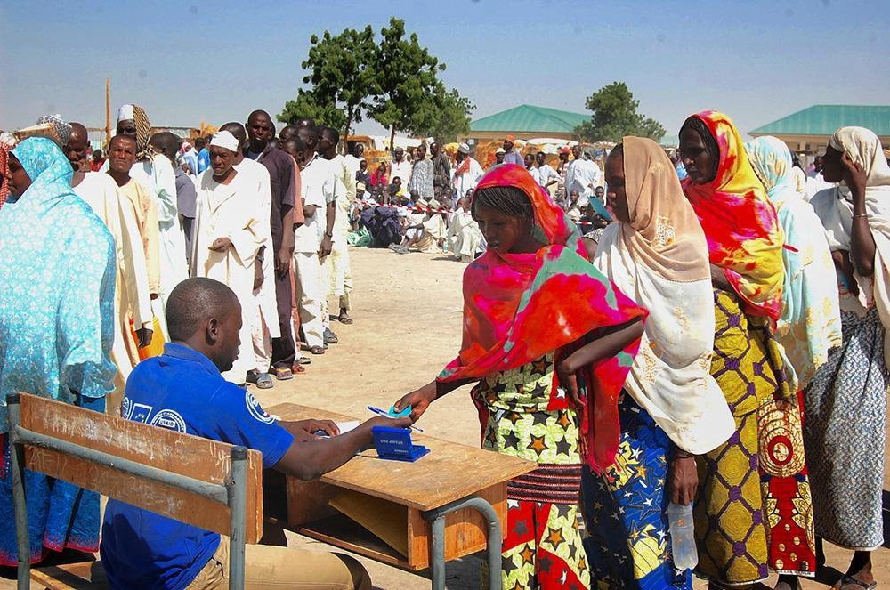
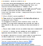

### AYS Digest — 10/12/2020: On Human Rights Day, the number of forcibly displaced people keeps growing at an alarming rate
### Humanitarian emergency in Bosnia and Herzegovina// Demonstrations and illegal pushbacks in Greece // New changes to UK immigration rules

Thursday, December 10th has marked the 72nd anniversary of the Universal Declaration of Human Rights, adopted on this day in 1948\. You can find the full document, available in a wide variety of languages, [here\.](https://www.ohchr.org/EN/UDHR/Pages/SearchByLang.aspx)

The IOM distributes relief items to IDPs in Ngala town, Borno \| Credit: IOM

On Human Rights Day, the UN Refugee Agency \(UNHCR\) has published a report estimating that the number of forcibly displaced people has surpassed 80 million already in mid\-2020\. The number includes 29\.6 million refugees, 4\.2 million asylum seekers, as well as 45\.7 million internally displaced people \(IDPs\) \. War, conflicts \(both existing and new\), and the coronavirus pandemic have all contributed to those figures as the year has passed\.

Find out more [here\.](https://www.infomigrants.net/en/post/29030/unhcr-numbers-of-displaced-people-in-world-passes-80-million?fbclid=IwAR0dR9_kWMDgzBJUBj1_rK7b6ZjzHbsp9hGkhf0x76LOJgINK1_DrJ6TM18)
### WESTERN BALKANS

Over 2,000 migrants and refugees in Bosnia and Herzegovina are currently sleeping outside in dire conditions, while 1,300 others are being housed in a temporary facility unsuitable for winter\. The EU delegation in the country, well aware of the inhumane condition of thousands of migrants in the country, has now [warned of a coming humanitarian crisis](https://www.infomigrants.net/en/post/29022/eu-says-bosnia-must-act-to-save-lives-of-migrants-and-refugees?fbclid=IwAR0zSL4cLggM2OYa68VBjWg0ZgBk3vIJfEum9KkbUeAPy8MzVGI_hqKee7w) in Bosnia, calling for urgent action by authorities in order to give shelter to migrants and refugees over the winter\.

> _The EU statement said the authorities in Bosnia and Herzgovina should act with the utmost urgency to save lives, immediately relocating the refugees and migrants in Lipa to an EU\-funded reception center in Bihac, which stands ready to host them\. The migrants were evicted unlawfully at the end of September from the “Bira” center in Bihac, 26 kilometers northwest of Lipa\._ 

This [video illustrates](https://twitter.com/InfoMigrants/status/1336667917384097793?s=20&fbclid=IwAR3eRFpKQ8dXCHP2CqxHvYCQQTw506XaXF7d6vv8F5cRjPd2Vj1EkQZZOvE) the harsh situation in Bosnia, with people sleeping rough in the cold of the fast\-approaching winter\.

Credits: Muhammed/SOSBihac

SOS Bihać reports today about the continuing eviction and destruction of camp Lipa\.

> _According to the people living in the camp, they have been told by IOM personnel that the last breakfast in the camp will be handed out on Tuesday\. The ongoing quarrels between the EU, IOM, Unsko\-Sanski Kanton and the Government in Sarajevo now have led to a situation reminding of last year, when the Vučjak camp was step by step left alone and people were neglected for some time\. The IOM is leaving claiming the camp cannot be approved as a winter camp\. A solution or the provision of living containers as it seems is opposed to by the EU as well as by Premier Fadil Novalić\. The reopening of Camp Bira was not allowed either\. As the bad news is spreading, people are already leaving the camp, partly to live in the woods\. Today several hundred men tried to walk to Bihać, presumably seeking squats to be protected from the cold\. Police including a special unit have been deployed to the roads and stopped whoever tried to reach town\. We’ve been told that as of Wednesday, SOS Bihać group will be trying to assist especially those from Lipa as good as possible\._ 

The Center for Peace Studies marks International Human Rights Day with [new criminal charges](https://www.cms.hr/hr/azil-i-integracijske-politike/na-dan-ljudskih-prava-nove-kaznene-prijave-cms-trazi-istragu-povezanosti-mup-a-i-muskaraca-u-crnim-odorama-s-fantomkama?fbclid=IwAR0iecAfiuzqV5x_VuPckaV2muoBXjBMumt8ECy4qZa6Q3_RcPuXlnv5nOs) for one of the biggest human rights violations today\. Today, the CMS filed two criminal charges with the State Attorney’s Office for two separate cases against unknown perpetrators, due to a well\-founded suspicion that a total of 13 victims, including two children, were kept in custody and then handed over to ten armed men dressed in black\.
### GREECE

AlarmPhone has received [notification of another violent pushback](https://twitter.com/alarm_phone/status/1337045099201630211) occurring last Sunday off the Greek coast of Kalymnos\. According to their sources,

> _a group of 28 people landed on [t](https://twitter.com/hashtag/Kalymnos?src=hashtag_click) he island\. Upon arrival, Greek authorities separated the men from the women and children, who were forced back to sea and later found on a life raft by the Turkish Coast Guard\. The men were detained, beaten, with some suffering serious injuries, and later forced back to the sea\. They were also found by the Turkish Coast Guard\._ 

Greece has abolished the shameful “protective detention” of unaccompanied minors at police stations\. Minister Mitarakis said there are now no unaccompanied minors in precincts, and the 119 unaccompanied asylum seeking children currently in Aegean Islands will be [relocated to mainland facilities](https://twitter.com/g_christides/status/1336997801511833600?s=20&fbclid=IwAR3CHlL0qYE_bjwWqcER1O2tmJiRMHHB9K0zJgBok2Jv32UfJzSYwdtL1aQ) \.

Meanwhile, heavy rains and thunderstorms [have hit the island of Lesvos](https://m.facebook.com/story.php?story_fbid=209877557308089&id=112829597012886) \. Human Rights Day in Greece\. Thousands of men, women and children sleeping in unheated tents battered by heavy rain\. Severe flooding is expected\. This is appallingly inhumane\. People must be evacuated to safety\. [Video credit:](https://twitter.com/chooselove/status/1337076482284335104...) a camp resident\.

There is torrential rainfall across the Aegean tonight\. Some people in the new “ [Moria 2” camp on Lesvos](https://twitter.com/f_grillmeier/status/1337106387462217733) are expressing severe fear; some report water is entering their tents, and the electricity is cutting off; while sand bags are not fully holding the water back\. More images from the camps are available [here](https://twitter.com/LysChadefaux/status/1337069018948247554?s=20&fbclid=IwAR0g0Q2B6RpGHgOTVY4zI8Ame3G2P--Z27ElY8a5t1yb0tl-C16-AYY1SRU) , and from Moria 2 [here](https://twitter.com/DunyaCollective/status/1337101195513573378?s=20&fbclid=IwAR1gNF4jx-b35FmklJBwENIUTr7MwcKZbwOEOO8zmSRS00fQfzWEfH8MdJ0) \.

On International Human Rights Day, [we present the first of a series of posts](http://facebook.com/EuropeanLawyersInLesvos/posts/2803301593323914) looking at the legal rights of refugees in Greece and the challenges that risk eroding them\.

[Last week the European Commission published a memorandum](https://www.facebook.com/.../a.104489524.../205120251100677/) of understanding detailing its plans to establish a closed\-controlled Multi\-Purpose Reception and Identification Centre \(MPRIC\) on [L](https://www.facebook.com/hashtag/lesvos?__eep__=6&__cft__[0]=AZXr3WgORYDpWHYOB3M7wq_S7GueJVKVD6m0E0sIbRhmb1BA_12tzVthyd5tJLoC1-yWWvBsDysI_WXl3UdlUikJ0e5oPEsjQ_jJmVFXPpDG9Y5IP4j4IXoW1zQwqaSsK0mBWjPSCxRM2EoPxh7X2hV2lDrYD8m7PAcDHS_bFYi48aQ1yXscUxgdX9o2uS0mB2w&__tn__=R]-R) esvos by August 2021\. The centre, which will have a capacity of 5,000, will supposedly provide common areas, safe spaces for vulnerable groups, education for children, medical care, psycho\-social care and adequate hygiene facilities\. it Looks nice on paper, but here at Europe Must Act, we see some signs that make us worry whether we aren’t headed for a Moria 3\.0\.

We also received news of [Demonstration in Ritsona camp](https://twitter.com/parwana_amiri/status/1336837438875062275) :

> _Months and even years passed , but we has not gotten our asylum decision yet, this process doesn’t go the same for all and we are obviously discrimination\._ 

A [egean Boat Report has received new evidence of an illegal pushback](https://www.facebook.com/AegeanBoatReport/posts/988631451659959) occurring in Greece earlier this month:

On the morning of December 5th a boat carrying 31 people was in distress south east of Leros, this was posted about the incident that day on Aegean Boat Report:

> _“A boat carrying approximately 31 people is in distress south east of Leros\. The boat has been drifting for at least 5 hours, and need immediate rescue\. Port police on Leros has been informed, all necessary information have been given to initiate a rescue operation\. There are many small children on the boat\. ABR have received information that they have managed to reach land, and are currently on the north tip of Kalymnos\.”_ 

### UK

Ministers have quietly changed immigration rules to [prevent people fleeing war or persecution from claiming asylum](http://Ministers%20have%20quietly%20changed%20immigration%20rules%20to%20prevent%20people%20fleeing%20war%20or%20persecution%20from%20claiming%20asylum%20in%20the%20UK%20if%20they%20have%20passed%20through%20a%20%E2%80%9Csafe%E2%80%9D%20third%20country,%20prompting%20accusations%20of%20a%20breach%20of%20international%20law.%20%20From%201%20January,%20claims%20of%20asylum%20from%20a%20person%20who%20has%20travelled%20through%20or%20has%20a%20connection%20to%20a%20safe%20third%20country,%20including%20people%20coming%20from%20EU%20member%20states,%20will%20be%20treated%20as%20inadmissible./) in the UK if they have passed through a “safe” third country, prompting accusations of a breach of international law\. From 1 January 2021 on, claims of asylum from a person who has travelled through or has a connection to a safe third country, including people coming from EU member states, will be treated as inadmissible\.

The UK government has published a [Statement of changes to the Immigration Rules](https://www.gov.uk/government/publications/statement-of-changes-to-the-immigration-rules-hc-1043-10-december-2020) , which [some analysts](https://twitter.com/ColinYeo1/status/1337039696220856322?s=20&fbclid=IwAR0howhlQwPJJGHGxQzS3H4cxtwjVJ59Oy5qUOryJiTTWI1rqVUB7mzKrg0) have deemed as a “serious breach of the Refugee Convention: declaring asylum claims inadmissible if pass through a ‘safe’ country without even assessing them\.”

The [ChooseLove campaign](https://twitter.com/chooselove/status/1337053071726272514?s=20&fbclid=IwAR3znv4JrksvgJdDXpgnvwJ7DjD9hBbB9m6VE8gZx_OpC0IRvFt9ULWUmVc) has brought together 75 UK MPs to [sign a petition](https://www.forbes.com/sites/chantaldasilva/2020/12/10/british-mps-issue-cross-party-call-for-government-to-let-vulnerable-refugee-children-into-uk/?sh=7aec7bb86afb&fbclid=IwAR1a_0xvVz0lMGKlFzXyCaAVGWY3vJ4BQkbepiAa03zTUSmtORdhl4q7FBo) letter urging the government to help vulnerable refugee minors reach the UK safely\. In Greece, there are currently 4,253 unaccompanied children, only 1,873 of whom are placed in safe, long\-term accommodation\. The UK’s EU withdrawal bill has closed one of the only safe routes for children to reach the UK\.

> _While some of the most vulnerable children have been brought to the UK under the Dubs Amendment, which was designed to ensure that the British government would relocate and support unaccompanied minors in Europe, now that the program has ended, the letter urges Patel to introduce a new program that will allow unaccompanied children to enter the UK, as well as “children with chronic and complex illnesses and their families”\._ 

Find out more [here\.](https://twitter.com/chooselove/status/1337020448245227529?s=20&fbclid=IwAR3wMzXUejPO0NCNv39yuLCRBs1wwD1PTMR_EXqJNFHN_P2kwAKNVj4qCYU)

Three wings at an immigration detention centre close to [Gatwick airport are in lockdown](https://www.theguardian.com/uk-news/2020/dec/10/covid-outbreak-hits-gatwick-immigration-detention-centre?fbclid=IwAR3g6dbWG6Tv6fEsepvx1AxxDJ7QC_CgGmdKR_HTorTGvjMy1Kagdk8JCVE) after an outbreak of Covid\-19\. It is understood there are 17 confirmed cases at the Brook House immigration removal centre\. A notice from the Home Office contractor [S](https://www.theguardian.com/business/sercogroup) erco, which runs the centre, was pushed under detainees’ cell doors on Thursday morning confirming the news\.
### ITALY

We received some [troubling images](https://www.facebook.com/rastajuly/posts/10158228571088621) of the CARA \(Centre for Repatriation and Asylum Seekers\) of Gradisca d’Isonzo, which currently hosts 190 people\. The conditions in the Centre, as visible from the photographs, are dire and unfit for hosting migrants\.

The website and portal for refugees JumaMap, which provides information in 15 languages on public and private organizations as well as informal spaces that offer services to asylum seekers and refugees, [has been updated to include latest Covid\-19\-related regulations](https://www.infomigrants.net/en/post/29016/italy-jumamap-website-for-refugees-updated?fbclid=IwAR3QRjeDbg7P70NAMGj3G0wWel_-rZ94x4u05PoPGar7GlhfPHXYADuzQj4) \. The map encompasses 1,300 associations and 1,850 services ranging from legal assistance to healthcare, as well as schools and anti\-violence centers, according to UNHCR\. Find the updated map [here](https://www.jumamap.it/?fbclid=IwAR23Irlrlmv_e4VOtJUJU-wVMRXijkfkwCM4K46qO4PWB2OrzedRTifa7wI) \.

Italy’s Chamber of Deputies [lowered penalties](https://apps.derstandard.at/privacywall/story/2000122385109/italiens-abgeordnetenkammer-senkte-die-strafen-fuer-migrantenrettung?fbclid=IwAR2lrzfj1dafCfdIrWHKbVWJM54obtt64kEx0k0F3-ryV5p1raDOhDH-rRY) for rescuing migrants\. Meanwhile, former interior minister Matteo Salvini is expected to attend the Gregoretti trial on Saturday\. Find out more about this controversy [here\.](https://www.ansa.it/english/news/politics/2020/12/09/salvini-to-attend-gregoretti-trial-saturday_65126510-8709-4843-9a91-90858ac462ae.html?fbclid=IwAR1jkmVhc1U3bILyY5klaFHHP5aLfF7S8WJekX5t8DJ_1HHMhUZe5Oz3aCg)
### SPAIN

The bodies of three people have been found after a [fire in an abandoned industrial building occupied by migrants near Barcelona](https://www.theguardian.com/world/2020/dec/10/die-fire-abandoned-building-barcelona-migrants?fbclid=IwAR0O3qlASHhTA8WxX5GBfQALJACkmmmiKFNqGPe_Wza_g1F-vqAIIOrSZCc) \. At least 18 people were injured, including three who are in very critical condition, authorities said, and there are fears that others are unaccounted for\. The fire in Badalona, a suburban city of 200,000 people north of the Spanish city, broke out in the early hours of the morning\.

[More than a hundred people](https://www.eldiario.es/catalunya/sociedad/cuatro-heridos-graves-incendio-nave-abandonada-badalona_1_6493415.html?fbclid=IwAR10q42_BmgP1jonqk9XqBMPheUGv-be6FbLZOcg3KKgtLbJA_lst5qyIXM#click=https://t.co/gL9GXUOzq6) have lived in the compound for years, most of them migrants who collected and sold scrap metal to get by\. Firefighters have located three fatalities, although they are still unable to access 50% of the building due to risk of collapse\.

The CCAR \(Catalunian Commission for Aid to Refugees\) [asks the administrations to](https://www.ccar.cat/comunicat-la-ccar-demana-a-les-administracions-treballar-per-a-garantir-la-no-repeticio-de-situacions-com-la-de-lincendi-de-badalona/?fbclid=IwAR0UGrK-7Q1tSKb2RJd2Iszwuq9wach8YV4pgORcx777RBnjSiyZungj6_g) ensure that situations such as the Badalona fire do not happen again in the future\.

> _This fire shows the tip of the iceberg of structural violence to which people who have suffered forced migration and who are in European territory, in Catalonia, are subjected, seeking protection that is too often not guaranteed\. Beyond the current regulatory frameworks, these people exist, and will continue to do so, no matter how restrictive policies are developed\._ 

> _It is another fact that shows the structural racism that persists in our society, culminating in a law on foreigners that establishes hierarchies and causes discrimination between people who live under the protection of the same state, which should guarantee us the same rights to all\. This law defines who has the right to be and remain in Spain, in accordance with parameters more conditioned by economic benefit than by the recognition of rights such as free movement\. It also sets out how long a person can reside in the state and what rights will be recognized \( if so\) \. \) and who will have to be expelled or condemned to live on the margins of society in absolute precariousness, unprotected from discrimination and exploitation\._ 

### FRANCE

We happily forward this [interesting initiative from Utopia 5](https://www.facebook.com/asso.utopia56/posts/3812176442147453) 6, in collaboration with MSF:

If interested, you can find out more [here\.](http://www.utopia56.com/fr/hebergement-solidaire-mineures-non-accompagnees?fbclid=IwAR26ncc27Vn5OshnAwUOHOnH7ONKeHddxTEw-a6z2Gfts1uxCNAqsp6aFTA)

We also receive and forward a communiqué from the organisation [La Cimade](https://www.lacimade.org/exile%c2%b7es-en-errance-en-ile-de-france-limpossible-enregistrement-des-demandes-dasile/?fbclid=IwAR30dwk3_lG5X84Dq9gS57_CZyY6FD8btjrCZtRXzKe1kKjMUz2nerwuLmg) , on the impossibility of registering asylum applications in the Ile de France\.

> **_16 exiled applicants, supported by 12 associations, once again challenge in court the acts of obstruction of the asylum request in Île\-de\-France, responsible for keeping hundreds of people homeless\. exiles\._** 

> _The expulsion from the Saint\-Denis camp on November 17, followed by that from the Place de la République camp in Paris on November 23, sparked many reactions of indignation against the treatment inflicted on hundreds of exiles who , since, still roam the streets\._ 

> _However, the police pressure against them did not stop\. By the dozen, CRS and police vans crisscross the northern districts of Paris and the banks of the Saint\-Denis canal to prevent the appearance of a new camp, thus preventing people from resting even for a few hours\. \. Relentlessly, they are constantly chased\._ 

> _If all these people are not in the same administrative situation, a large number of them would like to apply for asylum\. But to register their request, you have to go through a telephone platform managed by the OFII, a device specific to Île\-de\-France\._ 

Mr\. N, 19 years old, locked up in the CRA in Mesnil\-Amelot \(91\), [risks deportation to Senegal](https://twitter.com/lacimade/status/1336977902055936007?s=20&fbclid=IwAR2TOXRCc_NNl1O7VLQ6hC5fSLZNPkZxAeVMq-I3lTqiAgdHkHycIs03FYg) — even though he is Cameroonian\. His state of health requires immediate treatment, which he will not have access to in his country of origin\.
### GERMANY

Another [flight from Greece with 142 people landed in Hanover](https://www.bmi.bund.de/.../grc-ankunft-kinder-201210.html) \. 142 people arrived at Hanover Airport today\. These are 35 families with 73 adults and 69 minors and one sibling pair of legal age\. They are included in the federal states of Baden\-Württemberg, Bavaria, Berlin, Brandenburg, Hamburg, Lower Saxony, North Rhine\-Westphalia, Rhineland\-Palatinate, Schleswig\-Holstein and Thuringia\. Since April of this year, Germany has taken in a total of 1,433 people from Greece, including 203 unaccompanied minors, a newborn from an unaccompanied minor mother, 225 sick children with 713 members of their nuclear family, and 291 recognized people for family reunification\.

While the federal government is flying asylum seekers and refugees who have already been recognized from Greece, [the German authorities are holding on to deportations to the misery there\.](https://l.facebook.com/l.php?u=https%3A%2F%2Fwww.proasyl.de%2Fnews%2Fhumanitaet-und-solidaritaet-geht-anders-schluss-mit-abschiebungen-zurueck-ins-griechische-elend%3Ffbclid%3DIwAR2X9GleaGtepDQmdQ8p3pn0dsb_YQAzv8Fm-wTdNNOhIVuv4Pd-PNJfJ_A&h=AT38qZh6GzJ5w6i_olP_J7JbljC80i2DVa5JxlXnzxLN_FL0ArolQ3wUuxK8nO1z4oqQDpxQWvNQWLojC4oovFU7gAFzHnEynTeeIpGtwVLUQSQogBBN9Qw-yuynloFGneH7f5KAM5CtrDN_aGAkCg&__tn__=R]-R&c[0]=AT06_-p5ensHf08Qta74gffUMVHOTv55SMlPpi1eAiXvfUvrLjTpO8M2bnmnVDl_oglvP3nhy6joLBhOkpa7Y7N3f36tCNhyoHSNERbTEEGYmgVaJ-qENLkdy4urlwSBydvw9MYa7rLdeoJ4jLTRmR2SoRGpvWa4hVgA-jF2CJ2nw_qU7VeU_tjt-1K9L7NauFzeMuAzeb9h6o-XUQ) This practice must be stopped — deportations to Greece are unreasonable\.
### ERITREA

According to [some sources](https://eritreahub.org/more-than-10000-eritrean-refugees-forcibly-returned-to-eritrea-report?fbclid=IwAR2KaT2X59aw29u3Xq-GHv3JVNUWhOkWudfj-yq_HA_kJybVb-6H5d0d3Ik) , over 10 thousand refugees might be being forcibly returned to Eritrea\.

> _UNHCR currently does not have access to the border areas between Ethiopia and Eritrea, nor to the refugee camps inside Tigray, so cannot confirm these reports, which are deeply troubling if they are confirmed\._ 

### GENERAL

We’re happy to share a new Dutch podcast, “ **The Cities of Refuge Podcast”** by Barbara Oomen, Moritz Baumgärtel, Elif Durmus, Sara Miellet, and Tihomir Sabchev\. In Europe as elsewhere, immigration is an issue characterized by controversy and political deadlock\. This podcast broaches the crucial yet often overlooked role of local government in regulating migration and promoting the rights of migrants and refugees\. Find the first episode [here\.](https://blubrry.com/cities_of_refuge/71338426/1-dutch-cities-push-for-a-transfer-of-migrant-children-from-greece/?fbclid=IwAR0S97cnr4PocEVMmaQ4DzovysfwjMLkFoe2NmS_gz0k9QuXDMxDSRp6SYs)

[In 2018, a study on people](https://www.facebook.com/thisishellradio/posts/10158900906301081) who claimed asylum between 2013 and 2016 showed that 83 per cent were still living in camps in Berlin\. This was the highest percentage among all states in Germany\. Today, more than half of people living in those camps have already passed their asylum application and received status\. On paper, these people should be living in apartments by now\. Authorities only allow these people to remain in camps in order to prevent homelessness, given the lack of other available options\. Moreover, Berlin has rather liberal legislation permitting asylum seekers to look for apartments even during their asylum application\. Given this, why are people not moving into apartments? Despite legal frameworks allowing migrants to leave camps and despite the principal demand for housing, it is quite simply very difficult for migrants to find an apartment\.

**If you wish to contribute, either by writing a report or a story, or by joining the info gathering team, please let us know\.**

**We strive to echo correct news from the ground through collaboration and fairness\. Every effort has been made to credit organisations and individuals with regard to the supply of information, video, and photo material \(in cases where the source wanted to be accredited\) \. Please notify us regarding corrections\.**

**If there’s anything you want to share or comment, contact us through Facebook, Twitter or write to: areyousyrious@gmail\.com**
### [Are You Syrious?](https://medium.com/are-you-syrious?source=post_sidebar--------------------------post_sidebar-----------)

_Converted [Medium Post](https://medium.com/are-you-syrious/ays-digest-10-12-2020-on-human-rights-day-the-number-of-forcibly-displaced-people-keeps-134ae372d165) by [ZMediumToMarkdown](https://github.com/ZhgChgLi/ZMediumToMarkdown)._
