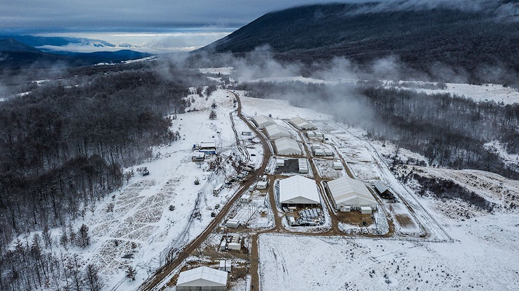

### AYS Daily Digest 11/12/2020 — Mitarakis’ Attacks on NGOs, Debunked
### Extreme weather forecast for Greece//Berlin Public Prosecutor issues injunction against AfD politician//& more

[Are You Syrious?](?source=post_page-----6276d8fbdcb0--------------------------------)

[Dec 12](ays-daily-digest-11-12-2020-mitarakis-attacks-on-ngos-debunked-6276d8fbdcb0?source=post_page-----6276d8fbdcb0--------------------------------) · 10 min read

### FEATURE
### Mitarakis’ attacks on NGOs, debunked

A few days ago, Greek Migration Minister Notis Mitarakis [published claims](ays-daily-digest-9-12-20-officials-intimidated-ngos-preventing-legal-assistance-to-people-a48739b61b31) that NGOs are helping coordinate the arrival of Somali people to Greece by colluding with Turkish authorities\. This latest attempt by the Greek government to discredit NGOs, like all the previous ones, is false\. In fact, the only corroborating “evidence” the ministry offered were video interviews with four Somali people who had recently arrived in Greece\.

Today, Disinfaux Collective published the first part in their detailed investigation into this false story in collaboration with Ef\.Syn\. Disinfaux Collective found that one of the clips was recorded in the Mytilene Port Authority, while others were recorded in an isobox\.

It is important to note that while Disinfaux Collective and Ef\.Syn blurred the images of the people interviewed in the screenshots they published, the government did not\. This raises larger, pressing questions about the ethics of the government releasing this interview on official channels\. Confidentiality is a crucial part of the asylum process in order to protect the safety of people on the move and exposing their identity through official government channels could put them seriously at risk\.

The circumstances under which the videos were recorded are unclear\. A video interview is not part of the official asylum process, especially not during an initial investigation\. There are also questions about the legality of distributing the video\. An anonymous lawyer [told Ef\.Syn](https://www.efsyn.gr/ellada/dikaiomata/272388_kai-ta-binteo-toy-ypoyrgeioy-ekthetoyn-ton-k-mitaraki) that:

> _In order to express the free and unaffected will to give consent in accordance with the provisions, the subject should not be threatened, deceived or be in an unequal position, while at the same time he should have been informed in simple and understandable language regarding the specific purpose of processing his data and not generally and vaguely\._ 

Even if the people in the video freely agreed to the interview \(which, given the Greek authorities’ history of intimidation, is under suspicion\), to what extent would they have felt comfortable refusing a request from authorities in a country they just arrived in? Were they afraid of possible retaliation if they refused or sabotage of their asylum applications? Did they know how widely the clips would be distributed? Were they even provided with proper interpreters?

Journalists from Ef\.Syn asked the Ministry of Migration and Asylum about the circumstances surrounding the production of the videos, including questions about who recorded the video, the presence of certified interpreters, and the care taken to protect the confidentiality and personal data of the people pictured\. They received no response besides a statement that the questions were already addressed at the initial press conference \(they were not\) \.

Even without the troubling video, Mitarakis’ argument falls apart on basic facts\. He claims that most people on the move are “economic migrants,” but used the example of Somali people to pursue his agenda against NGOs even though 95% of Somali people have had their asylum cases recognized in Greece\. He also claimed that they were coming from a safe third country, Turkey, even though Turkey only formally recognizes the rights of people on the move from Syria, thus it is not a safe country for Somali people \(it is also not a safe country for many Syrians, as the recognition of their rights according to the Geneva Convention is only widespread on paper, not in real life\) \.

Of course, Mitarakis responded to this report on Twitter by complaining about human rights violations by Turkish authorities and called the investigation “ [lonely commenting](https://twitter.com/disinfaux/status/1337334975545356288) \.” It is incredibly irresponsible for a government minister to concoct blatant lies targeting people on the move and NGOs, lies that will reach far more people than the detailed rebuttal\. It is also irresponsible to endanger several people on the move in the process due to the ministry’s complete disregard for their privacy\.
### AFGHANISTAN
### What happens to people deported to Afghanistan?

More and more people have been deported to Afghanistan following the country’s deal with the European Union\. However, the deportations are carried out for political reasons without taking into account human rights\. Returnees face [ever\-increasing violence](https://www.telegraph.co.uk/global-health/terror-and-security/want-safe-afghan-migrants-sent-home-conflict-zone/?fbclid=IwAR2d_j3syDBXPKsXVfyylSWDhpfrAkkLFZBiBIKzdiSaBePZo2lBaKFEEns) as well as a lack of economic prospects because many spent all their savings on the trip to Europe\. Some have never even set foot in Afghanistan because they were born in refugee camps in neighbouring countries\.
### LIBYA
### IOM Libya publishes monthly newsletter
### GREECE
### Extreme weather to hit eastern Greece, Aegean

[Meteorologists predict heavy rainfall](https://www.keeptalkinggreece.com/2020/12/11/greece-weather-extreme-phenomena-dec-2020/) and stormy winds in Eastern and Southern Greece, including the Aegean islands, from December 11th to the afternoon of Monday, December 14th\.

The flimsy tents in Moria 2\.0 offer no protection from the rain and winds\. They also do not protect people from the muddy ground\. The weather is only going to get worse as winter goes on\. How are people expected to live in this?

A disturbing incident of police brutality happened in Mytilene\. Police officers stopped two people on the move who were returning to the Kara Tepe camp from the supermarket and [began beating them](https://www.facebook.com/nobordersnetwork/posts/3583443441723522) \. The police officers outnumbered the people and [continued beating one](https://www.efsyn.gr/ellada/dikaiomata/272539_mytilini-epithesi-astynomikon-se-prosfyges-binteo) man after he fell to the ground\. This is despicable\!

A Syrian man has attempted suicide in Vial camp on Chios\. The awful living conditions and heartless bureaucracy in camps across Greece \(and Europe as a whole\) are taking a serious toll on people’s mental health\. More from Ruhi Loren [Akhtar’s Facebook page](https://www.facebook.com/ruhi.akhtar.7/posts/4119541121396098) :

> _Watching the video shook me to my core yet I knew I couldn’t turn away because this is the reality for our brothers and sisters seeking asylum, as they live in what can only be described as hell\._ 

> _These are the voices of the people in camp as the video was sent to me:_ 

> _‘You know what? I thought a lot about suicide whilst I lived in the camp\. The reality of life in Vial Camp is very difficult\. Even wild animals could not bear this life\.’_ 

> _\[…\]_ 

> _I knew I had to watch the pain he was in and share about it also\._ 

> _I am told the reasons for wanting to end his life was because the brother was upset over a lack of medical care for his chronic and complicated diseases, and also his difficulties in being recognised for asylum in Europe, while the threat of deportation hangs over him\._ 

> _How anguished must a person be to get to this stage\._ 

### BALKANS
### Commissioner for human rights publishes letter on situation in BH

In her letter, the Commissioner “ [expressed concern](https://www.coe.int/en/web/commissioner/-/bosnia-and-herzegovina-must-urgently-improve-its-migrant-reception-capacities-improve-access-to-asylum-and-protect-unaccompanied-migrant-children?fbclid=IwAR2txwAOGni5Ubzst1YULjjJgBdJsmibcVKwWCVDAuN5RcCguiKqSV0rTls) ” about the unfolding humanitarian crisis in Una\-Sana canton\. She cited the bad living conditions in Lipa camp, the hundreds of people forced to sleep rough due to the ban on new admissions to Miral, and the restriction on people’s movement as serious concerns\.
### SPAIN
### Man sentenced to three years in prison for navigating a boat to Canary Islands

A Senegalese man was [sentenced to prison](https://www.canarias7.es/canarias/gran-canaria/las-palmas-de-gran-canaria/condenado-tres-anos-20201211211315-nt.html?fbclid=IwAR1GLOcp_rjgg6iS4TFNjUxzknYqAWI90WYtH0O-loP1l8FiQX2ywv8wq7Q) yesterday for navigating a boat that arrived in Arguineguin on July 9th, along with another man\.

The Cabildo of Lanzarote [honoured resident](https://www.laprovincia.es/lanzarote/2020/12/10/reconocimiento-heroes-orzola-pusieron-vida-26146619.html?fbclid=IwAR1GLOcp_rjgg6iS4TFNjUxzknYqAWI90WYtH0O-loP1l8FiQX2ywv8wq7Q) s of the village of Orzola who helped authorities rescue people in distress at sea during a storm on November 24th\. Although eight people unfortunately died during the shipwreck, rescuers were able to save others with the help of locals\.

The Spanish government has finally restarted transfers to the mainland from Melilla, after months of outcry from people on the move and activists\. About [200 people](https://twitter.com/SolidaryW/status/1337414445165924354) have been transferred so far in three separate transfers, but the uncertainty and bad conditions for those who remain in the Bullring continue\.

This Saturday, December 12th, the group Plataforma 12D is organizing a protest in Barcelona against migration policies that violate human rights over and over again\. More details can be found [here](https://www.facebook.com/europemustact/posts/205747677704601) \.
### FRANCE
### Protests for housing in Paris

In Paris, a collective of activist groups [protested in front of the prefecture](https://www.liberation.fr/france/2020/12/11/des-sdf-et-des-mal-loges-demandent-la-requisition-d-immeubles-vides_1808460) demanding that the government requisition empty apartments to provide people with housing, especially now that there is a pandemic that requires people stay inside\. There are [170,000 empty homes in Paris alone](https://www.facebook.com/permalink.php?story_fbid=1610967632437336&id=598228360377940s%3A%2F%2Fwww.facebook.com%2Fpermalink.php) that could house the thousands of unhoused people, many of whom are people on the move such as the people [evicted from Saint\-Denis](https://www.newframe.com/photo-essay-no-place-for-refugees-in-paris/?fbclid=IwAR1-Su48G4ef2eHrdaJpqhmdUEiK0cO9fr9hRl6b4ml1N7jxWJFR19NK5j0) a few weeks ago\.

Further north in Calais, there were [four large\-scale evictions](https://twitter.com/HumanRightsObs/status/1337503505100255235) today, and witnesses testified that there were several instances of destruction of people’s tents, and arbitrary arrests\. Many of the people are already back in the area, the only difference is that they no longer have even their tents to take shelter\.
### NETHERLANDS
### Netherlands to deport singer who fled threats in Sudan

The singer Mohamed al\-Tayeb was a successful contestant on the Arabic language version of _The Voice_ in 2015, but had to flee his native Sudan after he faced threats from security officers and arbitrary arrests for refusing to sing at government events\. Now, the Dutch government [rejected his asylum](https://english.alaraby.co.uk/english/news/2020/12/11/sudanese-singer-faces-deportation-from-netherlands-despite-safety-fears?fbclid=IwAR1_6xQ1-hozpBPoo82msS-VaN3eCcdj0hUqPNDG-CIuqAchQQXt-xtJWpU) application as part of a larger plan to “reevaluate” the status of people from certain regions in Sudan — regions that al\-Tayeb is not even from\.

Unfortunately, this is not the first time that European governments have made asylum decisions based on political calculations instead of human rights concerns\. Earlier this year, news broke of [Belgium’s collaboration](https://euobserver.com/foreign/149899) with the Sudanese secret service, which is still a force of repression despite the ousting of dictator Omar al\-Bashir\.
### GERMANY
### Berlin public prosecutor issues injunction against AfD politician

Berlin’s public prosecutor has [issued an injunction](https://sea-eye.org/landgericht-berlin-verbietet-georg-pazderskis-hetze-gegen-sea-eye/?fbclid=IwAR2txwAOGni5Ubzst1YULjjJgBdJsmibcVKwWCVDAuN5RcCguiKqSV0rTls) against AfD politician Georg Pazderski which bans him from continuing to spread lies about Sea\-Eye\. Following the terrorist attack in Nice in late October, Pazderski shared a Facebook post claiming that the alleged attacker came to Europe on a Sea\-Eye rescue mission, something that was already debunked by the Italian interior minister himself\. If Pazderski repeats his false accusation, he will face a fine of 250,000 euros or jail\.

Now’s a great time to donate to SOS Mediterranee\! The city council of Munich decided to match all donations to the rescue organization received by January 31st\. More details, including how to donate, [here](https://www.facebook.com/SOSMEDITERRANEE/photos/a.806663182774325/3558272174280065/) \.
### NORWAY
### Norwegian government to take in…thirty people from Moria

Half a year after the government promised to take in a grand total of fifty people from Moria, the Norwegian government [announced that thirty people](https://www.vg.no/nyheter/utenriks/i/lEMbj3/skal-sendes-til-norge-moria-flyktninger-plukket-ut?fbclid=IwAR1pjDQ1H88_qMTH_Ld4xE2QDpLvnoEmFxEbP63rH2GBwp7sP2n7Wpeux_M) will arrive in the country \(one of the ten richest countries in the world\) sometime in January\. The government blamed the Greek government for the delay because it took them a long time to come up with a list of acceptable names — the Norwegian government will only accept Syrian families with children\.

The activist Frøydis Skaug\-Andersen criticizes the government’s framing of the agreement\. She said that Norway has a much greater capacity to provide people with good homes according to official reports by municipalities\. Additionally, it was the Norwegian government that caused the delays due to their stringent requirements about the identities of the people they will accept, which caused an additional burden on the already overworked Greek system — requirements that no other European country has demanded\.
### UK
### Inhumane rush to conduct deportations caused COVID outbreak

There are [at least seventeen cases](https://www.facebook.com/care4calais/posts/3896233783742883) of coronavirus in the packed Brook House detention centre near Gatwick airport\. In an effort to ramp up deportations before December 31st and the enactment of Brexit, the UK government filled Brook House and Colnbrook removal centers even though that goes against all COVID\-19 precautions\.

Right now, three wings of Brook House are in lockdown and the people are confined to their rooms\. Their situation is full of uncertainty and they are worried about catching the virus\. However, the private contractor that runs the detention center, Serco, said that even more people [will still be transferred to the cent](https://morningstaronline.co.uk/article/brook-house-covid-outbreak-down-governments-rush-deport-people?fbclid=IwAR0-0a4Q8zXFv8UN4BufszR-TeqcBiCtD_7iO9FEweDvqSbKgh_ZvvyX178) re, they will just be kept in two wings that are allegedly COVID\-free\.

The government had to [cancel a different deportation flight on Wednesday](https://www.theguardian.com/uk-news/2020/dec/10/covid-outbreak-hits-gatwick-immigration-detention-centre) after people made human rights and modern slavery claims for asylum\. This shows how the hastiness of the Home Office has disregarded people’s legal rights and basic health precautions\.

The deportations have been paused, but it should not have taken over a dozen people catching a potentially deadly illness to stop this inhumane action\.

In contrast to the national government’s callousness are several stories of local action\. In Portsmouth, [local newspaper _The News_](https://www.portsmouth.co.uk/news/people/comfort-and-joy-small-gesture-ps5-voucher-will-mean-more-you-can-imagine-city-asylum-seekers-christmas-3064717?fbclid=IwAR1-Su48G4ef2eHrdaJpqhmdUEiK0cO9fr9hRl6b4ml1N7jxWJFR19NK5j0) is partnering with Friends Without Borders to allow people to give five pound vouchers to people on the move in the city\. [In Blackburn](https://www.thisislancashire.co.uk/news/18936681.blackburn-nursery-children-go-extra-mile-refugees-christmas/?fbclid=IwAR10RBZnbIdWYmabYItlh7Nqkfc5GBUq-Pn_nXxqoCWg4LqHaLEqYKnm7KU) , nursery children made care packages and delivered them to vulnerable people in the city, including people on the move\.
### GENERAL
### Voices of Volunteers

We wanted to share this powerful statement from Madi Williamson:

> _I am tired\._ 

> _None of this is working\._ 

> _My friends are losing their homes\._ 

> _My friends don’t have food\._ 

> _My friends are sick\._ 

> _My friends are being beaten by FRONTEX\._ 

> _My friends are being exploited for labor\._ 

> _My friends are in detention\._ 

> _My friends are disappearing\._ 

> _I am scared for their lives every single day\._ 

> _This is beyond a cry for help… I don’t even know what to ask for anymore\._ 

> _Don’t worry about me\._ 

> _Every night I go to sleep in a warm and beautiful home\. Every month I call my therapist\. When this all becomes too much I have safe spaces where I can retreat and I can fall apart\. I can always crawl back to my bank account and my employable technical degree and shape my witnessing of this entire catastrophe into a reason to hire me\. My passport, the color of my skin, and my education mean I always have the privilege of a plan B\._ 

> _Don’t worry about me\._ 

> _Worry about the kids in detention\._ 

> _The brothers in the streets\._ 

> _Worry about every person whose food card I just had to reduce because I no longer can use Facebook fundraising on my posts and I don’t want to keep giving them something we can’t sustain\._ 

Read the rest of her statement [here](https://www.facebook.com/madi.williamson.7/posts/10220898024452915) , and donate to The Brother’s Campaign [here](https://charity.gofundme.com/o/en/campaign/the-brothers-campaign?fbclid=IwAR3yVGRORqbJU_gG9KtURVbJ5DooPrp8vn9xgfUsCoCkCxcjsz3ewDZSBRI) \.
### WORTH READING

ELENA published their [weekly legal update](https://mailchi.mp/ecre/elena-weekly-legal-update-11-december-2020?e=989a4aebdd&fbclid=IwAR17R_gbdZFLGV8q2Ck11cA2YU-Yg1ZM8EdOIVHo6H-2G-67lB9DiehGZLA) , including stories on the communicated case against Greece in the European Court of Human Rights\.

ECRE also published [their weekly bulletin](https://mailchi.mp/ecre/ecre-weekly-bulletin-11122020?fbclid=IwAR1TR-_FwSj1AOM-7Aqso0P77g7FeBSJNuH15AJ-alVrf7q4hnFAYdHrKgU) tracking important developments across Europe\.

**Find daily updates and special reports on our [Medium page](https://medium.com/are-you-syrious) \.**

**If you wish to contribute, either by writing a report or a story, or by joining the info gathering team, please let us know\.**

**We strive to echo correct news from the ground through collaboration and fairness\. Every effort has been made to credit organisations and individuals with regard to the supply of information, video, and photo material \(in cases where the source wanted to be accredited\) \. Please notify us regarding corrections\.**

**If there’s anything you want to share or comment, contact us through Facebook, Twitter or write to: areyousyrious@gmail\.com**

_Converted [Medium Post](https://medium.com/are-you-syrious/ays-daily-digest-11-12-2020-mitarakis-attacks-on-ngos-debunked-e9afeddc8bc9) by [ZMediumToMarkdown](https://github.com/ZhgChgLi/ZMediumToMarkdown)._
