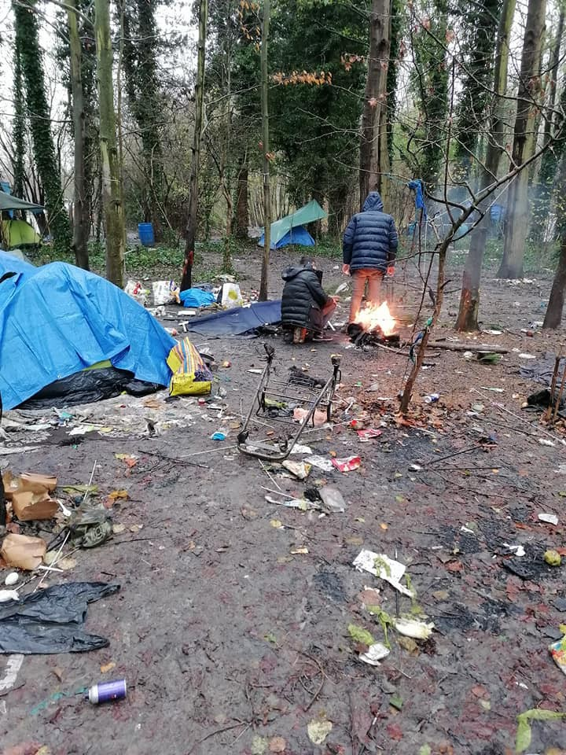

### AYS Weekend Digest 12–13/12/2020 Moria 2\.0: “a clean structure, with order and security”

Photo feature from Lesvos, Velika Kladusa and Dunkirk // Distress call from the Evros border // Updates from Libyan detention centres // Pushback from Albania to Greece\.

Moria 2\.0, Kara Tepe, Lesvos \(Photo via Aegean Boat Report\)
#### Featured story

> Kara Tepe \[Moria 2\.0\] is “a clean structure … with order and security”

As we recently [reported](https://www.pagenews.gr/2020/11/29/politiki/notis-mitarakis-i-prosorini-domi-sto-maurobouni-den-thymizei-se-tipote-to-xaos-tis-morias/) , these were the words of Notis Mitarakis, Greek Minister for migration and asylum, after a visit to the camp on the 28th of November 2020\.

Even then, we pointed out the vast difference between this statement and the everyday reality for people living inside the camp, which has come to be known as Moria 2\.0, but — as Parwana Amiri points out below — could better be described as Moria 0\.2…

It is extremely important to keep challenging the official narrative of the Greek authorities, at a time when they are implementing increasing measures to prevent any external reporting\. On Friday we described and debunked their latest attempt to criminalise NGOs, with Mitarakis releasing a video supposedly implicating Aegean Boat Report in the aiding of irregular migration\.

In the last few days, there were heavy rains in Greece\. More rain is forecasted for the coming days\. This, _per se_ , should not be news, but we live in unusual times\.

**_— Most of the following photos are taken by residents of Moria 2\.0 camp —_**

■■■■■■■■■■■■■■ 
> **[Parwana Amiri پروانه اميري](https://twitter.com/parwana_amiri) @ Twitter Says:** 

> > In the summer, it is like hell 
In the winter, we live on mud
We are exposed to cold, to wind 
Without even warm clothes 

Our children, while playing 
Their shoes sink into 
Mud and sewage water 
This condition is suffocating 
“Moria0.2”
#changesystem https://t.co/Ekmq0ldBPT 

> **Tweeted at [2020-12-12 09:28:12](https://twitter.com/parwana_amiri/status/1337690709256704001).** 

■■■■■■■■■■■■■■ 

](assets/6ea7047262b8/1*G4W6ClA4mAPwmUApqz07Hw.jpeg)

Photo via [ABR](https://www.facebook.com/AegeanBoatReport/posts/989756328214138)

 and [ABR](https://www.facebook.com/AegeanBoatReport/posts/989756328214138)](assets/6ea7047262b8/1*6wxpfuD2_4PktaUHKuH1Dg.jpeg)

Photos via [Parwana Amiri](https://twitter.com/parwana_amiri/status/1337117290882625541) and [ABR](https://www.facebook.com/AegeanBoatReport/posts/989756328214138)

](assets/6ea7047262b8/1*exiHxNKKRL5drL8qIMEKtQ.jpeg)

Photos via [NoBorders](https://twitter.com/Refugees_Gr/status/1337807118179717120)

](assets/6ea7047262b8/1*pNTho5EzVAUKdb99FJs8Kg.jpeg)

Photo via [ABR](https://www.facebook.com/AegeanBoatReport/photos/pcb.989756328214138/989756268214144)

Rain does not stop life inside the camp\. Residents keep having to queue for food and carry on their solidarity initiatives\.

](assets/6ea7047262b8/1*YQApUeR1-S4D-VusBFUc5Q.jpeg)

Photo via [Daphne Tolis](https://twitter.com/daphnetoli/status/1338122818660208641/photo/1)

■■■■■■■■■■■■■■ 
> **[Moria](https://twitter.com/refugeemoria2) @ Twitter Says:** 

> > #Moria You have to pass here for breakfast and food. 👀

#Moria2 #KaraTepe #LeaveNoOneBehind #RefugeesGr #Refugees https://t.co/lvZKY5dT7r 

> **Tweeted at [2020-12-12 09:36:55](https://twitter.com/refugeemoria2/status/1337692900008873985).** 

■■■■■■■■■■■■■■ 

On Sunday, [Moria White Helmets](https://www.facebook.com/MoriaWhiteHelmets/) released a statement, stressing that what people living in Moria need most is change\.

> We are asked by friends what people need now in this rain and flooding\. This is nice to ask\. But we don’t need more clothes and blankets when tents are wet and we have no heating and no warm place at all\. 

> They need boots, tarps, winter tents and dry roofed places\. 

> What is needed is to move them from here, especially from Blue Zone which is in fact under water\. 

> People are very angry and very frustrated\. Again they are in such situation? After Moria, lockdown, Corona\. And the promise of a new camp? With no showers and no electricity and no kindergarten and no schools? 

> And then many organisations here and what they do? Give shovels? Who is helping us? How long now everyone talks about drainage and showers? Talking while we sit in wet tents not in Hotels and nice houses\. 

> How long will this situation go astray \. \. People are very angry at all of that \. \. We get calls: Do you help? How should we help alone with nothing? Where are you the human rights organisations??… Where are you who call on humanity ??\. \. We are very tired … and we suffer every day … and we hear just talking\. 

> Please we want people to stop talking and start changing\. We tried what we can, but who are we? Just some refugees trying to help ourselves\. Where is UN, where are all the big organisations? 

Dunya Collective have reported on a new unexploded ordnance found in the soil of the camp, “washed free by heavy rain”\.

 “An old mortar shell found in [\#Moria2](https://twitter.com/hashtag/Moria2?src=hashtag_click) by a refugee in the green zone\. Washed free by heavy rain\. This is why the government doesn’t want pictures from inside the camp\. This place is neither humane nor safe\. The police have been informed\.†— [\(2\)](https://twitter.com/DunyaCollective/status/1337781384929271808) “Update: This is the green zone of [\#Moria2](https://twitter.com/hashtag/Moria2?src=hashtag_click) where the mortar shell was found\. We do not know if the mortar shell has been removed\. Camp residents have only told us that the police have been informed in the morning\.†\( [Dunya Collective](https://twitter.com/DunyaCollective) \)](assets/6ea7047262b8/1*WKk6uavLKA8-HzZ9SfCzXQ.jpeg)

[\(1\)](https://twitter.com/DunyaCollective/status/1337714295304544256) “An old mortar shell found in [\#Moria2](https://twitter.com/hashtag/Moria2?src=hashtag_click) by a refugee in the green zone\. Washed free by heavy rain\. This is why the government doesn’t want pictures from inside the camp\. This place is neither humane nor safe\. The police have been informed\.” — [\(2\)](https://twitter.com/DunyaCollective/status/1337781384929271808) “Update: This is the green zone of [\#Moria2](https://twitter.com/hashtag/Moria2?src=hashtag_click) where the mortar shell was found\. We do not know if the mortar shell has been removed\. Camp residents have only told us that the police have been informed in the morning\.” \( [Dunya Collective](https://twitter.com/DunyaCollective) \)

The deprivation of basic rights for people on the move is far from being only a Greek problem, but it appears to be engraved in European migration policies, in their attempt to convince people to “voluntarily” return to their home countries\. At another EU border, in Velika Kladusa, Bosnia and Herzegovina, the [situation](https://www.facebook.com/groups/2379336965459224/permalink/3679113638814877/) is not better:

](assets/6ea7047262b8/1*w_GhW-0-92gtG6528NmO-w.jpeg)

[Photo by Srdjan Govedarica](https://www.facebook.com/groups/2379336965459224/permalink/3679113638814877/)

> … about 40 men from Bangladesh live in a forest on the outskirts of the town under pathetic conditions\. Ten days ago there were up to 400 people here\. But many have already left the area, they have either made their way to Croatia or went to Sarajevo or also to Serbia to hibernate there … Those who can’t go anywhere … sleep in the woods or in dilapidated and abandoned buildings\. 

Volunteers from [SOS Balkanroute](https://www.facebook.com/SOSBalkanroute) distribute food, clothes and shoes to the people, but they have to do it in secret for fear of attacks by local authorities and local xenophobic groups\.

](assets/6ea7047262b8/1*n02eSKHJbejc4beLdb1B9w.jpeg)

[Photo by Srdjan Govedarica](https://www.facebook.com/groups/2379336965459224/permalink/3679113638814877/)

Spanish media have [reported](https://elpais.com/espana/2020-12-13/la-cruz-roja-resguarda-a-6000-inmigrantes-alojados-en-hoteles-ante-el-acoso-xenofobo-en-gran-canaria.html?fbclid=IwAR0FGw7mz6uziTjf8LRBMBWKj_NhtYOWyo7ruK8MqPC9QHq0Bta9eQffIx8) similar attacks in the Canary Islands as well, where hotels housing people on the move were the object of protests and attacks\.

> The Spanish Red Cross, which manages the reception of new arrivals, has been forced to recommend to the nearly 6,000 immigrants who are staying in 12 hotels in Gran Canaria not to go out on the streets at least this weekend\. The Government of the Canary Islands, responsible for the protection of minors, took the same measure\. 

In northern France makeshift camps are constantly evicted by the police, forcing people to hide in the forests, far from towns and access to any services\.

 via [Utopia 56](https://www.facebook.com/groups/172900819749383/permalink/1277766752596112/) \)](assets/6ea7047262b8/1*Pv5kOv8ZJZakDAUy5SI6Yw.jpeg)

A photo story from the Dunkirk ‘jungle’ \(Photo Credit: [Lagkadikia Camqu Hama](https://www.facebook.com/groups/172900819749383/user/100036102046655/?__cft__[0]=AZXLDxsyUIBFhhcwBU-7-WgUCWP076zZlX14GDZvxzC-Oyhukm3xYMFJgc48m2mGLU6OpBqHJ-EVW-vT9HyjwG5zJvS0G1kZXBTdSL7zSh10TZtX2o4KAJ0I2T4yis_nwrILTjc127dTkeTz7se2xlqzOr9FmU0g9fXQeXzycfRd_w&__tn__=-]C%2CP-R) via [Utopia 56](https://www.facebook.com/groups/172900819749383/permalink/1277766752596112/) \)

[L’Auberge des Migrants](https://www.facebook.com/AubergeMigrants/?__cft__[0]=AZUFV8oVBdh4zhgnCd36hMBuTngCCke3DtY-FHB09KoH3z7I6VMlFVGnUPuQjM1t4CHTNlsXNhZS62sX1_eEP5RMLfIa0lObt2HfTsa7_1cTFyN5W7cLuPtkntFnyt_fit7b-w7QSrgnmBdwoFBDqFNh&__tn__=-UC%2CP-R) reported on further evictions on Friday\. 8 ‘riot police’ \(CRS\) vans, vehicles and officers from the national police, border police \(PAF\), civil protection and buses evicted many people from different locations, and destroyed and confiscated tents, sleeping bags and personal belongings\.

 \)](assets/6ea7047262b8/1*5xnLO-mBGU6AmmA2O0R2uw.jpeg)

\(Photo Credit: [L’Auberge des Migrants](https://www.facebook.com/AubergeMigrants/?__cft__[0]=AZUFV8oVBdh4zhgnCd36hMBuTngCCke3DtY-FHB09KoH3z7I6VMlFVGnUPuQjM1t4CHTNlsXNhZS62sX1_eEP5RMLfIa0lObt2HfTsa7_1cTFyN5W7cLuPtkntFnyt_fit7b-w7QSrgnmBdwoFBDqFNh&__tn__=-UC%2CP-R) \)

Under PASS \(Permanent Access to Care\) regulations, 14 or 15 people were taken on buses along with two families\.

> Police officers took: 28 tents, 48 sleeping bags, 14 tarps, 10 bags, clothes and shoes\. 

> Near the hospital: 4 people taken by PAF, 5 on buses, 9 men escorted by 4 officers\. Many tents picked up and other stuff\. 

> Next to the Piscine Calypso: a man escorted by 5 officers then 6 \[others\] by twenty officers\. 4 men arrested by the National Police\. 3 tents and two mattresses taken away\. 

> Fort Nieulay: lots of possessions taken away\. No buses reported\. 

LIBYA
#### Updates from Abu Issa, Zintan and Tariq Al Sikka detention centres

Human rights lawyer Giulia Tranchina [published](https://www.facebook.com/rastajuly/posts/10158235881343621) an update on the situation in three Libyan detention centres\.

> A group of refugees including women and 2 children are being tortured, raped and starved to death in **Abu Issa** , an official prison\. 

We often reporte about the **Zintan** detention centre, which was supposedly being closed over a month ago\. On November 10th, it was reported that guards had ordered detainees to start dismantling the shelters themselves\. Tranchina reported on Sunday that over 300 are still detained there, “despite being the first ones registered with UNHCR Libya since 2017–2018 and after 25 of them died of TB and starvation\.”

> Another group of over 70 refugees including 5 women and 1 child caught at sea in October 2020 are detained in **Tariq Al Sikka** since then\. Many of them were registered with UNHCR and have been in Libya for years\. Detained again without any phones, in terrible conditions, insufficient food, no blankets, in the headquarters of the DCIM _\[Department to Combat Illegal Migration\]_ used also to store weapons\. 

GREECE
#### Distress call from the Evros border

■■■■■■■■■■■■■■ 
> **[Alarm Phone](https://twitter.com/alarm_phone) @ Twitter Says:** 

> > +Distress call near Feres+
This morning at 2am we were alerted by 8 #refugeesGr who are stuck at the landborder on Greek territory. They are in need of international protection. We have informed Greek authorities & call on them to respect the refugees' rights to apply for asylum! 

> **Tweeted at [2020-12-13 09:55:10](https://twitter.com/alarm_phone/status/1338059881178390528).** 

■■■■■■■■■■■■■■ 

#### Updates from Lesvos

On Friday, we [reported](ays-daily-digest-11-12-2020-mitarakis-attacks-on-ngos-debunked-6276d8fbdcb0) about two young men being beaten up by police in Mytilene\. Three border guards and a police officer are now under investigation by an Internal Affairs body\. In more disturbing news, media [report](https://www.stonisi.gr/post/13583/prwta-toys-vazeis-xeiropedes-kai-meta-toys-derneis) that the president of the Panhellenic Federation of Border Guards, Panagiotis Harelas, released a statement justifying the brutality of the officers\. In it he describes the officers as sacrificed on the “altar of cannibalism … of people in uniform”, and attempts to frame the beating of “drunk immigrants” as a proportionate action\. In his statement, he forgot to mention that the two men were first handcuffed and then beaten up, and that they have since been released because no charges have been brought against them\.
#### Skype Asylum Office appointments issues\. What to do?

Refugee\.Info published a short [update](https://www.facebook.com/refugee.info/posts/3610500139010107) in response to the many issues of the Skype Asylum Office lines\.

> Indeed, we receive many complaints for this\. It seems to be very challenging and sometimes it takes months until you manage to speak\. But this is the experience of the majority of asylum seekers to apply for asylum\. 

> **We suggest to take notes of the Skype calls you do and use them in case you have issues with the police because you don’t have legal documents\. This way, you can claim that you are trying to apply for asylum and it is not your fault\.** 

ITALY
#### Turin: Hospital director calls for illegal identification of undocumented patients

Rainbow4Africa [report](https://twitter.com/Rainbow4Africa/status/1338051876990971904) of an internal communication in one of the main healthcare structures \(Ospedale Maria Vittorio and Ospedale Amedeo di Savoia\) in Turin, in which the structure director calls all doctors and nurses to identify all undocumented patients who come to the hospitals\.

Rainbow4Africa stress that such identification is illegal under Italian law, which safeguards the right to healthcare “without the risk of being identified or denounced” to the authorities\. Such an illegal procedure would push undocumented people away from hospitals, endangering their lives\.

ALBANIA
#### Pushbacks at Greek Border

There are [reports](https://www.facebook.com/Ishtarforimmigrationandasylum/posts/3450010665106188) of continued but non violent pushbacks from Albania to Greece and the use of thermal imaging cameras by Frontex at the border\.

 \)](assets/6ea7047262b8/1*lro84fbfZSo8WqFzKTDHYQ.jpeg)

\(Photo Credit: [عشتار للهجرة واللجوء](https://www.facebook.com/Ishtarforimmigrationandasylum/?__cft__[0]=AZWh03WtsK6wVPumRPQ6NoBpw3UEAloJh4BRMd6oyyB3eVqghG9gtl41eRBcZjcSn3esIllG47oIKJVxuJYuKCZKFTs02H6JIvlhfS0vhwBNDJ7SuLdbsMllQm3Sg48KJhO3RxX4PkzbeZpry83t_sF1&__tn__=-UC%2CP-R) \)

SERBIA

**Continued police hostility towards solidarity volunteers**

 , photo of a police control incident from earlier in the week\)](assets/6ea7047262b8/1*uY_3OnpJ42b5btdrZjUabw.jpeg)

\(Photo Credit: [NNK](https://www.facebook.com/NoNameKitchenBelgrade/posts/1142714632793486) , photo of a police control incident from earlier in the week\)

[No Name Kitchen report](https://www.facebook.com/NoNameKitchenBelgrade/posts/1142714632793486) that three of their volunteers were prevented from their distribution efforts on Saturday by police who confiscated their phones and documents, searched their van without a warrant, hit one of them, verbally abused a female volunteer and threatened them with arrest\. This has become common practice in Serbia as we [reported on Wednesday](https://medium.com/are-you-syrious/ays-daily-digest-9-12-20-officials-intimidated-ngos-preventing-legal-assistance-to-people-340311f58b8) with the case of harassment endured by volunteers from [Klikaktiv — Centar za razvoj socijalnih politika](https://www.facebook.com/klikaktiv/?__cft__[0]=AZVqx_Q4gXSMUJm_7Ao7gze5zhUoug9evh--yZ1ztO8-Avc2uSHPrORlNGheHvHNZ4BELjVbQ2N7jP4emeQnYDqs_1JOtjz999fC9A0FGaJK5GPp9nmhfDZpfib3_e9SeJ-D0nhBeGWfAdNQNBeZH110XRBa46TKXQb4skIbPVwvGHAYC4P2j8D4sQz66cuFNJBKX-RajurKNHojwVPmDlrf&__tn__=-UC%2CP-y-R) \.

UK
#### Two families in France informed that family reunification to UK not possible

According to [the Observer](https://www.theguardian.com/uk-news/2020/dec/13/uk-reneges-on-vow-to-reunite-child-refugees-with-families?fbclid=IwAR0pquGjOtUv1IepFcNgeZiHGQMUPI01vV_7B_Ke639_IAhqMQ7Sh_LzuSs) newspaper there are a further 20 unaccompanied children and five families who have already been identified as eligible for family reunification in the UK, but will not be able to proceed unless new processes are put in place\.

[Safe Passage International](https://www.safepassage.org.uk/) have a [current petition](https://www.change.org/p/urgent-keep-reuniting-child-refugees-with-their-families-after-brexit) to make sure family reunification remains possible after Brexit\.

> The Government said they would replace the scheme to reunite refugee children with their families post\-Brexit\. This petition is now calling to make sure the government stick to their commitment, that reunification is a mandatory obligation, and that they protect the right to appeal 

Further updates on the changes to UK immigration law, which we [reported on the Thursday 10th of December](ays-digest-10-12-2020-on-human-rights-day-the-number-of-forcibly-displaced-people-keeps-f0f70d3bfa79) , can be found [HERE](https://www.freemovement.org.uk/new-statement-of-changes-to-the-immigration-rules-hc-1043/?fbclid=IwAR0lbIZ1XXVMmicnq6CS2XzNs66jAWBbPv_VnCWMcEJ5EG-BwAxrI2Afp9E) \.

**Find daily updates and special reports on our [Medium page](https://medium.com/are-you-syrious) \.**

**If you wish to contribute, either by writing a report or a story, or by joining the info gathering team, please let us know\.**

**We strive to echo correct news from the ground through collaboration and fairness\. Every effort has been made to credit organisations and individuals with regard to the supply of information, video, and photo material \(in cases where the source wanted to be accredited\) \. Please notify us regarding corrections\.**

**If there’s anything you want to share or comment, contact us through Facebook, Twitter or write to: areyousyrious@gmail\.com**

_Converted [Medium Post](https://medium.com/are-you-syrious/ays-weekend-digest-12-13-12-2020-moria-2-0-a-clean-structure-with-order-and-security-6ea7047262b8) by [ZMediumToMarkdown](https://github.com/ZhgChgLi/ZMediumToMarkdown)._
