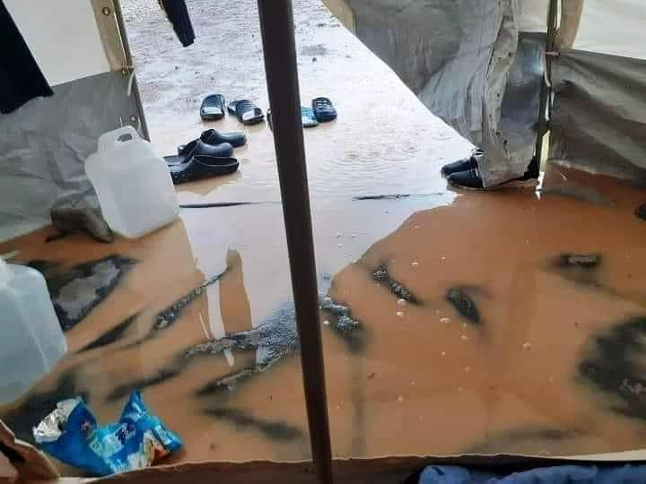

### AYS Daily Digest 15/12/20 ‘Winter is coming’ the re\-run no one wants

_181 people rescued // sexual assault of minor in Moria // Italy accused of helping pushbacks in Balkans // plans for new Moria camp by next summer // and more…_

](assets/9e742108c92b/1*hizSevRghcBQv8ans2CRrg.jpeg)

Winter has officially arrived in Velika Kladusa, Bosnia and Herzegovina\. Photo by [Alba Duez](https://www.facebook.com/NoNameKitchenBelgrade/posts/1144038492661100)
### FEATURE: Winter has officially arrived in Velika Kladusa

Today we bring you an update posted by No Name Kitchen, written by [Alba Duez](https://www.facebook.com/NoNameKitchenBelgrade/posts/1144038492661100) on the current conditions in Velika Kladusa\. As 2020 ends and 2021 begins, and with freezing temperatures for people on the move across Europe, the continuation of COVID\-19 will bring even harder conditions for refugees this winter\. Duez provides insight and important reminders for the season:

> “ →Winter has officially arrived in Velika Kladusa with the first snowfall this past week, making the situation even more difficult for people on the move\. 
 

>  →Many boys are trying to do the ‘game’, crossing the border from Bosnia to Croatia through the forest, for the last time\. The temperatures are too low and the rain and snow will make it impossible for them to continue their journey to the European Union until winter is over\. Because of this, most of the migrants who were in Velika Kladuša are now moving to Sarajevo or Serbia, in search of a place inside the refugee camps\. 
 

>  →We must remember that the refugee camps for single men in the northern region of Bosnia and Herzegovina, paid for with European Union funds, are below capacity but do not allow access to more people for political reasons\. However, other people have decided to stay in Velika Kladuša, living in what they call ‘the jungle’ here, cold forests where they take refuge under plastic or in tents, which will be their home for the next three or four months\. 
 

>  →Some days ago the families living in Bojna, a small village near Velika Kladusa, about 300 meters from the border with Croatia, were once again deprived of the choice of deciding how they continued their journey\. About 250 people, comprising more than 50 families, were forcibly transferred to the refugee camps for families in the Una\-Sana Canton\. The vast majority are now in the camp called ‘Hotel Sedra’\. Some people have written to us telling us that the camp lacks hot water and that they have to share a room with twelve other people\. 
 

>  →Despite the harshness of the winter, many of these people who were living in abandoned houses in Bojna wanted to stay there, since they still had not lost hope of reaching the European Union this winter\. The proximity to the Croatian border makes the town of Bojna a good place to try the ‘game’\. Some of these families have tried to cross the border without success more than a dozen times, even trying once or twice a week in just the two months they lived there\. When in Croatia they asked asylum but were illegally returned to Bosnia and Herzegovina by police authorities\. His hopes and encouragement are now devastated, as are his future plans\. 

Duez adds that a 16 year old sent this text to No Name Kitchen:

> “Now we meet on the field\.
 

> The police forced us here\. This way it’s very difficult for us to move forward\.
 

> Now I have to stay here all winter\.
 

> My brothers won’t be able to go to school another year I’m so sad\.
 

> We had a chance to cross the border at Christmas\.
 

> But nothing happens
 

> We never give up\.” 

#### LIBYA
### Look into modern slavery in Libya, financed by Italy

Il Manifesto just published an investigation into “Slave migrants of the Libyan bourgeoisie\.” They found that:

> “In Libya Lagers financed by Italian government projects, the sale and submission of refugees to forced labor is on the agenda\. The testimonies are hundreds\. Men are sold as soldier slaves or forced construction workers\. It happened in Tarek al Mattar until 2018 \(the year of its closure\), in Tajoura until 2019 \(the year of the bombing of the camp\), it still happens in Triq al Sikka today\. 

> Women are sold as prostitutes to the numerous connection houses in Tripoli and, increasingly, as servants / prostitutes to private Libyan citizens, because they pay more and because nothing is wasted in the Libyan system: a sex slave between one violence and another she is made to work as a cleaning lady\. There are many houses in Tripoli where the maid is a prisoner, simply bought, like an appliance\.” 

The current system of only providing repatriation to their countries of origin is ultimately not helping to lift people out of modern day slavery, because they become further at risk for retrafficking\. Learn more [here](https://ilmanifesto.it/migranti-schiave-della-borghesia-libica/?fbclid=IwAR3y5xqSqlFOlznL1Ljp2quTly7uFxd6ncyg7qvIrDUmYPWz3jhqzhL6RaA) \.
#### SEA
### 181 people rescued on Tuesday

Spanish media is reporting that Maritime Rescue rescued 181 people “ _including a baby, eleven other possible minors and 14 women, who were sailing in six boats that were sighted\. This Monday, 148 kilometers south of Gran Canaria, they detailed 112 to Efe\. A group of 48 sub\-Saharan Africans, 37 adult males and eleven possible minors, was on board a dinghy that has been taken to the port of Los Cristianos, in the south of Tenerife, where its occupants arrived at around 00\.00 hours and one of them was evacuated to a health center for suffering minor pathologies\. The other 133 people, all of Maghreb origin, sailed in another five boats and all of them were disembarked this morning at the Arguineguín dock, southwest of Gran Canaria\._ ” Learn more [here](https://www.lavanguardia.com/vida/20201215/6121884/salvamento-rescata-181-inmigrantes-bebe-otros-11-menores.html?fbclid=IwAR1e_dw_tZ42i1csf9zMFvL9yDBsLQcf2V_YMvV8SDxDNP1wifClt-FG3W4) \.
#### GREECE
### Trigger Warning: Sexual Assault of 3 y/o in Moria

According to [Greek media](https://www.stonisi.gr/post/13639/sth-zoygkla-toy-kara-tepe-realtime?fbclid=IwAR3XdzRoLTD92WEa0Um3yIjWkqeKY92iGSYLHJ28N-6KtCCXk_8f_xreoF4#.X9fQ5c3oPxI.facebook) “A three\-year\-old girl, a child of a family of asylum seekers from Afghanistan, was found unconscious in the mud of the new camp in Kara Tepe on Monday night\. The child was bleeding and according to the first diagnosis of doctors who were in the camp and examined her, she had been raped\. The child regained consciousness in the camp doctor’s office and was transported to Mytilene Hospital for further examinations and treatment\. Police are investigating the case\.” AYS will continue to bring you updates on this tragedy\.

](assets/9e742108c92b/1*2hBpaycN4H5n8hwFRx1E7Q.jpeg)

From Sunday, flooding in Moria 2\.0\. Photos by [Aegean Boat Report](https://twitter.com/ABoatReport/status/1338232717830467584?ref_src=twsrc%5Etfw%7Ctwcamp%5Etweetembed%7Ctwterm%5E1338232717830467584%7Ctwgr%5E%7Ctwcon%5Es1_&ref_url=https%3A%2F%2Fwww.infomigrants.net%2Fen%2Fpost%2F29102%2Fgreece-government-criticized-as-moria-2-0-flooded-again)
### Der Spiegel’s article “It’s not ideal, but significantly better than initially thought”

Journalist Giorgos Christides breaks down the key take aways from this new report, interviewing the “head of the task force helping Greece replace current substandard refugee facilities:”

> “The camp will be open, but fenced, with controlled entry/exit and will meet all EU\-standards\. Despite initial reservations, due to its proximity to a landfill, EU has accepted the site preferred by Greek authorities\. 

> On why it has taken so many years for the EU to get actively involved and ensure Greece has humane reception facilities for asylum seekers, she responded that unlike the government under the Prime Minister, the previous one never extended such an invitation\. 

> On the conditions in the temporary Moria 2\.0 camp on Lesvos, which was turned into a swamp by heavy rainfall over the previous days, Gminder says it will remain a tent camp over the winter… but Greek authorities have promised connection to the electricity grid before Xmas\. When this happens refugees will install small heaters in each tent\.” 

Read the article in full [here](https://www.spiegel.de/politik/ausland/fluechtlingscamp-auf-lesbos-warum-es-neben-einer-muellhalde-gebaut-werden-koennte-a-e717c77b-d772-47f5-a9fd-5490a32c80c3?fbclid=IwAR26_rZboPZln3xg_YmrG2-hTpceW3ybJvafcHfzdBFOQxU3dfl1UkgpEgI) \.

Taz just published an article concerning where all the donations have gone since the catastrophic Moria fire in September\. Including interviews with volunteers from the Moria Corona Awareness Team, it would seem that to answer such a question, you must take into account many different players\. Some NGOs responded to their request and laid out how they have spent their donations \(hiring more social workers, providing direct aid like tents and water, etc\. \) \. Other NGOs did not respond for comment and the government certainly did not either\. At the end of the day, the government does not want to create “attractive” reception conditions\. See more about the breakdown from some NGOs [here](https://taz.de/Fluechtlingslager-Moria-in-Griechenland/!5733705/) \.

**New Data available** : “In addition to the overcrowded Reception and Identification Centres \(RIC\) in the five Aegean islands, there are currently 27 more hosting structures for asylum seekers in the mainland of Greece\. Based on the reports of the Ministry of National Defence and the General Secretariat for Information and Communication, this page presents the data regarding the capacity and the actual number of residents in the thirty\-two structures across the country\.” Find the maps [here](https://wearesolomon.com/mag/the-visuals/refugee-camps-in-greece/?fbclid=IwAR3ZU9O79nYROwVGitfeMrIY2yurEtPeZXIu-F5zoGyqsmsfWHSQWds80b0) \.
#### ITALY
### Italy accused of “indirectly” supporting pushbacks in Balkans

InfoMigrants has reported that Italy is pushing people back to Slovenia, who then pushes them to Croatia, who then pushes them to Bosnia and Herzegovina\. Italy does not believe it is breaking international law, but, according to InfoMigrants, “Gianfranco Schiavone, a legal expert at the Association for Juridical Studies on Immigration \(ASGI\), an Italian NGO that provides legal aid to migrants, told journalist Ylenia Gostoli at The New Humanitarian that within two days, ‘the person disappears from Italy and reappears in Bosnia\.’” More [here](https://www.infomigrants.net/en/post/29066/italy-faces-accusations-of-indirectly-supporting-balkans-pushbacks?fbclid=IwAR3t4ti4k0hVebx34u8MeRfdcOBgGPmsJ0UGDPq4vXqMZiSDCzKAgjlAhSA) \.
### Only 3\.4% of human trafficking cases are connected to other transnational crimes

A new study in Italy released this data, which would effectively make it harder to justify more controls on migration to protect against drug or arms trafficking\. Transcrime released this report on 11/12/20, which was based on police investigations over 2 years\. More [here\.](https://www.infomigrants.net/en/post/29104/migrants-human-trafficking-not-tied-to-other-crimes-study?preview=1608029691064&fbclid=IwAR2w3Tf-bum3LkAAlUMlx2nJK2zN000tMVjLXDK3-vTgZzyq6sbtfGYuo_E)
#### SPAIN

 in [\#Melilla](https://twitter.com/hashtag/Melilla?src=hashtag_click) has increased markedly\. The aggressions in the port or what happened a few days ago in the Minors’ Centre are examples of this\. These are not exceptions, they are events which occur systematically and on a daily basis\. The one that took place a few days ago at the centre for minors left no one indifferent\. According to the people in the centre, the police came here with dogs, truncheons and rubber bullet guns\. All of this came about because a group of residents decided to demonstrate after a confinement of 21 days, locked in an enclosure that has accumulated several complaints of unhealthy violations among many other things\. The policies of fear and police brutality are once again imposing themselves on dialogue, words and common sense\.” Photo by [Solidarity Wheels](https://twitter.com/SolidaryW/status/1338817625565126662)](assets/9e742108c92b/1*kUmXTm3J8VP9Wdc9DruPlg.jpeg)

“In recent weeks [\#PoliceViolence](https://twitter.com/hashtag/PoliceViolence?src=hashtag_click) in [\#Melilla](https://twitter.com/hashtag/Melilla?src=hashtag_click) has increased markedly\. The aggressions in the port or what happened a few days ago in the Minors’ Centre are examples of this\. These are not exceptions, they are events which occur systematically and on a daily basis\. The one that took place a few days ago at the centre for minors left no one indifferent\. According to the people in the centre, the police came here with dogs, truncheons and rubber bullet guns\. All of this came about because a group of residents decided to demonstrate after a confinement of 21 days, locked in an enclosure that has accumulated several complaints of unhealthy violations among many other things\. The policies of fear and police brutality are once again imposing themselves on dialogue, words and common sense\.” Photo by [Solidarity Wheels](https://twitter.com/SolidaryW/status/1338817625565126662)
### Calls to boycott the Red Cross due to them helping migrants

According to [El Dia](https://www.eldia.es/sociedad/2020/12/15/llaman-boicot-cruz-roja-ayudar-26330345.html?fbclid=IwAR0ij-5D-eGjJBs3RfKQqzoWSOMYhweVXba9YbskDq6ysEYNlEAZedByRpY) :

> “Assistance to people arriving in boats to the Canary Islands has made the Red Cross a target of those who criminalize humanitarian action on social networks, with calls for a boycott of their Lottery draw or the label of ‘illegal immigration mafia\.’ The refusal to participate in the charity raffle spread on Twitter and Facebook has been expressed with messages such as ‘do not contribute to the immigration mafias, do not buy a lottery\.” 

> “The deputy director of Social Inclusion of the Spanish Red Cross, José Javier Sánchez Espinosa, expresses the association’s discomfort in this regard in statements to EFE\. He attributes this proliferation of reproaches to having been ‘in the spotlight’ in recent weeks and regrets that they are based on ‘anecdotal specific facts’ or ‘falsehoods,’ without taking into account his work during the pandemic\. It highlights that the Spanish Red Cross in 2020 has treated more than three million people affected by situations related to covid\-19 and that each year it usually assists about four million people from twelve different groups\.” 

### 21 people found in sweat shop

According to InfoMigrants “ _The 21 migrants were hiding behind large bundles of clothes at the factory in Murcia in southeastern Spain, as seen in police footage\. The factory reportedly produced clothes to sell to African countries\. The migrants are estimated to have earned less than half the minimum wage in Spain, which is set monthly at €1,050_ \.” More [here](https://www.infomigrants.net/en/post/29082/spain-21-migrants-found-in-sweat-shop?fbclid=IwAR3cslHceKyByE7qfxRWf56wiL15NfeJ60go4fs-WB6aWRJsa1_6dwn8BDs) \.

From the Association for Human Rights of Andalusia \( [APDHA](https://www.apdha.org/expediente-a-agentes-que-vincularon-pandemia-con-personas-migrantes/?fbclid=IwAR1H9nmxclQI3a87o_tauI-L1wzDa7QIxYVZYIUE9CEA90lC14n_kzO15jU) \)

> “We have filed a complaint with the Secretary of State for Security, under the Ministry of the Interior, due to ‘the statements made by some members of the State Security Forces and Bodies in various statements in which migrants are linked to the spread of Covid\-19\.’ 

> In the brief presented last Friday before the Secretary of State for Security, which has also been sent to the Spanish Ombudsman, we denounced the arrival of migrants from the Canary Islands last week that ‘according to the representatives of a well\-known union police, they were migrants who were moving illegally to the Peninsula and who had not been subjected to a PCR test\.’ 

> However, from the APDHA we maintain that ‘said information — which was denied by several government representatives — represents an act of xenophobia and institutional racism by linking the expansion of Covid\-19 with a particularly vulnerable group such as migrants\.’ In this regard, we recall that in the first wave, different international organizations, such as the United Nations or the Council of Europe, made recommendations to prevent xenophobic and racist attitudes in relation to Covid\-19\.” 

#### BALKANS

](assets/9e742108c92b/1*ft1tAvraEi_U-SMOZYCceg.jpeg)

Photo by [BVMN](https://www.borderviolence.eu/balkan-region-report-november-2020/?fbclid=IwAR1uMRwcZqAYsUISxcMQIyFn7-wRqoTDXct_PQJSBcvpJKsVJmf74o_tQn8)
### BALKAN REGION REPORT — NOVEMBER 2020

From Border Violence Monitoring Network \(of which AYS is a proud member\): “ _The Border Violence Monitoring Network published 29 testimonies of violent pushbacks in November, involving severe levels of physical, psychological and structural abuse\. The testimonies collected last month voice the experience of 951 people\-on\-the\-move\. This report offers analysis of the trends observed in each of these accounts, showing how law enforcement carry out these violent collective expulsions at EU borders_ \.” Read in full [here\.](https://www.borderviolence.eu/balkan-region-report-november-2020/?fbclid=IwAR1uMRwcZqAYsUISxcMQIyFn7-wRqoTDXct_PQJSBcvpJKsVJmf74o_tQn8)
#### FRANCE

■■■■■■■■■■■■■■ 
> **[Choose Love](https://twitter.com/chooselove) @ Twitter Says:** 

> > Tomorrow 11 displaced people supported by eight associations are going to court in northern France in order to sue the Prefect of Pas-de-Calais over a brutal eviction of 800 people.
For too long police brutality has been the norm, tomorrow the survivors get to speak out. 

> **Tweeted at [2020-12-15 17:40:33](https://twitter.com/chooselove/status/1338901776943239171).** 

■■■■■■■■■■■■■■ 

Le Monde is reporting on the horrible conditions in administrative detention centres: “ _During the first confinement, the aisles of the administrative detention center \(CRA\) in Rennes were completely empty\. Faced with the health risk deemed too high, all of the detainees were able to leave the center\. While a second confinement is coming to an end, the establishment in which we went during a visit by the senator of Ille\-et\-Vilaine Daniel Salmon \(EELV\), Monday, December 14, is filled up to 60% , that is to say around thirty places out of the 56 in the CRA\. In the rudimentary rooms of a few square meters where foreigners in an irregular situation wait with a view to possible eviction, barely a meter separates the iron beds screwed to the floor\. Despite the implementation of a health protocol, social distancing is difficult to sustain\._ ” More [here](https://www.lemonde.fr/societe/article/2020/12/15/crise-sanitaire-situation-alarmante-dans-les-centres-de-retention-administrative_6063452_3224.html?fbclid=IwAR25Zl20IAXMLVEWiLtfVixBQhXl3fX6CNrgCqq6_-FM__jlH83ToVno-hI) \.
#### DENMARK
### Official inquiry: former immigration minister “misled” parliament

According to the inquiry, Inger Støjberg gave “an incorrect or misleading description of the course of events” over an order to separate some married couples at asylum centers\. Back in 2016, Støjberg separated 23 married couples because one person in each couple was under the age of 18\. Many of these couples had children together\. The Danish parliament found this to be illegal\. This remains a very divisive case in the country , in which the far right still supports the former minister\. More [here](https://www.euronews.com/2020/12/15/former-immigration-minister-misled-danish-parliament-over-illegal-asylum-order?fbclid=IwAR3nsMpMtWLDEPipizZNXerwzIfmzV24xmYCgCXKJxq8ly6ZSnT0_9HrNig) \.
### Danish missions in Frontex being “withdrawn” from “active” parts of Aegean due to pushback worries

Danish media reports “There are indications that the Danish coastguards in the EU border guard, FRONTEX, are being moved away from the most active migrant zones in the Mediterranean, because they refuse to use the violent push\-back method to force migrant boats away\. The method must be stopped, and the Danish government should take a closer look at how Danish participation in FRONTEX will be as effective as possible\.” Apparently two conservative politicians are responsible for this move, since they say the Danish forces have previously been hesitant to follow orders in conducting pushbacks\. More [here](https://www.raeson.dk/2020/frederiksen-og-weiss-k-som-borgerlige-og-fortalere-for-retsstatens-principper-kan-vi-ikke-ignorere-push-back-metoden-i-middelhavet/?fbclid=IwAR2Wto4IfthiW0SI7r6AUBQeCKPyTBcahqOT4hVmzJFJYBPCNy7FyMMIftw) \.
#### EU

According to Reuters: “ _Morocco has rebuffed a European Union request to take back third\-party nationals who reach Europe from the North African kingdom, its interior ministry said on Tuesday\. EU migration commissioner Yiva Johansson visited Rabat this month to seek a readmission agreement allowing the 27\-nation bloc to return migrants to Morocco in the face of a surge in arrivals to Spain’s Canary Islands\. The request was rejected, the Moroccan ministry said\. ‘Morocco is not into the logic of subcontracting and insists that each country accepts its responsibility towards its nationals,’ Moroccan migration and border control chief at the Interior Ministry Khalid Zerouali said by email\._ ” Learn more [here\.](https://www.reuters.com/article/morocco-eu-migration/morocco-rebuffs-eu-request-to-re-admit-third-country-migrants-idUSKBN28P21P?rpc=401&fbclid=IwAR3tG9xA1FPc7FfhT8TsgZWNwHYPRVpVEVeKqiDJx7tjdAEHDfhIj68yZ3I)

Statewatch released a new helpful infographic on **How the EU is building a ‘deportation machine’\.** Find it [here\.](https://www.statewatch.org/deportation-union-rights-accountability-and-the-eu-s-push-to-increase-forced-removals/infographic-how-the-eu-is-building-a-deportation-machine/?fbclid=IwAR3-IEVG7DrpAOzamyqauCeKEcQKQxvEdIgsXGYumrITau89dbWamEijPfc)
#### UK
### 29 asylum seekers have died in Home Office accommodations so far in 2020

According to The Guardian, “ _Twenty\-nine asylum seekers have died in Home Office accommodation so far this year — five times as many as those who have lost their lives on perilous Channel small boat crossings over the same period\. The Guardian obtained the figure in a freedom of information response from the Home Office, which does not publish deaths data\. The identities of the majority of those who died have not been made public and the circumstances of their deaths are unclear\. Many asylum seekers are in the 20–40 age group and are fit and healthy when they embark on what are often physically and emotionally gruelling journeys to the UK\. One of the most recent deaths was that of Mohamed Camera, 27, from Ivory Coast\. He was found dead in his room in Home Office accommodation in a north London hotel on 9 November_ \.” More [here](https://www.theguardian.com/uk-news/2020/dec/15/revealed-shocking-death-toll-of-asylum-seekers-in-home-office-accommodation?fbclid=IwAR1vBXZW8xErMqVk5c-exCYRECHz-Vj91WOT-bZpUtbI31AHIS-c6lVA72I) \.

■■■■■■■■■■■■■■ 
> **[Oxford City Council](https://twitter.com/OxfordCity) @ Twitter Says:** 

> > We are reinstating a promise made last year that Oxford’s homelessness services will not cooperate with the Home Office over immigration enforcement. https://t.co/2XGBnL4ztq 

> **Tweeted at [2020-12-14 12:00:55](https://twitter.com/oxfordcity/status/1338453915407446017).** 

■■■■■■■■■■■■■■ 

#### GENERAL
### COVID\-19 used to widen pay gap for migrant farm workers

According to InfoMigrants, “a new report by the UN’s International Labour Organization \(ILO\) reveals that migrants earn up to 42% less than national workers in high\-income countries, with women worse off than men\. The COVID\-19 pandemic will likely exacerbate the pay gap\. In high\-income countries, the pay discrepancy between migrants and national workers is nearly 13% on average — and has widened markedly in many countries in the last five years, notably Cyprus, Italy, Portugal and Ireland\.” More [here](https://www.infomigrants.net/en/post/29098/covid-19-could-widen-yawning-migrant-pay-gap-un?fbclid=IwAR26_rZboPZln3xg_YmrG2-hTpceW3ybJvafcHfzdBFOQxU3dfl1UkgpEgI) \.
### Event: **Changing the narrative of migration**

18/12/20 \(9am CET\) “The partners of STIRE project invite you to join us for an afternoon of storytelling and self\-expression through photography\.” Learn more [here](https://www.facebook.com/events/410457326974667/) \.
#### WORTH READING/LISTENING
- READ GOOD NEWS ❤ [Inews](https://inews.co.uk/news/real-life/refugees-asylum-seekers-host-home-room-accommodation-help-uk-hostile-environment-791700?fbclid=IwAR3gy3eNq8ZLpQEjBcrLm2a02H7vGKmD93UswVwc5ySIQ-6IoVhLY_6nWgA) just published **Refugees welcome\! Meet the British families who open their homes to asylum seekers\.**
- [Lavialibera](https://lavialibera.libera.it/it-schede-366-migrantes_diritto_d_asilo_respingimenti) just published an effective summary of 2020 in **Migrants sent back to hell\.**
- [Global Initiative](https://globalinitiative.net/analysis/libya-dcs-reform/?fbclid=IwAR3hSThK3LJDDP_iwtxjw1fWgmBI0z4hmsx2IwGvaPUnBzMM5Qh4ThrasKA) just published **Can Libya’s migrant\-detention system be reformed? _“_** _Following the cessation of hostilities in Libya and the efforts of Interior Minister Fathi Bashagha to decriminalize the country’s security sector, there are grounds for considering whether there is now scope for reform of Libya’s migrant\-detention system\. But, given the involvement of militia groups in the detention centres and Libya’s post\-conflict politics, what are the prospects for reform?”_
- [Times of Malta](https://timesofmalta.com/articles/view/inclusion-of-female-refugees-in-sports-the-score-project.839129?fbclid=IwAR1drRMEwlLcQ5GJml8Wlostj6EIcj_2CbXNvwD3UanUYGfNi-b95ZHc5-Y) just published **Inclusion of female refugees in sports: the SCORE project\.** See how initiatives can help empower\.
- Listen to [Heinrich\-Böll\-Stiftung’s](https://twitter.com/abdarcy/status/1338776443069796359) podcast on **How do I prove I’m gay?** 
_“Stories about the struggle to access asylum for LGBT people from Europe, Africa & the US\.”_

**Find daily updates and special reports on our [Medium page](https://medium.com/are-you-syrious) \.**

**If you wish to contribute, either by writing a report or a story, or by joining the info gathering team, please let us know\.**

**We strive to echo correct news from the ground through collaboration and fairness\. Every effort has been made to credit organisations and individuals with regard to the supply of information, video, and photo material \(in cases where the source wanted to be accredited\) \. Please notify us regarding corrections\.**

**If there’s anything you want to share or comment, contact us through Facebook, Twitter or write to: areyousyrious@gmail\.com**

_Converted [Medium Post](https://medium.com/are-you-syrious/ays-daily-digest-15-12-20-winter-is-coming-the-re-run-no-one-wants-9e742108c92b) by [ZMediumToMarkdown](https://github.com/ZhgChgLi/ZMediumToMarkdown)._
