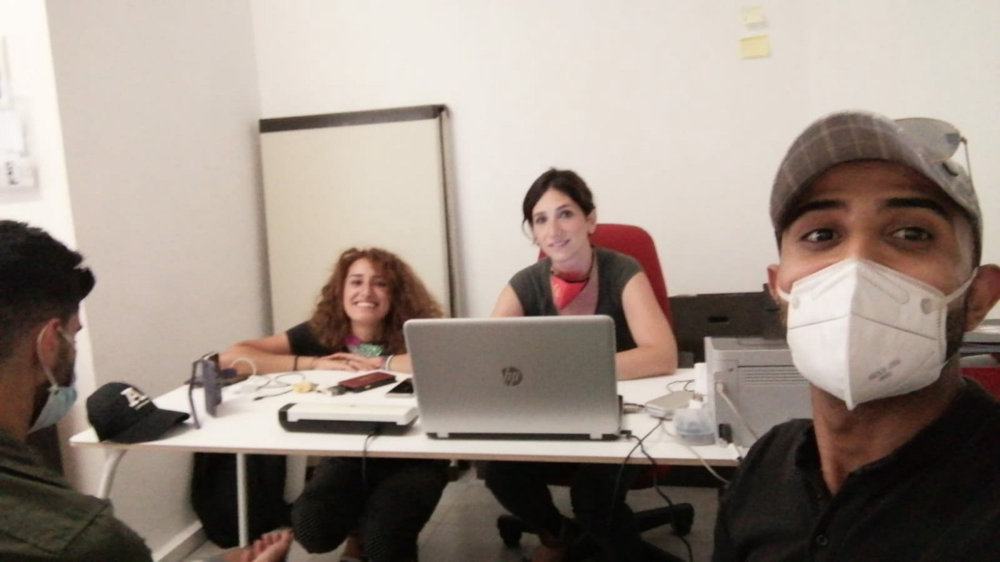
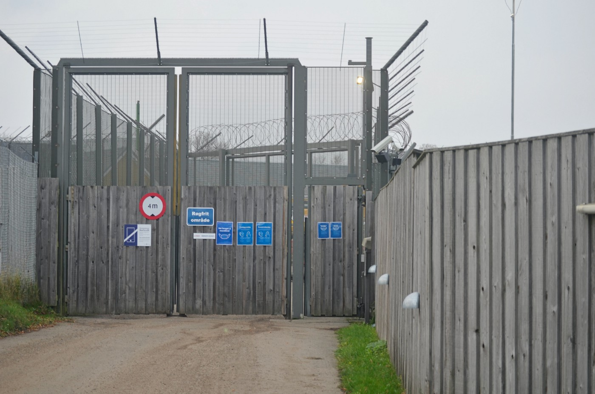

### AYS Special from Denmark: “Don’t worry, you’ll go back to Iraq soon\.”

Denmark has been trying to deport rejected asylum seekers to Iraq for years\. Authorities, despite pressure on Iraqi officials, cannot deport cannot deport people there\. Denmark has flown Iraqi people to Baghdad several times; every time they had to fly them back to Denmark because Iraqi authorities refused to receive people who are deported by force\. However, in recent months things have started to change\. Denmark recently signed an agreement on the deportation of people on the move who committed crimes in Denmark, and proceeded with the first deportation\. Over the last week, Denmark has [opened](https://www.mofa.gov.iq/2020/12/?p=19270) an embassy in Baghdad, which could pave the way for new negotiations\.

M\. with his legal advisors in Italy

As we reported in our daily digest, on December the 7th a large number of Iraqi citizens who have had their application for asylum in Denmark rejected, were arrested by the police and have been transferred to the Ellebæk ‘exit centre’ for the purpose of deportation\.

This is what Danish authorities call “motivational imprisonment”: detaining people in order to pressure them to sign voluntary return papers, for up to 18 months\.

M\. is an Iraqi man, who has been detained in Ellebæk since September\. On Tuesday December 8th, he was taken against his will to the Danish Returns Agency \(Hjemrejsestyrelsen\), to meet Iraqi officials for ‘questioning’\.

> 3 police officers came to me asking to go with them to meet some Iraqi officials\. I was scared of meeting them, and my lawyer told me I don’t need to go if I don’t want to, so I refused\. 

> One of the police officers said: “We’ll take you anyway,” and showed me handcuffs\. 

Ellebæk entry gate

M\. is not the only person who was visited by police officers and ‘asked’ to meet Iraqi officials\. A person who met M\. regularly, told AYS that police tried to take another Iraqi, but he resisted, which ended up with him being sent to an isolation cell\. Lawyers have also confirmed that police have no power to force people into this kind of meeting if they refuse\.

> Soon after, we arrived at a building I hadn’t seen before and I was led into a small room\. 

There M\. met a woman in civilian clothes, who started talking to the police officers in Danish:

> \[…\] when I heard them saying the word ‘airport’ I started feeling very stressed\. My heart was racing, I had difficulty breathing, and my whole body started to shake\. 

During his ordeal, M\. asked to be seen by a doctor, but this was refused\. M\. had to lie on the floor, but the police officers forced him to meet the Iraqi officials anyway\. “When they started speaking Arabic to me I remained silent with my head resting on the table — I felt powerless\.”

> They picked me up again and carried me with my legs dragging behind me\. They took me to the first room again and put me on the floor\. I had pain in my chest and I was shivering\. The same woman that was talking to the police about the airport approached me when I was on the floor\. She started giving me small kicks telling me to get up, but I couldn’t\. I asked for a doctor again but she ignored it, and then she lifted me by the jacket I was wearing and said: 

> “We don’t fucking care about you\.” Then she let go of my jacket so I fell back on the floor\. I fainted\. Then the woman started to pinch me in different parts of my body and she pain painfully pressed a finger behind my ear\. But my body didn’t feel like mine\. 

> She said: “If you go with the ambulance, maybe you’ll die,” which sounded like a threat\. 

> The police officers, who were present in the room the entire time, picked me up from the floor and took me back to the car\. When we arrived at the Ellebæk prison again, the woman that was interrogating me shouted: “Don’’t worry, you will go back to Iraq soon\.” 

After these events, AYS was informed that a number of Iraqi asylum seekers who had been arrested on Monday December 7, have now been released\. Sadly, this is not the case of M\. Instead, Danish authorities prepared his deportation documents\.

M’s case is still awaiting a final decision from a High Court in Italy, where he has also applied\. He has been told that he has a very high chance of being accepted there\. All he needs is enough time until the decision is made by the court\. His life, as he says, is in danger in Iraq even though he hasn’t been accused of any crime\.

At the time of writing, M’s lawyer has managed to convince the judge to postpone the deportation date after the decision of the Italian court\.

_Testimony collected on December 9, 2020 by Contact Ellebæk activists_

**Find daily updates and special reports on our [Medium page](https://medium.com/are-you-syrious) \.**

**If you wish to contribute, either by writing a report or a story, or by joining the info gathering team, please let us know\.**

**We strive to echo correct news from the ground through collaboration and fairness\. Every effort has been made to credit organisations and individuals with regard to the supply of information, video, and photo material \(in cases where the source wanted to be accredited\) \. Please notify us regarding corrections\.**

**If there’s anything you want to share or comment, contact us through Facebook, Twitter or write to: areyousyrious@gmail\.com**

_Converted [Medium Post](https://medium.com/are-you-syrious/ays-special-from-denmark-dont-worry-you-ll-go-back-to-iraq-soon-1a8b5fb87d44) by [ZMediumToMarkdown](https://github.com/ZhgChgLi/ZMediumToMarkdown)._
