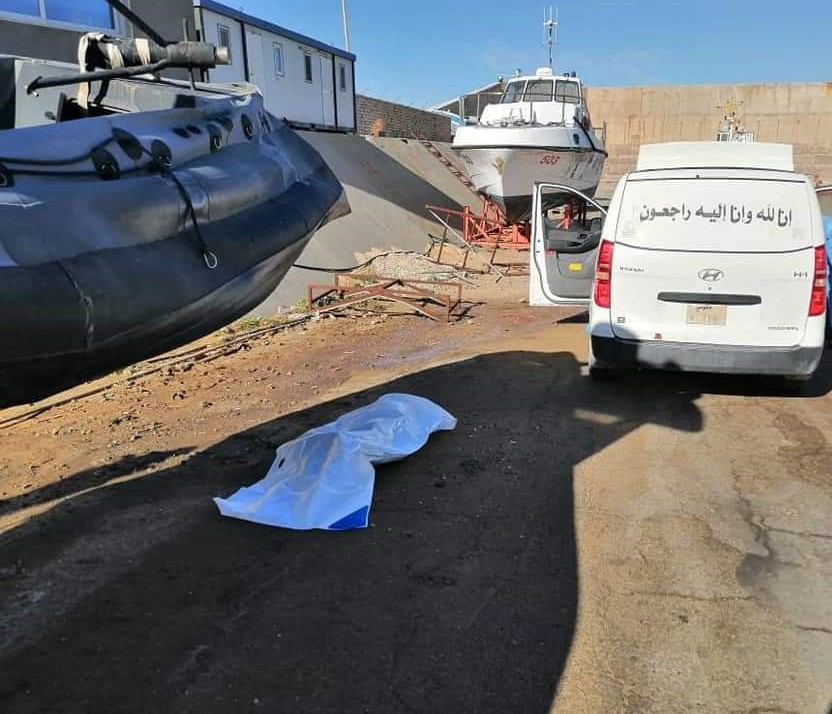
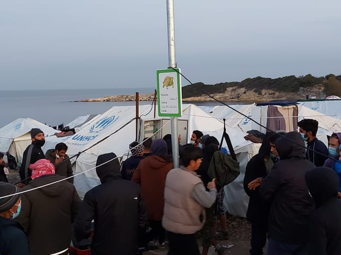

### AYS Daily Digest 16/12/20: With news of more militia attacks, Europe resumes deportations to Afghanistan
#### While deportation was canceled from Sweden, most of Europe resumes deportations to Afghanistan in the midst of pandemic / With the end of the housing program, people across **Kos, Leros, Rhodes and Samos to be evicted, no solution in sight /** Entire France mobilizes in protests for people on the move / Recommended reads and more

 and [Seebrücke Berlin](https://www.facebook.com/SeebrueckeBerlin/?__cft__[0]=AZUqsQrDDHuqh8d7FXOnKdY3An3XUtv-nJVduAvcwpIMTacUJC9jGsiLF-h_fugcShy5AaGu8oaCuGHILpMYaHJP-QwGy7vieXEvBmLqjh-CD-X1S7hCKqC9VEUkfCMVqOlB2ROnFmTKS6gnFm7P86DS&__tn__=kK-R) hung a huge transparent at the Alexanderplatz S\-Bahn station on Monday\. Until Sunday, the station, which counts 152,000 daily travelers and visitors in normal times, will draw attention to the situation in the Greek islands and that there are over 200 so\-called ′′ safe harbours ′′ in Germany, which Want to take refugees in\.” — News from the Med / Photo: [Naturfreundejugend Berlin](https://www.facebook.com/NFJBerlin/?__cft__[0]=AZUqsQrDDHuqh8d7FXOnKdY3An3XUtv-nJVduAvcwpIMTacUJC9jGsiLF-h_fugcShy5AaGu8oaCuGHILpMYaHJP-QwGy7vieXEvBmLqjh-CD-X1S7hCKqC9VEUkfCMVqOlB2ROnFmTKS6gnFm7P86DS&__tn__=kK-R) ”](assets/53b01f4a2f16/0*K1yqRJm3hjNiD0MZ)

“Activists of the [Naturfreundejugend Berlin](https://www.facebook.com/NFJBerlin/?__cft__[0]=AZUqsQrDDHuqh8d7FXOnKdY3An3XUtv-nJVduAvcwpIMTacUJC9jGsiLF-h_fugcShy5AaGu8oaCuGHILpMYaHJP-QwGy7vieXEvBmLqjh-CD-X1S7hCKqC9VEUkfCMVqOlB2ROnFmTKS6gnFm7P86DS&__tn__=kK-R) and [Seebrücke Berlin](https://www.facebook.com/SeebrueckeBerlin/?__cft__[0]=AZUqsQrDDHuqh8d7FXOnKdY3An3XUtv-nJVduAvcwpIMTacUJC9jGsiLF-h_fugcShy5AaGu8oaCuGHILpMYaHJP-QwGy7vieXEvBmLqjh-CD-X1S7hCKqC9VEUkfCMVqOlB2ROnFmTKS6gnFm7P86DS&__tn__=kK-R) hung a huge transparent at the Alexanderplatz S\-Bahn station on Monday\. Until Sunday, the station, which counts 152,000 daily travelers and visitors in normal times, will draw attention to the situation in the Greek islands and that there are over 200 so\-called ′′ safe harbours ′′ in Germany, which Want to take refugees in\.” — News from the Med / Photo: [Naturfreundejugend Berlin](https://www.facebook.com/NFJBerlin/?__cft__[0]=AZUqsQrDDHuqh8d7FXOnKdY3An3XUtv-nJVduAvcwpIMTacUJC9jGsiLF-h_fugcShy5AaGu8oaCuGHILpMYaHJP-QwGy7vieXEvBmLqjh-CD-X1S7hCKqC9VEUkfCMVqOlB2ROnFmTKS6gnFm7P86DS&__tn__=kK-R) ”
#### FEATURED

> Several German refugee NGOs had sounded alarms over Wednesday’s planned deportation flight from Leipzig/Halle airport\. The last deportation from Germany to Afghanistan was on 11 March, just before the government in Kabul asked for a freeze, as it was [struggling to cope with the first wave of the coronavirus pandemic\.](https://www.dw.com/en/coronavirus-a-hidden-catastrophe-in-afghanistan/a-53684693) 

Even though violence has increased in Afghanistan this year, Germany has resumed their deportations to Afghanistan, with many organisations and institutions [opposing](https://www.dw.com/en/germany-resumes-deportations-to-afghanistan-despite-covid/a-55963855?fbclid=IwAR1PH0PYyJ2AS2drQ_Hws0q_qjuLbchO4LAVxwxA5-E7dUp66M2dLRFB1cE) such a practice\.

Deportation to Afghanistan from Sweden was planned for Tuesday but it was stopped last minute\. The police said that this was because of problems with the staff and not because of the pandemic \(or the fact that Afghanistan is a country torn by war\) \. The problem with the staff later turned out to be COVID\-19, as reported by [Blankspot Project](https://blankspot.se/viruset-satte-stopp-for-deportationen/) \.
One of the people, who demonstrated when the first group of young people was deported in December 2016, said:

> Then I would never have been able to dream that we would be here again four years later\. 
 

> Then I thought that one would realize that this was a mistake that could be corrected and that the attention would make more people change their attitude\. 

[Reportedly](https://blankspot.se/polisen-kvallens-deportation-till-afghanistan-skjuts-upp/?fbclid=IwAR2cREaN9fGfZYHIqw-nDZTp6tTvrajc2vwlNEbocSvZjHATdY5aKDkU5Xc) , the Swedish Migration Agency continues to make the assessment that the situation in Afghanistan is not so difficult that all Afghan citizens automatically have the right to protection in Sweden, although conflict\-torn Afghanistan is worse than ever with the Taliban seizing land and a population hard hit by poverty as a result of the corona pandemic\.
Prior to today’s deportation, [criticism had also come](https://blankspot.se/polisen-kvallens-deportation-till-afghanistan-skjuts-upp/?fbclid=IwAR0NzOTQ6GLvY27bkkQkraHBMEKzGeFw780-jYXbYdGsPMxvTETiUaaQa_4) , including from the Refugee Groups’ National Council \(FARR\) and the Red Cross, which believe that the situation in Afghanistan is so serious that no one should be deported there by force\.

> We feel that the government, parliament and the Swedish Migration Agency do not understand the seriousness of the situation and what a full armed conflict really means, says Sara Edvardson Ehrnborg from FARR, one of the organizations that wrote a letter to Afghanistan’s Minister of Migration\. 

At least 13 Afghan policemen were killed when Taliban militants attacked two checkpoints overnight in the north of the country, as was [reported](https://www.infomigrants.net/en/post/29138/european-countries-resume-deportation-flights-to-afghanistan-after-9-month-coronavirus-break?fbclid=IwAR1nnSwHNIAnMA51228IfJyLf6AMh_cwYvM_SvIUYMyLbEl9mHeuiLMomtY) today\.

And although deportations to Afghanistan have been deeply controversial, countries like Germany, Austria, Sweden, Bulgaria and Hungary have recently taken steps to deport more Afghan asylum seekers back to danger\.
#### THE MEDITERRANEAN

Sadly, on daily basis, more people have lost their lives attempting to reach Europe\. Four unidentified bodies, presumably of people on the move, were found washed ashore in Libya\. Reportedly, one body was recovered near Refinary Point and three in Al\-Harsha area\.

Photo: Migrant rescue watch

On Tuesday Tunisia’s navy said it had intercepted 93 people of African descent after their boat ran into trouble in the Mediterranean Sea during an attempt to reach Italy, media r [eported](https://english.alarabiya.net/en/News/north-africa/2020/12/15/Tunisia-says-more-than-90-migrants-intercepted-during-bid-to-reach-Italy?fbclid=IwAR32Z4u2VTAv_h44TN6Xamp5cG7pdu2tu4a1qGyfhZW3tG7AhAMyMe2Mg2U) \.

In the Spanish waters, Maritime Rescue has rescued 41 people this Wednesday from a boat located in the waters of the Alboran Sea\.

A month ago Aegean Boat Report launched the ABR Hotline, to connect with ABR on Whatsapp\. The Hotline can be used to send information, pictures and video to Aegean Boat Report, all senders will be kept anonymous\.

In emergencies please use Emergency numbers for your area, or the international emergency number 112
#### GREECE
### Islands — evicted with no housing plan, while others are stuck in a worsening situation

According to a government decision, at least 200 people from **Kos, Leros, Rhodes** and **Samos** will be forced to leave the apartments where they have been living until now\. They have stayed in the accommodation thanks to the Hospitality program provided for vulnerable people in search for international protection\. As where they will go in the middle of winter at the end of the year remains unknown, both those affected and those working to help them remain clueless and deeply worried\.

On **Lesvos** , due to the lockdown, the vast majority of asylum seekers are not allowed to leave the makeshift tent camp\. At the same time, access to NGOs is prohibited\. Reportedly, in order to distribute food or provide medical aid, the aid organizations are [looking for alternatives](https://l.facebook.com/l.php?u=https%3A%2F%2Fwww.arte.tv%2Fde%2Fvideos%2F094279-174-A%2Flesbos-freiwilligenarbeit-am-rande-der-illegalitaet%2F%3Ffbclid%3DIwAR0sD8pmjwSvqPh_8OImO-3e-g5ovzTI_NoPmS53aT75k1huQhr9osNf6QY&h=AT34JSPWx3yw37s-3wH5SSpsWqf8yJTAC03GWavau2_WUWSVd57zr7pSmrcq6pYZV4bBdHmf2VsQm5TJfaZe638aWDKcJQCxloAKAijJm1QcyytCR-n5mY15fPfx6wPpXMxPRJcmGB52Ag&__tn__=R]-R&c[0]=AT0ayeeEiOOIh3IpcYmP3CiVybs5Iz33zVAn95h8MtcKNL47djeGeE7JFviBCZhKdqOUEQM8d64h_RSr4yZmOYbrA0IHSDn5tTS0vTSVAO6nFRtemMI4ig4kZsS27yVS06JiR73F-nRNHG82EoekYbj7lfZBKklKBRXXcSnejf7askU9vKXrOLSdCSgwJAI90YidJ7Dk8zxrxnylupalGinjyR2HybdpfA3CBXC6Jw) \.

The horrid conditions in Kara Tepe / Moria 2 remain the same, exposing people to further dangers, as we r [eported yesterday](https://l.facebook.com/l.php?u=https%3A%2F%2Ftwitter.com%2Fparwana_amiri%2Fstatus%2F1339137513215176704%3Ffbclid%3DIwAR1WRPQKZX9pE-LOcICoBLjQcXcfQl4o1sz6U585ne0mCLFhQk69G1hBKKI&h=AT363r8BYG-czFRVnR-xb42lt3dKfZEgx3TQGyCsPOXk2HteLSpAsmHwywQjpyJB9Do71ArUzUbc3IS40xmOVmh2uAyew-x8VwZ1yIDAwnWjxZTTRYMvNzegXPBDvhzFJLd8JTF89ljn2g&__tn__=R]-R&c[0]=AT0ayeeEiOOIh3IpcYmP3CiVybs5Iz33zVAn95h8MtcKNL47djeGeE7JFviBCZhKdqOUEQM8d64h_RSr4yZmOYbrA0IHSDn5tTS0vTSVAO6nFRtemMI4ig4kZsS27yVS06JiR73F-nRNHG82EoekYbj7lfZBKklKBRXXcSnejf7askU9vKXrOLSdCSgwJAI90YidJ7Dk8zxrxnylupalGinjyR2HybdpfA3CBXC6Jw) \. There is no real change in sight\.

](assets/53b01f4a2f16/0*W3nHfnr056psqLGA)

Photos: [Moria White Helmets](https://www.facebook.com/MoriaWhiteHelmets/?__cft__[0]=AZX9oKk8WjScl5e64HKOr8cKm3O2J77_AyGdo1BOyIC66K_2ZP6d8LoXxoPpaWjiS4mXBErbemUHjA0lySev7lTBqMw02BZy6363NraC4HqRhMl0onCShEVTC4cNSRcunJdihGOtg2o6Ct_knrQqT6s9&__tn__=-UC%2CP-R)

> Morale has never been so low, the indignity never so deliberate, and indifference never so pervasive among elected leaders\. Winter is here on Lesvos, and it will just be getting worse\. 

[](https://l.facebook.com/l.php?u=https%3A%2F%2Ffragdenstaat.de%2Fblog%2F2020%2F12%2F16%2Fauswartiges-amt-bestatigt-intern-untragbare-zustande-moria-fluchtlingslagern%3Ffbclid%3DIwAR2GQg0BSXcQRBa-Mpc6ZHt3EirYWBwci6-JkYtlQyPmUDvfIJKLi09sN-U&h=AT0IQCVPnGqzUjKvSPb9WlWmjpQ0UP3NyeyIlrJ4-0MwlbY5BaRkkTOk0abPMqShS2hMaAbEpXYeSQSs5bgITPeQORL58b1Cg_9r1tMbjcfQDfwR70-P0e0OagUZv4cnltKx8QkEeBSrng&__tn__=R]-R&c[0]=AT3n-6vvU9IF8isWDsENC9nMwb5hbxO4KWBDRUlt5pcGMlUFzwgfR1SD1NN_Fwvf9cbLZW9Q5hYOur9y3RuW8XM-CzfgyoJQwZHzpC5HzFzpDFYTDVeG9EegmbIHmGG7f7lK5U3r22QqdOgOdyUYqIyG7zV6BNe-VZnQVODFAhSr3PE2WSbiJ8XyynZrVXiy-PxzG2B_tak-TbO1ow)

### Patras

NNK volunteers write on the situation in Patras:

](assets/53b01f4a2f16/0*TRYOTQCoWXBn8gHz)

Photo: [No Name Kitchen](https://www.facebook.com/NoNameKitchenBelgrade/?__cft__[0]=AZWBcIZXVQonLtwUaRIZpTZUHvkeWwRxbfE91CYPuQi-3JWEtlmTL6nVxcSM4cauBK7dZpKZ283qdd_ECix4h9zRkYH-hBjdEUXlamhho9T7mHoqnReYGVKiv4Xk6P-MffB5HZoqykNMIKoPTF91TU_WhJcBpGrzFfrQw9Dkdord_H2sfu2np_WECGY2iaMw7kq69E8m6-v5bzfQ71g5Kf8y&__tn__=-UC%2CP-y-R)

> How’s like living in Patras’ abandoned factories? People here are involved in an everyday routine made of days which seem all the same: eating, going for the game, and, if everything goes wrong, coming back to sleep in this old, enormous and cold dismissed buildings\. 

> In their own priorities hierarchy’, trying to win “the game” occupies always the first place, often obscuring all the rest\. Every basic need becomes in this way a secondary thing, as they have to spend the day waiting for the right truck, hiding from the police: the timing of this life is not the same as in a peaceful existence\. 

> And, regardless what they’ve eaten, regardless they don’t have the possibility to have a wash, regardless where they feel pain, they want to try winning this game in order not to come back in the factories, making life harder every day, especially when you get stuck in this place for long periods\. 

> Taking care becomes therefore a priority: bringing food, clothes and blankets can make the day more livable and the night warmer\. For this reason, we here in Patras let this solidarity become our activity, supporting everyday more than a hundred of people, standing altogether on the same side in these hard times\. And, fortunately, we are not alone in this mission, thanks to the continuous donations and the support that we receive, so we want to give thanks to the different NGOs that helped us in our work\. 

#### BOSNIA AND HERZEGOVINA

Stories from Velika Kladuša…

■■■■■■■■■■■■■■ 
> **[NoNameKitchen](https://twitter.com/NoNameKitchen1) @ Twitter Says:** 

> > V., 16 yrs-old:
We’re now in the camp.
The police brought us forcibly here. From here it is very difficult for us to move forward.
Now I have to stay here all winter.
My brothers will not be able to go to school for another year.

Bosnia, in front of EU borders. 2020. 
@[albaduezp](https://twitter.com/albaduezp) https://t.co/XpA5ePVAcZ 

> **Tweeted at [2020-12-16 07:49:02](https://twitter.com/NoNameKitchen1/status/1339115302165024768?fbclid=IwAR0ESz2V4tzAxlPXeggplh856XbP8Sg9vhfAWq4CvntiyZ0AkbJ0d7fptF8).** 

■■■■■■■■■■■■■■ 

#### CROATIA / ONLINE
### Discussion & Iuventa film screening

AYS representative will take part in the discussion around the issue of the “protection of European values” following a screening of a film about the Iuventa SAR team\.

During their 15 missions in the Mediterranean, they rescued about 14,000 people from drowning\. But, in 2017 they were accused of running a “taxi service” for the smugglers\. The dramatic events and political awakening of the young protagonists were documented in the film _Iuventa\._

The film will be available for free screening from Thursday, 5pm CET, for 24 hours on the link: [https://festivaloftolerance\.com/event/iuventa](https://festivaloftolerance.com/event/iuventa?fbclid=IwAR0FI4oxFjDrOVqt7uHUSh2uZ0hQpgSeFXOFx4hWGeo0FoTThoV5FCtJR_w)

This will be an introduction for our AYS team member Tajana to speak about the current state of things, which unfortunately changed only for the worse in the meantime, along with some other guests from the political side of things, the Croatian Ministry of Foreign Affairs\. The discussion will be available for watching online, on **Friday at 6pm CET** on [https://festivaloftolerance\.com/film\-i\-diskusija](https://festivaloftolerance.com/film-i-diskusija?fbclid=IwAR3lsY7OFW7Qu_IjTlQgnG3tu795UX2KJuhyF7Wvb7hJ_-VrPUFlJ2_Hu30)

](assets/53b01f4a2f16/0*M367bVsqpMsQ3TXU)

[Festival tolerancije — JFF Zagreb / Festival of Tolerance — JFF Zagreb](https://www.facebook.com/ZgJewishFilmFestival/?__cft__[0]=AZWWhDFm6AYwex7MKUU67j-lVlzixgFX37oQS-30Y16h2e41lbh2mOagC2WJT2mFyGXtnIUQaoXaNGreZdvE5mDIQKkWlQUvYqxA-ziNyleo6yzXZu-8irmOw4K6Fnge1E4Ms6G07svrEuFJLucWlUSrvqDxSshpDQH1LU0yD3IiJ9ea5EVTqduG1OCrLGAjKTFjx4edPemBjQ39TZppUaFj&__tn__=-UC*F)

In the meantime, in Croatia, the AYS team has continued providing support and distributing aid to people in need through our Free Shop, all throughout the coronavirus lockdown, and months in between\. However, we are in need of men’s clothes of smaller size and in particular — shoes\. If you can help in any way, by sending a pair of sport shoes, hiking boots or similar, let us know and we’ll let you know how we can make that happen\. Follow our Facebook, Instagram or Twitter accounts for more info\.
#### FRANCE
### Calais — people trying to track down the IDs of those who have died

All those who are in contact with people on the move know how difficult and important the contact is for them with their families\. Tragically, more and more young lives end on the journey to a better life, whether via the so called Balkan Route, in the rivers and fields, or on one of the maritime Mediterranean routes, or somewhere in the north\. Everywhere there are groups and individuals trying, one last time, to make contact with family and find the identities of the people who died\. Made up of local goodwill and several associations such as Utopia56, the Catholic Relief Service or MSF, such a cell formed around Calais that engaged in “survey work” among the people on the move\.

> “We work for the dignity of the deceased\. To notify the relatives, to be able to bury them according to the choice and rite of the family, with an identity, this is what plays out” \. 

Each time, “it’s a race against time”, they say, stating an important detail that they are always in support of the family, “we do not make decisions for them”\. 
The work of this “group for the deceased” has helped shed some light on the tragedies that are played out on the English Channel, often in the shadow of those who cross the Mediterranean\. Sadly, only a few repatriations are usually organized, and most of the funerals take place in Calais\.
### International Migration Day: All of France mobilizes for people on the move\! Join in\!

#### BELGIUM

[Réseau ADES](https://www.facebook.com/ReseauAdes/?__cft__[0]=AZX9ufyZHaQ9WWo-gvIqfM1otYuSnmM4lklwirWO4QGvqOKYeAIvYDm2AtenLzwTDxooF56tPE_6zSgd6c-CemGyFZ66RX-FM-cm3Uxk5m0NmbJ4hzoA9TU1kVsYczMQbzAOAbGxJ3HWbtenHC6jjDtixYxdBblqZqwqDHoAQlqwY__3oBgMyenOuiBDDUC6lkbJMZp68AvCo49vEqqyIB3u&__tn__=-UC-R) started a campaign in support of regularization of procedures for undocumented people known as _sans papiers_ in the French speaking countries:

#### GERMANY
### Sant’Egidio continues with safe corridors

The Archdiocese of Munich and Freising is supporting the “Humanitarian Corridors” project of the Community of Sant’Egidio with €80,000\. The initiative is dedicated, among other things, to rescuing particularly vulnerable people from the refugee camps on the Greek islands\. The aim is to bring 300 people, mainly children, the elderly, the sick and people with disabilities, from the camps to mainland Italy, where they can be cared for by community volunteers\. Care includes the provision of basic needs such as living space, clothing, food and medical help, but also integration offers such as language courses, legal advice and help with a search for a job\.
#### UK

> The British government is planning to house asylum seekers in several “camps” without access to electricity and water after Brexit, [according](https://t.co/IISy4iuIYa?amp=1) to Caroline Nokes, a Conservative former immigration minister\. 

#### In the meantime, people are demonstrating they think differently than their politicians\.

The Garden House on Pembroke Road, Norwich, owned by Craft Union Pub Company, is collecting festive donations to go in stockings for young people\. They are asking for donations to give Christmas cheer to unaccompanied asylum\-seeking children and teenagers being cared for in Norfolk\. They are appealing to individuals and local companies to donate items for children aged 10–17 including warm clothing, such as hats, gloves and scarfs, books, toiletries, stationary and age\-related toys\.

■■■■■■■■■■■■■■ 
> **[Kevin Bonavia](https://twitter.com/kevinbonavia) @ Twitter Says:** 

> > It was a privilege to launch the @[CityofSanctuary](https://twitter.com/CityofSanctuary) Local Authority Network so like-minded councils can support each other in making our areas genuine places of sanctuary. #RefugeesWelcome 

Each of us is on a journey. Read @[LewishamCouncil](https://twitter.com/LewishamCouncil)’s story here 👇🏼

[cityofsanctuary.org/2020/12/07/wor…](https://cityofsanctuary.org/2020/12/07/working-with-local-authorities-case-study-lewisham/) https://t.co/hzFb1kQfY9 

> **Tweeted at [2020-12-15 17:53:02](https://twitter.com/kevinbonavia/status/1338904918539776003?s=20).** 

■■■■■■■■■■■■■■ 

#### WORTH READING
- A visit to the border volunteers facing political and police pressure in Serbia, here are their testimonies:

[](https://l.facebook.com/l.php?u=https%3A%2F%2Flupiga.com%2Freportaze%2Freportaza-lupiga-medju-volonterima-u-sidu-toplim-obrokom-za-izbjeglice-u-destabilizaciju-drzave%3Ffbclid%3DIwAR0sD8pmjwSvqPh_8OImO-3e-g5ovzTI_NoPmS53aT75k1huQhr9osNf6QY&h=AT1bZcPX-z5GvZeG5C3zAVcMs8M7oIHdRGABqC9Jl4_MYVZqXhXOvzWVwoGx8nPIFj1gDuLtOyjCmUwJaEWhvE1cswQh2dDsFadhQMeQ0A7Ct1q97OmWj77-TYhjuKCENw&__tn__=%2CmH-R&c[0]=AT1fknWT21h5_bmt-uw9ICK3zI0YdFtqieZ87fx1PqPGz7QMgBe0jD37_VvgYWdl2bCXY82-iLihn9ApxIb4y8Th36zUZ-M54JYG-uK6OYIIQ1CEUWnMTOgrgYyJgauWcOnoDDStf740ERNDiENsgZ6hruf_X0HNV-Xn6RsjAriF3334hoWhn8U3kYxWTdYDJnXAyyQqV4zc7HJvHw)

- Interview:

[](https://l.facebook.com/l.php?u=http%3A%2F%2Fwww.against-inhumanity.org%2F2020%2F12%2F13%2Fan-interview-with-sean-binder%3Ffbclid%3DIwAR0MLW1aBUyQx91sVMphKup8UsT1_OQWOqFtNu9a29jT1sJb-SsYHvKyqg0&h=AT2wuNSgK7fI8IXnESASfonU3XbmkdZhAChWWsf3w6oLBAKGslgJ8Y7rZ6k7aZb4fQtuSpjEreUr-ygufnZZ1CCNicVas7QKJVpectFBF7x5ER_sPwF7pszwub-Iq38N0_8V5PhJTsr-RA&__tn__=R]-R&c[0]=AT0fmoJ9VzfNVleA5EW0yzVYTM8mUKGovM8gBrrq152O5Edk7JAFfhgHKV4mVeeU-SXIkLf6KoUkuSxDIYZjVsTz6PaYvuPhyDry-s9m6xMaKBBxsSMduw4rAbWgjIbQSloLORRyFwuVy82gZoSQCHLQGeKomwNOHrGEA9gO0KHsTyHq0XHkjRE-5JS0arabw6dNjgzA8tI_1cX9ks1aZMOqvDe0Cg)

- Some of the most recent literature suggestions on migration:

[](https://l.facebook.com/l.php?u=https%3A%2F%2Ffm-cab.blogspot.com%2F2020%2F12%2Fthematic-focus-general_12.html%3Ffbclid%3DIwAR1S_wnxK8fSIg_sKe_Vx3JdlPndNmf9tT7wM6Jnv3vrAnieWoji992sifc&h=AT1xGjGP1qp3Nyy0hb4Up9EKJB4KTwYNEgh5J863G_e52Zq-WPypq9qdhZ5F_STZplEStkpd8lOlbRh03_z47iSLJSyVCX1s8__8luCYdQ8nLKEwOHAh9uCBIDZ_gPlq8Q&__tn__=H-R&c[0]=AT0fmoJ9VzfNVleA5EW0yzVYTM8mUKGovM8gBrrq152O5Edk7JAFfhgHKV4mVeeU-SXIkLf6KoUkuSxDIYZjVsTz6PaYvuPhyDry-s9m6xMaKBBxsSMduw4rAbWgjIbQSloLORRyFwuVy82gZoSQCHLQGeKomwNOHrGEA9gO0KHsTyHq0XHkjRE-5JS0arabw6dNjgzA8tI_1cX9ks1aZMOqvDe0Cg)

**Find daily updates and special reports on our [Medium page](https://medium.com/are-you-syrious) \.**

**If you wish to contribute, either by writing a report or a story, or by joining the info gathering team, please let us know\.**

**We strive to echo correct news from the ground through collaboration and fairness\. Every effort has been made to credit organisations and individuals with regard to the supply of information, video, and photo material \(in cases where the source wanted to be accredited\) \. Please notify us regarding corrections\.**

**If there’s anything you want to share or comment, contact us through Facebook, Twitter or write to: areyousyrious@gmail\.com**

_Converted [Medium Post](https://medium.com/are-you-syrious/ays-daily-digest-16-12-20-with-news-of-more-militia-attacks-europe-resumes-deportations-to-53b01f4a2f16) by [ZMediumToMarkdown](https://github.com/ZhgChgLi/ZMediumToMarkdown)._
