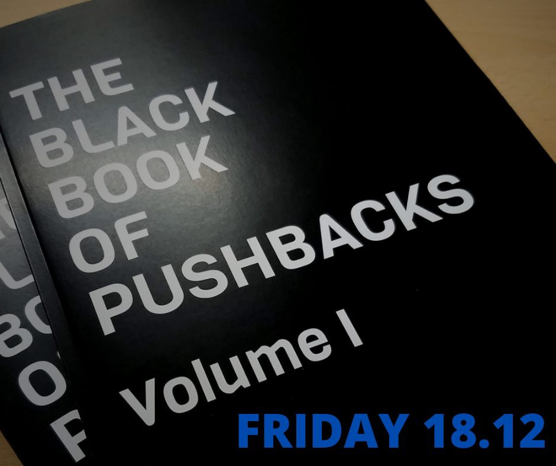
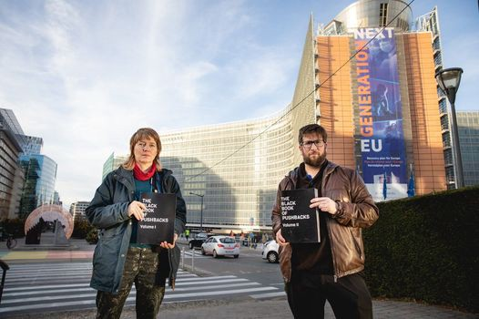
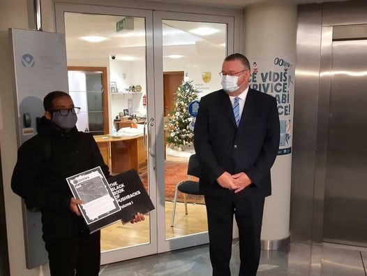

### AYS Daily Digest 18/12/2020 — “Black Book of Pushbacks” published by BVMN and launched by the United Left in the European Parliament
#### Shipwrecks and rescues in Greece and Spain // Germany to restart deportations to Afghanistan // Violence against migrants and activists in Serbia and Bosnia // and more…

Today Border Violence Monitoring Network has released the ‘Black Book of Pushbacks’\. This 1,500\-page publication, in two volumes, has been compiled by the Border Violence Monitoring Network and it exposes in detail the illegal practice of violent pushbacks of migrants which have been taking place over many months at the EU’s external borders — with full impunity\.

The book collects testimonies and stories about the the horrific violence suffered by over 12,000 people at the hands of EU border authorities against people migrating or seeking asylum\. It brings the voices of the victims to the European institutions as well as governments, and it aims to hold them accountable for the tortures, the inhumane and degrading treatment, and the violation of the right to life that people seeking safety in the European Union are faced with\.

[The ‘Black Book’ includes](https://www.guengl.eu/brutal-accounts-of-violent-push-backs-documented-in-newly-released-black-book/?fbclid=IwAR0tHVxRqP8KqzmCWX-q3kFxdTjD7d_CEh2D_NE1RtjucpzNjXprv158UYE) :

_– 892 group testimonies detailing the experiences of 12,654 people;_

_– the violence many endured in Italy, Greece, Croatia, Slovenia and Hungary along the so\-called ‘Balkan route’, including maps, data, photos and other key information;_

_– the types of suffering and violence perpetrated by border agents, member state police forces, soldiers — even guard dogs;_

_– many of the incidents documented could be clearly described as sadistic, merciless, humiliating and degrading\._

Fifteen organisations, including AYS, contributed to the book effort through collected testimonies as well as visuals and maps published in the book\. It is made in collaboration with the United Left \(GUE/NGL\) block of the European Parliament, that is why you can see it being presented by MEPs Miguel Urbán and Malin Björk\.

MEPs Malin Björk and Miguel Urbán Crespo presenting the Book to Commissioner Ylva Johansson in Brussels

According to Hope Barker, [BVMN spokesperson](https://thecivilfleet.wordpress.com/2020/12/18/activists-highlight-europes-mistreatment-of-refugees-this-international-migrants-day/?fbclid=IwAR3o5wxbu6nIOnfRa2GulwVBC5F2TJSHOpw1eeUk2VlRKQ3oSXdWzcPLc5w) :

> “This book brings together four years of work by BVMN, collecting nearly 900 testimonies of violent pushbacks at European borders\. Although these accusations are met with denial from the perpetrating countries, what we provide within these pages is an analysis of patterns and photo evidence that reveal an ongoing systematic practice\. And these are just the stories that the Network has managed to record, the reality is much wider and more far\-reaching\. 

Khalid from Eritrea, who himself experienced numerous pushbacks including from Slovenia, delivered the Black Book of Pushbacks to the Ombudsperson’s office in Ljubljana, where he was received by the deputy Ombudsperson\. Khalid, who escaped slavery in Eritrea, has been denied asylum \(waiting for an appeal\) on the grounds that “there are NO REPORTS” regarding the conditions in Eritrea, so Slovenia cannot say for sure if he is eligible for asylum\.

For a video presentation and discussion of the Black Book, featuring AYS’s great Milena Zajovic, see [here](https://www.youtube.com/watch?fbclid=IwAR1RaKSw44GuZNgi2nGQQBddP2HQh_JY8nz22Uk39u9SPtL8RdKDxWicGXM&v=_IbJdIu2fM4&feature=youtu.be&ab_channel=TheLeftintheEuropeanParliament) \.

For media articles on the book, see LeMonde [here](https://www.lemonde.fr/international/article/2020/12/18/plusieurs-groupes-du-parlement-europeen-s-inquietent-des-pratiques-de-refoulement-des-migrants-aux-frontieres_6063805_3210.html?fbclid=IwAR0gEWxZ3VwIL2I2RE0yB_ZUEoHbwpgyBzZ8qBzWq41p4zqbTLBvXrQahiM) and Taz [here](https://taz.de/Gefluechtete-an-EU-Aussengrenzen/!5733881/) \.

Click HERE to access [VOLUME 1](http://adobe.ly/2WtYqu4) and [VOLUME 2](http://adobe.ly/2LPhqkA) of the Black Book of Pushbacks\.
### BELGIUM
#### COVID\-19 in the closed centre for migrants in Bruges\.

Infections with COVID\-19 are [on the rise amongst detainees in the centre for migrants in Bruges](https://www.gettingthevoiceout.org/covid-in-the-closed-center-of-bruges-testimony/?fbclid=IwAR0apnQNDY0QveW9QBjzrh2oDJMo94PspDvDcWGIFxMvaCM1cHWAkqAtqq0) \.

> “We are at the “center for illegal immigrants” of Bruges\. It turned out that in the course of the past week we had several positive cases of coronavirus, including the educators, the detainees, the guards as well, and the director didn’t take any measures to keep us safe\. In both groups there are infected people\. As of today, eight of the chiefs are infected, six of the inmates are infected, and two of the educators are infected\. All of us have been tested twice in this center, we entered here without coronavirus because we are tested right at the entrance before entering the group\.” 

A former clinic was [occupied by HospitaliereO activists](https://www.facebook.com/nobordersnetwork/posts/3601445053256694) to be used as a shelter for the homeless and undocumented migrants in the Saint\-Gilles district of Brussels, earlier today\.
### EU and FRONTEX

EU Commission President Ursula von der Leyen heralded a new Migration Pact on September 23, 2020\. That was three months before [this footage](https://youtu.be/10RZoVSvYuQ) was recorded in the “new camp” on Lesvos, Greece\.

ECRE has published its comments on the Commission Amended Proposal for an Asylum Procedures Regulation [Border Asylum Procedures and Border Return Procedures](https://www.ecre.org/wp-content/uploads/2020/12/ECRE-Comments-COM-2020-611-2-December-2020.pdf?fbclid=IwAR0k4p9zr2IsIa-oF3AtKdOuKFA88-maf-_y7JEmtqkPrnMp6L0qFRbeG8k) and a [Policy Note](https://www.ecre.org/ecre-policy-note-relying-on-a-fiction-new-amendments-to-the-asylum-procedures-regulation/?fbclid=IwAR2Y9s89-61WHS4IuzfjylGJ3dpNkCMct42PkD5pk70FJaBzZBZ0fQqmeu8) containing the short version of the comments\.

> Exploring the content, it is clear how the proposals support above all the objective of containing people at the borders, often framed as ending “secondary movement”, i\.e\. onward movement from one EU Member State to another\. Again, this tips the balance in favour of certain Member States — those prioritising the “battle” against “secondary movement — and away from others\. Another central objective of the Pact is increasing deportation numbers, seen — rightly or wrongly \(in ECRE’s view wrongly\) — as the key to making asylum function in Europe, but even after examining the detail of these two proposals it is not clear how that will actually be achieved\. Both proposals will lead to near automatic detention but absconding is not the reason for the low effective return rates\. 

For the full editorial, see [here\.](https://www.ecre.org/progress-on-the-pact-not-in-our-name/?fbclid=IwAR3g67shFdc4kRi-K_31_e1y9Wo6FmQQze8xOv2RESHTck6ohKTpJyZCjns)
### GREECE

Lesvos, Greece, 2020: Two Afghan children fly a kite together in Lesvos\.
Photograph/text by Aggelos Barai

A dead woman from Somalia [was found in the sea area southeast of Lesvos, today](https://www.politikalesvos.gr/nayagio-me-nekri-gynaika-sti-gera-kai-erotimatika/?fbclid=IwAR0RtBclktq0YDhlrtuMz6R3KZK0ZxDGIEMIuzWxu19-d86o3Gtu62esEqc) \. [This morning](https://www.facebook.com/AegeanBoatReport/posts/993853414471096) before first light, a boat believed to have been carrying 28 people approached land on Lesvos South, Katsinia bay\. Two more women of Somali origin were found alive by Coast Guard boats and are being transported to the Mytilene Hospital in order to be offered first aid\. A fourth man from Afghanistan is still missing, so the search and rescue operation is still trying to locate him\. Initially, the coastguard denied the shipwreck\.

The first information provided by 24 survivors, all of Somali origin, [spoke of three missing women](https://www.facebook.com/657905327610696/posts/3601192403281959/?d=n) \. According to witnesses, the shipwreck was caused by an explosion on the boat, and resulted in the drowning of three women\. This video [documents the tragedy](https://fb.watch/2sQeZZVFYu/) \.
#### Story from Amygdaleza, a Greek detention facility:

We have received [this testimony](https://www.facebook.com/katja.lihtenvalner/posts/10157974315846158) :

> “I would also like to share the conditions of detention of both myself and my detainees: Since my arrest and I am kept in a state of complete isolation \(I have been denied contact with the other detainees\) while I am the only one who is alone in my cell\. All the detainees are locked in cells without the slightest exit and without any access to the courtyard\. We spend whole days without even seeing the sky\. We are kept in the middle of winter in frozen cells with broken windows and without a mattress\.The food is filthy and inadequate\. It has happened that they leave us for twenty\-four hours without any food and then give us a simple croissant, while they forbid us to buy anything from outside\. The prisoners here are suffering from hunger and asking for food\.” 

#### Coast Guard operations on Chios

An operation by the Coast Guard and the police has been underway since the morning of Friday, December 18, 2020, to locate and collect refugees and migrants who arrived on the beach between Vokaria and Gridia Neniton Chios\.

The [first information](https://astraparis.gr/epicheirisi-perisyllogis-prosfygon-kai-metanaston-poy-vgikan-sta-nenita/?fbclid=IwAR0tHVxRqP8KqzmCWX-q3kFxdTjD7d_CEh2D_NE1RtjucpzNjXprv158UYE) states that these are 38 to 40 people, who have been scattered throughout the area from Nenita to Vouno and Flatsia, looking for the way to the reception and identification center of VIAL\.

[Alarmphone](https://twitter.com/alarm_phone/status/1339980139992657920) has been alerted to a boat in distress near the Greek island of Kythira, carrying 150–200 people according to information received by relatives\. Last known position: 36°19'00\.5" N, 23°27'01\.3" E \(13:50 CET\) \. So far no rescue has been confirmed\.

A [series of trainings](http://www.astynomia.gr/index.php?option=ozo_content&lang=&perform=view&id=99292&Itemid=2562&lang=) for the personnel of the Hellenic Police on issues of integrated management of external borders has been completed\. During the trainings, participants had the opportunity to learn about, among other things, issues of external border management, risk assessment, strategic analysis, interviewing and identification of “illegal” immigrants , as well as human — fundamental rights during border guarding\.
### SWITZERLAND

Switzerland says it will seek to send 63 failed asylum seekers back to Eritrea following a review of 3,400 cases\. The temporary asylum status of a further 20 people has also been cancelled, the [migration office said](https://www.swissinfo.ch/eng/switzerland-rejects-eritrean-asylum-seekers-after-parliament-review/46233278?fbclid=IwAR1MND4fJ6hxwAHDcbv1z84eb6Oacqc4cP1IMS1j-AdPXHJ3EDfNcfjqjZk) on Friday\. Eritrea does not accept forced deportations, so the rejected asylum seekers [will have to be sent back by voluntary repatriation](https://www.swissinfo.ch/eng/asylum_eritreans-stuck-in-switzerland-lose-faith-in-a-better-future/44805196) \. Switzerland is working with Eritrea to improve the situation in terms of repatriation, both bilaterally and as part of a four\-country dialogue with Germany, Sweden and Norway, the statement said\.
### SPAIN

This morning, the [Civil Guard rescued](https://www.lavanguardia.com/vida/20201218/6131480/rescatados-23-inmigrantes-navegaban-patera-aguas-mallorca.html?fbclid=IwAR3CQSEUEh31kdLumA9-9H2_k1SQAWEvrQvT5tIKXm9FjSfu3TFwbPNTj7c) 23 immigrants who were sailing in a boat in the southern waters of Cala Figuera, in the Mallorcan municipality of Santanyí, the Government Delegation in the Balearic Islands has reported\.

[Solidarywheels](https://en.solidarywheels.org/post/18-december-international-migrants-day?fbclid=IwAR0IGC7d0_iw5y2Apufdh3PifX8Z75l3Eke7ZbXn3p3uWBmDtZ3xhEe7MMI) reports from Spain:

> Today, International Migrants Day, we want to talk about various migrant self\-managed projects \(created by first or second generation migrants\), migrant groups with autonomy and/or support for migrants in Spain\. 

> We want to show the part that never appears on TV, in the news, in the press… We want to show the positive, inspirational part that pushes motivation and creativity\. We are fed up with tragic images, conflicts, disasters and arrests\. We are fed up with the violation of human rights and dignity of people\. That is why, today, we want to recognize those people who fight for their projects, ideals and values\. 

### GERMANY

The German government has resumed deportation flights to Afghanistan\. On Thursday, a group of 40 Afghan asylum seekers arrived in Kabul from Germany\. German authorities had suspended the program in March after the coronavirus outbreak in the country\. [Since December 2016](https://www.infomigrants.net/en/post/29193/afghan-deportations-continue-despite-security-threats?fbclid=IwAR2iC7PeWAhn-Gsa43nAMSyrkQWzQltQUWda0SOhCf-Te75p-pvoCrK62Sk) , the German government has deported 937 asylum seekers to Afghanistan\. Several German refugee NGOs had sounded the alarm over Wednesday’s planned deportation flight from Leipzig/Halle airport to the Afghan capital\. Deportations of Afghan asylum seekers to their home country have remained controversial in [Germany and elsewhere in the European Union](https://www.dw.com/en/eu-states-push-ahead-with-afghanistan-deportations-despite-increased-danger/a-45835755) , with rights organizations saying that Afghanistan remains an extremely dangerous country\. EU member states, however, are convinced that big cities in Afghanistan — including Kabul — are safe for the deportees to start a new life\.

We have received information about a charter deportation from Düsseldorf to Ghana taking place on Monday 21\.12\.2020\. If you are affected please make sure you [follow this Telegram channel](https://twitter.com/Deport_Alarm/status/1340050484737019904?fbclid=IwAR3oEmER23fuKaWF06H-CSbbSFAl-hygjLZb7rnlfRqBsLqxusTLa3WFxVs) for more up to date information\!

On Niger’s southern border, a new unit is supposed to fend off Islamists and migrants from Nigeria — also [financed by German funds](https://taz.de/Grenzkontrolle-in-Westafrika/!5733874/) \.
### UK

British citizens are most likely to be stopped by ‘intelligence led’ immigration enforcement\. New figures obtained by [VICE World News](https://www.vice.com/en/article/4ad4dw/british-citizens-most-likely-to-be-stopped-by-intelligence-led-immigration-enforcement?fbclid=IwAR2GvPVG7Xs9q4pkjflvgmXwXpxQQzLGxtoCtUHzCw1WzEg4Fy39-iGgtaQ) and the Bristol Cable have raised fresh concerns about racial profiling in Home Office immigration enforcement operations\.

> “Concerns around racial profiling during immigration enforcement operations, which the Home Office has always denied, [go back to at least 2013](https://www.bbc.co.uk/news/uk-23552088?fbclid=IwAR12S4uql2RcWK1lsI5VZDC7jrWERrfYeQj60RGs5it-ekbq_oBQKod8eZA) \. The Equality and Human Rights Commission \(EHRC\) wrote to the Home Office that year regarding concerns over racial profiling during operations at public transport hubs\.” 

A l [andmark victory in the high court](https://www.theguardian.com/uk-news/2020/dec/18/trafficked-woman-has-right-to-work-as-cleaner-in-uk-rules-judge?fbclid=IwAR23gpf3NESSPsQosoAwsd8U6t5fy1kFWYyuOO-hp3PLMHy8vSVBkuU93Ug) has been obtained by a trafficked woman who asked a judge for the right to work as a cleaner\.

> Asylum seekers and victims of trafficking are generally denied the right to work by the Home Office\. Many wait several years for their cases to be determined\. There is a [record backlog](https://www.refugeecouncil.org.uk/latest/news/asylum-claims-fall-as-people-waiting-more-than-six-months-for-a-decision-hits-record-high/) of 60,548 people waiting for an initial decision on their asylum claim, with 76% of people waiting more than six months for a decision\. 

In Kent, the [community of Folkestone](https://www.kentlive.news/news/kent-news/folkestone-community-stages-refugee-nativity-4810462?fbclid=IwAR2IfZL6_Cx-rLbO-TbFIqjTzGxRAIyzuM9PyZvMWYfqE_UYI0XToROqV2g) has marked International Migrants Day by staging a refugee nativity\.
### LIBYA

MSF has issued this [videoreport](https://twitter.com/MSF_Sea/status/1339868231532732416?fbclid=IwAR3KEIIraOHnS1ec--PO-lmwnLQZM9EnzGiy6usXtuJsHN4eMhwgIuz0z68) :

> How would you feel if after years of inhumane arbitrary detention, you were told you were about to be released, only for it to be postponed over and over again? That’s what is happening to 250 [\#refugees](https://twitter.com/hashtag/refugees?src=hashtag_click) and asylum seekers stuck in Zintan [\#Libya](https://twitter.com/hashtag/Libya?src=hashtag_click) Help us speak out and get them out\! 

Alarmphone has sent an [open letter to migration authorities](https://alarmphone.org/en/2020/12/18/open-letter-to-authorities/) : RCC malta, MRCC Rome, Frontex, IOM, UNHCR, Libyan RCC, to confront them with their responsibility for the shipwreck of 9 February 2020 off the Libyan coast, where 91 people went missing:

> Since then, the 91 people have been missing\. Alarm Phone have asked all authorities and international organisations to reveal their information on this case in order to clarify what had happened to the distressed, but never received any response\. As all the rescue coordination centres were alerted, it was their legal responsibility to respond to distress situations and to make sure that people in distress were searched for and rescued, regardless of the boat location\. We fear that, instead, European and Libyan authorities ignored the distress calls and decided to let 91 people die\. 

### SERBIA

The [Info Park Association](https://nova.rs/vesti/drustvo/migranti-u-dvostrukom-riziku-od-pandemije-i-nasilja/?fbclid=IwAR3ofdg4-WPbDL-B7BT0Q6id2UbAVY2c_2p_2m7vv7d5q7tcdvLhNs2Kiqs) announced today, on the occasion of the International Migrants' Day, that migrants in Serbia are doubly at risk, from the coronavirus pandemic and the growing violence on the streets\.

After more than five years of working in the field with migrants and facing various types of challenges, for the first time we notice that this population has almost been left without the support, protection and solidarity that it previously enjoyed in this society, Info Park said in a statement\.

“The hospitable and solidary face of Serbia from five years ago has been distorted and transformed into a Faustian reflection of xenophobia, hatred and misunderstanding\. A small number of migrants in Serbia were tested for COVID\-19 in 2020, there are no deaths, because most of the positive ones were treated by putting them in isolation, and not by accessing the health system of Serbia”
### BOSNIA

We have received the following report from [NoNameKitchen Belgrade](https://www.facebook.com/NoNameKitchenBelgrade/posts/1145854015812881) :

> “Lipa is closing within the next days\.” This sentence we had been hearing from so many people on the move for the last days\. The Lipa Camp in [\#Bihac](https://www.facebook.com/hashtag/bihac?__eep__=6&__cft__[0]=AZWD34gRvvR9jqL2BK2cDJKObZtHbJJBelKx3ACHa2IcIG6xB6x3ezdiJVSo6PAyKDQ4YmkhIFWOI3Ew5nBGQClAoftSrUMy4O28UxeKc_2KXXVEkOCxkCWdALzJ8nMYtducHdPwsuZ0JIenib9b4Rf88J2DpvUGkOltlRCNly2rdOLjYTZPMeln-VTxFBqRZcA&__tn__=R]-R) in Bosnia is very close to the Croatian border\. Single men on the move are placed there\. They are waiting for another chance for going to the „game“\. It’s not that Lipa Camp had been good in any way\. It’s a place “up in the mountains” like people on the move usually say, out in the woods\. Inside the camp only muddy ground and huge cold tents for the people to “live” in\. 

Indeed, [IOM, has acted on warnings that it would close a migrant camp](https://balkaninsight.com/2020/12/18/iom-closes-migrant-camp-after-bosnia-ignores-warnings/?fbclid=IwAR2jP-VpuGmkAebCsKZZiqNfXGbfMULWCbTV2oU0T1A9mNW8veHmG3l3gS0) , saying Bosnian authorities had ignored its repeated appeals to help supply basic services\. The Lipa camp in northwest Bosnia near the border with EU member Croatia was due to close on Friday, but the IOM was asked to stay on in the camp for another day so that the authorities could find a solution for about 1,300 migrants staying at the camp\. The camp is still reachable only by a dirt road, electricity comes from a generator and water is brought in on trucks\.
### WORTH READING

**Greece** has announced it is ending its longstanding practice of holding unaccompanied migrant children in police custody, but critics say it is still failing to support thousands of minors who often undertake dangerous journeys to flee instability and war and seek asylum in Europe\.

For more information and a detailed discussion of numbers and issues at stake, see [here](http://Greece has announced it is ending its longstanding practice of holding unaccompanied migrant children in police custody, but critics say it is still failing to support thousands of minors who often undertake dangerous journeys to flee instability and war and seek asylum in Europe.) \.

Cases of **sexual violence inside refugee camps** are often presented as if they were tragic accidents, or natural and isolated events\. However, sexual violence is endemic to refugee camps and it has escalated over time\. Despite these facts, evidence and warnings, refugee populations are systematically abandoned into structurally harmful environments which not only allow, but also create the conditions for such atrocious acts of violence to take place\.

On an analysis of conditions in Lesvos related to this issue, see [here](https://protectproject.w.uib.no/graveyards-of-human-rights-thoughts-on-the-refugee-camps-on-lesvos-in-light-of-the-unhcrs-70th-anniversary/?fbclid=IwAR2Qk2anHWWAUCCmhZtRsYTqBfnOk2UF7yTs1mL1uK6VZLQjfmPCACUpAJU) \.

The Omran Center for Strategic Studies published a study on Thursday that identified **several factors preventing Syrian refugees from returning to Syria** , some of which are related to the security and military component, and others to the economic component\. The study, titled “Stability Indicators and their Impact on the Return of Refugees and Displaced Persons,” is made up of four research papers that focus on the issue of the return of Syrian women who have been forced to leave the country in the past nine years, their concerns, and their reluctance about returning\.

For more on the study, see [here](https://syrianobserver.com/EN/news/62618/study-reveals-reason-for-reluctance-of-refugees-to-return.html?fbclid=IwAR39Pe1d_axRw0qa1dWaYsENjzXJmEaAWDVPryuKVFI9WlEC0jGto5VndWo) \.

A recent study of the **UN World Food Programme** has published a study which has determined that nine out of ten Syrian refugee families in Lebanon are now living in extreme poverty\. For more data on this, see [here](https://www.wfp.org/news/nine-out-ten-syrian-refugee-families-lebanon-are-now-living-extreme-poverty-un-study-says?fbclid=IwAR1497vputFMRD1BK9WH6bGNX8-ko61tGFeZzZVW7tpPaz2xhnEaWjPU9gk) \.

Finally, here’s a [link to ECRE’s weekly bulletin](https://mailchi.mp/ecre/ecre-weekly-bulletin-18122020?e=989a4aebdd&fbclid=IwAR3rtOFfQhQ6LQfJK6yCulS5065hIubd2ByoEYpBF0BH6jok5QA7RJJBWF8) \.

**Find daily updates and special reports on our [Medium page](https://medium.com/are-you-syrious) \.**

**If you wish to contribute, either by writing a report or a story, or by joining the info gathering team, please let us know\.**

**We strive to echo correct news from the ground through collaboration and fairness\. Every effort has been made to credit organisations and individuals with regard to the supply of information, video, and photo material \(in cases where the source wanted to be accredited\) \. Please notify us regarding corrections\.**

**If there’s anything you want to share or comment, contact us through Facebook, Twitter or write to: areyousyrious@gmail\.com**

_Converted [Medium Post](https://medium.com/are-you-syrious/ays-daily-digest-18-12-2020-black-book-of-pushbacks-published-by-bvmn-and-launched-by-the-left-a96a1622b796) by [ZMediumToMarkdown](https://github.com/ZhgChgLi/ZMediumToMarkdown)._
