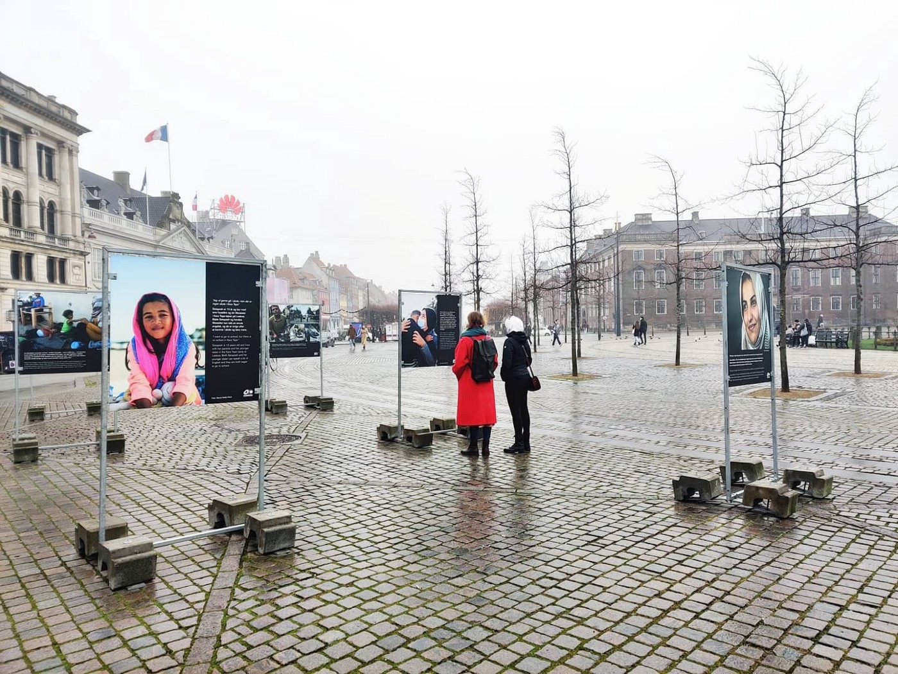
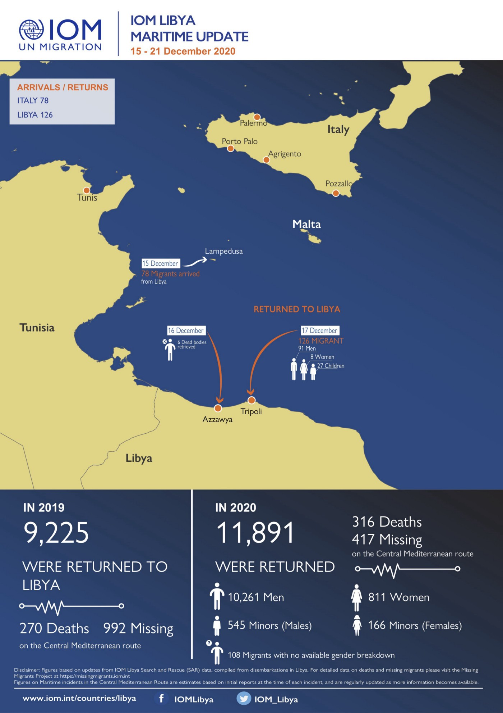
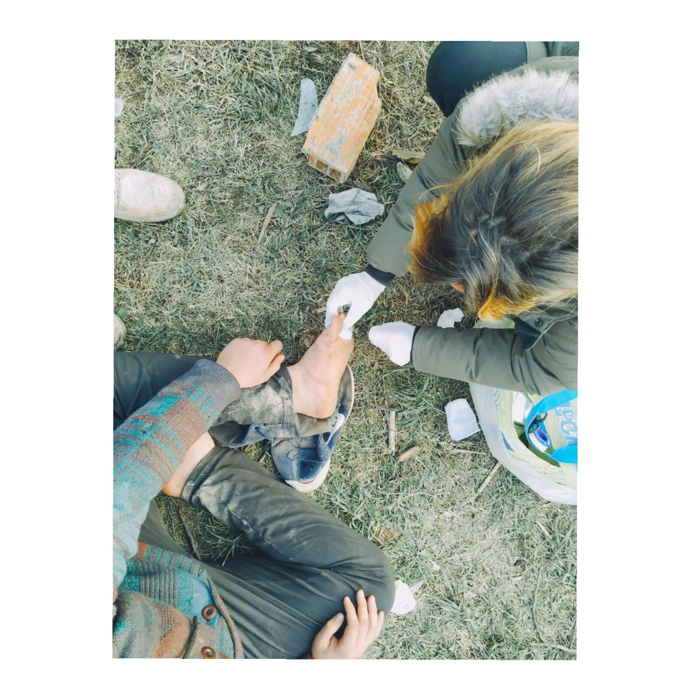

### AYS Daily Digest 21/12/2020 — Greece Deports EU National for His Political Beliefs Amid Countrywide Crackdown
### Ocean Viking finally released//Evidence of torture in pushback from Kalymnos revealed//Updates from Šid

[Are You Syrious?](?source=post_page-----ef37508c65c3--------------------------------)

[Dec 22](ays-daily-digest-21-12-2020-greece-deports-eu-national-for-his-political-beliefs-amid-countrywide-ef37508c65c3?source=post_page-----ef37508c65c3--------------------------------) · 7 min read

### FEATURE
### Greece deports EU national because of his political beliefs amid countrywide crackdown on protests

A French citizen who lived in Greece for eight years was arrested while walking in Exarchia for allegedly “spreading the virus\.” After several days in detention, he was deported because his political beliefs and anarchist activism make him a “ [threat to national and political security](https://www.efsyn.gr/politiki/273872_apelasan-gallo-politi-epeidi-einai-anarhikos) \.” The man, identified as Erol, was kept in solitary confinement, denied communication and denied his legal rights before his deportation\.

Erol was arrested on December 6th, the anniversary of Alexandros Grigoropoulos’s murder, amid a widespread police crackdown on people trying to commemorate the teenager’s death\. For months, activists and journalists in Greece have been warning about the government’s use of coronavirus measures [as an excuse to ban protest](https://www.aljazeera.com/news/2020/12/21/disturbing-precedent-activists-decry-protest-ban-in-greece?fbclid=IwAR01hZYMO4YkAhGOApR88fUe78DaR5Q5QpuaamsCPJOjgcmFXvufmG_o48U) \. In July, the government passed a law that allowed it to restrict protests if they are a threat to public safety and hold protest organizers liable for any damages\. Since then, these special powers have been deployed to crack down on people commemorating the victims of the 1973 anti\-junta revolt, women marking the Day of Elimination of Violence Against Women and more\. Enforcement is applied arbitrarily and targets left\-wing activists\.

Erol’s arrest and deportation are troubling by themselves, but set a dangerous precedent when combined with the recent crackdown on NGOs helping people on the move\. Even though the allegations of trafficking against NGOs are blatantly false, the government still has rules in place that allows it to dismiss nonprofit workers and volunteers “ [based on their ‘character\.’ “](https://twitter.com/maledictus/status/1341052596136669184?fbclid=IwAR1W7ifXNocSns4Eq1QLIR8SqJ4tHqQTmZJirqW6aSiP0bmqL5TiyrLsBHw) They could just as easily deport nonprofit workers for threatening public health and security, or some other trumped\-up charge\. Additionally, how will the Greek government treat its critics that do not have the benefit of an EU passport, now that the precedent for using deportation to get rid of thorny political opponents has been established even further?
### LIBYA
### IOM Libya maritime update

### SEA
### Ocean Viking finally released

SOS Mediterranee’s rescue ship _Ocean Viking_ was [finally released today](https://twitter.com/SOSMedIntl/status/1341067502512721921?s=19&fbclid=IwAR3dk5BGxOoVl8RA6n7Wo4x3v6evEI8omCUqYFQ1eOF0TTeGpS5bRwf6Ef8) after five months in expensive administrative detention at the hands of the Italian Coast Guard\. The crew expects to resume rescue operations in early 2021\.

SOS Mediterranee’s Operations Director Frederic Penard said, “Today marks the end of a lengthy, costly & difficult race against time\. Our teams have worked day and night over the past five months so that the ship could set sail and save lives again\. Meanwhile, hundreds of people died at sea\.”

Five other NGO rescue ships are stuck in administrative blockages as people continue to die at sea because no other authorities are stepping up to conduct rescues\.

Some good news: a group of 110 people that contacted AlarmPhone in distress [landed safely](https://www.facebook.com/watchthemed.alarmphone/posts/2847231028884455) in the Italian town of Locri\.
### GREECE
### Evidence of torture in December 5th pushback

New details have come out about the December 5th pushback from Kalymnos that Aegean Boat Report called “ [the most violent pushback Aegean Boat Report have documented so far\.](https://www.facebook.com/AegeanBoatReport/posts/995561264300311) ”

On December 10th, [ABR published a report](https://www.facebook.com/AegeanBoatReport/posts/988631451659959) about 28 people who were forced onto lifeboats and set adrift after landing on the island of Kalymnos\. Strangely, the first two lifeboats rescued by the Turkish Coast Guard contained only women and children, while the men were rescued two days later\.

Now, the Turkish Coast Guard has confirmed a witness’s account that the men were beaten for refusing to go on a lifeboat\. For two days, the Greek Coast Guard held the men in a National Guard camp, deprived them of food and water, and beat them so badly that many suffered [broken bones, skull fractures](https://twitter.com/VassilisTsarnas/status/1341023278949937152?fbclid=IwAR3CLM_AbgqX13cvMOYREqTCJK12tbdUjgw_2yfSi5EqljasNELaRrqPwvo) and other bad injuries\. Then, they were forced onto lifeboats and pushed back towards Turkey\.
### Updates from Lesvos

Moria 2\.0 is not a place fit for anyone to live in, and especially not children\. Doctors confirmed that the three\-year\-old child taken to hospital last week was raped so badly that [she required stitches](https://www.infomigrants.net/en/post/29226/doctors-confirm-rape-of-3-year-old-girl-at-kara-tepe-migrant-camp?fbclid=IwAR2vNseCyYJt0cNS7p-sGfqneK76KfPE21kBh2qd0l7hsWcZ005B08Y_Drg) , and countless others suffer from sexual violence in the camp\. Doctors have also started to [treat babies for rat bites](https://www.infomigrants.net/en/post/29223/babies-in-lesbos-migrant-camp-suffer-rat-bites-german-minister?fbclid=IwAR24NlJPIeTy2MEKbCnkBF9_LUclhYiZp-qd6Bg5Sz_c3Vc1iIyQMxIJpmk) in the camp\.

Despite these awful conditions, it is important not to minimize the resilience and agency of the people living in the camp, who are helping each other as the government and international community turn their backs\. [This article](https://www.thelocal.at/20201221/in-photos-everyday-resilience-in-a-lesvos-refugee-camp?fbclid=IwAR24NlJPIeTy2MEKbCnkBF9_LUclhYiZp-qd6Bg5Sz_c3Vc1iIyQMxIJpmk) emphasizes the way residents have adapted to life in the camp, from organizing their own food distribution programs, making their own fishing rods and more\.

Also on Lesvos, our friend Eric Maddox from Latitude Adjustment Podcast is launching a podcast academy\. Learn more about it [here](https://www.facebook.com/latitudeadjustmentpodcast/posts/781930575739282) \.

UNHCR have published their monthly fact sheet on Greece, which you can read [here](https://reliefweb.int/report/greece/unhcr-greece-factsheet-november-2020?fbclid=IwAR2aYWDQk5Eazd6Ayq7DlmEqWpCmdrNURINHBPtzKSbQXOxMcqKzfcNOpTk) \.
### SERBIA
### Updates from No Name Kitchen in Šid

> _There, many boys have blisters, small wounds on the skin, bigger wounds that become infected, sore throats, muscle aches, allergic reactions, skin rashes, toothaches, among other symptoms\. In one of our locations I see Saddam\. He limps a lot, but he doesn’t complain\. Never\. \[…\]_ 

> _Every day there is a different story to tell\. Many wounds that we see improve thanks to all the resources that reach us\. There are many others of which we do not get to see the evolution because the boys leave\. However, we would like to think that although what we are putting are small bandages, they are absolutely necessary\._ 

> _Thank you for supporting Health on the Move, essential to make the lives of so many people a little less painful\._ 

Read the full testimony on [No Name Kitchen](https://www.facebook.com/NoNameKitchenBelgrade/) ’s Facebook page\.
### SPAIN
### Salvamento Maritimo rescues 39 people

The Spanish search and rescue agency Salvamento Maritimo has [rescued 39 people](https://www.lavanguardia.com/vida/20201221/6139950/rescatados-39-inmigrantes-patera-cerca-isla-alboran.html?fbclid=IwAR1OtVEx8SpTgioZqGeOE6xmRSa3jK4ego63BJDESHmlLuMk9FrTbccBfa8) from a patera off the coast of Alboran\. The patera was first found by a fishing boat and information from an NGO was crucial in the rescue\.
### GERMANY
### Officers of the German Federal Police involved in pushbacks

In a letter from Frontex chief Leggeri to the EU Commission, it was confirmed that [members of the German Federal Police were involved](https://mare-liberum.org/en/news/germany-on-the-frontline-of-pushbacks/?fbclid=IwAR2gR0MG8DXIIGJZQyJ6c3w7lCOTUDSsHjFI70LXlUw692DfjDMS9S2n4KY) in a pushback on August 10th\. The officers aboard the Federal Police ship BP62 “Uckermark” discovered a group of people on an overcrowded dinghy, then stopped them from reaching the shore so that the Greek authorities could catch them\. Although the Germans claim that they could not possibly know what happened to the people on the dinghy \(in an email, the Greek authorities ludicrously claimed that the people decided to change course towards Turkey all by themselves\), by August, the nature of pushbacks in the Aegean was perfectly clear to anyone in the know\.
### DENMARK
### Asylum system discriminates against women

The Danish asylum and integration system [discriminates against women](http://refugees.dk/en/focus/2020/december/the-danish-asylum-and-integration-systems-discriminate-against-women-from-start-to-finish/?fbclid=IwAR3eKOCTAZREcN-xsWrvb7eeJHnKZOWq-sBs0YocP4xeBYCA-36ASjrAPjU) in multiple ways that prevent them from integrating into Danish society and receiving asylum\. As many as 81% of women in asylum centers do not have access to education, including Danish language training, because there is no childcare provided\. The criteria for receiving asylum also discriminate against women and do not take into account gender\-based violence, such as forced marriages or trafficking\. By default, the Danish system forces women into the role of housewives because it does not give them access to the resources necessary to find jobs or enter school, and then authorities blame the women or their culture for these gender disparities\.
### ESTONIA
### Asylum applications down by 50%

Asylum applications to the Baltic nation [halved in 2020](https://news.err.ee/1214830/asylum-applications-in-2020-nearly-half-that-of-previous-year) — only 59 people applied for asylum\. Most asylum applications in Estonia come from other former Soviet nations\. However, even with the low number of asylum applicants, the Estonian government approved less than half\.
### UK
### Two convicted for deaths of 39 people last year

Two men were found [guilty of manslaughter](https://www.theguardian.com/uk-news/2020/dec/21/essex-lorry-trial-two-found-guilty-over-deaths-of-39-vietnamese-people?fbclid=IwAR1-TNeR7WLixxSunWdJ4Hv-41rNfmus_UQv0woNsYrLA7NRyu-6KnIJ5JY) and other counts for their involvement in the deaths of 39 people last year, who suffocated while trying to reach the UK in a truck\. Two other drivers were found guilty of conspiring to smuggle people\. They were involved in other operations before the fatal one in October of 2019, where almost 40 people died because the ringleader knowingly trafficked them in unsafe conditions\.

These convictions cannot bring back the lives we tragically lost, but can hopefully provide some justice to their families\.
### WORTH READING

The Local published its [European\-wide series](https://www.thelocal.com/20201126/introducing-changing-the-narrative-a-new-series-and-approach-to-migration-reporting?fbclid=IwAR1LUT5zMdGcsbr7v38yjSv10_UGsrtXgO7vNZJhAACR3RVmXDaEMkF_UkI) to reframe the way the media talks about migration and people on the move through solutions\-based journalism\.

[This article](https://www.euronews.com/2020/12/18/how-violence-and-vigilantes-are-compounding-the-winter-woes-of-migrants-in-the-balkans?fbclid=IwAR2aYWDQk5Eazd6Ayq7DlmEqWpCmdrNURINHBPtzKSbQXOxMcqKzfcNOpTk) provides a good overview on the current situation in the Western Balkans\.

**Find daily updates and special reports on our [Medium page](https://medium.com/are-you-syrious) \.**

**If you wish to contribute, either by writing a report or a story, or by joining the info gathering team, please let us know\.**

**We strive to echo correct news from the ground through collaboration and fairness\. Every effort has been made to credit organisations and individuals with regard to the supply of information, video, and photo material \(in cases where the source wanted to be accredited\) \. Please notify us regarding corrections\.**

**If there’s anything you want to share or comment, contact us through Facebook, Twitter or write to: areyousyrious@gmail\.com**

_Converted [Medium Post](https://medium.com/are-you-syrious/ays-daily-digest-21-12-2020-greece-deports-eu-national-for-his-political-beliefs-amid-6fb248f8f0d3) by [ZMediumToMarkdown](https://github.com/ZhgChgLi/ZMediumToMarkdown)._
