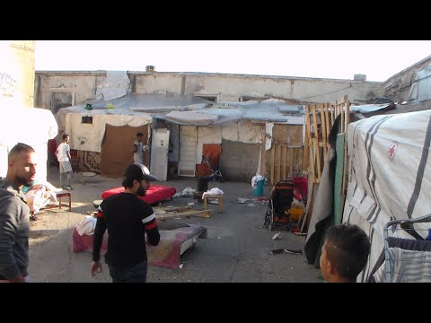
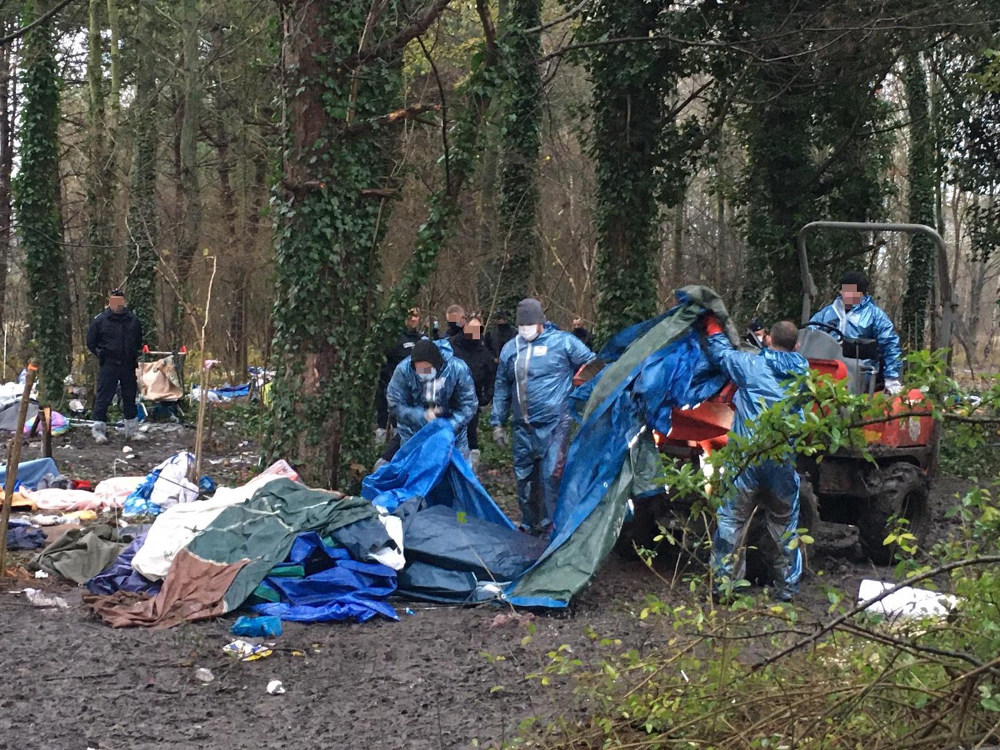
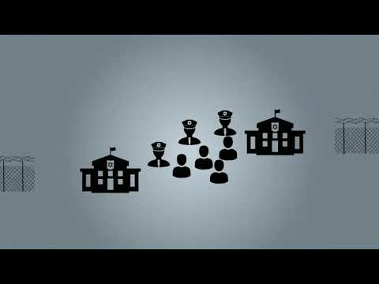

### AYS Daily Digest 22/12/20 Over 10,000 people arrived to Canary Islands since Nov\. 1st

_Mental health crisis on Greek islands in numbers // update on police conduct on French\-Italian border // update on Italian new decrees and pushbacks // and more…_

](assets/b1c5f524175e/1*t3TO1J-67x-WNwgAqlmGeQ.jpeg)

Arrivals in November\. Photo by [QUIQUE CURBELO/EPA](https://www.thetimes.co.uk/article/migrant-surge-stretches-canary-islands-t9ftpjnps)
### FEATURE: Over 10,000 people have arrived on the Canary Islands in November and December so far

From January — October this year, 11,400 people arrived on the Canary Islands, adding up to a total of 21,452 people so far in 2020\. This is an 889\.5% increase from the previous fiscal year of 2019\. According to [Spanish media](https://autonomico.elconfidencialdigital.com/articulo/canarias/mas-10000-inmigrantes-han-llegado-canarias-ultimo-mes-medio/20201221162400062773.html?fbclid=IwAR2pTWKnamCMza30gib64Q68NNMuIDwDcjTf0KHhDjetuje0p-Rm3UAXOEA) ECA:

> “The Interior has relocated more than 2,000 immigrants to the Peninsula, specifically, to Andalusia and the Valencian Community\. In the Canary Islands, a new camp has been opened for these people with at least 300 places\. It is the second operational camp that has been erected in Gran Canaria as a result of the increase in immigrants\. Many of the immigrants are staying in hotels and tourist apartments on the island\. With these new camps promoted by the new reception plan of the Ministry of Inclusion, Security and Migrations, it is expected to be able to empty these facilities that began to be used temporarily in the absence of tourists due to Covid\.” 

#### SEA

#### GREECE
### Mental Health Emergency on the islands

The International Rescue Committee’s report last week showed that since March this year, displaced people on the Greek islands experiencing psychotic symptoms increased by 71% and people self\-harming increased by 66%\. [The Guardian](https://www.theguardian.com/global-development/2020/dec/22/a-mental-health-emergency-no-end-to-trauma-for-refugees-on-lesbos?fbclid=IwAR0pcYqHn9K1Bj9fXzICAKqhpFEhAgx913I0kx9qrGVaH2K18-_tGeZejmQ) further reported that:

> “Anna Schlegel, who started Medical Volunteers International’s programme working with children on Lesbos, says emotional instability is common among the children they treat\. ‘They will get either very aggressive or sad from one minute to the next\. Among our 32 child patients, issues also include bedwetting, stuttering and sleepwalking\.’ 

> ‘Children \[have\] also started using self\-harm to get rid of tension and the overwhelming emotions they face through the retraumatisation,’ says Schlegel, adding that the Moria fire on 8 September still weighed heavily on some children\. ‘One boy we have in our group was always focused on fire\. If he’d see a building, he would focus on it and ask how it would look if it was burning down\.’” 

](assets/b1c5f524175e/1*xuvtybLfqI4jNfE-o0TOcQ.png)

“The European Commission will allocate 25 million euros to Greece under the Emergency Support Instrument to support medical services in migrant reception facilities on the Greek mainland and on the islands, it said on Tuesday…The funding will reinforce the medical infrastructure in the reception centres and support public hospitals in host communities in Greece which facing increased demand due to the coronavirus pandemic\.” Photo by [AMNA Greece](https://www.amna.gr/en/article/515541/EU-approves-more-funding-to-support-medical-services-at-reception-facilities-in-Greece)
### 11,000 to face homelessness this winter due to the global pandemic

Choose Love and 73 other organizations have signed a statement regarding homelessness in Greece this winter in relation to the pandemic\. Read it in full [here](https://helprefugees.org/news/destitution-in-greece/?fbclid=IwAR0-jmwpZCATiZtjQNaG71JOEyVsLdMO3wHVDfkfPXd4QliPWEueOu7chl0) \.

> “Around 11,000 people who were granted asylum were notified amidst a global pandemic that they were going to face forced exits from apartments for vulnerable people \(ESTIA\), hotel rooms under the Temporary Shelter and Protection program \(FILOXENIA\), accommodation in camps on the islands and on the mainland\. These forced exits follow a government policy where refugees are forced to ‘stand on their own feet and fend for themselves’ within one month after protection status is granted, resulting in an end to accommodation, access to food support, and EU funded cash assistance\. 

> The EU\-funded HELIOS Integration Support program has enrolled 22,980 refugees, but so far only 9,203 people have been able to access rental subsidies\. For a great number of people it will not be possible or feasible to receive HELIOS support\. Many refugees have been unable to access social rights such as a social security number \(PAAYPA\), a tax number \(AFM\) or a bank account, necessary to get a job or rent an apartment, because of bureaucratic obstacles, language barriers and discrimination\. The HELIOS program provides a good start but cannot substitute a comprehensive integration strategy that takes into account that integration efforts need to start from the reception stage\.” 

#### ITALY

A new security degree was passed on Friday that modifies some decrees written into law under former Italian Interior Minister Matteo Salvini\. InfoMigrants outlines some of the changes: \(read the longer list [here](https://www.infomigrants.net/en/post/29254/new-security-decree-passes-in-italian-senate-amid-tensions?fbclid=IwAR3qjDYRCfpSXYRfwzs0l_DlW5SAwTOiSHsDPX4mz_kCWWvZ8LD3nFoZhX8) \)
- “Migrants in Italy with permits for humanitarian reasons will be allowed to have their permits converted to allow them to seek employment\.”
- “Under the new law, the interior ministry will hold on to its power to bar ships carrying migrants from entering Italian territorial waters\. This was already included in the second Salvini decree, but under its new terms it means that the interior ministry would not interfere if the ship immediately informed authorities of the rescue operations\.”
- “LGBTQ\+ right: foreigners who risk political persecution, torture, or risks due to their race, sex, religion, ‘’sexual orientation or gender identity’’ cannot be pushed back\. They will be able to request a permit on humanitarian grounds\.”

![**Update on Italian\-French border from last week\. Kesha Niya provides a very comprehensive and long overview\. Read it in full here but for now here is an excerpt:** “It is official now: The procedure which French police has been following during the last years has been declared illegal\. Since migration flows started to go trough Italy to France, the usual way to reject people by means of the French border police was to stop them from entering France, take them on the French side in trains, in the mountains or on the streets of the cities until 30 km after the border \(Menton, Monaco, Nice,…\) Then they are put in a “container” over night or for several hours during the day and finally sent back to Italy with the “refus d’entrée” \(a paper just saying that entry is denied to this person\) \. **The Conseil d’Etat, the highest court in France, now decided on the 27th of November that this in fact is not following European laws, as the concerned border is an internal border of the Schengen countries, not external\. This means that preventing people from crossing through this procedure \(handing out a refus d’entrée without any further communication or the possibility to ask for asylum\) has no legal ground, and never had\.** Since this day, we expected changes to appear in the way state forces are working and reacting — they did not\. We started to collect photos of the “refus d’entrée” that people got since the court decided over the illegal status of these documents\. They have not decreased or changed, and neither has the controls of people on their way\. We are keeping track of this treatment, so that there will be proves for a legal action against the French border police in the future\.” Photo by [Kesha Niya](https://www.facebook.com/KeshaNiyaProject/posts/1410941182584078)](assets/b1c5f524175e/1*M49pMI4vhGGzAlK7O9sWJw.jpeg)

**Update on Italian\-French border from last week\. Kesha Niya provides a very comprehensive and long overview\. Read it in full here but for now here is an excerpt:** “It is official now: The procedure which French police has been following during the last years has been declared illegal\. Since migration flows started to go trough Italy to France, the usual way to reject people by means of the French border police was to stop them from entering France, take them on the French side in trains, in the mountains or on the streets of the cities until 30 km after the border \(Menton, Monaco, Nice,…\) Then they are put in a “container” over night or for several hours during the day and finally sent back to Italy with the “refus d’entrée” \(a paper just saying that entry is denied to this person\) \. **The Conseil d’Etat, the highest court in France, now decided on the 27th of November that this in fact is not following European laws, as the concerned border is an internal border of the Schengen countries, not external\. This means that preventing people from crossing through this procedure \(handing out a refus d’entrée without any further communication or the possibility to ask for asylum\) has no legal ground, and never had\.** Since this day, we expected changes to appear in the way state forces are working and reacting — they did not\. We started to collect photos of the “refus d’entrée” that people got since the court decided over the illegal status of these documents\. They have not decreased or changed, and neither has the controls of people on their way\. We are keeping track of this treatment, so that there will be proves for a legal action against the French border police in the future\.” Photo by [Kesha Niya](https://www.facebook.com/KeshaNiyaProject/posts/1410941182584078)
#### GERMANY

In new reporting from der Spiegel, there is an internal document suggesting that German Interior Minister Horst Seehofer concealed knowledge of Greek border guards conducting pushbacks on the Mediterranean\. The knowledge concerns this series of events:

> “On behalf of the EU border protection agency Frontex, the German forces patrolled the Aegean Sea on August 10, just a few hundred meters from the Greek island of Samos\. They discovered a rubber dinghy with 40 refugees on board\. They stopped it as ordered, but they did not take the people on board the completely overcrowded boat\. Instead, they waited more than half an hour for the Greek coast guard to take over the inflatable boat\. 

> A little later, the refugees suddenly found themselves in Turkish waters\. This is how it is described by internal documents from the EU border protection agency Frontex, which SPIEGEL has received\. The Turkish coast guard later had to rescue the 40 migrants\. Photos show men, women and small children on the overcrowded rubber dinghy\. Apparently, the people were illegally pushed back by the Greek border guards\.” 

Social Democrats’ human rights spokesman, Frank Schwabe said “The Ministry of the Interior seems to be making itself an accomplice to the Greeks\.” Read the full report [here](https://www.spiegel.de/politik/ausland/frontex-skandal-horst-seehofer-deckte-offenbar-griechische-verbrechen-a-bd062e3f-e016-4f43-98a1-98cfe9757529?fbclid=IwAR2JmRcKQ80hJkaMvqYUUFNjWnNbj63C_nThwoUSlmdpxhEgPQzh8sBf-EA) \.
#### FRANCE

 , photos by Mobile Refugee Support](assets/b1c5f524175e/1*c2kzh-xbh30IYyvW3eyjdQ.jpeg)

“Today at Grande Synthe **the 83rd forced eviction of 2020** took place: **around 100 tents destroyed** \. These evictions cannot be dissociated from police violence: they participate in the exhaustion \+ the physical & moral harassment that people suffer at the border\.” Info by [Human Rights Observers](https://twitter.com/HumanRightsObs/status/1341134260607070212) , photos by Mobile Refugee Support

News about the decision to close the border from France to the UK, due to a more threatening mutation of COVID\-19:
- “Britain and France reopened their border to some travelers on Tuesday and inched closer to a deal that would allow freight trucks to resume moving between the two countries, raising hopes of relief for hundreds of drivers stuck near British ports and for supermarkets warning that they could soon run short of fruit and vegetables\.” More [here](https://www.nytimes.com/live/2020/12/22/world/covid-19-coronavirus?auth=login-email&fbclid=IwAR1dc4hOHBj4kFLRsj2u828Mlw5AoxctSAgWJQbEeIQePHiiNAvXU24WmNA&login=email&smid=tw-nytimes&smtyp=cur) \.
- The Border Force director is worried that more people will try to cross the English channel on lorries due to the border closing\. “Lorries and other vehicles have long been the dominant method for migrants attempting clandestine crossings over the Channel\. Officials believe the rocketing number of small boat crossings this year was partly caused by the drop in lorry traffic during coronavirus\.” More [here](https://www.independent.co.uk/news/uk/home-news/france-border-closed-lorries-migrants-b1777314.html?fbclid=IwAR35OAdO5bPjqp5sM02eK4NAGiom-B4oytC90h9FL0IwImF5GQ3XScBUN04) \.

#### EU

#### WORTH READING
- [Politics\.co\.uk](https://www.politics.co.uk/comment-analysis/2020/12/22/migration-the-missing-media-voice?fbclid=IwAR0dWGLkl-zMfmfOHUCWQEwPOfa_Tu9LUYw_T3Y8H3vyJFNI6Z33bK9rmPY) just published **Migration: The missing media voice\.** “ _In a society where two\-thirds of migrants say that media and political discourse has an impact on their sense of belonging, it’s important that the media landscape is constantly scrutinised, including the question of who gets to speak_ \.”
- [Crisis Mag](https://crisismag.net/2020/12/22/the-marble-life-a-year-of-limbo-on-lesvos/?fbclid=IwAR0-jmwpZCATiZtjQNaG71JOEyVsLdMO3wHVDfkfPXd4QliPWEueOu7chl0) just published **The Marble Life: a Year of Limbo on Lesvos** \. A refugee woman describes her journey of a year\.

**Find daily updates and special reports on our [Medium page](https://medium.com/are-you-syrious) \.**

**If you wish to contribute, either by writing a report or a story, or by joining the info gathering team, please let us know\.**

**We strive to echo correct news from the ground through collaboration and fairness\. Every effort has been made to credit organisations and individuals with regard to the supply of information, video, and photo material \(in cases where the source wanted to be accredited\) \. Please notify us regarding corrections\.**

**If there’s anything you want to share or comment, contact us through Facebook, Twitter or write to: areyousyrious@gmail\.com**

_Converted [Medium Post](https://medium.com/are-you-syrious/ays-daily-digest-22-12-20-over-10-000-people-arrived-to-canary-islands-since-nov-1st-b1c5f524175e) by [ZMediumToMarkdown](https://github.com/ZhgChgLi/ZMediumToMarkdown)._
