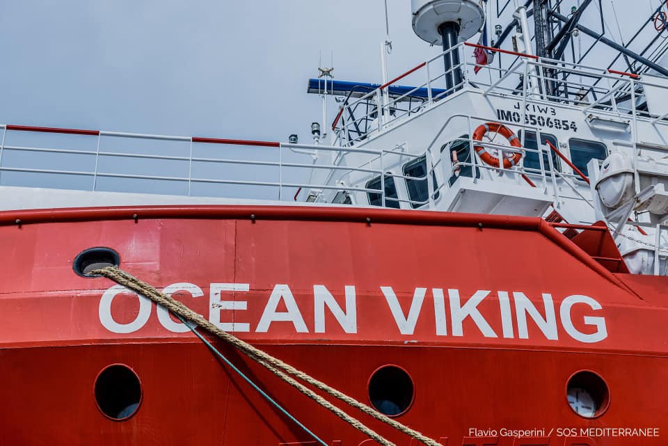
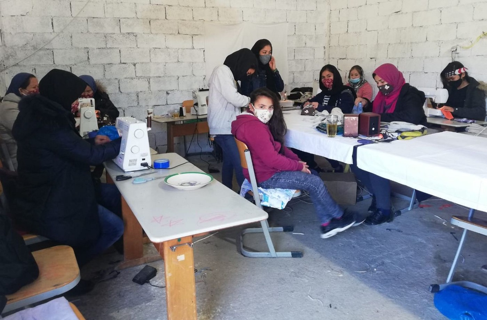

### AYS Daily Digest 23/12/20: Fire and evictions at the Bosnian camp of Lipa
#### Ocean Viking back at sea / 2 young people die in Italy / Field reports from Calais / Returned to Afghanistan \- ruins, insecurity, and hardship / Solidarity grassroots initiatives, and more…

](assets/7219e359af5a/1*JmTndyWA7BzzSgmHNTA79w.jpeg)

Lipa fire — photo credit [Klix and SOS Balkanroute](https://www.facebook.com/SOSBalkanroute/posts/408259797280266)
#### FEATURED — Eviction and a fire breaks out at the Lipa refugee camp

The camp was due to close as it hosted people in inhumane and squalid conditions\. However, the eviction has not been coordinated with the appropriate re\-location of the people who lived at Lipa, leaving 1000\+ people homeless, without any provisional solution from the international organisations who have been given the mandate to run camps across the country\.

[**LIPA CAMP FIRE: A CHRONOLOGY OF THE CATASTROPHE — see video**](https://fb.watch/2Aov0JzV5_/)

Following months of sub\-human conditions at the Lipa camp in the Una\-Sana Canton in Bosnia and Herzegovina, near the Croatian border, things took a foreseeably ugly turn\. Here is the hour\-to\-hour account of everything that went wrong last night and today, resulting in over a thousand new homeless migrants in the area\.

Yesterday around 4 pm, IOM staff tried to move 46 people in three vans from Lipa camp to the old, hard\-structure Bira camp in the nearby city of Bihać that was cleared out a few months ago following pressure from local authorities\. When the IOM vans arrived at the gate of Bira ex\-factory\-turned\-camp in Bihać, a group of 50 locals and police officers intercepted them, blocking the entrance to Bira, so the people had to be returned to the Lipa\. Thirty minutes later, the municipality sent a firefighter brigade that helped block the gate of the camp\.

Following that incident, last night the IOM started informing their partners and other organisations that the long\-awaited closure of Lipa camp is set for today in the morning\. A late evening meeting was held with the key stakeholders to organise the evacuation\.

This morning around 8 am, IOM started taking people out of tents and asking them to form lines inside the camp\. Some organisations were not allowed in the camp\. It seems DRC staff were present inside, but they evacuated together with IOM after the fire broke out around 11 am\.

It is interesting to note that in Bihać, where Bira is located, at around 10 am people were already saying that Lipa would soon be burnt to the ground, and there were a lot of conflicting rumours about who might be responsible for it\. For example, anti\-migrants groups on Facebook alleged some people working at the camp in official capacity might have something to do with the fire, in an attempt to put pressure on Bihać authorities to open a local radio station Bira camp\. On the other hand, many locals are convinced that the migrants burnt down the camp themselves, in hopes of being transferred to Bira\. The head of IOM in Bosnia published on his Twitter account that a group of former Lipa residents set the camp on fire after most of the people had already been evacuated\.

When the fire broke out at 11 am, police surrounded the camp and tried to remove the people from the perimeter, but at the same time they didn’t allow them to walk towards the city of Bihać\. After an hour, special police also arrived at the site\.

Following the news of the fire, today at noon, there was a protest of locals in front of Bira camp, opposing the reinstalment of the camp inside the old factory, once again with the presence of the fire brigade that was blocking the entrance\. At 1 pm, the police and firefighters blocked the streets towards the city, obstructing the passage for 300 people who were trying to walk to Bihać\.

In the afternoon, demoralized people started putting up small makeshift tents in front of Lipa, after it had been completely burnt to the ground, with no food, water or any basic facilities\.

The central Bosnian government is now putting the pressure on cantonal and city authorities to open Bira camp, but the mayor of Bihać is refusing to, in response to pressure from the citizens who don’t want the camp in the city anymore\.

As a result of this ping\-pong, over a thousand residents of Lipa camp are left to sleep rough, with almost no support and no shelter to protect them from the winter temperatures\. This humanitarian catastrophe might be stopped by reopening Bira camp, but there seems to be no political will to do so\. We’ll keep reporting from the ground\.

Lipa camp [was to be closed on Wednesday](https://www.ksat.com/news/world/2020/12/23/fire-breaks-out-at-squalid-migrant-camp-in-bosnia/?fbclid=IwAR20MwBuR_rRWFFZXN72Oyl8v21Es8KJtSp31qGL9tXi-ksskEIs677-HzQ) and moved to another location, but officials said that since its tents and other facilities were almost entirely destroyed in the fire it cannot immediately be moved to another spot\.

It is good to remind everyone that the fact the Lipa tents were not suitable to be called accommodation or to be considered a permanent solution was obvious and known since the begining\. However, it was also obvious that a strong dialogue, lobbying, planning and a lot of work was going to be needed in order to gain trust and support from the political side in order to be able to lodge everyone who needed accommodation\. Not much was done on that part from the UN agencies, apart from last minute \(last months\) public warnings, but with their vast experience, surely they knew that occasional statements in the media would not bring about the solution\.

[The UN also called again on the Bosnian authorities](https://balkaninsight.com/2020/12/23/bosnias-troubled-lipa-camp-set-alight-on-closure-day/?fbclid=IwAR1ELGqrUvg3R1Sp8hQRyR1L12vack2-U8mTtOxK6he6NQ1Iu5cS88yE4Lk) to make available new locations, preferably outside the Una, Sana and Sarajevo Cantons, for people stranded outdoors in temperatures below freezing\. The United Nations repeated that capacities and funds for solutions were available\. However, a solution will not be easy to find\. The authorities of Bosnia’s other entity, Republika Srpska, have said they do not want any camps on RS territory, while political leaders on territory where Bosniaks predominate share the same feeling\.

For more videos documenting the fire, see [here](https://www.facebook.com/dobrodosli.dragi.imigranti/posts/3583414431712798) and [here](https://www.facebook.com/lorena.fornasir/posts/3524496164334122)
#### AFGHANISTAN
### Returned to ruins, insecurity, and hardship

Violence and worsening insecurity have caused [Afghanistan to revert back to “active conflict” status in 2018](https://www.development-today.com/archive/dt-2020/dt-9--2020/afghanistan-the-road-to-change-and-lasting-solutions?fbclid=IwAR27UgjdIfmHdYSxplExLSLQO4rIUcd8zF5cKrHgV8mt4V9-SDsjGw3nbdI) \. Last year, Afghanistan was considered to be the deadliest conflict globally\. NGOs also experienced direct attacks\. Compounding the complex challenges that Afghanistan faces, the COVID\-19 pandemic has cast a new shadow\. Joblessness and direct deportations have sparked large\-scale returns from neighbouring Iran and Pakistan\. But people find themselves returning to an economy in ruins, insecurity, and hardship\. High levels of internal conflict and climate\-induced displacement, weak public health systems, lack of basic services such as clean water and sanitation facilities and spiraling violence despite peace negotiations are factors that are aggravating an already dire situation\.

Donors committed at least $3\.3 billion for next year at the Afghanistan Conference in November\. Now is the time for these pledges to be translated into actual responses to address needs among millions of Afghans trapped in war and deep poverty, pleads Charlotte Slente, Secretary General of the Danish Refugee Council\.
### SEA

Following her release on Monday, the [Ocean Viking](https://www.facebook.com/SOSMEDITERRANEE/photos/a.827341250706518/3589526807821268/) left Sicily this morning to join Marseille\. There, we will restock and bring on board the rescue and medical teams, who will undergo a 10\-day quarantine and be tested for COVID\-19 several times before heading to the central Mediterranean\.

[AlarmPhone](https://twitter.com/alarm_phone/status/1341867885262745609) was alerted to four boats still at sea on the Canary Islands route:

~59 people, incl\. 13 women and two girls on Canaries route

~56, incl\. seven women and one child on Canaries route

~14, incl\. two women and two children adrift near [\#Almeria](https://www.facebook.com/hashtag/almeria?__eep__=6&__cft__[0]=AZWxUWJu3RkXlEFXjswMnlEkom-jd4H0mqBrEH0eUiA618fq4Tm-aT8t-fNFXhP8u-RPW5yEIu0VnXxNJxjXVbxVxu-3NRFkmkROvMS1WwqcZD2MLkn7vjJiDs1KKpGa3eNyk83SZHk6mbe5dM1yGubRD92HeeXOORnoCHtKvP19PFLB4-uUeoxqmE-IWgL1qLUudwQgzFI4-1C36Lh9QGRw&__tn__=R]-R)

~five men on the [\#Alboran](https://www.facebook.com/hashtag/alboran?__eep__=6&__cft__[0]=AZWxUWJu3RkXlEFXjswMnlEkom-jd4H0mqBrEH0eUiA618fq4Tm-aT8t-fNFXhP8u-RPW5yEIu0VnXxNJxjXVbxVxu-3NRFkmkROvMS1WwqcZD2MLkn7vjJiDs1KKpGa3eNyk83SZHk6mbe5dM1yGubRD92HeeXOORnoCHtKvP19PFLB4-uUeoxqmE-IWgL1qLUudwQgzFI4-1C36Lh9QGRw&__tn__=R]-R) route

Further, [they were notified](https://twitter.com/alarm_phone/status/1341832733409087495) of a boat with about 65 people, including children\. They fled from Libya and are in Malta SAR\. They say they’re running out of fuel and need rescue\. Authorities have been informed\. Rescue is needed immediately\!
### GREECE

[Contract workers in the Asylum Service](https://stonisi.gr/post/13840/zhtoyn-anthrwpines-synthhkes-gia-ergazomenoys-kai-prosfyges?fbclid=IwAR3xVd-GQ9MtacaqX7bFgW7znkM8Ldwaae04SRcwqwIAHDlVjkhl6olMDCk) are calling for a humane environment for workers and asylum seekers, with a special reference to the Kara Tepe camp and the changes brought about by the pandemic in relation to human rights\.

A testimony [from Kara Tepe:](https://www.facebook.com/nobordersnetwork/posts/3612351838832682)

> «Hello\. I’m 17 years old and this post is about my little brother I write it because I don’t want to lose him in such condition” 

We forward and publish a [testimony of pushbacks from Lesvos](https://l.facebook.com/l.php?u=https%3A%2F%2Fmare-liberum.org%2Fen%2Fnews%2Fpushback-from-lesvos-a-testimony%3Ffbclid%3DIwAR3v1AJpTHc5_WI1WvX_Xx2I-3M_nI-P5EEBnhSozFDxT2fjVj_3fvHIZaM&h=AT16cP-SGuOpYwvYRKoD1Pp2aM2E1mdck1Xiz7-q1enOTfVZjp54foTkntOoYeMAYCVMpVouXYbtMK1BOX37QwiJnH35q7_8ACwh2r_Ai_8pZESOX6gzAH1CyfqLU0wFsrdYhb_8OovfYMIiRmqNEvupsg5IE4B4puejUA&__tn__=R]-R&c[0]=AT1oMIrfjrOQeUOLau856YSrXCXBEhdCcZSwbbuDC5R1ks9NxwB50OGoZJEHSRgIPB4IlmnfIYXqIioWxOQiz_G7pCisNL2ue_bfmOZmiuON0sWE1XLXuPeRJ1KMk7DqcCGLRT7hxmoaG_jB6adp6etBXuucWDg4pGC---C0JhKg3fBOiFiRIs6mouJVmRwYyM6bIGuTS64dLNrf9mcsAIFRy_KZ8g) , collected by Mare Liberum:

> We spoke to people who were among the group of 24 refugees that landed at Katia in the south of Lesvos at around 1 am on 10 November\. After they reached the shore they went into hiding in the surrounding woods, because they were afraid that the Greek police would illegally push them back to Turkey\. 

Survivors claims that the people drowned after they where forced in life rafts by the Hellenic coast guard

[A boat carrying 34 people](https://www.facebook.com/AegeanBoatReport/posts/996962670826837) started out at from Sazli, Ayvacik, Turkey on 18 December at 10 pm, heading towards Lesvos north east\. Around midnight they where stopped and picked up by a vessel with ID number ΛΣ 050, identified as a Vosper Europatrol 250 Mk1 Class offshore patrol vessel of the Hellenic coast guard, stationed in Petra port on Lesvos north\.

Most of their phones, money and papers were taken from them onboard by men wearing black masks, some who resisted were brutally beaten, according to one of the people involved\. They were kept outside in front of the vessel for hours in the cold, traveling due south\.

After several unsuccessful attempts to deploy them they were transferred to a smaller vessel, from the pictures taken after they were forced onto the rafts, the boat has been identified as a Lambro 57 coastal patrol boat, the same type used by the Hellenic coast guard\.

credits: SBM Lesvos

A positive statement f [rom Stand By Me Lesvos, from the field](https://www.facebook.com/SBMLesvos/posts/788219551771069) :

Our old Lyceum place in Moria is now being used as sewing factory for masks and cotton bags daily done by this team of sewing ladies\. Also we use it as a new home for the abandoned cats of Moria\. Now almost 60 of them found a refuge here\. Every morning before starting service for the camp residents the [\#FreeBus](https://www.facebook.com/hashtag/freebus?__eep__=6&__cft__[0]=AZWUmyV_tHH0sbFoG7vSoTtq_0sfqD7ZrhQujgsiwxV8wP5sLqeZVNu1rBIVgCIKDFLxrHLjjB-sJnSJbWmDspIgkV3rIgTVZmZlB8On2jNkDOdzVfH_0L5eae4351oSYxnkNnB-8iZBO7c4WQIkMkoSOo8W7x1EyM6AF12FLzGHuuBJBHmviB9IJxQUhRrZ2Uk&__tn__=R]-R) brings the women here and picks them up again in the afternoon\.
#### EU and FRONTEX

A new report by a group of organisations and activists for [Migration Control](https://twitter.com/MigControl/status/1341727480747581440) provides timely and much needed background on Frontex, currently in the spotlight for grave Human Rights violations, while undergoing its biggest expansion since its launch in 2004\.

> While Frontex is preparing for violence at the external borders, it is also consolidating new powers concerning action within the Schengen area\. The agency’s role was initially strictly limited to activities at the external borders and with, or in, non\-EU states\. In recent years, law\-makers have expanded its remit to include certain activities within the Schengen area as well, although Frontex was ahead of the game — it has been assisting with the analysis of internal migratory movements since at least 2014\. 

Read the whole report [here](https://migration-control.info/en/wiki/frontex/?fbclid=IwAR2fVkOJHD3kOv3OuOCy49tBBxENdENnnf1dIv5mBK2QXnkeGI5cDLNF1C8) \.

Following up on the Black Book of Pushbacks published a few days ago, Border Violence Monitoring Network’s spokesperson Hope Barker has published the [following op\-ed](https://www.socialeurope.eu/border-pushbacks-its-time-for-impunity-to-end?fbclid=IwAR1h7kOKOMBURoMtykamdJ11iUXqBSYwqhqLelhq70B15ftz9fsTFfJqVxc) , summarising the findings and requesting to see put in place

> [_genuinely_ independent monitoring mechanisms](https://youtu.be/wd3urbZdYe4) led by [national preventive mechanisms](https://www.ohchr.org/en/hrbodies/opcat/pages/nationalpreventivemechanisms.aspx) and independent NGOs, funded by the commission or through an independent agency\. These must include unannounced visits to border zones and police stations, enhanced cross\-border collaboration in testimony collection and an alarm system which could be triggered by potential asylum\-seekers in situations where their fundamental rights are violated\. Perpetrators of these violations must be held accountable, impunity must end and pushbacks must be stopped\. 

### ITALY
### Two lives lost

In Quiliano \(Liguria\), a [train hit a group of p](https://genova.repubblica.it/cronaca/2020/12/23/news/quliano_un_treno_investe_un_gruppo_di_migranti_sulla_ferrovia_due_vittime-279537306/?fbclid=IwAR0EBDYX45vjfxeawkjElWMJ_GLIRN9fs8acpBBRiy-SiNABsUeyTbXJBrA) eople on the tracks, killing two\. The group was headed toward Ventimiglia, to cross the French border, and was perhaps walking along the tracks not to lose their way\.
### FRANCE

](assets/7219e359af5a/1*pVsRrhAhakU6iu3nmW0UYA.jpeg)

“Jungle” Dunkirk in France — for more documenting photos, see [here](https://www.facebook.com/lagkadikia.camp.12/posts/402464857633579)

We’re re\-posting a statement from a [Utopia 56 volunteer](https://www.facebook.com/258099198180444/posts/695693637754329/?app=fbl) from the Calais area:

> I was in the field on Friday, December 11th with my team as part of a shelter party\. 

> That night I went home with a lot of anger and misunderstandings\. 

> To set the context, it was around 9 pm when I meet a person around the Calais police station\. This person doesn’t call me or my coworkers and looks like they know where to go\. 

> Later that evening, it’s already midnight I’m accompanying two minors to the police station, protocol so they can benefit from shelter at the house of the young refugee of Saint Omer\. 

> A taxi is called for these two people, so they can join this home\. 

> Since we have to wait outside for this taxi, because no one gets into the police station, my colleague and I notice a silhouette sitting a meter from us in front of the post\. 

> Introducing myself to him, who looks like a half\-sleepy young man, and in return asks him if he’s okay\. 

> Failing to understand each other, I call a translator and through this translation, the young man tells me he’s cold, tired, new to Calais and sat below the ′′National Police′′ sign hoping to get some help\. 

> I ask him then his date of birth and it is with sadness that I learn that he is only 16 years old\. 

> He’s been telling me he’s been sitting in front of the post for 3 hours\. 

> The protocol is clear, however, that the police should protect minors\. 

> For almost 4 hours, a 16\-year\-old sat in front of the police station, waiting for help, without any police officer giving him a single look, one word\. No compliance with protocol, no care, no empathy\. 

> After an exchange with the police officer, explaining the situation to him, he replies naturally to me that “If we are not asked, we cannot know there is a need”\. 

> Thank you for this not caring, police officers, and again thank you for delegating your work to us, because obviously this one is not done correctly at all\. “Protect and serve” then loses all its meaning\. 

> After a call with the home, made by ourselves, the young person was finally able to go rest at home and receive care, which I remind you is an obligation to the minors encountered\. 

Calais [has seen 950 expulsions in 2020](https://twitter.com/HumanRight.../status/1341743025836449792) \. The policy of avoiding fixing points constitutes a violation of the rights of people in migration situation including the right to shelter and decent housing, as well as the right to be free from inhuman and degrading treatment\.
#### NORWAY AND DENMARK

In a l [etter to the government](https://norwaytoday.info/news/nearly-100-mayors-pressure-norwegian-government-to-take-in-more-refugees-from-moria-camp-in-greece/?fbclid=IwAR1pz48DOiiBBbzl77iNT8gVCiEFVkUjMNYKn0bDsQzQBSqpfWozGmmLfns) , 93 mayors want answers as to why the municipalities are not allowed to take in as many children as they want from the Moria refugee camp\. According to the newspaper Klassekampen, the mayors are asking the government to let willing municipalities receive children in need of emergency help\.

> “We have still not received a proper answer as to why we can’t receive the municipalities’ desired number of refugees\. A total of 128 municipalities have sent a clear message that we can accept far more than the 50 proposed by the government”, _the letter states\._ 

Just as we have been reporting earlier, [data from Denmark](https://cphpost.dk/?p=121455&fbclid=IwAR3eX9fS7khtBvI0leSopTcNGGHuspU7Z0eY6ZDVAWkMy9SZ5CX-OLprdu4) confirms that the number of asylum seekers has hit a historic low this year\. When the migration crisis reached its zenith in 2015, over 10,400 people applied for asylum in Denmark\. Four years later, that figure has declined substantially\. The new [Danmarks Statistik report ‘Immigrants in Denmark’](https://www.dst.dk/da/Statistik/Publikationer/VisPub?cid=29447) showed that just 761 people sought asylum in Denmark in 2019 — the lowest since the report was launched in 1997\. This should be of no surprise, as shifting Danish governments have for years attempted to discourage refugees to come, and even refused to take in UN Refugees\.
#### SEASONAL SOLIDARITY INITIATIVES

Hitting high note: A c [hoir’s message of hope](https://www.herald.ie/news/hitting-high-note-choirs-message-of-hope-for-migrants-39893472.html?fbclid=IwAR1pz48DOiiBBbzl77iNT8gVCiEFVkUjMNYKn0bDsQzQBSqpfWozGmmLfns) for migrants, with 100 members from 24 different countries

In the UK, this year thousands of people have crossed the perilous Channel strait to the [**Kent** coast](https://www.kentonline.co.uk/kent/news/my-heart-will-always-have-a-place-for-kent-people-239482/?fbclid=IwAR1ehqzjHWOEQijWOwNkEEVwHLR404waI1lw-kFwYK7wJsRtndUOuYHn3EI) , in an effort to escape war, persecution and brutality\. More than 8,000 made the death\-defying journey in 2020, after conditions in Calais and the **coronavirus pandemic** made those **seeking asylum all the more desperate to reach the safety of the UK shore\.**

Near Swansea, a [restaurant sending a Syrian\-style Christmas banquet](https://www.walesonline.co.uk/news/wales-news/restaurant-sends-incredible-syrian-style-19502709?fbclid=IwAR3rMet-91zV_dKFIkpWg53Vkn6vZ-L6e9s0tqKfjwydaq9CwXbIe09YmbY) to Penally asylum camp saw it confiscated by security guards\. Volunteers wanted to spread some Christmas cheer to the asylum seekers inside but guards ‘cruelly’ took the food away mid\-way through their meal\.

A Christmas story of everyday migrants, worth watching [here](https://www.youtube.com/watch?fbclid=IwAR0VebCmKhGCTsGyBuiKcqogtSshwIpEouMyr_-jfABMLQ55QR9bkSPT9-M&v=ei0ZrPJN_AE&feature=youtu.be&ab_channel=BethanLant) \.

In Rome, a piano in the center of the sidewalk, near the bus shelters, just outside the east exit of Tiburtina station\. Right here, where many migrants find shelter during the night, [the Baobab experience association organizes a Christmas concert different from any other](https://www.romadailynews.it/politica/stazione-tiburtina-concerto-natalizio-di-pianoforte-0539885/?fbclid=IwAR3w7NAbcZKqojh_4lNwqwB4fzAy3-6xO_VE2Dw5x6KXcxYZ6-ckBJ43DJU) : Francesco Taskayali, Italian\-Turkish pianist and composer, will play, and will bring his songs to migrants who have no home and are passing through Rome\.

> “Migrants already are invisible, and at Christmas they are even more so — comments Taskayali \- \. That the Tiburtina station and the informal migrant camps is a reality I knew little about and this struck me very much: they are people who are sleeping in the cold right next to us, in places we frequent every day, but no one seems to notice\. I have also played on quarantine ships, in hospitals, in prisons: there is so much injustice in the world, there are monstrous inequalities, but it seems that we continue not to see and to live in a bubble\. I hope my music can bring some attention to a usually dimly lit place ”\. 

#### WORTH READING
- Forced Migration current awareness, Regional Focus: Europe
[part 1](https://fm-cab.blogspot.com/2020/12/regional-focus-europe-pt-1_22.html?fbclid=IwAR2KkphBQvR2K2o7B-wRHq6qku3JZnVE3shsn_fzuLe6yQuz2wC5xc5fC9s) and [part 2](https://fm-cab.blogspot.com/2020/12/regional-focus-europe-pt-2_22.html?fbclid=IwAR2cwo3Sr_GLV3lA3_pTKlWsJLT_M6PLNgiK5ZvY2zPkf3M9s0caQSAtce8)

**Find daily updates and special reports on our [Medium page](https://medium.com/are-you-syrious) \.**

**If you wish to contribute, either by writing a report or a story, or by joining the info gathering team, please let us know\.**

**We strive to echo correct news from the ground through collaboration and fairness\. Every effort has been made to credit organisations and individuals with regard to the supply of information, video, and photo material \(in cases where the source wanted to be accredited\) \. Please notify us regarding corrections\.**

**If there’s anything you want to share or comment, contact us through Facebook, Twitter or write to: areyousyrious@gmail\.com**

_Converted [Medium Post](https://medium.com/are-you-syrious/ays-daily-digest-23-12-2020-7219e359af5a) by [ZMediumToMarkdown](https://github.com/ZhgChgLi/ZMediumToMarkdown)._
