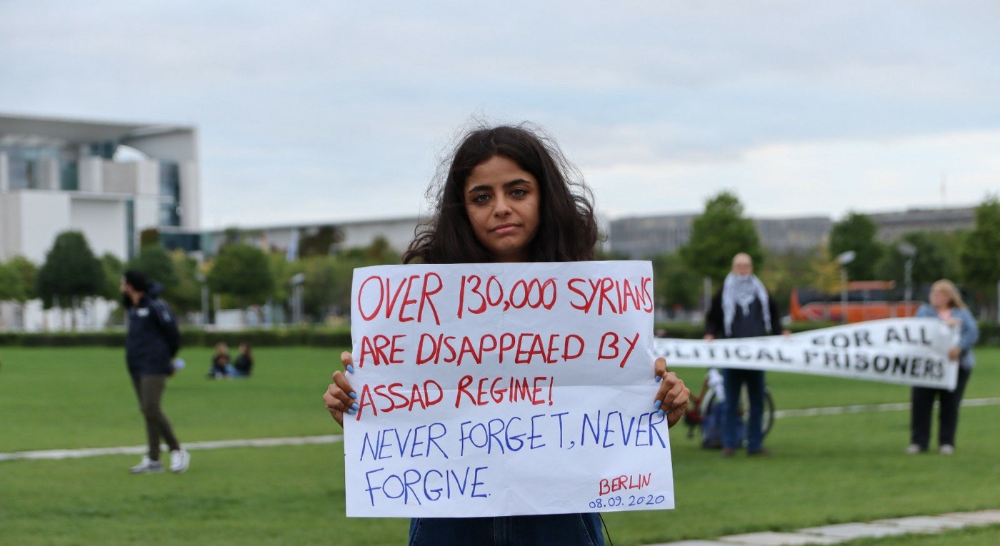
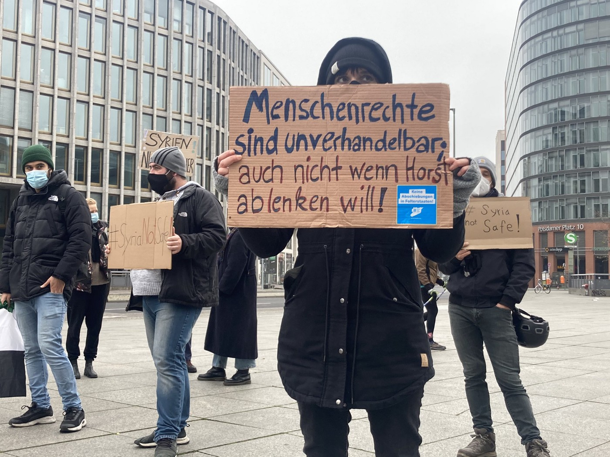
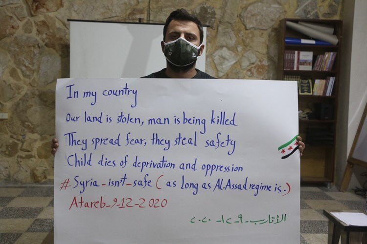

### AYS Special from Germany: Seehofer decides Syria is safe
#### A general ban on deportations to Syria from Germany will expire at the end of the year\. For now, politicians claim that “only” criminals and potential terrorists should be deported\. However, a similar statement was made four years ago when deportations to Afghanistan started\. Since then, about 900 people have been deported to the war\-torn country — only a few of them have committed any crime\.

Syrian journalist and activist Wafa Ali Mustafa, whose father is one of the forcibly disappeared people\. Copyright: SyriaNotSafe

When it comes to deportations, the German federal Minister of the Interior Horst Seehofer has a very special kind of humour\. In July 2018, he chuckled about the fact that on his 69th birthday, 69 people were deported to Afghanistan\. This year, he had a special surprise planned for international human rights day, December 10th: together with the states’ ministers of the interior, he decided not to prolong the general nation\-wide ban on deportations to Syria\.

The ban has been in effect since 2012 and renewed each year\. It rules out any potential deportations to Syria, regardless of the individual circumstances of the person in question\. This ban was derived from the European Convention on Human Rights\. Article 3 of the Convention states that

> “Nobody shall be subjected to torture or inhuman or degrading punishment or treatment\.” 

This rule is set as an absolute in the European Convention on Human Rights, and it includes the prohibition of deportations to countries where people returned might be subject to torture or degrading treatment\. With the general ban of deportations to Syria it was recognized that the country as a whole could not be regarded as safe\.

Regardless of the fact that the [German Foreign Office has published a report](https://www.auswaertiges-amt.de/de/newsroom/regierungspressekonferenz/2424520#content_0) saying that Syrians in Syria are still subject to numerous dangers from different actors — including from the regime itself — and that the humanitarian situation in Syria continues to be disastrous, various states’ interior ministers, especially from Merkel’s CDU party, have now called for an end to the general ban\. They claim that parts of the country are safe enough to start deporting people there without breaching international law\. As decided in the conference of the states’ ministers of interior on 9th to 11th of December, the ban will expire as of December 31st 2020\.

“Human rights are non\-negotiable, even if Horst wants to distract”\. Copyright: SyriaNotSafe
### What does the end of the general ban mean?

Instead of a general federal ban, from now on decisions on whether or not to deport someone will be made on a case\-by\-case basis, unless the states themselves decide to introduce a state\-wide ban \(which, as a consequence, could lead to some states deporting and others not\) \. The ministers claim that only criminal offenders and so called ‘endangerers’ \( _Gefährder_ \) — people considered at a high risk of committing crimes, especially related to terrorism — should become subject to deportation\. [The term ‘endangerer’ is not a legal term, but a term used by the police for potential terrorists](https://www.bpb.de/gesellschaft/migration/kurzdossiers/302982/gefaehrder) \. People who are labelled as an ‘endangerer’ have not necessarily committed any crimes\. The category is legitimised as a preventive measure, but in fact people are criminalised without trial for something they have not done\. It is an alarming expansion of police power, especially when taking into account the not\-so\-latent racism within the German police force\. About 90 Syrian nationals are classified as ‘endangerers’ in Germany\.

But even after the lifting of the general ban on deportation, there are still many obstacles that make it unlikely that deportations to Syria will start any time soon\. Germany has no diplomatic relations with Syria, nor is there a direct flight connecting Germany and Syria\. To start diplomatic relations would thwart sanctions that are currently in place against the Assad regime\. And even if diplomatic relations were resumed in order to start deportations of ‘endangerers’, it is still likely that courts would stop deportation on the basis of Art\. 3 ECHR\.

For the time being, the decision not to extend the ban can therefore be regarded as a symbolic act, as a concession towards conservative and right\-wing politicians, playing with the racist rhetoric of connecting criminality with nationality\.

Copyright: SyriaNotSafe
### Similar pattern as Afghanistan?

Nevertheless the decision sends a disturbing signal to the public and raises fears, especially among the Syrian community, that this might be a first step towards normalising relations with the Assad regime\. The developments might follow a similar pattern as they did four years ago when deportations to Afghanistan started\.

Since 2016, Germany has been deporting people to Afghanistan\. In the beginning it was claimed that only “endangerers” and convicted criminals would be deported, but this restriction was soon abolished\. Up until now, more than 900 people have been deported to Afghanistan\. Only a small number of them were classified as ‘endangerers’ or had committed any crimes\. Just to give a short glimpse of what is behind the numbers:

> Amongst the 69 persons who were deported on Seehofer’s birthday, [50 have not committed any crimes](https://daserste.ndr.de/panorama/archiv/2018/Seehofers-69-Afghanen-keineswegs-nur-Kriminelle,abschiebung824.html) \. One of the men killed himself shortly after arriving\. His father was later killed by members of the Taliban\. At least one man was deported [although his asylum process was not yet completed](https://www.sueddeutsche.de/politik/widerrechtlich-abgeschobener-fluechtling-zunaechst-kein-asyl-fuer-nasibullah-s-1.4135864) \. 

> In March of this year, a young man was deported to Afghanistan who has before been [victim of a violent racist attack](https://www.proasyl.de/pressemitteilung/strafverfahren-gegen-mutmasslich-rassistische-schlaeger-wird-im-januar-fortgesetzt/) , committed allegedly by a German police officer\. He was supposed to give witness in court, but was deported before being able to do so\. 

The list of examples of harm committed through deportations to Afghanistan could be extended\. A [study from 2019](https://www.ecoi.net/en/file/local/2017434/AM19-8-9_beitrag_stahlmann.pdf) showed that violence against deported people is not only foreseeable but also occurs within a very short time span\. Of the respondents who stayed in Afghanistan for at least two months after their deportation, 90% experienced violence\.

These numbers are neither surprising nor is it very likely that they have changed within the last year\. Afghanistan has been ranked the “least peaceful country in the world for the second year in a row” according to the [Global Peace Index 2020](https://www.visionofhumanity.org/wp-content/uploads/2020/10/GPI_2020_web.pdf) \.

**But none of this stops German authorities from deporting people, not even during a global pandemic\.** On December 16th 2020, eight days before Christmas Eve, the first deportation after an eight\-month break due to the pandemic was carried out\.

“No deportations to torture states\. No deals with mass murderers”\. Copyright: SyriaNotSafe
### Solidarity and activism

Syrian activists and friends have launched the campaign [**\#SyriaNotSafe**](https://syria-not-safe.org/2020/12/18/keine-abschiebungen-nach-syrien-keine-deals-mit-assad/) in order to protest against potential readmission of deportations to Syria\. They stand in solidarity with campaigns protesting deportations to Afghanistan:

The group further reiterates that Syria is a terror state\. Countless reports prove systematic torture of civilians and unlawful imprisonment\. In fact, Syria is in second place for being the least peaceful country in the Global Peace Index 2020\.

The activists highlight that the decision of the ministers of the interior is a step towards normalizing relations with the terror regime of Assad\.

> With the Ministers’ decision on Human Rights day 2020, Germany took another step off the path of the rule of Human Rights\. What are Human Rights good for when they do not even prevent deportations to the least peaceful countries in the world? 

**Find daily updates and special reports on our [Medium page](https://medium.com/are-you-syrious) \.**

**If you wish to contribute, either by writing a report or a story, or by joining the info gathering team, please let us know\.**

**We strive to echo correct news from the ground through collaboration and fairness\. Every effort has been made to credit organisations and individuals with regard to the supply of information, video, and photo material \(in cases where the source wanted to be accredited\) \. Please notify us regarding corrections\.**

**If there’s anything you want to share or comment, contact us through Facebook, Twitter or write to: areyousyrious@gmail\.com**

_Converted [Medium Post](https://medium.com/are-you-syrious/ays-special-from-germany-seehofer-decides-syria-is-safe-5f751720d407) by [ZMediumToMarkdown](https://github.com/ZhgChgLi/ZMediumToMarkdown)._
