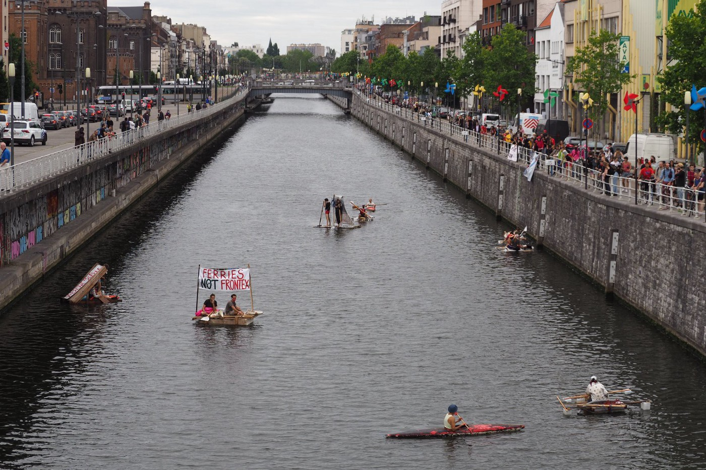
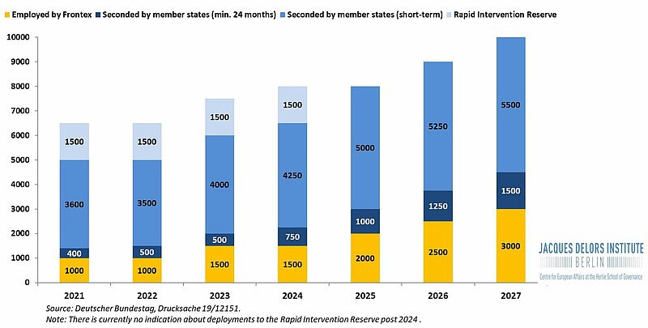
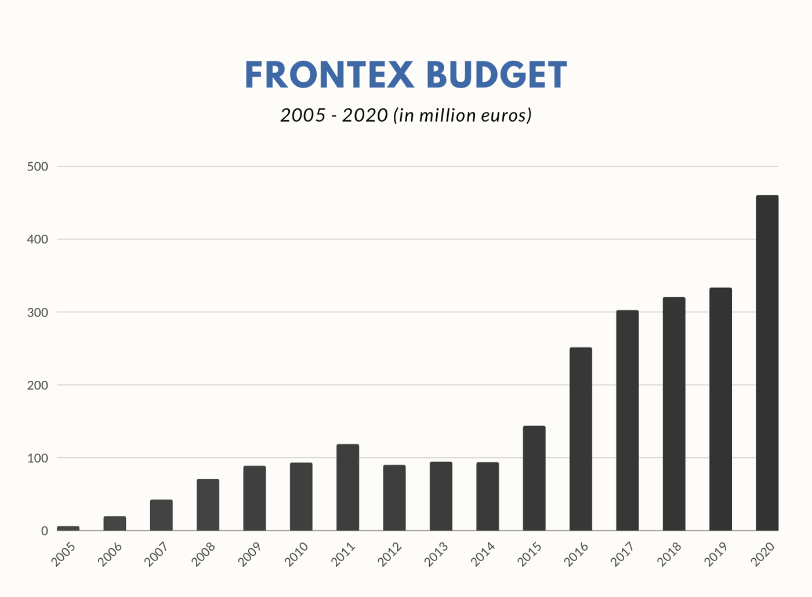

### AYS Special: Frontex and Human Rights — How did we arrive here? Part 3 \(2020\-Present\)

[Are You Syrious?](?source=post_page-----706438d8e29--------------------------------)

[Dec 26](ays-special-frontex-and-human-rights-how-did-we-arrive-here-part-3-2020-present-706438d8e29?source=post_page-----706438d8e29--------------------------------) · 25 min read

_Working on an article about Frontex is not an easy task\. Information and allegations about the agency are piling up on a daily basis\. The purpose of this article is to give an overview of Frontex’s increasing role in EU border management — with no accountability or respect for fundamental rights in its operation\._

_This is the third and last part of the Frontex timeline, from the beginning of 2020 to the present day, and starts with the most recent entry\. We will keep this updated, as more information about Frontex comes up\. Check out [PART 1 \(2004–2016\)](ays-special-frontex-and-human-rights-how-did-we-arrive-here-part-1-2004-2016-17cffb340c07) and [PART 2 \(2017–2019\)](ays-special-frontex-and-human-rights-how-did-we-arrive-here-part-2-2017-2019-83dbb24acb7f) \._
### 2020

**Budget:** €420\.6m \( [approved in August 2019](https://ec.europa.eu/commission/presscorner/detail/en/IP_19_2809) \) 
**Staff:** 1000 \( [estimate](https://ec.europa.eu/commission/presscorner/detail/en/MEMO_15_6332) in 2020–2022 programming document\)
**Frontex own’s standing corps** , as provided by the 2019 Regulation: as of [September 30](https://frontex.europa.eu/media-centre/news-release/frontex-welcomes-new-standing-corps-recruits-ILr9os) , a total of 433 people have been recruited and are undertaking a six\-month training\. The f [irst 265 recruits](https://frontex.europa.eu/media-centre/news-release/frontex-welcomes-first-standing-corps-recruits-h2LxJD) should finish training in December 2020\.

**December 22:** A new [article](https://www.spiegel.de/politik/ausland/frontex-skandal-horst-seehofer-deckte-offenbar-griechische-verbrechen-a-bd062e3f-e016-4f43-98a1-98cfe9757529) by Der Spiegel shows the reluctance of German Interior Minister Seehofer to provide detailed information regarding the pushback off Samos island witnessed by a German federal police vessel on August 10, despite an internal document of the ministry proving that he had full knowledge of the events of that day\.

**December 18:** Border Violence Monitoring Network \(BVMN\) releases the ‘ [Black Book of Pushbacks](https://www.borderviolence.eu/launch-event-the-black-book-of-pushbacks/) ’, two volumes \(for a total of 1,500 pages\), compiled by the BVMN thanks to the contributions of 15 organisations, which exposes in detail the illegal practice of violent pushbacks of migrants which have been taking place over many months at the EU’s external borders — with full impunity\. The book, made in collaboration with the United Left \(GUE/NGL\) block of the European Parliament, brings the voices of 12,654 victims to European institutions as well as governments, and it aims to hold them accountable for the torture, the inhumane and degrading treatment, and the violation of the right to life that people seeking safety in the European Union are faced with\.

**December 15:** Danish media [report](https://www.raeson.dk/2020/frederiksen-og-weiss-k-som-borgerlige-og-fortalere-for-retsstatens-principper-kan-vi-ikke-ignorere-push-back-metoden-i-middelhavet/) about indications that the Danish coastguard patrols deployed within Frontex operations in the Aegean sea will be moved away from the most ‘active’ zones to less ‘controversial’ areas, “because they refuse to use the violent push\-back method to force migrant boats away\.”

**December 10:** Josoor, a member of BVMN, report of an [exchange with Frontex](https://www.borderviolence.eu/frontex-ignore-rights-violations-at-the-evros-border/) regarding a group of 70 people, who were pushed back onto an islet in the Evros river on November 11\. Situated between Greece and Turkey, the islet “became a site of improvised detention, with neither authority allowing the transit group to leave … Josoor led calls on behalf of BVMN for the EU agency to act\. Josoor requested timely intervention from Frontex”, alerting the authorities with specific information\. A first letter directed to the Frontex Executive Director and several other emails were ignored\. For 48 hours the group was forced to stay on the islet\.

> _On the evening of 13th November, a day after the group was finally able to leave the island to Turkish territory, Leggeri finally sent a reply to Josoor’s urgent letter\. The letter outlined that the location given did not fall under the Frontex operational area but that a Frontex team was deployed 32km away\. He further stated that Frontex had transmitted the message to the responsible Greek authorities\. According to the letter, the Greek authorities had informed Frontex that “there was a group of people spotted in the Turkish territory during the day of 11\.11\.2020, but they did not cross the border to the Greece territory”, failing to recognise that it was Greek authorities who had placed the group in this dangerous position on the island in the first place\. This statement raises more questions than it answers, and represents an abdication of all responsibility on the part of Frontex\._ 
 

> _**Given the recent revelations of Frontex complicity, and even contribution, in pushbacks from Greece, /Josoor is/ deeply concerned by this latest reply\. While the agency states that it places fundamental rights at the core of its approach, this image is significantly undercut by its daily practice at borders such as Evros\.**_ 

**December 9:** The [composition](https://twitter.com/g_christides/status/1336740697605607426) of the sub\-group of Frontex’s Management Board that will inquire into the agency’s involvement in pushbacks is announced by journalist Giorgos Christides\. A representative of Germany will act as chair, with representatives of France, the EU Commission, Greece, Hungary, Norway, Romania, Sweden & Switzerland\.

**December 8:** The European Union Agency for Fundamental Rights \(FRA\) [publishes](https://fra.europa.eu/en/publication/2020/migration-fundamental-rights-issues-land-borders?fbclid=IwAR2SNTfwFLvNGY33qFy4cJpXe0FrjbsABeHlVMmDlUj6tIEM8bye6tyx0Vc) “ [Migration: Fundamental Rights issues at land borders](https://fra.europa.eu/sites/default/files/fra_uploads/fra-2020-land-borders-report_en.pdf) ”, a report which looks at fundamental rights compliance and the correct application of the human rights safeguards in the _European asylum acquis_ and the provisions of the Schengen Borders Code at the EU external land borders, including rivers and lakes\. It was requested by the European Parliament on January 30\. Regarding Frontex SIR and individual complaint mechanisms, it states:

> _In 2019, eight of the nine Serious Incidents Reports that reached the Frontex Fundamental Rights Officer related to land border surveillance activities\. These are reports submitted by participants in Frontex activities or working in Frontex operations who come across fundamental rights violations during their work\. In 2020, by 1 October, the Frontex Fundamental Rights Officer coordinated three such Serious Incidents Reports, two of which concerned land border surveillance\. As regards the Frontex complaints mechanism, between January and August 2020, Frontex received 20 complaints \(not all admissible\) under Article 111 of the EBCG Regulation, six relating to land borders\._ 

**December 7:** A Spanish media outlet publishes an [article](https://elpais.com/internacional/2020-12-06/frontex-reconoce-decenas-de-devoluciones-de-grecia-a-turquia-sospechosas-de-ser-ilegales.html) in which it claims to have had access to an 18\-page report written by Frontex which details 33 possible pushbacks in the Aegean, 11 of which were witnessed by the agency\. These possible pushbacks, which are reportedly described as ‘prevention of departures’ are different cases to the ones reported by the media\. The report is to be analysed at the next Management Board meeting\.

**December 2:** Arne Semsrott and Luiza Izuzquiza, freedom of information activists, [reveal](https://fragdenstaat.de/en/blog/2020/12/02/frontex-costs-court-transparency/) that Frontex has filed a case against them “before the General Court of the European Union in order to force” them to pay over €23,000 of legal fees, after they lost a [lawsuit for information](https://fragdenstaat.de/en/blog/2019/11/27/frontex-judgement-luxemburg-transparency/) about Frontex ships in the Mediterranean\. Already on January 31, Frontex had asked them to pay the legal fees\.

**December 1:** Frontex Executive Director is called for questions in front of the LIBE Committee at the European Parliament, discussing ‘ [Recent allegations on pushbacks during Frontex operations in the Eastern Mediterranean](https://multimedia.europarl.europa.eu/en/committee-on-civil-liberties-justice-and-home-affairs_20201201-1345-COMMITTEE-LIBE_vd?fbclid=IwAR1QdMMxQ6qiJpXFZ2GEYTzhcNZhyRojdy6THGxbzbroACUSqx3_hS9xOkg) ’\. He reiterates the defence that the agency expressed previously: that Frontex has no information regarding the pushbacks reported by media; that no Serious Incident Report \(SIR\) has been filed regarding those events; that the SIR mechanism is activated, national authorities are alerted and asked to investigate every time a suspected violation of human rights is witnessed; that not all interceptions are to be considered SAR events, meaning that they do not require rescue and therefore ‘returns’ cannot be considered pushbacks; that the agency needs to consider _hybrid threats_ in the stretch of Aegean Sea between Greece and Turkey\.
He also goes into details regarding the reported pushback of the night between April 28 and 29, stating that Frontex surveillance aircraft G\-WKTH did not fly that night\. 
Two days later, Der Spiegel publishes an [article](https://www.spiegel.de/politik/ausland/frontex-skandal-fabrice-leggeri-hat-eu-parlament-die-unwahrheit-gesagt-a-046eafef-be16-4967-a758-65eba8146716) in which it cites an internal report to Frontex’s Management Board containing details about the flight of the aircraft on the night in question:

> _Less than 48 hours after the meeting, it is clear that Leggeri was not telling the truth\. Either the Frontex boss deliberately lied to the European Parliament or misled it due to a mistake that was difficult to explain_ 

Following the meeting, several Members of the European Parliament call for his resignation\.

**November 28:** Der Spiegel publishes details of [Frontex’s internal communication](https://twitter.com/g_christides/status/1332656454105436160) regarding the [pushback of August 10](https://www.spiegel.de/politik/ausland/frontex-skandal-deutsche-bundespolizisten-in-illegalen-pushback-in-der-aegaeis-verwickelt-a-d4e45196-a5b2-43a5-9050-72885b349996) \. This also feeds into the concerns regarding the effectiveness of Frontex’s SIR mechanism\.

**November 26:** The Romanian interior minister [denies any wrongdoing](http://www.cdep.ro/pls/parlam/interpelari.detalii?idi=61102&idl=2) in the case of the Romanian vessel MAI 113 implicated in the pushback off Lesvos of June 8\.

**November 23:** In a [letter](https://www.tinekestrik.eu/letterreply-mr-lopez-aguilar-mr-leggeri-activities-frontex-greece) addressed to the LIBE committee, Frontex Executive Director does not exclude that Frontex vessels or aircraft were in the vicinity of pushbacks\. He minimises the documentation provided by Bellingcat, Lighthouse Reports, Der Spiegel, ARD and TV Asahi and confirms that no SIR was filed following these events\.

**On the same day,** Der Spiegel [publishes](https://www.spiegel.de/politik/ausland/wie-frontex-chef-fabrice-leggeri-die-oeffentlichkeit-getaeuscht-hat-a-97235557-16c5-4340-bf9b-c1032b2dabab) details on the pushback off the coast of Lesvos that was carried out by the Greek coast guard on April 18\. As shown in the article, an internal Frontex Serious Incident Report [reveals](https://twitter.com/g_christides/status/1332022446891950080) that it was followed minute\-by\-minute by a Frontex aircraft\.

**November 19:** Following a visit to Greece in March, The Council of Europe’s Committee for the Prevention of Torture and Inhuman or Degrading Treatment or Punishment \(CPT\) publishes a [report](https://www.coe.int/en/web/cpt/-/council-of-europe-s-anti-torture-committee-calls-on-greece-to-reform-its-immigration-detention-system-and-stop-pushbacks?fbclid=IwAR1q0252oRfuwak5_klUjvLvRiaQ0MDCjc3Ghqm2j1bpwQrdsdxDb-3YyRQ) on the situation of the immigration detention system, in which it calls for a reform to the system and for an end to pushbacks\. It questions Frontex’s role in supporting Greek authorities at the countries’ borders, especially regarding the lack of monitoring officers within Joint Operation POSEIDON and “about the precise terms of engagement of FRONTEX vessels with boats carrying migrants that have been agreed between FRONTEX and Greece\.”

**November 10:** European Ombudsman Emily O’Reilly [opens](https://www.ombudsman.europa.eu/en/news-document/en/134739) an inquiry as a follow\-up of her 2013 Special Report and Recommendations regarding the functioning of Frontex’s complaints mechanism\. She [writes](https://www.ombudsman.europa.eu/en/correspondence/en/134842) :

> _Seven years on from my Special Report, and aware of concerns having been expressed, I believe it is timely to assess how the Complaints Mechanism is functioning and have therefore decided to launch an inquiry on my own initiative\._ 

She asks Frontex to reply to her [questions](https://www.ombudsman.europa.eu/en/correspondence/en/134842) by 15 January 2021 and “to organise an electronic inspection of documents relating to the Complaints Mechanism, including those setting out how Frontex followed up on reports sent to the Fundamental Rights Officer, either by Frontex or by national authorities”\. She also asks the Fundamental Rights Officer to reply on “how Frontex ensures respect for fundamental rights in joint return operations”\.

**On the same day,** an extraordinary meeting of the Frontex Management Board is [held](https://www.statewatch.org/news/2020/november/frontex-will-a-management-board-sub-group-find-the-truth-about-pushbacks/?fbclid=IwAR1z6Pf8llYG2qEmBFIXyq0lYgLyAE4VnVlSXbxUp8vsEXhqBQjVX8C4XLA) \. At this meeting, Frontex is presented with a series of questions to be answered by the end of the month\. As reported in a [letter](https://www.tinekestrik.eu/sites/default/files/2020-11/Letter%20to%20EP_Frontex%20maritime%20operations%20at%20EU%20external%20bord.._.pdf) from Frontex Executive Director to the President of the European Parliament dated November 11:

> _As I informed the participants of the \[Management Board\] meeting, the preliminary findings of the inquiry conclude that there is no evidence of a direct or indirect participation of Frontex staff or officers deployed by Member States under Frontex operations in alleged “pushbacks” in the Aegean Sea\._ 

The Management Board [asks](https://frontex.europa.eu/media-centre/news-release/conclusions-of-the-chairperson-of-the-frontex-management-board-cpQord) the Executive Director to ensure that the internal reporting system is solid and effective in order to allow for an immediate follow\-up in case of incidents\. It is decided to “set up a sub\-group to the Management Board to further investigate the accusations of involvement in pushbacks in the Aegean\. Frontex Executive Director [releases a statement](https://frontex.europa.eu/media-centre/news-release/frontex-calls-for-committee-to-consider-questions-related-to-sea-surveillance-BMieC8) in which no attention is paid to such accusations\. Instead he calls “ _for the creation of an evaluation committee to consider legal questions related to the Agency’s surveillance of external sea borders and accommodating the concerns raised by Member States about ‘hybrid threats’ affecting their national security at external borders where the European Border and Coast Guard Agency will deploy its standing corps_ ”\. Reading between the lines, this call will set the tone of Frontex’s refusal of pushback accusations to date, which will be repeated and reinforced in the following weeks\. It is based on four main points:
◆ Frontex has no information regarding the cases reported by media on October 23, because no Serious Incident Report \(SIR\) has been filed;
◆ where suspected violations of human rights are witnessed, the SIR mechanism is activated, national authorities are alerted and asked to investigate;
◆ not all interceptions are to be considered SAR events, meaning that they do not require rescue and therefore ‘returns’ can not be considered pushbacks\. Only emergency situations and distress calls communicated through official channels \(MRCCs\) fall into this restrictive interpretation of SAR;
◆ Greece, and Frontex with it, considers itself to be a target of _hybrid threats_ , meaning that people on the move are used and ‘weaponised’ by Turkey, turning situations that appear to be SAR events into quasi\-military actions, to be dealt with through different frameworks\.

**November 4:** Seven Frontex officers are [deployed](https://elpais.com/espana/2020-11-06/espana-y-frontex-negocian-una-operacion-para-cerrar-la-ruta-migratoria-canaria.html) in the Canary Islands to support Spanish authorities with the increased number of arrivals\. Talks and negotiations start today to define the limits and details of further deployment in the area, which could mean resuming Joint Operation HERA II\.

**October 28:** As a result of the joint investigation by Bellingcat, Lighthouse Reports, Der Spiegel, ARD and TV Asahi, EU Home Affairs Commissioner Ylva Johansson [requests](https://twitter.com/YlvaJohansson/status/1321453365541392384) “an urgent extraordinary Frontex Management Board meeting on November 10, to discuss alleged pushback incidents in Greece and fundamental rights protection\.”

**October 27:** Frontex [launches](https://frontex.europa.eu/media-centre/news-release/frontex-launches-internal-inquiry-into-incidents-recently-reported-by-media-ZtuEBP) an internal inquiry into the alleged involvement in pushbacks in the Aegean sea documented by Bellingcat, Lighthouse Reports, Der Spiegel, ARD and TV Asahi\. In the same press release, it announces that “ _so far, no documents or other materials have been found to substantiate any accusations of violations of the law”\._ The release carries on:

> _Earlier this year, \[…\] Frontex Executive Director had already asked \[Greek\]authorities to investigate two events near its islands in the eastern Aegean Sea\. They found no proof of any illegal acts in one incident and are still looking into another one\._ 
 

> _\[He\] also alerted the members of the European Parliament of an incident earlier this year when a crew of the Danish vessels deployed by the agency **was given incorrect instructions by the officers of the Hellenic Coast Guard** \. Following the incident Frontex contacted the Greek authorities and the misunderstanding was clarified with the Hellenic Coast Guard\._ 
 

> _At this point of time, the still ongoing inquiry has not identified other suspicious cases than those already reported by the Executive Director to Greek authorities\._ 

**October 23:** The joint investigation by [Bellingcat](https://www.bellingcat.com/news/2020/10/23/frontex-at-fault-european-border-force-complicit-in-illegal-pushbacks/) , [Lighthouse Reports](https://www.lighthousereports.nl/ourprojects/2020/4/5/borders-newsroom) , [Der Spiegel](https://www.spiegel.de/international/europe/eu-border-agency-frontex-complicit-in-greek-refugee-pushback-campaign-a-4b6cba29-35a3-4d8c-a49f-a12daad450d7) , ARD and TV Asahi is published\. The details of the pushbacks in the Aegean sea of April 28–29, June 4–8, August 15, and August 19 are made public on this date, revealing that Frontex was aware of this illegal practice being carried out by the Greek authorities, and that the agency actively participated in a number of illegal pushbacks\.

**October 14:** Second operation in Montenegro, focused on the country’s sea border\. Frontex will [deploy](https://frontex.europa.eu/media-centre/news-release/frontex-launches-second-operation-in-montenegro-C0Pc3E) aerial support, specialised officers and will provide technical and operational assistance in carrying out coast guard functions in international waters

**October 10:** Frontex [awards](https://ted.europa.eu/udl?uri=TED:NOTICE:473315-2020:TEXT:EN:HTML) €100m to Airbus and Elbit for drone surveillance services in the eastern and central Mediterranean\.

**October 2:** [Annual Report](https://frontex.europa.eu/assets/Partners/Consultative_Forum_files/Frontex_Consultative_Forum_annual_report_2019.pdf) published by Frontex Consultative Forum\. The Forum remains highly concerned about: 
◆ the functioning of the Frontex Serious Incident Reporting mechanism, which has demonstrated its shortcomings more than once;
◆ the continued postponement in the revision of the agency’s Fundamental Rights Strategy;
◆ the impact of aerial surveillance in the central Mediterranean and the subsequent provision of information to the Libyan authorities, leading to increased numbers of people returned to the country to face indiscriminate detention and degrading conditions;
◆ the impact of the agency’s Multipurpose Aerial Surveillance on the Bosnian/Croatian borders, given the documentation of the violent and abusive behaviour of Croatian authorities;
◆ persistent allegations of pushbacks at the Greek\-Turkish border in Evros and the low number of serious incidents reported through the Agency’s mechanism, “ _which Frontex attributed to the fact that officers deployed by the Agency were not deployed on the frontline where pushbacks have been reported_ ”;
◆ the agency’s support to Hungarian authorities at the country’s border with Serbia and with return operations\. The request to suspend the operations in the country, already stated in previous years, has become more urgent given the EU Commission’s infringement procedure against Hungary\. “ _Against the Consultative Forum’s repeated advice, the Agency maintained its operational support to Hungary, suggesting that its presence on the ground could improve the situation\. The Consultative Forum noted, however, that even though the situation did not improve, the Agency increased the number of staff deployed at the Serbia\-Hungary border\._ 
◆ The Report includes and external evaluation of the Forum itself\. It “ _identified some existing challenges such as the high dependency of the Consultative Forum on the Agency’s willingness to seek its advice and to act upon recommendations, and the limitation posed to its work by an understaffed Consultative Forum Secretariat\._ ”

**September 23:** The EU Commission proposes “ [The New Pact on Migration and Asylum](https://eur-lex.europa.eu/legal-content/EN/TXT/HTML/?uri=CELEX:52020DC0609&from=EN) ”: a series of legislative measures that provide the framework of the EU migration and asylum policies for the years to come\.
According to the Commission:

> _It provides a comprehensive approach, bringing together policy in the areas of migration, asylum, integration and border management … It aims to create faster, seamless migration processes and stronger governance of migration and border policies, supported by modern IT systems and more effective agencies\. It aims to reduce unsafe and irregular routes and promote sustainable and safe legal pathways for those in need of protection … This common response also needs to include the EU’s relationship with third countries\._ 

It is presented alongside a [roadmap for its implementation](https://eur-lex.europa.eu/legal-content/EN/TXT/?qid=1601287338054&uri=COM%3A2020%3A609%3AFIN#document2) which covers the end of 2020 and the whole of 2021\.

The Pact foresees the recast of the 2008 Return Directive \(which has been in [negotiation since 2018](https://eur-lex.europa.eu/legal-content/EN/TXT/?uri=CELEX:52018PC0634) \), a full integration of the EU Return policy with its Readmission and Voluntary return policies and further effective operational support by Frontex:

> _Frontex must play a leading role in the common EU system for returns, making returns work well in practice\. It should be a priority for Frontex to become the operational arm of EU return policy, with the appointment of a dedicated Deputy Executive Director and integrating more return expertise into the Management Board\. The deployment of the new standing corps will also assist return\. Frontex will also support the introduction of a return case management system at EU and national level, covering all steps of the procedure from the detection of an irregular stay to readmission and reintegration in third countries\. In this way the Agency can realise its full potential to support return, linking up operational cooperation with Member States and effective readmission cooperation with third countries\. \(2\.5\)_ 

It also intends to boost “Frontex’s access to naval and aerial capacity”\. \(4\.3\)

Frontex’s enhanced mandate should now be used to make cooperation with partners operational:

> _Cooperation with the Western Balkans, including through EU status agreements with the Western Balkan partners, will enable Frontex border guards to work together with national border guards on the territory of a partner country\. Frontex can also now provide practical support to develop partners’ border management capacity and to cooperate with partners to optimise voluntary return\. The Commission will continue encouraging agreements with its neighbours \(6\.4\)_ 

The Pact has been analysed and commented on by countless individuals, groups, media, and NGOs\. Mainly it has been described as a missed opportunity to provide real change in policy direction and in addressing the concerns related to the mistreatment of people on the move\. 
Here are the analyses of [BVMN](https://www.borderviolence.eu/new-pact-on-migration-policy-analysis/) and [HRW](https://www.hrw.org/news/2020/10/08/pact-migration-and-asylum) \.

**August 15–19:** Two more pushbacks at sea off the coast of Lesvos are uncovered by Bellingcat, Lighthouse Report, Der Spiegel, ARD and TV Asahi\. ◆ [On August 15](https://www.spiegel.de/international/europe/eu-border-agency-frontex-complicit-in-greek-refugee-pushback-campaign-a-4b6cba29-35a3-4d8c-a49f-a12daad450d7) , the Greek coast guard approached a boat that was close to the northern shore of Lesvos\. They tried to push the boat away, then “masked Greek border guards boarded the boat, destroyed the engine, threatened the passengers at gun point and forced them to tie the boat to a speed\-boat\.” They were then towed into Turkish waters\. The Turkish coast guard witnessed the scene but did not intervene for hours\. The _MAI 1102_ was located only a few hundred meters away from the refugee boat\. The boat can be clearly identified in a photo\. A German navy ship on a NATO mission that observed the incident reported it to the German government\.
◆ [On August 19,](https://www.bellingcat.com/news/2020/10/23/frontex-at-fault-european-border-force-complicit-in-illegal-pushbacks) “a dinghy was reported to have been pushed back from Northern Lesvos\. The Portuguese vessel Molivos was five km away and appears to have changed course and headed towards the pushback before its transponder either lost the signal or was turned off\.”

**August 10:** A pushback off the coast of Samos island takes place with the involvement of a German Federal Police vessel deployed with Frontex\. The pushback is detailed in a [Frontex internal report](https://twitter.com/g_christides/status/1332656454105436160/photo/1) and [published](https://www.infomigrants.net/en/post/28806/call-to-withdraw-german-police-from-greek-migrant-pushbacks?fbclid=IwAR3BPs51iVelQ5gr4BZlGBF0M0M-oHiIp8WJQxr08TdRYL6DjEqE87McNHE) by Der Spiegel:
◆ At 6am, the Greek observation post “Praso” spot a rubber dinghy “clearly already in Greek waters\.” 
◆ 15 minutes later, the crew of the German ship BP62, Taufnahme “Uckermark”, arrived at the reported location\. “The federal police found an overcrowded rubber dinghy with 40 people on board and stopped it\. But they did not save the occupants from the sea, did not take them on board … The “Uckermark” blocked their journey until the Greeks ‘took over’ the incident” and then left\.
◆ Two hours later, the Turkish Coast Guard is recorded intercepting the same dinghy in Turkish waters and dragging it back to shore\. 
◆ The document carries on, showing that the German authorities “sent an e\-mail to the Maritime Coordination Center in Piraeus, responsible for the units at sea \[asking\] what had happened to the refugees\.” 
◆ In response, the Greek authorities stated that: “The rubber dinghy with migrants on board changed course when it saw the ship of the Greek coast guard and drove back towards Turkey,” and that the Greek Coast Guard used “border protection measures taken to prevent the arrival on Samos”\.
◆ In an internal document of the German federal ministry of the interior [reported](https://www.spiegel.de/politik/ausland/frontex-skandal-horst-seehofer-deckte-offenbar-griechische-verbrechen-a-bd062e3f-e016-4f43-98a1-98cfe9757529) by The Spiegel \(article published on December 22\), the version of the Greek authorities is contradicted: the federal police observed “that the \(…\) Greek forces physically took migrants on board” and moved them onto a Greek coast guard vessel\.

**July 24:** Frontex Executive Director [tells](https://www.bellingcat.com/app/uploads/2020/10/FOI-1-20200724_ED-reply-to-LIBE-Chairman.pdf) the LIBE Committee at the European Parliament that the agency had observed and recorded just a single incident which may have been a pushback in the Aegean\.

**July 15:** Frontex [launches](https://frontex.europa.eu/media-centre/news-release/frontex-launches-second-operation-outside-eu-1UZt3Q) a deployment in Montengro\. It is the second operation of the agency in a non\-EU country\. Several officers are deployed to support Montenegro’s border guards at the border with Croatia\. Operational plans include the expansion of the agency’s presence to border control activities at sea, including support in search and rescue\.

**June:** First ‘voluntary’ return [organised](https://frontex.europa.eu/media-centre/news-release/frontex-assists-in-first-voluntary-returns-on-chartered-flights-yTe7ui) by Frontex, from Cyprus to Georgia, via scheduled flight\. In July, Frontex will support France with a return operation via charter flights, returning 209 people to Albania\. In September, Frontex [will support](https://frontex.europa.eu/media-centre/news-release/frontex-assists-in-first-joint-voluntary-return-with-a-charter-flight-W9ednO) Germany, Belgium, France and the Netherlands in the agency’s first joint ‘voluntary’ return operation, returning 50 people to Iraq\.

**June 10:** In line with the 2019 Regulation, Frontex and the European Union Agency for Fundamental Rights \(FRA\) [sign](https://frontex.europa.eu/media-centre/news-release/frontex-and-fra-agree-to-establish-fundamental-rights-monitors-OBabL6) an agreement to “work together to establish fundamental rights monitors, design their training programme and integrate them into Frontex activities\.” The agencies aim to establish as many as 40 monitors by the end of the year and to integrate them within the Frontex Fundamental Rights Office\. In reality, the first selection notices for these roles \( [1](https://microsite.frontex.europa.eu/en/recruitments/RCT-2020-00082) , [2](https://microsite.frontex.europa.eu/en/recruitments/RCT-2020-00081) \) will be published on November 20 \(first appointments expected for April/May 2021\) \.

**June 4–8:** As reported in a joint investigation by Bellingcat, Lighthouse Reports, Der Spiegel, ARD and TV Asahi, between June 4 and June 8, four pushbacks are documented near Lesvos\. In all cases, a Frontex vessel or aircraft is present and witnesses or participates in the illegal action\. In particular, on June 8, a Romanian vessel _MAI 1103,_ deployed within Frontex Operation Poseidon, actively [participates](https://www.spiegel.de/international/europe/eu-border-agency-frontex-complicit-in-greek-refugee-pushback-campaign-a-4b6cba29-35a3-4d8c-a49f-a12daad450d7) in a pushback in the Aegean sea near Lesvos, directly blocking a boat with people on the move on board without proceeding with the rescue operation\. Instead the vessel _MAI 1103_ moves away and leaves the Greek coast guard to carry out the pushback\. The actions are recorded in a video by the Turkish coast guard\.

**May 29\-June 1:** BVMN publish three testimonies of abuses and pushbacks from Albania to Greece which took place over 72 hours\. 
◆ In the first, on May 29, a group of nine people was [stopped](https://www.borderviolence.eu/violence-reports/may-30-2020-1500-on-the-way-to-the-village-of-trestenik/) by Slovenian and Albanian officers after having crossed the border from Greece, threatened with guns and then pushed back to Greece\. The testimony indicates the presence of Frontex patrol cars on the scene\. 
◆ One day later, the group crossed the border a second time and was [apprehended](https://www.borderviolence.eu/violence-reports/may-31-2020-0600-vicinity-of-trestenik-gr-al-border/) again in Albanian territory, by three officers: “one from Albania, one from Poland and one from Romania\.” They were taken to Bilshit police station and “they were detained in this station for around five hours\. At approximately 06:00, the authorities drove the group to the border in a 4×4 vehicle and ordered them back onto Greek territory\.”
◆ On May 31, after having crossed the border from Greece into Albania, a group of 7 people is [apprehended](https://www.borderviolence.eu/violence-reports/june-1-2020-0700-trestenik-albania/) in the Albanian town of Miras, just two km from the Greek border\. The ‘respondents’ recognised the distinctive armbands worn by the agency’s officers\.

> _According to the respondent, those who stopped the group were equipped with night vision goggles\. The respondent said that when the group were captured, the treatment was very “racist”\. The authorities kept them waiting on the ground while laughing among each other, which “makes them feel without dignity”\. The respondent claims that the Albanian police treated them well, that those who made them feel badly treated were Frontex officers\._ 
 

> _… Of the seven who were captured, some tried to flee\. However, these people were beaten by officers, with the use of a “kind of truncheon but like metal”\._ 

The group was taken to the police station in Bilshit, denied food, fingerprinted, questioned, strip\-searched and detained for the night\. At 7\.00 h on June 1st, “two Albanian and two Frontex police officers took them to the border area” with Greece\.

**May 28:** In a written answer to the European Parliament, Frontex [confirms](https://www.europarl.europa.eu/RegData/questions/reponses_qe/2020/002306/P9_RE(2020)002306(ANN1)_XL.pdf) that “sometimes due to tactical reasons for missions, law enforcement assets are not made visible\. Making them visible might, especially if combined with other information, disclose sensitive operational information and thus undermine the operational objectives”\. This feeds into many [reports](https://digit.site36.net/2020/06/11/frontex-aircraft-blind-flight-against-international-law/) on the cooperation between Frontex and the Libyan coast guard and the lack of cooperation of the Agency with civil rescue vessels in the central Mediterranean \( [1](https://euobserver.com/migration/147331) , [2](https://www.statewatch.org/analyses/2020/drones-for-frontex-unmanned-migration-control-at-europe-s-borders/) , [3](https://thecivilfleet.wordpress.com/2020/12/07/why-did-frontex-help-an-ngo-ship-rescue-refugees-in-the-mediterranean/) \) \.

**May 13:** Status Agreements with [Montenegro](https://www.europarl.europa.eu/doceo/document/TA-9-2020-0057_EN.html) and [Serbia](https://www.europarl.europa.eu/doceo/document/TA-9-2020-0058_EN.html) signed in 2019 are now operative after having been approved by the European Parliament

**March\-April:** [Border Violence Monitoring Network \(BVMN\)](https://static1.squarespace.com/static/597473fe9de4bb2cc35c376a/t/5e747d5185894d689a084750/1584692583068/Report-on-Greece_March-2020.pdf) , [Amnesty](https://www.amnesty.org/download/Documents/EUR0120772020ENGLISH.PDF) and [HRW](https://www.hrw.org/news/2020/03/17/greece-violence-against-asylum-seekers-border) report on the situation at the Evros border\. HRW testimonies “describe 38 deportation incidents involving almost 4,000 people, although some of these could be double counts\.”

**April 28–29:** As part of the joint investigation by Bellingcat, Lighthouse Report, Der Spiegel, ARD and TV Asahi, the presence of a Frontex aircraft is [revealed](https://www.bellingcat.com/news/2020/10/23/frontex-at-fault-european-border-force-complicit-in-illegal-pushbacks) during a push\-back initiated after a group of people landed on Samos\. Greek authorities dragged them back to sea on a life\-raft and pushed them towards Turkish waters\. Frontex’s surveillance plane flew over the area twice while this pushback took place\.

**April 27:** Statewatch releases an internal report circulated by Frontex to EU government delegations entitled ‘ [State\-of\-play report on the implementation of the 2019 regulation](https://www.statewatch.org/media/documents/news/2020/may/eu-council-frontex-ECBG-state-of-play-7607-20.pdf) ’\. As Statewatch [note](https://www.statewatch.org/analyses/2020/eu-guns-guards-and-guidelines-reinforcement-of-frontex-runs-into-problems/#_ftnref18) :

> _The state\-of\-play\-report acknowledges a number of legal ambiguities surrounding some of the more controversial powers outlined in Frontex’s 2019 Regulation, highlighting perhaps that political ambition, rather than serious consideration and assessment, propelled the legislation, overtaking adequate procedure and oversight\. The incentive to enact the legislation within a short timeframe is cited as a reason that no impact assessment was carried out on the proposed recast to the agency’s mandate\. This draft was rushed through negotiations and approved in an unprecedented six\-month period, and the details lost in its wake are now coming to light\._ 

The major legal ambiguities are:
◆ Regarding service weapons and “non\-lethal equipment” \( [Art\. 82](https://eur-lex.europa.eu/legal-content/EN/TXT/HTML/?uri=CELEX:32019R1896&qid=1607612370459&from=EN#d1e6012-1-1) \), the Agency saught legal analysis, which confirmed that the 2019 Regulation does “not provide sufficient legal basis for the Agency to acquire, register, store and transport firearms in Poland\. None of the Polish legal acts either directly or indirectly mentions the Agency as an entity which is entitled to acquire \(possess\) firearms or ammunition for the purpose of fulfilment of its statutory tasks and duties, without a permit issued by the Polish authorities\.”
◆ Regarding the establishment of a new supervisory mechanism on the use of force \( [Art\. 55](https://eur-lex.europa.eu/legal-content/EN/TXT/HTML/?uri=CELEX:32019R1896&qid=1607612370459&from=EN#d1e4496-1-1) \), the agency found that such provisions are inconsistent with the standard rules on administrative enquiries and disciplinary measures concerned, lacking due independency and secrecy from the Agency\. Frontex add that the “Standing corps being the first uniformed service of the EU will require different treatment in comparison to the regular officials working in the EU Institutions”\.
◆ Frontex seek special treatment regarding immunities and privileges\. “ [Protocol No 7 on the Privileges and Immunities of the European Union annexed to the Treaty on European Union \(TEU\) and to the TFEU](https://eur-lex.europa.eu/legal-content/EN/TXT/HTML/?uri=CELEX:12012E/PRO/07&from=EN) ” applies to the agency and its statutory staff\. However, Frontex is not satisfied because the Protocol does not apply to non\-EU states, nor does it “offer a full protection, or take into account a need for the inviolability of assets owned by Frontex \(service vehicles, vessels, aircraft\)”\.
◆ Frontex lacks legal basis for conducting ‘voluntary returns’, since the 2019 Regulation refers to the ‘return’ definition set by the [2008 Return Directive](https://eur-lex.europa.eu/legal-content/EN/TXT/?uri=CELEX%3A32008L0115&qid=1608037812833) and this does not cover ‘voluntary returns\.’

**April 18:** A pushback of a boat carrying 30 people is carried out by the Greek coast guard off the coast of Lesvos during the night\. [Frontex internal documents](https://twitter.com/g_christides/status/1332022446891950080/photo/1) reveal that a Serious Incident Report was filed on May 8 and the pushback was followed minute\-by\-minute by a Frontex surveillance aircraft\. The internal document is published by [Der Spiegel](https://www.spiegel.de/politik/ausland/wie-frontex-chef-fabrice-leggeri-die-oeffentlichkeit-getaeuscht-hat-a-97235557-16c5-4340-bf9b-c1032b2dabab) \.

**April 10:** According to Amnesty’s report “ [Malta: Waves of impunity](https://www.amnesty-international.be/sites/default/files/bijlagen/malta_waves_of_impunity_07092020.pdf) ”, Frontex is implicated in the ‘Easter Monday pushback’\. Amnesty concludes that the European Commission and Frontex propose a restrictive position of Frontex competence regarding search and rescue\. According to this interpretation, search and rescue is the responsibility of member states and the Frontex mandate only requires the agency to promptly communicate relevant information to the competent maritime authorities \(interpretation stated in [writing](https://www.amnesty.org/download/Documents/EUR3329672020ENGLISH.PDF) by the EU Commissioner for Home Affairs and by Frontex Executive Director to the LIBE Committee and reiterated by Frontex Executive Director in a [written reply to Amnesty](https://frontex.europa.eu/assets/Images_News/2020/Frontex_responds_Amnesty_International_report.pdf) \) \.

**April 2:** In a meeting of the LIBE committee, Frontex Executive director [describes](https://multimedia.europarl.europa.eu/en/libe-committee-meeting_20200402-1000-COMMITTEE-LIBE_vd) the events of March 3, when a Danish vessel refused to execute a pushback that was ordered by the Greek Liaison officer, as “apparently a misunderstanding\.”

**March 14:** Alarm Phone [reports](https://alarmphone.org/en/2020/03/15/returned-to-war-and-torture/) of a pull\-back in the Central Mediterranean carried out by the Libyan coast guard and organised and coordinated by Frontex and MRCC Malta:

> _◆ At 15:33h CET, Alarm Phone received a distress call from 49 people … They shared their GPS position with us, which clearly showed them within the Maltese SAR zone … We immediately informed RCC Malta and the Italian coastguard via email\._ 
 

> _◆ At 17:42h, RCC Malta confirmed via phone that they had sent two patrol boats …_ 
 

> _◆ At 17:45h, we talked to the 49 people on the boat who told us that they could see a boat heading in their direction\. Unfortunately, the conversation broke off and we were not able to clarify further details\. This was our last contact to the people in distress after which we could not reach them any longer\. Since then, we have tried to obtain further details from RCC Malta, but they claim not to have any information\._ 
 

> _However, confidential sources have informed us that a Frontex aerial asset had spotted the migrant boat already at 6:00h when it was still in the contested Libyan SAR zone\._ 
 

> _◆ At 18\.04h, the Libyan coastguard vessel Ras Al Jadar intercepted the boat in the Maltese SAR zone_ 
 

> _**This means that the European border agency Frontex, MRCC Rome as well as RCC Malta were all aware of this boat in distress and colluded with the Libyan authorities to enter Maltese SAR and intercept the migrant boat\.**_ 

**March 13:** Human Rights Watch [informs](https://www.hrw.org/news/2020/03/17/greece-violence-against-asylum-seekers-border) Frontex about alleged abuse by non\-Greek forces and asked about its deployments along the border:

> _All those interviewed said that within hours after they crossed in boats or waded through the river, armed men wearing various law enforcement uniforms or in civilian clothes, including all in black with balaclavas, intercepted everyone in their group\. All said the men detained them in official or informal detention centers, or on the roadside, and stole their money, mobile phones, and bags before summarily pushing them back to Turkey\. Seventeen described how the men assaulted them and others, including women and children, through **electric shocks, beating with wooden or metal rods, prolonged beating of the soles of feet, punching, kicking, and stomping** \._ 

The agency replied saying that it did not have the requested information and that it would respond as soon as it did\.

**March 12:** Frontex [deploys](https://frontex.europa.eu/media-centre/news-release/frontex-launches-rapid-border-intervention-on-greek-land-border-J7k21h) an additional 100 border guards at the Greek land border with Turkey as part of a rapid border intervention requested by Greece one week earlier\. On 3rd April the deployment is [extended](https://frontex.europa.eu/media-centre/news-release/member-states-continue-to-support-frontex-operations-in-greece-7Egmfg) \. At that date, 624 officers are deployed by Frontex at Greek sea and land external borders\. Critics [argue](https://www.euronews.com/2020/03/10/frontex-border-operation-in-greece-lacks-legal-basis-after-greece-suspends-asylum-law) that this deployment “lacks legal basis”, because the suspension of asylum and the widespread violence documented at the border fail to meet the required Fundamental Rights standards\. Among others, [Border Violence Monitoring Network \(BVMN\)](https://static1.squarespace.com/static/597473fe9de4bb2cc35c376a/t/5e747d5185894d689a084750/1584692583068/Report-on-Greece_March-2020.pdf) , [Amnesty](https://www.amnesty.org/download/Documents/EUR0120772020ENGLISH.PDF) and [HRW](https://www.hrw.org/news/2020/03/17/greece-violence-against-asylum-seekers-border) report extensively on the situation at the Evros border\. HRW testimonies “describe 38 deportation incidents involving almost 4,000 people, although some of these could be double counts\.”

**March 2:** A Danish vessel, deployed in the Aegean within Frontex’s operation Poseidon, [refuses an order](https://www.politico.eu/article/danish-frontex-boat-refused-order-to-push-back-rescued-migrants-report/) received by Hellenic Coast Guard Liaison Officer at Frontex HQ, to [push back](https://euobserver.com/migration/150099) to Turkish waters 33 people they had just rescued in Greek waters\. Through the efforts of individuals, NGOs and other organisations it is discovered that no Serious Incident Report was filed and that Frontex HQ requested more information about the events only following media coverage, as shown by an [internal chain of emails](https://fragdenstaat.de/dokumente/7785-frontex-internal-emails/) \. In less than four hours from the first email the incident was considered ‘isolated’ and the case was closed\.

**March 1:** Greece i [ntroduces emergency measures](https://twitter.com/PrimeministerGR/status/1234192922813267976) in response to increasing pressure at its land border, among them the “ _temporary suspension, for one month from of this Decision, of the lodging of asylum by those entering the country illegally”\._

**February 27:** Following statements from the Turkish authorities that the country’s borders with the EU would be opened, [thousands of people rush to the border region with Greece](28-02-20-ays-daily-digest-stuck-in-no-mans-land-bb74e2f913ee) \.

**February 20:** The signing of the Status Agreement between the EU and Bosnia and Herzegovina, which would allow Frontex to be deployed in the country, is halted by Milorad Dodik, the Serb member of the state presidency of the country\. As media [report](https://balkaninsight.com/2020/02/20/dodik-stops-bosnia-from-cooperating-with-frontex/) :

> _At the last session of the three\-member Bosnian presidency, Dodik voted against all decisions that were on the agenda\. One was the proposal of the Minister of Security, Fahrudin Radoncic, to accept an “Status Agreement between Bosnia and Herzegovina and the European Union on Actions Executed by the European Border and Coast Guard Agency in Bosnia and Herzegovina”\._ 

**January 31:** Frontex [request](https://www.statewatch.org/news/2020/march/joint-letter-to-frontex-regarding-attempts-to-claim-legal-costs-from-transparency-activists/) s two freedom of information activists of the German platform [Frag Der Staat \(Ask the State\)](https://fragdenstaat.de/en/action/frontex/) , Luisa Izuzquiza and Arne Semsrott, to pay €23,700 in legal costs, after the Agency [won a case at the General Court of the European Union](http://curia.europa.eu/juris/fiche.jsf?id=T%3B31%3B18%3BRD%3B1%3BP%3B1%3BT2018%2F0031%2FJ&oqp=&for=&mat=or&lgrec=en&jge=&td=%3BALL&jur=C%2CT%2CF&num=T-31%252F18&dates=&pcs=Oor&lg=&pro=&nat=or&cit=none%252CC%252CCJ%252CR%252C2008E%252C%252C%252C%252C%252C%252C%252C%252C%252C%252Ctrue%252Cfalse%252Cfalse&language=en&avg=&cid=7522255) , in which the two activists were seeking access to information related to Joint Operation Triton in 2017\.

**Major Operations:** 
◆ POSEIDON Rapid Intervention \(March 1\) 
Continuation of: 
◆ POSEIDON 2020 \(Greece, Eastern Mediterranean, Greek/Turkish land border\)
◆ THEMIS 2020 \(Italy, Central Mediterranean\) J
◆ INDALO 2020 \(Spain, Western Mediterranean\)
◆ MINERVA 2020 \(Spain\)

**Returns:** \( [data available for the period January 1 — June 30](https://www.statewatch.org/media/1593/eu-frontex-deportations-report-first-half-2020-13638-20.pdf) \) A total of 4,299 people were returned with the support of Frontex\. The Agency coordinated 72 return operations by charter flight, deporting 2,489 people\. A total of 1,671 people were returned by scheduled flights\. In February, Frontex provided assistance for the first time to a voluntary return via a scheduled flight and 139 people were readmitted to Turkey from Greece\. According to Frontex Fundamental Rights Officer’s observations \( [pp\. 2–3](https://www.statewatch.org/media/1593/eu-frontex-deportations-report-first-half-2020-13638-20.pdf) \), no SIR \(Serious Incident Report\) was filed by Frontex deployed officers, but four complaints were submitted to the agency under the [individual complaints mechanism](https://frontex.europa.eu/contact/lodge-a-complaint/) “regarding an alleged violation of Fundamental Rights of returnees in three readmission operations and in one national return operation, although none of them was related to actions of staff involved in Frontex activity\.”

**Article by Giulio D’Errico, AYS**

**Find daily updates and special reports on our [Medium page](https://medium.com/are-you-syrious) \.**

**If you wish to contribute, either by writing a report or a story, or by joining the info gathering team, please let us know\.**

**We strive to echo correct news from the ground through collaboration and fairness\. Every effort has been made to credit organisations and individuals with regard to the supply of information, video, and photo material \(in cases where the source wanted to be accredited\) \. Please notify us regarding corrections\.**

**If there’s anything you want to share or comment, contact us through Facebook, Twitter or write to: areyousyrious@gmail\.com**

_Converted [Medium Post](https://medium.com/are-you-syrious/ays-special-frontex-and-human-rights-how-did-we-arrive-here-part-3-2020-present-3841f1a9e532) by [ZMediumToMarkdown](https://github.com/ZhgChgLi/ZMediumToMarkdown)._
