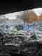
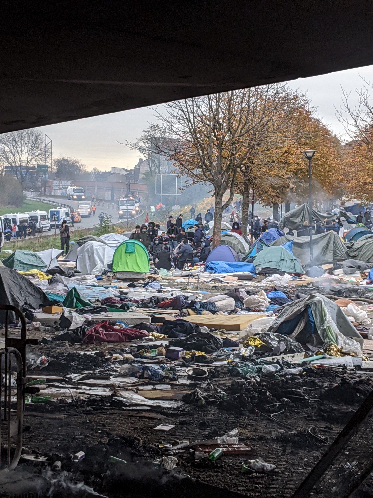
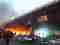
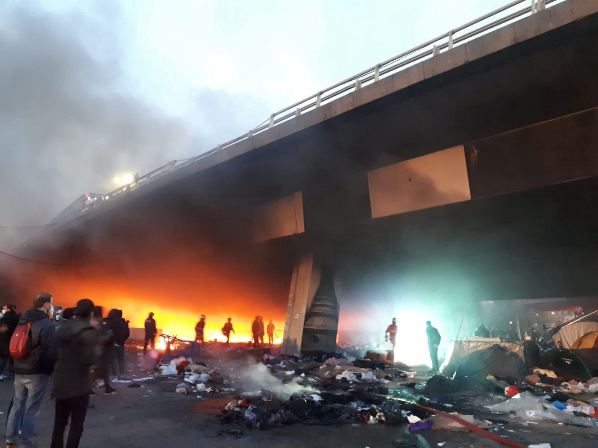
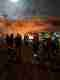
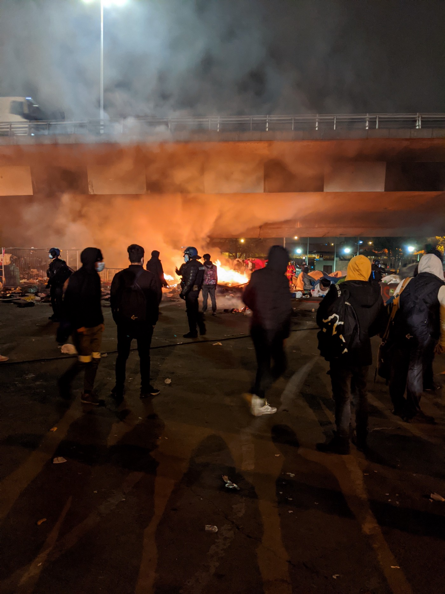
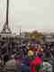
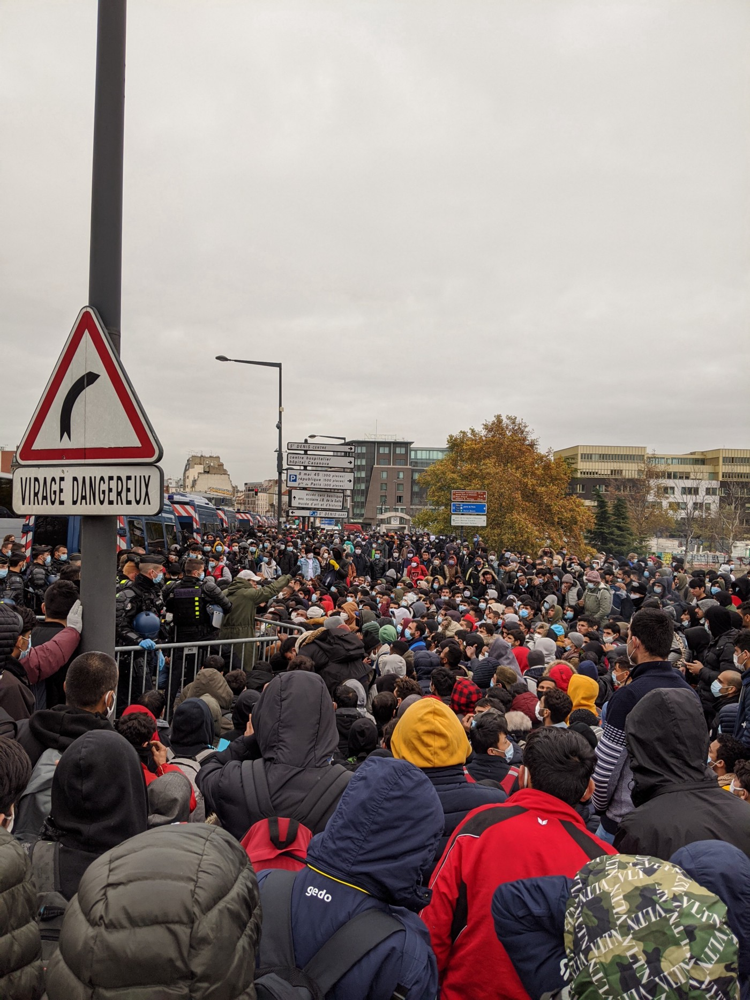
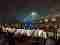
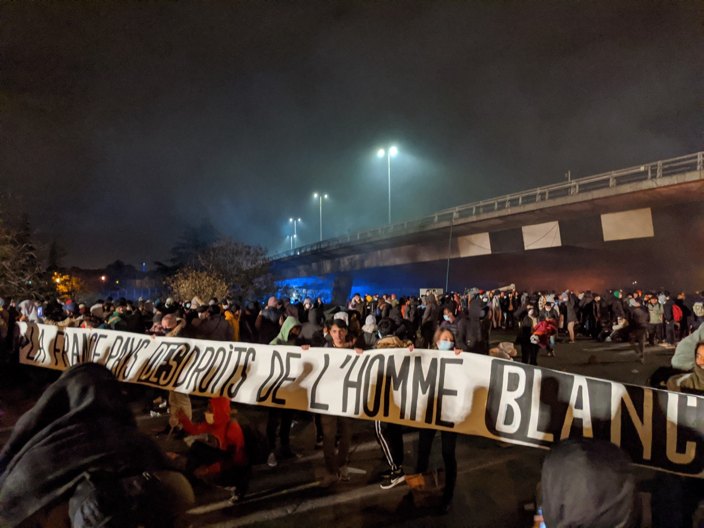

### AYS Special from Paris: the 17th November eviction

[Are You Syrious?](?source=post_page-----ea0fcff8120--------------------------------)

[Dec 27](ays-special-from-paris-the-17th-november-eviction-ea0fcff8120?source=post_page-----ea0fcff8120--------------------------------) · 7 min read

_Paris is a place of mixed stories and nationalities\. Up to 4,000 displaced people are without permanent accommodation there at any one time — some waiting out Dublin after being asked to leave another European country following a negative asylum claim, some new arrivals who came directly to Paris to apply for their asylum there and some who have papers but no place to stay\._

_One month on from the violent evictions of the most recent large camp in Paris, which briefly brought global attention to the ongoing situation in the city, it is time to reflect\. At its largest, around 3,000 people lived in the camp at Port de Paris, which was the result of large numbers of people losing their accommodation supplied during the first French COVID lockdown combined with regular new arrivals from the Balkan route\._

I was the team leader for the medical group [MARDi \(Medical Aid for Refugees and Displaced People\)](https://mardi.org.uk/) , a British founded group providing first aid, over the counter medicines and wound care for the people based in this camp\. We also provide escorts to hospital to advocate for patients and ensure they receive the care they need, as people are often dismissed due to a lack of French language\. MARDi has been working for around two years in the Paris setting\. [Medicin Du Monde](https://www.facebook.com/fr.mdm) and [Samusocial](https://www.facebook.com/SamusocialInternational) also provide health care but the needs of the population far outweigh what we can achieve even together\.

> _As President Macron announced a second national lockdown in France, rumours began to circulate regarding what would become of the large camp\. It was impossible to socially distance; only two clean water taps served the whole camp\. There were people who had tested positive for COVID who were unable to isolate safely due to living in tents and temporary structures\. The residents of the camp — mostly from Afghanistan and some from Somalia — were all asking to be taken to a safe place to stay\._ 

Initially, the only change was a police presence at the edge of the camp, scaring people off from attending medical and social appointments for fear of punishment — but no news of any accommodation\. The 17th of November 2020 was believed by many sources to be the intended date of eviction and this turned out to be true\.

On the night of the 17th and the morning of the 18th, the 70th camp evacuation since 2015 took place\. Volunteer associations from around Paris arrived to help the residents to be ready to leave calmly with police and to try to salvage tents and blankets, which are usually burnt and destroyed by the police\. What follows is a timeline of events\.

**02\.00:** The atmosphere in the camp was positive\. The residents felt happy that the government would house them\. Men were dancing and talking with volunteers\. Families and children waited anxiously at the edge of the camp\.

**04\.00:** The police surrounded the camp perimeter and blocked the roads so nobody could enter or leave the camp except on the buses we hoped would arrive to take the residents to accommodation\. A long wait began\. Residents lit fires to keep warm, some of which became large and out of control with the need for intervention of fire\-fighters\. The police announced there were around 2,000 places with an additional 300 places for families\. This sparked anxiety amongst the associations… we all knew there were more people in the camp from our counts\.

**09\.00:** Two buses finally arrived, and the families were slowly boarded\. No other buses arrived, people were tired, cold, and hungry, but the atmosphere remained calm and hopeful\. The Gendarmes and CRS \(French military police\) controlled the crowd, but refused to allow people to queue in an orderly manner, leading to a large crowd waiting to board buses\. The Gendarmes began waving mace \(pepper\) spray and threatening the crowd\. Some of them then began spraying the crowd, hitting women and children in the process\.

**11\.00:** Eventually the families were boarded\. Buses began arriving more frequently to take the rest of the camp residents\. The Gendarmes insisted that the men crawl on the floor to get to the buses\. Anyone who stood, even to adjust their position was sprayed with mace\. We frequently treated men running from the front of the line to the water\-point to wash their burning eyes, coughing violently\.

Those who could tolerate the mace made it onto the buses\. Those who were scared by the tactics of the police chose to hang back and wait\. They had faith that there would be enough space for everyone in the accommodation\.

This loading of people onto the buses lasted until 14:00–12 hours after we first arrived at the camp\. The police slowly closed the perimeter of the camp, including access to the toilets and water points\. People were politely queuing to relieve themselves behind a bin\. No one had received any food or water since the perimeter was formed at 04:00\. We shared the last of our water and snacks\.

The police blocked all salvaging of tents and blankets by the associations\. Thousands of pounds of aid, in the landfill\.

**14\.30:** All of the buses left the camp\. The CRS formed a line in their armour with shields along the street and began to push the group of camp residents — around 500 people including volunteers — towards the highway\. They marched us down the highway, forcefully followed by a van blasting a siren to the street next to Stade du France\. The crowd remained calm, the camp residents suggesting that they were being walked to accommodation in the stadium\. Suddenly the van announced in French over a loudspeaker “Last warning, disperse, we are going to use force”\. The entire group were confused\. There were no streets to disperse to, we were on a highway\.

The CRS then began firing tear gas bombs, flashballs and charging at the group\. People ran in any direction they could in panic\. They were chased across this area of Paris for several hours, after no sleep, no food, no water, and they had no place to go\.

> _People fleeing places of war, faced war on the streets of Paris\._ 

Those left behind were people we knew to suffer from poor mental and physical health\. They had been too stressed by the violence of the police in the bus queue to join early and had now missed their chance of a place to sleep\. The camp was destroyed so their previous tent was also not an option\.

For one week the police followed orders to not let anyone sleep on the streets, waking and beating anyone who tried to rest their head\. A protest camp was formed by the associations at Republique in Paris\. This time the violence of the CRS and police was [witnessed by the press](https://www.theguardian.com/world/2020/nov/24/french-minister-calls-images-of-police-breaking-up-refugee-camp-shocking) and politicians\.

Currently most of those left on the street are now housed by charities and associations, some by the government\. There is no provision for the new arrivals coming daily from other places in Europe and the Balkan route\. The accommodation given after an ‘evacuation’ is never permanent\. People are evicted with little notice and camps reform\. There is no long\-term solution provided for the displaced population in Paris\.

> _Up to 20% of those on the street have asylum in France and still do not have accommodation and proper access to services\._ 

This circular process of ‘evacuations’ and temporary accommodation does not work\. France and Europe need to find a way to house people safely while their asylum is processed\. Allow people to work or study\. Let them live their lives instead of spending days with nothing to do but wait\. The most difficult thing is watching young people having their youth wasted, having lost all hope\. The violence of November in Paris is something I will never forget\. It was the very worst treatment of humans and the greatest denial of human rights I have ever seen\.

If you want to get involved please contact [info@mardi\.org\.uk](mailto:info@mardi.org.uk) \. You can use your time, your voice or your money to raise awareness about Paris\.

**_Article by Rebecca Ferguson_**

**Find daily updates and special reports on our [Medium page](https://medium.com/are-you-syrious) \.**

**If you wish to contribute, either by writing a report or a story, or by joining the info gathering team, please let us know\.**

**We strive to echo correct news from the ground through collaboration and fairness\. Every effort has been made to credit organisations and individuals with regard to the supply of information, video, and photo material \(in cases where the source wanted to be accredited\) \. Please notify us regarding corrections\.**

**If there’s anything you want to share or comment, contact us through Facebook, Twitter or write to: areyousyrious@gmail\.com**

_Converted [Medium Post](https://medium.com/are-you-syrious/ays-special-from-paris-the-17th-november-eviction-a833d35f79d6) by [ZMediumToMarkdown](https://github.com/ZhgChgLi/ZMediumToMarkdown)._
