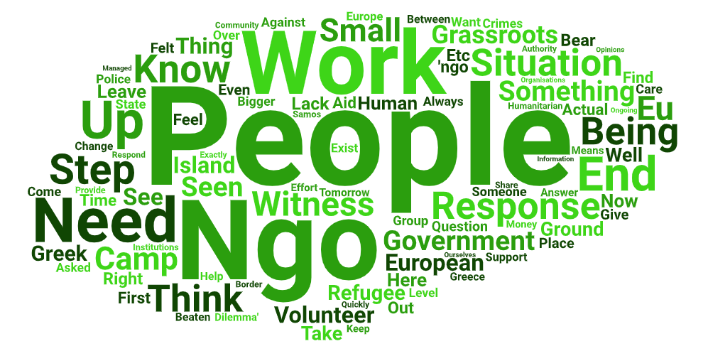
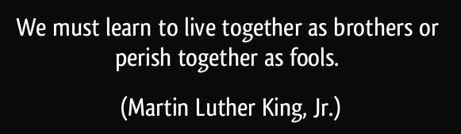

### AYS Special: Voices from the ground \-the ‘NGO Dilemma’

_At the start of 2020, on the eve of the first Greek Lockdown, Gianni Manzella and Simone Innico began asking volunteers and aid workers their opinions on the ‘NGO Dilemma’ — the role and scope of grassroots and bigger aid and solidarity organisations in the context of EU migration policies of the last five years\. The answers they received provide a fitting end to a year which has only raised more questions about the European response to migration\. They also provide more inputs to a debate on the role of ‘humanitarianism’ and on the relationship between volunteer work and activism at the European borders, which has been going on for some time both online and offline\._

◆ Why are we here?
◆ What are we actually doing here?
◆ Why do we assume these responsibilities and obligations, instead of those who should be accountable for them?
◆ How longer can this ‘placeholder’ solution go on?

These are the sort of questions that occupy the thoughts of many, while at the same time they are managing what can be rather serious situations in highly volatile, and occasionally dangerous, circumstances\. The ‘NGO dilemma’ describes exactly this ambivalent attitude which many volunteers, social workers, or ‘solidarians’ have experienced\.

This is the dilemma of knowing that your work will cover for someone else’s responsibilities — someone with much more resources and authority — but knowing that, if you refuse, the first ones to get hurt will certainly be the most vulnerable\. Because, at the end of the day, there has to be someone there to handle the situation — but who will this someone be?

The two of us have been working respectively for 2 and 3 years in Greece\. One of the first questions we asked ourselves was **whether or not grassroots NGOs with their efforts are helping** people or actually enabling the lack of an effective governmental response to the ongoing ‘crisis’\.

We observed how easily, in this proclaimed ‘state of emergency‘, authorities defer their duties so that NGOs as well as the local communities find themselves more or less alone in a very precarious situation\.

Back in January, when we met on the island of Samos while volunteering, we found ourselves sharing opinions with many people working on the ground\. That’s when we came up with the idea of reaching out to other, more\-experienced people to collect their thoughts about the ‘NGO Dilemma’\. In this way, we got an insight into the feelings of the people involved, and a general picture of what people expect — or fear — will happen within this constantly changing situation\.

When we left Samos at the end of January the first cases of Coronavirus were already being discussed in Europe\. Then, on February 27th, Turkey decided to ‘open the gates’ to Europe and use innocent people as pawns in the ongoing political game between Brussels and Ankara\. Greece and Bulgaria reacted immediately, and predictably it was a reaction marked by security and military priorities, rather than humanitarian ones\.

On the Aegean islands, there was a huge increase of fascist and racist attacks against refugee communities, as well as against volunteers and locals offering their support\. **Such hate crimes were not limited to the Greek islands: people on the move and ‘solidarians’ were targeted and attacked in many parts of Europe and especially along the Balkans, where fear has always affected the societal perception of the refugee issue\.**

Even though the turbulent months at the end of 2019 and the beginning of 2020 saw many changes concerning the work of grassroots NGOs, we kept asking people to participate in our small survey, sharing their experience in the field and answering the following questions:

◆ If all NGOs were to leave tomorrow, what would happen?

◆ Who would step in and do something about the needs of refugees and who would witness what’s happening?

Below are some of the answers we received

Greek islands, March 2020: Fear and lack of state response

There is a pretty simple answer to the question that you pose — No one \[would step in\] \!

…There is no government\-sponsored humanitarian care\. It is an evolving tragedy and one that all government officials should be deeply ashamed of … The majority of money and effort provided by the EU and Greek Government is focused on preventing refugees reaching the islands and to ensure that, if they do arrive, they wish that they hadn’t\!

\(Friday, 21st February 2020 \)

**As we are talking right now there is an NGO burning…** \[One Happy Family community centre was destroyed by a fire on March 7\]

I’m afraid that what we are witnessing in Lesvos is exactly what the situation would be if there were no NGOs\. There would be no help whatsoever from the government and everything would be really, really inhumane … especially on the mental side … people would struggle even more than they do right now\.

So, without us being here, I think the situation would be way worse for people\.

\(Saturday, 7th March 2020\)

Independent volunteers, grassroots NGOs, etc\. intervened and continued to work … where there was very little or no support at all from bigger institutions or from the state\. The civil society mobilised exactly because we saw no adequate response to what was going on and felt we had to step in\. Wherever bigger NGOs or states stepped in later on, usually \[grassroots groups\] left or reduced their operations because they weren’t so needed anymore …

It’s a very dangerous game that is being played to the highest level and in the end the worst hit by this will be the most vulnerable and defenceless people that rely on others to survive\.

… we continue being stuck in this loop of passing the blame and ignoring the problem — simply throwing money at it when things go slightly more sour\.

\(Tuesday, 10th March 2020\)

Indeed, volunteers and fieldworkers working in and outside of camps bring not only much needed psycho\-social support, but also a sense of normalcy to the lives of asylum seekers, who would otherwise wait years in places resembling prisons\.

While asylum seekers linger in between overwhelmed administrative offices and their crowded tents or ISOBOXES, NGOs and moreover grassroots NGOs also fill in on the numerous deficiencies of the Greek System\.

\(Wednesday, 26th February 2020\)

\[…\] Many who will take over are small groups\. In many places it’s the small groups who are making the difference as they are much more flexible than the big groups as they can step in on small amounts, step in for small things\. So, it will always be\.

\(Thursday, 12th March 2020\)

At the beginning I actually wanted to know what was really happening on the ground\. Afterwards it felt for me like an obligation as a European citizen to go back since there was so much to do and I wanted to give something back since I felt privileged\. If politicians don’t take their responsibilities, I felt I needed to do something\.

\[…\] In my ideal world, governments and the European institutions would assume their responsibilities and would step in\. Realistically, I have to admit that I don’t know how much more the situation needs to worsen for the authorities to do something about it\.

\[…\] As we are talking about NGOs, I hope, and I think that you would always find individuals who cannot bear the situation and try to do something \.
NGOs have already stopped or at least scaled down their activities on the islands in the past years\. However, the result was that nothing really changed\. Nonetheless, I think that individuals or grassroots organisations would step up\.

\(Wednesday, 18th March 2020\)

If we were all to leave tomorrow, I don’t think that the EU would step up in any way\.

And most of us are here because the EU hasn’t stepped up to help \[people on the move\] in the way that \[the EU\] should anyway\. So, if we left, I think, what you would see is malnourishment, you would see more people dying, there would be a lot more suffering\.

\(Monday, 23rd March 2020\)

I would say that having NGOs in place has its positive and its negative side\. **So, maybe if there were no NGOs, the governments would have to figure something out; like for example transporting the refugees to the mainland and not keeping them on the islands where they are all trapped and where there are not even the basic needs for people\.** This is what I think might happen, or the EU would have to do another relocation where people would register and then one of the European countries would choose people to go there\. I think that is what’s gonna happen if all the NGOs were to leave tomorrow…

\(Monday, 13th April 2020\)

Witnessing state crimes

Greek citizens are feeling more and more frustrated about this situation, as we can see in the late political change of 2019\. Only external institutions, the EU or the UN would then bear witness of the ineptitude of the Greek government to handle the crisis, and as previously shown, will not be able to overpass the country’s sovereignty, leaving thousands ashore at the doors of Europe\.

…if small grassroots NGOs who work in the cracks of the existing networks \[…\] would leave, \[no one would\] register crimes carried out by governments against the refugee population:

pushbacks, violence, expulsions from camps or lack of distribution of food and goods necessary for survival\.

…governments do not want \[these crimes\] to come to light … so therefore, as soon as NGOs would leave and would not actually pick up this task — nobody would … you can see the efforts of the government to try to hide those \[crimes\] or ‘illegalise’ these NGOs, try to arrest the people doing it\.

\(Monday, 23rd March 2020\)

I have seen different grounds, I have seen the jungles in the north of France … I know Paris very well, the 18th and 19th ‘arrondissements’\. I see how the French \[authorities\] work and how French politics and police \(CRS\) treat people\.

What I see on the ground is very often against every humanitarian law, every human rights law and everyone knows it, and no one changes or blames it\. The politicians know about the human rights violations which are not correct, but it’s all accepted …

If it’s Croatian \[police\] beating up the people, if it’s like in Greece at the moment, if it’s the boats who they are just letting on their own to sink and letting the people die like that … It’s against every human right what is going on now on the ground\!

It’s impossible\. Everybody knows how it is in Libya in the camps, the slavery etc\.

… I’ve seen shutdowns of camps, I’ve seen people being teargassed, I’ve seen men beaten up, I’ve seen broken hands \[because of police brutality\], I’ve seen children being beaten … I have seen lots of things on the ground and this is what keeps me on it and to continue and to not give up\.

\(Thursday, 12th March 2020\)

Who would witness what’s happening? — Well it is not only about who would witness, but also who would care?

I have the feeling — even if the media report about the situation in Greece — that no one really gives a shit\. Yes, you have demonstrations, petitions, etc\., but the general population does not really care about what is going on\.

So my question would be: What do we explain to our children in 10, 20, 30 years from now when they read about this in their history books and who will write the story?

Because I guess if you would talk to Ursula von der Leyen \[President of the European Commission\], Charles Michel \[President of European Council\] etc\., they would probably write the story about how they were heroes and how they protected our European borders from all the refugees that wanted to come to Europe\.

\(Wednesday, 18th March 2020\)

\[Here in Samos,\] we’ve just had a situation now, where from the 1st March, new arrivals have been incarcerated in the port office and not allowed to claim asylum, and none of us — NGOs — have been allowed to go in and bear witness to their treatment\.

They’ve been taken away, I think, last Friday so they’ve been there for nearly 3 weeks and none of us has been allowed to go there to bear witness to their treatment\. And we do know that they’re in very cramped conditions, with little or no washing facilities and — until about 10 days in — one toilet for over a hundred people\. They were crammed into very small buildings\. So, who would bear witness is a very important issue\. That’s why we also have some “watchdogs” that watch over what people do, to bear witness to the inhumanity of what happens in places like here, and refugee camps all around the world\.

\(Monday, 23rd March 2020\)

\[…\] A lot of the things that are happening, meaning violence with the police like what’s happening now at the border with Croatia with \[people being\] deported and beaten like shit\. Well, it’s an issue of information that no one would be there to collect\. We ourselves, being involved with these guys, we are able to have a constant communication and relationship of trust so that they can keep on telling us the things that happen to them\.

In an official camp, nobody would ever talk about the fact that the Croatian police had beaten them up because there is no place for trust… they wouldn’t know who to talk to, what to say, what not to say\.

They would just stay in their containers, with no personal ties, no actual freedom, and this type of information would not be spoken about\. So, we — as civil society — are the people that can take charge of it in a purely human way and at the same time we can collect a lot of information that if we weren’t there, nobody would know about\.

All the testimonies of ongoing violations of human rights… and this — we can say — is something very characteristic of our work: the fact of building a relation of trust \[which allows\] to obtain information that could not be obtained in an official camp, one that is managed by IOM, the Red Cross, UNHCR, or others\.

\(Thursday, 27th February 2020\)

When bigger isn’t better — Efficiency and efficacy on the ground

… for instance, when it comes to working in a camp … there’s usually ‘a lack of money’ — which is bizarre at the very least, considering the amount of money \[large INGOs\] get from governments — but, for instance, the UNHCR camp in Sarajevo, Bosnia, lacked a lot of things\.

There was no heating in the winter for a large number of residents living in tents in a large hangar, which meant it often was \-17° in the daytime\.

We then, with our NGOs, built a heating system which would find no form of upkeep after we got kicked out of the camp and weren’t allowed to work there anymore\.

So, to me, this is proof that existing structures — legal structures, if you will –, non\-NGOs structures, will actually not fill in those gaps and the moment the NGOs would leave, a lot more gaps will exist and the chances of survival or finding at least a form of dignified comfort, if you will — “comfort” is not really the right word, though — will stop existing\.

\(Monday, 23rd March 2020\)

I’ve been to Paris two or three times\. When I went to Calais, I was so shocked by what I saw there that I went back to my home island of Guernsey and gathered a group of friends and craftsmen\. We took 10 trucks of aid over and built a kitchen in Calais there\. And I think, the thing that strikes me most is that — the reason I do what I do and still holds good today — is that I feel guilty about how our governments’ response… or lack of response… to what I see as a crisis within spitting distance from where we all live, and something that we should be taking joint responsibility for\.

… We are not paid, we don’t have government funding — we do our own fundraising\. But it also means that we are very nimble, and it means that we can respond to problems very quickly\. The ‘red tape’ that surrounds some of the biggest organisations can be hugely cumbersome and it means that solutions to a problem take a long time to come to fruition, and that’s one of the reasons I am very keen for my NGO to stay small and nimble\.

And I literally would bang the drum for the grassroots NGOs in saying that, mostly — not all of them are good, but mostly — they can respond very quickly, and this is one of the beautiful things about working in a situation like this, where I personally am able to say that something needs funding, and I got the funds for it, and I can just say “Alright, we’ll do it\. Let me get on and do it”\. Intergovernmental institutions like UNHCR of course can cover much larger areas and produce more money\. However, when something is needed very quickly it takes them longer to respond, and so… I don’t pick one against the other because I think they’re both needed, but I will always espouse the need of grassroots NGOs that are run efficiently and well and are able to step in very quickly and respond to something immediately\. It’s a massive bonus\!

\(Monday, 23rd March 2020\)

Eventually, the point of our work — and the work of other groups of volunteers like ours — is not about the supper, the tent, the sleeping bag: the point is about being united, being open to listen, and being able to give \[people\] motivation to pursue their path\. In the end, what’s more important is to be listened to and share a supper with someone who listens…

… At a human level, at a psychological level and at a level of support for these people, it’s volunteers who possess much more warmth, much more value and much more humanity compared to those \[working for\] intergovernmental organisations with a wage, employee contract and managing stuff in a quite unclear way…

\(Thursday, 27th February 2020\)

The ‘NGO Dilemma’

Despite the depth and richness of many responses, our survey falls short in portraying the complex landscape of heterogeneous actors and situations\. We were struck to discover how diverse yet complementary these many viewpoints could be: if we were to keep asking, an exhaustive “mapping” of this sort would probably have no end in the near future\.

In this humanitarian field, the occasions for self\-reflection and delving into the bigger picture are always limited to the brief moments of rest, at the end of long tiring day shifts\.

The conclusion always seems to come back to the fact that, in any case, whatever our opinions and ideals are — tomorrow there will be need for support, understanding, clothing, hygiene products and so on\. And again, the day after tomorrow, and the day after that\. Who’s going to take care of those needs? Who else if not us?

**From a survey and a text by Gianni Manzella and Simone Innico, April 2020**

Find daily updates and special reports on our [Medium page](https://medium.com/are-you-syrious) \.

**If you wish to contribute, either by writing a report or a story, or by joining the info gathering team, please let us know\.**

**We strive to echo correct news from the ground through collaboration and fairness\. Every effort has been made to credit organisations and individuals with regard to the supply of information, video, and photo material \(in cases where the source wanted to be accredited\) \. Please notify us regarding corrections\.**

**If there’s anything you want to share or comment, contact us through Facebook, Twitter or write to: areyousyrious@gmail\.com**

_Converted [Medium Post](https://medium.com/are-you-syrious/ays-special-voices-from-the-ground-the-ngo-dilemma-ecd396638cf0) by [ZMediumToMarkdown](https://github.com/ZhgChgLi/ZMediumToMarkdown)._
