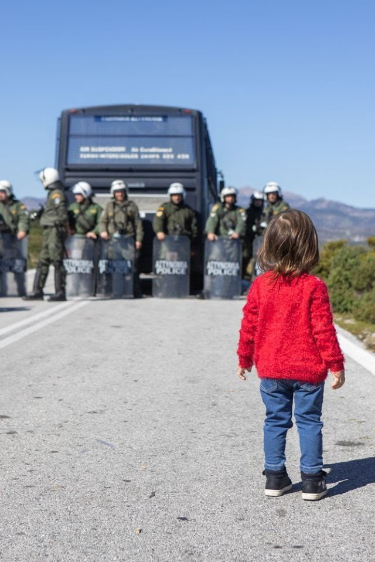
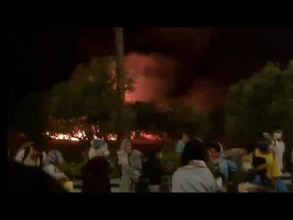
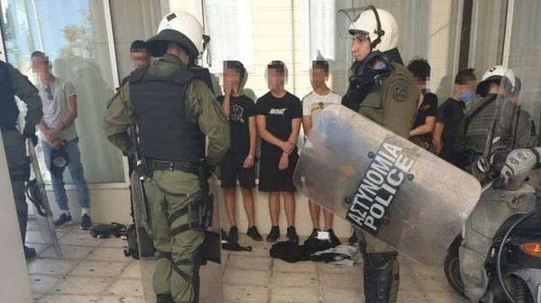
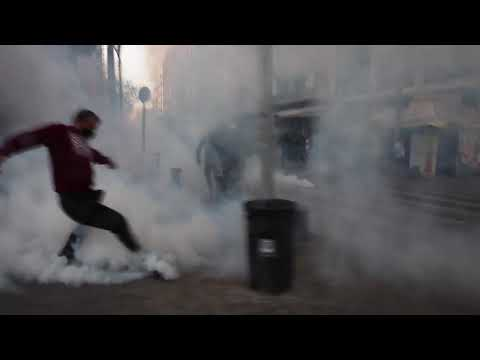

### AYS Special from Greece: Militarisation — A tendency in 2020

_Both people on the move and Greeks in general, have felt the impact of the growing militarisation of, and oppression by, the Greek state by means of expanding the role, the operational scope and tactics, the resources and the equipment of the police this year\. It is a phenomenon which also existed under previous governments, but has been significantly increased since the new centre\-right government of the Nea Demokratia \(ND\) party came into power in July 2019\._

 \)](assets/891a2e95b8b5/1*2yjV1m__tAyguTOIHNP7xw.jpeg)

\(Image Credit: [Rafat Alkhateeb via Art Against](https://www.facebook.com/artagainstproject/photos/a.704384742944296/3564553166927425/) \)

This process of militarisation has become an undercurrent in events and developments throughout the country, leading to claims that [Greece is once again becoming a police state](https://newint.org/features/2019/11/30/greece-new-police-state) with a revival of some tactics that were prevalent during the years of the military junta from 1967–74\.

This has manifested in several ways\. The Ministry of Citizens’ Protection \( \! \! \) recently announced one of the largest armament programs in the history of the Greek Police\. The program [includes](http://www.astynomia.gr/index.php?option=ozo_content&lang=%27..%27&perform=view&id=98638&Itemid=2539&lang=) 675 police cars, dozens of jeeps, 15,690 bullet\-proof vests, hundreds of helmets and reinforced boots\. [The bill is 31 million Euros](https://www.ethnos.gr/ellada/137229_ayto-einai-exoplistiko-programma-mamoyth-tis-elas-ypsoys-31-ekat-eyro) , which will be taken from the Greek 2020 budget and some EU funding\. Since the beginning of 2020, the police have received more than 1,453 vehicles\.

It speaks to related changes in priorities towards both internal and external security that the Greek government is also planning [extensive new military expenditure](https://www.news247.gr/oikonomia/kanonia-anti-gia-voytyro-to-2021.7706034.html) , estimated at billions of Euros in additional costs for personnel and equipment\. Add to this the new [purchase](https://www.cnn.gr/politiki/story/232927/neo-exoplistiko-programma-mamoyth-me-galliko-aroma) of fighter aircrafts from France, in an arms deal of [more than 10 billion Euros](https://www.ekathimerini.com/260395/article/ekathimerini/news/greece-to-pay-23-bln-euros-for-18-french-rafale-fighter-jets) , and the image of militarisation of the Greek state as a whole stands clear\.
#### Policing the city

This growing militarisation has been both visible and significant during 2020 in the attack on squats and solidarity groups, in the aggressive policing of protests and policing in general, in the handling of the refugee and migrant situation on the islands, Chios and Lesvos in particular, and finally in the area of border control, both in the Aegean Sea and at the land border with Turkey on the Evros river\. The issue of border control has been the subject of several AYS Specials and will not be included here \(Frontex Specials [1](ays-special-frontex-and-human-rights-how-did-we-arrive-here-part-1-2004-2016-17cffb340c07) , [2](ays-special-frontex-and-human-rights-how-did-we-arrive-here-part-2-2017-2019-83dbb24acb7f) and [3](ays-special-frontex-and-human-rights-how-did-we-arrive-here-part-3-2020-present-706438d8e29) \)

2020 has seen extensive police presence and activity in the Exarcheia area of Athens, traditionally a stronghold for both anarchist and squat activity as well as for widespread social solidarity initiatives\. The increased level of policing has been called a “cleaning operation” in the Greek mainstream and government\-affiliated media, and is rooted in the historically hostile relationship between the new mayor of Athens Kostas Bakogiannis \(a nephew of the prime minister Mitsotakis\) and the anarchist community in Exarcheia\. Another agenda behind the militarisation of the area and of Athens in general is the wish to [gentrify the area](http://www.cadtm.org/Regarding-the-Hercules-plan-housing-dispossession-and-squat-evictions-in-Greece) with more Airbnb units, raised property prices and rent, making the neighbourhood inaccessible to most of the present inhabitants and tenants\.

> People on the move have been significantly impacted by the [numerous evictions of squats and solidarity initiatives](https://roarmag.org/essays/squat-eviction-house-dispossession-greece/) , many of which acted as living spaces where people could co\-exist with locals and create their own networks and structures of self\-support\. 

Despite having operated for several years, on the 19th November 2019, an [ultimatum](https://enoughisenough14.org/2019/11/21/greek-state-escalates-15-day-ultimatum-to-the-squats-migrants-on-greek-islands-will-soon-be-imprisoned/) to leave all squats was issued by the government\. On the same day, it was announced that plans had been made for setting up five closed centres for asylum seekers on the Aegean Islands\.

During this time, the process of decongestion of the overpopulated camps on the North Aegean islands, Moria on Lesvos in particular, was also getting started, with the aim of relocating a large number of refugees to the Greek mainland\.

> A substantial number of these refugees ended up on the streets of Athens where they were often homeless and without support\. 

Many individuals and families, including children and babies, were seen at what became a temporary camp in Viktoria Square in the centre of Athens\. For people arriving from the islands, the squats and solidarities had previously served as a refuge and as a stepping stone for getting on with their lives\. In June alone, more than 2,000 refugees were [transferred](https://www.iom.int/news/decongestion-greek-islands-continues-700-refugees-and-migrants-move-mainland) just from Lesvos\.

Since the beginning of June, this policy of forcing refugees to leave accommodation structures to seek housing opportunities on their own without any suitable options for integration has created more critical situations, in which police have launched raids and operations in an attempt to remove refugees from Viktoria\. After one such transfer operation, in which some 150 recognised refugees were transferred from Viktoria to reception facilities in Skaramangas and Schisto in western Attica, the minister of migration Notis Mitarachis [boasted](https://www.keeptalkinggreece.com/2020/07/06/greece-refugees-evicted-camps-facilities/) that:

“All refugees have left Viktoria Square for temporary accommodation, thanks to the actions of the migration ministry’s first reception service and Greek police,” adding that solidarity activists “have come to the square to exploit human suffering in order to create certain impressions,” underlining the confrontational line of this government\.

 \)](assets/891a2e95b8b5/0*mhQgkBW_aOdUY5yi)

June, 2020 — Refugees met with police in Viktoria Square\. \(Photo by [ypopto\_mousi](https://twitter.com/ypopto_mousi) \)
#### The Evictions

During last winter, up until February, the police made several attempts to [attack](https://en.squat.net/2020/02/11/athens-notara-26-attacked-by-cops/) the [Notara26 Refugee/Migrant Housing squat](https://www.aljazeera.com/gallery/2016/1/7/a-refugee-new-year-in-a-greek-anarchist-shelter) in a former tax office building close to Exarcheia where many refugees had found shelter\.

In May, an abandoned building on Themistokleous Street in Athens, a squat that has hosted migrants and refugees since 2016, was [evicted](https://www.keeptalkinggreece.com/2020/05/18/greece-police-exarchia-squat-asylum-service/) by a strong police force at 6am\.

 \)](assets/891a2e95b8b5/0*SbOyYtkepAsV_u8H)

May 18, 2020 — Evacuation of the Themistokleous squat in Exarcheia \(Photo by: [Marios Lolos](https://twitter.com/lolosmarios/status/1262256400958455808) \)

52 people, mainly from Syria and Congo, including 12 children, were taken to the Police Aliens’ Department to have their papers checked\. They were then transferred to accommodation facilities, and those not eligible for asylum were held in detention before being deported\.

In June, the police [evicted and sealed](https://en.squat.net/2020/07/04/athens-solidarity-action-for-dervenion-56-an-international-call-for-solidarity/) the Dervenion 56 squat in Exarcheia\. The squat was founded in September 2015, providing solidarity structures, medical care, food and education for refugees and migrants together with many anti\-fascist, feminist, ecological and, of course, anarchist activities\. Riot police built a concrete wall in front of the squat’s door\. Protests marked by a heavy police presence continued for several days\.

More raids followed during the summer\. The 16\-year old squat [Terra Incognita](https://en.squat.net/2020/08/18/thessaloniki-terra-incognita-evicted/) and the [Libertatia Squat](https://www.youtube.com/watch?v=8j1eeSLgalU&feature=emb_logo) in Thessaloniki were evicted in August, and on the 5th of September, police raided the legendary [Rosa Nera Squat](https://fromgreecetoanarchy.tumblr.com/post/628630941784555520/video-they-evacuated-a-squat-but-didnt-expect) in Chania on Crete\. They made 16 arrests and injured a journalist with a flashbang during the raid\. [Large demonstrations](https://www.youtube.com/watch?v=41a2DyJayzY) with the participation of a large proportion of Chania’s residents followed together with a strong police presence\.

 \)](assets/891a2e95b8b5/0*ew9wCPQrHoyrQ6uA)

September 5, 2020 — Evacuation of the Rosa Nera Squat, Chania, Crete \(Photo by [Sofia Theodoraki](https://www.facebook.com/sofia.theodoraki.3/posts/10221736983112500) \)
#### Policing Migration

The year began with local protests on the islands of Lesvos and Chios against the construction of new closed detention centres\. Special forces, transferred during the night on ferries from the mainland, [deployed teargas, water cannons and sound flares against locals](ays-special-frontex-and-human-rights-how-did-we-arrive-here-part-1-2004-2016-17cffb340c07) throwing stones and some Molotov cocktails in response\. The local mayor and a priest were treated at the local hospitals after having inhaled teargas\.

“Why, Mr\. Mitsotakis?” — February 25, 2020 — Karava, Lesvos \(Photo by Michael Bakas\)

On the 9th of September, [Moria camp on Lesvos](ays-special-moria-was-not-built-in-a-day-9d64d83d4462) , was destroyed by a major fire\. During the chaotic aftermath of the fire, people were trying to escape into security and to find shelter and food\. Once more, the response from the government in Athens was to deploy a large contingent of riot police to the island, to block roads and prevent people from leaving the area\. A new tent camp was quickly erected in the Kara Tepe area close to Moria\. Local islanders again attempted to block the access to the new camp area and were again met with a heavy police presence\.

The situation escalated quickly, and refugees [protesting](https://www.france24.com/en/20200912-teargas-fired-at-migrant-protesters-on-greek-island-of-lesbos) against the transfer to a prison\-like camp were met by police in combat gear and large doses of teargas\. Several children were present in the teargas attacks\.

The appalling conditions which they now have to contend with in the new camp have been [well documented](https://www.infomigrants.net/en/post/29102/greece-government-criticized-as-moria-2-0-flooded-again) , but lesser known is the fact that a permanent police force of [over 300 officers](https://www.cnn.gr/ellada/story/234702/apokleistiko-froyrio-o-kataylismos-toy-kara-tepe-me-isxyri-astynomiki-paroysia) is planned to be stationed there, allocated from other directorates\.
#### Press Freedom?

In the aftermath of the fire there was widespread obstruction of journalists and photographers by the police, blocking access to the areas of unrest and also in some instances failing to protect them from anti\-migrant locals and protesters\. In response, Reporters Without Borders \(RSF\), together with six other press freedom organisations, [published a statement](https://www.ecpmf.eu/concerns-over-access-for-media-workers-in-greece/) :

> _“The Greek authorities are undermining press freedom and threatening the public’s right to know by restricting access for media workers to sites where refugees and asylum seekers are held following the fire that destroyed the Moria camp\.”_ 

The government has also made two big pay outs to Greek media this year for newspapers, websites \(some of which didn’t exist\) and TV stations to carry “warning spots” about COVID\-19 [totalling 22 million Euros](https://www.keeptalkinggreece.com/2020/10/29/greece-coronavirus-media-support-money/) \. These are legally supposed to be provided by media outlets for free\.
#### Criminalisation and closure of independent bodies

At the end of September Greek authorities [accused](https://www.euronews.com/2020/09/29/greek-police-accuse-33-ngo-members-of-helping-migrant-smugglers) 33 members of NGOs of facilitating the human trafficking of migrants to Lesvos, basing these charges on ‘police information’\. Claiming “ongoing investigations” by — among others — the anti\-terror police, no trial has yet been set and no evidence brought forward to the public\. The [NGOs deny these charges](https://www.statewatch.org/news/2020/december/greece-government-attacks-on-ngos-debunked/) and these claims have been [widely debunked](ays-daily-digest-11-12-2020-mitarakis-attacks-on-ngos-debunked-6276d8fbdcb0) \.

After the destruction of Moria, the one remaining accommodation for mostly vulnerable refugees was PIKPA Solidarity Centre\. Lesvos Solidarity had for some time argued that PIKPA should be allowed to continue their previously awarded work, but at the end of October, they were informed that the structure would be evicted the following day\. On the 30th of October, despite [all appeals](https://www.hrw.org/news/2020/09/30/save-dignity-save-pikpa-and-kara-tepe) , the police turned up with buses and in full protection gear, removing the residents and blocking access to the press, NGOs and social workers\. [The state once more showed its ugly face towards some of society’s weakest members\.](ays-special-day-of-shame-on-lesvos-pikpa-under-eviction-348958025fd4)

■■■■■■■■■■■■■■ 
> **[DunyaCollective](https://twitter.com/DunyaCollective) @ Twitter Says:** 

> > A statement by Mina, a resident of #savePIKPA. By the  sudden appearance of the police this morning, she feels reminded to Afghanistan when Taliban showed up to make them leave their homes.

#LeaveNoOneBehind https://t.co/XIucw2Nx2a 

> **Tweeted at [2020-10-29 11:15:00](https://twitter.com/DunyaCollective/status/1321772518328455168).** 

■■■■■■■■■■■■■■ 

#### Policing Dissent

Back in mainland Greece, the second half of the year started with the [savage beating](https://www.keeptalkinggreece.com/2020/07/14/vassilis-maggos-volos-dead-police-beaten/) of Vassilis Maggos by the police in Volos, Thessaly, during a demonstration\. Maggos was hospitalised with seven broken ribs and injuries to vital organs and died one month later\. Despite videos and photos of the beating, Citizen Protection minister Michalis Chrysochoidis released a statement claiming that there was no connection between the actions of the police and the death of Maggos and blaming SYRIZA and the anti\-authoritarian movement for spreading ‘fake news’\.

In Athens, the second half of the year has shown how the general climate of state oppression has been moving along darker paths than in previous years\.

At the occasion of the [verdict](https://www.in.gr/2020/10/07/greece/pos-egine-aprokliti-epithesi-ton-astynomikon-stous-diadilotes-sto-efeteio-vinteo-ntokoumenta/) at the end of the [five\-year\-long](https://www.theguardian.com/world/2015/apr/20/greece-far-right-golden-dawn-nikos-michaloliakos-trial-start) trial against the Neo\-Nazi Golden Dawn on the 7th of October, the police, unprovoked, used water cannons and tear gas against the crowd, including both old people and children, who had gathered to celebrate the “guilty” verdict\.

> On the 30th of September, a group of protesting hospital workers, including doctors, in downtown Athens were [attacked](https://www.keeptalkinggreece.com/2020/09/30/greece-police-hospital-workers-clash/) by riot police with batons and tear gas\. The protesters marched to the Health Ministry demanding a meeting with the Minister regarding shortages in the public hospitals\. 

A few days later, students followed by teachers and parents rallied for better conditions for school education, and after some external interference, the riot police [attacked](https://www.ethnos.gr/ellada/126469_epeisodia-sto-mathitiko-syllalitirio-entasi-himika-kai-dakrygona-exo-apo-ti-boyli) the protesters with flares and teargas\.

After another protest by school students to get better protection against COVID\-19, riot police in combat gear [rounded up and detained several of the protesters](https://www.avgi.gr/koinonia/369267_tromokratia-kai-kynigito-mathiton-prin-kai-meta-tin-poreia) \. In a quasi\-dystopian turn, children of 14 and 15\-years\-old were treated as if they were criminals — [though this is only unusual in that the children were Greek](https://www.thenewhumanitarian.org/news-feature/2020/12/18/Greece-detention-migrant-children) \.

 \)](assets/891a2e95b8b5/1*MLXlc5NCeg-henmawmZg8g.jpeg)

October 15, 2020 — Athens \(Photo source: [BLOCO Μαθητών/\-τριών](https://www.facebook.com/blocomathites/posts/2855803817995359) \)

One of the students, a 14\-year\-old member of the protest coordination committee, was even [detained for four days](https://www.keeptalkinggreece.com/2020/10/19/police-greece-detention-underage-student-protest/) in the police arrest\. With conditions like this, no one can really feel safe from the police, walking in Athens\.

On top of these episodes, the Ministry of Civil Protection is setting up a [new police department for demonstrations](https://www.news247.gr/politiki/kratisi-14chronoy-mathiti-perasame-se-periodo-aytomatopoiimenis-katastolis.9024353.html) \. The aim is to implement the far\-reaching bill for demonstrations that was passed, under strong protests from the opposition, in the Parliament in July, which [gave the police](https://www.statewatch.org/news/2020/july/greece-unrest-as-government-passes-new-anti-protest-law/?fbclid=IwAR0111-kwy9YENQFTgx7bjJL9kjCnRIA3Q2VRNbnEkm9-j5_lOxnyQ3i5sk) “the highest authority on matters of protests _”_ \. The new branch will consist of 60 specially trained police officers in special uniforms designated to restore order during protests and demonstrations\. On the proposal of the prime minister Mitsotakis, there will also be [a public body with police responsibilities](https://www.alfavita.gr/ekpaideysi/336621_panepistimiaki-astynomia-tha-idrythei-enstoli-omada-me-astynomikes-armodiotites) within the country’s universities\.

At the start of November, riot police units in their hunt for subversive anarchists, [raided a coffee bar full of customers](https://www.lifo.gr/now/greece/301549/galatsi-andras-ton-mat-xtypise-me-gklop-5xrono-se-kafeteria-symfona-me-kataggelia-vinteo) , using tear gas and batons\. Some people were dragged around, and furniture was destroyed\. Even a small child was beaten and hit by teargas\.

Shortly after, on the occasion of the historically important 17th November Polytechnic uprising against the Military Junta in 1973, another similar large police action and raid in the Exarcheia area in Athens [took place](https://thepressproject.gr/epemvasi-tis-astynomias-sta-exarcheia-anaities-prosagoges-kai-anthropokynigito-sta-stena) , including the arbitrary rounding up, harassing and beating of citizens, bystanders and shop customers\.

In the area of law, a core element in the slippery slope from democracy to a police state is the increased use of the so\-called Emergency Legislative Decrees \(PNPs\), stated in the Constitution to be used only in urgent and extraordinary cases of emergency\. These decrees are proposed by ministers without parliamentary scrutiny and have immediate effect, with the parliament ratifying them afterwards\. While the use of these special decrees has steadily grown in the last decade, Chrysochoidis has been using them even more frequently to impose far\-reaching and prohibitive limitations to personal and collective freedom\.

Recent examples have been the bans of demonstrations and public assembly under the pretext of the COVID\-19 pandemic on the occasion of the 17th of November uprising anniversary and for the commemoration of the police killing of the teenager Alexis Grigoropoulos on the 6th of December\.

The deep symbolism of these specific police decrees has resounded strongly throughout Greek society, as it has been perceived as a temporary abolishment of democracy\. And while the signal has been sent by the ND government and the minister Chrysochoidis in particular, the [protests](https://www.efsyn.gr/ellada/dikaiosyni/268677_ede-antisyntagmatiki-i-apofasi-gia-polytehneio-na-anaklithei-amesa) from those including judges, prosecutors and [Amnesty International](https://www.amnesty.org/download/Documents/EUR2533462020ENGLISH.pdf) , have been loud and widespread\.

On the day of the ban, many people wanted to pay tribute to the 1973 uprising, and as expected, police squads with water cannons and teargas [came to resemble](https://dete.gr/astynomikoi-kai-avres-parelavnoun-san-stratos-vinteo/) the armed forces of these Junta times\. More teargas and more police dispersion on motorcycles and with batons [continued](https://www.keeptalkinggreece.com/2020/11/17/greece-police-violence-polytechnio/) throughout the day and evening, targeting journalists and ordinary protestors alike\.

The events also [marked](https://www.iefimerida.gr/ellada/i-nea-omada-odos-tis-elas) the premiere of the new anti\-protest police force\. The same scenario was repeated on 6th of December on the anniversary of the Grigoropoulos killing\.

■■■■■■■■■■■■■■ 
> **[Nikolas Georgiou](https://twitter.com/mpodil) @ Twitter Says:** 

> > 1967 https://t.co/xFfc2oITZo 

> **Tweeted at [2020-12-06 17:33:45](https://twitter.com/mpodil/status/1335638574725816322).** 

■■■■■■■■■■■■■■ 

5,000 police officers were deployed to the centre of Athens and to Exarcheia in particular\. Numerous arrests were made of citizens wishing to honour the site of the killing, including several prominent lawyers and academics\. Journalists had their access to events blocked, but a [single event](https://www.aftodioikisi.gr/politiki/o-chrysocho-dis-zitaei-kai-ta-resta-i-dithen-aristeri-eyaisthisia-einai-mia-tyfli-adiallaxia/) in which a police officer desecrated some flowers handed to him by a citizen turned into a symbolic representation of the police oppression of this day, sacred to many Greeks\.

 \)](assets/891a2e95b8b5/0*eYJ8VIcYrgdc7YyO)

Don’t Forget \(Illustration by [John Antono](https://johnantono.blogspot.com/2020/12/den-ksexnoun.html) \)

On the following day, Chrysochoidis made an almost Orwellian [speech](https://www.aftodioikisi.gr/politiki/o-chrysocho-dis-zitaei-kai-ta-resta-i-dithen-aristeri-eyaisthisia-einai-mia-tyfli-adiallaxia/) in Parliament, stating that the police are less violent than before and that only the left\-wing were to blame \(for almost every malady in society, it seemed\) \.

A couple of days later, another vulnerable group got a [lesson](https://thepressproject.gr/epemvasi-tis-el-as-se-dromeno-gia-osous-vriskontai-stous-dromous-dichos-na-kalyptontai-oi-vasikes-tous-anagkes/) from the allegedly non\-violent Chrysochoidis police force, now attacking a small artistic event in Chania on Crete dedicated to the homeless, allegedly for causing a health risk\. Several of the police officers did not wear face masks but halted the art event and removed the group by force\.

Just before Christmas, a local radio producer at the volunteer municipal radio station at Larissa in the Thessaly region was criticising Chrysochoidis, in his show, referring to the desecration of the flowers at the Grigoropoulos anniversary, and to recent police oppression in Greece\.

> After the radio show, the local police association [raised a complaint](http://Link) about the remarks, and subsequently the city council and the mayor decided to fire the radio producer\. 

Finally, on the 19th of December, a young French anarchist who had been arrested and put in isolation on the 6th of December without charges against him, was deported to France with no chance to appeal this decision\. According to reports, once he landed in Paris French authorities stated that “they had never seen such a procedure, with no lawyers or relatives informed, even for terrorist cases\.”

All the examples brought up in this Special together paint an image of an unpleasant and deliberate development towards a state resembling the one many Greeks fought against in the years of the Military Junta\. An increasingly militarised society in which the police are becoming an obedient enforcer of policies grown out of a lack of respect for democracy; an enforcer with increasing means, scope and impunity to target dissent, criticism and disagreement\.

To support this conclusion, in November the Greek Parliament was [presented](https://www.news247.gr/politiki/katapeltis-to-porisma-tis-epitropis-alivizatoy-gia-tin-astynomiki-via.9042297.html) with a report on police violence by the ‘Alivizatou Commission’\. Chrysochoidis was forced by the opposition to bring the report to an open debate, and its conclusion is a most critical account of the practices and behaviour of the security forces, stating that impunity for breaches of the code of conduct is a core and unpunished “specific Greek phenomenon”\.

Article written by Mads Henrik Højgaard, AYS\.

\(Credit: Thank you to [AthensLive](https://athenslive.gr/) /Despina Papageorgiou for inspiration\)

**Find daily updates and special reports on our [Medium page](https://medium.com/are-you-syrious) \.**

**If you wish to contribute, either by writing a report or a story, or by joining the info gathering team, please let us know\.**

**We strive to echo correct news from the ground through collaboration and fairness\. Every effort has been made to credit organisations and individuals with regard to the supply of information, video, and photo material \(in cases where the source wanted to be accredited\) \. Please notify us regarding corrections\.**

**If there’s anything you want to share or comment, contact us through Facebook, Twitter or write to: areyousyrious@gmail\.com**

_Converted [Medium Post](https://medium.com/are-you-syrious/ays-special-from-greece-militarisation-a-tendency-in-2020-891a2e95b8b5) by [ZMediumToMarkdown](https://github.com/ZhgChgLi/ZMediumToMarkdown)._
