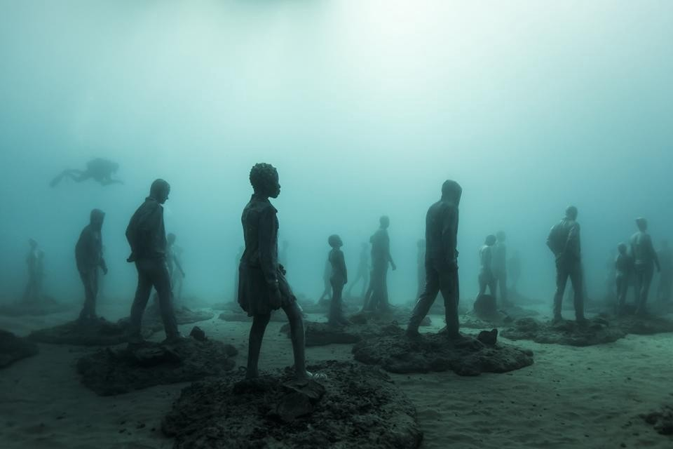
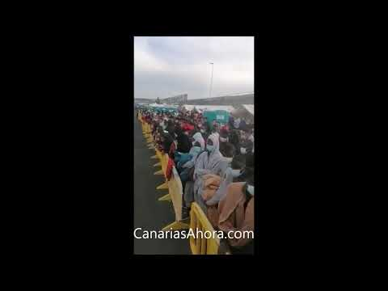

### AYS Special from the Canary Islands: Why did so many people arrive in 2020 and where have they gone?

_This year saw the highest number of arrivals on the Canary Islands since 2006\. Approximately 22,000 people, including around [2,500 unaccompanied children](https://www.infomigrants.net/en/post/29357/a-child-needs-more-than-food-and-shelter-the-fate-of-unaccompanied-minors-on-the-canary-islands) , have made this perilous journey in 2020, an increase of over 800% from 2019\._

\(Image credit: Jason deCaires Taylor, Museo Atlantico \(2016\) Lanzarote\)

The Canary Islands have long been a site of international immigration stretching back beyond [Spanish colonialism](https://theanarchistlibrary.org/library/john-connor-precedent-for-the-new-world-the-spanish-conquest-of-the-canary-islands) and [the slave trade](https://archaeologynewsnetwork.blogspot.com/2017/01/oldest-cemetery-of-african-slaves-found.html) and forward to more recent times with high levels of [retirement migrants from Europe](http://www.scielo.org.mx/scielo.php?script=sci_arttext&pid=S1665-89062007000100004) \. However, in 2020, it has once again been arrivals by small boats which have made the news just as they did in the [1990s and early 2000s](http://www.redcross.int/EN/mag/magazine2006_2/12-14.html) \.

The rise and fall in the arrivals of small boats carrying people from African countries [as far away as Senegal](https://www.thenewhumanitarian.org/news-feature/2020/12/7/senegal-canary-islands-migration-overfishing-coronavirus-restrictions) , 1,500km, \(for comparison, the distance between Tripoli and Lampedusa in the central Mediterranean is 355km\) has usually operated in relation to restrictions brought in for other routes, especially those which use Ceuta and Melilla as entry points\. Both of these border crossings have become [increasingly militarised](http://www.migreurop.org/article1241.html?lang=fr) in the last decades\. This most recent rise in arrivals can be seen in relation to [increased measures](https://www.infomigrants.net/en/post/22518/morocco-tightens-border-controls-to-spanish-enclave-ceuta) at these borders at the start of 2020, the EU\-funded migration control policies across Africa, the worsening of the situation in Libya, as well as Greek [pushbacks from within Greece’s own territory and at its land and sea borders](https://www.hrw.org/news/2020/07/16/greece-investigate-pushbacks-collective-expulsions) , which have led for [calls for Fabrice Leggeri, the director of Frontex, to resign](https://www.infomigrants.net/en/post/28868/frontex-meps-call-for-eu-border-agency-director-to-resign-over-allegations-of-migrant-pushbacks) \.

The reason that the number of arrivals on the Canary islands fluctuates, and is not a constant flow, is because it is well known to be one of the most dangerous routes in the world\. It is only taken when there are very limited options, just as there have been in 2020\. Up until the 18th of December, at least [593 people](https://reliefweb.int/report/world/over-3000-people-die-during-migration-journeys-2020-despite-covid-19-pandemic) had died on this route since January, a figure which does not include [unconfirmed or invisible shipwrecks](https://reliefweb.int/report/world/over-3000-people-die-during-migration-journeys-2020-despite-covid-19-pandemic) which leave behind no craft or survivors:

> According to IOM’s internal records, at least 14 such cases, totalling around 600 additional lives lost, are not included in the Missing Migrants Project’s records due to a lack of corroborating information needed to record a death according to the project’s methodology\. Reports of invisible shipwrecks largely come from distress calls and reports of missing family members relayed to NGOs who meticulously document such cases\. 

This is a marked increase on previous years\.

■■■■■■■■■■■■■■ 
> **[José Luengo-Cabrera](https://twitter.com/J_LuengoCabrera) @ Twitter Says:** 

> > Western Africa: dead or missing migrants

- Since 2014, an estimated 1,114 migrants have died or gone missing en route to the Canary Islands.
- Close to 600 migrants have been reported as dead or missing in 2020 alone.

Data collected by @[UNmigration](https://twitter.com/UNmigration)'s @[MissingMigrants](https://twitter.com/MissingMigrants) https://t.co/wLjs4fqtD7 

> **Tweeted at [2020-12-28 18:41:18](https://twitter.com/J_LuengoCabrera/status/1343628106591068162).** 

■■■■■■■■■■■■■■ 

The total number of mortalities for people reaching Spain is even higher\.

■■■■■■■■■■■■■■ 
> **[Caminando Fronteras](https://twitter.com/walkingborders) @ Twitter Says:** 

> > 🔴El año más trágico en nuestras fronteras: 2170 personas han muerto en su intento de alcanzar España. #DerechoAlaVida2020 https://t.co/KrsssVGFF1 

> **Tweeted at [2020-12-29 09:04:47](https://twitter.com/walkingborders/status/1343845407223410688).** 

■■■■■■■■■■■■■■ 

The Canary Islands now make up the majority of arrivals in Spain\.

> In November, arrivals on the Canary Islands represented 81% of arrivals in Spain\. Since the beginning of the year, 52% of total arrivals in Spain were on the Canary Islands\. As of the end of November, Spain had received the highest number of arrivals in Europe in 2020, some 37,300 by land and sea, slightly more than Italy, which received some 32,600 in the same period\. In November, 78 people are believed to have died or gone missing along the route to the Canary Islands\. [Relief Web](https://reliefweb.int/report/world/unhcr-regional-bureau-europe-europe-situations-data-and-trends-arrivals-and-displaced-4) 

Of course, all measures which effectively close safer routes and force people towards more dangerous ones are either directly or indirectly funded by the EU\. This is the case for routes both [from or through African countries](https://www.opendemocracy.net/en/beyond-trafficking-and-slavery/after-migration-crisis-how-europe-works-keep-africans-africa/) , and those [from or through Turkey](https://www.statewatch.org/news/2020/december/final-contracts-arranged-for-6-billion-eu-turkey-deal/) \.
#### The Arguineguín Pier Camp — ‘The Dock of Shame’

The controversial pier camp was set up in August as an emergency camp for medical screening, including COVID\-19 testing, and police identification and registration procedures\. By November 10, more than 2,000 people were being kept in this makeshift camp for days and weeks\. As HRW [reported](https://www.hrw.org/news/2020/11/11/spain-respect-rights-people-arriving-sea-canary-islands) , the government had blocked access to journalists, photographers, and television cameras, citing privacy issues and ensuring that very limited information on the conditions within the camp were available to the public\. Spanish authorities likely intended to prevent videos such as the two below from going public:

■■■■■■■■■■■■■■ 
> **[Antonio Morales](https://twitter.com/AMoralesGC) @ Twitter Says:** 

> > No podemos seguir permitiendo el trato inhumano y el incumplimiento del derecho internacional para con las personas migrantes hacinadas en el muelle de Arguineguín. Es inhumano. Es ilegal. @[sanchezcastejon](https://twitter.com/sanchezcastejon) @[joseluisescriva](https://twitter.com/joseluisescriva) @[interiorgob](https://twitter.com/interiorgob) https://t.co/4NlLIcDENR 

> **Tweeted at [2020-10-23 11:56:11](https://twitter.com/AMoralesGC/status/1319608555394183169).** 

■■■■■■■■■■■■■■ 

The camp was finally [closed at the end of November](https://www.infomigrants.net/en/post/28836/spain-closes-controversial-dock-camp-for-migrants-on-gran-canaria) after numerous calls and reports by local and international solidarity group and media outlets\.

■■■■■■■■■■■■■■ 
> **[Sergio Rodrigo](https://twitter.com/SRodrigoruiz) @ Twitter Says:** 

> > #FronteraSUR 🔴 Ahora las autoridades locales desalojan del Puerto de Arguineguin a decenas de migrantes bloqueados desde hace días 👇 https://t.co/kaNdyr0weS 

> **Tweeted at [2020-11-20 17:12:55](https://twitter.com/SRodrigoruiz/status/1329835123609636866).** 

■■■■■■■■■■■■■■ 

#### Barranco Seco\. A new Moria?

From the dock at Arguineguin, around 200 people were transferred to a newly built tent\-camp on military ground in the former ammunition depot at Barranco Seco\. This tent camp is formally a _Centro de Atención Temporal de Extranjeros_ \(Temporary Attention Centre for Foreigners — CATE\), guarded by the police, where migrants cannot stay for more than 72 hours\. A local lawyer [reported](https://alfayomega.es/se-ha-ocultado-el-problema/) about the fact that many of the people in the camp were kept there for much longer\. A priest from the island [lamented](https://alfayomega.es/se-ha-ocultado-el-problema/) the ‘opacity’ of everything that surrounds this structure\.

> “We do not have any information,” he adds\. In fact, no one, apart from the Police or public defenders, has been able to access this place: not social entities, not Church organisations, not even political representatives\. 

There is limited information about other camps and accommodation structures, but Spanish media [reported](https://autonomico.elconfidencialdigital.com/articulo/canarias/mas-10000-inmigrantes-han-llegado-canarias-ultimo-mes-medio/20201221162400062773.html?fbclid=IwAR2pTWKnamCMza30gib64Q68NNMuIDwDcjTf0KHhDjetuje0p-Rm3UAXOEA) in December that:

> The Interior has relocated more than 2,000 immigrants to the Peninsula, specifically, to Andalusia and the Valencian Community\. In the Canary Islands, a new camp has been opened for these people with at least 300 places\. It is the second operational camp that has been erected in Gran Canaria as a result of the increase in immigrants\. Many of the immigrants are staying in hotels and tourist apartments on the island\. With these new camps promoted by the new reception plan of the Ministry of Inclusion, Security and Migrations, it is expected to be able to empty these facilities that began to be used temporarily in the absence of tourists due to COVID\. 

There is also limited access to accommodation centres for unaccompanied children, though visits were allowed to two centres by Save the Children in December 2020\. Housing 40 and 50 children in an old school and a large building with many rooms, respectively\. [InfoMigrants](https://www.infomigrants.net/en/post/29357/a-child-needs-more-than-food-and-shelter-the-fate-of-unaccompanied-minors-on-the-canary-islands) have also reported on an ‘emergency space’ made up of tents in the grounds of an equestrian centre\. The conditions in some of the emergency spaces have lead to concerns for the [mental health](https://www.savethechildren.net/news/concerns-mental-health-thousands-migrant-children-after-dangerous-sea-crossing-canary-islands#:~:text=Save%20the%20Children%20has%20warned%20of%20concerns%20for,the%20West%20African%20coast%20to%20the%20Canary%20Islands.) and general development of children held there\.

> We cannot allow children to stay in temporary emergency spaces for months knowing the serious impact it has on their development\. Only with coordination and co\-responsibility can social cohesion be ensured in the territory and well\-being of these children and adolescents — [Save the children](https://www.savethechildren.es/notasprensa/dia-del-migrante-save-children-pide-no-criminalizar-los-menores-de-edad-que-estan) 

#### Dividing families

At the end of October, Spanish media [reported](https://www.eldiario.es/canariasahora/365-dias-de-migraciones/salimata-diez-ninos-migrantes-separados-madres-canarias-espera-pruebas-adn_132_6306776.html) about a special ‘protocol’ that was allegedly followed only on the Canary islands, which forcibly separated a number of children from their parents after surviving the crossing to the islands\. As [reported](https://www.ecre.org/atlantic-route-arrivals-in-canary-islands-continue-to-rise-more-than-1000-people-cramped-at-arguineguin-pier-children-separated-from-their-parents-for-months-in-order-to-prove-kinship/) by ECRE, a two\-year\-old child was separated from his mother on arrival during the registration process at the Arguineguin pier\. The separation was justified as an anti\-trafficking measure\. “However, the separation was prematurely revoked because the toddler suffered from anxiety and insomnia and stopped eating in absence of its mother\.”

> The procedure was reportedly used in five other cases within the past week in Gran Canaria\. In six cases of separation that occurred in Fuerteventura in August, kinship was finally confirmed on October 16\. By October 20, reunion of the children aged two to ten with their parents had not yet taken place\. The collective Caminando Fronteras reports of cases of separation that lasted up to six months\. Often, very young children are involved, in one case the mother was still breastfeeding\. 

On October 27, The Superior Prosecutor’s Office of the Canary Islands prohibited the separation of children from their families, unless external circumstances proved the need\.
#### Court Cases in Senegal — the criminalisation of movement

> **A Senegalese court has sentenced three fathers to jail after it found that the fathers had pushed their sons to migrate\. They were found guilty of “endangering the lives of others\.”** 

The three men were [sentenced](https://www.infomigrants.net/en/post/28998/fathers-in-senegal-sentenced-to-jail-for-pushing-their-sons-to-migrate) to two years in jail on Tuesday, December 8\. The 14\-year\-old son of one of them died during the crossing in mid\-October\.

The increase of arrivals from Senegal is directly linked to [overfishing by foreign vessels](https://www.thenewhumanitarian.org/news-feature/2020/12/7/senegal-canary-islands-migration-overfishing-coronavirus-restrictions) — mainly Chinese and European vessels — leaving people unable to feed their families\.
#### The Current Situation

In the last days of December, yet more people have risked their lives taking this route\. On the 31st of December [Salvamento Marítimo](https://twitter.com/CGTsalvamento) reported that [approximately 150 people](https://twitter.com/CGTsalvamento/status/1344543910375337985) had been rescued on three boats\. An [additional 30 men, five women and a baby of Moroccan origin](https://twitter.com/CGTsalvamento/status/1344640639930130434) who had been adrift for 5 days in the Atlantic where also rescued 30 miles from Gran Canaria\.

Security measures regarding internal flights have also been heightened at the Las Palmas airport, local journalist told AYS, especially for non\-white people\. Racially profiled security checks are not a new thing at European borders\. At Las Palmas different queues have been created for white and non\-white passengers\. Moreover, there are reports of indiscriminate detention in the local CIE \( _Centro de Internamiento de Extranjeros_ — Detention centre for foreigners\) for all asylum seekers attempting to leave the islands for the mainland, including people with legal travel documents\. A readmission agreement between Spain and Mauritania — and supported by Frontex — allows Spanish authorities to deport asylum seekers of different nationalities to the West African country\. Between mid\-2019 and mid\-2020, nine flights took place, and by March 2020, 140 people had been deported\. As the Global Detention Project [reported](https://www.globaldetentionproject.org/countries/africa/mauritania) , “this procedure raised concerns, as many undocumented people were reportedly deported despite wishing to seek asylum in Spain”\. After being halted due to the pandemic, deportation flights have resumed in November, with one flight per week\.

Spanish authorities are in [negotiations](https://medium.com/are-you-syrious/ays-weekend-digest-28-29-11-2020-italian-institutional-racism-kills-again-f4d777bc97e?source=collection_archive---------0-----------------------) with FRONTEX for support in curbing the number of arrivals\. This collaboration could take the form of a revival of [Operation HERA II](https://frontex.europa.eu/media-centre/news-release/longest-frontex-coordinated-operation-hera-the-canary-islands-WpQlsc) , a Frontex Joint Operation off the West African coast, initiated for the first time in 2007 and the first operation to [attract criticism](https://www.researchgate.net/publication/228244251_The_EU_Border_Management_Strategy_FRONTEX_and_the_Challenges_of_Irregular_Immigration_in_the_Canary_Islands) for the modalities of interception and return of small boats to Senegalese and Mauritanian shores\.

By AYS Info Team — Thanks to [Noémie Lehouelleur](https://www.rfi.fr/fr/tag/no%C3%A9mie-lehouelleur/) and Noelia Rodrìguez Ordoñez for their support\.

**Find daily updates and special reports on our [Medium page](https://medium.com/are-you-syrious) \.**

**If you wish to contribute, either by writing a report or a story, or by joining the info gathering team, please let us know\.**

**We strive to echo correct news from the ground through collaboration and fairness\. Every effort has been made to credit organisations and individuals with regard to the supply of information, video, and photo material \(in cases where the source wanted to be accredited\) \. Please notify us regarding corrections\.**

**If there’s anything you want to share or comment, contact us through Facebook, Twitter or write to: areyousyrious@gmail\.com**

_Converted [Medium Post](https://medium.com/are-you-syrious/ays-special-from-the-canary-islands-why-did-so-many-people-arrive-in-2020-and-where-have-they-gone-c436e2278842) by [ZMediumToMarkdown](https://github.com/ZhgChgLi/ZMediumToMarkdown)._
