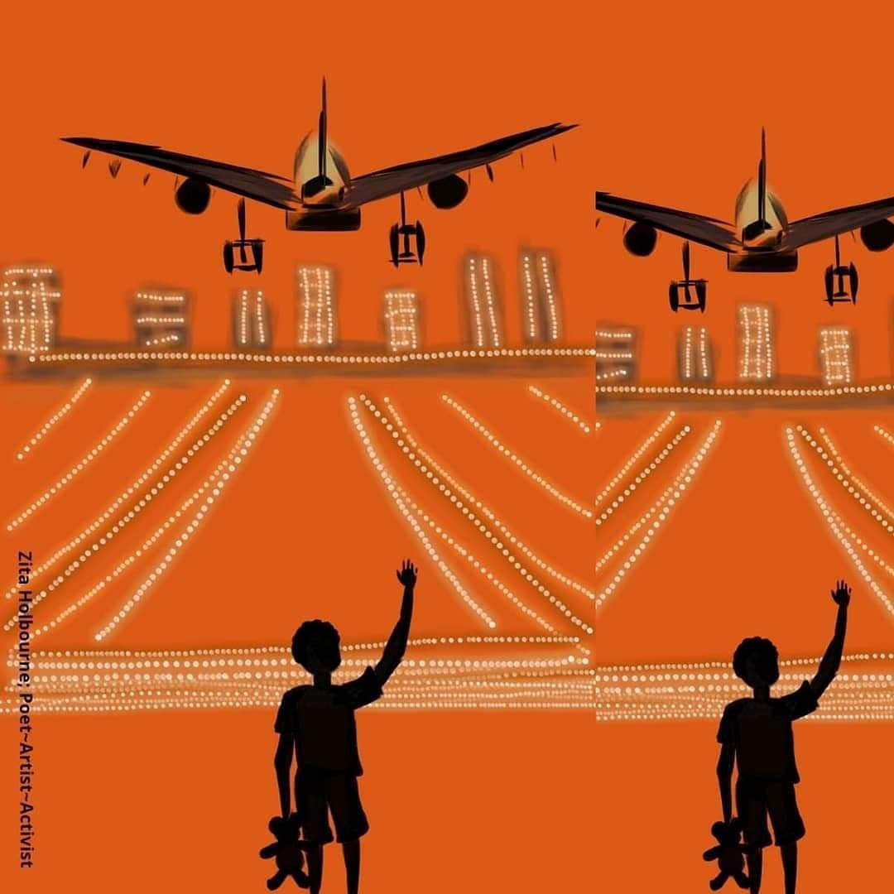
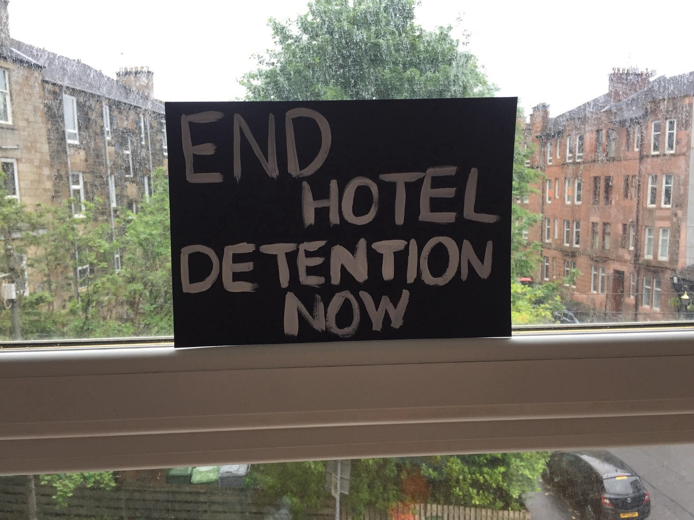

### AYS Special from the UK: Precarity, Deportations and Detention

_In 2020, the UK’s final year as a member of the European Union, anti\-migrant rhetoric took centre stage in British politics — perhaps not surprising given the xenophobic foundation of the ‘leave’ campaign\._

Despite the devastating impact of COVID\-19 from lockdowns to huge unemployment and a complete failure of the state to keep anyone safe from the virus, energy was mustered to continue hostile and dangerous policies towards non\-citizens and people on the move\. Asylum interviews were paused, and have still only partially begun again, meaning [over 60,000 people have now been waiting over 6 months](https://www.refugeecouncil.org.uk/latest/news/asylum-claims-fall-as-people-waiting-more-than-six-months-for-a-decision-hits-record-high/?fbclid=IwAR1s2KA_cFDoj-m1nKAmjaUKhWoiLQG9lhBUUJQOy8H_cXveY16LLoNDDgA) for their interview, leaving them to live in limbo with no money and in substandard housing\. Lockdown also meant many appeal hearings were [moved to online platforms](https://www.refugeecouncil.org.uk/latest/news/changes-to-home-office-asylum-resettlement-policy-and-practice-in-response-to-covid-19/) despite a lack of internet in asylum accommodation, meaning people struggled to attend their hearings\.

> _While the callous attitude of the government towards people on the move comes as no surprise, ongoing hostile policies such as No Recourse to Public Funds \(NRPF\) exacerbated already deeply precarious situations faced by people without secure immigration status\._ 

Alongside this, the end of the Brexit transition period placed future restrictions on family reunification for children on the move, and spelled out [an end to the UK using the Dublin regulation to deport people across Europe](https://commonslibrary.parliament.uk/research-briefings/cbp-9031/) — though this did not stop them hoping to deport 1000 people before the end of 2020\. The lack of Dublin transfers due to the pandemic also meant that many people who had the right to be reunified with their families were not as [transfers were for the most part suspended](https://www.refugeecouncil.org.uk/latest/news/changes-to-home-office-asylum-resettlement-policy-and-practice-in-response-to-covid-19/) \. As a part of this, “ [Operation Sillath](https://committees.parliament.uk/oralevidence/793/default/) ” saw the ongoing militarisation of the English Channel as a space of violence and criminalisation of people on the move, and expedited asylum procedures as well as often unlawful removals of people who arrived by small boat were implemented\.

> [_Covid outbreaks in detention centres_](https://www.bbc.co.uk/news/uk-england-sussex-55267514) _, [rushed charter](https://novaramedia.com/2020/11/18/deportation-flights-to-the-eu-have-increased-threefold-as-the-uk-rushes-to-return-asylum-seekers-before-brexit/) flights and the use of [warships](https://www.independent.co.uk/news/uk/politics/migrant-channel-crossings-news-mayor-calais-navy-ships-war-a9667051.html) and [drones](https://www.forces.net/news/army-drone-fly-over-channel-monitor-migrant-crossings) followed as the Home Office scrambled to deport as many people as possible before the year was out and as they attempted to forge new agreements with French authorities\._ 

### Precarity in the midst of a pandemic

A person with [NRPF](https://www.londoncouncils.gov.uk/our-key-themes/asylum-migration-and-refugees/no-recourse-public-funds) has no access to housing, healthcare, welfare or any other formal support\. This vindictive policy is key to the “ [Hostile Environment](https://www.jcwi.org.uk/the-hostile-environment-explained) ”\. During a pandemic in which many people lost their jobs, and where charities, NGOs and grassroots support groups were forced to close their doors, tens of thousands of people became completely shut off from their support networks or means to support themselves\.

> _This has proved to be fatal in the case of [Mercy Baguma](https://www.independent.co.uk/news/uk/home-news/mercy-baguma-asylum-seeker-death-glasgow-home-office-a9687486.html) who died with their small child in Glasgow as a direct result of NRPF\._ 

Even now many organisations have not reopened their doors due to lockdown restrictions, meaning many people have now gone almost a year without vital support\.

[Migrants Organise](https://www.migrantsorganise.org/) and [MedAct](https://www.medact.org/) [reported on the hugely detrimental impact](https://neweconomics.org/uploads/files/Patients-Not-Passports-Migrants-Access-to-Healthcare-During-the-Coronavirus-Crisis-FINAL.pdf) of this policy on people being too afraid to access healthcare\. Despite COVID being on the exemption list, they found there to be a deep mistrust and fear prevalent within communities that meant people often avoided healthcare for as long as possible, which again had fatal effects when a Filipino migrant Elvis lost their life due to a delay in seeking healthcare for COVID\.

> _Emergency accommodation for people with NRPF has also been used as a means for identifying and targeting people for deportation\._ 

At the beginning of the pandemic, emergency accommodation was offered to people who had had their asylum claim refused, as the conditions set by [Section 4 \(Asylum Support\) of the 1999 Immigration and Asylum Act](https://www.gov.uk/government/publications/asylum-support-section-42-policy) asylum support mean that, if it is not possible to travel out of the country, then the Home Office has a duty to prevent destitution\. However, once the initial lockdown ended, the Home Office began to [send threatening letters](https://www.theguardian.com/politics/2020/nov/06/home-office-high-court-asylum-seeker-evictions-coronavirus) to people they had housed, telling them they not only needed to leave the accommodation, but also the country and that they may be forcibly removed\.
### Operation Sillath

The increase of people arriving to the UK by small boat — reportedly [around 8,000 people](https://www.bbc.co.uk/news/uk-england-kent-54908337) as of September this year — meant that people seeking safety were instead met with punitive measures\.

“Operation Sillath” was [launched in May](https://www.theguardian.com/world/2020/may/21/home-office-deporting-migrants-who-cross-channel-in-small-boats) , which saw a new charter flight deportation programme to rush through Dublin deportations before the Brexit deadline of December 31st\.

> _As a part of this programme, between April and September this year [510 people have been deported from the UK](https://www.independent.co.uk/news/uk/home-news/home-office-deportation-flights-asylum-seekers-b1769938.html) , costing millions of pounds — the flights between July and September cost over £2 million for 225 people\._ 

Despite these deportations being judged as unlawful on multiple occasions, the commercial airlines [TUI](https://www.tui.co.uk/) and [Hi Fly](https://www.google.com/search?client=safari&rls=en&sxsrf=ALeKk038TuntXdhCFZCJuG34IVaHBrq2wA%3A1609671685390&ei=BaTxX825F8qa1fAP7OOLwAw&q=hi+fly+&oq=hi+fly+&gs_lcp=CgZwc3ktYWIQAzIECCMQJzIFCAAQyQMyAggAMgIIADICCAAyAggAMgIIADICCAAyAggAMgIIAFDlG1jlG2DjHWgAcAB4AIABb4gB2gGSAQMwLjKYAQCgAQGqAQdnd3Mtd2l6wAEB&sclient=psy-ab&ved=0ahUKEwiN0Iyozv_tAhVKTRUIHezxAsgQ4dUDCAw&uact=5) have been complicit in these removals\. The Home Office appointed a “Clandestine Channel Threat Commander” to run Channel operations with a militarised approach\.

A [report written](https://corporatewatch.org/cast-away-the-uks-rushed-charter-flights-to-deport-channel-crossers/) by [Corporate Watch](https://corporatewatch.org/about/) and [Calais Migrant Solidarity](https://calaismigrantsolidarity.wordpress.com/) speaks to the reality for people forced violently onto a charter flight on August 26th, where the majority of people on the flight had self\-harmed and tried to kill themselves to avoid deportation to France and Germany\.

> _Despite this, the flights went ahead and people who were seriously injured found themselves dumped at French and German airports with no access to asylum procedures or much needed support\._ 

This is despite assurances from the French authorities that they would take legal responsibility for the asylum claims of those returned, however people were instead given expulsion papers \(‘Order to quit France’ and ‘Ban from returning to France’ or ‘OQTF’ and ‘IRTF’\) with only 48 hours to leave the country\.

Likewise, a charter flight to Madrid resulted in a similar outcome in September when 12 Syrian people were [left with no access to food or water](https://www.theguardian.com/uk-news/2020/sep/03/we-dont-know-what-to-do-asylum-seekers-flown-to-spain-by-home-office) as they were dumped at the airport\. This led to a court ruling further flights to Spain to be unlawful\. However, this did not stop the Home Office [trying to deport people](https://www.independent.co.uk/news/uk/home-news/home-office-high-court-refugees-deportation-flight-cancelled-b455779.html) to Madrid on multiple occasions, which they did manage successfully more than once\.

> _These practices not only expose the cruelty and desperation of the Home Office in light of meeting over bloated and politicised targets for deportations, but they also undermine the Home Office’s argument that people will be safe and have access to fair asylum procedures in other EU Member States\. This is especially true when those deported have just been subject to even more traumatic practices of detention, violent deportation and in many cases self\-harm\._ 

Despite [Article 31 of the Refugee Convention](https://www.refworld.org/pdfid/3bf9123d4.pdf) stating that it is unlawful to punish people for their means of arrival, the Home Office followed an expedited asylum procedure for people arriving by small boat in a cruel attempt to deter people taking this route\. [Conditions have been decried as inhumane](https://www.theguardian.com/uk-news/2020/nov/13/asylum-seekers-crossing-channel-face-inhumane-treatment-observers-say) , with complete disregard for mental and physical wellbeing of detainees, with people being moved despite having serious injuries and denied the medical care they needed\. Most notably, people crossing by boat were [denied access to fair asylum procedures](https://corporatewatch.org/cast-away-the-uks-rushed-charter-flights-to-deport-channel-crossers/) having their screening interviews rushed through in detention centres at the Asylum Intake Unit in Kent and at Yarl’s Wood\. In fact, the Home Office has been found to have been in [breach of trafficking and torture safeguards](https://www.freemovement.org.uk/high-court-orders-emergency-fix-to-asylum-screening-interviews/) , providing satisfactory legal access and screening interview procedures\.

> _This has meant that victims of trafficking or torture, as well as minors, have faced unlawful removal orders and have been ‘Dublined’ without being able to get the legal advice they are entitled to\._ 

Recent attempts to criminalise people arriving by boat also include [prison sentences for those driving the boat](https://www.independent.co.uk/news/uk/home-news/channel-crossings-migrant-boats-jailed-dinghies-smugglers-cps-b1722937.html) , where people are caught on drone surveillance cameras and charged when they arrive to the UK\. This is framed in the guise of catching smugglers, yet instead criminalises people on the move who are often forced to drive the boat against their will\.

Lawyers who have been key to challenging these unlawful practices have been labelled by the [Home Office in a now deleted tweet](https://www.ein.org.uk/news/home-office-deletes-controversial-twitter-post-accused-activist-immigration-lawyers-disrupting) as “activist lawyers” who “frustrate” attempts to remove “criminals” and “illegal immigrants” through abusing the legal framework of Dublin — something the Home Office claims is a desperate attempt to stop removals before Brexit, when in actuality it is the Home Office trying to rush removals before they no longer have the legal framework to do so\.

> _The vilification of lawyers for highlighting where and when the Home Office breaks the law is extremely worrying, showing the Home Office believe themselves to be above the law and this has led to [violent attacks on the legal firms involved](https://www.duncanlewis.co.uk/news/_Attacks_on_Duncan_Lewis_Solicitors_and_legal_aid_undermine_the_rule_of_law_and_an_individual’s_constitutional_right_to_access_to_justice_(7_October_2020).html) \._ 

On top of this, a huge investment of [£30 million](https://www.ft.com/content/a294a05c-b4d5-45a4-8d55-835d9ba27c53) has been made by the UK to France, after tens of millions were already paid to them in 2019\. This is to fund an agreement to double police presence on the beaches of Calais and Dunkirk and across over 150km of coastline resulting in more violent evictions and encounters on the beaches\. An enhanced surveillance package — including drones, radar equipment, cameras and optronic binoculars — will be rolled out by both French and British authorities\. Alongside this, [French warships](https://www.lavoixdunord.fr/516449/article/2019-01-05/des-moyens-renforces-dans-le-detroit-du-pas-de-calais-pour-sauver-des-vies-33) are patrolling the coast and UK border force patrol vessels are patrolling the British waters with help from [Royal Air Force Surveillance planes\.](https://abcnews.go.com/International/wireStory/uk-flies-air-force-plane-channel-amid-migrant-72277607) This is all part of a joint [“comprehensive action plan”](https://www.euronews.com/2020/08/11/migrant-channel-crossings-uk-and-france-in-talks-as-more-boats-attempt-dangerous-journey) to completely cut off the Channel as a means of entering the UK\.

> _Other threats of [forced fingerprints on the French](https://www.law.ox.ac.uk/research-subject-groups/centre-criminology/centreborder-criminologies/blog/2020/07/confined-border) side and the use of [wave machines](https://www.independent.co.uk/news/uk/politics/english-channel-crossings-wave-machine-island-b1765077.html) have also been thrown around as a means of fulfilling this contentious and dangerous goal\._ 

These measures have only worked to [make the UK / French border a more deadly space](https://www.law.ox.ac.uk/research-subject-groups/centre-criminology/centreborder-criminologies/blog/2020/10/border) \. This year has seen multiple people losing their lives as a direct result of the punitive and harsh policies enacted by UK authorities in a desperate attempt to divest themselves of their responsibility to help those in need of safety\.
### Detention and accommodation

As the Home Office sought to create an “ [unviable” situation](https://twitter.com/pritipatel/status/1291713755953410049?lang=en) for people arriving on boats, people were placed in hotels, detention centres or remote army barracks as supposedly short term, emergency accommodation where they faced huge barriers to legal advice\. [Criticism has been repeatedly raised](https://www.theguardian.com/uk-news/2020/dec/07/lawyers-denied-access-to-asylum-seekers-in-kent-barracks) about access to legal support for people forced to live in these places\. This is alongside the continued privatisation of asylum accommodation carried out by [companies like Serco and Mears](https://morningstaronline.co.uk/article/h/sheffield-asylum-seekers-mears-facing-sack) , who use cheap, damp and dangerous housing stock to ensure the biggest profit possible to the detriment of the people they house\.

The use of hotels by these companies was quickly expanded at the beginning of the pandemic\. With the Home Office announcing a [pause in evictions](https://www.refugeecouncil.org.uk/latest/news/refugee-council-welcomes-home-office-move-to-halt-asylum-evictions-due-to-covid-19/) for those granted refugee status in light of the first lockdown in March, causing an even more pressing shortage of accommodation\. [Infamously shoddy hotels](https://www.business-live.co.uk/economic-development/britannia-hotels-whos-behind-firm-17157591) such as the ‘Britannia Hotel’ chain have since become commonly used for ‘short term’ accommodation, though many people have now been stuck there for months\. The hotels have been called out for being akin to detention by the [End Hotel Detention / Glasgow No Evictions](https://www.facebook.com/noevictions) group in Scotland, with little freedom or dignity for people housed there\. Due to the hotels being full\-board, people are either not given any money to buy food or other necessities or given a measly £5 a week to buy basic supplies\. Crowded conditions have had a hugely detrimental impact of people’s mental health and in more than one case led to suicide and [violence](https://www.theguardian.com/uk-news/2020/dec/15/revealed-shocking-death-toll-of-asylum-seekers-in-home-office-accommodation) \.

> _In 2020, [29 people have died in asylum accommodation in the UK](https://www.theguardian.com/uk-news/2020/dec/15/revealed-shocking-death-toll-of-asylum-seekers-in-home-office-accommodation) \._ 

The use of hotels has also meant an increased easiness for immigration raids to take people to charter flights, as more people are housed together, and the raids are aided by hotel staff\.

Despite ongoing [calls to end detention](https://www.redpepper.org.uk/the-politics-of-covid-19-urgent-calls-to-end-immigrant-detention/) in the UK, and an initial lowering of numbers detained across the country, the increased use of short\-term holding facilities — including the [repurposing of Yarls Wood](https://www.bbc.com/news/uk-england-beds-bucks-herts-53810521) — for people arriving by boat has meant detention practices remain rife\. As COVID continues to run rampant across the UK it is unsurprising that outbreaks have now happened within Brook House detention centre\.

> _At least one person deported then tested positive for [COVID immediately after landing in Jamaica](https://www.theguardian.com/world/2020/dec/05/prisoner-deported-uk-jamaica-test-covid-19-windrush-coronavirus) , after having been held in detention in the UK for a month\._ 

This was after the controversial [Jamaica50](https://www.independent.co.uk/news/uk/home-news/jamaica-50-covid-deported-home-office-priti-patel-windrush-b1766685.html) flight in December, where 13 people were deported despite huge public outcry as a last\-ditch attempt by the Home Office to meet their 1000 people deportation target\.

As well as this, the use of army barracks in both Pembrokeshire and Kent has meant hundreds of people have been forced into abhorrent living conditions, as documented in another AYS special [here](ays-special-a-voice-from-inside-penally-refugee-camp-57f8ea247ab7) \.

> _Volunteers in these camps have [reportedly been forced](https://www.theguardian.com/uk-news/2020/nov/23/home-office-accused-of-cover-up-at-camp-for-asylum-seekers) to sign Official Secret Acts, a pathetic attempt to conceal the horrific conditions\._ 

As Wales and South East England have been placed into the highest tier of COVID restrictions, with especially high numbers of cases in the South East, further dangers await those forced to live in overcrowded and unsuitable accommodation\.
### 2021?

As the UK closes its’ borders, the actions of this year in criminalising, penalising and excluding people on the move looking for safety are likely to get much worse\. The end of family reunification under the Dubs amendment, means that many children could be left without recourse to join family members in the UK\. The New Immigration Act — which ends free movement for EU nationals — also gives the Home Office powers to refuse people leave to remain status if they are homeless and sleeping rough\.

The Home Secretary, Priti Patel, has quietly introduced a raft of [changes to the Immigration Rules](https://assets.publishing.service.gov.uk/government/uploads/system/uploads/attachment_data/file/943127/CCS207_CCS1220673408-001_Statement_of_changes_in_Immigration_Rules_HC_1043__Web_accessible_.pdf) that promises to be [tough on asylum and immigration](https://asylummatters.org/2020/10/13/covid-asylum-13th-october/) \. Within this, “endless” asylum appeals will be banned, people will continue to face punitive measures if they enter through illegalised routes — most notably via the Channel, and new facilities to process asylum claims are in the works\. Perhaps the most worrying of all is a suggestion that, in lieu of the Dublin Regulation, the Home Office wish to send people back to any “safe third country” they have passed through or have a connection to, meaning a majority of claims will be deemed as ‘inadmissible’ — though third countries have not yet signalled if they will accept returns\. Priti Patel has suggested she will “ [send the left into meltdown](https://www.thenational.scot/news/18648491.priti-patel-vows-send-left-meltdown-asylum-reform/) ”\. We just have to promise to return the favour\.

**By AYS Info Team**

**Find daily updates and special reports on our [Medium page](https://medium.com/are-you-syrious) \.**

**If you wish to contribute, either by writing a report or a story, or by joining the info gathering team, please let us know\.**

**We strive to echo correct news from the ground through collaboration and fairness\. Every effort has been made to credit organisations and individuals with regard to the supply of information, video, and photo material \(in cases where the source wanted to be accredited\) \. Please notify us regarding corrections\.**

**If there’s anything you want to share or comment, contact us through Facebook, Twitter or write to: areyousyrious@gmail\.com**

_Converted [Medium Post](https://medium.com/are-you-syrious/ays-special-from-the-uk-precarity-deportations-and-detention-47c0311676c9) by [ZMediumToMarkdown](https://github.com/ZhgChgLi/ZMediumToMarkdown)._
