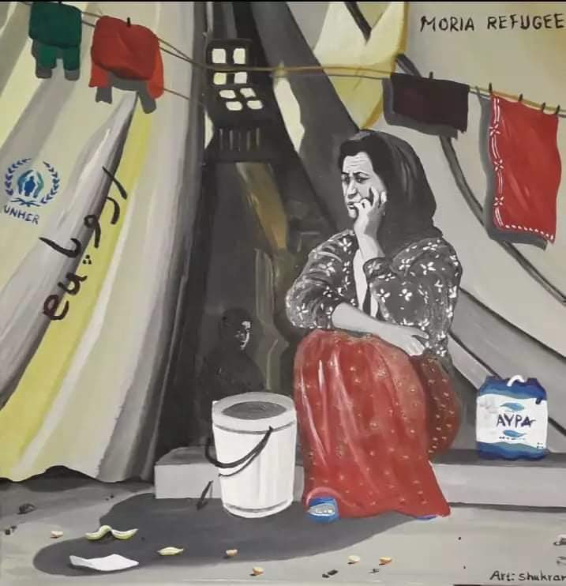
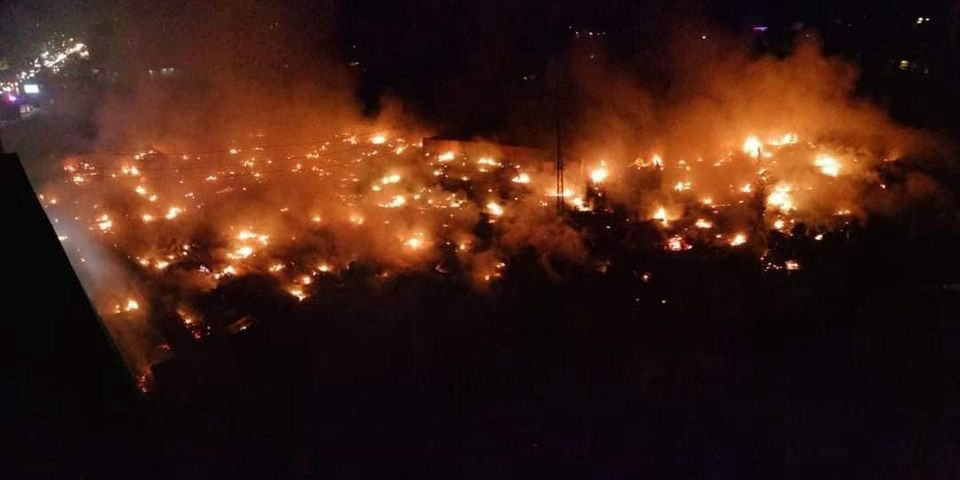
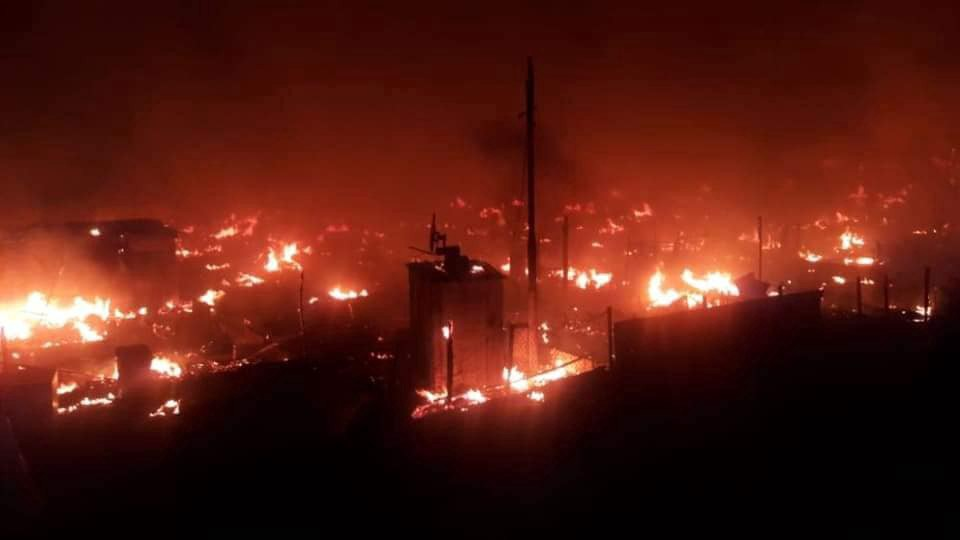
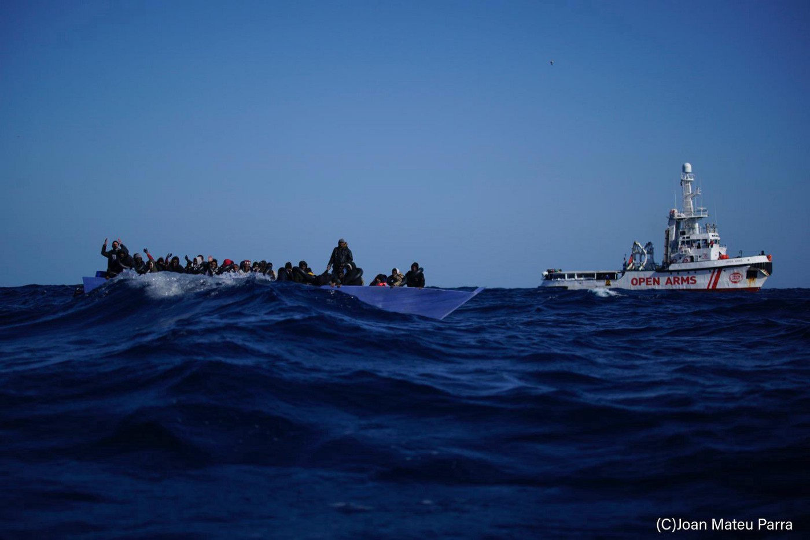
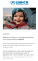
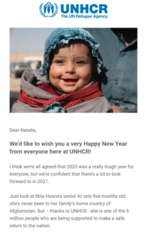

### New Year Digest 25/12–3/1: “National interests are above human rights”
#### Since December 25 at _Are You Syrious?_ we have halted our Daily Digests and published a series of Specials which focused on different topics related to 2020\. With this digest we focus instead on the two weeks at the turn of the year\. From tomorrow we will start with our normal daily reporting\.

I swear… that I will never stay silent\! I swear to smiling of displaced children\. I swear to tears of injured mothers\. I swear to million of hidden dreams\. That, I will never stay silent\! \(extract of a poem by [Parwana Amiri](https://twitter.com/parwana_amiri/status/1345814247201267712) , full poem [HERE](https://brushandbow.com/i-swear-that-i-will-never-stay-silent/) — Illustration by Shukran Shirzad, Iranian artist in Moria 2\.0, Greece\)
### Featured — “National interests are above human rights\.”

This was [stated](https://twitter.com/panlabro/status/1345721319321690113) on Greek national television by Giannis Theodoratos, director of the political office of Development and Investment minister Adonis Georgiadis\.

Greek authorities are proving once more the skewed priorities of their policies\. Migration and the tension with Turkey in the eastern Mediterranean are the last excuse for refusing to set any limits to state powers\. As [researcher Lena K\. commented](https://twitter.com/lk2015r/status/1345769328034127873) , “hostility to human rights, oppression of anyone who doesn’t fit in the ethno\-nationalist, patriarchal conceptions of the ‘nation’, a repressive and authoritarian state have very deep historical roots” in the country\. We at AYS have detailed the trends in militarisation and police brutality in our [Special on the topic](ays-special-from-greece-militarisation-a-tendency-in-2020-891a2e95b8b5) \.
### Moria 2\.0

Lesvos, Greece 2016 \(left\), 2020 \(right\)

On December 31, migration and asylum minister N\. Mitarakis visited Moria 2\.0 again, carrying on his alternative reality propaganda, where everything is fine and everyone is happy in the camp\.

Dunya Collective have [reported](https://twitter.com/DunyaCollective/status/1343935987584360454) that NGO workers were not allowed in the camp on December 29: “It seems that the camp management told this outside the camp this morning\. Official reason: A new registration for Greece was necessary\. No one was informed beforehand\.” [According](https://twitter.com/DunyaCollective/status/1343936758904479747) to the Collective, “Only the state health care and the WHO are allowed to enter the camp … the medical aid organisation BRF is allowed to enter the camp from 5pm for emergency care\. Lawyers have probably been informed\. There is a lot of confusion about this procedure\.” On the following day, only a [handful](https://twitter.com/DunyaCollective/status/1344243815738191872) of NGO workers were allowed in, but many were not\. On January 1, residents of the camp were once again [not allowed to go out](https://twitter.com/DunyaCollective/status/1344594462039748608) :

> _Reason: It’s a holiday and when the shops are closed, they have no business being outside anyway\._ 

### Pushbacks

> _“In 2020, we guarded our borders in Evros, we guarded our borders at sea\. The Coast Guard, in good cooperation with the Navy, with the Armed Forces, we performed our duty\. And of course this is reflected in the numbers, with the arrivals of illegal immigrants, having decreased by more than 80% in 2020 and in fact our islands have been decongested from the big problem they faced a year ago\. So in your person, Mr\. Commander, I want to thank all the officers of the Armed Forces, our Navy, but also of course all the officers of the Armed Forces who fought on all fronts\.” \(K\. Mitsotakis, Greek Prime Minister visiting Hellenic Coast Guard \(HCG\) on Lesvos on December 31, 2020\)_ 

Mitsotakis praised the activities of the HCG during his end\-of\-year visit to Lesvos\. Obviously not a word was spoken on the crimes against people on the move recorded during the year, the push\-backs, or the lives lost at sea\. Aegean Boat Report \(ABR\) [recorded](https://web.facebook.com/AegeanBoatReport/posts/1000121413844296) 12 pushback cases involving 299 people during the last week of 2020\. 6 of these cases was performed by using life rafts, 160 people were placed in a total of 11 life rafts, and left drifting by the HCG\.

In 2020, ABR has registered 321 pushback cases in the Aegean Sea involving 9741 people with 187 life rafts picked up since March, carrying a total of 3067 people\.

At the Evros land border, Alarm Phone [reported](https://twitter.com/alarm_phone/status/1343845867787268096) of a violent pushback on 27 December\. “We just learned that this group has been horribly beaten and violently pushed back to Turkey by Greek border guards\. In total, ~70 people were pushed back over the Evros river\.”

[خلية الإنقاذ و المتابعة / m\.r\.c](https://web.facebook.com/call122/?__cft__[0]=AZUsAZMmJSJhwmGhAwsh-_7ejsURzAdTXyvRPLTRrRh2363qti_atZ8d7QUWrq0NFQ_j2PQDogMv7e0FDO7IxZCJY_RL74Ogfwqjur6yruOz_d1dylI62MUGsi_rYHI0J8ZMJ5eMWWFhBbUX_8EtX7TP&__tn__=-UC%2CP-R) reported on a detailed push\-back \(English translation [at this link](https://www.magentacloud.de/lnk/gYhpCzqm#file) \) at the land border around 25 December\. This report confirms earlier findings of BVMN, with Greek authorities ‘hiring’ people on the move to perform pushbacks over the Evros river\.

LEBANON

\(Photo Credit: [Mohammad Hamoud](https://www.facebook.com/mohammad.hamoud/posts/10224626432427044) \)

On [26 December a fire was started](https://www.aljazeera.com/news/2020/12/27/syrian-refugee-camp-in-lebanon-set-ablaze-after-row?fbclid=IwAR2JC_7NWkQXnv1Kg396ND4O-5gXq6E0mARxjrsunHsU9eniRalen3olRrc) by Lebanese nationals in an informal camp near the town of Bhanine in the north Lebanon Miniyeh region\. It was home to 370 Syrian refugees who all had to flee\. At least 4 people were taken to hospital\.

Lebanon, despite it’s [financial crisis](https://reliefweb.int/report/lebanon/lebanon-complex-emergency-fact-sheet-1-fiscal-year-fy-2021-december-30-2020) , hosts 1\.5 million refugees\.

**SEA**

Winter did not stop people from trying to seek safety in Europe\. Alarm Phone, Aegean Boat Report and other groups kept reporting on distress calls from the Med and the Atlantic route to the Canaries, as well as from the land borders of Europe\.
### Central Med

January 2, Central Med \(Photo by [Joan Mateu Parra, Open Arms](https://twitter.com/openarms_found/status/1345380232933634049) \)

Our thoughts go to the families of the 13 people who have gone [missing](https://twitter.com/alarm_phone/status/1344593109263519744) and are feared dead after having fled Libya on December 24\. They haven’t been seen since\.

On January 2, 7 bodies were [found](http://www.mediterraneocronaca.it/2021/01/03/sette-corpi-in-decomposizione-in-algeria-ancora-strage-di-migranti-foto-e-video/) on the beach in Mostaganem, Algeria\. 1 man, 3 woman and 3 children\.

Only over the past weekend, 160 people were intercepted and [returned](https://twitter.com/msehlisafa/status/1346003948658896896) to Libya, by the Italy and EU\-funded and trained Libyan coast guard

On new years eve, Open Arms [rescued](https://twitter.com/openarms_found/status/1344984668190494720) 169 people\. On January 2 another 79 people were [rescued](https://twitter.com/openarms_found/status/1345380232933634049) \. This second rescue took place in Maltese waters, after the island’s authorities [ignored](https://timesofmalta.com/articles/view/migrants-rescued-in-maltese-sar-zone-after-authorities-ignore-distress.842403) the distress call\. On Sunday, Open Arms was [given](https://twitter.com/openarms_fund/status/1345867028847063040) a safe port\. They are now heading to Porto Empedocle, Italy\.
### Western Med — Atlantic

On December 24, two shipwrecks were reported\. One by [Alarm Phone](https://www.facebook.com/watchthemed.alarmphone/posts/2849537458653812) along the Canary route\. The boat was carrying 59 people, trying to reach Spain via the Atlantic route from Morocco\. 44 people survived and were returned to Morocco\. We fear that the others have died\.

> _We send our solidarity to the families of the missing and dead as well as to the survivors in hospital in Laayoune\. European borders kill\!_ 

The second was [reported](https://www.reuters.com/article/us-europe-migrants-tunisia/at-least-20-die-as-migrant-boat-sinks-off-tunisia-idUSKBN28Y0ZN?fbclid=IwAR3w7DQ2Sj43TfmzdRN4HkPQyNydU_A_4GaeS9jXzODjRoo4BAGdwW6JVis) to have taken place off the coast of Tunisia en route to Lampedusa\. There are thought to have been 45 people on the boat when it sank, only 5 were rescued\. The bodies of 20 people were recovered but the rest remain lost at sea\.

In 2020, Alarm Phone alerted of 434 distress cases along the European borders\. They assisted 120 boats at risk off the coasts of West Africa / Morocco & Spain \(including 45 along the Canary route\), 141 groups in the Aegean Sea or along the Turkish / Greek land border, & 173 boats in the central Mediterranean\.

GREECE
### Racist Attack on Children’s Shelter

[An attack on a shelter for unaccompanied refugee children](https://thepressproject.gr/ratsistiki-epithesi-se-domi-asynodefton-prosfygon-sti-thessaloniki/?fbclid=IwAR3JTnYx2KZYc5pMo9d5PVqf26yjiEiGjVyLFU9-jZoTXRAiBPCNKfXkmj8) operating under the auspices of the Church of Greece took place on the night of December 26, in Oreokastro, Thessaloniki\. According to the structure’s attorney, Thodoris Karagiannis, strangers gathered outside the area with knives, sticks and iron rods, shouted “racist slogans” and then tried to invade the place where the children are hosted\. There are thought to have been ten individuals involved, who once inside [chased and beat the children](https://www.keeptalkinggreece.com/2020/12/27/racists-attack-center-unaccompanied-refugee-children-oraiokastro-greece/) brandishing the weapons they had brought with them\.

One child was taken to hospital and three needed first aid\.
### Protest in Malakasa camp

As [reported](https://web.facebook.com/solidaritymigrants/posts/223272052628665) by Solidarity with Migrants, residents of Malakasa camp outside Athens gathered on December 28 to ask their demands of the camp officials\. The demands include faster and fairer responses for asylum applications, access to doctors and medicine, cash card grants and the right to work\.

ITALY
### Updates from CPRs

The turn of the year in Italy saw more protests, escape attempts, self harm and violent repression in detention centres in [Milan](https://web.facebook.com/NoaiCPR/posts/869114130326761) , [Rome](https://web.facebook.com/NoaiCPR/posts/868951937009647) , [Gradisca d’Isonzo](https://nofrontierefvg.noblogs.org/post/2020/12/26/notte-di-rivolta-al-cpr/) and others\.
### Evicted in the middle of a snowstorm

In Trento, north\-eastern Italy, on December 29, 13 asylum seekers were taken at 4\.30 AM from the centre they resided in and left on the streets\. [According](https://web.facebook.com/assembleaantirazzistatrento/posts/608127743319642) to Assemblea Antirazzista di Trento, authorities removed them from the centre because they had found a seasonal job earlier in the year and did not meet the criteria for residing in the centre\. Not only did authorities do this when a night curfew was in place in the city, but also when temperatures were below 0° and a strong snowfall was covering the region\.

BOSNIA AND HERZEGOVINA
### After the fire

The situation in the Una Sana Canton and especially in Lipa camp has finally attracted coverage by international media\. We have reported on the disastrous conditions in the area for months, thanks to the many groups active on the ground\.

This is an extract from a post of [Ambasada Rog](https://web.facebook.com/ambasadarog/photos/a.466820433652598/1377697385898227/) , Slovenian activist group:

> _The situation in Bosnia and Herzegovina is catastrophic — people are on the verge of dying\. On December 23, the refugee camp Lipa near Bihać — a tent camp, which was supposed to be only a temporary shelter due to the lack of adequate infrastructure and the approaching winter, and which was to be closed at the end of December — was burned down\. More than 1,400 refugees were left without shelter: for almost a week, they were left to sleep in the snow, wind and temperatures below zero\. Most had no warm clothes or shoes, some only had open sandals without socks\. They received one modest meal per day; they slept under the remains of a burnt camp with the danger of structures collapsing due to the snow\. Many are hypothermic, there is a lot of frostbite, and several days ago, they had to revive one boy due to hypothermia\. Many local and international organisations have repeatedly called on local, national and European authorities to relocate refugees to safety; however, political institutions are transferring responsibilities from one to another, thus delaying any appropriate solution\. On the 29 December, buses arrived to the camp to take migrants to another location, but due to the ambiguity of the new location, they had to spend the night on the bus\. Humanitarian organisations warn that due to the approaching winter almost 2,000 refugees are in a dangerous situation, as they had to take refuge in abandoned buildings or forests\._ 

Read the full post [HERE](https://web.facebook.com/ambasadarog/photos/a.466820433652598/1377697385898227/) \.

FRANCE
### Evictions carried on in Calais

Also in Calais, police forces [evicted and destroyed 5 makeshift camps](https://twitter.com/HumanRightsObs/status/1342899218638372872) in the forests around the town on December 25\. More than 30 unaccompanied minors were left with no shelter and were not given alternative accommodation, despite weather forecasts announcing a coming storm and winds up to 120km/h\. Journalists were [prevented](https://twitter.com/LouisWitter/status/1344182282014388224) from covering these evictions\. More evictions took place on [December 30](https://twitter.com/HumanRightsObs/status/1344376523374129153) , [January 1](https://twitter.com/HumanRightsObs) and yesterday, Sunday [January 3](https://twitter.com/HumanRightsObs/status/1345761347699683328) \.

In 2020, L’Auberge de Migrants’ reporting team Human Rights Observers [recorded](https://twitter.com/HumanRightsObs) 973 evictions in the Calais area\.

GENERAL
### Worrying New Years wishes by [UN Refugee Agency](75f2bdd89854?source=post_page-----a87e49b13fea--------------------------------)

“Just look at little Husna’s smile\! At only five months old, she’s never been to her family’s home country of Afghanistan\. But — thanks to UNHCR — she is one of the 6 million people who are being supported to make a safe return to the nation” \(UNHCR, reported by Josoor’s [Natalie Gruber](https://twitter.com/NatalieSGruber/status/1345735669054844928) \)

Josoor’s spokesperson Natalie Gruber published a disturbing Happy New Year email sent by UNHCR to its donors \(in the photo above\) \. She commented:

> _An agency tasked with protecting refugees & ensuring their rights finds optimism in a child being returned to a country that is as far from safe as can be\. And they thank their donors for it\. Donors who would donate to IOM if they wanted to support returns, not UNHCR\._ 

Read the full thread [HERE](https://twitter.com/NatalieSGruber/status/1345735677527392260) \.

WORTH READING
- [**Words Matter\.**](https://picum.org/words-matter/) An important campaign by PICUM \(Platform for International Cooperation on Undocumented Migrants\) \. Calling a certain group of people ‘illegal’ denies them their humanity\. There is no such thing as an ‘illegal’ person\.

> _‘Illegality’ as a form of status has been deliberately assigned to undocumented migrants to justify a category of people who are undeserving of rights\. Do you think lacking residence status should not make a person lose humanity?_ 
 

> _So do we\._ 

Language shapes people’s perceptions\. Discriminatory language in reference to undocumented migrants leads to perceptions and actions which negatively impact the daily realities of undocumented migrants\.
- [Libya: coronavirus has deadly impact on life\-saving evacuations](https://www.irishtimes.com/news/world/africa/libya-coronavirus-has-deadly-impact-on-life-saving-evacuations-1.4448263) \. Sally Hayden analyses how “the pandemic has reduced international attention towards Libya, which continues to be the site of a massive humanitarian crisis, where refugees are trapped in a cycle of suffering, abuse and exploitation\.”

**Find daily updates and special reports on our [Medium page](https://medium.com/are-you-syrious) \.**

**If you wish to contribute, either by writing a report or a story, or by joining the info gathering team, please let us know\.**

**We strive to echo correct news from the ground through collaboration and fairness\. Every effort has been made to credit organisations and individuals with regard to the supply of information, video, and photo material \(in cases where the source wanted to be accredited\) \. Please notify us regarding corrections\.**

**If there’s anything you want to share or comment, contact us through Facebook, Twitter or write to: areyousyrious@gmail\.com**

_Converted [Medium Post](https://medium.com/are-you-syrious/new-year-digest-25-12-3-1-national-interests-are-above-human-rights-2aac462bd400) by [ZMediumToMarkdown](https://github.com/ZhgChgLi/ZMediumToMarkdown)._
