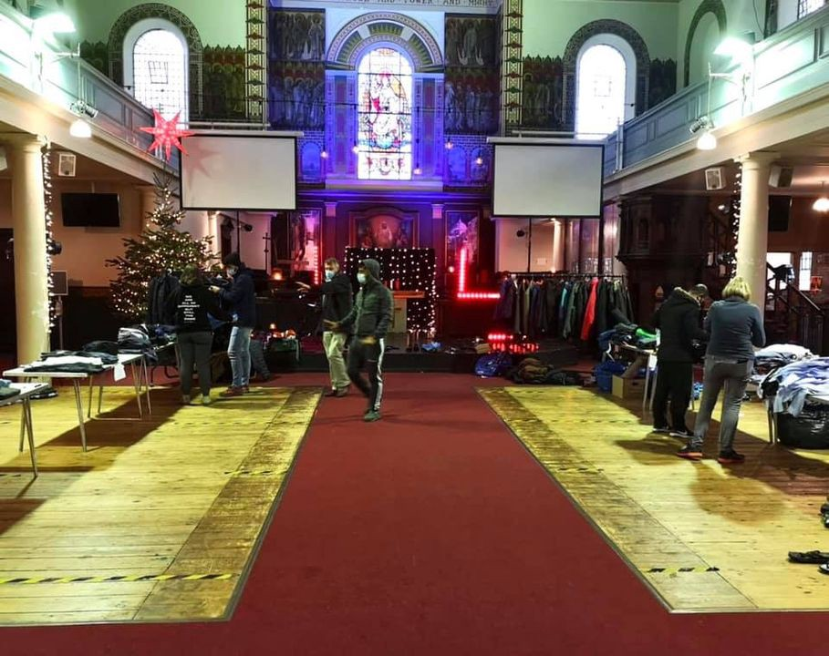

### AYS Daily Digest 05/01/2021: Horrific death of a youngster in Libya
#### Footage from Libya shows a dead boy and and a living boy, both starved to their bones // Greece: More news about worrying new members in cabinet // Updates from Lipa camp // 265 people land in Sicily // Arrivals on Canary Islands // Expulsions from Calais // Deportation scheduled from Germany to Afghanistan // UK: Right\-to\-Remain Toolkit updated to a post\-Brexit version

Distribution of clothes Care4Calais volunteers in a church in London\. Copyright: Care4Calais
### Boy starved to death in Libya

The researcher Guilia Tranchina has reported about the appalling death of a 16 year old boy in Tripoli\. The boy from Somalia apparently died from starvation and tuberculosis\. His 14 year old friend was with him\. The 14 year old is reported to be still alive, but it is very unclear if anybody, besides fellow people on the move, are helping him\. A video published by Giulia on Twitter and Facebook shows a boy, crouched on the floor and weeping\. He appears starved to his bones\. Another picture shows the dead boy, skeletally thin, lying on some blankets on the floor next to the other boy\.

Guilia stated that no NGOs took the responsibility of helping the boy after fellow refugees who found the boy and his dead friend tried to call for help:

> “Other refugees who found them called UNHCR, IOM and IRC but they say that they were told by all agencies that ‘it’s not their responsibility’ to help the sick boy still alive\. Most organisations said it would be UNHCR responsibility as they were both registered as asylum seekers, but nothing has happened so far\. Several hours later IRC came with some officers to remove the dead body, but refused to take care of the sick boy and take him to hospital\.” 

Apparently the boy was later taken to a hospital but released shortly after, again with no support:

> “He was taken by the refugees to UNHCR centre & then to hospital today, given a drip and then discharged again so now the refugees are trying to organise how to help him because he cannot stay alone, sick, without food…& UNHCR apparently said they will go to visit him tomorrow\. \.” 

How can anybody still claim Libya is safe? How can Europe [still push for a Libyan Coast Guard](https://twitter.com/saracreta/status/1346396010470379526?fbclid=IwAR14cP6IMVVhVqqygu9gqtHPnFN-7l2z2LOG4na9FyNdJhlwtaffXpOXXRQ) ? How can there still not be a proper rescue mission for people who try to flee this country?

We decided not to include the footage in the Digest, due to the graphic and shocking nature of the content\. However, you can easily find it on Guilia’s Facebook and Twitter\.

An informative but not too current article about the so\-called Libyan Coast Guard can be found [here](https://www.infomigrants.net/en/post/18196/when-helping-hurts-libya-s-controversial-coast-guard-europe-s-go-to-partner-to-stem-migration) \.
### GREECE
#### Protest against closed centres

Locals have been protesting against closed reception and identification centres continues, on Lesvos as well as on Leros and in the Evros region\. A permanent camp on Lesvos with a capacity of 5,000 people is supposed to be running by the end of September 2021\.

It is a scandal that the new facility will most probably be a closed centre where refugees won’t be allowed to move in and out freely\. [While EU institutions speak about open but controlled facilities](https://twitter.com/Elpida_Amal/status/1338773535943225344) , the Greek government seems to prefer the terms controlled/closed\.

However, many locals are protesting the camp on grounds rooted in racist reasoning\. In the Evros region, the detention centre Fylakio is supposed to be expanded\. According to the plans of the Greek Minister of Immigration and Asylum Notis Mitarakis the new facility would triple the capacity of the existing one\. The area is a stronghold of the right\-wing New Democracy party\. The researcher Lena K\. shows in a thread on Twitter how deeply rooted nationalism and anti\-muslim racism is in this area that has, according to her, always been regarded as a shield against Turkey\.

■■■■■■■■■■■■■■ 
> **[Lena K.](https://twitter.com/lk2015r) @ Twitter Says:** 

> > 1/The @[efsyn](https://twitter.com/efsyn) article on local opposition to the expansion of the Fylakio detention centre doesn't even scratch the surface of local racism - main reason IMO for opposing government plans, even though #Evros has always been a New Democracy stronghold. Samples from the local press: 

> **Tweeted at [2021-01-05 17:53:04](https://twitter.com/lk2015r/status/1346515069702721537?fbclid=IwAR1MsbTBhcsaidKEX0dnHvovoYiRGkAs_VJ_y6ue6girVY5C0aDP4_QXhsI).** 

■■■■■■■■■■■■■■ 

On Leros too, the [Municipality objects the decision](https://www.efsyn.gr/node/275526) of the state to construct a new reception and identification centre\. The Municipality appealed against the state’s decision stating that the choosen location is a protected area\.
#### Swearing in of new cabinet members

In [yesterday’s digest](ays-daily-digest-04-01-2021-hunger-strike-in-remnants-of-lipa-f733b436dde6) we reported about the reshuffling of the Greek cabinet under Prime Minister Kyriakos Mitsotakis\. The new cabinet was sworn\-in on Tuesday\. Some of the new members of the cabinet have close ties to fascist movements\.

This thread gives a good overview of the racist, anti\-Semitic and antiziganistic position of some of the new members of the Greek cabinet:

■■■■■■■■■■■■■■ 
> **[Vassilis Tsarnas](https://twitter.com/VassilisTsarnas) @ Twitter Says:** 

> > #Greece: Sum-up on the new gov. Voridis, an ex-axe-wielding fascist is our new Interior Minister. Voultepsi, translator of Milošević's wife, who said the #Roma live next to humans, #Migrants are invaders &amp; the press is owned by Rothschild, is the new dep Minister of Migration 1/4 

> **Tweeted at [2021-01-04 17:03:22](https://twitter.com/VassilisTsarnas/status/1346140173109776385).** 

■■■■■■■■■■■■■■ 

In addition to the people named in the thread, the new deputy Minister of Shipping, who is also responsible for the Hellenic Coast Guard, was [asking in a TV interview last year what is matter with pushbacks of refugees](https://thepressproject.gr/ypourgopoiithikan-o-ti-kako-echei-to-pushback-kai-o-thelete-kasidiari-kyria-kanelli/?fbclid=IwAR2-wCf1fYQH0m0Snh_ylCKVVSiQxYxl95FUp981DuV8FDwYHFvC0dsyb7U) \.
#### Recommended

Follow Pawarna Amiri on Twitter\! This young woman finds incredibly strong words for describing her life and the life of people around her in Ritsona refugee camp in Greece\. She is the author of _Letters to the World from Moria_ and a strong, young, and female voice that needs to be heard\!

■■■■■■■■■■■■■■ 
> **[Parwana Amiri پروانه اميري](https://twitter.com/parwana_amiri) @ Twitter Says:** 

> > 1000 stories and dreams from Ritsona (No.03)
“Story of a bitter past, a lost present and an unclear future” 
~If the world is reading me, they should know that there are eyes which, over sleepless nights, have shed floods of tears.
#LeaveNoOneBehind https://t.co/2JVY1YD6Zx 

> **Tweeted at [2021-01-04 17:54:56](https://twitter.com/parwana_amiri/status/1346153150479265793).** 

■■■■■■■■■■■■■■ 

#### What life in Moria 2\.0 looks like in winter months

■■■■■■■■■■■■■■ 
> **[refocusmedialabs](https://twitter.com/refocusmedialab) @ Twitter Says:** 

> > #happynewyear2021 from #Lesvos #Greece---#EuropeMustAct &amp; #LeaveNoOneBehind 
Footage/edit:@[refocusmedialab](https://twitter.com/refocusmedialab) https://t.co/aKdi2veHr1 

> **Tweeted at [2021-01-05 19:30:20](https://twitter.com/refocusmedialab/status/1346539550483636229?fbclid=IwAR2U_yu-o5r7kfCKpDxMqCMGHptijKmZJGRhZusyu2rjzFc8aFaKPxVilUI).** 

■■■■■■■■■■■■■■ 

### BOSNIA AND HERZEGOVINA
#### Updates from LIPA

We continue to closely follow the situation in Lipa, Bosnia, where about 900 people stay in a burned down camp that wasn’t prepared for winter conditions even before the fire\. 
This video gives an overview over the unfolding situation:

■■■■■■■■■■■■■■ 
> **[InfoMigrants](https://twitter.com/InfoMigrants) @ Twitter Says:** 

> > A fire at the #Lipa migrant camp in #Bosnia on December 23 left hundreds of people stranded in squalid conditions, with no facilities or heat. Heavy snowfall towards worsened their situation and many have also been sick and in need of medical attention. https://t.co/YU41wXvTDz 

> **Tweeted at [2021-01-06 08:26:16](https://twitter.com/InfoMigrants/status/1346734817363324929).** 

■■■■■■■■■■■■■■ 

After a hunger strike, people appear to have resumed eating food distributed by Red Cross\.

Peter Van der Auweraert, chief coordinator for the International Organization for Migration \(IOM\) in the region [claims that the problem lies with local and federal political fighting](https://euobserver.com/migration/150507?fbclid=IwAR0GcuHVuBdfUEgHO3JCdKxlTmw7Q4jMcqXXpwbau4ONgQZc7faEeXW3zug) \. In the decentralised state governance structures in Bosnia and Herzegovina, it is hard to find a solution\. However, it is obvious that once again the EU turns a blind eye\. Many people on the move have left an EU country \(Greece\) in order to reach the central EU states\. By violently blocking the Croatian EU borders, Europe produces the situation that these people find themselves in\. 

45 members of the European Parliament have sent a letter to the responsible Bosnian and European authorities, expressing their concern about the situation:

The pictures we see from Lipa these days mainly show men\. But in fact, many of the people stuck in Bosnia and Herzegovina are women and children, some of them unaccompanied\. They are accommodated in the IOM centres in Ušivak \(near Sarajevo\), Borići \(Bihać\), and Sedra \(between Bihać and Velika Kladuša\) \. These camps host about 1,500 people, mainly women, children and families\. While the conditions are definitely better than in the burned down Lipa camp or in the woods around, where another 2,000 people are said to be camping, there is no long term solution in place for even the people in the functioning camps\. This thread \(in German\) speaks about the pictures and the situation of women and children in BiH:

### SEA
#### Rescued people land in Sicily

265 people who have been rescued by the NGO vessel Open Arms landed on Porto Empedocle in Sicily on Tuesday morning\. We are happy that they are now in a safe port\! [According to the Austrian news paper Der Standard](https://www.derstandard.de/story/2000122945057/italien-verordnet-open-arms-crew-quarantaene?fbclid=IwAR2fyWGMrZYMejBnfMf51BDcPj-Ph86Gbn-zFqdMrn6KxBLvU3muw6kgot0) , the crew of the Open Arms has to undergo quarantine and the ship is not allowed to leave the port\.

■■■■■■■■■■■■■■ 
> **[Open Arms ENG](https://twitter.com/openarms_found) @ Twitter Says:** 

> > And already at dawn in #PortEmpedocle, we have just transferred 265 people who today are about to start a new life (in quarantine) in a safe place that, hopefully, will treat them better.  #eachlifeccount #med https://t.co/3Y8U8z2eW9 

> **Tweeted at [2021-01-05 07:59:06](https://twitter.com/openarms_found/status/1346365595869212672).** 

■■■■■■■■■■■■■■ 

#### Sea\-Eye files legal cases against arrest ALAN KURDI

For three months now, the Italian coast guard has not allowed the ALAN KURDI ship of the NGO Sea\-Eye to start a new rescue operation\. The ship is currently being held in Sardinia\.

[According to Sea\-Eye,](https://sea-eye.org/sea-eye-verklagt-italien-wegen-blockade-der-alan-kurdi/?fbclid=IwAR2q7Qf_MgSyWFalPfoD0Iyi7gXb1mGaaPG3mKs2QMuyiGchFd3mZbJACeE)

> “The Italian coast guard argues, among other things, that the ship has too few toilets on board, the holding tanks are too small and there are too many life jackets on board\. The same politically motivated arguments are used by the coast guard against other German rescue ships\.” 

### SPAIN
#### Canary Islands

On Tuesday, four people were found dead on a boat carrying 47 people that landed on Tenerife at dawn\. Three people had to be hospitalized with dehydration and chemical burns caused by the mixture of sea water and motor fuel\. According to media, one of the four dead persons lost his/her life after reaching the beach\. Medics who were present were not able to save the person\.

In total, about 96 people arrived on Tuesday 5th January on the Canary Islands\.

In 2020, the number of arrivals on the Canary Islands was eight times higher than in 2019, the Spanish Interior Ministry said on Monday\. About 23,000 people arrived on the islands in 2020\.
#### Alborian Sea

48 people, including seven women and two children, have been rescued by Salvamento Marítimo on Tuesday afternoon in the vicinity of the island of Alboran\.

### FRANCE
#### Calais — evictions increased in December

During December, the number of evictions increased around Calais, and have continued into the new year\. The NGO Human Rights Observers reported on the expulsions of 18 living areas of people on the move in the first five days of 2021\. [Several cases of hypothermia have been reported](https://www.lemonde.fr/societe/article/2021/01/04/a-calais-en-plein-hiver-les-evacuations-se-multiplient-sans-solution-perenne_6065107_3224.html) \.

■■■■■■■■■■■■■■ 
> **[Human Rights Observers](https://twitter.com/HumanRightsObs) @ Twitter Says:** 

> > Ce matin à #Calais : les FDO #expulsent 6 lieux de vie

Parmi les personnes expulsées, plusieurs mineurs non-accompagnés, qui n'ont bénéficié d'aucune prise en charge ou solution alternative d'hébergement

Les droits fondamentaux ne sont toujours pas respectés à la frontière https://t.co/DBRKNSE43E 

> **Tweeted at [2021-01-05 19:29:26](https://twitter.com/HumanRightsObs/status/1346539322170867715).** 

■■■■■■■■■■■■■■ 

Between 400 and 800 people live in makeshift camps around Calais\. Police and the prefecture are constantly trying to make these peoples’ lives as hard as possible\.
#### Police Violence at Italian\-French border

The NGO Kesha Niya reported an extraordinary amount of police violence over Christmas\. They assume that the reason for the increase was the fact that only a small number of local people were traveling on the trains due to the corona measures and the holidays\. The actions of the police were witnessed even less then usual\. They NGO reports about racist insults, tear gas sprayed into train toilets with people inside, beatings and continual denials of requests for asylum\.

For pictures and regular updates visit there Facebook page\.
### GERMANY
#### Deportation to Afghanistan scheduled

According to anti\-deportation NGOs, a deportation to Afghanistan is most likely scheduled for Tuesday, 12th January 2021\. Many people from Afghanistan do not have to fear being deported\. However, everyone who is obliged to leave the country should contact a lawyer and make sure that the immigration authority \(Ausländerbehöre\) is informed about possible diseases, beginning of apprenticeships or other so called integration achievements\.

For more information in German and Dari, see:

### UK
#### Right\-to\-Remain Toolkit — post\-Brexit version now online

The organization Right to Remain published an updated post\-Brexit version of its step\-by\-step guide to the UK asylum and immigration system\. The guide gives an overview of the legal system and procedures, with detailed information on rights and options at key stages, and actions people can take in support of their claim, or to help someone else\. The toolkit is available in different languages\.

You can find it here:

#### Pandemic\-conforming distributions

Care4Calais is finding ways to support the people most in need during the lockdown\. In East London, a socially distanced distribution of clothes was set up in a church\. The activists managed to comply to all rules and measures in place in order to prevent COVID\-19 from spreading\.

Care4Calais promised that they

> “will continue to provide essential support to asylum seekers in the U\.K\. throughout this lockdown, as well as continuing our aid operations in Calais\!” 

A guide for carrying out distributions during the pandemic can be found here:

**Find daily updates and special reports on our [Medium page](https://medium.com/are-you-syrious) \.**

**If you wish to contribute, either by writing a report or a story, or by joining the info gathering team, please let us know\.**

**We strive to echo correct news from the ground through collaboration and fairness\. Every effort has been made to credit organisations and individuals with regard to the supply of information, video, and photo material \(in cases where the source wanted to be accredited\) \. Please notify us regarding corrections\.**

**If there’s anything you want to share or comment, contact us through Facebook, Twitter or write to: areyousyrious@gmail\.com**

_Converted [Medium Post](https://medium.com/are-you-syrious/ays-daily-digest-05-01-2021-horrific-death-of-a-youngster-in-libya-b4eec8471cc7) by [ZMediumToMarkdown](https://github.com/ZhgChgLi/ZMediumToMarkdown)._
