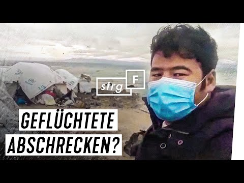
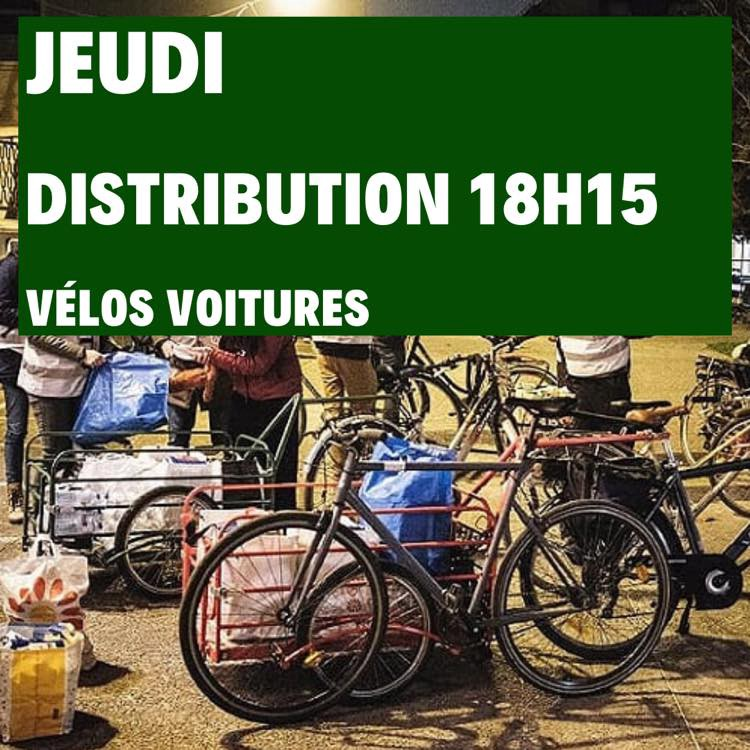

### AYS Daily Digest 12/1/21 UK: Stop Yarl’s Wood Prison Camp

_Destructive storm and curfew in Lesvos // Respiratory disease in Bosnia // Deportations in Germany // Ocean Viking is back after half a year // & more\. \._

](assets/9fdcaf7a1e7f/1*Otd6JNNdVmLnVdj5hfb6sw.jpeg)

Photo of Yarl Woods in 2016, by [The Establishment](http://www.womeninandbeyond.org/?p=20164)
### FEATURE: UK Home Office’s Plan for prison style camp in Yarl’s Wood and how to stop it

The proposed camp will be designed as a prison like structure for around 200 migrants\. The quick speed of the construction plan has bypassed many proper procedures for risk assessments\. The Independent is reporting that the government could face legal action because of this:

> “A local resident has sent letters before action to both the Home Office and Bedford Borough Council, and intends to take the case to court should there be no satisfactory response\. Lawyers believe that the government cut corners by failing to obtain planning permission or carry out the necessary impact assessments in its rush to set up the new facility\.” 

[Care4Calais](https://www.facebook.com/care4calais/posts/3978432198856374) further comments that:

> “Yarl’s Wood has a grim history as a detention centre\. Its record of hunger strikes, failed inspections and sexual abuse allegations speak of a place where the most basic human rights of refugees are not respected\. It should have seen it closed long ago\. Instead private firm Serco still has the contract to run the site\.” 

> “The local resident’s legal action which launches today has a real chance of putting a stop to the appalling plans for a camp at Yarl’s Wood\. But in order to go ahead it needs insurance against having to pay costs of £5,000\. There’s a crowd funder set up\. Please consider donating if you can\. This legal action is so important to the safety and dignity of refugees in Britain today\. If we can stop the development at Yarl’s Wood the Government will have to think again, and think harder, about a fair and humane way to look after vulnerable refugees\.” 

Here is the [Crowd Justice](https://www.crowdjustice.com/case/yarls-wood/?fbclid=IwAR06cXEoy-epDYPQzEWFo0naNqlRgHVoqa5q-bN4Esl7-Xnk0jOl8lyilAo) funder\.

Here is the [Change petition](https://www.change.org/p/uk-home-office-stop-plans-to-house-asylum-seekers-in-yarl-s-wood-camp?fbclid=IwAR2CMGlrBiCvB2MUKM3CWZL9Tqga8PmE2lqWi493HIceFnmnnSJUJVXxjPc) \.
#### SEA
### Western Med: 37 people missing, 50 people rescued

> AlarmPhone [UPDATE @ 19:00h](https://www.facebook.com/watchthemed.alarmphone/posts/2862253310715560) \. 12/01/2021
 

> 37 people, incl\. 5 women & 1 infant still missing\! \!
 

> It’s dark at sea and there are no news about the people missing between Morocco & Spain\. If still alive, this will be their 3rd night at sea\! \! Salvamento Marítimo say they are still searching for them — we hope they will be found\. 

AlarmPhone also reported on a 🚨 [WEATHER ALERT](https://www.facebook.com/watchthemed.alarmphone/posts/2862929617314596) 🚨

> “A storm is going to hit the Central Mediterranean Sea in the next days\. 
 

> To all the people fleeing Libya & Tunisia: strong winds & big waves will make the sea crossing more dangerous than usual even if at departure it looks calm\.” 

Agence France Presse \(AFP\) reported that 50 people were rescued by the Moroccan navy on Monday\. A newborn baby was found dead when they arrived\. The 50 were said to have left the Morracan coast on 6/1/21 but on Friday contact was lost and so ensued a rescue mission\. More [here](https://www.infomigrants.net/en/post/29569/rescued-50-migrants-plucked-from-sea-off-tunisia-one-baby-dead?fbclid=IwAR3q0LaCSfpPYujG0A1kTk4WO1WPFGSRUD-IkFG4USKoPRHdo20qHaG0jOs) \.

](assets/9fdcaf7a1e7f/1*JBqgunpgm22eB5LEWEprAg.jpeg)

Photo by [SOS Mediterranee](https://www.infomigrants.net/en/post/20260/ocean-viking-rescues-another-104-migrants)
### After half a year, the Ocean Viking is back

The Ocean Viking left France on Monday morning to travel to the Central Mediterranean\. [Sophie Beau](https://sosmediterranee.com/press/the-ocean-viking-is-headed-for-the-central-mediterranean-after-half-a-year-of-imposed-blockade/?fbclid=IwAR3xBgmImiNytatOEPq-mn2zGxhmJB7Zf7GgSfCbOcWTw7HsLk5gXnhxt8E) , co\-founder and vice\-president of SOS MEDITERRANEE said in a statement:

> “While we are on our way back to the central Mediterranean for the first time in months, we all have in mind what a dreadful year 2020 has been for people caught in circles of abuse in Libya and those attempting to flee by sea\. With the COVID\-19 pandemic came a renewed ‘closure’ of ports while people continued having to risk their lives at sea to reach safety\. Merchant ships carrying out their duty to rescue were stranded at sea for weeks while responsible authorities refused to provide a solution to disembark rescued people\. In June, the Ocean Viking, left without instructions for days, had to declare a state of emergency on board the ship when the uncertainty and the lack of perspective pushed survivors past their breaking point\. Repeated lengthy delays from maritime authorities in rescuing people in acute distress as well as organised pushbacks of survivors to Libya occurred in breach of international law\. Over 11,000 people were forcibly returned to Libya and its detention centres\. Six NGO ships have been blocked in a systematic manner leaving a deadly black hole in the central Mediterranean\. At least 779 women, men and children died or went missing — counting only the shipwrecks we know of — with barely any witnesses\. This is disgraceful and needs to come to an end\. The Ocean Viking is setting sail with a team prepared for the worst, having to face life and death situations in the middle of the open sea\. Unnecessary rescue delays and prolonged standoffs at sea put human lives at risk\. A return to respect for maritime law and genuine European solidarity with coastal states is the only way to prevent more tragedies\.” 

](assets/9fdcaf7a1e7f/1*6n6tRmmWQPriuiDXIkcneA.jpeg)

Photo by [Tim Wagner — Sea Watch](https://projekte.sueddeutsche.de/artikel/politik/seenotrettung-im-mittelmeer-2020-die-bilanz-e670960/?fbclid=IwAR1FVknQa0Fu7iGoxsEWFeBlRwUrzpYhSpZE1XIhnbgeOKMhNhSPRgApomk)
### Reconstructed timeline for civil sea rescuers in 2020

Nadja Schlüter, Raphael Weiss, Federico Delfrati, Christian Helten and Felix Hunger for [Jetze](https://projekte.sueddeutsche.de/artikel/politik/seenotrettung-im-mittelmeer-2020-die-bilanz-e670960/?fbclid=IwAR1FVknQa0Fu7iGoxsEWFeBlRwUrzpYhSpZE1XIhnbgeOKMhNhSPRgApomk) have reconstructed the timeline for civil sea rescuers in 2020\. It is a wonderful document with interesting visuals and important insight into how the pandemic fundamentally shaped sea rescue in this tumultuous year\.

> “To do this, we requested the recordings of nine NGOs from all over Europe, spoke to employees, evaluated media reports, press releases and Twitter feeds and asked the authorities\. In some cases we had to rely on the observations of the sea rescuers without being able to verify the information via a second source\. 

> Such a chronology cannot be complete\. Overall, it can be assumed that not all emergencies at sea will be known\. That by far not all people who die in the Mediterranean are discovered\. Particularly during periods when ships and aircraft have been detained by NGOs, much less is known about refugee movements and emergencies in the Mediterranean\. We did not research rescues from coast guards and merchant ships separately, but recorded them to the extent that they were mentioned in the material on the work of the NGOs\. If we had information about the rescue zone in the Mediterranean in which a sea emergency was reported, we added it: M SAR stands for the Maltese, I SAR for the Italian and L SAR for the Libyan “Search and Rescue” zone\.” 

#### MALTA
### Deportations to countries of origin on Tuesday

■■■■■■■■■■■■■■ 
> **[Robert Abela](https://twitter.com/RobertAbela_MT) @ Twitter Says:** 

> > Following months of intensive work, a number of migrants without an authorisation to stay have been returned home. #Malta is committed to prevent irregular arrivals, share the responsibility with other #EU countries and return migrants who are not truly in need of protection. -RA https://t.co/8gsHnzhfyB 

> **Tweeted at [2021-01-12 19:44:40](https://twitter.com/RobertAbela_MT/status/1349079870790381574).** 

■■■■■■■■■■■■■■ 

The Times of Malta further reported on the Prime Minister’s tweet that we do not know how many people were deported but they all arrived in 2019\. According to the report, “the ministry said the migrants’ asylum applications were considered by the International Protection Agency but it established that they were not eligible for protection and there was no risk to them returning to their home country\.” More [here](https://timesofmalta.com/articles/view/migrants-returned-to-their-country-after-asylum-applications-are.844515?fbclid=IwAR31yZFfJ0fxG5eYevr3Bh7DVMhFDeOYOkQ3jBGk6tENbItYzaDqrhmZB5g) \.
#### GREECE
### Lesvos: Destructive storms, curfew, & COVID

■■■■■■■■■■■■■■ 
> **[Choose Love](https://twitter.com/chooselove) @ Twitter Says:** 

> > This is happening now in the new camp on the Greek island of #Lesvos.

Strong winds and rain are currently battering the island, snow is expected later this week. 

These camps are dangerous and unfit for purpose. People must urgently be evacuated to safety. https://t.co/wo12x7T4S9 

> **Tweeted at [2021-01-12 16:58:20](https://twitter.com/chooselove/status/1349038011489656832?fbclid=IwAR3FG4F2CDpEQwDpga9Nz2jNbUPHGc0RxGD6bJHmtHx-on9jHdFh8z5yz4E).** 

■■■■■■■■■■■■■■ 

[Stand by me Lesvos](https://www.facebook.com/SBMLesvos/posts/799878410605183) provided some updates on the storm that ravaged Moria 2\.0 last night:

> “The bad news do not stop: Now very heavy storms and we expect drop in temperatures by 15 degrees very soon\. And Corona again is so bad that the island is isolated and from tomorrow curfew even starts at 6 pm\. The last ten months did not give us much time to breathe\. 

> **An update from our partners in the camp** : They say many tents collapsed due to very heavy storm and now a huge thunderstorm is above Mytillini and it is raining like hell\. The whole camp was wet from the last rain and now will be flooded again\. And we wait minus degrees in 48 hours\. What else can be said? People were warning, screaming, shouting that this will happen\. And …\. nothing happened\.” 

■■■■■■■■■■■■■■ 
> **[Moria White Helmets](https://twitter.com/MWHGreece) @ Twitter Says:** 

> > One tent down. Collapsed from storm upto 80 km 😱 #Moria2 https://t.co/BHymP7TdVz 

> **Tweeted at [2021-01-12 17:02:22](https://twitter.com/MoriaMediaTeam/status/1349039025160654849).** 

■■■■■■■■■■■■■■ 

If the storm wasn’t already enough, due to the COVID\-19 crisis, the Deputy Minister of Civil Protection and Crisis Management, Nikos Hardalias, has ordered [the following restrictive measures](https://www.stonisi.gr/post/14203/sfragizoyn-th-lesvo-realtime?fbclid=IwAR2nbFzRsoiffRbZXjqIRFy31IeCYR4_BNXqoocqGll4GVYhJTA_vvfAin4) :

> “Prohibition of movement outside the boundaries of the Regional Unit of Lesvos, except for movement for health reasons\. 

> From 6 pm to 5 am prohibition of any movement of citizens within the Regional Unit of Lesvos, excluding employees and who will only be able to move from home to work and vice versa with the exclusive permission of their employer\. 

> Suspension of religious ceremonies\. Suspension of stores \(retail, etc\. \) \.” 

Below is STRG\_F’s video that provides visual information on the situation on the ground right now\. Video in German\. If you speak German, you can also listen to [Radio Corax’s](https://radiocorax.de/moria-2-zur-aktuellen-situation-auf-lesbos/?fbclid=IwAR2buHFArwUEddWdz96F0GkheUIF6sFpL1CkC4pFYsnbd_VVOumnAOJLtfo) new podcast on “Moria 2 — on the current situation on Lesbos\.”

### Migration Ministry to speed up new Chios Camp Construction

News that a new Chios camp is under construction comes after a local court ruled that the old Vial camp needed to return to its proper owner\. Apparently the “commission’s contract” the owner had with the government expired two years ago\. [Migration Minister Mitarakis](https://www.ekathimerini.com/261136/article/ekathimerini/news/migration-ministry-to-speed-up-plan-for-new-chios-camp-after-court-ruling?fbclid=IwAR0ImZXI-1v3hAMv5uyd1QmSX-9dW7iF4jLp1mk7Cwh9JAbPS4CsHrR55n0) said:

> “‘The ruling accelerates the need to find a solution to the issue of creating a closed/controlled facility\. A facility that will meet the necessary standards of decent temporary living for asylum seekers and security standards for the benefit of residents, employees and the local community\.’ He also said that the new camp ‘should be operational’ in 2021, adding that VIAL will only close when the new facility is ready\.” 

![Solidarity does not quarantine\! \! \!
Out of 31/12/2020 refugees / refugees residing in Sparta’s structure are quarantined due to few cases of coronavirus and completely abandoned by the responsible entities\. So after two days of consecutive peaceful protests, last week outside the structure, claiming the obvious, they managed to be able to supply medicines and other items of need \(at their own expense\. \. \! \! \) \. As an Anti\-Fascist Movement of Kalamata we invite to a gathering of first\-need items for the inhabitants of the Sparta structure\.
The items we collect are: Diapers, baby wipes, baby milk, baby creams, long lasting milk, pads, antiseptics \(fluids and wipes\), personal hygiene items \(shampoos, soaps etc\) \. We collect them at the area of Kalamata Antifascist Hangout, Volcanoes 4, Historical Center Friday 15/1 from 5 pm until 7 pm and Saturday 16/1 from 10 am until 13 pm \* Collective protection measures will be strictly observed\. Photo and Info by [Anti\-Fascist Movement of Kalamata](https://www.facebook.com/antifasistikikalamatas.blogspot.gr/posts/2349398581872218)](assets/9fdcaf7a1e7f/1*7ZcnXgnKHZjfVa4cLYg22A.jpeg)

Solidarity does not quarantine\! \! \!
Out of 31/12/2020 refugees / refugees residing in Sparta’s structure are quarantined due to few cases of coronavirus and completely abandoned by the responsible entities\. So after two days of consecutive peaceful protests, last week outside the structure, claiming the obvious, they managed to be able to supply medicines and other items of need \(at their own expense\. \. \! \! \) \. As an Anti\-Fascist Movement of Kalamata we invite to a gathering of first\-need items for the inhabitants of the Sparta structure\.
The items we collect are: Diapers, baby wipes, baby milk, baby creams, long lasting milk, pads, antiseptics \(fluids and wipes\), personal hygiene items \(shampoos, soaps etc\) \. We collect them at the area of Kalamata Antifascist Hangout, Volcanoes 4, Historical Center Friday 15/1 from 5 pm until 7 pm and Saturday 16/1 from 10 am until 13 pm \* Collective protection measures will be strictly observed\. Photo and Info by [Anti\-Fascist Movement of Kalamata](https://www.facebook.com/antifasistikikalamatas.blogspot.gr/posts/2349398581872218)

 \*Photo from a student while having online Greek lessons\.” Info by [**Lesvos Solidarity — Mosaik Support Center**](https://www.facebook.com/LesvosSolidarityMosaik/posts/464010208315942)](assets/9fdcaf7a1e7f/1*Et4bYe4cYeVoZ8OA-mCexQ.png)

“Tiny Greek lesson Nº5: καλή χρονιά = happy new year\. In Mosaik Support Center we continue this week with online Greek and English lessons\. If you want to join, please send an email to check for the requirements at [mosaik4education@gmail\.com](mailto:mosaik4education@gmail.com) \*Photo from a student while having online Greek lessons\.” Info by [**Lesvos Solidarity — Mosaik Support Center**](https://www.facebook.com/LesvosSolidarityMosaik/posts/464010208315942)
#### ITALY

![“Together with organizations from all over Italy, borderline\-europe\-Italy has today published an open letter to Italian Interior Minister Lamorgese\. We call on you to immediately implement at least five of the long\-planned evacuation flights of Libya under the humanitarian corridors organized by the churches in Italy\. From Italy, the affected persons can reach other European states\. As long as legal and therefore safe routes to enter the \#EU are denied, this is the only way to escape the catastrophic conditions in Libya\.
‘In the past few weeks, various people who would have had urgent need for a place on these flights have died\. From diseases, hunger or because they were simply left alone\. Among them were also a minor and a half\-year\-old child\.’ \(Extract from the Open Letter dated 12\.01\.2020\)
In addition to this concrete important step for a few people, we continue to demand freedom of movement, safe entry and liberation from Libyan torture for ALL\!” Photo and text by [borderline europe](https://www.facebook.com/borderlineeurope/posts/3805769099445754)](assets/9fdcaf7a1e7f/1*r0jO88qnLjDIFk_bWtrBRw.jpeg)

“Together with organizations from all over Italy, borderline\-europe\-Italy has today published an open letter to Italian Interior Minister Lamorgese\. We call on you to immediately implement at least five of the long\-planned evacuation flights of Libya under the humanitarian corridors organized by the churches in Italy\. From Italy, the affected persons can reach other European states\. As long as legal and therefore safe routes to enter the \#EU are denied, this is the only way to escape the catastrophic conditions in Libya\.
‘In the past few weeks, various people who would have had urgent need for a place on these flights have died\. From diseases, hunger or because they were simply left alone\. Among them were also a minor and a half\-year\-old child\.’ \(Extract from the Open Letter dated 12\.01\.2020\)
In addition to this concrete important step for a few people, we continue to demand freedom of movement, safe entry and liberation from Libyan torture for ALL\!” Photo and text by [borderline europe](https://www.facebook.com/borderlineeurope/posts/3805769099445754)
#### BOSNIA AND HERZEGOVINA

■■■■■■■■■■■■■■ 
> **[NoNameKitchen](https://twitter.com/NoNameKitchen1) @ Twitter Says:** 

> > It is not only LIPA. Some people could leave from there and are hidden in shelters in the mountains and abandoned buildings in the cities.

Thousands of people are sleeping rough at EU Doorsteps.

We don't need camps. We need safety while migrating. https://t.co/xXFund35lK 

> **Tweeted at [2021-01-12 13:57:54](https://twitter.com/NoNameKitchen1/status/1348992605535817735?fbclid=IwAR3PdKGhRSMawaLftTSzvhtjrUVIU20WKE5uwgCij0xMbFNIMQ8B-bKyaE4).** 

■■■■■■■■■■■■■■ 

### “People with respiratory diseases in the cold of Bosnia, fear of Covid”

As a weather warning has been issued in the country for the next few days, [Rai news](https://www.rainews.it/dl/rainews/media/Migranti-allarme-Ong-persone-con-malattie-respiratorie-nel-gelo-della-Bosnia-paura-Covid-c5ea794e-9ae2-4083-b8d3-0e0494baaf04.html?fbclid=IwAR0Is7Tc1JKDdcpn0qEIJStUPa1lW55nImEiXFa26jZODlDbGIumr-G_374#foto-1) is reporting on the respiratory conditions and health emergency:

> “Many migrants and refugees staying in the camp in northwestern Bosnia have complained of respiratory and skin infections after spending days in makeshift tents and containers amid the freezing cold and snowstorms, aid workers said\. Most of the hundreds of migrants stranded at the Lipa facility, near the Bosnian border with Croatia, were housed in heated military tents after days of uncertainty following the fire that destroyed part of the camp on 23 December\. Bosnia came under harsh criticism for leaving around a thousand people without shelter after the fire: authorities first said they would move the migrants to another location, but ended up setting up military tents on the site\. 

> A weather warning has been issued in Bosnia…The Lipa site also lacked basic services such as electricity or running water, and migrants lit fires for days to protect themselves from low temperatures\. Yesterday, doctors checked the health of people in the Lipa camp and distributed medicines\. It is unclear whether any of the migrants are affected by Covid\-19, said Verica Racevic of the Danish Refugee Council’s humanitarian group\. ‘Some have a fever,’ he said, ‘it is not easy to distinguish in those circumstances whether it is Covid\-19 or another type of respiratory infection\.’” 

### “Long\-term solutions needed to end recurring humanitarian crisis”

A joint statement has been released calling for support in Bosnia and Herzegovina: _“in a statement issued today, leading human rights organizations, Amnesty International, Jesuit Refugee Service Europe, Médecins du Monde Belgique and Refugee Rights Europe have called for immediate humanitarian support to address the current emergency as well as durable institutional solutions to meet the needs of people transiting through the country\.”_ They say it is because of a lack of political will that there are not enough people sheltered, not a lack of resources\. After all, 88 million euros of EU assistance have gone towards these problems but no long term solutions have come to fruition\. More [here](https://www.amnesty.org/en/latest/news/2021/01/bosnia-and-herzegovina-long-term-solutions-needed-to-end-recurring-humanitarian-crisis/?fbclid=IwAR24HFie1NltB_lIlTfNSvD0rokAIHnsWkUmsQRKa1s1ZDsgNnOGbL3B-9o) \.
#### SERBIA

![“News from Šid, Serbia
Waking up on the first day of the new year came with an unpleasant surprise\. The front window of one of our activists cars had been smashed in, the word “LEAVE” had been written in the dirt on the rear window\. On our van we found a nationalist symbol \(1st Jan 2021\) \. The next couple of days were followed by similar incidents\. The license plates of the same activists car were stolen \(6th Jan 2021\) \. One of the license plates of our van also vanished over night \(8th Jan 2021\) \. 
While none of this stops us from doing our work here, events like this cost money, time, energy and nerves\. Personally, I always seek for understanding\. Why is our organisation being targeted in that way? What role do Serbian media and politics play in the portrayal of people on the move and therefore of people who stand in solidarity with them? Are unresolved collective and individuals traumas from the relatively recent war part of the reason? Are we really acting in a way that negatively impacts locals? If yes, how can we change? If no, why is it perceived this way? The past year we have made good friends within the local community\. We have started to find ways to contribute to the life here in Šid in a positive way, we have built partnerships and cooperations\. Our hope for this year is to grow even closer, to understand more and be understood better\.”
Text and photo by [Marina Bottke/ NNK Sid](https://www.facebook.com/NoNameKitchenBelgrade/posts/1161684420896507)](assets/9fdcaf7a1e7f/1*EVzlhuTqxQJo9Nobw_sVoQ.jpeg)

“News from Šid, Serbia
Waking up on the first day of the new year came with an unpleasant surprise\. The front window of one of our activists cars had been smashed in, the word “LEAVE” had been written in the dirt on the rear window\. On our van we found a nationalist symbol \(1st Jan 2021\) \. The next couple of days were followed by similar incidents\. The license plates of the same activists car were stolen \(6th Jan 2021\) \. One of the license plates of our van also vanished over night \(8th Jan 2021\) \. 
While none of this stops us from doing our work here, events like this cost money, time, energy and nerves\. Personally, I always seek for understanding\. Why is our organisation being targeted in that way? What role do Serbian media and politics play in the portrayal of people on the move and therefore of people who stand in solidarity with them? Are unresolved collective and individuals traumas from the relatively recent war part of the reason? Are we really acting in a way that negatively impacts locals? If yes, how can we change? If no, why is it perceived this way? The past year we have made good friends within the local community\. We have started to find ways to contribute to the life here in Šid in a positive way, we have built partnerships and cooperations\. Our hope for this year is to grow even closer, to understand more and be understood better\.”
Text and photo by [Marina Bottke/ NNK Sid](https://www.facebook.com/NoNameKitchenBelgrade/posts/1161684420896507)
#### HUNGARY
### Deportations to Serbia keep happening → EU keeps turning a blind eye

Reuters: “ _Hungary has ignored complaints about its practice of escorting undocumented immigrants back across the border to Serbia without due process, a watchdog group said on Tuesday after it raised the alarm about the ongoing human rights violations…The Hungarian Helsinki Committee, a legal advocacy group, urged Hungary’s police chief to end the practice and asked the EU’s border guard agency Frontex to cease cooperation with Budapest\. ‘Neither the government nor Frontex replied to our letters,’ Helsinki lawyer Andras Lederer told Reuters\. A government spokesman said the EU ruling was ‘devoid of purpose as the circumstances at issue in the present proceedings no longer exist\. Transit zones have been closed\. However, strict border control is maintained_ \.’” [More here\.](https://www.reuters.com/article/us-europe-migrants-hungary-frontex/hungary-keeps-deporting-migrants-eu-border-guard-turns-blind-eye-ngo-idUSKBN29H1W1?rpc=401&fbclid=IwAR1NMnfBj3PWYmD8iyU-3qE-PyHgg7MuiSPw9OfZ9qcYaCuvrjKTztO9w8M)
#### GERMANY
### Tuesday’s deportation to Afghanistan

PRO ASYL demands “that the deportation pilot to Kabul starting from Düsseldorf today be stopped\. The Taliban are on their way to power\. In today’s geopolitical situation, it is to be feared that Afghanistan will increasingly become a Taliban country\. PRO ASYL calls for a stop of the deportation and a review of the decisions by the courts and politicians\.”

Read their full statement [here](https://www.proasyl.de/pressemitteilung/heutige-abschiebung-nach-afghanistan/?fbclid=IwAR38NByD_VGpIWaVLxYDO9mJu5A55qYx2eCKR6p8GcqHulznwI-bMH3-h2k) \. See a video from Düsseldorf airport [here](https://www.facebook.com/nobordersnetwork/posts/3663657907035408) \.
#### FRANCE

![“🚨 CALLS FOR VELO MARAUDE THURSDAY 14 & SATURDAY 16 JANUARY 🚨
Need bikes, trailers, cargo bikes and cars to form mobile teams\! \!🚲🛺🚗
➡ SIGN UP BY PM, letting us know your surnames, first names and phone number
📆 Thursday, January 14: The appointment is at 18 pm at the Thé âtre de la Belle Éttoile, 14 rue Saint\-Just in Saint Denis
📆 Saturday, January 16: appointment at 9 pm, more info in pm\!
🔴 You’ll need proof of volunteering: if you’re registered, ask for it in a PM\.
👉 🛒 The meals we will distribute together are funded through donations in kind and donations on the pot 💕💚🧡💛: [https://www\.helloasso\.com/\. \. \./soutien\-a\-wilson/formulaires/1](https://www.helloasso.com/.../soutien-a-wilson/formulaires/1) 
❤️ Thank you to everyone\. e for your solidarity\. 🙏 We don’t give up”
Photos by Lucas Boirat, info by [Solidarité migrants Wilson](https://www.facebook.com/permalink.php?story_fbid=1634732053394227&id=598228360377940)](assets/9fdcaf7a1e7f/1*tU1kzTo0ggNPRpU7CD16nA.jpeg)

“🚨 CALLS FOR VELO MARAUDE THURSDAY 14 & SATURDAY 16 JANUARY 🚨
Need bikes, trailers, cargo bikes and cars to form mobile teams\! \!🚲🛺🚗
➡ SIGN UP BY PM, letting us know your surnames, first names and phone number
📆 Thursday, January 14: The appointment is at 18 pm at the Thé âtre de la Belle Éttoile, 14 rue Saint\-Just in Saint Denis
📆 Saturday, January 16: appointment at 9 pm, more info in pm\!
🔴 You’ll need proof of volunteering: if you’re registered, ask for it in a PM\.
👉 🛒 The meals we will distribute together are funded through donations in kind and donations on the pot 💕💚🧡💛: [https://www\.helloasso\.com/\. \. \./soutien\-a\-wilson/formulaires/1](https://www.helloasso.com/.../soutien-a-wilson/formulaires/1) 
❤️ Thank you to everyone\. e for your solidarity\. 🙏 We don’t give up”
Photos by Lucas Boirat, info by [Solidarité migrants Wilson](https://www.facebook.com/permalink.php?story_fbid=1634732053394227&id=598228360377940)
#### EU
### Civil Liberties Committee reassessing the 2013 directive on asylum procedures

> “T [he Civil Liberties Committee](https://www.europarl.europa.eu/news/en/press-room/20210111IPR95318/asylum-border-procedures-meps-warn-of-fundamental-rights-challenges) adopted on Tuesday a draft report assessing the application of the [2013 directive on asylum procedures](https://eur-lex.europa.eu/legal-content/en/ALL/?uri=celex%3A32013L0032) and specifically the fast\-tracked border procedure \(article 43\) \. MEPs note that the directive does not include a clear definition of this type of procedure nor specifies its objectives, leading to lack of uniformity in its application\. 

> They are concerned about the increase of fundamental rights violations at the external borders, including many cases of persons being refused entry without their asylum claims being registered\. Member states have a duty to inform persons on the possibility to apply for asylum and must offer effective remedy to those whose entry is refused\. MEPs call on national authorities to comply with the rules and ask the European Commission to suspend EU payments in case of serious deficiencies\.” 

■■■■■■■■■■■■■■ 
> **[Nick Micinski, PhD](https://twitter.com/nickmicinski) @ Twitter Says:** 

> > @[JFCrisp](https://twitter.com/JFCrisp) Easy to see where EU Priorities are... Frontex budget &amp; staff have far outpaced EASO over the last 10 years https://t.co/TRViwXBluu 

> **Tweeted at [2021-01-12 19:29:02](https://twitter.com/nickmicinski/status/1349075938227744768).** 

■■■■■■■■■■■■■■ 

### Greens to question Frontex Director

[Evangelisch\.de](https://www.evangelisch.de/inhalte/181114/12-01-2021/gruene-wollen-von-frontex-chef-aufklaerung-ueber-moegliche-push-backs?fbclid=IwAR2PdsDAab2sjTr3kL7fmKAiQfABhdcIGJSJJrOttWHt9G8K8iN_jYXT2-E) is reporting that:

> “After reports of illegal rejections of refugees in the Aegean Sea, the Greens are demanding clarification from the EU border protection agency Frontex\. On Wednesday, Frontex director Fabrice Leggeri is supposed to answer questions from members of the Bundestag in the Interior Committee\. The Greens had to fight for the survey for a long time, said the faction’s spokeswoman for refugee policy, Luise Amtsberg, in Berlin on Tuesday\. According to her information, Leggeri will probably be switched digitally to the committee\. 

> The Greens hope for the resolution of contradictions, which there are through different accounts of an incident on August 10th in the Mediterranean between Greece and Turkey, in which the federal police were also involved\. A rubber dinghy with around 40 people was floating on the water at that time and was discovered by the federal police\.” 

### UK agrees for Gibraltar to join Schengen

[Heise](https://www.heise.de/tp/features/Streit-um-spanische-Grenzkontrollen-in-Gibraltar-5021178.html?fbclid=IwAR2FVh-wfA4KAWJl-WJTbnddRhXdig2cbDGfZiNmRvc_KrmJRB5I4l8Jwm4) is reporting that the historic deal was finally made, after a contentious Brexit agreement and has direct consequences for EU/UK border security:

> “Gibraltar, the southern tip of the Iberian Peninsula, has belonged to Great Britain for over 300 years\. With Brexit, the Spanish government would have had to introduce border controls for goods and people coming from the British exclave from January 1st\. This would particularly affect the around 15,000 people who commute from Spain to work in Gibraltar every day\. The city on the monkey rock itself has around 33,000 inhabitants\. 

> Literally at the last minute, Great Britain and Spain therefore agreed that Gibraltar could join the Schengen area\. This is what it says in a declaration of principle that is now to be included in the actual exit treaty between Great Britain and the European Union\. The Spanish daily El Pais published the document yesterday \. This is a “non paper” from the Portuguese Presidency to the other member states\. It begins with two benevolent letters from the representations of Spain and Great Britain in the European Union\. 

> With the agreement, Gibraltar must apply the so\-called Schengen acquis\. The coast of the exclave will inevitably become an EU external border to which certain rules apply\. This concerns border control and surveillance as well as the issuing of residence permits\. Spanish and Gibraltar officials are now supposed to do this together\. According to the declaration of principle, they share offices at the airport and the port of the exclave\.” 

#### UK
### Hunger strike in Kent

The Guardian is reporting that “a _bout 350 asylum seekers are reportedly on hunger strike at a former army barracks in Kent being used as temporary housing, amid allegations conditions at the site are worsening\. About 400 men are being held at the Napier barracks site near Folkestone, which has been used as temporary accommodation since September and has faced calls for closure after allegations of cover\-ups, poor access to healthcare and legal advice, and crowded conditions\. On Monday \(they\) went on hunger strike at the barracks in protest at lack of information on their asylum claims, the impact of crowding on their risk of catching Covid\-19, and poor hygiene, volunteers said\. Videos and pictures show broken toilets and out\-of\-order sinks in the bathrooms\._ ” More [here\.](https://www.theguardian.com/uk-news/2021/jan/12/asylum-seekers-on-hunger-strike-over-conditions-at-kent-barracks-site?fbclid=IwAR06cXEoy-epDYPQzEWFo0naNqlRgHVoqa5q-bN4Esl7-Xnk0jOl8lyilAo)
#### WORTH READING
- Reuters just reported that **Hungary keeps deporting migrants, EU border guard turns blind eye — NGO** \. Read more on this [here](https://www.reuters.com/article/us-europe-migrants-hungary-frontex/hungary-keeps-deporting-migrants-eu-border-guard-turns-blind-eye-ngo-idUSKBN29H1W1) \.
- [Cilip magazine](https://www.cilip.de/2021/01/12/europaeische-polizeizusammenarbeit-im-halbdunkel/?fbclid=IwAR1URqURP-6GQ47yqsgxZFc3g1iZ62s8ZLU12e61imxLwRBw6gG4ANvVLlU) just published **European Police Cooperation in the Twilight** \. _“The ‘Police Working Group on Terrorism’ \(PWGT\) today organizes the political departments of police authorities in all Schengen countries\. The informal group was seen in 1979 as a response to left\-wing armed movements\. After its dissolution, its purpose was expanded to include ‘political violent activities\.’”_

**Find daily updates and special reports on our [Medium page](https://medium.com/are-you-syrious) \.**

**If you wish to contribute, either by writing a report or a story, or by joining the info gathering team, please let us know\.**

**We strive to echo correct news from the ground through collaboration and fairness\. Every effort has been made to credit organisations and individuals with regard to the supply of information, video, and photo material \(in cases where the source wanted to be accredited\) \. Please notify us regarding corrections\.**

**If there’s anything you want to share or comment, contact us through Facebook, Twitter or write to: areyousyrious@gmail\.com**

_Converted [Medium Post](https://medium.com/are-you-syrious/ays-daily-digest-12-1-21-uk-stop-yarl-woods-prison-camp-9fdcaf7a1e7f) by [ZMediumToMarkdown](https://github.com/ZhgChgLi/ZMediumToMarkdown)._
