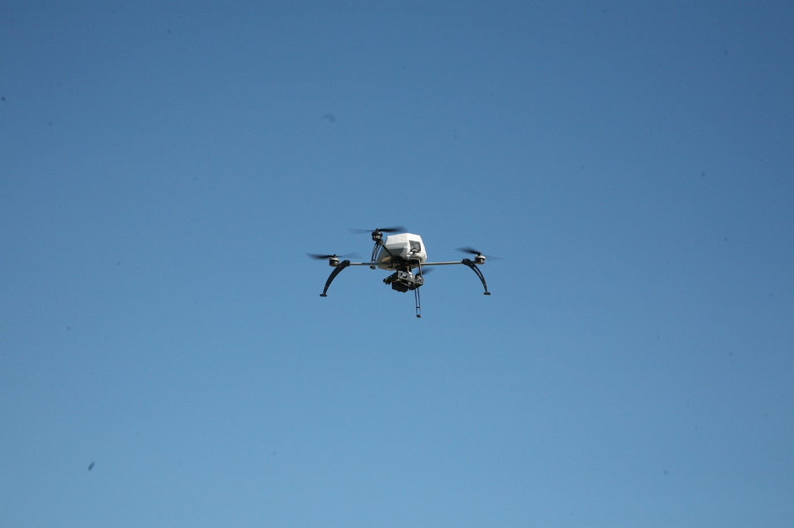

### AYS Daily Digest — 13/01/2021: Ongoing humanitarian crisis in Bosnia
#### Greece reject 85% of asylum applications filed by Syrian nationals // New data on forced evictions in France // Worrying reports on human trafficking in Malta
### BOSNIA

](assets/3327b2e728dc/1*n8Ir2AEi0cOOoJsqjQQgmw.jpeg)

Distribution of aid organised by SOS Balkanroute — credits: [SOS Balkanroute](https://www.facebook.com/SOSBalkanroute/posts/421634409276138)

We report about the ongoing humanitarian crisis that is unfolding in Bosnia and Herzegovina, where for weeks now hundreds of migrants are stranded with no adequate infrastructure or support to face the harsh winter\.

Refugee Rights Europe, Amnesty International, the Jesuit Refugee Service and Médicins du Monde [have deemed this crisis as](https://www.statewatch.org/news/2021/january/humanitarian-crisis-in-bosnia-and-herzegovina-an-inevitable-consequence-of-eu-border-externalization-say-major-ngos/?fbclid=IwAR05HLFuUEiOjfEd76ZtUn0ZYX4PiN6nk1g7jOlhvhWQINXFCgVUZBvqqhQ)

> an inevitable consequence of the EU’s externalization policy\. Despite providing the country with over €88 million in humanitarian aid over the last three years, the EU’s “permanent crisis management mode” avoids long\-term, meaningful solutions, says a joint statement published by the organisations\. 

> The statement makes clear that the government of Bosnia and Herzegovina is fulfilling neither its moral nor its legal obligations, but places the ultimate blame for the situation on the EU’s migration and asylum policy that protects external borders and shifts responsibility for ensuring protection of migrants and asylum\-seekers to the neighboring countries\. 

In spite of the critical conditions, many activists, organisations, and solidarity networks have come to the aid of people blocked in these appalling conditions\.

Despite occasional incidents, the shocking images of migrants who welcomed the Bosnian winter without a roof over their heads evoked empathy and great humanity in BiH\. people\. One of the examples is the [women from Gračanica](https://www.federalna.ba/zene-iz-gracanice-siju-vrece-za-spavanje-migrantima-zooca?fbclid=IwAR3lI3CreX68-hTfx26a2UrJ7ppr-XETcubrY-EowGepZe-ewUTjdO-K0as) who, without anyone’s help, started the action of sewing sleeping bags in order to, they say, at least in this way help people on the move to more easily endure the cold to which they are exposed every day\.

> They are on the street and no one cares about them\. They were going somewhere\. I don’t deal with politics and I don’t know, I just know that these people need help\. 

Also in Italy, [donations being gathered](https://www.facebook.com/permalink.php?story_fbid=213940883727475&id=106502621137969) to deliver to Bosnia\.
### GREECE

In the last few months of 2020, [legal organisations raised repeated concerns](https://www.facebook.com/EuropeanLawyersInLesvos/posts/2829568857363854) about access to justice and interview conditions for asylum seekers on the Greek island of Lesvos\.

> Since the asylum process restarted following the fire that destroyed Moria camp in September, many asylum seekers have been receiving their first instance interview dates with very little notice — sometimes only one or two days in advance\. For some, this came after spending months if not years enduring dire living conditions and continued postponements\. 

What is particularly worrying is the report that [around 85% of the asylum applications](https://twitter.com/TihomirSabchev/status/1349255035268509697?fbclid=IwAR36Nkzr7SziVA5S0ercnqssQ0SC4Yuvg2caC6mOTVaF_8mlXPnKp99beis) submitted by Syrians on the Greek Islands have been declared inadmissible\. This is particularly worrying as, since March 2020, Turkey accepts no returns\. This puts asylum seekers in an impossible situation of not being able to return, nor to claim asylum, nor to move forward\. This immobility, being trapped in often appalling conditions with no rights, puts a terrible strain on the lives of already deeply traumatised people\.

Furthermore, [as some commentators note](https://twitter.com/maledictus/status/1349323859133128705?fbclid=IwAR2HkPRoL8PinjXLP28Pg6sQJ2O-6mwRg7QfSwJ6a3wNrig_vMcv5eJULRQ) , this is also a terrible precedent as Syrians were considered the “cornerstone” case of being admissible for years\. If Syrians do not have a chance, then nobody else will\. A horrifying precedent in every way\.

Indeed, the Greek government has [maintained its policy](https://www.hrw.org/world-report/2021/country-chapters/greece?fbclid=IwAR1QZdPsaI_ASAURCgE8SN5bjwWMPEQz-b4orW2maIpGblx-qHKIrHhNSg0) of blocking asylum seekers who arrive on the Aegean islands from moving to the mainland\.

> The containment policy trapped thousands in overcrowded and abysmal conditions [with limited access](https://www.hrw.org/news/2020/04/22/greece-island-camps-not-prepared-covid-19) to protection, health care, adequate water, sanitation, and hygiene products to limit the spread of [Covid\-19](https://www.hrw.org/news/2020/04/14/covid-19-human-rights-checklist) \. At time of writing, [19,929 asylum seekers](https://infocrisis.gov.gr/10793/apotyposi-tis-ethnikis-ikonas-katastasis-gia-to-prosfygiko-metanasteftiko-zitima-tin-18-10-2020/) were on the islands, including more than 16,000 in camps designed to host around 13,000\. 

We have also received news that, starting from 11 January, and for the first time in four months, the [Regional Asylum Office of Lesvos](https://www.facebook.com/HIASGreece/photos/a.189399081472055/1066908893721065) will begin notifying applicants on Lesvos with first instance rejections and will also start accepting appeals against these decisions\. However, the procedure is restarting without the guarantee of state free legal aid from the Register of Lawyers of the Asylum Service\.

One should bear the [numbers of refugees currently in Lesvos](https://twitter.com/f_grillmeier/status/1349348958670348293?fbclid=IwAR11wlMY2w6KtXcWyXVEHP2_d4qB5Thh_04eVerTu13mEShrSKOdr3oUXC0) in mind: currently, 9,653 refugees and asylum seekers reside on the island, out of which 72% are Afghan nationals, 9% from the DRC and 7% from Syria\. Women account for 23% of the population, while children are 37% \(of whom more than seven out of 10 are younger than 12 years old\) \.
#### Heavy storms and inhumane conditions

The camps in Moria have been affected by heavy storms, which compromise the safety and quality of the life of their residents\. The last few days have made the already difficult daily life of the residents even worse\. The camp was flooded again & strong winds threatened to destroy the tents\. See more [here](https://twitter.com/DunyaCollective/status/1349408367614152704?fbclid=IwAR30oJkGs4vuPs4HOhLibXBmWayui_sbuU3lfbnhLEH1jXGTdHPMikTJu-Y) and [here](https://twitter.com/teammareliberum/status/1349411971645526017?fbclid=IwAR2w2FNnkgooENREKZdM4kQF9495GbBeLqBfzn8DdS1GpwzJ-aq3oTZTDQI) \.

We also feel compelled to share this report from the Malakasa camp, where the tragic death of a five\-year\-old child has occurred, and where many people are held in very precarious health conditions\.

> There is a generalised problem regarding individuals without legal documents, AMKA ect\.; when they go to the hospital they are, at times, refused examination\. This time we learned of two such cases\. There are people with serious dermal or other medical issues, adults and children\. We know that at this point in time the Greek health system, under the responsibility of the Greek state and the governments \(current and past\), is unable to take care of the poorest locals \(many of whom, as has been proven, are dying outside of Intensive Care Units due to COVID\-19 or other diseases\), let alone migrants who are excluded from equal healthcare for racist reasons\. Additionally, ambulances that are supposed to come in emergency situations arrive many hours later, even when it’s a matter of life or death\. 

For more, read [here](https://www.facebook.com/solidaritymigrants/posts/232940211661849) \.
### FRANCE

As Human Rights Watch [reports](https://www.hrw.org/world-report/2021/country-chapters/france?fbclid=IwAR3YT0w5rnb5HtuohUNV3kI290jvIqXwXmkWcrClwe0OLVWv7sbVzsh9WFg#e58b65) ,

> France continued to detain people in immigration detention centers during the pandemic despite calls in March from the French Ombudsperson and the [General Controller for Prisons](https://www.cglpl.fr/2020/covid-19-le-cglpl-sest-rendu-dans-les-centres-de-retention-administrative-de-paris-vincennes-et-du-mesnil-amelot/) for their closure given the risks of contracting COVID\-19 and the fact that deportations could not be carried out within a reasonable timeframe due to travel restrictions\. In September, the [government announced](https://www.bfmtv.com/paris/yvelines-le-centre-de-retention-de-plaisir-reserves-aux-migrants-positifs-au-covid-19_AD-202009220345.html) it would use a detention center outside of Paris for people who have tested positive for the virus that causes COVID\-19, while they awaited deportation\. 

We have reported frequently about cases of police violence and forced evictions in France\. The evictions are on a rolling 48\-hour schedule to prevent refugees acquiring limited rights and the police requiring a court order to clear the land\.

[Reported cases of police violence](https://www.theguardian.com/global-development/2021/jan/13/like-torture-calais-police-accused-of-continued-migrant-rights-abuses?fbclid=IwAR2GyEHKXK7xbETV9JEhXeD_vo7sJeVgoT8nEkntBSwnsmb9zv90fsrn2Hc) have included minors being teargassed, a tent with a refugee inside it being dragged by a tractor and an Eritrean shot in the face with a rubber bullet from 10 metres, hospitalising him for two months\.

Credits: statewatch

Finally, we share the news that the French Council of State [ruled, on 22 December 2020](https://www.statewatch.org/news/2021/january/france-court-bans-drone-surveillance-of-demonstrations/?fbclid=IwAR0uL5eQuj7yQtoRGybxQ2EG4cfpAL8SMLsvgrPn8zss-G2aJktpQcZxvho) , that

> Paris Police Prefecture must cease its drone surveillance of demonstrations\. This follows a ban put in place last May, but goes even farther than that ruling\. The country’s highest administrative court has left little room for the government to authorise aerial surveillance of protests in its proposed ‘Global Security’ law\. 

### MALTA

In Malta, [The Women’s Rights Foundation](https://www.euroweeklynews.com/2020/12/26/malta-records-spike-in-migrant-women-exploitation-during-pandemic/?fbclid=IwAR1LGFlzDkT-r8PN88X3nIaKJbsNHMGFcnf71-TrIRXegRudD0CeMYFRFrQ) , an NGO that seeks to empower vulnerable women through legal aid, has worryingly reported that the pandemic had caused a spike in street prostitution with a particular rise in cases involving migrant women\. Human trafficking, especially at the expense of vulnerable women migrants, is often the result of problematic

“These women are being forced into prostitution\. They are being trafficked\. They are vulnerable since, in some cases, there is a language barrier, they are not aware of their surroundings and do not know how to seek help,” she said\.
### SPAIN

We reported in our previous digest about the increasing number of people on the move towards Spain; Spain’s ability to [handle asylum cases](https://www.thelocal.es/20210111/how-is-spains-asylum-system-coping-with-a-record-increase-in-applications?fbclid=IwAR0dOGy8N66yI4hrFFHGF0jf3aWmH5KD-2eHKeRyMtYW-uMjDCuNIkgZsX4ù) has been put to the test in recent years more than ever before\. [According to Eurostat](https://ec.europa.eu/eurostat/databrowser/view/migr_asyappctza/default/table?lang=en) , Spain received a record high number of asylum claims with 117,800 — up from 54,050 the year before, and this had been enough to draw concern from experts and local authorities\. The 118 percent increase from 2018 to 2019 was the highest of any member state of the European Union\. Citizens of Venezuela \(40,906\) and Colombia \(29,363\) accounted for 59% of the asylum claims in Spain for 2019\.

> In their [2020 migration report](https://www.cear.es/wp-content/uploads/2020/06/Informe-Anual_CEAR_2020_.pdf) the NGO CEAR \(Spanish Commission for Refugees\) acknowledged the efforts of the Spanish government and praised the plans to increase staff and introduce new legislation to optimize the asylum process\. However, they said many obstacles remained, calling the system “rigid” and maintaining that nothing else will be as effective as providing individualized attention per case and legal assistance from the moment the asylum seeker arrives in Spain\. 

### HUNGARY

Hungary will be receiving a formal European Commission notice for ignoring a recent EU court ruling on asylum\.

The move follows [reports by a Budapest\-based NGO, the Hungarian Helsinki Committee,](https://euobserver.com/migration/150555) that Hungary is continuing to force would\-be asylum seekers back into Serbia\.

This is not the first time that Hungary has received a formal European Commission notice of “cease and desist”, and one cannot help but wonder how effective these notices are, if little change can be seen in the country’s policies and actions towards migrants\. UNHCR/DENMARK
### DENMARK

The United Nations High Commissioner for Refugees representation for the Nordic and Baltic countries [addressed the Danish Government](http://refugees.dk/en/news/2021/january/unhcr-urges-denmark-to-change-refugee-policy/?fbclid=IwAR1QI_FyonJaZIzeJkJn0k2mWNU1bGbfpPNCZcxjMpIWscn2MNfQXz13ILQ) , parliamentarians and other relevant actors and stakeholders in an eleven\-page letter\.

> The office points in the letter to the fact that Denmark currently hosts its lowest number of asylum seekers in over a decade and that UNHCR has already warned against many of the new restrictions the country has introduced in recent years\. 

> Denmark is being advised to get back in line with international and European refugee protection standards, in particular by ensuring long\-term stability, security and fair access to family reunification\. It also warns that recent restrictions will hinder future integration\. 

### GENERAL

In the last two months, members of BVMN have reported on an increasing number of c [hain pushbacks from Bulgaria, via Greece, to Turkey](https://www.borderviolence.eu/violence-reports/december-15-2020-0000-orestiada-karakasim/?fbclid=IwAR30oJkGs4vuPs4HOhLibXBmWayui_sbuU3lfbnhLEH1jXGTdHPMikTJu-Y) \.

This practice involves officers from Bulgaria pushing back groups close to the “tri\-border” area \(the Evros location in the north where the three borders meet\) \.

BVMN reports that

> This “indirect” collaboration in illegal cross\-border removals is concerning\. Across the Balkan route, chain pushbacks are increasingly used to violently enforce the EU external border and disrupt transit\. 15% of cases collected in BVMNs pushback database involve two or more states\. 

We would also like to draw attention to this article on humanitarian biometrics in Kenya, by Keren Weitzberg,

[Gateway Or Barrier? The Contested Politics Of Humanitarian Biometrics](https://datarightsafrica.org/2021/01/11/gateway-or-barrier-the-contested-politics-of-humanitarian-biometrics/?fbclid=IwAR30oJkGs4vuPs4HOhLibXBmWayui_sbuU3lfbnhLEH1jXGTdHPMikTJu-Y)

> The problem of double registration greatly accelerated after the Kenyan government, with support from the UNHCR, [took over the refugee registration](https://www.nrc.no/globalassets/pdf/reports/refugees-in-nairobi/recognising-nairobis-refugees.pdf) process in the country\. This facilitated greater data consolidation and interoperability across the refugee and national systems\. Nowadays, Kenya’s Automated Fingerprint Identification System \(AFIS\) includes the [biometrics of all registered refugees](http://documents1.worldbank.org/curated/en/575001469771718036/pdf/Kenya-ID4D-Diagnostic-WebV42018.pdf) , which can be run against the citizen registry\. The National Registration Bureau is able to cross\-check the fingerprints of those who apply for a national ID, effectively shutting the door of citizenship to anyone found on the refugee database\. 

With regards to the Frontex’s operations on border policing, we would like to highlight this [interesting contribution](https://www.law.ox.ac.uk/research-subject-groups/centre-criminology/centreborder-criminologies/blog/2021/01/validating-border?fbclid=IwAR3QP9DT_aIMIoRxMZPUm7O31-zsayqnEkCnRTyuN5MRugHTfJJq_Y2MJNU) to border criminologies:

> Frontex’s internal records reveal the practices deemed acceptable by the agency and their interpretation of international legal obligations\. The records provide insight into a vision of border enforcement, crystallised at the boundaries of the global North, that perpetuates the violent securitisation of borders to the detriment of human mobility, dignity and safety\. They carve out a space where border control activities are shielded from scrutiny, erasing human rights from the operational script\.” 

### EVENTS

Finally, we would like to signal the upcoming events:

**14 January AT 09:00 UTC\+01–15 JAN AT 17:30 UTC\+01**

[“The Anxieties of Migration and Integration in Turbulent Times”](https://www.facebook.com/events/976742352771069/)

**Thursday, 21 January 2021, 14\.00–15\.45**

[DIIS ∙ Danish Institute for International Studies](https://www.diis.dk/en/event/climate-wars)

As violence reaches unprecedented levels in the Sahel and Central Africa, these regions are hotspots of a toxic nexus of violent conflict, climate stress, and dwindling resources\. This webinar explores this nexus, zooming in on how armed groups govern access to coveted resources\. Are these conflicts a taste of impending climate wars? Does climate change present an opportunity for rebels, or are other causes more important for an understanding of the drivers of conflict in this part of the world? Join us to hear leading experts and researchers from the region share the latest on this hotly debated topic\.

**Find daily updates and special reports on our [Medium page](https://medium.com/are-you-syrious) \.**

**If you wish to contribute, either by writing a report or a story, or by joining the info gathering team, please let us know\.**

**We strive to echo correct news from the ground through collaboration and fairness\. Every effort has been made to credit organisations and individuals with regard to the supply of information, video, and photo material \(in cases where the source wanted to be accredited\) \. Please notify us regarding corrections\.**

**If there’s anything you want to share or comment, contact us through Facebook, Twitter or write to: areyousyrious@gmail\.com**

_Converted [Medium Post](https://medium.com/are-you-syrious/ays-daily-digest-13-01-2021-ongoing-humanitarian-crisis-in-bosnia-3327b2e728dc) by [ZMediumToMarkdown](https://github.com/ZhgChgLi/ZMediumToMarkdown)._
