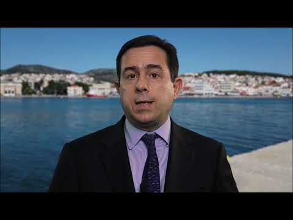

### AYS Daily Digest 14/01/2021: Contradicting Interior Minister, German authorities state no reason to block Search and Rescue vessels
#### Vaccination campaign for refugees started in Jordan // Greece requests return of 1\.540 people to Turkey // Legal organizations on Lesvos call for suspension of notifications of rejections // Updates from the ground in Moria 2\.0 // Alarm Phone publishes 6 months analysis, meanwhile 37 people are missing in the Mediterranean // Leggeri’s appearance in German Parliament committee // extended period for Dublin transfers for people in church asylum cancelled // Seebrücke helps us to better understand Frontex by subtitling ridiculous promo video — while investigations against Frontex continue

Copyright: Matthias Monroy
### German flag\-state administration sees no security flaws with SAR vessels blocked by Italian Authorities

At the end of December, the information platform FragdenStaat, together with Der Spiegel, [published a letter that was sent by the Minister of Interior Horst Seehofer to the Minister of Transport Andreas Scheuer in May](https://fragdenstaat.de/blog/2020/12/24/seehofer-scheuer-seenotrettung-brief/) \. In the letter, Seehofer urged Scheuer to find reasons for blocking civil rescue ships sailing under German flag, especially the ALAN KURDI\. Seehofer stated that the situation as it was would strain relationships with European neighbours\. Scheuer, he said, should model his response on that of Rome, which repeatedly blocked ships from leaving ports, arguing that their wastewater tanks were not big enough\.

A group of German MPs have now [received information on the matter through an information request to the German Government](https://michelbrandt.de/deutsche-flaggenstaatsverwaltung-sieht-keine-sicherheitsmaengel-bei-deutschen-rettungsschiffen-die-blockade-haelt-dennoch-an-unterstuetzt-vom-bundesinnenministerium/) \. According to the German Government, the flag\-state administration and the Foreign Office both say that the Search And Rescue \(SAR\) vessels Alan Kurdi, Sea\-Watch 3 and 4 have “all required certificates” and “no serious security flaws”\. This once again proves how Seehofer tried to block SAR operations on political grounds alone\. The whole debate over alleged missing certificates and security flaws was nothing but a manoeuvre to hinder civilian SAR operations\.

3\.331 people were rescued by civil rescue missions in the first 11 months of 2020\. Over the course of the year, Italy again and again invented reasons to hold ships in administrative detention\. [According to the information available to the German government](https://michelbrandt.de/wp-content/uploads/2021/01/KA-19-24837-DIE-LINKE_Zivile-Rettungsschiffe.pdf) , 3 ships were in administrative detention in Italy as of December 14 2020, namely the Alan Kurdi in Olbia, the Sea Watch 4 in Palermo, and the Ocean Viking in Augusta\.

The NGOs Sea\-Eye and Sea Watch both filed legal cases against the administrative detention of the Alan Kurdi and the Sea\-Watch 3 and 4\. On December 23, 2020, the Regional Administrative Court of Palermo referred the case of the Sea\-Watch to the Court of Justice of the European Union \(CJEU\) \. Courts can refer cases to the CJEU if they are unsure how to interpret and apply national laws in accordance with European Law\.
The [Sea\-Watch team is hopeful](https://sea-watch.org/en/sea-watch-case-referred-to-the-european-court-of-justice/) that the Court will finally put an end to Italy’s ongoing detention policy\.

> “We hope that the European Court of Justice’s clarification will finally end the illegitimate practice of administrative detentions used by the Italian authorities to block NGO ships\.” 

### JORDAN
#### Vaccination campaign for refugees started

In Jordan, a Covid\-19 vaccination operation for refugees started on Thursday\. One of the first UNHCR\-registered refugees to be vaccinated was a man from Iraq who is living in Irbid, in northern Jordan\.

UN High Commissioner for Refugees Grandi praised Jordan’s efforts\. He further appeals:

> “to all countries to follow suit and include refugees in their vaccination drives on par with nationals and in line with COVAX allocation principles\.” 

In Za’atari refugee camp in Jordan, the vaccination campaign has also begun\. This video promotes the vaccination, which is free of charge for everybody living in Jordan, including refugees:

■■■■■■■■■■■■■■ 
> **[Za'atari & Azraq Refugee Camps](https://twitter.com/ZaatariCamp) @ Twitter Says:** 

> > The remarkable moments must be recorded. Fatemeh and Mahmoud are the first @[Refugees](https://twitter.com/Refugees) who were vaccinated💉against covid- 19 in Jordan. Let them tell us the story and give us some advice.
Thank you 🇯🇴 for protecting everyone, @mohgovjo https://t.co/s1YkIlwqhZ 

> **Tweeted at [2021-01-15 11:34:11](https://twitter.com/ZaatariCamp/status/1350043600739065856).** 

■■■■■■■■■■■■■■ 

Read ‘Including refugees in the vaccine rollout is key to ending the pandemic’, by UNHCR, [here](https://www.unhcr.org/news/latest/2021/1/5fff1afe4/qa-including-refugees-vaccine-rollout-key-ending-pandemic.html?fbclid=IwAR2wVsa5cPhQ-1RoCru-uuH9R3puHeVytXLdkHs_dYM8XGCy0ttWw9TfeEY) \.
### GREECE
#### Migration Ministry requests return of 1,450 people to Turkey

The Greek Minister of Migration and Asylum Notis Mitarachi submitted a request to the European Commission and the EU border agency Frontex for the return of 1,450 people who received negative asylum decisions and are currently on the Aegean islands\. The return of people who get their asylum claims denied is part of the 2016 EU\-Turkey deal\. However, the numbers of returns carried out have been relatively low in the resent years\. Since March they have been down to zero, with Ankara citing the pandemic as the reason\.

In a video published by the Ministry, Mitarachi’s rhetoric ones again shows where the priorities of Greece and Europe lie these days\. He explains that Greece:

> “expects Turkey to step up its efforts under the joint agreement\. First to prevent the passage of boats departing from its shores bound for countries in the European Union and second to accept the return of migrants on the base of the joint statement\. Europe needs to establish a common mechanism to address this issue within the new Migration and Asylum Pact, as well as implementing the necessary legal and operational mechanisms for achieving returns\. In doing to it should then be possible to protect those countries at the forefront of this issue against uncontrolled migration flows whilst allowing for affecting action against the organized criminals running the smuggling networks\. “ 

Refugee Support Aegean states that Greece has in the meantime rejected claims of Syrian refugees on “safe third country” grounds, despite the clear obligation to look into the merit of these claims, and that Greece keeps people in detention despite no prospect of removal:

■■■■■■■■■■■■■■ 
> **[RSA](https://twitter.com/rspaegean) @ Twitter Says:** 

> > 1/3 Ministry of Migration &amp; Asylum requests @[EUHomeAffairs](https://twitter.com/EUHomeAffairs) to restart returns under EU-Turkey deal, after 10 months of indefinite suspension. What laws has #Greece broken in the meantime? 

> **Tweeted at [2021-01-14 14:20:47](https://twitter.com/rspaegean/status/1349723136661577734?fbclid=IwAR2H8qZVJhSZEOnkCk9HV3AZvsHCFYPURjAPR4A7YqH9Bf-DJcuIfU0LdBE).** 

■■■■■■■■■■■■■■ 

#### Legal organizations on Lesvos call to suspend notification of rejections of asylum applications

A group of nine [legal organizations, among them Legal Centre Lesvos, Fenix Humanitarian Legal Aid, RSA and the Greek Council for Refugees](https://www.fenixaid.org/post/lack-of-state-free-legal-aid-for-asylum-applicants-in-lesvos-press-release?fbclid=IwAR0AL8gr1MpwD_u2TpVg4LV7t38QTxxARb6hsmGzJLnzCouR8EaxDCpdJxE) expressed their serious concerns regarding the lack of free state legal aid for asylum applicants on Lesvos\. Since the 11th of January, the Regional Aslyum Office of Lesvos has once again begun to notify applicants on Lesvos with first instance rejections; the office has also started to accept appeals against these decisions\. However, as the signatories of the joint statement noted, these procedures were restarted without the guarantee of state free legal aid from the Register of Lawyers of the Asylum Service\. People with rejected asylum claim have a deadline of only 10 days to submit appeals\.

> “It is explicitly and emphatically reminded that the provision of free legal aid from the Register of Lawyers is an obligation of the Greek state and is clearly essential in order for the applicants to understand and exercise their legal rights and duties … It is evident that without legal aid applicants cannot adequately articulate the legal and factual grounds on which their appeals are based, particularly taking into consideration the requirement that such appeals be submitted in writing in Greek language\.” 

According to Fenix Humanitarian Legal Aid, the notification of first instance rejections has now been suspended until free legal aid is guaranteed\.
#### The situation in Moria 2\.0

We have all seen the last few days’ pictures from Moria 2\.0: with water everywhere, dixi toilets bowled over by heavy winds and tents destroyed\. According to a report from the ground published on facebook, some steps have been taken in order to improve people’s situation\. Apparently showers have been installed, and around 2000 showers with presumably hot water can be taken each day \(current population: over 7000 people\) \. There is electricity in the camp coming from generators, but each sector only has certain hours per day of electricity\. The electricity is not stable and may have spikes which can destroy power chargers\. It is not sufficient for heating devices\. There seems to be some medical support, but it is not enough, especially when it comes to mental health support\. \(Read an interview with a child psychologist on the situation in Moria 2\.0 [here](https://kurier.at/wissen/gesundheit/kinderpsychologin-auf-lesbos-achtjaehrige-versuchen-sich-umzubringen/401154246?fbclid=IwAR0FCSJXJklKZoh45LCGlmGN6GfCOm7dWBwA7v7uNOVSDbVa0gb9Ps28V5E) , in German\. Many children in Moria 2\.0 suffer from nightmares, panic attacks and heavy depression\) \. Most of the toilets in the camp are still dixies — and as we have seen from the pictures published in [Tuesday’s digest](ays-daily-digest-12-1-21-uk-stop-yarls-wood-prison-camp-f638e7f3d10b) , many of them have fallen over due to heavy winds\.
### ITALY
#### Finally some awareness about pushbacks at Italian borders

Doctors Without Borders published a video on the situation along the northern borders of Italy, where pushbacks are a daily reality\.

> “In the border cities, institutions are completely absent and reception, humanitarian assistance, medical support are left in the hands of activists and volunteers to whom MSF offers support,” 

said a spokesperson of MSF\. Find the video [here](https://video.corriere.it/cronaca/abbandonati-frontiere-storie-transito-nell-inverno-nord-italia/b455c80a-55e0-11eb-a877-0f4e7aa8047a?fbclid=IwAR3xr6_tvyNByy-GnUYIKXapDSCkeU2KGzkyUyR2Lc6hqY-FspL76KoKDwU) \(in Italian\) \.

Meanwhile, the [Italian Interior Minister Luciana Lamorgese admitted](https://www.redattoresociale.it/article/notiziario/rotta_balcanica_ancora_troppe_contraddizioni_sulle_responsabilita_italiane_ai_confini?fbclid=IwAR04gX4CiDKdWQn-eR8eijHQTsPSM5HQxQdlvCHEFyqzF__jnTgD2YA7UBk) that asylum seekers cannot be rejected at the border and that what has been called “informal readmissions” are in fact unlawful pushbacks\. People have a right to claim asylum when crossing a border\. When authorities deny this right and instead push the people back across the border, this constitutes a violation of human rights\.
#### 26 people travelled from Turkey to Salerno in a closed container

[Italian newspaper reported](https://www.avvenire.it/attualita/pagine/trovati-26-immigrati-in-due-container-appena-sbarcati?fbclid=IwAR3iAnn7naaSg5iw7nR-bIc0bjoTz8Z1c508-qRqloCGSbqrl_ebB_PNozY) that a group of 26 people, including 6 minors, was found in the port of Salerno\. They were crammed into two containers on a containership sailing under the Maltese flag that left from Aliaga, Turkey\.
### SEA
#### 6 month analysis by Alarm Phone

In the past 6 months, Alarm Phone witnessed EU authorities consistently refusing rescue obligations and instead seizing civil rescue operations\. Alarm Phone supported 172 boats\. The NGO has never before been contacted as often about shipwrecks as it has in the last 6 months\.

■■■■■■■■■■■■■■ 
> **[Alarm Phone](https://twitter.com/alarm_phone) @ Twitter Says:** 

> > 🔸Our Central Med 6 months analysis is out! 🔸

From July to December 2020, we witnessed a continuity in the creation of a #RescueGap in the Central Med, with EU authorities refusing their rescue obligations and administrative seizure of the #civilfleet. 
[alarmphone.org/en/2021/01/14/…](https://alarmphone.org/en/2021/01/14/a-struggle-for-every-single-boat/) 

> **Tweeted at [2021-01-15 08:40:39](https://twitter.com/alarm_phone/status/1349999928270008320).** 

■■■■■■■■■■■■■■ 

#### 37 people are missing at sea for 4 days

On January 10, relatives alerted Alarm Phone to a group of 37 people who left Morocco trying to reach Spain\. Since then, the Spanish sea rescue Salvamento Maritimo has been searching for them, but has refused to provide more information to Alarm Phone\. On 14 January, Alarm Phone did still not have any information about their whereabouts\.

■■■■■■■■■■■■■■ 
> **[Alarm Phone](https://twitter.com/alarm_phone) @ Twitter Says:** 

> > 37 people missing between #Morocco and #Spain! 

Yesterday, relatives alerted #AlarmPhone about 37 people who left Bouyafar, going towards Motril. There is no news about their fate. @[CGTsalvamento](https://twitter.com/CGTsalvamento) is searching by plane. As the weather is deteriorating, we fear the worst. 

> **Tweeted at [2021-01-11 12:20:21](https://twitter.com/alarm_phone/status/1348605666789875713).** 

■■■■■■■■■■■■■■ 

### GERMANY
#### Leggeri’s appearance in German Parliament

On Wednesday, Frontex head Leggeri appeared in front of the committee of the interior of the German Parliament\. The reason for his appearance was an incident in August 2020, when a boat belonging to the German federal police arrived at the scene shortly before the Greek Coast Guard forced a boat carrying refugees to return to Turkey\. Papers documenting this incident have been held back upon repeated demand of the committee of the interior\. Spokesperson of the Greens in the German Parliament and member of the committee of the interior Luise Amtsberg told the [newspaper Berliner Zeitung](https://www.berliner-zeitung.de/politik-gesellschaft/gruene-nach-anhoerung-im-innenausschuss-frontex-hat-keinerlei-interesse-an-aufklaerung-li.132294?fbclid=IwAR2DPF7Yk9ZGtR7BOJNDClkABtwyTtSg6EvnYcH4M8JhiRmMeZau_Cz1h2w) that in its internal investigations, Frontex does not take into account reports by NGOs and media\. She concludes that:

> “Frontex does not seem to have any interest in real investigation\.” 

Leggeri also repeated what he already mentioned in the [LIBE committee hearing](https://multimedia.europarl.europa.eu/en/committee-on-civil-liberties-justice-and-home-affairs_20201201-1345-COMMITTEE-LIBE_vd) at the beginning of December: that it is not clear to him when rejecting a boat with refugees and not allowing it to land is legal, and when it constitutes a pushback\. Referring to this statement, Luise Amtsberg explained that:

> “Refusing refugees is clearly prohibited under international law\. That the head of the EU border protection agency, of all people, sees room for maneuver here is scandalous\. I wonder how Leggeri can judge stakes at all on this basis\. Such an interpretation prepares the ground for human rights violations and is therefore unsustainable\.” 

More information on the current investigations against Frontex and Leggeri’s appearance in the committee can be found [here](https://www.n-tv.de/politik/Illegal-und-lebensgefaehrlich-article22289804.html?fbclid=IwAR3xr6_tvyNByy-GnUYIKXapDSCkeU2KGzkyUyR2Lc6hqY-FspL76KoKDwU) \(in German\) \.
#### Numbers on asylum application published

The numbers of asylum applications dropped in Germany for the fourth year in a row\. While [Horst Seehofer praises himself, claiming](https://www.bmi.bund.de/SharedDocs/pressemitteilungen/DE/2021/01/asylzahlen-jahr-2020.html) :

> “the recipe for success of our migration policy is humanity and order\! … Our measures to control migration are working\. We are on the right path…” 

…we all know who is paying the price for this drop in numbers\. It’s the people stuck in the mud on the Greek islands and in the snow in Lipa in Bosnia and Herzegovina, people pushed back or left adrift in the Aegean Sea, and of course all those people who died in the Mediterranean or were returned to face torture and detention in Libya\. 
While the number of applications dropped, the acceptance rate amongst people newly arrived in Germany was very low\. Meanwhile, 30% of the decisions issued by the responsible authority \(BAMF\) that were reexamined by courts were shown to be incorrect\. The case of Afghanistan provides a good example\. Most people from Afghanistan won’t get their asylum status verified\. However, in over 50% of the cases brought in front of a court, the decision of the BAMF would be rejected, improving the situation of the applicants\. 
[ProAsyl published an very good analysis](https://www.proasyl.de/news/asylzahlen-2020-zeigen-deutschland-hat-platz/?fbclid=IwAR2R7U76djWhpK5ELgG9pdw-oQNCh8afQ4RfdCSzf8_V436HUMzYzC6U3oI) of the newest data\.

At the same time as numbers of asylum applications drop, Germany does not fulfil its duties regarding the reception of people rescued in SAR missions in the Mediterranean, according to [newspapers](https://www.zeit.de/politik/2021-01/bootsfluechtlinge-migration-mittelmeer-seenotrettung-linke-deutschland?fbclid=IwAR3QIYxp_8cxGj2DDPb5VBg-9luYNkJ8V0d-GcB2YPJLFe6COTwpsuwZs1k) \. From mid\-2018 on, Germany promised to accept 1\.314 boat refugees from Malta and Italy\. However, until now, only 845 people have actually been transferred to Germany\.
#### Good News for Church Asylum\!

On Wednesday 13 January, the extension of the transfer period for Dublin church asylum was cancelled\. Usually, if a Dublin transfer can’t be carried out within 6 months, the responsibility to conduct the asylum process lies with the current host country, in this case Germany\. In Germany, some churches provide shelter for people who are subject to deportation or Dublin transfer plans in order to bridge this transfer period and therefore force the authorities to carry out the asylum process\. In these cases, the BAMF unlawfully extended the transfer period of 6 months to 18 months\. In June 2020, the federal administrative court ruled that this extension was unlawful\. This practice is now cancelled\.

More information [here](https://www.nds-fluerat.org/47863/aktuelles/bamf-hebt-sanktionen-gegen-kirchenasyl-auf/) \(in German\) \.
### FRANCE
#### Young man saved from deportation after acts of solidarity

This is what solidarity looks like\! In France, a baker went on a hunger strike in order to protest against the deportation of his apprentice\. The young man from Guinea just turned 18 and therefore lost his protected status as an unaccompanied minor\.

On Tuesday, the boy was granted a residence permit\.

Copyright: Solidarité Migrants Wilson
### DENMARK
#### Impeachment trial against former infamous Minister of immigration

In Denmark, an impeachment trial will be held against the former immigration minister Inger Støjberg, who became infamous for her hard\-line and inhumane immigration policies\.

> “Støjberg gained notoriety under the previous government after she wrote some of the European Union’s strictest immigration and asylum laws\. She’s perhaps best known outside Denmark for insisting that refugees hand over their valuables, including jewelry, when seeking asylum\. But it was Støjberg’s tough family reunification policies that [drew harsh criticism](https://www.refworld.org/pdfid/5694ed3a4.pdf) from the United Nations’ refugee agency, UNHCR, among [other groups](https://www.humanrights.dk/news/three-year-waiting-period-violates-human-rights) \.” 

Read more [here](https://www.bloomberg.com/news/articles/2021-01-14/denmark-to-start-first-impeachment-trial-in-almost-three-decades?fbclid=IwAR0HH3osno6cIbnbcKDLUfqhqLiIeCzDGkJaq-JNiu7S_if8MBP-qdlE0po) \.
### UK
#### Call for evidence on UK immigration System during pandemic

■■■■■■■■■■■■■■ 
> **[JCWI](https://twitter.com/JCWI_UK) @ Twitter Says:** 

> > We are urgently collecting evidence of how the UK immigration system has made it harder to be safe from the virus in 2020 &amp; 2021

If you're a migrant, PLEASE complete &amp; share our survey here

[forms.office.com/Pages/Response…](https://forms.office.com/Pages/ResponsePage.aspx?id=IdJQqt3wQ0SzdoniTYEtXDT0VNKwTLpPsngctHizX4NUNjNYUVJZVzhINks5MDVBTTFHWkdSU1o1WC4u) https://t.co/uE9c0dO0qA 

> **Tweeted at [2021-01-08 10:43:39](https://twitter.com/JCWI_UK/status/1347494169686781953?fbclid=IwAR17PJHBsceHflm-dPAsxynnOCeCqxPLDiKvCIn9vkVIEvIaVRmEae7tv8g).** 

■■■■■■■■■■■■■■ 

#### Crowdfunding campaign for legal action against Yarl’s Wood great success

■■■■■■■■■■■■■■ 
> **[Care4Calais](https://twitter.com/Care4Calais) @ Twitter Says:** 

> > Amazing news! Our crowdfunder for legal action to stop asylum seeker accommodation at Yarls Wood totally smashed its target in 48 hours!  

Humanity at its finest - wonderful to see so many ready to stand up for what is right. https://t.co/yk9FLkgN6T 

> **Tweeted at [2021-01-14 09:42:44](https://twitter.com/Care4Calais/status/1349653166221107200?fbclid=IwAR0joVxHJWT508-RRNCnOsd5RjpGvcZE__jQY_n6_bFtH81PQ4MQ9oKX2qE).** 

■■■■■■■■■■■■■■ 

As we reported in [Tuesday’s digest](ays-daily-digest-12-1-21-uk-stop-yarls-wood-prison-camp-f638e7f3d10b) , the Home Office is using emergency planning regulations to rush through plans to house vulnerable asylum seekers in portacabins on wasteland next to Yarl’s Wood Immigration Removal Centre\. A group of NGOS also started a petition against these plans\. According to the NGOs, the facilities at Yarl’s Wood have a problematic history, including misconduct and abuse against female detainees\.

Sign the Petition here:

#### Napier and Penally barracks

In both the Napier and the Penally barracks, living conditions during the pandemic are unfit to say the least\.

In the [Napier Barracks](https://morningstaronline.co.uk/article/b/unbearable-refugee-camp-at-crisis-point?fbclid=IwAR2R7U76djWhpK5ELgG9pdw-oQNCh8afQ4RfdCSzf8_V436HUMzYzC6U3oI) , people went on a hunger strike on Monday to protest the conditions\. 34 people share one toilet and one shower, and 14 people share one room\.

Similar protests also took place at the Penally camp, which is also housing people who crossed the channel by boat\. [According to BBC](https://www.bbc.com/news/uk-wales-55650508?fbclid=IwAR2xCBp4X_LVNq_BweGVunfJQItNxRkJmUEQ32elXBJI0OFaiHoxHgbD8hs) :

> “Video footage and photographs of the camp … show bathroom floors covered with water, every toilet in one bathroom blocked, beds in communal rooms less than 2m \(6ft\) apart and a bathroom where all the soap dispensers are empty\.” 

### FRONTEX

Finally a promo video that speaks the truth\! \(thanks to Seebrücke for translating what Frontex does not dare to say…\)

■■■■■■■■■■■■■■ 
> **[Seebrücke International](https://twitter.com/Seebruecke_intl) @ Twitter Says:** 

> > #Frontex in substance - now with the name on it. https://t.co/mmzBZMKwbl 

> **Tweeted at [2021-01-14 08:34:00](https://twitter.com/Seebruecke_intl/status/1349635869477634050?fbclid=IwAR2JzW-TlGiW87JWsGsaLkMVZvRkMUMyzC5R5J-y27dDhqBLIY2LU1MEeCY).** 

■■■■■■■■■■■■■■ 

As we reported, the **European Anti Fraud Office \(OLAF\) is also investigating Frontex\.** [According to the newspaper Politico](https://www.politico.eu/article/olaf-opens-investigation-on-frontex-for-allegations-of-pushbacks-and-misconduct/) , which references anonymous EU officers,

> “ The investigators are looking into allegations of harassment and misconduct that have led some officials, including at a very senior level, to leave the agency in recent months\.” 

OLAF is also looking into allegations of pushbacks\.

Meanwhile the price of **FRONTEX’s new headquarters** in Warsaw has been announced\. The new building is supposed to cost about 120 Million euros\.

■■■■■■■■■■■■■■ 
> **[Matthias Monroy (@Mastodon)](https://twitter.com/matthimon) @ Twitter Says:** 

> > #Frontex baut sich in Warschau ein eigenes Hauptquartier, die Ausschreibung ist jetzt veröffentlicht. 
Demnach kostet das Gebäude mindestens 120 Millionen Euro:
[ted.europa.eu/udl?uri=TED:NO…](https://ted.europa.eu/udl?uri=TED:NOTICE:592291-2020:TEXT:EN:HTML&src=0&tabId=1) https://t.co/9gRqz2QzuV 

> **Tweeted at [2021-01-14 20:15:53](https://twitter.com/matthimon/status/1349812503245512704?fbclid=IwAR1Q6pLnNe0Hnl0wl3F3NEEotFZI7479BFClBIDYMcqXgKKkT-iTHNgfIL4).** 

■■■■■■■■■■■■■■ 

### EU
#### European Court of Justice ruling on deportation of unaccompanied minors

The [European Court of Justice ruled on Thursday](https://curia.europa.eu/jcms/upload/docs/application/pdf/2021-01/cp210005en.pdf) that unaccompanied minors may only be sent back to their country of origin if there were “adequate reception facilities” to meet them\. Otherwise, the court said, they should be allowed to stay\.

More information:

**Find daily updates and special reports on our [Medium page](https://medium.com/are-you-syrious) \.**

**If you wish to contribute, either by writing a report or a story, or by joining the info gathering team, please let us know\.**

**We strive to echo correct news from the ground through collaboration and fairness\. Every effort has been made to credit organisations and individuals with regard to the supply of information, video, and photo material \(in cases where the source wanted to be accredited\) \. Please notify us regarding corrections\.**

**If there’s anything you want to share or comment, contact us through Facebook, Twitter or write to: areyousyrious@gmail\.com**

_Converted [Medium Post](https://medium.com/are-you-syrious/ays-daily-digest-14-01-2021-german-authorities-see-no-reasons-for-blocking-sar-boats-3a682b18f626) by [ZMediumToMarkdown](https://github.com/ZhgChgLi/ZMediumToMarkdown)._
