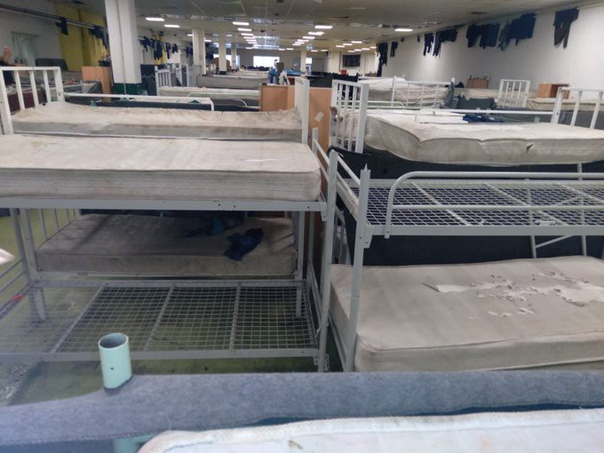

### AYS Daily Digest 15/1/21: “Laye has been regularised”
#### Baker’s apprentice gets residence permit in France // Disturbingly poor conditions in official camps across Serbia // More places of detainment and despair in UK

](assets/356cbb77743a/1*YHpB5KdluPLoxDodvUKCJg.jpeg)

Stéphan Ravacley and Laye Fodé Traoré will bake together in future\. Mr\. Traoré has now got a residence permit\. Credits: [Twitter/Africaisthefuture](https://twitter.com/Mokobe113/status/1347064843707281415/photo/1)
#### FEATURED
#### Apprentince allowed to stay

His hunger strike even led him into hospital, ten days without food — only broth — were a tough time for Stéphane Ravacley\. But the baker’s protest was successful: his apprentice is allowed to stay in France\. He will not be deported, several media outlets are [reporting](https://www.connexionfrance.com/French-news/French-baker-stops-hunger-strike-as-trainee-given-right-to-stay-in-France) \.

> Laye has been regularised\! He is coming back to work on Tuesday\! 

This according to Ravacley after a meeting with the prefecture in Haute\-Sâone, which was supposed to come later on January 26th\.

Laye Fodé Traoré, from Guinea, had been training for 18 months in the bakery in Besançon\. When he turned 18, he received his deportation order, given because he was no longer an unaccompanied minor and so was not eligible for the same protections\. Two years after his arrival in France, during which time he learned the language and found his apprenticeship, he was informed that he was at risk of being forcibly returned to his country of origin, Guinea\.

Mr\. Traoré contested the decision with the support of his employer the baker, and backed by 230,000 signees of a petition\. Celebrities also published an open letter in a weekly magazine, urging President Macron to let him stay and provide a fair decision\.

The prefecture has now said that the boy was initially denied a residence permit, as they feared his documents were not authentic\. They have since been validated by the Guinean embassy in France, however\.

Although this case has a positive ending, Ravacley wants to shift the focus to the systematic failure of deporting former underaged people\. “It is a great joy and a victory\. Now we are going to fight for the others”, the baker said\.
#### SEA

After several days at sea, there is still no news about the missing 37 people who left Morocco on January 10, nor about the 35 who left attempting to reach the Canary islands two days after that\.

More on the arrivals to the Canary islands in this story:

Alarm Phone [reported](https://twitter.com/alarm_phone/status/1350095064949784583?s=20) more missing people in the Mediterranean — “Over the past days, 6 people tried repeatedly to enter Melilla by swimming\. A survivor informed us that 2 of them went missing in Spanish waters on January 13\. Local police refuse to give any info if they were found and survived\! Friends and relatives of the missing demand answers\!”

In the meantime, rescue boat ‘Salvamar Mizart’ has rescued a dinghy with 55 people on board about 50 kilometers southeast of the island of Fuerteventura\.
#### BALKAN ROUTE

The BVMN has published a new report documenting and analysing pushbacks, among other events:
- Tri\-border pushbacks from Bulgaria to Turkey
- Expulsion of transit groups from Lesvos
- Fire pits used by the Croatian police
- The burning of camp Lipa in Bosnia\-Herzegovina
- Legal proceedings against Croatia and Hungary
- Gateway removals near Idomeni

In Serbia, very poor conditions are constantly documented in the official camps across the country\. These reports often have little practical impact, apart from groups sometimes being moved from more crowded to the less full camps in different regions\. Unfortunately, not much is being done to change the current conditions\.

Photo: APC

Asylum Protection Centre has once again warned about the worrying standards in which people are being kept, in the middle of the pandemic, including dirty facilities, bad food, dirty blankets, lack of hygiene and other basic amenities, contributing to a health hazard that results in numerous scabies cases and other health issues for the people staying there\. People from the north of the country are constantly being sent to this camp, as well as those from Belgrade, APC report\. In the last intervention at the Bogovađa camp, some of the unaccompanied minors were also directed to Preševo camp\.

Across Bosnia and Herzegovina, people continue to freeze as temperatures reach as low as \-13 in some areas\. In the forests around the Lipa provisional camp, Bihać, and Velika Kladuša, several hundreds are staying in makeshift camps and abandoned buildings that provide no shelter or protection\. The state and the international network of strongest stakeholders provide no sustainable protection for the people, apart from occasional kit distribution and such minor efforts\. The ongoing political resistance prevents access to accommodation for those sleeping rough, and more often than not, also to those wishing to report about them\.

■■■■■■■■■■■■■■ 
> **[Danish Refugee Council - Bosnia and Herzegovina](https://twitter.com/drcbih) @ Twitter Says:** 

> > In the improvised tent settlement in #Šiljkovača 95 single man, live exposed to the #harshweather without access to the clean #water and toilet, while in Bosanska Bojna 11 families live in the conditions which are not in the line with the minimum of #humanitarianstandards. https://t.co/H55OL7ykWi 

> **Tweeted at [2021-01-15 14:53:42](https://twitter.com/drcbih/status/1350093811297492992?s=20).** 

■■■■■■■■■■■■■■ 

#### UK
### More places of detainment and despair

Before the pandemic, there was already an alarming number of reports of people being held in detention in prison\-like conditions across the UK\. Now, the number of such places is growing, and the conditions are rapidly deteriorating, as both treatment and official policies go astray\. The Norfolk site has not received as much scrutiny as two similar facilities, Napier Barracks in Kent and Penally Barracks in Pembrokeshire, but it has emerged that there have been similar concerns over the set\-up at RAF Coltishall, with people familiar with the site claiming there have been issues with lack of information, food quality and access to medical care including dentistry, as well as suicide attempts and hunger strikes\. As in other centres across Europe, the people running the site are using COVID\-19 to refuse entrance to volunteers, but this has been an ongoing policy from before the recent peak in coronavirus cases\. “It’s not been a welcoming community”, volunteers are [reported](https://www.theguardian.com/uk-news/2021/jan/14/asylum-seeker-housing-conditions-under-scrutiny-third-uk-military-site-raf-coltishall-norfolk-?CMP=Share_iOSApp_Other&fbclid=IwAR2duv0aoUbHwBn7EOHscafjKNwAxEJbC36lNgLkEtoE7iEnm2owShtF2f4) to have said of the new site\.

At the same time, following the protests at the Penally, Home Secretary Priti Patel has insisted the camp is ‘safe and habitable’, despite claims of an in\-camp hunger strike and residents’ illness over inadequate nutrition and poor conditions\.
#### WORTH READING
- “More than four years since we [coined](https://www.opendemocracy.net/en/mediterranean-journeys-in-hope/refugees-displacement-and-europ/) and [developed](https://www.opendemocracy.net/en/mediterranean-journeys-in-hope/calais-demolition-mission-accom/) the notion of ‘politics of exhaustion’ in the context of the so\-called Calais ‘Jungle’ camp in northern France, we come together again to reflect on the ways in which the concept has been mobilised to analyse, diagnose and make sense of practices of control and resistance in Europe’s borderlands”:

- Young people’s stories \(in German\):

- “In northeastern Bosnia\-Herzegovina, hundreds of migrants and their children live hidden away in the woods near the country’s border with EU\-member state Croatia\. There, they have little shelter in the midst of the country’s harsh winter months, surviving from day to day\. There’s no housing, no healthcare, no school\.” :

[](https://l.facebook.com/l.php?u=https%3A%2F%2Fwww.infomigrants.net%2Fen%2Fpost%2F29680%2Fno-hope-for-migrant-children-playing-the-game-in-bosnia%3Ffbclid%3DIwAR2j9tFOmQlYOSO-S5whZd9pvGXdz1fpsfjDQLDkWyUh1AzNa9U5EEPIC8U&h=AT21f0q104Ync0PlQ81GmC5Ur4lVS3BoLk12POjpT-f912kMh1y6Z4e-dEWzrzHdSa9wZB7MeZoLjLJaRnMzxEhVcvxAvf0_wbBZcIM_yzGA1xBlVLdif6IW5HG-waNvwM0UOXsaubn74A&__tn__=R]-R&c[0]=AT2E79Rxrdu0VI3cXgPZCdzvMR5Qb5SS8FK5If1Ow7F0Mbj3P64ki10I4KeHrgwfujyQYEYWQGmHE9Qh10Pk39L4-pmrkLaZm4OVuO0lYbMSNKMabqKdtdtBg0qaKiTbpxkh8HIJMDk63DIodLPUQbCI8Hj0_ucFA2RSi7qtZ_KtYC0OXhTgAAzgWlg9moktCsP8b1FFvH0)

### Austria

Activists will occupy public spaces in Vienna and Innsbruck with tents to raise awareness for the situation of tens of thousands of people stuck in Greece and Bosnia\. In Innsbruck, a group has been continuing this action since Christmas\.

**Find daily updates and special reports on our [Medium page](https://medium.com/are-you-syrious) \.**

**If you wish to contribute, either by writing a report or a story, or by joining the info gathering team, please let us know\.**

**We strive to echo correct news from the ground through collaboration and fairness\. Every effort has been made to credit organisations and individuals with regard to the supply of information, video, and photo material \(in cases where the source wanted to be accredited\) \. Please notify us regarding corrections\.**

**If there’s anything you want to share or comment, contact us through Facebook, Twitter or write to: areyousyrious@gmail\.com**

_Converted [Medium Post](https://medium.com/are-you-syrious/ays-daily-digest-15-1-21-laye-has-been-regularised-356cbb77743a) by [ZMediumToMarkdown](https://github.com/ZhgChgLi/ZMediumToMarkdown)._
